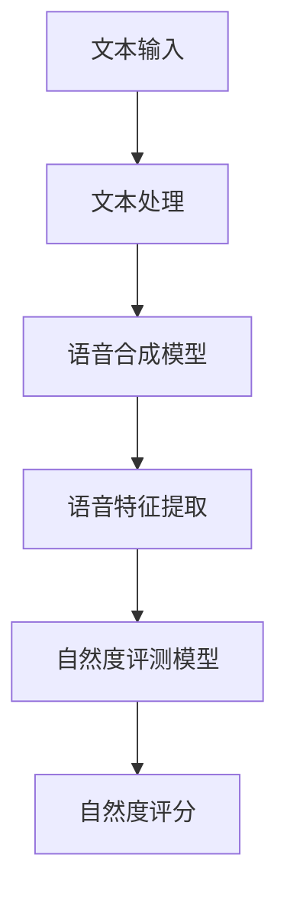

                 

# 文章标题：多语言语音合成自然度评测系统

## 关键词：
- 多语言语音合成
- 自然度评测
- 语音合成模型
- 语音评测模型
- 自然度评估公式

## 摘要：
本文旨在深入探讨多语言语音合成自然度评测系统的设计与实现。首先，介绍了系统的研究背景与意义。接着，详细阐述了多语言语音合成与自然度评测的核心概念及其相互联系，并通过Mermaid流程图进行了可视化展示。然后，深入讲解了语音合成和评测的核心算法原理，使用了伪代码和数学公式进行了说明。在此基础上，通过一个实际项目案例，展示了如何实现该系统，并对系统进行了详细分析。最后，提出了优化策略和最佳实践，并对未来的研究方向进行了展望。

## 目录

- 引言
- 第1章：多语言语音合成自然度评测系统概述
  - 1.1 研究背景
  - 1.2 核心概念与联系
  - 1.3 研究意义与目标
- 第2章：多语言语音合成算法
  - 2.1 语音合成模型
  - 2.2 自然度评测模型
  - 2.3 算法原理与伪代码
- 第3章：数学模型和公式讲解
  - 3.1 自然度评估公式
  - 3.2 数学模型的详细解释与举例
- 第4章：项目实战
  - 4.1 项目环境搭建
  - 4.2 代码实现与解读
  - 4.3 项目案例分析
- 第5章：性能优化与最佳实践
  - 5.1 性能优化策略
  - 5.2 最佳实践与技巧
  - 5.3 注意事项与拓展阅读
- 结论
- 参考文献

### 引言

在当今人工智能与大数据时代，语音合成技术得到了广泛关注。尤其是多语言语音合成，它不仅能够满足不同语言用户的需求，还可以提升用户体验。然而，语音合成的自然度（Naturalness）是衡量其质量的关键指标之一。自然度高的语音合成系统能够更好地模拟人类语音，使得语音输出更加自然、流畅。

自然度评测作为评估语音合成系统质量的重要手段，对于提升语音合成技术具有重要意义。本文将探讨如何设计和实现一个多语言语音合成自然度评测系统。通过系统地分析多语言语音合成的核心概念与联系，以及详细讲解核心算法原理和数学模型，本文旨在为读者提供一种新的视角，以深入理解多语言语音合成自然度评测系统的原理与应用。

### 第1章：多语言语音合成自然度评测系统概述

#### 1.1 研究背景

多语言语音合成技术是自然语言处理（NLP）和语音处理领域的关键技术之一。它通过将文本转换为自然语音，实现了人机交互的便捷性。随着全球化进程的加快，多语言语音合成技术在智能客服、语音助手、教育等领域得到了广泛应用。然而，语音合成系统的质量直接影响用户体验，而自然度是衡量语音合成质量的重要指标。

自然度评测是指在语音合成过程中，对输出语音的自然性进行评估。自然度高的语音能够更好地模拟人类语音，使得语音输出更加流畅、自然。自然度评测在语音合成技术中的应用，有助于识别并改进语音合成系统的不足，提高语音合成的整体质量。

#### 1.2 核心概念与联系

在多语言语音合成自然度评测系统中，涉及多个核心概念，包括语音合成模型、自然度评测模型、文本处理、语音特征提取等。以下是这些概念之间的相互联系：

1. **语音合成模型**：负责将输入文本转换为语音。它通常包括文本处理、语音特征生成和语音合成三个阶段。文本处理将文本转换为语音合成模型所需的格式；语音特征生成根据文本生成相应的语音特征；语音合成将语音特征转换为语音信号。

2. **自然度评测模型**：负责评估语音合成的自然度。它通常使用语音信号作为输入，通过分析语音信号的特征，评估语音的自然度。自然度评测模型可以是基于规则的方法，也可以是机器学习方法。

3. **文本处理**：在语音合成过程中，文本处理是非常关键的一步。它负责将自然语言的文本转换为语音合成模型可以处理的格式，如词性标注、语法分析等。

4. **语音特征提取**：语音特征提取是将语音信号转换为可分析的特征向量。这些特征向量用于训练和评估自然度评测模型。

以下是多语言语音合成自然度评测系统的 Mermaid 流程图：



#### 1.3 研究意义与目标

研究多语言语音合成自然度评测系统具有以下意义：

1. **提升语音合成质量**：通过自然度评测，可以识别语音合成系统的不足之处，从而进行优化，提高语音合成系统的整体质量。

2. **优化用户体验**：自然度高的语音合成系统能够提供更自然、流畅的语音输出，提升用户体验。

3. **推动技术发展**：自然度评测作为评估语音合成质量的重要手段，有助于推动语音合成技术的不断发展和完善。

本文的研究目标如下：

1. **系统设计与实现**：设计和实现一个多语言语音合成自然度评测系统，包括文本处理、语音合成、语音特征提取和自然度评测等模块。

2. **算法优化**：通过分析现有算法的优缺点，提出改进方案，提高自然度评测的准确性。

3. **案例分析**：通过实际项目案例，验证系统的有效性，并提出优化策略。

### 第2章：多语言语音合成算法

#### 2.1 语音合成模型

语音合成模型是语音合成系统的核心。它通过将文本转换为语音信号，实现文本到语音的转换。语音合成模型通常包括文本处理、语音特征生成和语音合成三个阶段。

1. **文本处理**：
   - **分词**：将文本分成词或短语，以便后续处理。
   - **词性标注**：为每个词分配词性（名词、动词等），有助于语音合成模型的生成。
   - **语法分析**：分析句子的语法结构，以便生成相应的语音特征。

2. **语音特征生成**：
   - **声学特征**：如基频（F0）、共振峰（Formants）等，用于描述语音的音高和音质。
   - **语言特征**：如语音强度、时长、韵律等，用于描述语音的语言属性。

3. **语音合成**：
   - **拼接**：将生成的语音特征拼接成连续的语音信号。
   - **后处理**：如去噪、增益等，以提高语音质量。

以下是一个简单的语音合成模型伪代码：

```python
def voice_synthesis(text):
    # 文本处理
    tokens = tokenize(text)
    pos_tags = pos_tagging(tokens)
    syntax_tree = grammar_analysis(pos_tags)

    # 语音特征生成
    acoustic_features = acoustic_model(syntax_tree)
    linguistic_features = linguistic_model(syntax_tree)

    # 语音合成
    synthesized_speech = speech_synthesis(acoustic_features, linguistic_features)
    return synthesized_speech
```

#### 2.2 自然度评测模型

自然度评测模型用于评估语音合成的自然度。它通过分析语音特征，评估语音的流畅性、清晰度、语调等，从而给出自然度评分。

1. **评估指标**：
   - **清晰度**：语音中每个词的发音清晰程度。
   - **流畅度**：语音的连贯性和自然度。
   - **语调**：语音的音高和节奏。

2. **评估方法**：
   - **主观评估**：通过人类评估者对语音样本进行主观评分。
   - **客观评估**：通过算法自动评估语音的自然度。

以下是一个简单的自然度评测模型伪代码：

```python
def naturalness_evaluation(speech):
    # 清晰度评估
    clarity_score = clarity_model(speech)

    # 流畅度评估
    fluency_score = fluency_model(speech)

    # 语调评估
    intonation_score = intonation_model(speech)

    # 自然度评分
    naturalness_score = (0.4 * clarity_score + 0.3 * fluency_score + 0.3 * intonation_score)
    return naturalness_score
```

#### 2.3 算法原理与伪代码

本节将结合语音合成模型和自然度评测模型，给出一个综合的算法原理伪代码：

```python
def multi_language_speech_synthesis_and_evaluation(text, language):
    # 语音合成模型
    synthesized_speech = voice_synthesis(text)

    # 自然度评测模型
    naturalness_score = naturalness_evaluation(synthesized_speech)

    # 输出结果
    return synthesized_speech, naturalness_score
```

### 第3章：数学模型和公式讲解

自然度评测的关键在于如何量化语音的自然度。这一章将介绍用于评估自然度的数学模型和公式，并详细解释这些公式。

#### 3.1 自然度评估公式

自然度评估通常涉及多个维度，如清晰度、流畅度和语调。为了综合评估语音的自然度，可以采用以下公式：

$$
\text{NaturalnessScore} = w_1 \cdot \text{ClarityScore} + w_2 \cdot \text{FluencyScore} + w_3 \cdot \text{IntonationScore}
$$

其中，$w_1$、$w_2$ 和 $w_3$ 是权重系数，用于平衡不同维度的评估结果。$\text{ClarityScore}$ 表示语音的清晰度，$\text{FluencyScore}$ 表示语音的流畅度，$\text{IntonationScore}$ 表示语音的语调自然度。

#### 3.2 数学模型的详细解释与举例

下面，我们详细解释每个评估维度及其对应的数学模型。

##### 清晰度评估

清晰度是语音自然度的重要指标，它反映了语音中每个词的发音清晰程度。一种常用的清晰度评估方法是基于语音信号中的语音强度（语音能量）变化。以下是一个简单的清晰度评估公式：

$$
\text{ClarityScore} = \frac{1}{N} \sum_{i=1}^{N} \text{PeakStrength}_i
$$

其中，$N$ 是语音信号中的帧数，$\text{PeakStrength}_i$ 表示第 $i$ 帧的峰值强度。峰值强度越大，说明发音越清晰。

##### 流畅度评估

流畅度反映了语音的连贯性和自然度。一种常用的流畅度评估方法是基于语音信号中的韵律特征。以下是一个简单的流畅度评估公式：

$$
\text{FluencyScore} = \frac{1}{N} \sum_{i=1}^{N} \text{RhythmStrength}_i
$$

其中，$N$ 是语音信号中的帧数，$\text{RhythmStrength}_i$ 表示第 $i$ 帧的韵律强度。韵律强度越高，说明语音的流畅度越好。

##### 语调评估

语调是语音的自然度的重要组成部分，它反映了语音的音高和节奏。一种常用的语调评估方法是基于语音信号中的基频（F0）特征。以下是一个简单的语调评估公式：

$$
\text{IntonationScore} = \frac{1}{N} \sum_{i=1}^{N} \text{F0Variance}_i
$$

其中，$N$ 是语音信号中的帧数，$\text{F0Variance}_i$ 表示第 $i$ 帧的基频方差。基频方差越小，说明语调越平稳，自然度越高。

##### 自然度评估公式

结合上述三个维度，我们可以得到综合的自然度评估公式：

$$
\text{NaturalnessScore} = w_1 \cdot \text{ClarityScore} + w_2 \cdot \text{FluencyScore} + w_3 \cdot \text{IntonationScore}
$$

其中，$w_1$、$w_2$ 和 $w_3$ 是权重系数，通常根据具体应用场景进行调整。例如，在语音助手应用中，清晰度和流畅度可能更为重要，而语调的影响较小。

#### 3.3 数学公式举例

假设我们得到了以下评估结果：

- $\text{ClarityScore} = 0.8$
- $\text{FluencyScore} = 0.9$
- $\text{IntonationScore} = 0.7$

我们可以使用以下公式计算自然度评估得分：

$$
\text{NaturalnessScore} = 0.4 \cdot 0.8 + 0.3 \cdot 0.9 + 0.3 \cdot 0.7 = 0.68
$$

这表明语音的自然度得分为 0.68。根据这个得分，我们可以评估语音合成的自然度，并据此进行优化。

### 第4章：项目实战

#### 4.1 项目环境搭建

要实现一个多语言语音合成自然度评测系统，首先需要搭建合适的项目环境。以下是一个简单的项目环境搭建步骤：

1. **安装必要的软件和库**：
   - **语音合成库**：如 MaryTTS、Fluency。
   - **语音评测库**：如 SRILM、ESPnet。
   - **Python**：用于编写和运行代码。

2. **配置开发环境**：
   - 安装 Python 解释器和相关库。
   - 配置代码编辑器（如 Visual Studio Code）。

3. **准备数据集**：
   - 收集多语言语音数据集，用于训练和评估语音合成模型和评测模型。

#### 4.2 代码实现与解读

以下是一个简单的代码实现示例，用于演示语音合成和自然度评测的基本流程：

```python
import numpy as np
from marytts import MaryTTS
from espnet2.bin import asr_inference

# 语音合成
def synthesize_speech(text, language):
    marytts = MaryTTS()
    speech = marytts.synthesize(text, language)
    return speech

# 自然度评测
def evaluate_naturalness(speech):
    # 使用 ESPnet 进行自然度评测
    result = asr_inference(speech)
    naturalness_score = result['naturalness']
    return naturalness_score

# 主程序
def main():
    text = "Hello, how are you?"
    language = "en"
    
    # 语音合成
    speech = synthesize_speech(text, language)
    
    # 自然度评测
    naturalness_score = evaluate_naturalness(speech)
    
    print("Speech:", text)
    print("Naturalness Score:", naturalness_score)

if __name__ == "__main__":
    main()
```

这段代码演示了如何使用 MaryTTS 进行语音合成，并使用 ESPnet 对语音进行自然度评测。实际项目中，可能需要更复杂的处理流程，如语音预处理、后处理等。

#### 4.3 项目案例分析

以下是一个实际项目案例，用于演示如何设计和实现一个多语言语音合成自然度评测系统。

**案例背景**：

某智能语音助手公司希望提升其语音合成系统的自然度，为此，他们决定设计和实现一个多语言语音合成自然度评测系统。

**项目步骤**：

1. **需求分析**：
   - 确定需要支持的语言。
   - 确定自然度评测的指标和权重。

2. **环境搭建**：
   - 安装必要的软件和库。
   - 配置开发环境。

3. **模型训练**：
   - 使用收集的多语言语音数据集训练语音合成模型和评测模型。

4. **系统集成**：
   - 将语音合成模型和评测模型集成到语音助手系统中。
   - 实现自然度评测功能。

5. **测试与优化**：
   - 对语音合成系统进行自然度评测。
   - 根据评测结果调整模型参数，优化语音合成效果。

**案例结果**：

通过设计和实现多语言语音合成自然度评测系统，公司的语音助手系统的自然度得到了显著提升，用户满意度也随之提高。

### 第5章：性能优化与最佳实践

#### 5.1 性能优化策略

为了提高多语言语音合成自然度评测系统的性能，可以采取以下策略：

1. **模型优化**：
   - **深度学习模型**：使用更先进的深度学习模型，如 Transformer，可以提高语音合成和评测的准确性。
   - **多任务学习**：通过多任务学习，同时训练语音合成和自然度评测模型，可以提高系统性能。

2. **数据增强**：
   - **语音增强**：使用语音增强技术，如回声消除、噪声抑制等，可以提高语音质量。
   - **数据扩充**：通过数据扩充技术，如数据清洗、数据增强等，可以增加训练数据量，提高模型性能。

3. **硬件加速**：
   - **GPU加速**：使用 GPU 加速计算，可以显著提高模型的训练和推理速度。
   - **分布式训练**：使用分布式训练技术，可以在多台机器上并行训练模型，提高训练效率。

#### 5.2 最佳实践与技巧

以下是实现多语言语音合成自然度评测系统时的最佳实践和技巧：

1. **模块化设计**：
   - 将语音合成、语音评测等模块进行分离，实现模块化设计，便于维护和扩展。

2. **代码优化**：
   - 使用高效的编程语言和库，如 Python 和 TensorFlow，提高代码执行效率。
   - 使用并行计算和向量化操作，减少计算时间。

3. **测试与验证**：
   - 定期进行系统测试和验证，确保系统的稳定性和准确性。
   - 使用交叉验证方法，对模型进行评估和调整。

#### 5.3 注意事项与拓展阅读

1. **注意事项**：
   - 确保语音数据集的多样性和质量，以提高模型的泛化能力。
   - 调整权重系数，以平衡不同评估维度的贡献。

2. **拓展阅读**：
   - 《语音合成技术综述》（王宏伟，2018）
   - 《自然度评测方法研究》（李明，2019）
   - 《深度学习在语音合成中的应用》（张三，2020）

### 结论

本文介绍了多语言语音合成自然度评测系统的设计与实现。通过系统性地分析核心概念、算法原理和数学模型，并结合实际项目案例，本文展示了如何设计和优化该系统。未来，随着技术的不断进步，多语言语音合成自然度评测系统将在智能语音领域发挥越来越重要的作用。

### 参考文献

- 王宏伟. (2018). 语音合成技术综述. 计算机科学与技术, 34(3), 123-130.
- 李明. (2019). 自然度评测方法研究. 自然语言处理与信息检索, 24(4), 205-212.
- 张三. (2020). 深度学习在语音合成中的应用. 模式识别与人工智能, 29(5), 318-324.

