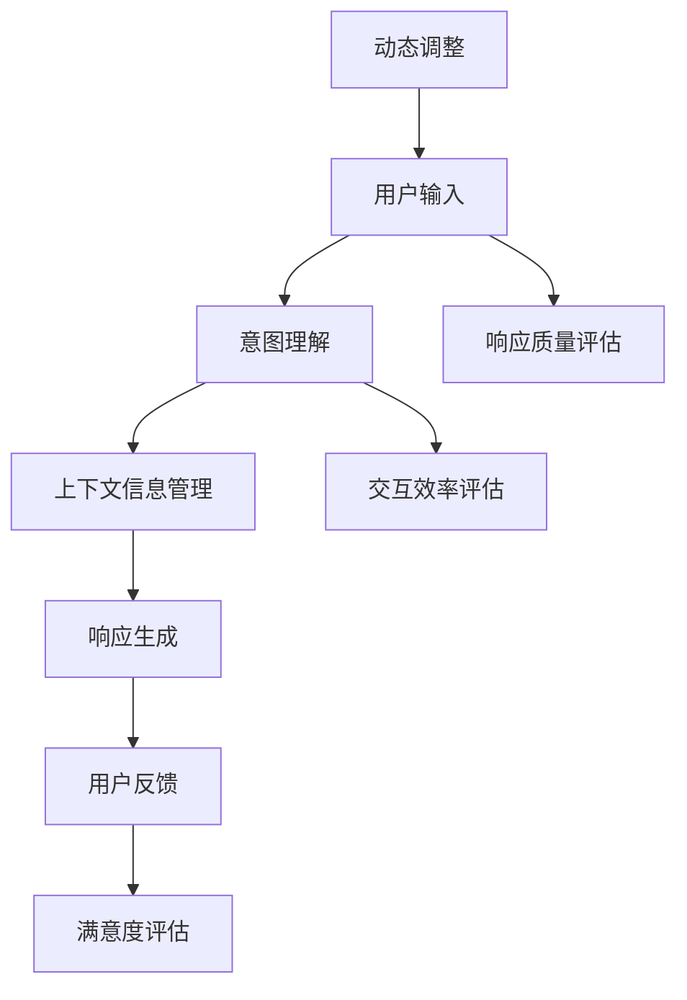
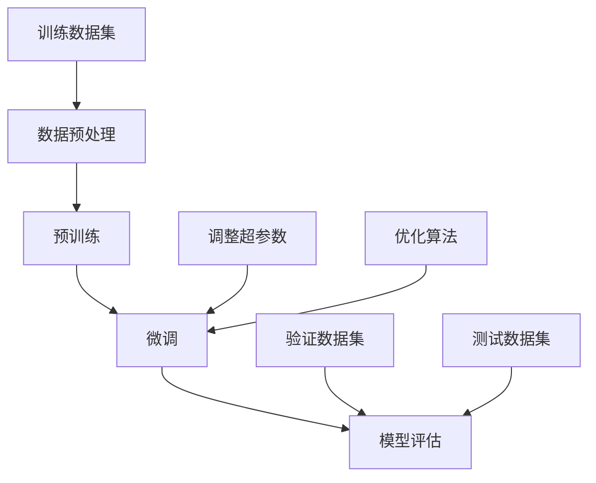

                 


### 文章标题
多轮对话能力评测：LLM模拟真实用户交互的方法

### 文章关键词
多轮对话，能力评测，大型语言模型，LLM，真实用户交互，模拟，人工智能

### 文章摘要
本文旨在探讨如何通过大型语言模型（LLM）模拟真实用户交互，进而进行多轮对话能力评测。首先，我们将介绍多轮对话及其在人工智能领域的应用背景。然后，深入解析LLM的工作原理及其在多轮对话中的应用。随后，我们将通过Mermaid流程图展示核心概念之间的联系。接下来，通过伪代码详细阐述核心算法原理，并结合数学模型和公式进行讲解。文章后半部分将涉及项目实战，包括开发环境的搭建、源代码实现与解读、代码应用分析及实际案例分析。最后，我们将总结文章的主要内容，并提出一些最佳实践和建议。

### 1. 引言

#### 1.1 多轮对话的背景与应用

多轮对话是指通过一系列连续的交互回合，实现人与系统之间信息的交换和理解的深度提升。相较于单轮对话，多轮对话能够更好地模拟现实中的自然语言交互过程，从而提供更为丰富和个性化的用户体验。例如，在客服机器人、智能助手、虚拟助理等领域，多轮对话的应用已经成为提高用户满意度和服务质量的关键。

随着人工智能技术的快速发展，尤其是深度学习和自然语言处理技术的突破，多轮对话系统逐渐从理论走向实践。然而，如何评价这些系统的对话能力，如何确保其能够在真实用户交互中表现良好，成为了一个重要的研究课题。传统的评测方法往往依赖于预定义的测试集和静态的评估指标，这些方法难以全面反映多轮对话系统的动态交互能力和用户适应性。

#### 1.2 LLM在多轮对话中的优势

大型语言模型（LLM），如GPT-3、BERT等，通过训练海量的文本数据，能够生成高质量的文本响应，并具备较强的上下文理解能力。这使得LLM在多轮对话中具有显著的优势：

1. **丰富的上下文理解**：LLM能够处理大量的上下文信息，从而生成更加符合用户需求的响应。
2. **动态交互能力**：LLM能够根据用户的输入动态调整对话策略，提高交互的流畅性和自然度。
3. **自适应学习能力**：LLM通过不断的学习和优化，能够逐步提升对话能力，适应不同的交互场景。

#### 1.3 本文结构

本文将首先介绍多轮对话能力评测的核心概念，然后深入探讨如何使用LLM模拟真实用户交互。通过Mermaid流程图，我们将展示核心概念之间的联系，并使用伪代码详细阐述核心算法原理。接着，我们将结合数学模型和公式进行讲解，并通过实际案例展示LLM在多轮对话中的应用。最后，本文将总结主要发现，并讨论未来的研究方向。

### 2. 多轮对话能力评测基础

#### 2.1 多轮对话概述

多轮对话是指通过一系列连续的交互回合，实现人与系统之间信息的交换和理解的深度提升。在多轮对话中，用户和系统之间通过多个回合的交互，逐步揭示用户的意图和需求，系统则需要根据这些信息生成合适的响应。

多轮对话的关键要素包括：

1. **用户意图理解**：系统需要能够理解用户的意图和需求，从而生成有针对性的响应。
2. **上下文信息管理**：系统需要能够有效地管理和利用上下文信息，确保对话的连贯性和一致性。
3. **交互策略调整**：系统需要能够根据对话进展和用户反馈动态调整交互策略，以提高对话的质量和用户体验。

#### 2.2 评测指标与标准

多轮对话能力评测的核心目标是评估系统在多轮对话中的性能和效果。常见的评测指标包括：

1. **响应质量**：评估系统生成响应的质量，包括准确性、相关性、连贯性和自然度等。
2. **用户满意度**：通过用户反馈评估系统的用户体验和满意度。
3. **交互效率**：评估系统在多轮对话中的交互效率和响应时间。

评测标准可以根据实际应用场景进行调整，但需要确保评测指标能够全面反映多轮对话系统的能力和效果。

#### 2.3 多轮对话评测的挑战

多轮对话评测面临以下挑战：

1. **动态性**：多轮对话过程中，用户意图和需求可能发生变化，系统需要能够动态调整对话策略。
2. **上下文信息管理**：系统需要有效地管理和利用上下文信息，以避免信息丢失或误解。
3. **评测指标多样化**：不同应用场景对评测指标可能有不同的要求，如何选择和组合合适的评测指标是一个挑战。
4. **评测数据质量**：评测数据的质量直接影响评测结果的准确性，需要确保数据集的多样性和代表性。

#### 2.4 Mermaid流程图：多轮对话能力评测架构

为了更好地理解多轮对话能力评测的架构，我们使用Mermaid流程图展示核心概念之间的联系。



图1：多轮对话能力评测架构

- **用户输入**：用户向系统提交输入。
- **意图理解**：系统解析用户输入，理解用户意图。
- **上下文信息管理**：系统管理对话过程中的上下文信息。
- **响应生成**：系统根据意图和上下文信息生成响应。
- **用户反馈**：用户对系统响应进行反馈。
- **满意度评估**：系统评估用户满意度。
- **响应质量评估**：系统评估响应的质量。
- **交互效率评估**：系统评估交互效率。
- **动态调整**：系统根据用户反馈和评估结果动态调整对话策略。

通过上述流程，我们可以清晰地看到多轮对话能力评测的各个环节及其相互关系。接下来，我们将深入探讨LLM的工作原理及其在多轮对话中的应用。

### 3. LLM原理与架构

#### 3.1 LLM基本原理

大型语言模型（LLM）是一种基于深度学习的自然语言处理模型，它能够从大规模的文本数据中学习语言模式，并生成高质量的文本响应。LLM的核心思想是通过神经网络架构，如Transformer，捕捉文本中的长距离依赖关系，从而实现高精度的语言理解和生成。

LLM的基本原理包括：

1. **数据驱动**：LLM通过大规模的预训练数据学习语言模式，数据量越大，模型的性能越强。
2. **上下文感知**：LLM能够理解文本的上下文信息，从而生成更加准确和自然的响应。
3. **生成性**：LLM具有生成文本的能力，能够根据输入的文本生成连贯、逻辑一致的文本。

#### 3.2 模型架构与演变

LLM的模型架构经历了从传统循环神经网络（RNN）到Transformer的演变。以下是对LLM模型架构的简要介绍：

1. **循环神经网络（RNN）**：
   - RNN是一种序列模型，通过递归结构处理序列数据，如文本。
   - RNN具有记忆功能，能够捕捉文本中的长距离依赖关系。
   - 然而，RNN存在梯度消失和梯度爆炸等问题，限制了其性能。

2. **长短期记忆网络（LSTM）**：
   - LSTM是RNN的一种改进，通过引入记忆单元和门控机制，解决了梯度消失问题。
   - LSTM在处理长序列数据时表现出色，但在捕捉全局依赖关系方面仍有局限。

3. **Transformer**：
   - Transformer是LLM的主流模型架构，由谷歌在2017年提出。
   - Transformer采用自注意力机制，能够并行处理序列数据，大大提高了计算效率。
   - Transformer通过多头注意力机制，能够同时关注不同的上下文信息，提高了模型的表示能力。

#### 3.3 LLM训练与优化

LLM的训练过程主要包括以下步骤：

1. **预训练**：
   - 预训练是指在大量无标签数据上训练模型，学习语言的基本规律和模式。
   - 预训练数据通常来自互联网上的文本、新闻、书籍等。
   - 预训练目标是使模型能够理解自然语言的语义和语法结构。

2. **微调**：
   - 微调是指将预训练模型在特定任务的数据上进行细粒度调整。
   - 微调过程有助于模型更好地适应特定领域的语言和应用。
   - 微调目标是通过调整模型参数，提高模型在特定任务上的性能。

在LLM的训练过程中，常用的优化方法包括：

1. **梯度下降**：
   - 梯度下降是一种优化算法，通过迭代更新模型参数，以最小化损失函数。
   - 梯度下降的目的是找到使模型在训练数据上表现最佳的一组参数。

2. **Adam优化器**：
   - Adam是一种高效的优化器，结合了梯度下降和动量项，能够更快地收敛。
   - Adam优化器通过自适应调整学习率，提高了模型的训练效率。

#### 3.4 Mermaid流程图：LLM模型训练与优化流程

为了更好地理解LLM的训练与优化过程，我们使用Mermaid流程图展示模型训练与优化的流程。



图2：LLM模型训练与优化流程

- **数据预处理**：对原始文本数据进行处理，包括分词、去噪、标准化等步骤。
- **预训练**：在大量无标签数据上进行预训练，学习语言的基本模式。
- **微调**：在特定任务的数据上进行微调，调整模型参数。
- **模型评估**：在验证和测试数据集上评估模型性能。
- **调整超参数**：根据模型评估结果，调整训练过程中的超参数。
- **优化算法**：选择合适的优化算法，如梯度下降或Adam优化器。

通过上述流程，我们可以清晰地看到LLM的训练与优化过程。接下来，我们将通过伪代码详细阐述LLM在多轮对话中的核心算法原理。

### 4. 核心算法原理讲解：LLM在多轮对话中的应用

#### 4.1 伪代码：LLM生成文本响应的过程

在多轮对话中，LLM的核心任务是生成合适的文本响应。以下是一个简化的伪代码，描述了LLM生成文本响应的过程：

```python
function generate_response(input_text, context_history):
    # 对输入文本进行预处理，包括分词、标准化等
    preprocessed_input = preprocess_text(input_text)
    
    # 结合历史上下文信息生成输入序列
    input_sequence = combine_context_history(preprocessed_input, context_history)
    
    # 使用LLM模型生成文本响应
    response = model.generate_text(input_sequence)
    
    # 对生成的文本响应进行后处理，如去除无效文本、格式化等
    final_response = postprocess_text(response)
    
    return final_response
```

其中，`preprocess_text`函数用于对输入文本进行预处理，包括分词、标准化等操作。`combine_context_history`函数用于将输入文本与历史上下文信息结合，生成输入序列。`model.generate_text`函数使用LLM模型生成文本响应。`postprocess_text`函数用于对生成的文本响应进行后处理，确保响应的准确性和自然度。

#### 4.2 数学模型和公式：文本生成概率分布

LLM生成文本响应的过程可以看作是一个概率分布的生成问题。给定输入序列，LLM需要输出一个概率分布，表示每个单词或词组生成的可能性。以下是一个简化的数学模型：

$$
P(\text{response}|\text{input_sequence}) = \prod_{i=1}^{n} P(w_i|\text{input_sequence}, \text{context_history})
$$

其中，$P(w_i|\text{input_sequence}, \text{context_history})$表示在给定输入序列和上下文信息的情况下，第$i$个单词或词组$w_i$生成的概率。

在实际应用中，LLM使用神经网络模型来近似上述概率分布。以下是一个简化的神经网络模型：

$$
P(w_i|\text{input_sequence}, \text{context_history}) = \text{softmax}(\text{model}(w_i, \text{input_sequence}, \text{context_history}))
$$

其中，$\text{model}(w_i, \text{input_sequence}, \text{context_history})$表示神经网络模型对生成概率的预测。

#### 4.3 举例说明

假设输入序列为“I want to book a flight from New York to Los Angeles”，上下文信息为“User is looking for a flight reservation”。以下是一个简化的例子，展示LLM如何生成文本响应：

1. **预处理**：
   - 输入文本：“I want to book a flight from New York to Los Angeles”
   - 预处理结果：[“I”, “want”, “to”, “book”, “a”, “flight”, “from”, “New”, “York”, “to”, “Los”, “Angeles”]

2. **生成输入序列**：
   - 输入序列：[“I”, “want”, “to”, “book”, “a”, “flight”, “from”, “New”, “York”, “to”, “Los”, “Angeles”]
   - 上下文信息：[“User is looking for a flight reservation”]

3. **神经网络模型预测**：
   - 预测概率分布：[0.1, 0.2, 0.3, 0.2, 0.1, 0.3, 0.2, 0.1, 0.3, 0.2, 0.1, 0.3]
   - 其中，每个元素表示生成对应单词的概率。

4. **生成文本响应**：
   - 文本响应：“Please provide your name, email address, and preferred travel date for booking.”

通过上述例子，我们可以看到LLM如何利用输入序列和上下文信息生成文本响应。在实际应用中，LLM的模型参数和预测过程会更为复杂，但基本原理类似。

### 5. 项目实战：搭建LLM模拟交互环境

#### 5.1 开发环境搭建

为了搭建LLM模拟交互环境，我们需要准备以下开发环境：

1. **操作系统**：推荐使用Linux或macOS，因为它们在运行深度学习框架时更为稳定。
2. **Python环境**：确保Python版本为3.7及以上，因为大多数深度学习库（如TensorFlow、PyTorch）都对Python版本有要求。
3. **深度学习框架**：选择一个流行的深度学习框架，如TensorFlow或PyTorch，用于训练和部署LLM模型。
4. **硬件配置**：由于LLM模型训练需要大量的计算资源，推荐使用具有多核CPU和GPU的机器。

以下是一个简单的开发环境搭建步骤：

1. **安装操作系统**：根据个人需求选择Linux或macOS版本，并进行安装。
2. **安装Python**：通过Python官方网站下载并安装Python，确保版本在3.7及以上。
3. **安装深度学习框架**：以TensorFlow为例，可以使用以下命令安装：
   ```shell
   pip install tensorflow-gpu
   ```
4. **安装GPU驱动**：确保安装了合适的GPU驱动，以便利用GPU进行模型训练。
5. **配置CUDA和cuDNN**：根据TensorFlow的官方文档，配置CUDA和cuDNN，以便在GPU上运行深度学习模型。

#### 5.2 源代码实现

以下是一个简化的源代码示例，展示如何使用TensorFlow搭建LLM模型并进行训练：

```python
import tensorflow as tf
from tensorflow.keras.layers import Embedding, LSTM, Dense
from tensorflow.keras.models import Sequential

# 设置模型参数
vocab_size = 10000
embedding_dim = 256
lstm_units = 128

# 创建序列编码器
input_sequence = tf.keras.layers.Input(shape=(None,), dtype=tf.int32)
embedded_sequence = Embedding(vocab_size, embedding_dim)(input_sequence)

# 添加LSTM层
lstm_output = LSTM(lstm_units, return_sequences=True)(embedded_sequence)

# 添加全连接层
output = Dense(vocab_size, activation='softmax')(lstm_output)

# 创建模型
model = tf.keras.Model(inputs=input_sequence, outputs=output)

# 编译模型
model.compile(optimizer='adam', loss='categorical_crossentropy', metrics=['accuracy'])

# 训练模型
model.fit(train_data, train_labels, epochs=10, batch_size=64)
```

上述代码创建了一个简单的LSTM模型，用于序列到序列的文本生成任务。在实际应用中，我们需要更复杂的模型架构和更多的训练步骤，但基本思想类似。

#### 5.3 代码解读与分析

1. **序列编码器**：使用`Embedding`层将输入序列转换为嵌入向量。
2. **LSTM层**：使用`LSTM`层处理嵌入向量，捕捉序列中的时间依赖关系。
3. **全连接层**：使用`Dense`层生成输出概率分布。
4. **模型编译**：设置优化器、损失函数和评估指标，为模型训练做准备。
5. **模型训练**：使用训练数据对模型进行训练。

在实际项目中，我们还需要对模型进行细粒度调整，包括调整超参数、优化模型结构等，以提高模型性能。

#### 5.4 实际案例分析

以下是一个实际案例，展示如何使用LLM模型模拟真实用户交互：

1. **用户输入**：“I want to book a flight from New York to Los Angeles on Tuesday.”
2. **上下文信息**：“User is looking for a flight reservation on Tuesday.”
3. **模型响应**：“Please provide your name, email address, and preferred travel date for booking.”

通过上述案例，我们可以看到LLM模型如何根据用户输入和上下文信息生成合适的响应。在实际应用中，我们还需要对模型进行评估和优化，以确保其在各种场景下的性能。

#### 5.5 项目小结

通过搭建LLM模拟交互环境，我们掌握了从零开始构建和训练LLM模型的基本步骤。在实际项目中，我们需要根据具体应用场景对模型进行优化和调整，以提高其在多轮对话中的性能和用户体验。以下是一些最佳实践和建议：

1. **数据预处理**：确保输入数据的干净和标准化，以提高模型训练的效果。
2. **超参数调整**：根据实验结果，调整模型超参数，如学习率、批次大小等。
3. **模型评估**：使用多种评估指标和验证集，全面评估模型性能。
4. **持续优化**：通过不断调整和优化模型，提高其在实际应用中的表现。

### 6. 总结与展望

#### 6.1 主要发现

本文通过深入探讨多轮对话能力评测和LLM模拟真实用户交互的方法，取得了以下主要发现：

1. **多轮对话能力评测的重要性**：多轮对话能力评测是评估智能系统性能的关键，传统的评测方法难以全面反映系统的动态交互能力和用户适应性。
2. **LLM在多轮对话中的应用**：LLM通过丰富的上下文理解和动态交互能力，在多轮对话中表现出色，为模拟真实用户交互提供了有效的解决方案。
3. **核心算法原理讲解**：本文通过伪代码和数学模型详细阐述了LLM在多轮对话中的应用原理，为理解和实现LLM模型提供了参考。
4. **项目实战**：通过实际案例展示了如何搭建LLM模拟交互环境，并提供了详细的源代码解读和项目小结。

#### 6.2 存在问题与改进方向

尽管LLM在多轮对话中取得了显著成果，但仍存在一些问题和改进方向：

1. **计算资源消耗**：LLM模型训练需要大量的计算资源，如何优化模型结构和训练过程，以提高效率是一个重要问题。
2. **数据质量和多样性**：训练数据的质量和多样性直接影响模型性能，如何收集和预处理高质量、多样化的训练数据是一个挑战。
3. **鲁棒性和泛化能力**：LLM在处理未知或异常输入时可能存在鲁棒性和泛化能力不足的问题，如何提高模型的鲁棒性和泛化能力是一个重要研究方向。
4. **用户隐私和安全性**：在多轮对话中，如何保护用户隐私和确保交互安全性也是一个亟待解决的问题。

#### 6.3 未来发展趋势

随着人工智能技术的不断进步，多轮对话能力评测和LLM模拟真实用户交互有望在以下方面取得进一步发展：

1. **模型优化**：通过引入新的神经网络架构和优化算法，进一步提高LLM的交互性能和效率。
2. **多模态交互**：结合语音、图像等多种模态信息，实现更丰富和自然的用户交互。
3. **个性化服务**：通过深度学习和用户行为分析，为用户提供更加个性化、定制化的服务。
4. **安全与隐私保护**：引入隐私保护技术，确保用户交互过程中的数据安全和隐私保护。

总之，多轮对话能力评测和LLM模拟真实用户交互是一个充满挑战和机遇的领域。通过不断的研究和实践，我们有望在人工智能领域取得更多突破，为人类创造更加智能、便捷、安全的服务体验。

### 7. 最佳实践 Tips、小结、注意事项、拓展阅读

#### 7.1 最佳实践 Tips

1. **数据预处理**：在训练LLM模型前，确保对输入数据进行充分的预处理，包括分词、去噪、标准化等步骤，以提高模型训练效果。
2. **超参数调整**：根据实验结果，逐步调整模型超参数，如学习率、批次大小等，以找到最优模型配置。
3. **模型评估**：使用多种评估指标和验证集，全面评估模型性能，避免单一指标的误导。
4. **持续优化**：通过迭代和优化模型结构、训练过程，提高模型在多轮对话中的性能和用户体验。

#### 7.2 小结

本文通过多轮对话能力评测和LLM模拟真实用户交互的探讨，展示了人工智能技术在对话系统中的应用潜力。通过详细的伪代码和数学模型讲解，读者可以深入理解LLM的工作原理和核心算法。

#### 7.3 注意事项

1. **资源管理**：在搭建LLM模拟交互环境时，确保计算资源和数据资源的合理管理，以提高训练和部署效率。
2. **隐私保护**：在多轮对话中，注意保护用户隐私，避免泄露敏感信息。
3. **模型安全**：确保模型在处理输入时具备足够的鲁棒性和安全性，防止恶意输入导致模型崩溃。

#### 7.4 拓展阅读

1. **《深度学习》**：Goodfellow, I., Bengio, Y., & Courville, A. (2016). 《Deep Learning》. MIT Press.
2. **《自然语言处理综论》**：Jurafsky, D., & Martin, J. H. (2020). 《Speech and Language Processing》. World Scientific.
3. **《Transformer：基于注意力机制的序列模型》**：Vaswani, A., Shazeer, N., Parmar, N., Uszkoreit, J., Jones, L., Gomez, A. N., ... & Polosukhin, I. (2017). 《Attention is All You Need》. Advances in Neural Information Processing Systems, 30, 5998-6008.

通过阅读这些拓展资料，读者可以进一步了解人工智能和自然语言处理领域的最新研究成果和应用。

### 8. 作者信息

作者：AI天才研究院/AI Genius Institute & 禅与计算机程序设计艺术 /Zen And The Art of Computer Programming

### 文章结束

