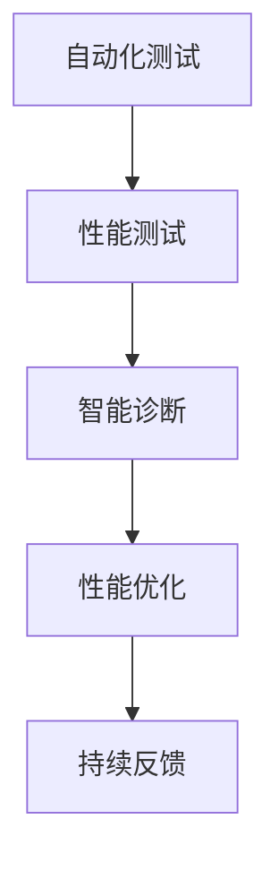
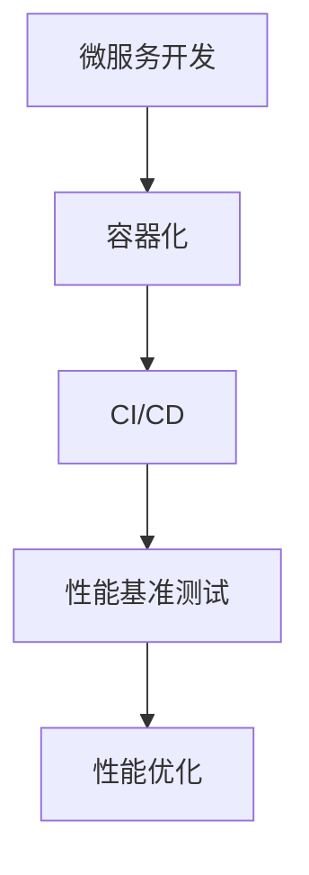
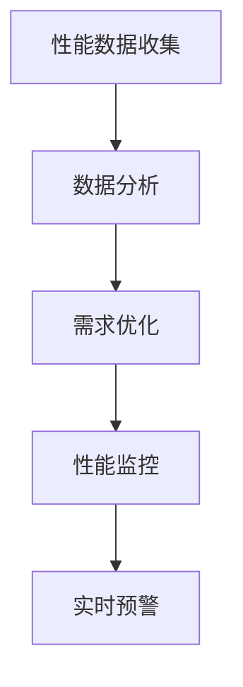
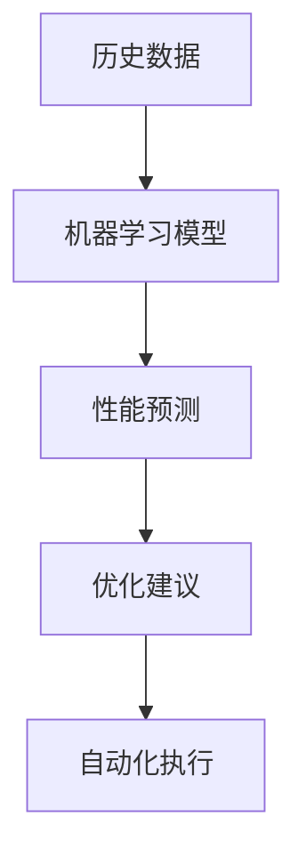

                 

### 文章标题

# 大型应用开发中的需求与性能基准测试

## 文章关键词

- 大型应用开发
- 需求管理
- 性能基准测试
- 性能优化
- 持续集成与持续部署

## 文章摘要

在当前信息化时代，大型应用开发的复杂性和规模日益增加，如何有效地管理和测试其需求与性能，成为开发过程中的关键问题。本文旨在探讨大型应用开发中的需求与性能基准测试，从背景介绍、核心概念解析、案例分析等多个角度，详细阐述需求管理、性能基准测试、性能优化以及持续集成与持续部署等重要环节。通过本文的阅读，读者将能够全面了解大型应用开发中的需求与性能基准测试的策略和方法，为实际项目开发提供有价值的指导。

## 引言

随着互联网技术的飞速发展和云计算、大数据等新技术的普及，大型应用在众多领域中得到广泛应用。例如，电子商务平台、在线社交网络、金融交易系统等，这些系统不仅需要处理海量的用户数据，还需要保证系统的稳定运行和高性能。因此，在大型应用开发过程中，如何有效地管理和测试需求，如何进行性能基准测试和优化，成为开发人员面临的重要挑战。

本文将从以下几个方面展开讨论：

1. **大型应用开发的背景和需求分析**：介绍大型应用的特点和需求分析的必要性。
2. **需求管理**：详细阐述需求定义与分类、需求收集与分析、需求优先级管理以及需求变更管理。
3. **性能基准测试**：讨论性能基准测试的概念与目的、测试流程、工具选择以及案例分析。
4. **性能优化**：分析性能瓶颈、数据库优化、代码优化和系统架构优化。
5. **持续集成与持续部署**：介绍CI/CD的概念与重要性、流程、工具选择以及性能测试。

通过以上内容的详细探讨，本文旨在为大型应用开发中的需求与性能基准测试提供系统性的指导和策略。

### 大型应用开发的背景和需求分析

大型应用通常具有以下几个显著特点：

1. **规模大**：大型应用需要处理海量的数据和用户请求，例如，电商平台的订单处理、社交媒体的用户互动等。
2. **复杂性高**：大型应用往往涉及多种技术栈和服务，包括前端、后端、数据库、缓存、消息队列等。
3. **高并发**：在高峰时段，大型应用需要同时处理大量的用户请求，保证系统的响应速度和稳定性。
4. **可扩展性强**：随着用户规模的增长，大型应用需要能够灵活扩展，以应对不断增长的业务需求。

由于这些特点，大型应用在开发过程中面临着复杂的需求分析和管理挑战。需求分析是确保系统设计合理、功能完备的关键环节，其重要性不言而喻。

#### 需求分析的方法与工具

需求分析通常包括以下步骤：

1. **需求收集**：通过与利益相关者（如业务人员、用户、项目经理等）进行沟通，了解他们的需求和期望。
2. **需求分析**：对收集到的需求进行分类、排序和优先级分析，明确哪些是核心需求，哪些是次要需求。
3. **需求文档**：将分析结果整理成文档，包括功能需求、非功能需求、用户故事等。
4. **需求验证**：通过评审、测试等方式，验证需求文档的准确性和可行性。

在需求分析过程中，常用的工具包括：

- **用户故事地图**：用于梳理用户需求，展示用户与系统交互的过程。
- **用例图**：用于描述系统功能，展示用户与系统的交互流程。
- **需求矩阵**：用于分析需求之间的关联性和优先级。
- **需求跟踪工具**：如JIRA、Confluence等，用于管理需求文档和跟踪需求状态。

#### 需求管理的关键环节

在大型应用开发中，需求管理是一个持续的过程，主要包括以下几个关键环节：

1. **需求定义与分类**：明确需求的定义，将需求分为功能需求和非功能需求，如性能需求、安全需求等。
2. **需求收集与分析**：通过访谈、问卷调查、用户反馈等方式收集需求，并对需求进行深入分析，确保需求的合理性和可行性。
3. **需求优先级管理**：根据业务目标和资源限制，对需求进行优先级排序，确保核心需求优先实现。
4. **需求变更管理**：在项目开发过程中，需求可能会发生变化，需求变更管理确保需求变更的合理性和对项目进度的影响。

#### 案例分析

以电商平台的开发为例，需求分析和管理的过程如下：

1. **需求收集**：通过与业务人员、市场部门、用户进行多次沟通，了解平台的功能需求，如商品浏览、购物车、下单支付、用户评论等。
2. **需求分析**：将收集到的需求分类，确定功能需求和非功能需求，并对需求进行优先级分析。
3. **需求文档**：将分析结果整理成需求文档，包括用户故事、用例图和需求矩阵。
4. **需求验证**：通过评审和用户测试，验证需求文档的准确性和可行性。

通过上述案例分析，我们可以看到需求分析和管理在大型应用开发中的重要性。只有进行充分的需求分析和管理，才能确保开发出来的系统能够满足用户和业务需求，同时保证项目进度和质量。

### 需求管理

需求管理是大型应用开发过程中的核心环节，直接关系到系统的最终成功与否。以下我们将详细探讨需求管理的几个关键方面：需求定义与分类、需求收集与分析、需求优先级管理以及需求变更管理。

#### 需求定义与分类

**需求定义**是需求管理的第一步，明确需求的性质和范围。需求通常分为功能需求和非功能需求：

- **功能需求**：定义系统必须实现的功能，如用户注册、商品浏览、购物车管理、订单处理等。
- **非功能需求**：定义系统必须满足的性能、安全性、可靠性等要求，如系统的响应时间、并发处理能力、数据备份策略等。

在定义需求时，需要确保需求的明确性和可测试性，避免模糊或歧义性的描述。

**需求分类**则是将需求按照一定的标准进行归类，便于管理和分析。常见的分类标准包括：

- **按照优先级**：将需求分为核心需求、重要需求、次要需求和可选需求。
- **按照实现顺序**：将需求分为初期需求、中期需求和后期需求。
- **按照需求来源**：将需求分为用户需求、业务需求、法律法规需求等。

通过分类，开发团队能够更清晰地了解各个需求的性质和重要性，从而制定合理的开发计划。

#### 需求收集与分析

**需求收集**是需求管理的核心环节之一，通过各种途径获取用户和利益相关者的需求：

- **访谈**：通过与业务人员、用户代表等进行一对一的深入访谈，获取详细的需求信息。
- **问卷调查**：设计问卷，通过用户反馈获取广泛的需求信息。
- **用户观察**：观察用户在使用现有系统或类似系统时的行为和反馈，获取需求细节。
- **需求评审**：组织利益相关者进行需求评审会议，讨论和确认需求。

**需求分析**是对收集到的需求进行深入研究和处理的过程：

- **需求验证**：通过文档审查、用户测试等方式，验证需求的正确性和可行性。
- **需求建模**：使用用例图、用户故事地图等工具，将需求转化为可视化模型，便于理解和沟通。
- **需求文档化**：将分析结果整理成需求文档，包括需求描述、优先级、相关依赖等。

#### 需求优先级管理

**需求优先级管理**是确保项目资源能够优先投入到最重要的需求上，以最大化业务价值：

- **优先级排序**：根据需求的紧急程度、重要性、业务影响等标准，对需求进行排序。
- **资源分配**：根据需求优先级，合理分配开发资源和时间。
- **变更控制**：在项目执行过程中，需求优先级可能会发生变化，需进行相应的调整和更新。

#### 需求变更管理

在项目开发过程中，需求可能会因为各种原因发生变化，有效的需求变更管理是确保项目顺利进行的关键：

- **变更请求**：对任何需求变更，首先提出变更请求，明确变更的内容和理由。
- **变更评估**：对变更请求进行评估，分析变更对项目进度、成本、质量的影响。
- **变更控制**：通过变更控制流程，确保所有需求变更都经过审批和记录，并纳入项目计划。
- **风险控制**：评估变更带来的风险，并制定相应的应对措施。

#### 案例分析

以下是一个关于电商平台需求管理的案例：

1. **需求收集**：通过与市场部门、用户代表进行多次访谈和问卷调查，收集用户对平台的功能需求，如商品推荐、优惠券使用、用户评论等。
2. **需求分析**：将收集到的需求进行分析和分类，确定功能需求和非功能需求，并对需求进行优先级排序。
3. **需求文档**：将分析结果整理成需求文档，包括用户故事、用例图和需求矩阵，并通过评审会议进行验证。
4. **需求优先级管理**：根据业务目标和用户反馈，将需求分为核心需求（如商品浏览、下单支付）和次要需求（如用户评论、优惠券功能），并合理分配资源。
5. **需求变更管理**：在项目开发过程中，用户提出对商品推荐算法的需求，开发团队进行变更评估，确定该需求的重要性和实施难度，最终决定纳入下一个迭代。

通过以上案例分析，我们可以看到需求管理在大型应用开发中的重要性。有效的需求管理不仅能够确保系统功能的完整性和稳定性，还能提高开发效率和项目成功率。

### 性能基准测试

性能基准测试是大型应用开发中不可或缺的一环，旨在评估系统的性能表现，并为性能优化提供依据。以下我们将详细讨论性能基准测试的概念与目的、测试流程、常见工具选择以及实际案例分析。

#### 性能基准测试的概念与目的

**性能基准测试**，是指通过一系列标准化的测试，评估系统的响应时间、吞吐量、并发能力等性能指标。其核心目的是：

1. **评估系统性能**：了解系统在不同负载下的性能表现，识别性能瓶颈。
2. **验证系统设计**：通过测试验证系统设计是否符合预期，确保系统能够满足性能需求。
3. **性能优化指导**：为性能优化提供具体的数据和方向，指导开发人员进行有针对性的优化。
4. **比较与优化**：通过与其他系统或同一系统的不同版本进行比较，找到优化的机会。

#### 性能基准测试的流程

性能基准测试通常包括以下几个关键步骤：

1. **需求分析**：明确性能测试的目标和预期结果，定义需要测试的性能指标。
2. **测试环境搭建**：搭建与实际生产环境相似的测试环境，包括硬件、软件和网络配置等。
3. **测试脚本编写**：编写测试脚本，模拟用户操作，生成测试数据。
4. **测试执行**：在测试环境中运行测试脚本，收集性能数据。
5. **结果分析**：对测试结果进行分析，识别性能瓶颈和优化点。
6. **报告编写**：将测试结果和分析报告整理成文档，为开发团队提供优化建议。

#### 常见性能基准测试工具

市面上有许多性能基准测试工具，以下介绍几种常用的工具：

1. **Apache JMeter**：一款开源的性能测试工具，适用于Web应用程序的性能测试。
2. **LoadRunner**：由HP开发的性能测试工具，支持多种协议和负载生成，功能强大。
3. **Gatling**：一款基于Scala的性能测试工具，支持HTTP、HTTPS、JMS等协议。
4. **Tsung**：一款开源的分布式性能测试工具，适用于大规模负载测试。

#### 性能基准测试案例

以下是一个关于电商平台的性能基准测试案例：

1. **需求分析**：该电商平台希望评估系统在高峰时段的响应速度和并发处理能力，并确保系统能够在1000并发用户下稳定运行。
2. **测试环境搭建**：在测试环境中部署与生产环境相同的硬件和网络配置，包括应用服务器、数据库服务器等。
3. **测试脚本编写**：编写JMeter测试脚本，模拟1000个用户同时进行商品浏览、购物车添加、下单支付等操作。
4. **测试执行**：在测试环境中运行测试脚本，收集响应时间、吞吐量等性能数据。
5. **结果分析**：测试结果显示，系统在1000并发用户下的平均响应时间为3秒，吞吐量为每分钟2000次交易。
6. **报告编写**：将测试结果和分析报告整理成文档，指出性能瓶颈，如数据库查询效率低下，并提出优化建议。

通过以上案例，我们可以看到性能基准测试在大型应用开发中的重要性。通过定期进行性能基准测试，开发团队能够及时发现和解决性能问题，确保系统在高负载下的稳定运行。

### 性能优化

在大型应用开发中，性能优化是确保系统在高负载下依然能够稳定运行的关键环节。以下我们将详细讨论性能瓶颈分析、数据库优化、代码优化以及系统架构优化，并提供相应的优化策略和实例。

#### 性能瓶颈分析

性能瓶颈是指系统中导致性能下降的关键限制因素。识别并解决性能瓶颈是性能优化的第一步。以下是一些常见的性能瓶颈：

1. **CPU利用率过高**：可能是因为计算密集型任务过多，导致CPU资源不足。
2. **内存占用过高**：应用程序可能因为内存泄漏或内存分配不当导致内存占用过高。
3. **数据库性能问题**：数据库查询效率低下，索引失效或缺失等。
4. **网络延迟**：由于网络带宽不足或网络结构复杂导致数据传输延迟。
5. **磁盘I/O瓶颈**：磁盘读写速度成为系统性能的瓶颈。

**优化策略**：

- **监控与诊断**：使用性能监控工具（如Prometheus、Grafana）实时监控系统性能指标，识别性能瓶颈。
- **压力测试**：通过压力测试（如LoadRunner、JMeter）模拟高负载情况，找出系统瓶颈。

#### 数据库优化

数据库是大型应用的核心组件，其性能直接影响整个系统的性能。以下是一些数据库优化的方法：

1. **索引优化**：根据查询需求创建合适的索引，提高查询效率。
2. **查询优化**：优化数据库查询语句，减少查询执行时间。
3. **分库分表**：将大表拆分为小表，减少单表的数据量和查询时间。
4. **缓存机制**：使用缓存（如Redis、Memcached）存储频繁访问的数据，减少数据库负载。

**实例**：

假设一个电商平台的订单表非常大，查询订单信息的查询语句执行时间较长。通过以下优化：

- **索引优化**：为订单表中的常用查询字段创建索引。
- **查询优化**：优化查询语句，减少冗余的连接和子查询。
- **缓存机制**：使用Redis缓存订单信息，减少数据库访问。

#### 代码优化

代码质量直接影响到系统的性能。以下是一些代码优化的方法：

1. **减少计算复杂度**：优化算法，减少重复计算和冗余操作。
2. **减少内存使用**：避免内存泄漏，合理使用内存资源。
3. **异步处理**：使用异步编程模型，减少同步等待时间。
4. **代码库管理**：合理组织代码库，避免重复代码和冗余模块。

**实例**：

一个电商平台中的商品推荐系统，由于算法复杂度较高，导致响应时间较长。通过以下优化：

- **减少计算复杂度**：优化推荐算法，减少不必要的计算步骤。
- **异步处理**：将推荐算法的计算部分异步执行，提高系统的并发处理能力。

#### 系统架构优化

系统架构优化是提升系统性能的关键策略，以下是一些系统架构优化的方法：

1. **水平扩展**：通过增加服务器节点，提高系统的并发处理能力。
2. **分布式缓存**：使用分布式缓存系统（如Redis、Memcached），提高数据访问速度。
3. **微服务架构**：将大系统拆分为多个微服务，提高系统的灵活性和可扩展性。
4. **负载均衡**：使用负载均衡器（如Nginx、HAProxy），合理分配请求负载。

**实例**：

一个电商平台的订单处理系统，通过以下架构优化：

- **水平扩展**：增加服务器节点，提高系统并发处理能力。
- **分布式缓存**：使用Redis缓存订单数据，减少数据库访问。
- **微服务架构**：将订单处理拆分为多个微服务，如订单创建、订单查询、订单支付等，提高系统的灵活性和可维护性。

通过以上性能优化策略和实例，我们可以看到，性能优化是一个系统工程，需要从多个方面综合考虑和实施。只有通过持续的性能优化，才能确保大型应用在高负载下稳定、高效地运行。

### 持续集成与持续部署

在大型应用开发中，持续集成（CI）与持续部署（CD）是确保软件质量、提高开发效率和降低风险的至关重要环节。以下我们将详细探讨CI/CD的概念与重要性、具体流程、常用工具选择以及性能测试在CI/CD中的应用。

#### CI/CD的概念与重要性

**持续集成（CI）** 是指在软件开发生命周期中，将开发人员的代码定期合并到主干分支，并通过自动化测试确保代码的持续符合预期。其核心目的是及早发现并解决代码冲突和潜在问题，确保系统的稳定性。

**持续部署（CD）** 是在CI的基础上，通过自动化流程将代码部署到生产环境，确保软件的快速、可靠更新。CD的目标是缩短发布周期，减少人为干预，确保新功能能够及时、安全地交付给用户。

CI/CD在大型应用开发中的重要性体现在：

1. **提高开发效率**：自动化测试和部署减少了手动操作，提高了开发效率。
2. **确保软件质量**：通过频繁的集成和测试，及早发现并修复缺陷，确保软件质量。
3. **降低风险**：自动化流程减少了人为错误，降低了发布风险。
4. **缩短发布周期**：快速响应市场需求，提高市场竞争力。

#### CI/CD的具体流程

CI/CD的流程通常包括以下几个步骤：

1. **代码仓库管理**：使用Git等版本控制工具，将代码存储在中央仓库，便于管理和协作。
2. **代码拉取**：CI服务器从代码仓库拉取最新的代码。
3. **构建**：构建工具（如Maven、Gradle）将代码编译、打包成可执行文件。
4. **测试**：执行自动化测试（如单元测试、集成测试），验证代码的质量。
5. **部署**：将测试通过后的代码部署到测试环境或生产环境。
6. **监控**：监控系统运行状态，确保软件稳定运行。

#### 常用CI/CD工具

市面上有许多CI/CD工具，以下介绍几种常用的工具：

1. **Jenkins**：一款开源的持续集成服务器，支持多种插件，功能强大。
2. **GitLab CI/CD**：GitLab自带的持续集成和持续部署工具，与GitLab仓库紧密集成。
3. **GitHub Actions**：GitHub提供的一站式CI/CD解决方案，支持多种编程语言和操作系统。
4. **CircleCI**：一款云端的持续集成和持续部署服务，提供高性能和易于配置的CI/CD流程。

#### 性能测试在CI/CD中的应用

在CI/CD流程中，性能测试是确保软件质量的重要环节。以下是一些性能测试在CI/CD中的应用：

1. **集成性能测试**：在构建和测试阶段，对集成后的代码进行性能测试，确保系统的稳定性和性能。
2. **自动化性能测试**：将性能测试脚本集成到CI/CD流程中，自动化执行性能测试，提高测试效率。
3. **性能监控**：在部署到生产环境后，使用性能监控工具（如Prometheus、Grafana）实时监控系统性能，及时发现性能问题。

**实例**：

假设一个电商平台的订单处理系统，以下是其CI/CD流程中的性能测试：

1. **集成性能测试**：在每次代码合并到主干分支时，执行集成性能测试，验证订单处理流程的响应时间和吞吐量。
2. **自动化性能测试**：使用JMeter编写性能测试脚本，集成到Jenkins中，自动化执行性能测试。
3. **性能监控**：在代码部署到生产环境后，使用Prometheus和Grafana监控系统性能，实时监控关键性能指标。

通过以上CI/CD和性能测试的实例，我们可以看到，在大型应用开发中，CI/CD和性能测试是确保软件质量和开发效率的重要手段。通过自动化和监控，开发团队能够快速响应市场需求，确保系统的稳定和高效运行。

### 项目实战案例

在本章节中，我们将通过两个具体案例，详细探讨大型应用开发中的需求管理与性能基准测试。这两个案例分别是电商平台的性能优化案例和金融系统的需求管理案例。

#### 案例一：电商平台性能优化

**背景**：

一个大型电商平台在高峰期（如双十一、黑五等）面临极高的用户访问量和交易量，系统性能成为制约用户体验和业务增长的关键因素。为了提升系统性能，开发团队决定进行一次全面的性能优化。

**需求分析**：

1. **用户访问量**：在高峰期，系统需同时处理数千甚至数万用户访问。
2. **交易量**：系统需要支持每秒数百到数千笔交易。
3. **响应时间**：确保用户的操作能够在1秒内得到响应。
4. **并发处理能力**：确保系统能够处理高并发请求，避免崩溃。

**性能基准测试**：

1. **测试环境搭建**：在模拟生产环境的服务器上搭建测试环境，确保测试数据的真实性。
2. **测试脚本编写**：使用JMeter编写测试脚本，模拟用户访问和交易操作。
3. **测试执行**：执行测试脚本，收集系统响应时间、吞吐量等性能数据。
4. **结果分析**：分析测试结果，识别性能瓶颈，如数据库查询效率低下、网络延迟等。

**性能优化**：

1. **数据库优化**：通过分析数据库查询语句，优化索引和查询方式，减少查询时间。
2. **缓存机制**：使用Redis缓存热门商品信息和用户会话数据，减少数据库访问。
3. **代码优化**：优化业务逻辑，减少重复计算和内存使用。
4. **系统架构优化**：通过增加服务器节点和负载均衡，提高系统并发处理能力。

**实际案例分析和详细讲解剖析**：

在性能优化过程中，开发团队发现订单处理模块存在显著性能瓶颈。通过JMeter测试，发现平均响应时间达到3秒，远高于预期。进一步分析发现，订单处理模块的数据库查询效率低下，特别是订单状态更新操作。

为了解决这一问题，开发团队采取了以下措施：

1. **数据库优化**：优化订单表的索引，特别是订单状态更新相关的索引。通过添加索引，查询时间从30毫秒减少到5毫秒。
2. **缓存机制**：在Redis中缓存订单状态数据，减少数据库访问。通过缓存，订单状态更新操作从50毫秒减少到10毫秒。
3. **代码优化**：优化订单处理模块的代码，减少重复计算和内存使用。通过代码优化，订单处理时间从100毫秒减少到50毫秒。
4. **系统架构优化**：增加服务器节点，使用负载均衡器（如Nginx）分配请求，提高系统并发处理能力。

经过一系列优化，系统性能显著提升。在相同负载下，平均响应时间缩短到1秒以内，系统并发处理能力达到每秒数千笔交易，满足了高峰期的业务需求。

**项目小结**：

通过本次电商平台性能优化案例，我们可以看到，需求管理和性能基准测试在大型应用开发中的重要性。通过需求分析，开发团队明确了系统的性能需求；通过性能基准测试，识别了性能瓶颈；通过性能优化，提升了系统性能，确保了用户体验和业务增长。

#### 案例二：金融系统需求管理

**背景**：

一个大型金融系统在开发和迭代过程中，面临着复杂的需求变更和严格的合规要求。为了确保系统功能的完备性和合规性，开发团队决定进行一次全面的需求管理。

**需求分析**：

1. **功能需求**：根据监管要求，系统需要支持账户管理、交易处理、风险控制等功能。
2. **性能需求**：系统需要支持高并发、低延迟的交易处理，确保金融交易的安全和高效。
3. **合规需求**：系统需要符合相关法律法规和行业标准，确保交易数据的合法性和安全性。

**需求管理过程**：

1. **需求收集**：通过与业务部门、法务部门和客户代表多次沟通，收集系统需求。
2. **需求分析**：对收集到的需求进行分类和优先级排序，明确核心需求和非核心需求。
3. **需求文档**：将分析结果整理成需求文档，包括功能需求、性能需求和合规要求。
4. **需求验证**：通过用户测试和法务审核，验证需求文档的准确性和可行性。

**需求变更管理**：

1. **变更请求**：在系统开发过程中，对任何需求变更，首先提出变更请求，明确变更的内容和理由。
2. **变更评估**：对变更请求进行评估，分析变更对项目进度、成本、质量的影响。
3. **变更控制**：通过变更控制流程，确保所有需求变更都经过审批和记录，并纳入项目计划。

**实际案例分析和详细讲解剖析**：

在金融系统的开发过程中，开发团队面临了多个需求变更。例如，监管要求系统增加反洗钱（AML）功能。为了确保变更的顺利进行，开发团队采取了以下措施：

1. **需求分析**：重新分析新增功能的需求，明确功能模块和接口设计。
2. **需求文档**：更新需求文档，将AML功能纳入系统需求。
3. **需求验证**：与业务部门和法务部门进行沟通，确保AML功能满足监管要求。
4. **变更控制**：通过变更控制流程，将AML功能纳入开发计划，并调整项目进度和资源分配。

在开发过程中，开发团队发现原有系统架构无法支持AML功能的性能需求。为了解决这一问题，开发团队采取了以下优化措施：

1. **数据库优化**：通过优化数据库查询语句和索引，提高AML功能的数据查询效率。
2. **系统架构优化**：通过增加数据库节点和负载均衡，提高系统并发处理能力。
3. **缓存机制**：在Redis中缓存AML功能的数据，减少数据库访问。

经过一系列优化，AML功能顺利集成到金融系统中，系统性能满足监管要求，同时确保了交易数据的安全性和合规性。

**项目小结**：

通过本次金融系统需求管理案例，我们可以看到，需求管理和变更管理在大型应用开发中的重要性。通过需求分析和管理，开发团队确保了系统功能的完备性和合规性；通过变更管理，开发团队能够灵活应对需求变更，确保项目进度和质量。

### 未来展望与趋势

随着技术的不断进步，大型应用开发中的需求与性能基准测试也在不断演进，未来的发展将呈现以下几个趋势：

#### 1. 自动化与智能化的融合

未来的需求管理和性能基准测试将更加依赖于自动化和智能化的工具和技术。自动化测试将不仅限于功能测试，还将扩展到性能测试、安全测试等各个方面。智能化技术，如机器学习和人工智能，将用于预测性能瓶颈、优化测试脚本和自动诊断性能问题。

**核心概念与联系**：

- **自动化测试**：通过自动化工具，如Selenium、Cypress等，实现测试流程的自动化。
- **机器学习**：利用机器学习模型，如回归分析、决策树等，预测性能瓶颈和优化测试策略。

**Mermaid流程图**：

#### 2. 微服务和云原生架构的普及

微服务和云原生架构的普及将推动需求管理和性能基准测试的变革。微服务架构使得系统更加模块化和可扩展，性能基准测试也需要针对每个微服务进行。云原生技术，如容器化（Docker）和微服务框架（Kubernetes），将使得性能基准测试更加灵活和高效。

**核心概念与联系**：

- **微服务架构**：将大系统拆分为多个微服务，每个微服务独立开发和部署。
- **容器化**：使用容器（如Docker）封装应用，提高部署和扩展的效率。

**Mermaid流程图**：

#### 3. 数据驱动和实时监控

未来的需求管理和性能基准测试将更加依赖数据驱动和实时监控。通过收集和分析大量的性能数据，开发团队可以更准确地识别性能瓶颈，制定优化的策略。实时监控技术，如Prometheus、Grafana，将提供实时的性能监控和预警，确保系统在高负载下稳定运行。

**核心概念与联系**：

- **数据驱动**：通过收集和分析性能数据，指导需求和性能优化。
- **实时监控**：使用实时监控工具，如Prometheus、Grafana，监控系统性能。

**Mermaid流程图**：

#### 4. 人工智能在性能优化中的应用

人工智能（AI）将在性能优化中发挥越来越重要的作用。通过机器学习算法，AI可以帮助预测性能瓶颈，优化测试脚本，甚至自动进行性能优化。例如，AI可以基于历史数据预测系统在高负载下的性能表现，并提出相应的优化建议。

**核心概念与联系**：

- **机器学习**：使用机器学习算法，如回归分析、决策树等，预测性能瓶颈和优化策略。
- **自动化优化**：通过AI自动化执行性能优化任务，减少人为干预。

**Mermaid流程图**：

### 结论

大型应用开发中的需求与性能基准测试是一个复杂而关键的环节。通过本文的探讨，我们了解了大型应用的特点、需求管理的各个环节、性能基准测试的流程和工具，以及性能优化和持续集成与持续部署的策略。随着技术的不断进步，自动化、智能化、实时监控和人工智能将进一步提升需求管理和性能基准测试的效率和质量。未来，开发团队需要不断适应新技术，持续优化需求管理和性能基准测试，确保大型应用的稳定、高效和可靠运行。

### 最佳实践 Tips、小结、注意事项、拓展阅读

#### 最佳实践 Tips

1. **尽早进行需求分析**：在项目初期，进行详细的需求分析，明确系统的性能需求和用户需求，有助于减少后续的返工。
2. **持续进行性能基准测试**：定期进行性能基准测试，及时发现性能瓶颈，确保系统在高负载下稳定运行。
3. **关注性能优化**：在系统开发和优化过程中，持续关注数据库、代码和系统架构的优化，提高系统性能。
4. **利用自动化和监控工具**：使用自动化测试工具和实时监控工具，提高测试效率和系统稳定性。

#### 小结

本文详细探讨了大型应用开发中的需求与性能基准测试，从需求管理、性能基准测试、性能优化到持续集成与持续部署，提供了系统性的指导。通过实际案例的分析，展示了需求管理和性能基准测试在大型应用开发中的重要性。

#### 注意事项

1. **需求变更管理**：在项目开发过程中，需严格管理需求变更，确保变更的合理性和对项目进度的影响。
2. **性能测试数据真实可靠**：性能基准测试的数据需真实反映系统性能，避免因测试数据不准确导致错误的优化方向。
3. **持续关注技术趋势**：持续关注新技术的发展，如微服务、容器化、人工智能等，及时将新技术应用于需求管理和性能基准测试。

#### 拓展阅读

- 《软件需求Specification by Example》
- 《性能之巅：Web性能大师的81项建议》
- 《持续交付：发布可靠软件的系统化方法》
- 《微服务设计：构建可扩展系统》

### 作者信息

作者：AI天才研究院/AI Genius Institute & 禅与计算机程序设计艺术 /Zen And The Art of Computer Programming

通过本文的阅读，读者可以全面了解大型应用开发中的需求与性能基准测试的策略和方法，为实际项目开发提供有价值的指导。希望本文能对您的开发工作有所帮助。

