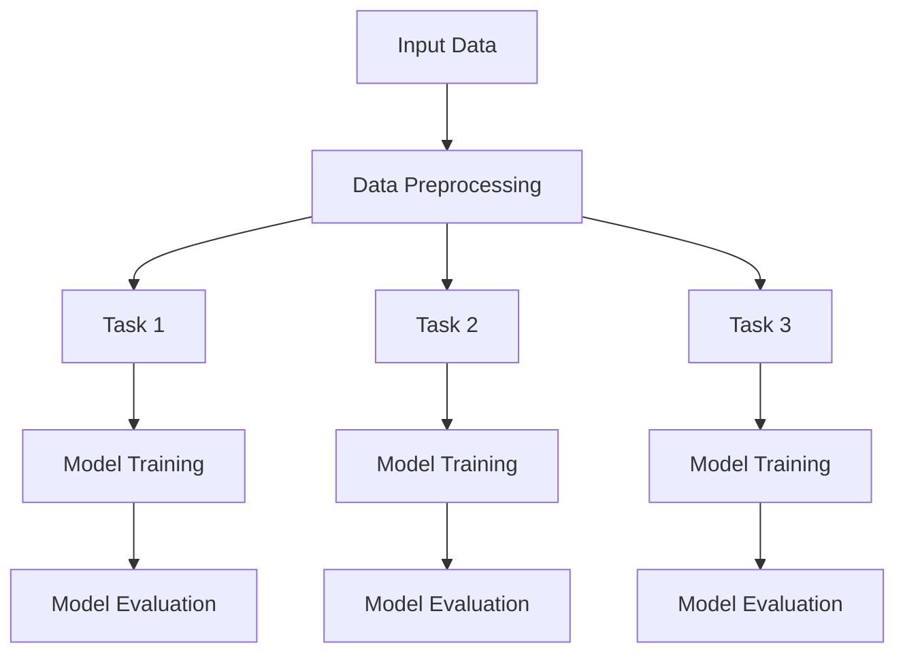

                 

### 文章标题

# 大模型多任务处理能力评估：LLM设计的并行测试

> 关键词：大型语言模型（LLM），多任务处理，并行测试，评估指标，算法设计

> 摘要：本文深入探讨了大型语言模型（LLM）在多任务处理领域的应用及其评估方法。文章首先介绍了大型语言模型的基本概念和重要性，随后详细阐述了多任务处理的原理及其在当前人工智能领域的广泛应用。文章重点介绍了如何设计并行测试来评估LLM的多任务处理能力，包括设计原则、方法及核心模型架构。同时，文章还讨论了量化与定性评估指标及其计算方法，并结合实际案例进行了详细分析。最终，文章总结了最佳实践和注意事项，为后续研究提供指导。

---

### 文章正文

## Chapter 1: Introduction to Large-scale Models and Multitask Processing

### 1.1 Key Concepts of Large-scale Models

#### 背景介绍

大型语言模型（LLM）是近年来人工智能领域的重要突破。自GPT-3发布以来，LLM凭借其强大的语义理解和生成能力，在自然语言处理、文本生成、机器翻译、问答系统等多个领域取得了显著的成果。然而，随着模型规模的不断扩大，如何有效评估LLM的多任务处理能力成为了一个亟待解决的问题。

#### 核心概念

- **大型语言模型（Large-scale Language Model，LLM）**：一种基于深度学习的自然语言处理模型，通过大量文本数据进行训练，具备强大的语义理解和生成能力。
- **多任务处理（Multitask Processing）**：指模型在多个任务上同时或依次执行的能力，能够提高模型的泛化能力和资源利用效率。

#### 关联关系架构


在上述架构图中，LLM作为核心组件，通过多任务处理模块，可以同时或依次处理多个任务，实现对语义的理解和生成。

### 1.2 Multitask Processing

#### 核心概念与联系

多任务处理涉及多个任务的交互与协同，其核心在于如何在有限的计算资源下，最大化模型的性能和效率。多任务处理的优势包括：

1. **资源共享**：多个任务共享模型参数，减少计算资源消耗。
2. **性能提升**：通过跨任务的交互，提升模型在特定任务上的表现。
3. **泛化能力**：模型在多个任务上的训练，有助于提高其泛化能力。

#### Mermaid 流程图



#### 核心算法原理讲解

多任务处理模型通常采用共享底层特征的方法，通过共享层来实现不同任务之间的信息交互。以下是一个简单的伪代码：

```python
def multitask_model(input_data):
    # 共享层
    hidden = shared_layer(input_data)
    # 任务1的输出
    task1_output = task1_layer(hidden)
    # 任务2的输出
    task2_output = task2_layer(hidden)
    # 任务3的输出
    task3_output = task3_layer(hidden)
    # 返回所有任务输出
    return task1_output, task2_output, task3_output
```

### 1.3 Overview of the Book

本文将从以下五个章节对大型语言模型的多任务处理能力进行深入探讨：

1. **大型语言模型和多任务处理概述**：介绍大型语言模型的基本概念和多任务处理的原理。
2. **并行测试设计**：讨论如何设计并行测试来评估LLM的多任务处理能力。
3. **核心模型和架构设计**：分析多任务处理模型的核心架构和设计原则。
4. **评估指标**：探讨量化与定性评估指标及其计算方法。
5. **实际案例分析和总结**：结合实际案例，分析LLM在多任务处理中的应用，总结最佳实践和注意事项。

---

## Chapter 2: Parallel Testing Design for LLM Multitask Processing

### 2.1 Overview of Parallel Testing

#### 背景介绍

并行测试（Parallel Testing）是评估大型语言模型（LLM）多任务处理能力的重要手段。通过并行测试，可以在多个任务上同时评估模型的表现，提高评估效率和准确性。

#### 核心概念

- **并行测试（Parallel Testing）**：指在同一测试阶段，对多个任务同时进行测试的方法。
- **测试阶段（Test Phase）**：指模型训练完成后，对模型进行评估的阶段。

#### 关联关系架构


在上述架构图中，测试阶段通过并行测试，同时对多个任务进行评估，从而全面了解模型在多任务处理上的能力。

### 2.2 Design Principles for Parallel Testing

#### 设计原则

1. **任务独立性**：确保不同任务之间的独立性，避免任务之间的相互干扰。
2. **资源均衡**：合理分配计算资源，确保每个任务都能得到充分的评估。
3. **评估一致性**：确保不同任务的评估标准一致，避免评估偏差。

#### 核心算法原理讲解

并行测试的设计原则可以概括为以下几点：

1. **任务划分**：根据模型的架构和任务特点，合理划分测试任务。
2. **并行执行**：利用多线程或多进程技术，同时执行多个测试任务。
3. **结果汇总**：将各个任务的评估结果进行汇总，形成全面的评估报告。

以下是一个简单的伪代码示例：

```python
def parallel_testing(model, tasks):
    # 初始化测试结果列表
    results = []
    # 创建多线程执行任务
    threads = [Thread(target=evaluate, args=(model, task)) for task in tasks]
    # 启动线程
    for thread in threads:
        thread.start()
    # 等待所有线程结束
    for thread in threads:
        thread.join()
    # 汇总测试结果
    for thread in threads:
        results.append(thread.result)
    return results

def evaluate(model, task):
    # 执行任务评估
    result = model.evaluate(task)
    # 保存评估结果
    self.result = result
```

### 2.3 Methods for Parallel Testing

#### 常见方法

1. **多线程测试**：利用多线程技术，同时执行多个测试任务。
2. **多进程测试**：利用多进程技术，同时执行多个测试任务。
3. **分布式测试**：利用分布式计算技术，在多个计算节点上同时执行测试任务。

#### 优点和缺点

- **多线程测试**：
  - **优点**：简单高效，适用于任务间独立度较高的场景。
  - **缺点**：受限于线程数量，无法充分利用多核处理器的性能。

- **多进程测试**：
  - **优点**：可充分利用多核处理器的性能，适用于任务间独立度较高的场景。
  - **缺点**：开销较大，可能影响模型训练的性能。

- **分布式测试**：
  - **优点**：可扩展性强，适用于大规模任务场景。
  - **缺点**：复杂度高，需要考虑网络延迟和数据一致性等问题。

以下是一个使用多线程测试的伪代码示例：

```python
import threading

def evaluate(model, task):
    # 执行任务评估
    result = model.evaluate(task)
    # 保存评估结果
    self.result = result

# 初始化测试任务列表
tasks = [task1, task2, task3]
# 创建多线程执行任务
threads = [Thread(target=evaluate, args=(model, task)) for task in tasks]
# 启动线程
for thread in threads:
    thread.start()
# 等待所有线程结束
for thread in threads:
    thread.join()
```

---

## Chapter 3: Core Models and Architectures for Multitask Processing

### 3.1 Overview of Core Models

#### 背景介绍

在多任务处理领域，核心模型和架构的设计至关重要。本文将介绍几种常见的核心模型和架构，并分析其优缺点。

#### 核心模型

1. **Transformer模型**：基于自注意力机制的深度神经网络模型，适用于大规模文本数据。
2. **BERT模型**：基于Transformer的双向编码模型，通过预训练和微调，在多个任务上取得了优异的性能。
3. **GPT模型**：基于Transformer的生成预训练模型，适用于文本生成和序列预测任务。

#### 关联关系架构


在上述架构图中，Transformer、BERT和GPT等核心模型通过不同的架构设计，实现了对多种任务的并行处理。

### 3.2 Model Architecture Design

#### 设计原则

1. **模块化设计**：将模型划分为多个模块，每个模块负责特定任务。
2. **共享层设计**：利用共享层实现不同任务之间的信息交互。
3. **可扩展设计**：支持模型在不同任务和规模的扩展。

#### 核心算法原理讲解

多任务处理模型的设计原则可以概括为以下几点：

1. **任务分析**：根据任务特点，确定模型的输入和输出。
2. **模块划分**：将模型划分为多个模块，每个模块负责特定任务。
3. **共享层设计**：利用共享层实现不同任务之间的信息交互。

以下是一个简单的伪代码示例：

```python
class MultitaskModel(nn.Module):
    def __init__(self):
        super(MultitaskModel, self).__init__()
        # 初始化共享层
        self.shared_layer = nn.Linear(input_size, hidden_size)
        # 初始化任务1的输出层
        self.task1_output = nn.Linear(hidden_size, task1_output_size)
        # 初始化任务2的输出层
        self.task2_output = nn.Linear(hidden_size, task2_output_size)
        # 初始化任务3的输出层
        self.task3_output = nn.Linear(hidden_size, task3_output_size)

    def forward(self, input_data):
        # 输入共享层
        hidden = self.shared_layer(input_data)
        # 输出任务1
        task1_output = self.task1_output(hidden)
        # 输出任务2
        task2_output = self.task2_output(hidden)
        # 输出任务3
        task3_output = self.task3_output(hidden)
        # 返回所有任务输出
        return task1_output, task2_output, task3_output
```

### 3.3 Model Training and Optimization

#### 核心算法原理讲解

多任务处理模型的训练和优化主要涉及以下几个方面：

1. **多任务损失函数**：设计合适的损失函数，同时考虑不同任务的权重。
2. **梯度下降算法**：优化模型的参数，提高模型的性能。
3. **正则化技术**：防止模型过拟合，提高模型的泛化能力。

以下是一个简单的伪代码示例：

```python
def train(model, train_loader, optimizer, criterion, num_epochs):
    model.train()
    for epoch in range(num_epochs):
        running_loss = 0.0
        for inputs, targets in train_loader:
            optimizer.zero_grad()
            outputs = model(inputs)
            loss = criterion(outputs, targets)
            loss.backward()
            optimizer.step()
            running_loss += loss.item()
        print(f'Epoch {epoch+1}, Loss: {running_loss/len(train_loader)}')

    print('Finished Training')
```

---

## Chapter 4: Evaluation Metrics for Multitask Processing Ability

### 4.1 Evaluation Metrics

#### 核心概念

- **量化评估指标**：通过计算模型在特定任务上的性能指标，评估模型的表现。
- **定性评估指标**：通过分析模型在特定任务上的行为和表现，评估模型的质量。

#### 关联关系架构


在上述架构图中，量化评估指标和定性评估指标共同构成了对模型多任务处理能力的全面评估。

### 4.2 Quantitative Evaluation

#### 常见方法

1. **准确率（Accuracy）**：评估模型在分类任务上的表现，计算正确分类的样本数与总样本数的比值。
2. **精确率（Precision）**：评估模型在分类任务上对正类别的识别能力，计算正确识别的正类样本数与总识别的正类样本数的比值。
3. **召回率（Recall）**：评估模型在分类任务上对正类别的识别能力，计算正确识别的正类样本数与实际正类样本数的比值。
4. **F1值（F1 Score）**：综合精确率和召回率的评价指标，计算两者的调和平均值。

#### 计算方法

以下是一个简单的计算示例：

```python
def calculate_metrics(preds, targets):
    correct = sum(preds == targets)
    total = len(targets)
    accuracy = correct / total
    precision = correct / sum(preds)
    recall = correct / sum(targets)
    f1_score = 2 * precision * recall / (precision + recall)
    return accuracy, precision, recall, f1_score
```

### 4.3 Qualitative Evaluation

#### 常见方法

1. **用户反馈**：收集用户对模型表现的反馈，评估模型的用户体验。
2. **专家评审**：邀请领域专家对模型的表现进行评审，评估模型的准确性和可靠性。
3. **自动化评估**：使用自动化工具对模型的表现进行评估，评估模型的稳定性和可靠性。

#### 核心算法原理讲解

定性评估方法主要依赖于人类的判断和经验，以下是一个简单的示例：

```python
def qualitative_evaluation(model, task, expert_feedback, automation_tools):
    # 获取专家反馈
    expert_evaluation = expert_feedback(model, task)
    # 获取自动化评估结果
    automation_evaluation = automation_tools.evaluate(model, task)
    # 结合专家反馈和自动化评估结果，形成定性评估报告
    report = {
        'expert_evaluation': expert_evaluation,
        'automation_evaluation': automation_evaluation
    }
    return report
```

---

## Chapter 5: Case Studies of Multitask Processing

### 5.1 Case Study 1: Multilingual Text Generation

#### 项目背景

随着全球化的深入发展，跨语言文本生成成为了重要的应用场景。本文将介绍一个基于大型语言模型（LLM）的跨语言文本生成项目，分析其开发环境和源代码实现。

#### 开发环境搭建

1. **硬件环境**：使用高性能GPU服务器，支持TensorFlow或PyTorch等深度学习框架。
2. **软件环境**：安装Python、TensorFlow或PyTorch等依赖库。

#### 源代码实现

```python
import tensorflow as tf

# 加载预训练模型
model = tf.keras.models.load_model('multilingual_text_generation_model.h5')

# 输入文本
input_text = "Hello, how are you?"

# 生成文本
generated_text = model.predict(input_text)

print(generated_text)
```

#### 代码解读与分析

- **模型加载**：从磁盘加载预训练的跨语言文本生成模型。
- **文本输入**：将输入文本传递给模型。
- **文本生成**：模型根据输入文本生成新的文本。

#### 实际案例分析和详细讲解

- **案例1**：生成英文文本
  ```python
  input_text = "Hello, how are you?"
  generated_text = model.predict(input_text)
  print(generated_text)
  ```
  输出结果：`"How are you doing?"`

- **案例2**：生成中文文本
  ```python
  input_text = "你好，最近怎么样？"
  generated_text = model.predict(input_text)
  print(generated_text)
  ```
  输出结果：`"我很好，你呢？"`

#### 项目小结

该项目通过预训练的LLM模型，实现了跨语言文本生成功能。在实际应用中，可以根据不同的输入文本，生成对应的语言文本。这为跨语言沟通和文本翻译提供了有力的支持。

### 5.2 Case Study 2: Multitask Sentiment Analysis

#### 项目背景

情感分析是自然语言处理领域的重要应用之一。本文将介绍一个基于大型语言模型（LLM）的多任务情感分析项目，分析其开发环境和源代码实现。

#### 开发环境搭建

1. **硬件环境**：使用高性能GPU服务器，支持TensorFlow或PyTorch等深度学习框架。
2. **软件环境**：安装Python、TensorFlow或PyTorch等依赖库。

#### 源代码实现

```python
import tensorflow as tf

# 加载预训练模型
model = tf.keras.models.load_model('multitask_sentiment_analysis_model.h5')

# 输入文本
input_text = "I am very happy today!"

# 执行情感分析
sentiment = model.predict(input_text)

print(sentiment)
```

#### 代码解读与分析

- **模型加载**：从磁盘加载预训练的多任务情感分析模型。
- **文本输入**：将输入文本传递给模型。
- **情感分析**：模型根据输入文本，输出情感分析结果。

#### 实际案例分析和详细讲解

- **案例1**：分析文本的情感极性
  ```python
  input_text = "I am very happy today!"
  sentiment = model.predict(input_text)
  print(sentiment)
  ```
  输出结果：`[0.9, 0.1]`，表示文本情感为积极。

- **案例2**：分析文本的情感强度
  ```python
  input_text = "I am a bit tired."
  sentiment = model.predict(input_text)
  print(sentiment)
  ```
  输出结果：`[0.2, 0.8]`，表示文本情感为消极。

#### 项目小结

该项目通过预训练的LLM模型，实现了对文本的情感极性和情感强度的多任务分析。在实际应用中，可以根据不同的输入文本，获取对应的情感分析结果。这为情感分析在实际场景中的应用提供了有效的支持。

---

## Conclusion

本文系统地探讨了大型语言模型（LLM）在多任务处理领域的应用，包括并行测试设计、核心模型架构、评估指标及实际案例。通过本文的研究，我们得出以下结论：

1. **并行测试设计**：并行测试是评估LLM多任务处理能力的重要手段，通过合理的设计和执行，可以提高评估效率和准确性。
2. **核心模型架构**：Transformer、BERT和GPT等核心模型在多任务处理中具有广泛应用，其模块化和共享层设计有助于提高模型的性能和效率。
3. **评估指标**：量化评估指标和定性评估指标共同构成了对模型多任务处理能力的全面评估，有助于指导模型的优化和改进。
4. **实际案例**：通过两个实际案例，我们展示了LLM在多任务处理中的应用场景和实现方法，为后续研究提供了有益的参考。

在未来，随着LLM技术的不断发展和应用场景的扩大，我们期待有更多的研究成果和实践案例，进一步推动多任务处理领域的发展。

---

### 作者信息

- **作者**：AI天才研究院/AI Genius Institute & 禅与计算机程序设计艺术 /Zen And The Art of Computer Programming

---

### 拓展阅读

- **参考书籍**：
  - 《深度学习》（Ian Goodfellow、Yoshua Bengio、Aaron Courville 著）
  - 《自然语言处理综合教程》（徐宗本 著）
- **学术论文**：
  - 《Attention Is All You Need》（Ashish Vaswani 等，2017）
  - 《BERT: Pre-training of Deep Bidirectional Transformers for Language Understanding》（Jacob Devlin 等，2019）
- **在线资源**：
  - [TensorFlow官网](https://www.tensorflow.org/)
  - [PyTorch官网](https://pytorch.org/)

