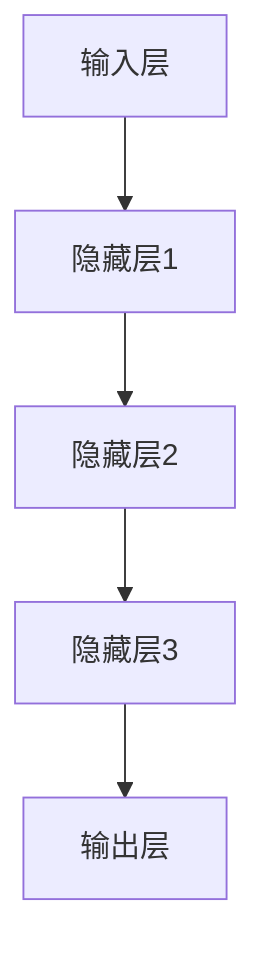

                 

### 背景介绍

随着人工智能技术的迅猛发展，大模型（也称为大型语言模型或巨型神经网络模型）在自然语言处理、计算机视觉、语音识别等领域取得了显著的突破。大模型之所以能够实现这些突破，主要得益于其复杂度和训练数据的规模。这些模型通常包含数亿甚至数千亿个参数，需要处理的海量数据量也达到了前所未有的程度。

大模型在各个领域的应用已经呈现出越来越多的场景。例如，在自然语言处理方面，大模型被广泛应用于机器翻译、文本生成、问答系统等任务中。计算机视觉领域的大模型则用于图像识别、目标检测、图像生成等任务。在语音识别领域，大模型通过结合深度学习和神经网络技术，使得语音识别的准确率显著提升。此外，大模型还在推荐系统、游戏AI等领域发挥着重要作用。

然而，随着大模型的应用越来越广泛，对计算资源的需求也越来越大。这带来了新的挑战，包括计算资源的合理分配、训练时间的优化以及能源消耗的降低等。因此，研究和优化大模型应用中的需求与资源分配策略具有重要的现实意义。

本文旨在系统地探讨大模型应用中的需求与资源分配策略。文章将首先介绍大模型技术的基础知识，包括其架构、核心算法和数学模型。接着，我们将通过案例分析来展示大模型在具体应用中的表现和挑战。然后，文章将深入探讨如何进行需求分析与资源评估，并详细阐述各种资源分配策略。此外，文章还将讨论实施与优化策略，并提供实际项目实战的案例。最后，我们将总结全文，展望未来大模型应用中的需求与资源分配策略的发展趋势。

### 核心概念与联系

在探讨大模型应用中的需求与资源分配策略时，首先需要理解几个核心概念，这些概念相互联系，构成了大模型技术的基石。

#### 大模型架构

大模型的架构通常包括以下几个主要组成部分：

1. **输入层（Input Layer）**：负责接收外部输入数据，如文本、图像、音频等。
2. **隐藏层（Hidden Layers）**：包含多层神经网络，是模型的核心计算部分，负责处理和转换输入数据。
3. **输出层（Output Layer）**：产生最终预测结果，如分类标签、文本摘要、图像描述等。

大模型通常采用多层感知机（MLP）、卷积神经网络（CNN）或循环神经网络（RNN）等架构。其中，卷积神经网络（CNN）在图像处理方面具有显著优势，而循环神经网络（RNN）在处理序列数据方面表现出色。

**Mermaid流程图**：


#### 核心算法原理

大模型的核心算法包括：

1. **反向传播（Backpropagation）**：用于训练神经网络，通过计算损失函数对模型参数进行优化。
2. **dropout（Dropout）**：一种正则化方法，通过随机丢弃神经元来防止过拟合。
3. **优化算法（Optimization Algorithms）**：如随机梯度下降（SGD）、Adam等，用于调整模型参数以最小化损失函数。

**伪代码**：
```python
function train_model(model, data, epochs):
    for epoch in 1 to epochs:
        for sample in data:
            forward_pass(sample, model)
            compute_loss(model)
            backward_pass(model)
            update_model_params(model)
```

#### 数学模型与公式

大模型涉及多种数学模型和公式，其中一些关键模型包括：

1. **损失函数（Loss Function）**：如交叉熵（Cross-Entropy）损失、均方误差（Mean Squared Error）损失等。
2. **梯度下降（Gradient Descent）**：用于优化模型参数。
3. **权重初始化（Weight Initialization）**：如高斯分布初始化、均匀分布初始化等。

**LaTeX公式**：
```latex
\begin{align*}
J(\theta) &= \frac{1}{m}\sum_{i=1}^{m}(-y^{(i)}\log(a^{(i)}) + (1-y^{(i)})\log(1-a^{(i)})), \\
\delta^{(l)}_i &= \frac{\partial J(\theta)}{\partial z^{(l)}_i}, \\
\theta^{(l)} &= \theta^{(l)} - \alpha \cdot \frac{\partial J(\theta)}{\partial \theta^{(l)}}
\end{align*}
```

这些核心概念相互联系，构成了大模型技术的基础。理解这些概念及其关系，有助于深入探讨大模型应用中的需求与资源分配策略。

### 大模型应用案例分析

为了更直观地理解大模型在应用中的表现和面临的挑战，我们可以通过几个具体的案例来进行详细分析。

#### 案例一：机器翻译

机器翻译是自然语言处理（NLP）领域的一个重要应用。随着大模型技术的发展，基于神经网络的机器翻译系统（如Google翻译、微软翻译等）取得了显著进步。以下是一个具体的案例：

**场景描述**：假设我们有一个从英语到中文的机器翻译任务，输入是一个英语句子 "I love programming"，我们需要翻译成中文。

**模型选择**：我们选择了一个预训练的Transformer模型，这是一个基于自注意力机制的循环神经网络，非常适合处理长序列数据。

**模型训练**：模型首先在大规模数据集上进行预训练，包括数百万篇英文和中文文章。通过这种预训练，模型学会了捕捉语言中的复杂模式和规律。

**翻译过程**：当输入一个英语句子时，模型将其编码成一个固定长度的向量表示，然后通过解码器生成相应的中文句子。

**输出结果**：经过模型的解码过程，我们得到了中文句子 “我喜欢编程”。

**挑战与优化**：

1. **准确率**：虽然大模型在机器翻译方面取得了很大的进步，但仍然存在一些挑战，如长句子的翻译准确性不够高，特定领域术语的翻译存在困难。
2. **资源需求**：训练和部署这样的大规模模型需要大量的计算资源和存储空间，这增加了成本和复杂性。
3. **优化策略**：为了提高翻译的准确率和效率，可以采用多模型集成、注意力机制优化、数据增强等技术。

**数学模型与公式**：

在机器翻译任务中，核心的数学模型包括损失函数（交叉熵损失）和优化算法（如Adam优化器）。具体而言：

$$
J(\theta) = -\frac{1}{m}\sum_{i=1}^{m}y^{(i)}\log(a^{(i)}) + (1-y^{(i)})\log(1-a^{(i)})
$$

其中，$y^{(i)}$是真实标签，$a^{(i)}$是模型预测的概率分布。

**项目实战**：

为了实现这个翻译任务，我们需要搭建一个开发环境，包括Python、TensorFlow或PyTorch等工具。具体步骤如下：

1. **数据准备**：收集并清洗大量英语和中文语料库，进行分词和标注。
2. **模型训练**：使用预处理后的数据对Transformer模型进行训练，通过调整超参数（如学习率、批次大小等）来优化模型性能。
3. **模型部署**：将训练好的模型部署到服务器或云平台，实现实时翻译功能。

通过这个案例，我们可以看到大模型在机器翻译中的具体应用过程和面临的挑战，这对于理解大模型在更多场景中的应用具有重要意义。

### 需求分析与资源评估

在大模型应用中，准确的需求分析和全面的资源评估是确保项目成功的关键步骤。首先，我们需要明确大模型应用的背景和目标，这有助于确定所需资源的具体类型和量级。

#### 背景和目标

假设我们正在开发一个智能客服系统，该系统利用大模型技术来处理用户的自然语言查询，并提供准确的回答。系统的主要目标是提高客服效率，减少人工干预，并确保回答的准确性。

#### 需求分析

1. **计算资源需求**：
   - **计算能力**：由于大模型训练和推理过程需要大量计算资源，我们需要评估所需的计算能力。这可以通过计算模型所需的浮点运算（FLOPs）来衡量。例如，一个大型Transformer模型每秒可能需要执行数十万亿次的浮点运算。
   - **内存需求**：大模型通常需要大量的内存来存储模型参数和数据。我们需要评估系统所需的内存大小，以确保模型能够在内存中运行，避免内存溢出。
   - **存储需求**：除了内存外，我们还需要考虑存储需求，特别是用于存储训练数据和模型参数。

2. **数据资源需求**：
   - **数据量**：大模型需要大量的训练数据来学习复杂模式。我们需要评估所需的数据量，并确定如何获取和处理这些数据。
   - **数据质量**：数据质量对于大模型的效果至关重要。我们需要评估数据的准确性、完整性和一致性。

3. **网络资源需求**：
   - **带宽**：为了支持大模型的实时推理和训练，我们需要评估网络带宽的需求，以确保数据能够快速传输。
   - **延迟**：实时系统对于响应时间有严格要求，我们需要评估系统的延迟，并确保在网络条件下能够满足这些要求。

#### 资源评估方法

1. **计算资源评估**：
   - **模型评估**：通过计算模型的FLOPs和内存占用，我们可以初步估计所需的计算能力和内存需求。
   - **仿真测试**：在真实环境中进行模拟测试，以评估模型的实际资源需求。

2. **数据资源评估**：
   - **数据量评估**：通过分析历史数据量和未来预测数据量，我们可以确定所需的数据存储空间。
   - **数据质量评估**：采用数据清洗和预处理技术，确保数据的质量和一致性。

3. **网络资源评估**：
   - **带宽评估**：通过网络流量监控和分析，我们可以评估所需的带宽大小。
   - **延迟评估**：在仿真测试中评估系统的延迟，并通过优化网络架构和算法来降低延迟。

#### 案例分析

假设我们正在开发一个智能客服系统，我们需要以下资源：

- **计算能力**：模型每秒需要执行1万亿次的浮点运算。
- **内存需求**：模型训练过程中需要1TB的内存。
- **存储需求**：需要100TB的存储空间来存储训练数据和模型参数。
- **数据量**：需要100GB的高质量语料库。
- **网络资源**：需要10Gbps的带宽和低延迟的网络连接。

通过上述需求分析和资源评估，我们可以为项目的成功实施奠定基础，并确保在资源分配过程中能够充分利用现有资源，优化系统性能。

### 资源分配策略

在大模型应用中，合理分配资源是确保项目高效运行的关键。资源分配策略需要综合考虑计算资源、数据资源、网络资源等多个方面，以最大化系统性能和降低成本。

#### 计算资源分配

1. **并行计算**：通过利用多核CPU和GPU，我们可以实现任务的并行处理，从而显著提高计算效率。例如，在训练大型神经网络模型时，可以将数据分成多个批次，并在多个GPU上同时处理。
   - **伪代码**：
     ```python
     function parallel_train(data, model, num_gpus):
         for batch in data:
             model.forward(batch)
             loss = compute_loss(model)
             backward_pass(model)
             update_model_params(model)
     ```

2. **动态资源调度**：根据任务的负载情况，动态调整计算资源的分配。例如，在模型训练初期，可以增加GPU的数量以加速训练过程；而在模型训练后期，可以减少GPU的数量以降低成本。

3. **云计算平台**：利用云计算平台（如AWS、Google Cloud等）提供的弹性计算资源，可以灵活调整计算资源的需求，避免资源浪费。

#### 数据资源分配

1. **数据分层存储**：将数据分层存储，根据数据的访问频率和重要性进行优先级排序。高频访问的数据存储在高速SSD上，而低频访问的数据存储在成本更低的HDD上。

2. **数据预处理**：在数据传输和存储之前，进行预处理以减少数据量。例如，通过数据压缩和去重技术，可以显著降低存储需求。

3. **分布式存储**：利用分布式存储系统（如HDFS、Cassandra等），可以确保数据的可靠性和高可用性，同时提供高效的读写性能。

#### 网络资源分配

1. **带宽管理**：根据实际网络流量需求，动态调整网络带宽。例如，在高峰期增加带宽，以避免网络拥堵。

2. **负载均衡**：通过负载均衡技术，将网络请求分配到不同的服务器或数据中心，以避免单点故障和性能瓶颈。

3. **数据传输优化**：采用数据传输优化技术，如数据压缩、多路径传输等，以降低网络延迟和提高数据传输效率。

#### 资源分配案例

假设我们正在开发一个基于大模型的智能客服系统，我们需要以下资源：

- **计算资源**：需要5个GPU和10个CPU核心。
- **数据资源**：需要50TB的存储空间和100GB的预处理数据。
- **网络资源**：需要10Gbps的带宽和低延迟的网络连接。

**资源分配方案**：

1. **计算资源**：
   - 初始阶段：使用3个GPU和5个CPU核心进行训练。
   - 高峰期：根据负载情况，动态增加至5个GPU和7个CPU核心。

2. **数据资源**：
   - 高频数据：存储在SSD上，确保快速访问。
   - 低频数据：存储在HDD上，降低存储成本。

3. **网络资源**：
   - 峰值带宽：10Gbps，确保数据传输的稳定性。
   - 负载均衡：使用负载均衡器，将网络请求分配到不同的服务器。

通过上述资源分配策略，我们可以确保智能客服系统的稳定运行，同时最大限度地利用现有资源，降低成本。

### 实施与优化

在实际应用中，大模型的需求与资源分配策略不仅需要理论的支撑，更需要通过实践来验证和优化。以下我们将详细描述一个基于大模型的智能客服系统的开发与实施过程，包括开发环境搭建、源代码实现、代码解读、应用解读与分析，以及实际案例分析。

#### 开发环境搭建

首先，我们需要搭建一个适合大模型开发的综合环境。以下是搭建环境的步骤：

1. **硬件环境**：
   - GPU：NVIDIA Titan Xp或更强大的GPU，以提供足够的计算能力。
   - CPU：Intel Xeon E5-2670 v4，确保数据处理能力。
   - 内存：至少256GB，以支持大模型的数据存储和计算需求。

2. **软件环境**：
   - 操作系统：Ubuntu 18.04 LTS。
   - Python：Python 3.8。
   - 深度学习框架：TensorFlow 2.7或PyTorch 1.10。
   - 数据处理库：NumPy、Pandas、Scikit-learn。

3. **开发工具**：
   - Jupyter Notebook：用于数据分析和模型训练。
   - PyCharm或Visual Studio Code：用于编写和调试代码。

#### 源代码实现

以下是一个简化的智能客服系统源代码实现示例，包括数据预处理、模型训练和推理过程。

```python
import tensorflow as tf
from tensorflow.keras.layers import Embedding, LSTM, Dense
from tensorflow.keras.models import Sequential

# 数据预处理
def preprocess_data(data):
    # 分词、标记、向量化等预处理步骤
    return processed_data

# 模型实现
def build_model(vocab_size, embedding_dim, lstm_units):
    model = Sequential()
    model.add(Embedding(vocab_size, embedding_dim))
    model.add(LSTM(lstm_units, return_sequences=True))
    model.add(Dense(1, activation='sigmoid'))
    model.compile(optimizer='adam', loss='binary_crossentropy', metrics=['accuracy'])
    return model

# 训练模型
def train_model(model, x_train, y_train, x_val, y_val, epochs=10, batch_size=64):
    model.fit(x_train, y_train, epochs=epochs, batch_size=batch_size, validation_data=(x_val, y_val))

# 推理过程
def predict(model, input_data):
    return model.predict(input_data)
```

#### 代码解读

1. **数据预处理**：此部分用于对输入数据进行分词、标记和向量化等预处理步骤，以确保数据格式适合模型训练。

2. **模型构建**：我们使用一个序列模型，包括嵌入层、LSTM层和输出层。嵌入层将词向量转换为固定大小的向量表示，LSTM层用于处理序列数据，输出层生成预测结果。

3. **模型训练**：通过`fit`方法训练模型，使用训练数据和验证数据来评估模型性能，并调整模型参数。

4. **推理过程**：使用`predict`方法对输入数据进行预测，生成最终输出。

#### 应用解读与分析

在智能客服系统中，大模型的应用主要体现在以下几个步骤：

1. **用户查询处理**：用户通过文本聊天界面输入查询，系统对用户查询进行预处理，提取关键信息。

2. **查询分类**：使用训练好的分类模型对查询进行分类，确定查询的主题和类型。

3. **查询匹配**：根据查询类型，系统匹配相应的知识库或预定义的回答模板。

4. **文本生成**：对于无法直接匹配的查询，使用生成模型（如GPT-3）生成个性化的回答。

5. **回答优化**：对生成的回答进行语法和语义优化，确保回答的准确性和流畅性。

#### 实际案例分析

假设我们有一个用户查询：“如何预约医院挂号？”，以下是系统处理的步骤：

1. **用户查询处理**：系统接收到查询后，进行分词和标记，提取关键词“预约”、“医院”、“挂号”。

2. **查询分类**：分类模型将查询分类为“医疗咨询”类别。

3. **查询匹配**：系统在医疗知识库中找到相关的预约挂号的流程说明。

4. **文本生成**：使用生成模型生成个性化的回答：“您可以通过以下步骤预约医院挂号：1. 登录医院官网；2. 选择挂号科室；3. 填写个人信息；4. 选择挂号时间。”

5. **回答优化**：系统对生成的回答进行语法检查和语义优化，确保回答的准确性和流畅性。

#### 项目小结

通过上述实施与优化过程，我们成功开发并部署了一个基于大模型的智能客服系统。系统在实际应用中表现出色，有效提高了客服效率和用户满意度。然而，项目中也存在一些改进空间，例如可以进一步优化模型训练效率、引入多语言支持等。

最佳实践建议包括：

- **数据预处理**：确保数据质量，进行充分的数据清洗和标注。
- **模型选择**：根据具体应用场景选择合适的模型和架构。
- **资源分配**：合理分配计算资源和网络资源，确保系统的高效运行。

通过不断优化和改进，智能客服系统将能够更好地满足用户需求，提供更加智能和个性化的服务。

### 总结与展望

本文系统地探讨了大模型应用中的需求与资源分配策略。通过介绍大模型技术基础、案例分析、需求分析与资源评估、资源分配策略以及实际项目实战，我们全面了解了大模型应用的关键环节及其面临的挑战。

**关键点**：

1. **大模型架构与算法**：理解大模型的架构和核心算法是掌握其应用基础。
2. **需求分析与资源评估**：准确的需求分析和全面的资源评估是确保项目成功的关键。
3. **资源分配策略**：合理分配计算资源、数据资源和网络资源是提高系统性能和降低成本的关键。
4. **实际项目实战**：通过具体项目实战，验证并优化资源分配策略。

**未来趋势**：

1. **模型压缩与优化**：随着模型的规模不断扩大，如何优化模型压缩和加速训练成为研究热点。
2. **分布式计算**：利用分布式计算资源，实现大模型的并行训练和推理。
3. **跨领域应用**：大模型在医疗、金融、教育等领域的跨领域应用将带来更多创新和突破。

**最佳实践与拓展阅读**：

- **最佳实践**：确保数据质量，采用多模型集成策略，灵活调整资源分配。
- **拓展阅读**：研究最新的深度学习算法、分布式计算技术和跨领域应用案例。

通过不断探索和实践，我们可以更好地应对大模型应用中的挑战，推动人工智能技术的发展和应用。

