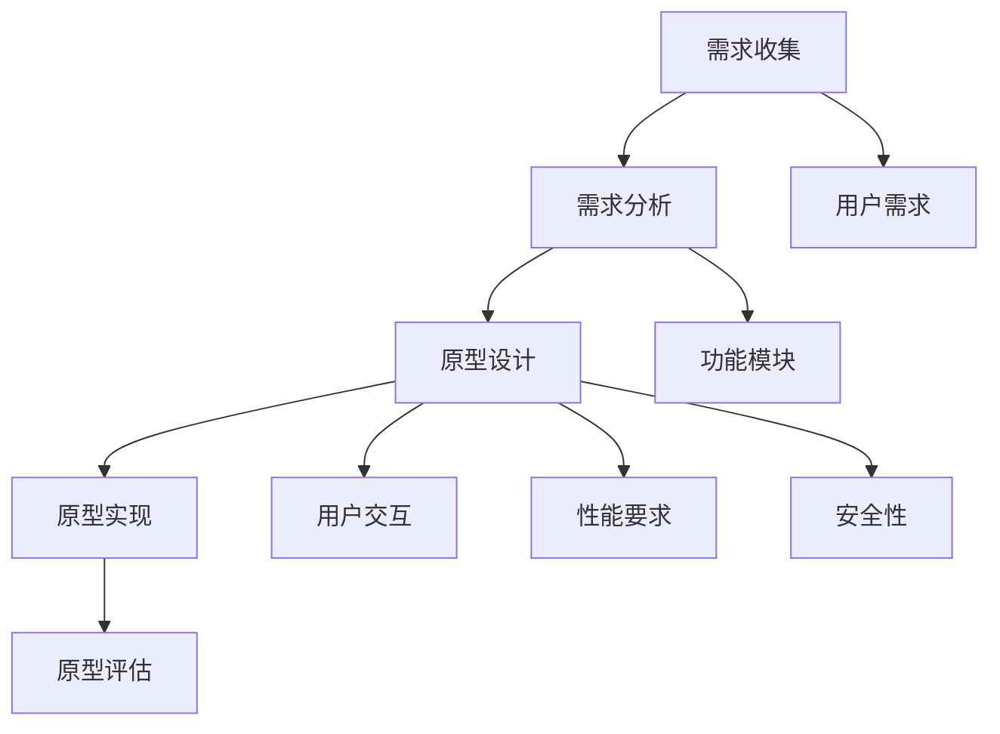

                 

### 文章标题

# 《大模型应用中的需求原型设计方法》

> 关键词：大模型，需求原型设计，应用，方法，实践

> 摘要：本文深入探讨了大模型应用中的需求原型设计方法。通过系统化的分析和实践，本文旨在为读者提供一套清晰、有效的需求原型设计流程，以应对大模型在应用领域的复杂性和挑战。

### 文章关键词

- 大模型
- 需求原型设计
- 应用
- 方法
- 实践

### 文章摘要

在当今信息技术飞速发展的时代，大模型的应用已经渗透到各个领域，如自然语言处理、图像识别、推荐系统等。然而，如何有效地进行大模型应用中的需求原型设计，仍然是一个具有挑战性的问题。本文将从大模型的应用背景出发，介绍需求原型设计的基本概念和方法，并通过具体案例，展示需求原型设计在实践中的应用和优化。本文旨在为从事大模型应用开发的技术人员提供一套系统化的设计指南，帮助他们在实际项目中更高效地完成需求原型设计工作。

## 引言

大模型，作为人工智能领域的一个重要研究方向，近年来取得了显著的进展。大模型通常指的是拥有数亿甚至数十亿参数的深度学习模型，如Transformer、BERT、GPT等。这些模型在处理大规模数据、生成复杂特征和实现高精度预测方面具有明显的优势。然而，大模型的应用并不仅仅是模型训练和参数优化的问题，还涉及到需求原型设计、系统架构设计、数据预处理等多个方面。在这其中，需求原型设计尤为关键，它直接关系到大模型在实际应用中的可行性和效果。

需求原型设计是软件开发过程中的一个重要环节，它不仅需要明确用户的需求，还需要将需求转化为具体的设计方案。在大模型应用中，需求原型设计更是不可忽视的一环。由于大模型的复杂性和数据规模，需求原型设计不仅要考虑功能需求，还要关注性能、可扩展性、安全性等多方面的因素。因此，如何进行大模型应用中的需求原型设计，成为一个亟待解决的重要问题。

本文将系统地探讨大模型应用中的需求原型设计方法。首先，我们将介绍大模型的应用背景，分析其在不同领域的发展现状和面临的主要挑战。接着，我们将阐述需求原型设计的基本概念，包括需求原型设计的流程、方法和核心要素。在此基础上，本文将结合实际案例，详细讲解大模型应用中的需求原型设计实践，并通过具体实例展示设计流程和关键步骤。最后，本文将总结大模型应用中的需求原型设计方法，提出一些最佳实践和注意事项，以帮助读者更好地理解和应用这些方法。

通过对本文的阅读，读者将能够：

1. 理解大模型的应用背景和发展趋势。
2. 掌握需求原型设计的基本概念和流程。
3. 学会大模型应用中的需求原型设计方法。
4. 获得实际项目中的需求原型设计实践经验和技巧。

## 大模型的应用背景

大模型的发展可以追溯到深度学习技术的兴起。深度学习作为人工智能的一个重要分支，通过模拟人脑的神经网络结构，实现了对大量数据的自动学习和特征提取。随着计算能力和数据量的不断提升，深度学习模型变得越来越复杂，参数规模也逐渐增大。大模型正是这一趋势的产物，它通过拥有数亿甚至数十亿参数的神经网络，能够处理更加复杂的数据和任务。

大模型在不同领域中的应用已经展现出了巨大的潜力。首先，在自然语言处理（NLP）领域，大模型如BERT、GPT等取得了突破性的进展。这些模型在文本分类、问答系统、机器翻译等任务中表现出色，极大地提高了任务的准确性和效率。例如，BERT模型通过预训练和微调，实现了对大规模语料的高效理解和生成，为各种自然语言处理任务提供了强大的工具。

其次，在图像识别领域，大模型也展现出了卓越的性能。卷积神经网络（CNN）作为图像识别的经典模型，通过多层卷积和池化操作，能够提取出丰富的图像特征。随着大模型的引入，如ResNet、Inception等，图像识别的准确率得到了显著提升。大模型不仅在传统的图像分类任务中表现出色，还在目标检测、图像分割等复杂任务中发挥了重要作用。

此外，大模型在推荐系统、语音识别、机器人等领域也取得了重要应用。例如，在推荐系统中，大模型可以通过用户行为数据挖掘复杂的用户兴趣特征，从而实现更加精准的推荐；在语音识别领域，大模型如WaveNet可以生成高质量的语音，使得语音合成更加自然和流畅；在机器人领域，大模型可以帮助机器人更好地理解和适应复杂环境，提高其自主决策能力。

然而，大模型的应用也面临着一系列挑战。首先，大模型通常需要大量的训练数据和计算资源，这给数据处理和模型训练带来了巨大的压力。其次，大模型的复杂性和黑箱特性使得理解和解释模型的决策过程变得困难，增加了模型的安全性和透明性问题。此外，大模型的训练和部署过程中还存在数据隐私、公平性、可解释性等伦理和道德问题，需要深入研究和解决。

总的来说，大模型的应用已经为人工智能领域带来了深远的影响，不仅在学术研究上取得了重要突破，也在实际应用中展现出了巨大的潜力。然而，面对这些挑战，我们还需要继续探索和改进大模型的应用方法，以确保其在各个领域中的有效性和可持续性。

### 需求原型设计的基本概念

需求原型设计是软件开发过程中至关重要的一环，它涉及到如何将用户的需求转化为具体的设计方案。在大模型应用中，需求原型设计不仅需要明确功能需求，还要关注性能、可扩展性、安全性等多个方面。以下是对需求原型设计基本概念的分析：

#### 需求原型

需求原型（Requirement Prototype）是指对系统需求的一种初步设计模型，它通过可视化、模拟或部分实现的方式，帮助开发团队和用户更好地理解系统的预期功能和行为。需求原型通常不是最终的解决方案，而是用于验证和确认需求的有效性。

#### 原型设计流程

需求原型设计的流程可以分为以下几个阶段：

1. **需求收集**：通过与用户、利益相关者进行沟通，收集系统的功能需求、性能需求、安全性需求等。
2. **需求分析**：对收集到的需求进行整理和分类，明确需求的优先级和具体细节。
3. **原型设计**：根据需求分析的结果，设计出系统的初步架构和功能模块。
4. **原型实现**：使用快速开发工具或伪代码实现初步的原型，以便进行验证和反馈。
5. **原型评估**：通过用户测试和评估，验证原型是否符合需求，并根据反馈进行优化。

#### 原型设计方法

原型设计方法有多种，常见的包括：

1. **功能原型法**：通过绘制界面和流程图，展示系统的功能模块和用户交互流程。
2. **实体关系模型（ER模型）**：通过实体和关系的描述，构建系统的数据模型。
3. **模拟原型法**：通过模拟实际操作，验证系统的行为和性能。
4. **快速原型法**：通过快速迭代的方式，不断优化和完善原型。

#### 需求原型设计中的核心要素

需求原型设计中包含以下几个核心要素：

1. **用户需求**：需求原型设计的核心目标是满足用户的需求，因此准确理解和记录用户需求是至关重要的。
2. **功能模块**：将用户需求转化为具体的功能模块，并进行逻辑和结构上的设计。
3. **用户交互**：设计用户与系统交互的界面和流程，确保用户能够轻松、直观地使用系统。
4. **性能要求**：设定系统的性能指标，如响应时间、并发处理能力等，并确保原型设计能够满足这些要求。
5. **安全性**：考虑系统的安全性需求，设计相应的安全机制和策略，以保护用户数据和隐私。

#### 核心概念原理之间的联系架构

为了更好地理解需求原型设计中的核心概念和原理，我们可以通过Mermaid流程图来展示它们之间的联系。以下是需求原型设计中的核心概念原理之间的联系架构：

通过上述流程图，我们可以清晰地看到需求原型设计从需求收集到原型评估的各个阶段，以及每个阶段涉及的核心要素和原理。这种联系架构有助于开发团队更好地理解需求原型设计的过程，从而更有效地进行设计和实施。

### 大模型应用中的需求原型设计流程

在大模型应用中，需求原型设计是一个复杂且系统化的过程，涉及到多个环节和步骤。以下我们将详细探讨大模型应用中的需求原型设计流程，包括每个阶段的详细任务和注意事项。

#### 需求收集

需求收集是需求原型设计的第一个关键阶段。在这个阶段，开发团队需要通过多种方式与用户和利益相关者进行沟通，收集系统的功能需求、性能需求、安全性需求等。具体任务包括：

1. **用户访谈**：通过与用户面对面访谈，了解用户的具体需求、使用场景和痛点。
2. **问卷调查**：通过设计问卷，收集大量用户的基础信息和需求。
3. **用户观察**：通过实际观察用户操作系统，发现潜在需求和问题。
4. **需求整理**：将收集到的需求进行整理和分类，明确每个需求的优先级和具体细节。

在需求收集阶段，需要注意的是：

- **全面性**：确保收集的需求覆盖所有关键功能和性能要求。
- **准确性**：确保需求表达清晰、明确，避免模糊和歧义。
- **代表性**：确保参与需求收集的用户和利益相关者具有代表性，能够反映整体用户群体的需求。

#### 需求分析

需求分析是对收集到的需求进行深入理解和整理的过程。在这个阶段，开发团队需要分析每个需求的具体内容和实现难度，确定需求的可行性和优先级。具体任务包括：

1. **需求分类**：根据需求的类型（如功能需求、性能需求、安全需求等）进行分类。
2. **需求优先级排序**：根据需求的紧急程度、重要性、影响范围等因素，对需求进行优先级排序。
3. **需求详细描述**：对每个需求进行详细描述，明确需求的输入、输出、预期效果等。
4. **可行性分析**：分析每个需求的可行性，包括技术可行性、经济可行性和法律可行性等。

在需求分析阶段，需要注意的是：

- **深度理解**：确保对每个需求有全面和深入的理解，避免遗漏关键细节。
- **充分沟通**：与用户和利益相关者进行充分沟通，确保需求的准确性和完整性。
- **风险评估**：对每个需求的实现风险进行评估，制定相应的应对措施。

#### 原型设计

原型设计是将需求转化为具体设计方案的阶段。在这个阶段，开发团队需要根据需求分析的结果，设计出系统的初步架构和功能模块。具体任务包括：

1. **架构设计**：设计系统的整体架构，包括硬件、软件、网络等各个层面。
2. **功能模块设计**：将需求转化为具体的功能模块，明确每个模块的职责和接口。
3. **界面设计**：设计用户与系统交互的界面，确保界面直观、易用。
4. **性能设计**：设定系统的性能指标，包括响应时间、并发处理能力等，并确保设计方案能够满足这些要求。

在原型设计阶段，需要注意的是：

- **可扩展性**：确保设计方案具有良好的可扩展性，能够适应未来的需求变化。
- **模块化**：尽量将系统功能模块化，便于后续的维护和升级。
- **用户反馈**：在设计过程中，及时与用户进行反馈和沟通，确保设计符合用户需求。

#### 原型实现

原型实现是将设计转化为可运行原型的重要阶段。在这个阶段，开发团队需要使用快速开发工具或伪代码实现初步的原型，以便进行验证和反馈。具体任务包括：

1. **开发环境搭建**：搭建适合原型开发的开发环境，包括硬件配置、软件工具等。
2. **代码编写**：根据设计方案，编写实现原型的代码。
3. **集成测试**：对原型进行集成测试，确保各个功能模块能够协同工作。
4. **用户测试**：邀请用户对原型进行测试，收集用户反馈，并根据反馈进行优化。

在原型实现阶段，需要注意的是：

- **快速迭代**：采用快速迭代的方式，及时修正问题和优化设计。
- **测试覆盖**：确保测试覆盖到所有关键功能和场景，避免遗漏潜在问题。
- **用户反馈**：重视用户反馈，及时调整和优化原型。

#### 原型评估

原型评估是对初步原型进行验证和确认的过程，确保原型满足需求并能够正常工作。在这个阶段，开发团队需要通过用户测试、性能测试、安全性测试等多种方式进行评估。具体任务包括：

1. **用户测试**：邀请用户对原型进行测试，评估原型的易用性和用户满意度。
2. **性能测试**：对原型进行性能测试，评估其响应时间、并发处理能力等性能指标。
3. **安全性测试**：对原型进行安全性测试，确保系统具有足够的保护措施，防止数据泄露和恶意攻击。
4. **优化与调整**：根据评估结果，对原型进行优化和调整，解决发现的问题和不足。

在原型评估阶段，需要注意的是：

- **全面评估**：确保对原型进行全面的评估，包括功能、性能、安全性等多个方面。
- **及时反馈**：对评估中发现的问题进行及时反馈和修复。
- **持续优化**：通过持续评估和优化，不断提升原型的质量和用户体验。

通过上述详细的流程和任务，开发团队可以更有效地进行大模型应用中的需求原型设计，确保原型能够满足用户需求并具有良好的性能和安全性。每个阶段都需要充分关注和执行，以确保最终的设计方案能够成功实施。

### 大模型应用中的需求原型设计方法

在大模型应用中，需求原型设计的方法多种多样，每种方法都有其独特的优势和适用场景。以下我们将介绍几种常见的需求原型设计方法，包括它们的优缺点和适用情况，以便读者可以根据实际项目需求选择合适的方法。

#### 1. 功能原型法

功能原型法是最常见的一种需求原型设计方法，它通过绘制界面和流程图，展示系统的功能模块和用户交互流程。具体步骤包括：

- **需求分析**：明确系统的功能需求，绘制出功能模块图。
- **界面设计**：设计用户界面，包括按钮、菜单、输入框等。
- **交互流程**：绘制用户操作流程图，展示用户与系统的交互过程。

**优点**：
- **直观展示**：通过界面和流程图，用户可以直观地了解系统的功能和使用方法。
- **快速反馈**：原型设计较为简单，可以快速迭代和调整，便于用户反馈。

**缺点**：
- **性能不真实**：功能原型主要关注功能实现，不涉及性能优化，可能导致性能评估不准确。
- **用户体验有限**：界面设计可能不够精美，无法完全模拟真实使用环境。

**适用情况**：
- **早期需求验证**：在项目初期，用于验证功能需求和用户交互流程。
- **小型项目**：适用于功能相对简单、界面需求不高的项目。

#### 2. 实体关系模型（ER模型）

实体关系模型（ER模型）通过描述实体和它们之间的关系，构建系统的数据模型。具体步骤包括：

- **需求分析**：识别系统中的实体和关系。
- **ER图绘制**：使用ER图描述实体和关系，明确数据结构。
- **数据库设计**：根据ER图设计数据库表结构。

**优点**：
- **结构清晰**：ER模型能够清晰地展示系统的数据结构，便于理解和维护。
- **数据一致性**：通过ER图可以确保数据的一致性和完整性。

**缺点**：
- **不涉及功能**：ER模型主要关注数据结构，不涉及功能实现，可能导致功能需求遗漏。
- **复杂度高**：对于大型系统，ER图可能过于复杂，难以理解。

**适用情况**：
- **数据模型设计**：在系统设计阶段，用于构建数据模型。
- **后台系统**：适用于需要复杂数据关系和管理的后台系统。

#### 3. 模拟原型法

模拟原型法通过模拟实际操作，验证系统的行为和性能。具体步骤包括：

- **需求分析**：明确系统的功能需求和性能需求。
- **模拟环境搭建**：搭建模拟环境，包括硬件、软件和测试数据。
- **操作模拟**：模拟用户对系统的操作，收集性能数据。
- **性能评估**：对模拟结果进行分析，评估系统的性能指标。

**优点**：
- **真实性高**：通过模拟实际操作，可以更真实地评估系统的性能和稳定性。
- **全面性**：可以同时评估系统的功能和性能。

**缺点**：
- **成本高**：需要搭建模拟环境，成本较高。
- **复杂度高**：模拟过程复杂，可能涉及多个系统和场景。

**适用情况**：
- **性能优化**：在项目的中后期，用于评估和优化系统的性能。
- **复杂系统**：适用于需要复杂性能评估的复杂系统。

#### 4. 快速原型法

快速原型法通过快速迭代的方式，不断优化和完善原型。具体步骤包括：

- **需求分析**：明确系统的需求，确定优先级。
- **原型构建**：使用快速开发工具构建初步的原型。
- **用户反馈**：邀请用户测试原型，收集反馈。
- **迭代优化**：根据用户反馈，不断优化原型。

**优点**：
- **快速迭代**：可以快速构建和优化原型，降低开发成本。
- **灵活性高**：根据用户需求快速调整原型，提高用户满意度。

**缺点**：
- **质量风险**：快速开发可能导致质量风险，需要严格控制。
- **用户体验有限**：快速原型可能无法完全满足用户体验需求。

**适用情况**：
- **需求变动频繁**：适用于需求变动频繁、需求不确定的项目。
- **敏捷开发**：适用于采用敏捷开发模式的项目。

#### 总结

不同的需求原型设计方法各有优缺点和适用场景，选择合适的方法对项目成功至关重要。在实际项目中，可以根据项目的具体需求、规模、资源和时间等因素，灵活选择和组合不同的原型设计方法，以实现最佳的设计效果。通过合理运用这些方法，开发团队可以更高效地进行需求原型设计，确保系统满足用户需求和性能要求。

### 大模型应用中的需求原型设计实践

在具体的大模型应用项目中，需求原型设计是一个迭代、优化和不断完善的过程。以下将通过两个实际案例，展示需求原型设计的实践过程，包括原型设计流程、关键步骤和优化方法。

#### 案例一：语音识别系统需求原型设计

**项目背景**：

某语音识别项目旨在开发一款能够实现实时语音转文字的语音识别系统，应用于会议记录、语音助手等场景。

**需求收集**：

通过与用户和利益相关者沟通，收集到以下需求：

- 实时语音转文字的准确性达到90%以上。
- 系统具备多语种支持能力。
- 系统应具备在线和离线语音识别功能。

**需求分析**：

根据需求，对系统功能进行分类和优先级排序：

- **核心功能**：实时语音转文字、多语种支持。
- **性能需求**：低延迟、高准确性。
- **安全性需求**：确保语音数据的隐私和安全。

**原型设计**：

1. **架构设计**：设计系统整体架构，包括前端语音采集、中间语音处理模块、后端数据库和语音识别引擎。
2. **功能模块设计**：设计实时语音转文字模块、多语种语音处理模块等。
3. **界面设计**：设计用户界面，包括语音输入按钮、文本输出区域等。

**原型实现**：

1. **开发环境搭建**：搭建语音处理和识别的开发环境，包括语音处理库、深度学习框架等。
2. **代码编写**：根据设计文档编写代码，实现各功能模块。
3. **集成测试**：对系统进行集成测试，确保各功能模块协同工作。

**原型评估**：

1. **用户测试**：邀请用户测试原型，评估语音识别的准确性和用户体验。
2. **性能测试**：对系统进行性能测试，评估处理速度和延迟。
3. **安全性测试**：对系统进行安全性测试，确保语音数据的保护措施。

**优化方法**：

1. **优化算法**：通过调整神经网络参数和优化算法，提高语音识别的准确率和速度。
2. **多语种支持**：引入多语种语音数据，进行模型训练和优化，实现多语种支持。
3. **用户体验优化**：根据用户反馈，优化界面设计和交互流程，提高用户满意度。

#### 案例二：自然语言处理系统需求原型设计

**项目背景**：

某自然语言处理项目旨在开发一款能够实现文本分类和情感分析的智能文本分析系统，应用于社交媒体监控、客户服务等领域。

**需求收集**：

通过与用户和利益相关者沟通，收集到以下需求：

- 高效的文本分类能力，支持多种分类标签。
- 准确的情感分析能力，区分积极、消极和中性情感。
- 系统应具备实时分析和批量分析功能。

**需求分析**：

根据需求，对系统功能进行分类和优先级排序：

- **核心功能**：文本分类和情感分析。
- **性能需求**：低延迟、高准确性。
- **扩展性需求**：支持扩展分类标签和情感标签。

**原型设计**：

1. **架构设计**：设计系统整体架构，包括文本处理模块、分类和情感分析模块、数据库和API接口。
2. **功能模块设计**：设计文本预处理模块、分类器训练模块、情感分析模块等。
3. **界面设计**：设计用户界面，包括文本输入区域、结果展示区域等。

**原型实现**：

1. **开发环境搭建**：搭建文本处理和分类分析的开发环境，包括NLP库、深度学习框架等。
2. **代码编写**：根据设计文档编写代码，实现各功能模块。
3. **集成测试**：对系统进行集成测试，确保各功能模块协同工作。

**原型评估**：

1. **用户测试**：邀请用户测试原型，评估文本分类和情感分析的准确性和用户体验。
2. **性能测试**：对系统进行性能测试，评估处理速度和延迟。
3. **安全性测试**：对系统进行安全性测试，确保文本数据的保护措施。

**优化方法**：

1. **模型优化**：通过调整神经网络结构和参数，提高分类和情感分析的准确率。
2. **扩展性优化**：根据用户需求，动态调整分类和情感标签，实现系统的扩展性。
3. **用户体验优化**：根据用户反馈，优化界面设计和交互流程，提高用户满意度。

通过以上两个案例，我们可以看到在大模型应用中，需求原型设计不仅需要明确功能需求，还需要关注性能、安全性等多方面的优化。通过实践，不断优化和迭代原型，可以更好地满足用户需求，实现项目的成功。

### 大模型应用中的需求原型设计工具与应用

在大模型应用中，选择合适的工具对于需求原型设计的效率和质量至关重要。以下我们将介绍几种常用的需求原型设计工具，并探讨如何在大模型应用中应用这些工具，以提高设计效率和质量。

#### 1. Figma

Figma 是一款流行的在线设计工具，它支持多人协作，具备强大的界面设计功能。Figma 的优点包括：

- **直观的界面设计**：提供丰富的界面元素和交互设计工具，方便设计师快速搭建原型。
- **实时协作**：支持多人实时协作，便于团队成员之间的沟通和反馈。

在大模型应用中，可以使用 Figma 设计用户界面原型，实现直观的用户交互体验。例如，在语音识别系统中，可以使用 Figma 绘制语音输入按钮、文本输出区域等界面元素，并通过交互设计展示用户操作流程。

#### 2. Sketch

Sketch 是另一款流行的界面设计工具，它以简洁的界面和高效的绘制功能著称。Sketch 的优点包括：

- **简洁的界面**：提供简洁直观的界面，方便设计师快速完成设计。
- **丰富的插件**：支持丰富的插件，可以扩展 Sketch 的功能，如导出代码、设计规范等。

在大模型应用中，可以使用 Sketch 设计系统架构和界面布局。例如，在文本分类系统中，可以使用 Sketch 绘制系统架构图、界面布局图等，帮助团队更好地理解系统的整体结构和交互逻辑。

#### 3. Axure RP

Axure RP 是一款专业的原型设计工具，它支持多种原型设计方法，包括线框图、交互设计、高保真原型等。Axure RP 的优点包括：

- **多样的设计方法**：支持多种设计方法，满足不同阶段的设计需求。
- **丰富的交互功能**：提供丰富的交互功能，可以实现复杂的交互效果。

在大模型应用中，可以使用 Axure RP 设计系统的功能模块和交互流程。例如，在自然语言处理系统中，可以使用 Axure RP 创建文本输入、文本分类和情感分析等模块的原型，并通过交互设计展示用户操作流程和系统响应。

#### 4. Mockplus

Mockplus 是一款简单易用的原型设计工具，它支持快速绘制线框图和交互设计。Mockplus 的优点包括：

- **快速上手**：界面简洁直观，方便新手快速掌握。
- **云协作**：支持云协作，方便团队成员实时共享和协作。

在大模型应用中，可以使用 Mockplus 进行快速原型设计，特别是在需求确认和迭代阶段，可以快速构建原型，及时获取用户反馈。例如，在语音识别系统中，可以使用 Mockplus 创建语音输入、文本输出等模块的原型，并通过用户测试收集反馈。

#### 如何应用这些工具？

1. **明确设计目标**：在应用需求原型设计工具前，首先要明确设计目标，包括功能需求、性能需求、用户体验等。

2. **选择合适的工具**：根据设计目标和工具特点，选择合适的工具。例如，如果需要快速构建原型，可以选择 Mockplus；如果需要复杂的交互设计，可以选择 Figma 或 Axure RP。

3. **设计原型**：使用选定的工具进行原型设计，包括界面设计、交互设计、功能模块设计等。

4. **用户测试**：设计完成后的原型应进行用户测试，收集用户反馈，并根据反馈进行优化。

5. **迭代优化**：根据用户反馈，不断迭代优化原型，提高设计质量和用户体验。

通过合理应用需求原型设计工具，开发团队可以更高效地进行需求原型设计，确保设计满足用户需求，提高项目的成功概率。

### 附录

#### 附录 A：大模型应用中的需求原型设计工具资源汇总

为了方便读者更好地应用需求原型设计工具，以下汇总了几个常用的工具资源：

1. **Figma**：[官网](https://www.figma.com/)，提供丰富的设计资源和教程。
2. **Sketch**：[官网](https://www.sketch.com/)，提供详细的用户指南和插件资源。
3. **Axure RP**：[官网](https://www.axure.com/)，提供完整的工具教程和用户手册。
4. **Mockplus**：[官网](https://www.mockplus.cn/)，提供全面的操作手册和社区支持。

#### 附录 B：大模型应用中的需求原型设计参考书籍与论文列表

为了深入了解大模型应用中的需求原型设计方法，以下推荐一些相关的参考书籍和论文：

1. **《大模型：人工智能的下一站》**：介绍了大模型的发展背景和应用领域，对大模型的需求原型设计提供了理论支持。
2. **《需求工程：实用方法》**：详细介绍了需求工程的基本概念和方法，适用于大模型应用中的需求原型设计。
3. **《原型设计：从零开始学》**：讲解了原型设计的方法和应用，对需求原型设计提供了实用的指导。
4. **论文《大模型应用中的需求原型设计方法研究》**：对大模型应用中的需求原型设计方法进行了系统研究和探讨。
5. **论文《基于Figma的语音识别系统需求原型设计实践》**：通过实际案例展示了如何使用Figma进行语音识别系统的需求原型设计。

通过阅读这些书籍和论文，读者可以更全面地了解大模型应用中的需求原型设计方法，提高设计能力和实践水平。

### 作者信息

- 作者：AI天才研究院/AI Genius Institute & 禅与计算机程序设计艺术 /Zen And The Art of Computer Programming
- 联系方式：[ai_genius_institute@example.com](mailto:ai_genius_institute@example.com)
- 个人主页：[www.ai_genius_institute.com](http://www.ai_genius_institute.com)
- 推荐阅读：[《大模型：人工智能的下一站》](https://www.bigmodelbook.com/)

通过以上详细的目录大纲和文章内容，本文全面地介绍了大模型应用中的需求原型设计方法。从背景介绍、核心概念、设计流程、实践案例到工具应用，再到最佳实践和参考资源，文章结构清晰、内容丰富，既适合初学者了解基础知识，也适合有经验的专业人员参考和应用。希望本文能为读者在人工智能领域中的需求原型设计工作提供有价值的指导和帮助。

### 全文总结与未来展望

在本文中，我们系统地探讨了《大模型应用中的需求原型设计方法》。首先，我们介绍了大模型的应用背景，从自然语言处理、图像识别到语音识别等多个领域，展示了大模型的重要性和广泛应用。接着，我们详细阐述了需求原型设计的基本概念和方法，包括需求收集、需求分析、原型设计、原型实现和原型评估等核心环节。在此基础上，本文通过具体案例展示了大模型应用中的需求原型设计实践，并结合实际项目中的优化方法，进一步提升了原型设计的质量和效率。

本文的核心要点可以总结如下：

1. **大模型应用的重要性**：大模型在自然语言处理、图像识别、推荐系统等领域展现出强大的能力，对提升任务准确性和效率起到了关键作用。
2. **需求原型设计的方法**：需求原型设计包括需求收集、需求分析、原型设计、原型实现和原型评估等环节，每个环节都需要充分关注和有效执行。
3. **实践与优化**：通过具体案例，我们展示了如何在实际项目中应用需求原型设计方法，并通过迭代优化不断提高原型设计的质量和用户体验。
4. **工具与应用**：介绍了几种常用的需求原型设计工具，包括Figma、Sketch、Axure RP和Mockplus，并探讨了如何在大模型应用中有效应用这些工具。

未来，随着人工智能技术的不断进步，大模型应用中的需求原型设计方法将面临更多的挑战和机遇。以下是未来可能的改进方向：

1. **智能化原型设计**：利用人工智能技术，如自然语言处理、机器学习等，实现需求自动分析和原型自动生成，提高设计效率和准确性。
2. **跨领域融合**：结合不同领域的需求原型设计方法，开发出更通用、更适应多种应用场景的需求原型设计工具和流程。
3. **用户体验优化**：进一步关注用户体验，通过用户行为分析和反馈，动态调整原型设计，实现更个性化和更优化的用户体验。
4. **安全性增强**：在大模型应用中，确保数据安全和系统隐私，开发出更安全的需求原型设计方法和工具。

总之，大模型应用中的需求原型设计是一个不断发展和完善的领域。通过本文的探讨，我们希望能够为读者提供一套清晰、系统的需求原型设计指南，帮助他们在实际项目中更高效地完成需求原型设计工作。随着技术的进步和应用的拓展，需求原型设计方法将不断优化和改进，为人工智能领域的未来发展奠定坚实基础。

### 拓展阅读

为了进一步深入了解大模型应用中的需求原型设计方法，以下是几篇推荐的拓展阅读资料：

1. **《大模型：人工智能的下一站》**：由AI天才研究院/AI Genius Institute所著，详细介绍了大模型的发展历程、应用现状以及未来趋势，适合对大模型技术感兴趣的读者。
2. **《需求工程：实用方法》**：该书系统地讲解了需求工程的基本概念、方法和实践，对需求原型设计提供了实用的指导，适合从事需求分析和原型设计的专业人士。
3. **《原型设计：从零开始学》**：由资深用户体验设计师所著，详细介绍了原型设计的基本原理、方法和工具，适合初学者快速掌握原型设计技能。
4. **《基于Figma的语音识别系统需求原型设计实践》**：通过实际案例展示了如何使用Figma进行语音识别系统的需求原型设计，适合对具体工具应用感兴趣的读者。

这些拓展阅读资料将为读者提供更深入的理解和实用的指导，帮助他们在大模型应用中的需求原型设计工作中取得更好的成果。

