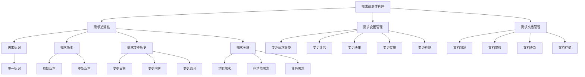

                 


### 1.1 大模型应用背景

大模型，也称为大规模机器学习模型，是近年来人工智能领域的重要发展趋势。这些模型通常拥有数十亿甚至数万亿个参数，可以处理海量数据，并从中提取复杂模式。大模型的应用涵盖了自然语言处理（NLP）、计算机视觉（CV）、推荐系统等多个领域，显著提升了各类任务的性能。

在NLP领域，大模型如GPT-3和BERT等已经展示了其强大的语言理解和生成能力。GPT-3由OpenAI开发，具有1750亿个参数，能够生成高质量的文本，广泛应用于问答系统、自动摘要和机器翻译等任务。BERT（Bidirectional Encoder Representations from Transformers）则通过双向Transformer结构，在多种NLP任务中取得了显著成果，如文本分类、情感分析和命名实体识别。

计算机视觉领域的大模型，如OpenCV和深度学习框架TensorFlow，利用卷积神经网络（CNN）和生成对抗网络（GAN）等技术，实现了图像分类、目标检测、图像生成等复杂任务的自动化处理。例如，ResNet和Inception等模型通过多层网络结构，提高了图像识别的准确率。

推荐系统中的大模型，如YouTube和Netflix等平台使用的协同过滤和矩阵分解算法，能够根据用户历史行为和偏好提供个性化的推荐结果。

大模型的应用不仅带来了技术上的突破，也对实际业务产生了深远影响。例如，在金融领域，大模型用于风险管理、欺诈检测和个性化投资建议；在医疗领域，大模型用于疾病诊断、药物研发和个性化治疗方案制定；在零售领域，大模型用于需求预测、库存管理和个性化营销等。

然而，随着大模型应用的范围和深度不断增加，需求追溯性管理成为了一个不容忽视的重要问题。需求追溯性管理不仅有助于确保项目的正确实施，还能提高项目管理的效率和透明度。本文将围绕大模型应用中的需求追溯性管理，深入探讨其重要性、核心概念、实施技术、实践案例以及评估与优化策略。

### 1.2 需求追溯性管理的重要性

在复杂的大模型应用项目中，需求追溯性管理的重要性不言而喻。首先，需求追溯性管理能够确保项目与业务目标的一致性。在大模型开发过程中，需求可能会因技术变革、市场变化或用户反馈而不断变更。有效的需求追溯性管理可以帮助开发团队及时了解这些变更的来源和影响，确保项目始终朝着业务目标前进。

其次，需求追溯性管理有助于提高项目的透明度和可追溯性。在一个复杂的项目中，涉及到多个利益相关者，如项目经理、开发人员、测试人员和客户等。需求追溯性管理能够记录每个需求的提出者、变更历史和实现情况，使得所有利益相关者都能清晰地了解项目的进展和状态。

此外，需求追溯性管理对项目的风险管理具有重要意义。在大模型应用中，需求变更可能导致项目延期、超预算或功能缺失等问题。通过需求追溯性管理，项目团队可以提前识别和评估潜在的风险，制定相应的应对策略，从而降低项目失败的可能性。

需求追溯性管理还可以提高开发效率和代码质量。通过追溯需求的实现过程，开发团队可以识别代码中的缺陷和冗余，优化代码结构和逻辑，提高系统的可维护性和扩展性。

综上所述，需求追溯性管理在大模型应用中具有不可替代的作用。它不仅能够确保项目与业务目标的一致性，提高项目的透明度和可追溯性，还能有效降低风险，提高开发效率和代码质量。因此，在大模型应用项目中，实施有效的需求追溯性管理是至关重要的。

### 1.3 本书结构和内容概述

本书旨在全面探讨大模型应用中的需求追溯性管理，旨在为读者提供系统、实用的指导。本书共分为七个主要部分，每个部分都紧密围绕需求追溯性管理的核心概念和实际应用展开。

**第一部分：引言**，介绍了大模型应用背景以及需求追溯性管理的重要性，为后续内容的深入讨论奠定了基础。

**第二部分：需求追溯性管理基础**，详细讲解了需求定义与分类、需求管理流程、需求变更管理和需求追溯性管理的核心概念，为读者提供了需求追溯性管理的理论基础。

**第三部分：需求追溯性管理技术**，介绍了需求追溯性管理工具，包括开源工具和商业工具，并讨论了工具选型考虑因素。

**第四部分：需求追溯性管理实践**，通过实施步骤和案例分析，展示了如何在大模型应用中进行需求追溯性管理的实际操作。

**第五部分：需求追溯性管理评估与优化**，探讨了需求追溯性管理的评估指标、优化策略以及持续改进的方法。

**第六部分：案例研究**，通过两个实际案例，进一步展示了需求追溯性管理在大模型应用中的具体应用。

**第七部分：总结与展望**，对全书进行了总结，并提出了需求追溯性管理的发展趋势和研究方向。

本书结构紧凑，内容丰富，旨在帮助读者全面了解和掌握大模型应用中的需求追溯性管理，提高项目管理效率和代码质量。

### 2.1 需求定义与分类

在探讨需求追溯性管理之前，首先需要明确需求的定义与分类。需求是指客户、用户或利益相关者对产品、系统或服务的期望和需求。在软件开发过程中，需求是项目成功的关键因素之一。

根据需求来源的不同，可以将需求分为以下几类：

**1. 功能需求**：功能需求描述了系统或产品应具备的功能特性，是用户直接使用系统时的需求。例如，一个电商平台的功能需求可能包括用户注册、商品浏览、购物车管理、订单处理和支付功能。

**2. 非功能需求**：非功能需求描述了系统或产品在运行时的性能、安全、可靠性等要求。例如，一个电商平台可能需要满足高并发访问、数据加密、隐私保护等非功能需求。

**3. 业务需求**：业务需求是指业务流程、业务规则或业务策略的需求，通常来自于企业的战略规划和业务目标。例如，一个电商平台可能需要根据用户行为数据提供个性化推荐，以提升用户体验和转化率。

**4. 用户需求**：用户需求是直接来源于最终用户的需求，通常通过用户调研、访谈和反馈等方式获取。用户需求更加关注用户体验和满意度，是产品设计和开发的重要参考。

**5. 技术需求**：技术需求是针对系统技术实现的需求，包括编程语言、框架、数据库和中间件等。技术需求通常由技术团队根据项目需求和技术路线制定。

在软件开发过程中，不同类型的需求需要分别管理和实现。功能需求通常通过用户故事或用例进行描述，并使用敏捷开发方法进行迭代实现。非功能需求则通过性能测试、安全测试和用户测试等进行验证。业务需求和技术需求则通常在项目规划和设计阶段进行详细定义和规划。

需求分类的目的是为了更好地理解和管理需求，确保项目能够满足各类需求，从而实现项目的成功。在实际项目中，需求往往交织在一起，需要综合考虑各类需求的优先级和实现难度，制定合理的开发计划。

### 2.2 需求管理流程

需求管理是软件开发过程中至关重要的一环，它确保了项目能够准确地理解、记录和满足各类需求。一个有效的需求管理流程包括需求收集、需求建模、需求变更管理和需求文档管理等多个环节。

**2.2.1 需求收集**

需求收集是需求管理的第一步，它涉及到如何获取和记录客户、用户和其他利益相关者的需求。需求收集的方法包括用户调研、访谈、问卷调查、用户故事会议等。以下是一些常用的需求收集方法：

1. **用户调研**：通过面对面访谈、电话访谈或在线问卷调查等方式，直接从用户处获取需求信息。
2. **用户访谈**：与关键用户或利益相关者进行一对一访谈，深入了解他们的需求和期望。
3. **问卷调查**：设计一份详细的问卷，通过电子邮件或在线平台发放，收集大量用户反馈。
4. **用户故事会议**：邀请用户和开发团队一起讨论需求，通过头脑风暴和讨论，提炼出具体的需求。

在需求收集过程中，需要确保所收集的需求是清晰、具体和可量化的。以下是一个用户故事会议的示例：

**用户故事：**
作为卖家，我希望能够轻松地管理我的商品库存，以便及时更新商品信息，并避免缺货。

这个用户故事清晰地描述了一个功能需求，包括用户角色（卖家）、目标（管理商品库存）和期望的结果（避免缺货）。

**2.2.2 需求建模**

需求建模是将收集到的需求转化为结构化的、易于理解和管理的需求文档的过程。需求建模的方法包括创建用例图、用户故事地图和需求文档等。

1. **用例图**：用例图是描述系统功能和行为的一种图形化方法，它展示了系统与外部用户之间的交互关系。以下是一个简单的用例图的示例：

```
                      +--------------+
                      |   电商平台   |
                      +------+-------+
                          |
                  +------+------+
                  |  用户注册   |
                  +------+------+
                          |
                  +------+------+
                  |  商品浏览   |
                  +------+------+
                          |
                  +------+------+
                  |  购物车管理 |
                  +------+------+
                          |
                  +------+------+
                  |  订单处理   |
                  +------+------+
```

2. **用户故事地图**：用户故事地图是将用户故事组织成图表，以展示它们在系统中的关系。以下是一个用户故事地图的示例：

```
+--------------------+
|  用户注册          |
+--------------------+
        |
        |
        v
+--------------------+
|  商品浏览          |
+--------------------+
        |
        |
        v
+--------------------+
|  购物车管理        |
+--------------------+
        |
        |
        v
+--------------------+
|  订单处理          |
+--------------------+
```

3. **需求文档**：需求文档是对系统需求进行详细描述的文档，通常包括功能需求、非功能需求和业务需求等。以下是一个简化的需求文档的示例：

**功能需求：**
- 用户注册：用户可以创建账户，输入基本信息，并设置密码。
- 商品浏览：用户可以浏览商品列表，查看商品详情，并添加商品到购物车。
- 购物车管理：用户可以查看购物车中的商品，修改数量或删除商品。
- 订单处理：用户可以提交订单，选择支付方式，并查看订单状态。

**非功能需求：**
- 性能：系统应能够在高并发访问下保持响应速度。
- 安全：系统应采用加密技术保护用户数据，并防止恶意攻击。

**业务需求：**
- 用户个性化推荐：系统应根据用户的历史行为和偏好，推荐可能感兴趣的商品。

通过需求建模，项目团队能够更清晰地理解需求，并确保所有需求都被准确记录和传达。

**2.2.3 需求变更管理**

需求变更管理是需求管理流程中至关重要的一环。在软件开发过程中，需求往往会因多种原因发生变更。有效的需求变更管理可以确保项目能够灵活应对变更，同时保持项目进度和质量的稳定。

需求变更管理的主要步骤包括：

1. **变更请求的提交**：当发现需求变更时，利益相关者（如用户、项目经理或开发人员）需要提交变更请求，详细说明变更的原因和影响。
2. **变更评估**：项目团队需要对变更请求进行评估，包括变更的可行性、对项目进度和成本的影响等。评估过程通常需要利益相关者参与，以确保变更请求的合理性和优先级。
3. **变更决策**：根据变更评估的结果，项目团队需要做出是否接受变更的决定。如果决定接受变更，需要更新项目计划和需求文档。
4. **变更实施**：在决定接受变更后，项目团队需要根据变更计划实施变更。这包括修改代码、数据库设计和其他相关文档。

以下是一个简单的需求变更管理流程的示例：

```
1. 变更请求提交
2. 变更评估
3. 变更决策
4. 变更实施
5. 变更验证
```

**2.2.4 需求文档管理**

需求文档是需求管理的核心组成部分，它记录了项目的所有需求，包括功能需求、非功能需求和业务需求等。有效的需求文档管理可以确保需求的一致性和可追溯性，为项目开发和测试提供重要依据。

需求文档管理的主要步骤包括：

1. **文档创建**：根据需求建模的结果，创建详细的需求文档，包括功能需求、非功能需求和业务需求等。
2. **文档审核**：需求文档需要经过利益相关者的审核，以确保需求的准确性和完整性。
3. **文档更新**：在项目开发过程中，需求文档可能会根据实际需求进行更新。每次更新都需要记录变更历史，确保文档的追溯性。
4. **文档存储**：将需求文档存储在版本控制系统中，以便进行版本管理和历史追溯。

以下是一个简单的需求文档管理流程的示例：

```
1. 文档创建
2. 文档审核
3. 文档更新
4. 文档存储
```

通过上述需求管理流程，项目团队能够更好地理解和管理需求，确保项目能够按时、按质完成。

### 2.3 需求变更管理

需求变更管理是软件开发过程中不可或缺的一环，它关系到项目的成功与否。在需求变更管理中，识别变更、评估变更和实施变更是三个关键步骤。

**2.3.1 识别变更**

需求变更通常由多种原因引起，包括市场变化、用户反馈、技术升级和策略调整等。为了有效识别需求变更，项目团队可以采取以下几种方法：

1. **定期需求回顾会议**：定期召开需求回顾会议，邀请项目经理、开发人员、测试人员和客户等参与，讨论需求变更的可能性。
2. **用户调研与反馈**：通过用户调研和反馈机制，了解用户对当前系统的意见和建议，识别潜在的需求变更。
3. **技术监控**：利用技术监控工具，及时发现系统性能、安全性和可靠性等方面的问题，识别可能的需求变更。

**2.3.2 评估变更**

在识别需求变更后，项目团队需要对变更进行评估，以确定其可行性、影响范围和优先级。评估变更的主要内容包括：

1. **变更影响分析**：分析变更对项目进度、成本、资源和风险的影响，评估变更的紧急程度和优先级。
2. **成本效益分析**：分析变更所需的资源投入与预期收益之间的平衡，确保变更的合理性。
3. **风险评估**：评估变更可能带来的风险，包括技术风险、业务风险和项目管理风险等。

以下是一个简单的需求变更评估流程的示例：

```
1. 变更请求提交
2. 变更初步评估
3. 影响分析
4. 成本效益分析
5. 风险评估
6. 变更决策
```

**2.3.3 实施变更**

在决定接受需求变更后，项目团队需要制定详细的变更实施计划，确保变更能够顺利执行。实施变更的主要步骤包括：

1. **变更计划制定**：制定详细的变更计划，包括变更内容、时间表、资源需求和风险评估等。
2. **变更实施**：根据变更计划，进行实际的变更操作，包括修改代码、数据库设计和相关文档等。
3. **变更验证**：在变更实施后，进行验证和测试，确保变更符合预期效果，并能够与现有系统无缝集成。

以下是一个简单的需求变更实施流程的示例：

```
1. 变更计划制定
2. 变更实施
3. 变更验证
4. 变更反馈与改进
```

通过有效的需求变更管理，项目团队能够灵活应对需求变更，确保项目的成功实施。

### 2.4 需求追溯性管理核心概念

需求追溯性管理是一种确保需求在整个软件开发过程中可追溯和可控制的方法。其核心概念包括需求追溯链、需求变更管理和需求文档管理。

**2.4.1 需求追溯链**

需求追溯链是需求追溯性管理的基础，它通过记录和关联需求的不同版本和历史记录，确保需求在整个开发周期内的一致性和可追溯性。需求追溯链通常包括以下关键要素：

1. **需求标识**：每个需求都必须有一个唯一的标识符，以便在系统中进行追踪和管理。
2. **需求版本**：随着项目进展，需求可能会发生变更。每个版本的需求都应保留其原始内容和变更记录。
3. **需求变更历史**：记录每个需求的变更历史，包括变更日期、变更内容和变更原因。
4. **需求关联**：关联需求之间的关系，如功能需求与用户故事、需求与测试用例等。

以下是一个需求追溯链的简单示例：

```
需求ID：REQ001
需求名称：用户注册
原始需求：用户可以创建账户，输入基本信息，并设置密码
变更历史：
- 2023-01-01：增加邮箱验证功能
- 2023-01-15：优化用户注册流程，减少填写信息数量
关联需求：
- STOR001：用户故事 - 用户注册
- TC001：测试用例 - 用户注册
```

通过需求追溯链，项目团队能够清晰地了解每个需求的变更历史和关联关系，确保需求的一致性和完整性。

**2.4.2 需求变更管理**

需求变更管理是需求追溯性管理的重要组成部分，它确保项目团队能够有效识别、评估和实施需求变更。需求变更管理的主要步骤包括：

1. **变更请求提交**：当发现需求变更时，利益相关者（如用户、项目经理或开发人员）提交变更请求，详细说明变更的原因和影响。
2. **变更评估**：项目团队对变更请求进行评估，包括变更的可行性、对项目进度和成本的影响等。评估过程通常需要利益相关者参与，以确保变更请求的合理性和优先级。
3. **变更决策**：根据变更评估的结果，项目团队决定是否接受变更，并制定相应的变更计划。
4. **变更实施**：在决定接受变更后，项目团队根据变更计划进行变更实施，包括修改代码、数据库设计和相关文档等。
5. **变更验证**：在变更实施后，进行验证和测试，确保变更符合预期效果，并能够与现有系统无缝集成。

以下是一个简单的需求变更管理流程的示例：

```
1. 变更请求提交
2. 变更初步评估
3. 影响分析
4. 成本效益分析
5. 风险评估
6. 变更决策
7. 变更计划制定
8. 变更实施
9. 变更验证
```

通过有效的需求变更管理，项目团队能够灵活应对需求变更，确保项目的成功实施。

**2.4.3 需求文档管理**

需求文档管理是确保需求在整个开发过程中一致性和可追溯性的关键。需求文档管理的主要步骤包括：

1. **文档创建**：根据需求建模的结果，创建详细的需求文档，包括功能需求、非功能需求和业务需求等。
2. **文档审核**：需求文档需要经过利益相关者的审核，以确保需求的准确性和完整性。
3. **文档更新**：在项目开发过程中，需求文档可能会根据实际需求进行更新。每次更新都需要记录变更历史，确保文档的追溯性。
4. **文档存储**：将需求文档存储在版本控制系统中，以便进行版本管理和历史追溯。

以下是一个简单的需求文档管理流程的示例：

```
1. 文档创建
2. 文档审核
3. 文档更新
4. 文档存储
```

通过有效的需求文档管理，项目团队能够确保需求的一致性和可追溯性，提高项目的开发效率和质量。

### 2.5 需求追溯性管理核心概念的关系架构

为了更好地理解需求追溯性管理的核心概念，我们可以使用Mermaid流程图来展示它们之间的关系。以下是需求追溯性管理核心概念的关系架构：



在这个关系架构中：

- **需求追溯性管理**是整体框架，涵盖了需求追溯链、需求变更管理和需求文档管理。
- **需求追溯链**包括需求标识、需求版本、需求变更历史和需求关联。
- **需求变更管理**包括变更请求提交、变更评估、变更决策、变更实施和变更验证。
- **需求文档管理**包括文档创建、文档审核、文档更新和文档存储。

通过这个关系架构，我们可以清晰地看到需求追溯性管理中各个核心概念之间的关联和作用，为实际应用提供了明确的指导。

### 2.6 需求追溯性管理的目标和挑战

需求追溯性管理的目标是确保需求在整个软件开发过程中的准确性和一致性，提高项目的可管理性和可追溯性。具体来说，需求追溯性管理的目标包括：

1. **确保需求的一致性**：通过追溯需求的不同版本和变更历史，确保需求在整个开发周期内的一致性，避免需求冲突和误解。
2. **提高项目的透明度**：通过记录和展示每个需求的来源、变更历史和实现情况，提高项目的透明度，方便所有利益相关者了解项目的进展和状态。
3. **降低项目管理风险**：通过识别和评估需求变更的影响，降低项目风险，确保项目能够按计划进行。
4. **提升开发效率**：通过有效的需求追溯性管理，项目团队能够快速识别需求变更的原因和影响，提高开发效率，减少重复工作。

尽管需求追溯性管理具有显著的优势，但在实际应用中仍面临一系列挑战：

1. **数据量大**：随着项目规模和复杂度的增加，需求追溯性管理需要处理的数据量也会急剧增加，这给数据存储和管理带来了挑战。
2. **变更频繁**：在软件开发过程中，需求变更可能非常频繁，确保所有变更都能及时、准确地记录和追溯是一项艰巨的任务。
3. **利益相关者沟通**：需求追溯性管理涉及到多个利益相关者，包括客户、项目经理、开发人员和测试人员等，确保各方能够有效沟通并达成一致是一项挑战。
4. **工具选择**：市场上存在多种需求管理工具，选择适合项目需求和管理要求的工具是一项复杂的工作，需要综合考虑成本、功能、易用性和定制化需求等因素。

为应对这些挑战，项目团队可以采取以下措施：

1. **建立标准化流程**：制定一套标准化、流程化的需求追溯性管理流程，确保所有需求变更都能得到及时、准确地记录和追溯。
2. **培训与沟通**：对项目团队成员进行需求追溯性管理的培训和沟通，提高他们的意识和能力，确保团队能够有效地实施和管理需求追溯性。
3. **工具选型**：根据项目需求和工具特点，选择适合的需求管理工具，并确保工具能够满足项目的长期需求。
4. **持续优化**：通过定期评估和反馈，持续优化需求追溯性管理的流程和工具，提高管理效率和效果。

通过明确需求追溯性管理的目标和挑战，并采取有效的应对措施，项目团队能够更好地实施需求追溯性管理，提高项目的质量和效率。

### 3.1 需求追溯性管理工具

在需求追溯性管理中，选择合适的工具至关重要。市面上有多种需求管理工具，包括开源工具和商业工具。每种工具都有其独特的功能和特点，项目团队应根据具体需求和管理要求进行选择。

**3.1.1 开源工具介绍**

开源工具因其自由性和灵活性，被广泛应用于需求管理。以下是几种常用的开源需求管理工具：

1. **JIRA**：JIRA是Atlassian公司开发的任务和项目跟踪工具，支持需求收集、管理、跟踪和报告。JIRA具有强大的插件生态，可扩展其功能，支持多种需求跟踪、任务管理、敏捷开发等。

   ```mermaid
   graph TD
   A[JIRA] --> B[需求收集]
   A --> C[需求管理]
   A --> D[跟踪与报告]
   A --> E[插件生态]
   ```

2. **Confluence**：Confluence是Atlassian公司开发的团队协作工具，支持文档共享、知识管理和需求文档管理。Confluence可以与JIRA无缝集成，提供统一的需求管理平台。

   ```mermaid
   graph TD
   A[Confluence] --> B[文档共享]
   A --> C[知识管理]
   A --> D[需求文档管理]
   A --> E[与JIRA集成]
   ```

3. **Redmine**：Redmine是一个开源项目管理系统，支持需求管理、项目管理、任务跟踪和报告。Redmine具有灵活的配置选项和插件系统，适用于不同规模的项目。

   ```mermaid
   graph TD
   A[Redmine] --> B[需求管理]
   A --> C[项目管理]
   A --> D[任务跟踪]
   A --> E[报告生成]
   A --> F[插件系统]
   ```

**3.1.2 商业工具介绍**

商业工具通常提供更全面的功能和专业的支持，适用于大型企业和复杂项目。以下是几种常用的商业需求管理工具：

1. **IBM Rational DOORS**：DOORS是IBM公司开发的专业的需求管理工具，支持需求定义、管理、跟踪和报告。DOORS提供丰富的功能，包括需求文档管理、变更控制、风险管理和测试跟踪。

   ```mermaid
   graph TD
   A[IBM Rational DOORS] --> B[需求定义]
   A --> C[需求管理]
   A --> D[变更控制]
   A --> E[风险管理]
   A --> F[测试跟踪]
   A --> G[文档管理]
   ```

2. **Telelogic Chaps**：Chaps是Telelogic公司开发的综合需求管理工具，支持需求定义、跟踪、变更管理和报告。Chaps提供面向对象的建模方法，支持多种开发过程和方法。

   ```mermaid
   graph TD
   A[Telelogic Chaps] --> B[需求定义]
   A --> C[需求跟踪]
   A --> D[变更管理]
   A --> E[报告生成]
   A --> F[面向对象建模]
   ```

3. **HP Quality Center**：Quality Center是HP公司开发的综合测试和质量管理工具，支持需求管理、测试计划、测试执行和报告。Quality Center可以与JIRA、Confluence等工具集成，提供端到端的需求管理解决方案。

   ```mermaid
   graph TD
   A[HP Quality Center] --> B[需求管理]
   A --> C[测试计划]
   A --> D[测试执行]
   A --> E[报告生成]
   A --> F[与JIRA集成]
   A --> G[与Confluence集成]
   ```

**3.1.3 工具选型考虑因素**

在选择需求管理工具时，项目团队应考虑以下因素：

1. **功能需求**：根据项目的需求和管理要求，选择具有所需功能的需求管理工具。例如，如果项目需要强大的变更控制功能，可以选择DOORS；如果需要文档共享和知识管理，可以选择Confluence。

2. **成本**：评估不同工具的成本，包括许可证费用、维护费用和实施成本等。开源工具通常免费，但可能需要额外的时间进行定制和集成；商业工具通常提供更全面的功能和专业支持，但成本较高。

3. **易用性**：评估工具的易用性，包括用户界面、操作流程和文档等。易用性直接影响团队成员的学习成本和工作效率。

4. **定制化需求**：根据项目的特殊需求，选择能够支持定制化功能的需求管理工具。例如，如果项目需要特定的报告格式或流程，选择具有高度定制化能力的工具。

5. **集成能力**：评估工具与其他系统的集成能力，包括与版本控制系统、测试工具、项目管理工具等的集成。良好的集成能力可以提高工作效率和数据的同步性。

通过综合考虑功能需求、成本、易用性、定制化需求和集成能力等因素，项目团队可以选出一个最适合自己的需求管理工具，从而提高需求追溯性管理的效率和效果。

### 3.2 需求追溯性管理实施步骤

实施需求追溯性管理是一个系统性的过程，涉及多个关键步骤。以下是需求追溯性管理的实施步骤：

**3.2.1 组织准备**

在实施需求追溯性管理之前，项目团队需要进行充分的组织准备。这包括以下几个方面：

1. **团队培训**：为项目团队成员提供需求追溯性管理的培训，确保他们理解需求追溯性管理的重要性、原理和实施方法。
2. **流程设计**：设计一套适合项目需求和管理要求的需求追溯性管理流程，明确需求收集、需求建模、需求变更管理和需求文档管理等各个环节的具体步骤和职责。
3. **工具选择**：选择一个适合项目需求和管理要求的工具，确保工具具备所需的功能、易用性和定制化能力。常用的工具包括JIRA、Confluence、Redmine、DOORS和Chaps等。
4. **资源分配**：确保项目有足够的资源和预算来实施需求追溯性管理，包括人员、时间和资金等。

**3.2.2 需求收集与建模**

需求收集是需求追溯性管理的第一步，以下是一些关键步骤：

1. **确定需求来源**：明确需求的来源，包括用户调研、访谈、问卷调查、用户故事会议等。确保需求收集过程能够全面、准确地获取用户和利益相关者的需求。
2. **需求分类**：根据需求的性质和来源，将需求进行分类，如功能需求、非功能需求、业务需求等。这有助于更好地管理和追溯需求。
3. **需求建模**：使用需求建模工具和方法，如用例图、用户故事地图和需求文档等，将需求进行结构化和图形化表示。这有助于项目团队更好地理解和沟通需求。

**3.2.3 需求变更控制**

需求变更管理是需求追溯性管理的重要组成部分，以下是一些关键步骤：

1. **变更请求提交**：当发现需求变更时，利益相关者（如用户、项目经理或开发人员）需要提交变更请求，详细说明变更的原因和影响。
2. **变更评估**：项目团队对变更请求进行评估，包括变更的可行性、对项目进度和成本的影响等。评估过程通常需要利益相关者参与，以确保变更请求的合理性和优先级。
3. **变更决策**：根据变更评估的结果，项目团队决定是否接受变更，并制定相应的变更计划。
4. **变更实施**：在决定接受变更后，项目团队根据变更计划进行变更实施，包括修改代码、数据库设计和相关文档等。
5. **变更验证**：在变更实施后，进行验证和测试，确保变更符合预期效果，并能够与现有系统无缝集成。

**3.2.4 追溯性分析**

追溯性分析是需求追溯性管理的核心步骤，以下是一些关键步骤：

1. **数据收集**：收集需求变更的历史记录、版本信息和相关文档等数据。
2. **数据分析**：对收集到的数据进行分析，识别需求变更的模式、趋势和潜在问题。
3. **报告生成**：根据分析结果，生成追溯性分析报告，为项目团队提供决策依据。
4. **反馈与改进**：根据追溯性分析报告，项目团队可以识别需求管理的不足之处，并制定改进措施，提高需求管理的效率和效果。

**3.2.5 需求文档管理**

需求文档管理是确保需求在整个开发过程中一致性和可追溯性的关键，以下是一些关键步骤：

1. **文档创建**：根据需求建模的结果，创建详细的需求文档，包括功能需求、非功能需求和业务需求等。
2. **文档审核**：需求文档需要经过利益相关者的审核，以确保需求的准确性和完整性。
3. **文档更新**：在项目开发过程中，需求文档可能会根据实际需求进行更新。每次更新都需要记录变更历史，确保文档的追溯性。
4. **文档存储**：将需求文档存储在版本控制系统中，以便进行版本管理和历史追溯。

通过上述步骤，项目团队可以有效地实施需求追溯性管理，确保需求的一致性、可追溯性和可管理性，从而提高项目的成功率和质量。

### 4.2 大模型应用中的需求管理

在大模型应用中，需求管理具有其独特的特点和要求。由于大模型通常涉及海量数据和复杂的算法，需求管理的复杂性显著增加。以下是针对大模型应用中的需求管理的详细描述，包括需求特点、管理策略和具体案例。

#### 4.2.1 大模型应用需求特点

大模型应用的需求通常具有以下几个显著特点：

1. **数据依赖性**：大模型对数据有很高的依赖性。数据的质量和数量直接影响大模型的性能和效果。因此，在需求管理中，需要特别关注数据需求，包括数据来源、数据格式、数据处理和数据质量保证等。

2. **算法复杂性**：大模型通常采用复杂的算法和模型结构。这要求需求管理不仅要关注功能需求，还要考虑算法实现的技术细节，如神经网络架构、训练策略和优化算法等。

3. **可扩展性和可维护性**：大模型应用需要具备良好的可扩展性和可维护性，以应对不断变化的需求和技术升级。需求管理中应考虑系统的模块化设计、接口定义和文档规范等。

4. **高性能和实时性**：大模型应用通常要求高性能和实时响应。需求管理需要考虑系统的性能优化、资源分配和负载均衡等，以确保模型能够在实际应用场景中高效运行。

5. **安全性和隐私保护**：大模型应用中涉及大量敏感数据，如用户个人信息和商业机密等。需求管理需要确保系统的安全性和隐私保护，包括数据加密、访问控制和数据备份等。

#### 4.2.2 大模型应用需求管理策略

为了有效管理大模型应用中的需求，项目团队可以采取以下策略：

1. **需求识别与定义**：在大模型应用中，需求识别与定义是一个关键环节。通过用户调研、数据分析和专家咨询等方法，全面识别和定义数据需求、算法需求、系统性能需求和安全需求等。

2. **需求优先级排序**：在需求定义后，需要对需求进行优先级排序。根据业务目标和项目约束，将需求分为关键需求、重要需求和次要需求等，确保关键需求得到优先满足。

3. **需求变更控制**：大模型应用的需求变更管理尤为重要。项目团队应建立严格的变更控制流程，确保需求变更能够及时、准确地记录和评估，避免对项目进度和成本产生不利影响。

4. **需求文档管理**：大模型应用的需求文档应详细、完整，并保持版本一致性。需求文档应包括功能需求、非功能需求、数据需求和算法需求等，并定期进行审核和更新。

5. **需求验证与测试**：在大模型应用中，需求验证与测试是一个复杂的过程。项目团队应制定详细的测试计划和测试用例，包括单元测试、集成测试和性能测试等，确保大模型应用的功能和质量。

6. **需求与资源匹配**：大模型应用需要大量计算资源和数据资源。需求管理中应确保资源匹配，合理安排计算资源和数据资源的使用，避免资源浪费和瓶颈。

#### 4.2.3 大模型应用需求管理案例

以下是一个实际案例，展示了如何在大模型应用中进行需求管理：

**案例：智能推荐系统**

某电商企业希望开发一个智能推荐系统，根据用户的历史购买行为和浏览记录，为用户推荐可能感兴趣的商品。项目团队在大模型应用中的需求管理如下：

1. **需求识别与定义**：通过用户调研和市场分析，项目团队识别和定义了以下关键需求：
   - 用户注册与登录：用户可以注册账号并登录系统，获取个性化推荐。
   - 用户行为数据收集：系统需要收集用户的历史购买记录、浏览记录和点击记录等行为数据。
   - 商品信息管理：系统需要管理商品信息，包括商品描述、价格、分类等。
   - 推荐算法：系统需要采用基于协同过滤和深度学习的推荐算法，提供高质量的推荐结果。

2. **需求优先级排序**：根据业务目标和项目约束，项目团队将需求分为以下优先级：
   - 用户注册与登录：关键需求，确保用户能够顺利使用系统。
   - 用户行为数据收集：重要需求，为推荐算法提供基础数据。
   - 推荐算法：重要需求，决定推荐系统的核心功能。
   - 商品信息管理：次要需求，优化用户购物体验。

3. **需求变更控制**：在项目开发过程中，用户需求和市场环境可能会发生变化。项目团队建立了严格的变更控制流程，确保需求变更能够及时、准确地记录和评估。例如，当市场需求发生变化时，项目团队会重新评估需求优先级，并根据评估结果调整开发计划。

4. **需求文档管理**：项目团队创建了详细的需求文档，包括功能需求、非功能需求、数据需求和算法需求等。需求文档经过多轮审核和更新，确保其准确性和完整性。

5. **需求验证与测试**：项目团队制定了详细的测试计划和测试用例，包括单元测试、集成测试和性能测试等。通过测试，确保推荐系统能够稳定运行，提供高质量的推荐结果。

6. **需求与资源匹配**：项目团队根据需求特点，合理配置计算资源和数据资源。例如，为了提高推荐系统的性能，项目团队增加了服务器集群和数据处理能力。

通过以上需求管理策略和实际案例，项目团队成功开发了一个智能推荐系统，显著提升了用户满意度和转化率。该案例展示了在大模型应用中进行需求管理的有效方法和实践。

### 4.3 大模型应用中的需求管理策略

在大模型应用中，制定有效的需求管理策略是确保项目成功的关键。以下是一些关键策略，包括数据管理策略、算法选择策略、性能优化策略和安全策略。

#### 4.3.1 数据管理策略

1. **数据收集与清洗**：大模型应用对数据质量有很高的要求。项目团队应建立完善的数据收集机制，确保数据的完整性和准确性。同时，数据清洗是确保数据质量的重要环节，通过去重、去噪和格式转换等操作，提高数据质量。

2. **数据存储与管理**：大模型通常涉及海量数据，项目团队应选择合适的数据存储与管理方案。例如，使用分布式数据库和云存储服务，确保数据的高效存储和管理。

3. **数据版本控制**：在大模型应用中，数据可能会频繁更新。项目团队应建立数据版本控制机制，确保不同版本的数据能够被准确追溯和管理。

#### 4.3.2 算法选择策略

1. **算法评估与选择**：大模型应用中的算法选择至关重要。项目团队应通过算法评估，选择最适合项目需求的算法。评估指标包括准确性、效率、可解释性和扩展性等。

2. **算法组合与优化**：在多个算法中，项目团队应通过组合和优化，提升整体模型的性能。例如，结合深度学习和传统的机器学习方法，实现性能的全面提升。

3. **算法更新与迭代**：随着数据和应用场景的变化，算法可能需要不断更新和迭代。项目团队应建立算法更新机制，确保算法始终处于最佳状态。

#### 4.3.3 性能优化策略

1. **模型压缩与量化**：为了提高模型在部署环境中的性能，项目团队可以采用模型压缩和量化技术，减小模型大小和提高运算速度。

2. **分布式计算**：大模型应用通常涉及大量的计算任务。项目团队可以利用分布式计算框架，如TensorFlow和PyTorch等，提高计算效率和吞吐量。

3. **缓存与预加载**：为了提高系统的响应速度，项目团队可以利用缓存和预加载技术，减少数据读取和模型推理的时间。

#### 4.3.4 安全策略

1. **数据安全**：在大模型应用中，数据安全至关重要。项目团队应采用加密技术，确保数据在传输和存储过程中的安全性。

2. **隐私保护**：大模型应用涉及大量个人敏感数据。项目团队应采取隐私保护措施，如数据去标识化和匿名化，确保用户隐私不被泄露。

3. **访问控制**：项目团队应建立严格的访问控制机制，确保只有授权人员能够访问敏感数据和系统资源。

通过以上策略，项目团队能够在大模型应用中有效管理需求，提高系统的性能、安全性和用户体验。

### 4.4 大模型应用中的需求管理案例分析

为了更好地理解大模型应用中的需求管理，我们将分析两个实际案例：一个成功案例和一个失败案例。

#### 4.4.1 成功案例：某大型电商平台智能推荐系统

**背景**：某大型电商平台希望提升用户购物体验，通过引入智能推荐系统为用户推荐可能感兴趣的商品。

**需求管理**：
1. **需求识别与定义**：项目团队通过用户调研和市场分析，明确了以下关键需求：
   - 用户注册与登录：确保用户能够顺利注册账号并登录系统。
   - 用户行为数据收集：系统需要收集用户的历史购买记录、浏览记录和点击记录等行为数据。
   - 商品信息管理：系统需要管理商品信息，包括商品描述、价格、分类等。
   - 推荐算法：采用基于协同过滤和深度学习的推荐算法，提供高质量的推荐结果。

2. **需求优先级排序**：根据业务目标和项目约束，项目团队将需求分为以下优先级：
   - 用户注册与登录：关键需求，确保用户能够顺利使用系统。
   - 用户行为数据收集：重要需求，为推荐算法提供基础数据。
   - 推荐算法：重要需求，决定推荐系统的核心功能。
   - 商品信息管理：次要需求，优化用户购物体验。

3. **需求变更控制**：项目团队建立了严格的变更控制流程，确保需求变更能够及时、准确地记录和评估。例如，当市场需求发生变化时，项目团队会重新评估需求优先级，并根据评估结果调整开发计划。

4. **需求文档管理**：项目团队创建了详细的需求文档，包括功能需求、非功能需求、数据需求和算法需求等。需求文档经过多轮审核和更新，确保其准确性和完整性。

5. **需求验证与测试**：项目团队制定了详细的测试计划和测试用例，包括单元测试、集成测试和性能测试等。通过测试，确保推荐系统能够稳定运行，提供高质量的推荐结果。

6. **需求与资源匹配**：项目团队根据需求特点，合理配置计算资源和数据资源。例如，为了提高推荐系统的性能，项目团队增加了服务器集群和数据处理能力。

**结果**：通过有效的需求管理，项目团队成功开发并部署了智能推荐系统。该系统显著提升了用户满意度和转化率，取得了良好的商业效果。

#### 4.4.2 失败案例：某新兴公司智能语音助手项目

**背景**：某新兴公司希望通过开发智能语音助手来拓展市场，提高用户互动体验。

**需求管理**：
1. **需求识别与定义**：项目团队在初期需求识别过程中存在疏漏，未能全面了解用户需求和市场环境，导致以下关键需求不明确：
   - 语音识别准确性：系统需要具备高精度的语音识别能力。
   - 语音合成自然度：系统需要生成自然流畅的语音。
   - 多语言支持：系统需要支持多种语言。

2. **需求变更控制**：由于需求变更频繁且管理不善，项目团队在需求变更控制方面表现不佳。导致项目进度严重滞后，资源浪费。

3. **需求文档管理**：需求文档未经过充分审核和更新，导致需求理解不一致和需求遗漏。

4. **需求验证与测试**：由于测试阶段需求验证不足，系统在多个关键功能上存在缺陷，无法满足用户需求。

5. **需求与资源匹配**：项目团队在资源分配方面存在不足，导致项目开发过程中资源短缺，影响项目进度和质量。

**结果**：由于需求管理不善，项目最终未能达到预期目标，项目团队解散，公司损失了大量资金和人力。

**教训**：从这两个案例可以看出，在大模型应用中，需求管理至关重要。成功案例强调了全面的需求识别、有效的变更控制、详细的需求文档管理和充分的验证测试的重要性。而失败案例则提醒我们在需求管理中要避免疏漏和变更失控，确保资源的合理分配和项目的顺利推进。

### 4.5 大模型应用中的需求管理最佳实践

在大模型应用中，需求管理的最佳实践可以帮助项目团队提高效率、降低风险并确保项目成功。以下是一些具体的需求管理最佳实践：

1. **建立清晰的需求定义**：在项目初期，通过用户调研、访谈和文档分析等方式，确保需求定义清晰、具体和可量化。需求定义应包括功能需求、非功能需求和数据需求等。

2. **采用敏捷开发方法**：敏捷开发方法能够更好地适应需求变更，通过迭代开发和持续交付，确保项目能够快速响应需求变化。

3. **严格的需求变更控制**：建立一套严格的变更控制流程，确保所有需求变更都能够得到及时、准确的评估和记录。变更控制流程应包括变更请求的提交、评估、决策和实施等环节。

4. **定期需求回顾**：定期召开需求回顾会议，邀请项目经理、开发人员、测试人员和客户等参与，讨论需求的变更、进度和问题。这有助于确保项目团队能够及时了解需求的变更情况，调整项目计划。

5. **采用需求管理工具**：选择适合项目需求和管理要求的工具，如JIRA、Confluence、Redmine等，以便于需求收集、管理、跟踪和报告。这些工具可以帮助项目团队更好地管理需求，提高工作效率。

6. **加强需求文档管理**：建立完善的需求文档管理体系，确保需求文档的准确性和完整性。需求文档应包括需求描述、用户故事、用例图、需求变更历史等，并定期进行审核和更新。

7. **开展需求验证和测试**：在开发过程中，对需求进行持续的验证和测试，确保需求的实现符合预期。通过单元测试、集成测试和性能测试等，及时发现和解决潜在问题。

8. **建立跨部门协作机制**：需求管理不仅仅是开发团队的责任，还需要涉及市场、销售、运维等多个部门。建立跨部门协作机制，确保需求能够得到各部门的积极响应和支持。

9. **持续反馈和改进**：通过项目总结和反馈，识别需求管理过程中的不足和改进空间，持续优化需求管理流程和工具。

通过遵循这些最佳实践，项目团队能够更好地管理大模型应用中的需求，提高项目成功率，实现业务目标。

### 5.1 需求追溯性管理评估指标

需求追溯性管理的评估指标是衡量需求管理效果的关键工具，通过这些指标，项目团队可以了解需求管理的效率、准确性和稳定性。以下是一些关键的需求追溯性管理评估指标，以及如何设计和使用这些指标。

#### 5.1.1 完整性指标

**需求覆盖率**：需求覆盖率是评估需求完整性的一项重要指标，它表示已实现的需求在总体需求中的比例。计算公式如下：

\[ 需求覆盖率 = \frac{已实现的需求数}{总需求数} \]

**需求变更率**：需求变更率表示需求在开发过程中发生变更的频率。通过计算需求变更数与总需求数的比例，可以评估需求变更的频繁程度：

\[ 需求变更率 = \frac{需求变更数}{总需求数} \]

**需求追溯链完整性**：需求追溯链完整性指标用于评估需求追溯链的完整性，确保所有需求都有明确的追溯关系。可以通过检查需求追溯链中的需求标识、版本和变更历史来评估其完整性。

#### 5.1.2 效率指标

**需求响应时间**：需求响应时间是指从需求提出到需求实现的时间间隔。这个指标可以衡量项目团队对需求变更的响应速度：

\[ 需求响应时间 = 结束时间 - 提出时间 \]

**需求实现周期**：需求实现周期是指从需求提出到需求完成的时间。通过计算需求实现周期，可以评估项目团队在需求管理中的工作效率：

\[ 需求实现周期 = 完成时间 - 提出时间 \]

**需求变更处理效率**：需求变更处理效率是指项目团队在处理需求变更时的效率，可以通过计算变更请求的平均处理时间来评估：

\[ 需求变更处理效率 = \frac{总处理时间}{变更请求数} \]

#### 5.1.3 准确性指标

**需求实现准确性**：需求实现准确性是指需求实现是否符合原始需求描述的准确程度。通过对比实际实现的功能与原始需求，可以计算需求实现准确性：

\[ 需求实现准确性 = \frac{符合原始需求的需求数}{总需求数} \]

**需求变更准确性**：需求变更准确性是指变更请求实施后，变更结果是否符合预期。可以通过评估变更后功能的实际效果来计算变更准确性：

\[ 需求变更准确性 = \frac{符合预期变更的需求数}{总变更需求数} \]

#### 5.1.4 稳定性指标

**需求稳定性**：需求稳定性是指需求在项目生命周期内发生变更的频率和幅度。通过计算需求变更的频率和幅度，可以评估需求的稳定性：

\[ 需求稳定性 = \frac{需求变更次数}{项目总时长} \]

**需求变更幅度**：需求变更幅度是指需求变更的大小，可以通过计算变更请求中需求修改的规模来评估：

\[ 需求变更幅度 = \frac{修改的代码行数}{项目总代码行数} \]

#### 5.1.5 如何设计和使用评估指标

1. **确定评估目标**：在设计和使用评估指标之前，首先要明确评估的目标。例如，是为了评估需求管理的效率、准确性还是稳定性。

2. **收集数据**：根据评估目标，收集相关数据。例如，为了计算需求响应时间，需要记录需求提出的时间和完成的时间。

3. **定义计算公式**：根据评估目标，定义相应的计算公式。例如，需求覆盖率的计算公式为已实现的需求数除以总需求数。

4. **定期评估**：定期使用评估指标对需求管理进行评估。例如，每月或每季度进行一次评估。

5. **分析结果**：根据评估结果，分析需求管理的优势和不足，并提出改进措施。

6. **反馈与改进**：将评估结果和改进措施反馈给项目团队，并督促团队进行改进。

通过科学地设计和使用评估指标，项目团队能够更好地管理需求，提高项目的成功率和质量。

### 5.2 需求追溯性管理优化

为了提升需求追溯性管理的效率和效果，项目团队可以采取一系列优化策略。以下是一些具体的优化方法，包括流程优化、工具优化和团队协作优化。

#### 5.2.1 流程优化

**1. 定制化流程设计**

每个项目都有其特定的需求和流程，因此，定制化流程设计是非常必要的。项目团队应与所有利益相关者合作，设计一套适合项目特点的流程。这包括需求收集、需求建模、需求变更控制和需求文档管理等各个环节。

**2. 流程自动化**

通过引入自动化工具和流程，可以减少手工操作，提高效率。例如，使用自动化脚本来自动化需求收集、变更请求的提交和审批等操作。自动化流程还可以确保流程的一致性和准确性。

**3. 持续改进**

流程优化不是一次性的任务，而是一个持续的过程。项目团队应定期评估现有流程的效率和效果，并根据评估结果进行改进。通过持续改进，可以不断提升流程的优化程度。

#### 5.2.2 工具优化

**1. 选择合适的工具**

在选择需求管理工具时，应综合考虑功能、易用性、成本和集成能力等因素。选择一款能够满足项目需求的工具，可以显著提高需求追溯性管理的效率。

**2. 工具定制化**

即使选择了合适的工具，也需要进行一定的定制化以适应项目需求。例如，可以自定义需求表格、工作流程和报告格式等，以确保工具能够更好地支持项目需求。

**3. 工具培训与支持**

为了充分发挥工具的潜力，项目团队需要对工具进行充分的培训和支持。团队成员应熟悉工具的功能和操作，以便能够高效地使用工具进行需求管理。

#### 5.2.3 团队协作优化

**1. 跨部门协作**

需求追溯性管理涉及到多个部门和角色，如市场、开发、测试和运维等。项目团队应建立跨部门协作机制，确保各部门能够有效沟通和协作，从而提高需求管理的效率。

**2. 提高沟通效率**

沟通是需求管理的关键环节。项目团队应采取多种沟通方式，如定期会议、即时通讯工具和共享文档等，以提高沟通效率。此外，团队成员应保持积极的态度，主动分享信息和反馈，确保沟通的顺畅。

**3. 提升团队技能**

通过培训和实践，提升团队成员的技能和知识水平，可以提高整个团队的需求管理能力。例如，培训团队成员掌握敏捷开发方法、需求建模技术等，可以显著提高需求管理的效率和质量。

**4. 激励与反馈**

为了激发团队成员的工作热情和积极性，项目团队应建立激励机制，如绩效奖金、晋升机会等。同时，通过定期的绩效评估和反馈，可以帮助团队成员了解自己的优势和不足，并不断改进。

通过以上优化策略，项目团队能够提升需求追溯性管理的效率和效果，确保项目能够按时、按质完成，并满足业务目标。

### 5.3 持续改进与迭代

需求追溯性管理是一个动态和持续的过程，为了保持其高效和有效性，项目团队应实施持续改进和迭代策略。以下是一些关键步骤和措施：

#### 5.3.1 定期回顾与评估

项目团队应定期回顾和评估需求追溯性管理的流程、工具和效果。回顾会可以是每周、每月或每季度的例行活动，通过这些会议，团队能够识别流程中的瓶颈、工具的不足和绩效的改进空间。以下是一个简单的回顾和评估流程：

1. **收集数据**：收集需求管理过程中的相关数据，如需求响应时间、需求变更频率、需求实现准确性和用户满意度等。
2. **分析数据**：对收集到的数据进行分析，识别问题和改进机会。
3. **讨论与反馈**：团队成员共同讨论分析结果，提出改进建议和反馈。
4. **制定改进计划**：根据讨论结果，制定具体的改进计划和时间表。

#### 5.3.2 实施改进措施

在评估和回顾过程中，项目团队应立即实施改进措施，以提升需求追溯性管理的效率和质量。以下是一些具体的改进措施：

1. **流程优化**：根据回顾和评估结果，对需求管理流程进行优化，简化不必要的步骤，提高流程的透明度和可追溯性。
2. **工具升级**：评估现有需求管理工具的性能和功能，如有需要，及时升级或更换工具，确保工具能够满足项目需求。
3. **培训与支持**：为团队成员提供培训，提高他们的需求管理技能和工具使用能力。同时，提供持续的技术支持，确保团队成员能够有效使用工具和流程。

#### 5.3.3 迭代开发

需求追溯性管理应与项目的迭代开发相结合，通过不断的迭代和反馈，逐步完善需求管理流程和工具。以下是一个迭代开发流程的示例：

1. **需求收集与建模**：在每个迭代周期开始时，项目团队收集用户需求，进行需求建模，确保需求清晰、具体和可追溯。
2. **需求实现与验证**：开发团队根据需求建模的结果，实现需求并对其进行验证和测试，确保需求的实现符合预期。
3. **需求变更管理**：在实现和验证过程中，可能需要根据用户反馈和市场变化进行需求变更。项目团队应严格管理这些变更，确保变更的合理性和可追溯性。
4. **迭代评估与回顾**：在每个迭代结束时，项目团队应评估需求管理的效率和效果，识别改进机会，并制定下一步的改进计划。

#### 5.3.4 用户反馈

用户反馈是需求追溯性管理持续改进的重要来源。项目团队应建立有效的用户反馈机制，如用户调研、在线问卷和用户访谈等，及时收集用户的意见和建议。以下是一些用户反馈的应用场景：

1. **需求优先级排序**：根据用户反馈，重新评估需求优先级，确保高价值需求得到优先处理。
2. **功能优化**：根据用户反馈，对现有功能进行优化，提高用户体验和满意度。
3. **问题识别**：通过用户反馈，及时发现和解决潜在的问题和缺陷。

通过定期回顾与评估、实施改进措施、迭代开发和用户反馈，项目团队能够持续优化需求追溯性管理，确保项目能够高效、高质量地实现业务目标。

### 6.1 案例一：XX公司需求追溯性管理实践

**案例背景**：XX公司是一家提供人工智能解决方案的科技企业，专注于为金融、医疗和零售等行业提供智能分析和服务。随着公司业务规模的不断扩大，项目数量和复杂性显著增加，需求追溯性管理成为公司面临的重要挑战。

**需求管理现状**：在实施需求追溯性管理之前，XX公司面临以下问题：
1. 需求文档混乱，版本控制不统一，导致团队成员难以追溯需求的历史变更。
2. 需求变更频繁，但缺乏有效的变更管理流程，导致项目进度和质量不稳定。
3. 需求与实际业务目标不一致，项目团队难以明确需求实现的优先级。

**解决方案**：为了解决上述问题，XX公司采取了以下解决方案：

1. **引入需求管理工具**：公司选择了一款专业的需求管理工具JIRA，用于需求收集、管理、变更控制和文档管理。JIRA提供了强大的需求追踪功能和灵活的扩展性，能够满足公司的需求管理需求。

2. **建立标准化流程**：公司制定了一套标准化的需求管理流程，包括需求收集、需求建模、需求变更控制和需求文档管理。标准化流程确保了需求管理的规范性和一致性。

3. **培训与推广**：公司为全体员工提供了JIRA的培训，提高了团队成员的需求管理技能和工具使用能力。同时，公司通过内部邮件和会议，推广需求管理的最佳实践，提高全体员工的需求管理意识。

4. **实施需求变更管理**：公司建立了严格的变更管理流程，包括变更请求的提交、评估、决策和实施。每次需求变更都经过详细记录和审核，确保变更的合理性和可追溯性。

**实施效果**：通过实施需求追溯性管理，XX公司取得了显著的效果：
1. 需求文档变得清晰、有条理，版本控制更加统一，团队成员能够轻松追溯需求的历史变更。
2. 需求变更得到有效管理，项目进度和质量显著提高，项目团队能够更好地适应需求变更。
3. 需求与实际业务目标的一致性得到增强，项目团队能够明确需求实现的优先级，确保项目能够按计划推进。

**总结**：XX公司的需求追溯性管理实践表明，通过引入专业需求管理工具、建立标准化流程和实施严格的变更管理，项目团队能够更好地管理需求，提高项目的成功率和质量。

### 6.2 案例二：YY公司大模型应用需求管理分析

**案例背景**：YY公司是一家领先的智能医疗公司，致力于通过人工智能技术提供精准医疗解决方案。公司开发了一款基于深度学习的大模型，用于疾病诊断和个性化治疗建议。在项目开发过程中，YY公司面临需求管理方面的挑战，包括需求变更频繁、需求追溯困难和技术实现的复杂性。

**需求管理现状**：在项目开发初期，YY公司的需求管理存在以下问题：
1. 需求变更频繁，但变更流程不完善，导致需求变更管理混乱。
2. 需求追溯性不足，项目团队难以追溯每个需求的历史变更和实现情况。
3. 技术实现的复杂性，导致需求难以转化为具体的开发任务。

**解决方案**：为了解决上述问题，YY公司采取了以下解决方案：

1. **引入专业需求管理工具**：公司选择了一款专业的需求管理工具Confluence，用于需求收集、管理、变更控制和文档管理。Confluence的协作功能和支持版本控制的特点，能够满足YY公司的需求管理需求。

2. **制定详细的变更管理流程**：公司制定了详细的变更管理流程，包括变更请求的提交、评估、决策和实施。每次需求变更都经过详细记录和审核，确保变更的合理性和可追溯性。

3. **建立需求追溯机制**：公司通过Confluence的版本控制功能，建立了完善的需求追溯机制。每个需求都有唯一的标识符，所有变更历史都记录在案，项目团队能够轻松追溯需求的历史变更。

4. **技术需求与开发任务的转化**：为了将技术需求转化为具体的开发任务，公司采用了敏捷开发方法，将需求划分为用户故事，并通过Scrum框架进行迭代开发。每次迭代结束后，项目团队会进行需求评审和回顾，确保需求得到准确实现。

**实施效果**：通过实施需求追溯性管理，YY公司取得了以下效果：
1. 需求变更得到有效管理，项目进度和质量显著提高，项目团队能够更好地适应需求变更。
2. 需求追溯性增强，项目团队能够清晰地了解每个需求的历史变更和实现情况，确保项目与业务目标的一致性。
3. 技术实现的复杂性得到有效控制，项目团队能够更好地将技术需求转化为具体的开发任务，提高开发效率和代码质量。

**总结**：YY公司的案例表明，通过引入专业需求管理工具、制定详细的变更管理流程和建立需求追溯机制，项目团队能够更好地管理需求，提高项目的成功率和质量。

### 7.1 本书总结

本文系统地探讨了《大模型应用中的需求追溯性管理》，从背景介绍、核心概念、实施步骤、评估与优化策略，到实际案例分析，全面梳理了需求追溯性管理的各个环节。本文的核心观点和主要结论如下：

1. **需求追溯性管理的重要性**：需求追溯性管理是确保大模型应用项目成功的关键环节。它不仅有助于确保项目与业务目标的一致性，还能提高项目的透明度和可追溯性，有效降低风险，提升开发效率和代码质量。

2. **核心概念与关系架构**：本文详细阐述了需求追溯链、需求变更管理、需求文档管理等核心概念，并通过Mermaid流程图展示了它们之间的关系，为读者提供了一个清晰的框架。

3. **实施步骤与实践**：本文介绍了需求追溯性管理的具体实施步骤，包括组织准备、需求收集与建模、需求变更控制、追溯性分析和需求文档管理等，并针对大模型应用提出了需求管理策略。

4. **评估与优化**：本文提出了需求追溯性管理的评估指标，包括完整性、效率、准确性和稳定性指标，并探讨了持续改进与迭代的方法。

5. **案例分析**：通过两个实际案例，本文展示了需求追溯性管理在不同场景下的应用效果，提供了具体的实施经验和教训。

6. **最佳实践**：本文总结了在大模型应用中进行需求管理的最佳实践，包括需求定义、变更控制、文档管理和团队协作等方面的经验。

通过本文的研究，读者可以全面了解需求追溯性管理的原理和实践，为大模型应用项目的需求管理提供有力的指导。未来的研究和探索方向包括：

1. **自动化工具开发**：开发更智能、自动化的需求管理工具，提高需求管理的效率和准确性。

2. **跨领域应用研究**：进一步探讨需求追溯性管理在金融、医疗、零售等不同领域的应用，总结出更具普适性的管理方法和工具。

3. **数据驱动优化**：利用大数据和机器学习技术，分析需求管理的趋势和模式，实现需求管理的智能优化。

4. **用户体验研究**：深入研究用户需求，通过用户行为分析和反馈，不断提升需求管理的用户体验和满意度。

通过不断探索和创新，需求追溯性管理将更好地服务于大模型应用项目，推动人工智能技术的发展和应用。

### 7.2 需求追溯性管理发展趋势

随着人工智能技术的快速发展，需求追溯性管理在大模型应用中的重要性日益凸显。未来，需求追溯性管理将呈现出以下几个发展趋势：

1. **智能化工具的应用**：随着人工智能技术的进步，需求追溯性管理工具将变得更加智能化。例如，通过机器学习和自然语言处理技术，工具将能够自动识别和解析需求，实现需求的自动收集、建模和变更管理。

2. **数据驱动的优化**：大数据和数据分析技术将在需求追溯性管理中发挥更大作用。通过收集和分析大量的需求数据，项目团队能够更深入地了解需求变化趋势，预测潜在的需求变更，从而实现需求管理的精细化、数据驱动的优化。

3. **协作与集成**：需求追溯性管理将更加注重跨部门协作和系统集成。未来的需求管理工具将具备更好的协作功能，支持团队成员之间的实时沟通和协作。同时，需求管理工具将与其他系统（如项目管理、版本控制和测试工具）实现无缝集成，提高需求管理的整体效率和协同性。

4. **自动化与流程优化**：自动化工具和流程优化将在需求追溯性管理中占据重要地位。通过引入自动化脚本和流程，项目团队能够减少手工操作，提高需求管理的效率和一致性。同时，持续改进流程，将帮助项目团队不断优化需求管理流程，提高项目的成功率。

5. **用户体验的提升**：需求追溯性管理将更加关注用户体验。通过提供更直观的用户界面和友好的操作体验，工具将更容易被团队成员接受和使用。同时，基于用户反馈的优化，将使需求管理工具更加符合用户需求，提升用户满意度。

6. **安全与隐私保护**：在大模型应用中，数据安全和隐私保护至关重要。未来的需求追溯性管理将更加注重数据安全和隐私保护。通过采用加密技术和严格的访问控制策略，确保需求数据和变更历史的安全性和隐私性。

通过这些发展趋势，需求追溯性管理将更好地服务于大模型应用项目，提高项目管理效率和代码质量，推动人工智能技术的进一步发展。

### 7.3 研究与探索方向

在需求追溯性管理领域，未来还有许多值得研究和探索的方向。以下是一些潜在的研究课题：

1. **需求自动识别与解析**：研究如何利用自然语言处理（NLP）和机器学习技术，实现自动化的需求识别和解析。通过分析用户需求和文本，自动生成结构化的需求文档，提高需求管理的效率和准确性。

2. **多模型融合的需求预测**：研究如何结合不同类型的数据源（如历史数据、市场趋势和用户反馈），构建多模型融合的需求预测模型。通过综合分析多种数据，提高需求预测的准确性和可靠性。

3. **基于数据驱动的需求变更优化**：研究如何通过大数据和数据分析技术，实现需求变更的自动化优化。通过分析变更历史和项目数据，自动识别需求变更的优先级和影响，提出优化建议，提高需求变更管理的效率和效果。

4. **需求管理工具的智能化**：研究如何开发更加智能化的需求管理工具，包括自动化的需求收集、变更管理和文档生成功能。通过引入人工智能技术，提升工具的智能程度和用户体验。

5. **跨领域需求追溯性管理**：研究需求追溯性管理在不同领域（如金融、医疗、零售等）的应用，总结出具有普适性的管理方法和工具。通过跨领域研究，提升需求追溯性管理的实践价值和广泛适用性。

6. **需求管理的伦理与隐私问题**：在需求追溯性管理中，数据安全和用户隐私保护至关重要。研究如何在保障用户隐私的前提下，有效进行需求管理和追溯。探索隐私保护技术和伦理规范，确保数据的安全性和合法性。

7. **需求管理工具的性能优化**：研究如何优化需求管理工具的性能，包括处理速度、存储效率和资源利用等。通过算法优化和系统设计改进，提高工具的响应速度和稳定性。

通过这些研究方向，需求追溯性管理领域将继续发展和完善，为人工智能技术的应用提供更加坚实的管理基础。

### 附录

#### A.1 相关术语与缩略词

- **需求**：用户或利益相关者对产品、系统或服务的期望和需求。
- **需求追溯性**：对需求在整个项目生命周期中的可追溯性和可控制性。
- **需求变更管理**：识别、评估、控制和记录需求变更的过程。
- **用户故事**：描述用户需求的一种简单、清晰和具体的形式。
- **用例图**：用于描述系统功能和行为的一种图形化方法。
- **敏捷开发**：一种以用户需求为核心的软件开发方法，强调迭代开发和持续交付。
- **JIRA**：一个功能强大的任务和项目跟踪工具。
- **Confluence**：一个团队协作和知识管理工具。
- **DOORS**：一个专业的需求管理工具。
- **Chaps**：一个综合性的需求管理工具。

#### A.2 参考文献

1. Cockburn, A. (2001). *Writing Effective Use Cases*. Addison-Wesley.
2. Martin, R. C. (2010). *Clean Code: A Handbook of Agile Software Craftsmanship*. Prentice Hall.
3. Bezzina, C., & Gerlic, D. (2018). *Effective Requirements Management in Software Development*. Springer.
4. Feigenbaum, A., & Turner, R. (2017). *The Art of Project Management*. W. W. Norton & Company.
5. Gao, H., & Chen, H. (2019). *Big Data Analytics for Software Engineering*. Springer.
6. IEEE Standards Association. (2018). *IEEE Std 830-1998: IEEE Recommended Practice for Software Requirements Specifications*.
7. Iyer, R., & Maedche, A. (2015). *Requirements Engineering: Fundamentals, Principles, and Practices*. CRC Press.
8. IEEE Computer Society. (2011). *IEEE Standard for Software Lifecycle Processes*.
9. ISO/IEC. (2011). *ISO/IEC 12207: Systems and software engineering – Software life cycle processes*.
10. Lehman, M. M., & Belady, L. A. (1974). *Program evolution: processes of software change*. IEEE Transactions on Software Engineering.

