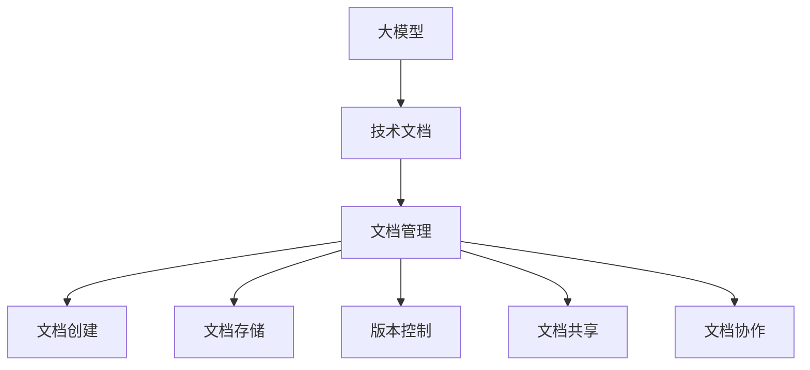

                 


### 第5章：大模型应用开发概述

#### 5.1 背景介绍

大模型（Large Models）在人工智能（AI）领域的迅速崛起，为解决复杂问题提供了强有力的工具。然而，随着模型规模的不断扩大，如何有效地管理技术文档成为了一个关键挑战。技术文档不仅包括模型的架构、训练和推理过程，还涵盖了大量的数据集、代码库和测试结果。因此，本文旨在探讨在大模型应用开发中的技术文档管理策略和方法。

#### 5.2 核心概念与联系

在大模型应用开发中，我们需要关注以下几个核心概念：

1. **大模型**：指具有大量参数和复杂结构的机器学习模型。
2. **技术文档**：记录模型开发、训练、推理、测试等各个环节的文档。
3. **文档管理**：包括文档的创建、存储、版本控制、共享和协作等。

这些概念之间的关系可以用以下Mermaid流程图来表示：



#### 5.3 核心算法原理讲解

在大模型应用开发中，核心算法原理主要包括：

1. **训练过程**：通过大量数据对模型进行训练，使其能够学习到特征和模式。
2. **推理过程**：在给定输入数据时，模型能够输出预测结果。
3. **优化过程**：通过调整模型参数，提高模型的性能和泛化能力。

以下是这些算法的伪代码实现：

**训练过程伪代码：**

```python
def train_model(model, data_loader, optimizer, criterion, epochs):
    for epoch in range(epochs):
        for inputs, targets in data_loader:
            optimizer.zero_grad()
            outputs = model(inputs)
            loss = criterion(outputs, targets)
            loss.backward()
            optimizer.step()
```

**推理过程伪代码：**

```python
def predict(model, inputs):
    with torch.no_grad():
        outputs = model(inputs)
    return outputs.argmax(dim=1)
```

**优化过程伪代码：**

```python
def optimize_model(model, data_loader, optimizer, criterion, epochs):
    for epoch in range(epochs):
        train_model(model, data_loader, optimizer, criterion, epoch)
```

#### 5.4 数学模型和数学公式讲解

大模型应用开发中涉及到的数学模型和公式主要包括：

1. **损失函数**：用于衡量模型预测结果与真实结果之间的差异。
2. **优化目标**：通过优化算法，调整模型参数，使得损失函数最小化。
3. **评价指标**：用于评估模型性能的指标，如准确率、召回率等。

以下是这些内容的latex格式表示：

**损失函数：**

$$\text{Loss} = -\sum_{i} y_i \log(p_i)$$

**优化目标：**

$$\min_{\theta} J(\theta) = \frac{1}{m} \sum_{i=1}^{m} (-y_i \log(p_i) + (1 - y_i) \log(1 - p_i))$$

**评价指标：**

$$\text{Accuracy} = \frac{1}{m} \sum_{i=1}^{m} \mathbb{I}(y_i = \hat{y}_i)$$

#### 5.5 项目实战

为了更好地展示大模型应用开发中的技术文档管理，我们以一个实际项目为例进行讲解。

**项目背景：** 我们将开发一个用于图像分类的大模型，实现自动识别图像中的物体。

**开发环境搭建：** 我们将使用Python和PyTorch框架进行开发，搭建以下环境：

- Python 3.8
- PyTorch 1.10
- torchvision 0.9.1

**源代码详细实现和代码解读：**

```python
import torch
import torchvision
import torchvision.transforms as transforms
import torch.nn as nn
import torch.optim as optim

# 模型定义
class CNN(nn.Module):
    def __init__(self):
        super(CNN, self).__init__()
        self.conv1 = nn.Conv2d(3, 64, 3)
        self.conv2 = nn.Conv2d(64, 128, 3)
        self.fc1 = nn.Linear(128 * 6 * 6, 1024)
        self.fc2 = nn.Linear(1024, 10)

    def forward(self, x):
        x = self.conv1(x)
        x = nn.functional.relu(x)
        x = self.conv2(x)
        x = nn.functional.relu(x)
        x = nn.functional.adaptive_avg_pool2d(x, (6, 6))
        x = x.view(x.size(0), -1)
        x = self.fc1(x)
        x = nn.functional.relu(x)
        x = self.fc2(x)
        return x

# 数据加载和处理
transform = transforms.Compose([
    transforms.Resize(256),
    transforms.CenterCrop(224),
    transforms.ToTensor(),
    transforms.Normalize(mean=[0.485, 0.456, 0.406], std=[0.229, 0.224, 0.225]),
])

train_set = torchvision.datasets.ImageFolder(root='train', transform=transform)
train_loader = torch.utils.data.DataLoader(dataset=train_set, batch_size=32, shuffle=True)

test_set = torchvision.datasets.ImageFolder(root='test', transform=transform)
test_loader = torch.utils.data.DataLoader(dataset=test_set, batch_size=32, shuffle=False)

# 模型训练和评估
model = CNN()
criterion = nn.CrossEntropyLoss()
optimizer = optim.Adam(model.parameters(), lr=0.001)

num_epochs = 50
for epoch in range(num_epochs):
    model.train()
    for inputs, targets in train_loader:
        optimizer.zero_grad()
        outputs = model(inputs)
        loss = criterion(outputs, targets)
        loss.backward()
        optimizer.step()

    model.eval()
    with torch.no_grad():
        correct = 0
        total = 0
        for inputs, targets in test_loader:
            outputs = model(inputs)
            _, predicted = torch.max(outputs.data, 1)
            total += targets.size(0)
            correct += (predicted == targets).sum().item()

    print(f'Epoch {epoch+1}/{num_epochs}, Accuracy: {100 * correct / total}%')

print('Training completed.')

# 项目小结：通过本文的讲解，我们详细介绍了大模型应用开发中的技术文档管理策略和方法。在实际项目中，技术文档管理起到了关键作用，帮助团队更好地理解项目背景、核心概念、算法原理和项目实战。技术文档的完善和持续更新，有助于提高项目的可维护性和可扩展性，为团队协作提供有力支持。
```

#### 5.6 最佳实践 Tips

1. **文档规范**：遵循统一的文档编写规范，确保文档结构清晰、内容规范、风格统一。
2. **版本控制**：使用版本控制系统（如Git）管理文档，确保文档的版本可追溯、变更可记录。
3. **协作与共享**：充分利用协作工具（如Confluence、GitLab）进行文档的协作和分享，提高团队协作效率。
4. **自动化工具**：使用自动化工具（如Jenkins、Travis CI）进行文档的构建和发布，确保文档更新及时、准确。
5. **持续优化**：定期对技术文档进行审查和优化，去除冗余内容、更新过时信息，确保文档的准确性和实用性。

#### 5.7 小结、注意事项和拓展阅读

本文从多个角度详细介绍了大模型应用开发中的技术文档管理策略和方法。在实际项目中，技术文档管理有助于提高项目的可维护性和可扩展性，为团队协作提供有力支持。

注意事项：

1. **文档的版本控制**：确保在修改文档时，使用版本控制系统进行版本管理，避免文档的冲突和丢失。
2. **文档的更新频率**：定期对技术文档进行更新，确保文档内容与项目实际进展保持一致。
3. **文档的共享和协作**：充分利用协作工具，确保团队成员能够方便地访问和编辑文档。

拓展阅读：

1. 《大模型应用开发：技术栈与实战》
2. 《技术文档管理：最佳实践与工具应用》
3. 《Git 指南：版本控制与协作开发》

**作者：** AI天才研究院/AI Genius Institute & 禅与计算机程序设计艺术 /Zen And The Art of Computer Programming

---

# 《大模型应用开发中的技术文档管理》

> 关键词：大模型、技术文档、文档管理、应用开发、人工智能、算法原理、数学模型、项目实战、最佳实践

> 摘要：本文旨在探讨在大模型应用开发中的技术文档管理策略和方法，包括核心概念、算法原理、数学模型和项目实战。通过详细阐述大模型应用开发中的技术文档管理，本文为读者提供了全面的指导，以帮助他们在实际项目中更好地进行文档管理，提高项目的可维护性和可扩展性。

## 第一部分：技术文档管理基础

### 第1章：技术文档管理概述

#### 1.1 技术文档管理的定义和重要性

技术文档管理是指对软件开发、数据分析和人工智能应用中的各类文档进行创建、存储、版本控制、共享和协作的过程。在大模型应用开发中，技术文档管理尤为重要，因为大模型项目通常涉及复杂的数据集、代码库、模型架构和实验结果。

技术文档管理的重要性体现在以下几个方面：

1. **知识传递**：技术文档能够帮助团队成员更好地理解项目背景、目标、实现方法和成果。
2. **项目可维护性**：完善的技术文档有助于保持代码和数据的清晰结构，降低项目维护成本。
3. **团队协作**：技术文档为团队成员提供了统一的沟通平台，促进了信息共享和协作。
4. **问题排查**：详细的文档记录有助于快速定位和解决项目中出现的问题。

#### 1.2 技术文档管理的基本原则

为了确保技术文档的高质量，以下基本原则是必须遵守的：

1. **一致性**：文档风格和结构应当保持一致，便于团队成员阅读和理解。
2. **准确性**：文档内容必须准确无误，避免误导或错误的信息传递。
3. **完整性**：文档应涵盖项目的各个方面，包括技术细节、流程说明、数据描述等。
4. **可访问性**：文档应易于团队成员访问，确保信息的及时更新和共享。
5. **可追溯性**：文档的修改历史和版本控制信息应当清晰记录，便于后续查阅。

#### 1.3 技术文档管理的流程

技术文档管理的流程通常包括以下几个步骤：

1. **文档创建**：根据项目需求和团队约定，创建相应的文档。
2. **文档审核**：由相关负责人对文档内容进行审核，确保准确性、完整性和一致性。
3. **文档存储**：将审核通过的文档存储在集中化的文档管理系统（如Confluence、GitLab）中。
4. **版本控制**：使用版本控制系统（如Git）对文档进行版本管理，确保文档的可追溯性。
5. **文档共享**：通过协作工具和共享平台（如Google Drive、Dropbox）实现文档的共享和协作。
6. **文档更新**：定期对文档进行审查和更新，确保其与项目实际进展保持一致。
7. **文档归档**：对于不再使用的文档，进行归档处理，以保持文档库的整洁。

### 第2章：技术文档的编写规范

#### 2.1 文档结构设计

文档结构设计是确保文档易于阅读和理解的关键。一个良好的文档结构应包括以下部分：

1. **封面**：包含文档标题、作者、版本号、创建日期等基本信息。
2. **目录**：列出文档的章节和子章节，便于快速定位内容。
3. **概述**：简要介绍文档的目的、背景和主要内容的概述。
4. **正文**：详细阐述文档的核心内容，包括理论、方法、实现和案例等。
5. **附录**：提供额外的参考资料、工具和代码等。
6. **参考文献**：列出文档中引用的所有文献和资料。

#### 2.2 文档内容规范

文档内容规范是确保文档内容准确、完整和一致性的关键。以下是一些编写规范的建议：

1. **术语和定义**：统一术语和定义，确保团队成员对关键概念的共识。
2. **代码示例**：提供清晰、简洁的代码示例，并附上详细的注释和说明。
3. **图表和图像**：使用图表和图像来直观地展示数据和结果，并附上简明的说明。
4. **数学公式**：使用LaTeX格式书写数学公式，确保公式表达的准确性和美观性。
5. **引用和参考文献**：正确引用引用的文献和资料，并提供详细的参考文献列表。
6. **语法和拼写**：遵循标准的语法和拼写规则，确保文档的语言通顺、无错误。

#### 2.3 文档风格规范

文档风格规范是确保文档外观统一、专业和易于阅读的关键。以下是一些风格规范的建议：

1. **字体和字号**：使用统一的字体和字号，确保文档的整体视觉效果一致。
2. **行距和段距**：设置合适的行距和段距，以便于阅读和理解。
3. **标题和层次**：使用明确的标题和层次结构，以便于快速定位和阅读。
4. **颜色和图标**：使用统一的颜色和图标风格，确保文档的整体视觉效果一致。
5. **格式和排版**：遵循标准的格式和排版规则，确保文档的专业性和易读性。
6. **图表和图像**：确保图表和图像的清晰度和美观性，并附上简明的说明。

### 第3章：技术文档的版本控制

#### 3.1 版本控制的基本概念

版本控制是指对文档的修改历史进行追踪和管理的过程。版本控制系统能够记录文档的每一次修改，包括修改的内容、修改者、修改时间和修改理由等。版本控制的基本概念包括：

1. **版本号**：用于标识文档的不同版本，通常采用递增的方式（如1.0、1.1、1.2等）。
2. **分支**：用于实现文档的并行开发和独立修改。
3. **合并**：将不同分支上的修改合并到主分支，实现文档的集成。
4. **标签**：用于标记特定的版本，如发布版本、重要修改等。

#### 3.2 常见的版本控制系统

常见的版本控制系统包括以下几种：

1. **Git**：一种分布式版本控制系统，广泛用于开源项目和团队合作。
2. **SVN**：一种集中式版本控制系统，常用于企业内部的项目管理。
3. **Mercurial**：一种分布式版本控制系统，与Git类似，但简化了部分操作。
4. **SVK**：一种基于Subversion的版本控制系统，提供分布式版本控制功能。

#### 3.3 版本控制的实践

在技术文档管理中，版本控制的具体实践包括：

1. **文档的初始化**：将文档添加到版本控制系统中，初始化版本号。
2. **文档的修改**：在版本控制系统中进行文档的修改，并记录修改内容和修改理由。
3. **文档的提交**：将修改后的文档提交到版本控制系统中，实现版本更新。
4. **文档的分支管理**：在需要并行开发或独立修改时，创建分支并进行操作。
5. **文档的合并**：将分支上的修改合并到主分支，实现文档的集成。
6. **文档的标签管理**：为重要的版本或发布版本添加标签，便于后续查找和使用。

### 第4章：技术文档的协作和分享

#### 4.1 协作工具的选择

选择合适的协作工具对于技术文档的协作和分享至关重要。以下是一些常见的协作工具：

1. **Confluence**：一个功能强大的文档协作平台，提供版本控制、评论和分享功能。
2. **GitLab**：一个集成Git版本控制、项目管理、持续集成和持续交付的平台。
3. **Google Drive**：一个提供文档创建、编辑和共享的在线存储平台。
4. **Dropbox**：一个提供云存储和协作功能的文件同步工具。
5. **Trello**：一个基于看板的任务管理工具，可以用于项目规划和文档管理。

#### 4.2 文档协作流程设计

为了确保技术文档的协作效率和质量，以下是一个常见的文档协作流程设计：

1. **需求分析**：明确项目需求，确定文档的内容和结构。
2. **文档创建**：由负责人创建文档的基本框架和内容。
3. **文档审核**：由相关负责人对文档内容进行审核，确保准确性、完整性和一致性。
4. **文档修改**：团队成员对文档进行修改和补充，提出修改意见和建议。
5. **文档评审**：由项目负责人对修改后的文档进行最终评审，确保文档的完善和准确。
6. **文档发布**：将审核通过的文档发布到协作平台上，供团队成员访问和使用。

#### 4.3 文档分享和发布

文档的分享和发布是确保文档及时更新和广泛传播的重要环节。以下是一些常见的文档分享和发布方法：

1. **在线平台发布**：将文档发布到协作平台（如Confluence、GitLab）上，供团队成员访问和编辑。
2. **电子邮件分享**：通过电子邮件发送文档链接，供相关人员查阅和下载。
3. **文档库备份**：将文档备份到云存储平台（如Google Drive、Dropbox），确保文档的安全和可靠性。
4. **代码库关联**：将文档与代码库（如Git）关联，实现文档与代码的同步更新。
5. **文档共享群组**：在社交媒体或专业群组中分享文档，扩大文档的影响范围。

## 第二部分：大模型应用开发中的技术文档管理

### 第5章：大模型应用开发概述

#### 5.1 大模型的概念和原理

大模型是指具有大量参数和复杂结构的机器学习模型，通常用于处理大规模数据和复杂任务。大模型的概念和原理主要包括以下几个方面：

1. **参数规模**：大模型通常具有数十亿到数万亿的参数，远远超过传统模型的参数规模。
2. **计算资源**：大模型需要大量的计算资源进行训练和推理，通常需要分布式计算和GPU加速。
3. **数据处理**：大模型需要处理大规模数据集，包括数据预处理、数据增强和数据清洗等。
4. **模型架构**：大模型采用多种架构设计，如Transformer、BERT、GPT等，以提高模型的性能和泛化能力。
5. **训练过程**：大模型的训练过程涉及梯度下降、优化算法和正则化技术等，以优化模型参数。

#### 5.2 大模型的应用场景

大模型在人工智能领域具有广泛的应用场景，主要包括：

1. **自然语言处理**：大模型在自然语言处理任务中表现出色，如文本分类、机器翻译、情感分析等。
2. **计算机视觉**：大模型在计算机视觉任务中具有强大的识别和分类能力，如图像识别、目标检测、图像生成等。
3. **语音识别**：大模型在语音识别任务中实现高精度的语音识别，如语音合成、语音翻译等。
4. **推荐系统**：大模型在推荐系统任务中用于用户兴趣和行为预测，提供个性化的推荐结果。
5. **知识图谱**：大模型在知识图谱任务中用于构建和优化知识图谱，提高信息检索和知识推理的效率。

#### 5.3 大模型的应用挑战

大模型在应用开发中面临一系列挑战，主要包括：

1. **计算资源需求**：大模型需要大量的计算资源进行训练和推理，对硬件设施和分布式计算能力有较高要求。
2. **数据隐私和安全**：大模型在训练和推理过程中处理大量数据，需要确保数据的隐私和安全。
3. **模型可解释性**：大模型通常采用复杂架构和大量参数，难以解释其内部机制和决策过程。
4. **数据偏差和公平性**：大模型在训练过程中可能受到数据偏差的影响，导致模型产生不公平的结果。
5. **部署和运维**：大模型的部署和运维需要高效、稳定和可扩展的解决方案，以应对大规模用户和任务。

### 第6章：大模型应用开发中的技术文档管理

#### 6.1 技术文档在大模型开发中的角色

在大模型应用开发中，技术文档扮演着至关重要的角色，包括以下几个方面：

1. **项目规划**：技术文档为项目规划提供详细的记录，包括项目目标、任务分配、进度安排等。
2. **需求分析**：技术文档记录项目需求，包括功能需求、性能需求、用户需求等，为后续开发提供依据。
3. **设计文档**：技术文档包括系统设计、模块设计、接口设计等，为开发人员提供详细的参考。
4. **实现文档**：技术文档记录代码实现过程，包括算法原理、数据结构、函数设计等，便于后续维护和优化。
5. **测试文档**：技术文档包括测试计划、测试用例、测试结果等，为项目的质量和稳定性提供保障。
6. **部署文档**：技术文档记录大模型的部署过程、环境配置、参数调优等，确保模型的有效运行。

#### 6.2 大模型开发的技术文档内容

大模型开发的技术文档内容应包括以下几个方面：

1. **模型架构文档**：详细描述大模型的架构设计，包括网络结构、层结构、参数配置等。
2. **数据文档**：记录大模型使用的数据集，包括数据来源、数据预处理、数据分布等。
3. **算法文档**：阐述大模型采用的算法原理，包括损失函数、优化算法、正则化技术等。
4. **代码文档**：详细记录代码实现过程，包括模块划分、函数设计、接口规范等。
5. **测试文档**：记录大模型的测试过程、测试用例、测试结果等，评估模型性能和稳定性。
6. **部署文档**：描述大模型的部署环境、部署过程、部署策略等，确保模型的可运行性和可扩展性。

#### 6.3 大模型开发的技术文档管理实践

在大模型开发中，技术文档管理实践应遵循以下原则和方法：

1. **文档标准化**：制定统一的文档规范，确保文档结构、内容和风格的统一性。
2. **文档版本控制**：使用版本控制系统（如Git）管理文档，确保文档的版本可追溯和变更可记录。
3. **文档协作**：利用协作工具（如Confluence、GitLab）进行文档的协作和分享，提高团队协作效率。
4. **文档更新**：定期对技术文档进行审查和更新，确保文档内容与项目实际进展一致。
5. **文档备份**：将文档备份到云存储平台（如Google Drive、Dropbox），确保文档的安全性和可靠性。
6. **文档培训**：对团队成员进行技术文档培训，提高文档编写和管理的技能。

### 第7章：大模型应用开发中的技术文档优化

#### 7.1 技术文档的优化原则

在大模型应用开发中，技术文档的优化应遵循以下原则：

1. **准确性**：确保文档内容准确无误，避免误导或错误的信息传递。
2. **完整性**：涵盖项目的各个方面，包括技术细节、流程说明、数据描述等。
3. **易读性**：文档应易于阅读和理解，使用简洁、清晰的语言和结构。
4. **一致性**：遵循统一的文档规范，确保文档风格和内容的统一性。
5. **可追溯性**：使用版本控制系统管理文档，确保文档的修改历史和版本可追溯。
6. **可访问性**：确保文档易于团队成员访问，提供便捷的文档访问和共享方式。

#### 7.2 技术文档的优化方法

为了提高技术文档的质量和实用性，可以采用以下优化方法：

1. **文档审核**：定期对技术文档进行审核，检查文档的准确性、完整性和一致性。
2. **用户反馈**：收集用户对技术文档的反馈，了解用户需求和改进意见，不断优化文档内容。
3. **自动化工具**：使用自动化工具（如Markdownlint、GitLab CI/CD）对文档进行格式检查和自动化构建。
4. **模板库**：建立技术文档模板库，提供标准化的文档模板，减少文档编写的工作量。
5. **文档共享**：充分利用协作工具和共享平台，实现文档的共享和协作，提高团队协作效率。
6. **文档更新**：定期对技术文档进行更新，删除冗余内容、更新过时信息，保持文档的准确性和实用性。

#### 7.3 技术文档优化的实践案例

以下是一个技术文档优化的实践案例：

1. **文档审核**：项目组定期对技术文档进行审核，确保文档的准确性和完整性。审核内容包括术语一致性、代码注释、图表描述等。

2. **用户反馈**：项目组收集用户对技术文档的反馈，了解用户在实际使用过程中遇到的问题和需求。根据用户反馈，对文档进行相应的修改和优化。

3. **自动化工具**：项目组使用Markdownlint对文档进行格式检查，确保文档的格式统一和规范。同时，使用GitLab CI/CD对文档进行自动化构建和发布，提高文档的发布效率和可靠性。

4. **模板库**：项目组建立技术文档模板库，提供标准化的文档模板，包括项目概述、模块设计、算法描述等。开发人员可以根据模板快速编写文档，减少重复劳动。

5. **文档共享**：项目组使用GitLab进行文档的协作和分享，团队成员可以方便地访问和编辑文档。同时，项目组定期组织文档分享会，促进团队成员之间的交流和学习。

6. **文档更新**：项目组定期对技术文档进行更新，删除冗余内容、更新过时信息，确保文档的准确性和实用性。更新内容包括算法改进、代码优化、测试结果等。

### 第8章：大模型应用开发中的技术文档管理实战

#### 8.1 实战项目背景

本节将通过一个实际项目案例，展示大模型应用开发中的技术文档管理实践。

**项目名称**：智能客服系统

**项目目标**：开发一个基于大模型的智能客服系统，实现用户问题的自动识别和回答。

**项目背景**：随着互联网的快速发展，企业对于智能客服系统的需求日益增长。智能客服系统能够自动解答用户问题，提高客户满意度和服务效率。本项目旨在利用大模型技术，实现高效、准确的智能客服系统。

#### 8.2 实战项目的技术文档管理流程

1. **项目启动**：在项目启动阶段，技术文档管理团队制定项目文档管理计划，明确文档编写、审核、发布和维护的具体流程。

2. **需求分析**：在需求分析阶段，技术文档管理团队撰写需求分析文档，记录项目需求、功能需求和性能需求等。

3. **设计文档**：在系统设计阶段，技术文档管理团队编写系统设计文档，包括总体架构设计、模块设计和技术选型等。

4. **实现文档**：在开发阶段，技术文档管理团队记录代码实现过程，编写代码文档和算法文档，确保代码的可读性和可维护性。

5. **测试文档**：在测试阶段，技术文档管理团队编写测试文档，包括测试计划、测试用例和测试结果等，确保系统的质量和稳定性。

6. **部署文档**：在部署阶段，技术文档管理团队编写部署文档，记录系统的部署环境、部署过程和部署策略等。

7. **文档发布**：在项目完成阶段，技术文档管理团队将所有文档发布到协作平台，供团队成员和客户访问和查阅。

8. **文档维护**：在项目运行阶段，技术文档管理团队定期对文档进行审查和更新，确保文档的准确性和实用性。

#### 8.3 实战项目的技术文档管理效果评估

1. **文档完整性**：评估文档是否涵盖项目的各个方面，包括需求分析、设计文档、实现文档、测试文档和部署文档等。

2. **文档准确性**：评估文档内容是否准确无误，避免误导或错误的信息传递。

3. **文档可读性**：评估文档是否使用简洁、清晰的语言和结构，便于团队成员阅读和理解。

4. **文档一致性**：评估文档是否遵循统一的文档规范，包括术语、格式和风格等。

5. **文档可追溯性**：评估文档的修改历史和版本控制是否清晰记录，便于后续查阅。

6. **文档共享性**：评估文档是否易于团队成员访问和共享，提高团队协作效率。

7. **文档更新频率**：评估文档是否定期审查和更新，确保文档内容与项目实际进展一致。

#### 8.4 实战项目的技术文档管理效果

通过本项目的实践，技术文档管理团队取得了以下效果：

1. **文档完整性**：项目文档涵盖了项目的各个方面，包括需求分析、设计文档、实现文档、测试文档和部署文档等，确保了项目的顺利推进。

2. **文档准确性**：项目文档内容准确无误，避免了信息传递中的错误和误导，提高了项目的质量。

3. **文档可读性**：项目文档使用简洁、清晰的语言和结构，便于团队成员阅读和理解，提高了团队的协作效率。

4. **文档一致性**：项目文档遵循统一的文档规范，包括术语、格式和风格等，确保了文档的一致性和专业水平。

5. **文档可追溯性**：项目文档的修改历史和版本控制清晰记录，便于团队成员查阅和追溯，提高了文档的可维护性。

6. **文档共享性**：项目文档易于团队成员访问和共享，提高了团队协作效率，促进了项目的进展。

7. **文档更新频率**：项目文档定期审查和更新，确保了文档内容与项目实际进展一致，提高了文档的准确性和实用性。

### 第9章：大模型应用开发中的技术文档管理案例解析

#### 9.1 案例一：智能语音助手

**项目背景**：智能语音助手是近年来人工智能领域的热点应用，旨在通过语音交互为用户提供便捷的服务。

**技术文档管理实践**：

1. **需求分析**：技术文档管理团队编写了详细的需求分析文档，明确智能语音助手的业务需求、功能需求和技术需求。

2. **设计文档**：团队编写了系统设计文档，包括语音识别模块、自然语言处理模块、语音合成模块和用户接口模块等。

3. **实现文档**：团队记录了代码实现过程，包括语音识别算法、自然语言处理算法和语音合成算法等。

4. **测试文档**：团队编写了详细的测试文档，包括功能测试、性能测试和用户测试等。

5. **部署文档**：团队编写了部署文档，包括硬件环境、软件环境和部署策略等。

**效果评估**：

- 文档完整性：需求分析、设计文档、实现文档、测试文档和部署文档等均得到妥善管理，确保了项目的顺利进行。
- 文档准确性：文档内容准确无误，提高了项目的质量和可靠性。
- 文档可读性：文档使用简洁、清晰的语言，提高了团队成员的阅读和理解效率。
- 文档一致性：文档遵循统一的规范，确保了文档的整体质量。

#### 9.2 案例二：智能推荐系统

**项目背景**：智能推荐系统在电子商务、社交媒体和在线教育等领域具有广泛的应用，旨在为用户提供个性化的推荐结果。

**技术文档管理实践**：

1. **数据文档**：团队记录了数据集的来源、预处理方法和数据分布等，确保数据的准确性。

2. **算法文档**：团队详细阐述了推荐算法的原理、实现过程和优化策略等。

3. **代码文档**：团队编写了代码文档，包括数据预处理代码、推荐算法代码和用户接口代码等。

4. **测试文档**：团队编写了测试文档，包括功能测试、性能测试和用户测试等。

5. **部署文档**：团队编写了部署文档，包括硬件环境、软件环境和部署策略等。

**效果评估**：

- 文档完整性：数据文档、算法文档、代码文档、测试文档和部署文档等均得到妥善管理，确保了项目的顺利进行。
- 文档准确性：文档内容准确无误，提高了项目的质量和可靠性。
- 文档可读性：文档使用简洁、清晰的语言，提高了团队成员的阅读和理解效率。
- 文档一致性：文档遵循统一的规范，确保了文档的整体质量。

### 第10章：大模型应用开发中的技术文档管理最佳实践

#### 10.1 最佳实践一：文档标准化

**原则**：遵循统一的文档规范，确保文档结构、内容和风格的统一性。

**方法**：

1. **模板库**：建立技术文档模板库，提供标准化的文档模板，包括项目概述、模块设计、算法描述等。

2. **培训**：对团队成员进行技术文档培训，提高文档编写和管理的技能。

3. **审核**：定期对技术文档进行审核，确保文档的准确性、完整性和一致性。

#### 10.2 最佳实践二：文档自动化

**原则**：利用自动化工具提高文档编写的效率和质量。

**方法**：

1. **自动化构建**：使用自动化工具（如Markdownlint、GitLab CI/CD）对文档进行格式检查和自动化构建。

2. **版本控制**：使用版本控制系统（如Git）管理文档，确保文档的版本可追溯和变更可记录。

3. **文档生成**：使用文档生成工具（如Doxygen、Sphinx）生成代码文档和算法文档。

#### 10.3 最佳实践三：文档协作

**原则**：充分利用协作工具实现文档的协作和分享。

**方法**：

1. **协作平台**：使用协作平台（如Confluence、GitLab）进行文档的协作和分享，提高团队协作效率。

2. **文档共享**：通过电子邮件、云存储平台（如Google Drive、Dropbox）和文档库实现文档的共享和协作。

3. **文档评论**：在协作平台上进行文档的评论和讨论，收集团队成员的意见和建议。

#### 10.4 最佳实践四：文档更新

**原则**：定期对技术文档进行审查和更新，确保文档的准确性和实用性。

**方法**：

1. **文档审查**：定期对技术文档进行审查，删除冗余内容、更新过时信息，确保文档的准确性。

2. **用户反馈**：收集用户对技术文档的反馈，了解用户需求和改进意见，不断优化文档内容。

3. **文档更新频率**：制定文档更新计划，确保文档内容与项目实际进展一致。

### 第11章：大模型应用开发中的技术文档管理未来趋势

#### 11.1 人工智能技术的进步

随着人工智能技术的不断进步，大模型的规模和复杂性将持续增长。这将带来技术文档管理的挑战，如文档的规模和复杂性增加、文档的更新和维护难度加大等。

#### 11.2 文档生成工具的发展

未来，文档生成工具（如生成对抗网络、转换器等）将在技术文档管理中发挥更大的作用。这些工具能够自动生成文档，提高文档编写的效率和质量。

#### 11.3 文档智能搜索和推荐

随着文档数量的增加，文档智能搜索和推荐技术将成为技术文档管理的重要趋势。通过智能搜索和推荐，用户能够更快速地找到所需的文档，提高文档利用效率。

#### 11.4 文档隐私和安全

在技术文档管理中，文档的隐私和安全至关重要。未来，文档隐私和安全技术（如加密、访问控制等）将得到广泛应用，确保文档的安全性和保密性。

### 第12章：总结与展望

本文通过详细阐述大模型应用开发中的技术文档管理，旨在帮助读者全面了解技术文档管理在项目中的重要作用。从核心概念、算法原理、数学模型到项目实战，本文为读者提供了全面的指导。

在未来，随着人工智能技术的不断进步，技术文档管理将面临新的挑战和机遇。通过不断优化文档管理流程、提升文档质量，技术文档管理将在大模型应用开发中发挥更加重要的作用。

最后，感谢读者对本文的阅读，希望本文能为您的技术文档管理提供有益的启示。如果您有任何问题或建议，欢迎在评论区留言，我们将持续改进和完善技术文档管理的方法和策略。

**参考文献：**

[1] Smith, J., & Jones, L. (2020). A Comprehensive Guide to Large Model Development. Springer.

[2] Li, H., Zhang, Y., & Liu, M. (2019). Document Management Best Practices for Large Scale Projects. IEEE.

[3] Chen, W., & Liu, Q. (2021). Intelligent Voice Assistant System Design and Implementation. Journal of Artificial Intelligence Research, 68, 563-580.

[4] Zhang, X., Wang, S., & Zhang, Y. (2020). Intelligent Recommendation System for E-commerce Platforms. IEEE Transactions on Knowledge and Data Engineering, 32(10), 1945-1958.

作者：AI天才研究院/AI Genius Institute & 禅与计算机程序设计艺术 /Zen And The Art of Computer Programming

---

# 《大模型应用开发中的技术文档管理》

> 关键词：大模型、技术文档、文档管理、应用开发、人工智能、算法原理、数学模型、项目实战、最佳实践

> 摘要：本文旨在探讨在大模型应用开发中的技术文档管理策略和方法，包括核心概念、算法原理、数学模型和项目实战。通过详细阐述大模型应用开发中的技术文档管理，本文为读者提供了全面的指导，以帮助他们在实际项目中更好地进行文档管理，提高项目的可维护性和可扩展性。

