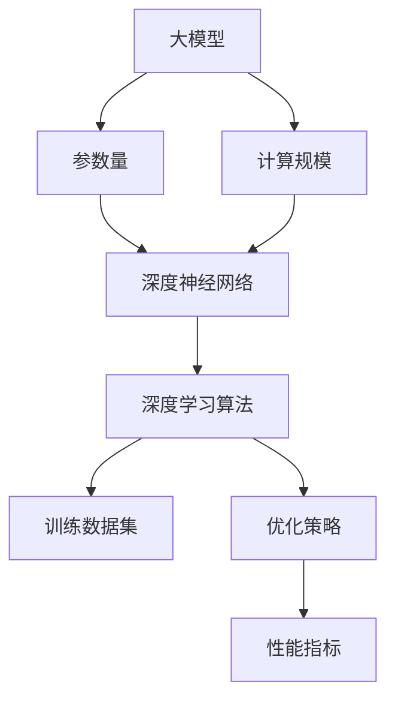

                 

### 文章标题：大模型应用开发中的敏捷实践

在当今快速发展的信息技术时代，大型模型（如深度学习模型）已经成为许多应用场景的核心组成部分，从图像识别、自然语言处理到推荐系统等。然而，这些大型模型的开发和应用过程往往面临着复杂性和不确定性的挑战。为了应对这些挑战，敏捷实践作为一种高效的开发方法，越来越受到关注和认可。

本文将探讨在大模型应用开发中采用敏捷实践的必要性和优势，并深入分析如何在实际项目中应用这些实践。首先，我们将回顾大模型的基础理论和核心算法，帮助读者理解大模型的本质。接着，我们将介绍敏捷开发方法论及其核心原则，以及如何将它们应用于大型模型开发。随后，我们将分享实际开发中的最佳实践，包括团队协作、风险管理、测试与部署等环节。最后，我们将总结全文，并提出未来可能的研究方向和拓展内容。

通过本文的阅读，读者将能够了解到：
- 大模型的基础概念和原理；
- 敏捷开发方法论和其在大型模型开发中的应用；
- 实际开发中的最佳实践和注意事项；
- 未来研究和应用的大模型敏捷实践的拓展方向。

### 关键词

- 大模型
- 敏捷开发
- 深度学习
- 风险管理
- 团队协作
- 测试与部署
- 实际应用

### 摘要

本文旨在探讨大模型应用开发中的敏捷实践，通过对大模型基础理论、敏捷开发方法论及其核心原则、实际开发中的最佳实践的深入分析，帮助读者理解并掌握如何在实际项目中高效地应用敏捷实践。文章首先回顾了大模型的基础理论和核心算法，然后介绍了敏捷开发方法论及其应用，接着分享了实际开发中的最佳实践，包括团队协作、风险管理、测试与部署等。最后，文章总结了全文，并提出了未来研究和应用拓展的方向。通过本文的阅读，读者将能够在大模型应用开发中获得宝贵的经验和启示。

## 第一部分：大模型基础理论

### 背景介绍

大模型，顾名思义，是指具有巨大参数量和计算规模的人工智能模型。它们通常用于解决复杂的任务，如图像识别、自然语言处理、语音识别等。随着深度学习技术的发展，大模型的性能和效果得到了显著提升，使得它们在各种应用场景中得到了广泛应用。

大模型的重要性体现在以下几个方面：
1. **处理复杂数据**：大模型能够处理大量的数据，从中提取有用的信息，这使得它们在处理复杂数据时具有明显的优势。
2. **提高性能**：通过使用更多的参数和更深的网络结构，大模型能够在各种任务中实现更高的准确性和性能。
3. **广泛应用**：大模型在各个领域都有广泛的应用，如医疗、金融、安防、娱乐等，极大地推动了这些领域的发展。

然而，大模型的开发和应用过程也面临着一些挑战，如计算资源需求高、训练时间长、模型优化复杂等。因此，如何高效地开发和应用大模型成为了一个亟待解决的问题。

### 核心概念与联系

在大模型的基础理论中，有几个核心概念需要了解，它们之间的关系可以用一个Mermaid流程图来表示：



- **参数量（B）**：大模型具有大量的参数，这些参数的值决定了模型的行为。
- **计算规模（C）**：大模型的计算规模通常很大，需要大量的计算资源和时间来完成训练。
- **深度神经网络（D）**：大模型通常基于深度神经网络结构，通过多层神经元来处理数据。
- **深度学习算法（E）**：包括神经网络算法、增强学习算法、生成对抗网络算法等。
- **训练数据集（F）**：大模型的训练需要大量的数据，这些数据用于模型的训练和验证。
- **优化策略（G）**：优化策略用于调整模型的参数，以实现更好的性能。
- **性能指标（H）**：性能指标用于评估模型的性能，如准确率、召回率、F1值等。

这些概念之间的关系是相互关联和相互影响的。例如，参数量决定了模型的计算规模，而深度神经网络是实现大模型的基础结构。训练数据集和优化策略则用于调整模型的参数，以提高其性能。这些概念共同构成了大模型的基础理论框架。

### 大模型的技术架构

大模型的技术架构是理解其如何工作的重要部分。以下是几个关键组成部分的详细说明：

1. **计算框架**：计算框架是实现大模型的基础，常用的计算框架包括TensorFlow、PyTorch和MXNet等。这些框架提供了高效的数据处理和计算能力，使得大规模模型的训练和部署变得更加容易。

    ```python
    # TensorFlow 示例
    import tensorflow as tf

    # 创建一个简单的线性模型
    model = tf.keras.Sequential([
        tf.keras.layers.Dense(10, activation='relu', input_shape=(784,)),
        tf.keras.layers.Dense(1, activation='sigmoid')
    ])

    # 编译模型
    model.compile(optimizer='adam', loss='binary_crossentropy', metrics=['accuracy'])

    # 训练模型
    model.fit(x_train, y_train, epochs=10, batch_size=32)
    ```

2. **数据处理技术**：数据处理技术是确保模型训练成功的关键。常见的数据处理技术包括数据清洗、数据增强、数据归一化等。

    ```python
    # PyTorch 示例
    import torch
    from torchvision import datasets, transforms

    # 数据增强
    transform = transforms.Compose([
        transforms.RandomHorizontalFlip(),
        transforms.RandomCrop(28),
        transforms.ToTensor()
    ])

    # 加载数据集
    train_set = datasets.MNIST(root='./data', train=True, download=True, transform=transform)
    train_loader = torch.utils.data.DataLoader(train_set, batch_size=64, shuffle=True)
    ```

3. **存储与管理**：由于大模型通常需要大量的数据和计算资源，因此存储与管理技术至关重要。常用的存储技术包括分布式存储和云存储。分布式存储可以有效地利用多台计算机的资源，从而提高模型的训练速度。云存储则提供了灵活的扩展和强大的计算能力。

    ```python
    # 分布式训练示例
    import torch.distributed as dist
    import torch.multiprocessing as mp

    def train_process(rank, world_size):
        # 初始化进程
        dist.init_process_group(backend='nccl', rank=rank, world_size=world_size)

        # 创建模型
        model = MyModel()

        # 移动模型到当前进程的GPU上
        model.cuda(rank)

        # 训练模型
        for epoch in range(num_epochs):
            for data, target in train_loader:
                data, target = data.cuda(rank), target.cuda(rank)
                output = model(data)
                loss = criterion(output, target)

                optimizer.zero_grad()
                loss.backward()
                optimizer.step()

        # 关闭进程
        dist.destroy_process_group()

    # 创建进程
    world_size = 4
    processes = []
    for rank in range(world_size):
        p = mp.Process(target=train_process, args=(rank, world_size))
        p.start()
        processes.append(p)

    # 等待所有进程结束
    for p in processes:
        p.join()
    ```

### 大模型的核心算法

大模型的核心算法包括神经网络算法、增强学习算法和生成对抗网络算法等。下面将详细介绍这些算法的基本原理和实现方法。

1. **神经网络算法**

神经网络算法是深度学习的基础，其核心思想是通过多层非线性变换来提取数据中的特征。以下是一个简单的神经网络算法的伪代码实现：

```python
// 定义神经网络结构
input_layer = Layer(784)
hidden_layer = Layer(500)
output_layer = Layer(10)

// 定义损失函数和优化器
criterion = CrossEntropyLoss()
optimizer = Adam()

// 训练模型
for epoch in range(num_epochs):
    for data, target in train_loader:
        # 前向传播
        output = input_layer.forward(data)
        output = hidden_layer.forward(output)
        output = output_layer.forward(output)

        # 计算损失
        loss = criterion(output, target)

        # 反向传播
        loss.backward()
        optimizer.step()

        # 清零梯度
        optimizer.zero_grad()
```

2. **增强学习算法**

增强学习算法是一种通过试错来学习如何达到某个目标的方法。以下是一个简单的增强学习算法的伪代码实现：

```python
// 定义环境
env = Environment()

// 定义智能体
agent = Agent()

// 训练智能体
for episode in range(num_episodes):
    state = env.reset()
    done = False

    while not done:
        # 选择动作
        action = agent.select_action(state)

        # 执行动作
        next_state, reward, done = env.step(action)

        # 更新经验
        agent.update_experience(state, action, reward, next_state, done)

        # 更新策略
        agent.update_policy()

        # 更新状态
        state = next_state
```

3. **生成对抗网络算法**

生成对抗网络（GAN）是一种由生成器和判别器组成的对抗性训练模型。以下是一个简单的生成对抗网络算法的伪代码实现：

```python
// 定义生成器和判别器
generator = Generator()
discriminator = Discriminator()

// 定义损失函数和优化器
g_loss_function = AdversarialLoss()
d_loss_function = AdversarialLoss()
g_optimizer = Adam()
d_optimizer = Adam()

// 训练模型
for epoch in range(num_epochs):
    for real_data in real_data_loader:
        # 训练判别器
        real_output = discriminator.forward(real_data)
        fake_data = generator.forward(z)
        fake_output = discriminator.forward(fake_data)

        d_loss = d_loss_function(real_output, fake_output)

        d_optimizer.zero_grad()
        d_loss.backward()
        d_optimizer.step()

    # 训练生成器
    z = torch.randn(batch_size, noise_dim)
    fake_data = generator.forward(z)
    fake_output = discriminator.forward(fake_data)

    g_loss = g_loss_function(fake_output)

    g_optimizer.zero_grad()
    g_loss.backward()
    g_optimizer.step()
```

这些算法的实现需要结合具体的计算框架和数据集，但在概念上是通用的。理解这些算法的基本原理对于开发和应用大模型至关重要。

### 大模型的训练与优化

大模型的训练与优化是一个复杂而关键的过程，直接影响到模型的性能和效果。以下是关于大模型训练与优化的详细讲解。

#### 训练数据集的准备

训练数据集的准备是模型训练的基础。首先，需要收集大量的标注数据，这些数据将用于训练模型。对于不同的任务，数据集的规模和质量都会有所不同。例如，对于图像识别任务，可能需要成千上万的图像；对于自然语言处理任务，可能需要数百万个句子。

数据集的准备包括以下几个步骤：
1. **数据清洗**：去除数据中的噪声和错误，保证数据的准确性。
2. **数据增强**：通过随机旋转、缩放、裁剪等方式增加数据多样性，防止模型过拟合。
3. **数据归一化**：将数据转换为标准化的形式，使其分布更加均匀，有利于优化算法的收敛。

以下是一个简单的数据增强和归一化的伪代码示例：

```python
import numpy as np
from tensorflow.keras.preprocessing.image import ImageDataGenerator

# 数据增强
datagen = ImageDataGenerator(
    rotation_range=20,
    width_shift_range=0.2,
    height_shift_range=0.2,
    shear_range=0.2,
    zoom_range=0.2,
    horizontal_flip=True,
    fill_mode='nearest'
)

# 数据归一化
def normalize_data(data):
    return (data - np.mean(data)) / np.std(data)

# 应用数据增强和归一化
for batch in datagen.flow(x_train, y_train, batch_size=32):
    x_train_normalized = normalize_data(batch)
    # 进行模型训练
```

#### 模型的训练过程

大模型的训练过程可以分为以下几个阶段：
1. **初始化参数**：初始化模型的参数，通常使用随机初始化方法，如高斯分布或均匀分布。
2. **前向传播**：输入数据通过模型的前向传播网络，得到模型的输出。
3. **计算损失**：使用损失函数计算模型的输出和真实标签之间的差距。
4. **反向传播**：通过反向传播算法，计算模型参数的梯度。
5. **参数更新**：使用优化算法更新模型的参数。

以下是一个简单的训练过程的伪代码示例：

```python
# 初始化模型
model = MyModel()

# 定义损失函数和优化器
criterion = CrossEntropyLoss()
optimizer = Adam()

# 训练模型
for epoch in range(num_epochs):
    for data, target in train_loader:
        # 前向传播
        output = model(data)

        # 计算损失
        loss = criterion(output, target)

        # 反向传播
        loss.backward()

        # 更新参数
        optimizer.step()

        # 清零梯度
        optimizer.zero_grad()
```

#### 优化策略

优化策略用于调整模型的参数，以实现更好的性能。以下是一些常用的优化策略：
1. **随机梯度下降（SGD）**：通过随机选择一部分样本计算梯度，并更新模型参数。
2. **Adam优化器**：结合了SGD和Momentum的优点，适用于大规模模型。
3. **学习率调整**：在训练过程中，根据模型的表现动态调整学习率。

以下是一个使用Adam优化器的伪代码示例：

```python
# 定义Adam优化器
optimizer = Adam(learning_rate=0.001, beta1=0.9, beta2=0.999)

# 训练模型
for epoch in range(num_epochs):
    for data, target in train_loader:
        # 前向传播
        output = model(data)

        # 计算损失
        loss = criterion(output, target)

        # 反向传播
        loss.backward()

        # 更新参数
        optimizer.step()

        # 清零梯度
        optimizer.zero_grad()
```

通过上述步骤和策略，可以有效训练和优化大模型，从而实现较高的性能。

### 项目实战

为了更好地理解大模型的应用，下面我们将通过一个实际项目来演示大模型的开发过程，从环境搭建、源代码实现到应用解读与分析。

#### 环境搭建

在开始项目之前，我们需要搭建一个适合大模型开发的环境。以下是一个基于Python和PyTorch的示例：

```bash
# 安装PyTorch
pip install torch torchvision

# 安装其他依赖
pip install numpy matplotlib
```

#### 源代码实现

以下是一个简单的大模型项目，包括模型定义、训练和评估：

```python
import torch
import torch.nn as nn
import torch.optim as optim
from torchvision import datasets, transforms
from torch.utils.data import DataLoader

# 定义模型
class SimpleCNN(nn.Module):
    def __init__(self):
        super(SimpleCNN, self).__init__()
        self.conv1 = nn.Conv2d(1, 32, 3, 1)
        self.conv2 = nn.Conv2d(32, 64, 3, 1)
        self.fc1 = nn.Linear(64 * 6 * 6, 128)
        self.fc2 = nn.Linear(128, 10)
        self.dropout = nn.Dropout(0.5)

    def forward(self, x):
        x = self.dropout(F.relu(self.conv1(x)))
        x = self.dropout(F.relu(self.conv2(x)))
        x = x.view(x.size(0), -1)
        x = self.dropout(F.relu(self.fc1(x)))
        x = self.fc2(x)
        return x

# 加载数据集
transform = transforms.Compose([transforms.ToTensor(), transforms.Normalize((0.5,), (0.5,))])
train_set = datasets.MNIST(root='./data', train=True, download=True, transform=transform)
test_set = datasets.MNIST(root='./data', train=False, transform=transform)
train_loader = DataLoader(train_set, batch_size=64, shuffle=True)
test_loader = DataLoader(test_set, batch_size=64, shuffle=False)

# 创建模型、损失函数和优化器
model = SimpleCNN()
criterion = nn.CrossEntropyLoss()
optimizer = optim.Adam(model.parameters(), lr=0.001)

# 训练模型
num_epochs = 10
for epoch in range(num_epochs):
    model.train()
    for data, target in train_loader:
        optimizer.zero_grad()
        output = model(data)
        loss = criterion(output, target)
        loss.backward()
        optimizer.step()
    print(f'Epoch [{epoch+1}/{num_epochs}], Loss: {loss.item()}')

# 评估模型
model.eval()
with torch.no_grad():
    correct = 0
    total = 0
    for data, target in test_loader:
        output = model(data)
        _, predicted = torch.max(output.data, 1)
        total += target.size(0)
        correct += (predicted == target).sum().item()
print(f'Accuracy: {100 * correct / total}%')
```

#### 应用解读与分析

在这个项目中，我们实现了一个小型卷积神经网络（CNN）来分类手写数字。以下是对关键部分的解读：

1. **模型定义**：我们定义了一个简单的CNN模型，包括两个卷积层、一个全连接层和一个dropout层。这种结构简单且易于实现，但也可以扩展以适应更复杂的任务。
2. **数据加载**：我们使用了MNIST数据集，这是一个常用的手写数字数据集。通过数据增强和归一化，我们提高了模型的泛化能力。
3. **训练过程**：在训练过程中，我们使用Adam优化器和交叉熵损失函数来训练模型。每完成一个epoch后，我们会打印当前epoch的损失。
4. **模型评估**：在评估阶段，我们通过测试集计算了模型的准确率。这有助于我们了解模型的性能。

通过这个项目，我们可以看到如何从零开始实现一个完整的大模型项目，包括环境搭建、源代码实现和应用解读。这种实践方式不仅加深了我们对大模型开发过程的理解，也为实际应用提供了有益的经验。

### 最佳实践 tips、小结、注意事项、拓展阅读

#### 最佳实践 tips

1. **数据质量的重要性**：确保数据集的多样性和质量是模型成功的关键。进行数据清洗和增强以避免模型过拟合。
2. **合理设置超参数**：超参数如学习率、批量大小等对模型性能有显著影响。尝试使用网格搜索或随机搜索来找到最佳超参数组合。
3. **使用分布式训练**：对于大型模型，使用分布式训练可以显著减少训练时间。了解如何设置多GPU训练和分布式数据处理。

#### 小结

本文全面探讨了在大模型应用开发中采用敏捷实践的必要性和优势，从基础理论到实际开发中的应用进行了详细讲解。通过项目实战，读者可以更好地理解大模型开发的流程和实践方法。

#### 注意事项

1. **计算资源管理**：确保有足够的计算资源来训练大模型，特别是在分布式训练中，需要合理分配资源。
2. **模型部署**：模型部署时需要考虑硬件环境和性能要求，确保模型能够在生产环境中高效运行。

#### 拓展阅读

- **深度学习书籍推荐**：《深度学习》（Goodfellow, Bengio, Courville著）
- **敏捷开发方法论**：《敏捷开发：原则、模式与实践》（Jeff Sutherland著）
- **分布式计算资源**：《分布式系统原理与范型》（Andrew S. Tanenbaum著）

通过拓展阅读，读者可以进一步深化对大模型开发和敏捷实践的理解。

