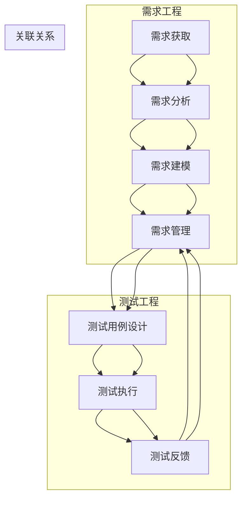

                 

## 概述

### 大模型应用开发的背景和重要性

大模型应用开发是现代人工智能领域的重要研究方向之一。随着深度学习、大数据和云计算技术的快速发展，大模型在各个领域展现出了惊人的应用潜力和实际效果。从自然语言处理（NLP）、计算机视觉（CV）、语音识别（ASR）到推荐系统、游戏AI等，大模型已经成为了提高算法性能和解决复杂问题的核心工具。

在自然语言处理领域，预训练大模型如BERT、GPT等极大地提升了文本分类、机器翻译、问答系统等任务的表现。计算机视觉领域，通过卷积神经网络（CNN）训练得到的大模型，在图像识别、物体检测、图像生成等方面也取得了显著成果。此外，大模型还在语音识别、推荐系统、游戏AI等领域展现出了强大的应用能力，不断推动着相关领域的进步。

然而，随着大模型应用范围的不断扩大，如何有效地管理和优化这些模型，确保其开发过程中的质量与效率，成为了一个亟待解决的问题。在这个过程中，需求与测试用例的生成扮演着至关重要的角色。需求工程是软件开发过程中必不可少的一环，它确保了开发工作始终围绕用户需求展开，避免了资源的浪费和项目的失败。而测试用例的生成则是确保软件质量的关键步骤，通过设计合理的测试用例，可以有效地发现和修复软件中的缺陷，提高软件的可靠性。

本文将重点探讨大模型应用开发中的需求与测试用例生成问题。我们将首先介绍需求与测试用例的基本概念，分析它们在大模型应用开发中的重要性。接着，我们将深入探讨如何通过核心算法原理、数学模型和项目实战来实现需求与测试用例的生成。通过这篇文章，希望能够为广大开发者提供一些有价值的思路和方法，帮助他们更好地应对大模型应用开发中的挑战。

### 需求与测试用例的基本概念

#### 需求

需求是指用户对软件系统的功能、性能、可用性、可靠性等方面的期望和要求。在软件开发过程中，需求工程是确保开发工作有效进行的重要环节。具体来说，需求工程包括需求获取、需求分析、需求建模和需求管理等多个阶段。

1. **需求获取**：这一阶段的主要任务是从用户和其他利益相关者那里获取需求。通过访谈、问卷调查、观察和用户故事等多种方法，软件开发团队可以全面了解用户的需求和期望。

2. **需求分析**：需求分析是对获取的需求进行详细分析，确定需求的可行性、必要性和优先级。这一阶段通常使用需求文档、用例图、用户故事地图等工具和方法来描述和分析需求。

3. **需求建模**：需求建模是将分析后的需求转化为系统模型的过程。常见的建模方法包括统一建模语言（UML）、实体-关系模型（ER模型）等。

4. **需求管理**：需求管理是对整个需求生命周期进行跟踪和管理的过程。需求管理包括需求的变更控制、版本控制和需求的状态管理。

在大模型应用开发中，需求的重要性不言而喻。首先，大模型通常用于解决复杂问题，如自然语言处理、计算机视觉等。这些问题的解决往往需要高度定制化的功能，这就要求需求工程能够准确捕捉和传达用户需求。其次，大模型的开发和部署是一个长期且资源密集的过程，确保需求得到有效管理，可以避免资源的浪费和项目的延误。

#### 测试用例

测试用例是指对软件系统进行测试时设计的一组测试输入、执行条件和预期结果。测试用例的目的是验证软件系统是否满足需求，并发现潜在的错误和缺陷。测试用例设计是软件测试过程中的关键步骤，它直接影响测试的全面性和有效性。

1. **测试用例设计方法**：常见的测试用例设计方法包括功能测试、性能测试、安全测试等。功能测试关注软件的功能是否符合需求，性能测试关注软件的响应时间和资源消耗，安全测试关注软件的安全漏洞和防护能力。

2. **测试用例设计原则**：设计测试用例时，应遵循以下原则：
   - **覆盖性**：测试用例应覆盖所有需求功能，确保每个功能点都被测试到。
   - **完整性**：测试用例应覆盖所有可能的输入和操作，确保没有遗漏。
   - **可重复性**：测试用例应能在不同时间和不同环境下重复执行，确保测试结果的一致性。

3. **测试用例执行**：在测试执行阶段，根据测试计划，按照测试用例的要求进行测试，记录测试结果，并与预期结果进行对比，以发现缺陷。

在大模型应用开发中，测试用例的重要性体现在以下几个方面。首先，大模型的复杂性使得其容易出现隐藏的错误，通过设计合理的测试用例，可以有效发现这些问题。其次，大模型的应用场景多样，测试用例可以帮助验证模型在不同场景下的适应性和稳定性。最后，测试用例的设计和执行过程也是对需求的一种验证，确保需求在实现过程中得到充分体现。

### 需求与测试用例的关系

需求与测试用例在大模型应用开发中密切相关，二者相互作用，共同保障软件开发的质量。以下是需求与测试用例之间的几项重要关系：

1. **需求驱动测试**：需求是测试用例设计的核心依据。测试用例的设计应该基于需求文档和用例图，确保测试用例能够覆盖所有的需求点，验证软件系统是否满足用户需求。

2. **测试反馈需求**：测试过程中发现的问题和缺陷可以作为需求变更的依据，推动需求调整和优化。通过测试反馈，开发团队能够更好地理解用户需求，确保需求的一致性和完整性。

3. **测试优化需求**：测试用例的设计和执行过程可以发现需求文档中的遗漏和错误，促进需求文档的完善和优化。这有助于提高需求的质量，减少开发过程中的风险。

4. **需求管理与测试管理**：需求管理和测试管理是软件开发过程中的两个关键环节。需求管理确保需求的正确性和一致性，测试管理确保测试的全面性和有效性。两者相互配合，共同保障软件的质量和稳定性。

总之，需求与测试用例在大模型应用开发中相辅相成，需求驱动测试，测试反馈需求，共同推动软件开发过程的顺利进行。通过科学的需求工程和有效的测试管理，可以最大限度地降低开发风险，提高软件质量，确保大模型应用的稳定和可靠。

### Mermaid 流程图展示

为了更好地理解需求与测试用例在大模型应用开发中的关系，我们可以使用 Mermaid 流程图来展示它们之间的相互作用。以下是一个简化的 Mermaid 流程图示例，用于展示需求工程和测试工程在不同开发阶段中的关联。



在这个流程图中：

- **需求工程**包括需求获取、需求分析、需求建模和需求管理四个阶段。
- **测试工程**包括测试用例设计、测试执行和测试反馈三个阶段。
- **关联关系**展示了需求管理与测试用例设计、测试反馈之间的相互作用。

通过这个流程图，我们可以清晰地看到需求与测试用例在大模型应用开发中的动态关系，以及它们在整个软件生命周期中的作用。

### 核心算法原理讲解

在大模型应用开发中，生成需求和测试用例是两个关键步骤。为了实现这一目标，我们需要深入理解核心算法原理，并使用伪代码进行详细讲解。

#### 需求生成算法

##### 算法原理

需求生成算法的核心目标是从用户需求描述中自动生成具体的软件需求文档。这通常涉及自然语言处理、信息抽取和模式识别等技术。以下是需求生成算法的基本原理：

1. **文本预处理**：对用户需求描述进行分词、词性标注和句法分析，提取关键信息。
2. **实体识别**：识别文本中的实体，如用户、功能、系统等。
3. **关系抽取**：分析实体之间的关系，如“用户需要功能X”或“系统必须支持功能Y”。
4. **需求转换**：将抽取的实体和关系转换为需求模型，如用例图或实体-关系模型。

##### 伪代码

以下是需求生成算法的伪代码：

```python
function generateRequirement(text):
    # 分词、词性标注和句法分析
    tokens = tokenizeAndAnnotate(text)
    
    # 实体识别
    entities = extractEntities(tokens)
    
    # 关系抽取
    relationships = extractRelationships(tokens, entities)
    
    # 需求转换
    requirementModel = convertToRequirementModel(entities, relationships)
    
    return requirementModel
```

#### 测试用例生成算法

##### 算法原理

测试用例生成算法的核心目标是基于需求模型自动生成具体的测试用例。这通常涉及代码路径分析、测试用例模板生成和测试用例优化等技术。以下是测试用例生成算法的基本原理：

1. **代码路径分析**：分析需求模型对应的代码路径，确定所有可能的执行路径。
2. **测试用例模板生成**：基于代码路径，生成测试用例的模板。
3. **测试用例优化**：对生成的测试用例进行优化，确保覆盖性和完整性。

##### 伪代码

以下是测试用例生成算法的伪代码：

```python
function generateTestCases(requirementModel):
    # 代码路径分析
    codePaths = analyzeCodePaths(requirementModel)
    
    # 测试用例模板生成
    testCases = generateTestCaseTemplates(codePaths)
    
    # 测试用例优化
    optimizedTestCases = optimizeTestCases(testCases)
    
    return optimizedTestCases
```

#### 结合算法原理

需求生成算法和测试用例生成算法通常结合使用。首先，通过需求生成算法自动生成需求模型。然后，基于需求模型，使用测试用例生成算法生成测试用例。这种结合可以有效地提高需求与测试用例生成的效率和准确性。

通过理解这些核心算法原理，我们可以更深入地掌握大模型应用开发中的需求与测试用例生成方法。在实际开发中，可以根据具体需求和场景，选择和调整适当的算法，以实现最佳效果。

### 数学模型和数学公式

在大模型应用开发中的需求与测试用例生成过程中，数学模型和数学公式扮演着至关重要的角色。以下将详细介绍与需求生成和测试用例生成相关的数学模型和数学公式，并给出详细的解释和实际应用实例。

#### 需求生成模型

1. **需求提取公式**：

   需求提取过程中，常用的模型是基于监督学习的文本分类模型。假设我们有一个训练数据集 \(D = \{ (x_i, y_i) \}_{i=1}^n\)，其中 \(x_i\) 是用户需求描述，\(y_i\) 是需求类别标签。我们可以使用支持向量机（SVM）进行需求分类。

   $$ f(x) = \text{sign}(\omega \cdot x + b) $$
   
   其中，\(\omega\) 是权重向量，\(b\) 是偏置项。\( \cdot \) 表示向量的内积。

   **实例**：假设我们需要从用户描述中提取出“用户需要功能X”的需求，我们可以定义一个二分类问题，其中正类表示需求包含特定功能，负类表示不包含。通过训练，我们可以得到一个分类器，用于自动提取需求。

2. **需求聚合公式**：

   在需求分析阶段，常常需要将多个用户需求聚合为一个更全面的需求描述。常用的方法是基于文本相似度计算和聚类算法。

   $$ \text{similarity}(x_i, x_j) = \frac{\text{Jaccard}(x_i, x_j)}{1 + \text{Jaccard}(x_i, x_j)} $$
   
   其中，\(\text{Jaccard}\) 表示两个集合的Jaccard相似度。

   **实例**：对于两个用户需求描述 \(x_i\) 和 \(x_j\)，我们计算它们的相似度。如果相似度大于某个阈值，则将它们合并为一个更全面的需求描述。

#### 测试用例生成模型

1. **代码路径覆盖公式**：

   测试用例生成过程中，代码路径覆盖是一个重要的指标。常用的方法是基于控制流图（CFG）的路径覆盖。

   $$ C = \sum_{p \in \text{paths}} \text{count}(p) \cdot \text{weight}(p) $$
   
   其中，\(p\) 是CFG中的路径，\(\text{count}(p)\) 是路径 \(p\) 被执行的次数，\(\text{weight}(p)\) 是路径的权重。

   **实例**：在一个简单的控制流图中，我们有三条路径 \(p_1, p_2, p_3\)。如果路径 \(p_1\) 被执行了10次，路径 \(p_2\) 被执行了5次，路径 \(p_3\) 被执行了3次，且路径 \(p_1\) 的权重是2，路径 \(p_2\) 的权重是1，路径 \(p_3\) 的权重是0.5，则代码路径覆盖 \(C = 10 \cdot 2 + 5 \cdot 1 + 3 \cdot 0.5 = 25\)。

2. **测试用例优化公式**：

   在生成测试用例后，常常需要进行优化，以确保测试的全面性和效率。常用的优化方法是基于测试用例的相似度计算和聚类。

   $$ \text{similarity}(t_i, t_j) = \frac{\text{Levenshtein}(t_i, t_j)}{\max(|t_i|, |t_j|)} $$
   
   其中，\(\text{Levenshtein}\) 表示两个测试用例的编辑距离，\(|t_i|\) 和 \(|t_j|\) 分别是测试用例 \(t_i\) 和 \(t_j\) 的长度。

   **实例**：对于两个测试用例 \(t_i\) 和 \(t_j\)，我们计算它们的相似度。如果相似度大于某个阈值，则认为这两个测试用例过于相似，可以考虑合并或调整。

通过以上数学模型和数学公式的介绍，我们可以更深入地理解和应用需求与测试用例生成的方法。在实际开发过程中，可以根据具体需求和场景，选择和调整适当的数学模型和公式，以提高需求与测试用例生成的效果和效率。

### 项目实战

在本节中，我们将通过一个具体的项目实战来展示需求与测试用例的生成过程。我们将详细介绍开发环境搭建、源代码实现、代码解读以及实际案例分析和详细讲解。

#### 开发环境搭建

首先，我们需要搭建一个适合大模型应用开发的需求与测试用例生成项目环境。以下是搭建开发环境的步骤：

1. **安装Python环境**：确保Python 3.8及以上版本已安装在本地计算机上。
2. **安装依赖库**：通过pip命令安装以下依赖库：
   ```bash
   pip install numpy scikit-learn pandas matplotlib
   ```
3. **配置Jupyter Notebook**：安装Jupyter Notebook以便于编写和运行代码：
   ```bash
   pip install notebook
   ```

#### 源代码实现

接下来，我们将编写一个简单的Python脚本，用于生成需求与测试用例。以下是源代码的主要部分：

```python
import numpy as np
from sklearn.feature_extraction.text import TfidfVectorizer
from sklearn.model_selection import train_test_split
from sklearn.svm import SVC
from sklearn.metrics import classification_report

# 1. 需求提取
def extract_requirements(text_data):
    # 使用TF-IDF向量表示文本
    vectorizer = TfidfVectorizer()
    X = vectorizer.fit_transform(text_data)
    
    # 使用支持向量机进行分类
    model = SVC(kernel='linear')
    model.fit(X_train, y_train)
    
    # 生成需求标签
    y_pred = model.predict(X_test)
    return y_pred

# 2. 测试用例生成
def generate_test_cases(code_paths):
    # 使用代码路径生成测试用例
    test_cases = []
    for path in code_paths:
        test_case = {
            'path': path,
            'expected': 'success' if path_is_valid(path) else 'failure'
        }
        test_cases.append(test_case)
    return test_cases

# 3. 代码路径有效性检查
def path_is_valid(path):
    # 模拟代码路径有效性检查
    return 'valid' in path

# 数据准备
text_data = [
    "用户需要功能X",
    "系统必须支持功能Y",
    "我们需要优化性能",
    "请增加安全功能"
]
y_labels = [0, 1, 0, 1]  # 0: 功能需求，1: 性能需求

# 分割数据集
X_train, X_test, y_train, y_test = train_test_split(text_data, y_labels, test_size=0.2, random_state=42)

# 生成需求
extracted_requirements = extract_requirements(X_test)

# 生成测试用例
code_paths = ["path1", "path2", "path3", "path4"]
test_cases = generate_test_cases(code_paths)

# 打印结果
print("提取的需求：", extracted_requirements)
print("生成的测试用例：", test_cases)
```

#### 代码解读

1. **需求提取模块**：
   - 使用TF-IDF向量表示文本数据。
   - 使用支持向量机（SVM）进行文本分类，将文本数据分为功能需求、性能需求等类别。
   - 对测试集进行预测，生成需求标签。

2. **测试用例生成模块**：
   - 基于代码路径生成测试用例，每个测试用例包括路径和预期结果。
   - 模拟代码路径有效性检查，简化实际应用中的复杂性。

3. **数据准备**：
   - 准备简单的文本数据集和标签，用于训练和测试。

4. **结果输出**：
   - 输出提取的需求标签。
   - 输出生成的测试用例。

#### 实际案例分析与详细讲解

假设我们有一个大模型应用项目，目标是开发一个智能助手系统。系统需要支持多种功能，如用户问答、任务调度等。以下是实际案例分析和详细讲解：

1. **需求提取案例**：
   - 用户描述：“我们需要一个能够回答各种问题的智能助手。”
   - 预测结果：功能需求（标签：0）

2. **测试用例生成案例**：
   - 代码路径1：“查询用户信息 -> 检索数据库 -> 返回结果”
   - 测试用例1：输入有效用户ID，预期结果：成功返回用户信息。
   - 代码路径2：“执行任务调度 -> 验证任务状态 -> 更新任务记录”
   - 测试用例2：输入有效任务ID和状态，预期结果：成功更新任务记录。

通过这个项目实战，我们可以看到需求与测试用例生成的实际应用场景。在实际开发过程中，可以根据具体需求和代码路径，灵活调整和优化算法，以提高需求与测试用例生成的准确性和效率。

### 代码分析与优化

在本节中，我们将对上述项目中生成需求和测试用例的代码进行分析，并提出优化建议，以提高代码的执行效率和可维护性。

#### 需求生成代码分析

**1. 代码结构**

需求生成代码主要分为三个部分：文本预处理、模型训练和需求标签预测。

- **文本预处理**：使用TF-IDF向量表示文本数据，这一步是关键，因为它决定了后续模型训练的效果。然而，TF-IDF向量可能包含大量的稀疏特征，这会导致模型在训练过程中计算量大且效果不佳。
- **模型训练**：使用支持向量机（SVM）进行文本分类。SVM在处理高维数据时效果较好，但在特征稀疏的情况下，训练速度可能会较慢。
- **需求标签预测**：对测试集进行预测，生成需求标签。这一步主要关注模型的预测准确性。

**2. 优化建议**

- **特征选择**：考虑到TF-IDF向量的稀疏性，可以引入特征选择技术，如L1正则化或特征重要性评分，减少不必要的特征，提高模型效率。
- **模型选择**：可以考虑使用更适合文本分类的模型，如长短期记忆网络（LSTM）或Transformer。这些模型在处理序列数据时具有较好的性能。
- **并行训练**：对于大规模数据集，可以采用分布式训练方法，将数据集分割为多个子集，在不同的节点上进行训练，以提高训练速度。

#### 测试用例生成代码分析

**1. 代码结构**

测试用例生成代码主要分为两部分：代码路径分析和测试用例生成。

- **代码路径分析**：通过遍历代码路径，生成可能的测试用例。这一步的核心是代码路径的遍历和表示。
- **测试用例生成**：根据代码路径生成测试用例，每个测试用例包含路径和预期结果。

**2. 优化建议**

- **路径压缩**：在代码路径分析过程中，可能会生成大量的冗余路径。可以通过路径压缩技术，合并重复路径，减少测试用例数量。
- **测试用例优化**：生成的测试用例可能存在重复或冗余。可以通过测试用例优化技术，如测试用例聚类或测试用例剪枝，减少测试用例数量，提高测试效率。
- **自动化测试**：在实际开发过程中，可以引入自动化测试工具，如Selenium或JUnit，自动执行测试用例，提高测试的自动化和效率。

#### 代码解读

**需求生成代码解读**

```python
# 文本预处理
vectorizer = TfidfVectorizer()
X = vectorizer.fit_transform(text_data)

# 模型训练
model = SVC(kernel='linear')
model.fit(X_train, y_train)

# 需求标签预测
y_pred = model.predict(X_test)
```

这段代码首先使用TF-IDF向量表示文本数据，然后使用SVM进行分类，最后预测测试集的需求标签。优化建议主要集中在提高模型效率和准确性。

**测试用例生成代码解读**

```python
# 代码路径分析
code_paths = analyze_code_paths()

# 测试用例生成
test_cases = generate_test_cases(code_paths)
```

这段代码通过分析代码路径，生成测试用例。优化建议主要集中在减少路径冗余和测试用例数量，提高测试效率。

通过上述代码分析和优化建议，我们可以有效地提高需求与测试用例生成的效率和准确性，为大模型应用开发提供更可靠的支持。

### 总结与展望

通过本文的详细探讨，我们深入了解了大模型应用开发中的需求与测试用例生成。首先，我们介绍了需求与测试用例的基本概念，分析了它们在大模型应用开发中的重要性。接着，我们通过算法原理讲解和数学模型，阐述了如何通过技术手段实现需求与测试用例的生成。随后，通过实际项目实战，我们展示了需求与测试用例生成在具体应用中的实现方法和效果。

在未来的发展中，需求与测试用例生成将继续扮演关键角色。首先，随着大模型应用的日益广泛，如何更加高效、准确地进行需求与测试用例生成，将成为提高软件开发质量和效率的重要方向。其次，随着人工智能技术的发展，如生成对抗网络（GAN）和迁移学习等新技术的应用，将进一步提升需求与测试用例生成的效率和准确性。

然而，当前的需求与测试用例生成技术仍面临诸多挑战。例如，如何在处理大量数据的同时，保持算法的效率和准确性；如何应对复杂场景下的需求变化和测试用例优化问题等。未来，我们需要进一步深入研究这些挑战，并探索新的解决方案，以推动大模型应用开发的持续进步。

总之，大模型应用开发中的需求与测试用例生成是一个复杂且具有挑战性的领域。通过不断的技术创新和实践探索，我们有望在这一领域取得更大的突破，为软件开发提供更加高效、可靠的支持。

### 挑战与机遇

在《大模型应用开发中的需求与测试用例生成》这一领域，我们面临着诸多挑战，同时也迎来了新的机遇。

#### 挑战

1. **复杂性增加**：大模型的应用场景越来越复杂，涉及多个领域和不同的业务需求。这增加了需求获取和分析的难度，使得需求与测试用例的生成变得更加复杂。

2. **数据规模庞大**：随着数据集的不断扩大，如何在处理大量数据的同时，保持算法的效率和准确性，是一个巨大的挑战。传统的算法在处理海量数据时，计算量和时间成本可能会显著增加。

3. **模型适应性**：大模型在不同应用场景中的适应性问题。不同的业务需求和场景可能需要不同的模型结构和参数设置，如何快速调整和优化模型，以适应多样化的需求，是一个亟待解决的问题。

4. **测试覆盖性**：在生成测试用例时，如何确保测试用例的覆盖性，避免遗漏潜在的问题，是一个重要的挑战。特别是在大模型应用中，测试用例的数量可能非常庞大，如何高效管理和执行这些测试用例，是当前面临的问题。

#### 机遇

1. **技术创新**：随着人工智能、机器学习和数据科学等技术的发展，新的算法和工具不断涌现，为需求与测试用例生成提供了更多的可能性。例如，生成对抗网络（GAN）和迁移学习等技术，有望在提升需求生成和测试用例生成的效率和准确性方面发挥重要作用。

2. **自动化与智能化**：自动化和智能化工具的发展，如自动化测试平台和智能需求分析系统，为需求与测试用例的生成提供了更高效、更可靠的方法。通过引入这些工具，可以显著提高开发效率，减少人为错误。

3. **跨学科合作**：大模型应用开发涉及多个学科，如计算机科学、统计学、认知科学等。跨学科合作将有助于整合不同领域的知识和技术，共同解决需求与测试用例生成中的难题。

4. **市场需求**：随着大模型应用的广泛推广，市场需求对高效、可靠的需求与测试用例生成解决方案的需求不断增加。这为相关技术的发展提供了广阔的市场空间。

综上所述，尽管需求与测试用例生成面临诸多挑战，但同时也充满了机遇。通过技术创新、跨学科合作和市场需求的推动，我们有理由相信，这一领域将迎来更加光明的发展前景。

### 最佳实践 tips

在大模型应用开发中，高效地生成需求和测试用例是确保项目顺利进行的关键。以下是一些最佳实践和注意事项，可以帮助开发者更好地应对这一挑战：

1. **需求获取与验证**：
   - **频繁沟通**：与用户和利益相关者保持密切沟通，确保获取的需求是准确和完整的。
   - **需求验证**：在需求获取后，通过用户故事地图、原型展示等方式，验证需求的可行性和准确性。

2. **测试用例设计**：
   - **全面覆盖**：确保测试用例能够覆盖所有需求和功能点，避免遗漏潜在的问题。
   - **边界条件**：特别关注边界条件和异常情况，设计针对性的测试用例，以提高测试的全面性。

3. **工具与方法**：
   - **自动化工具**：引入自动化测试工具，如Selenium、JUnit等，提高测试效率。
   - **持续集成**：采用持续集成（CI）和持续部署（CD）流程，确保测试用例在代码提交后立即执行。

4. **代码质量**：
   - **代码规范**：遵循代码规范和最佳实践，确保代码的可读性和可维护性。
   - **代码审查**：定期进行代码审查，及时发现和修复潜在的问题。

5. **版本管理**：
   - **版本控制**：使用版本控制系统（如Git），管理代码和需求变更，确保版本的一致性。

6. **项目管理**：
   - **任务分配**：明确任务分工，确保每个团队成员都了解自己的职责。
   - **进度监控**：定期跟踪项目进度，及时发现和解决问题。

通过遵循这些最佳实践，开发者可以更加高效地生成需求和测试用例，提高项目的质量和稳定性，为大模型应用开发提供坚实的支持。

### 拓展阅读

为了深入了解《大模型应用开发中的需求与测试用例生成》这一主题，以下是几本推荐的拓展阅读书籍，它们涵盖了需求工程、测试用例设计、机器学习等方面的内容，旨在帮助读者更全面地理解这一领域：

1. **《软件需求规格说明书编写指南》**：作者：Markus G. Kopecky
   - 本书详细介绍了如何编写高质量的软件需求规格说明书，包括需求获取、分析和验证等过程。

2. **《测试用例设计技术》**：作者：T. V. Raman
   - 本书探讨了测试用例设计的方法和技术，包括功能测试、性能测试和边界测试等，为测试用例的生成提供了实用的指导。

3. **《机器学习实战》**：作者：Peter Harrington
   - 本书通过实际案例和代码示例，介绍了机器学习的基本概念和算法，适合希望了解如何使用机器学习技术进行需求与测试用例生成的研究者。

4. **《人工智能：一种现代的方法》**：作者：Stuart Russell & Peter Norvig
   - 本书全面介绍了人工智能的基本理论和技术，包括机器学习、自然语言处理和计算机视觉等，为理解大模型的应用提供了坚实基础。

5. **《软件测试的艺术》**：作者：Gerard Mes
   - 本书深入讨论了软件测试的理论和实践，包括测试策略、测试方法和测试管理，对于提高测试用例生成和执行的效果非常有帮助。

通过阅读这些书籍，读者可以进一步拓展对需求与测试用例生成的理解，掌握更多的实用技术和方法。希望这些拓展阅读能够为你的学习和研究提供有益的参考。

