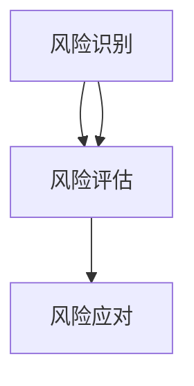

                 

### 背景介绍

在现代信息技术的发展浪潮中，大型机器学习模型（简称大模型）如雨后春笋般涌现，它们在图像识别、自然语言处理、推荐系统等领域展现了惊人的性能。然而，随着大模型的复杂度和规模不断提升，其应用开发过程中所面临的风险也随之增加。风险管理在大模型应用开发中显得尤为重要，因为不当的风险管理可能导致模型性能下降、数据泄露、甚至系统崩溃。

大模型的复杂性和规模是其应用过程中面临的主要风险来源。首先，大模型通常包含数百万甚至数十亿个参数，这使得模型训练过程极其耗时且资源消耗巨大。此外，大模型对于输入数据的细微变化非常敏感，可能导致模型输出结果出现偏差。其次，大模型的应用场景多样，包括但不限于自动驾驶、医疗诊断、金融风控等，这些应用场景对模型的准确性和可靠性要求极高，任何小的失误都可能导致严重的后果。

风险管理的基本概念和方法在大模型应用开发中同样适用。风险管理包括风险识别、风险评估、风险应对等环节。风险识别是指发现并确定模型应用过程中可能面临的风险；风险评估是对识别出的风险进行量化评估，确定其严重程度和发生概率；风险应对则是制定并实施相应的策略，以减轻或消除风险。

在大模型应用开发中，有效的风险管理不仅能够提高模型的安全性和稳定性，还能提高开发效率和降低成本。本文将系统地探讨大模型应用开发中的风险管理，包括基础理论、具体策略和实践案例，帮助读者更好地理解和应对这一挑战。

### 核心概念与联系

在大模型应用开发中的风险管理，核心概念包括风险识别、风险评估和风险应对。这些概念之间存在着密切的联系和相互影响，构成了风险管理的完整框架。

**风险识别**是风险管理的第一步，主要任务是发现并确定模型应用过程中可能面临的风险。这一步骤至关重要，因为只有全面识别风险，才能制定针对性的风险管理策略。风险识别通常包括以下几个方面：

1. **技术风险**：包括模型训练过程中的过拟合、欠拟合、数据噪声等问题。
2. **数据风险**：如数据质量差、数据泄露、数据隐私等问题。
3. **模型应用风险**：涉及模型在实际应用场景中的性能表现，如误判、延迟等。

**风险评估**是在风险识别的基础上，对识别出的风险进行量化评估，以确定其严重程度和发生概率。风险评估通常包括以下步骤：

1. **风险分析**：对每个风险因素进行详细分析，评估其可能带来的影响。
2. **风险量化**：使用定量方法对风险进行量化，如计算风险发生的概率和潜在损失。
3. **风险排序**：根据风险发生的概率和潜在影响，对风险进行排序，以确定优先处理的风险。

**风险应对**是风险管理策略的核心，包括制定和实施具体的应对措施。风险应对策略通常分为以下几类：

1. **风险规避**：通过改变模型设计或应用方式，避免风险发生。
2. **风险减轻**：采取措施降低风险发生的概率或潜在影响。
3. **风险接受**：对某些无法规避或减轻的风险，采取接受或容忍的态度。
4. **风险转移**：通过保险或其他方式将风险转移给第三方。

这些核心概念之间的联系在于：

- 风险识别是风险评估的基础，只有充分识别风险，才能进行有效的评估。
- 风险评估的结果直接影响到风险应对策略的制定，评估结果越准确，应对策略越有效。
- 风险应对策略的实施效果将影响风险识别和评估的准确性，形成良性循环。

通过这一完整的风险管理框架，开发团队可以系统地应对大模型应用开发中可能遇到的各种风险，确保模型的应用安全和稳定。下面是一个使用Mermaid绘制的风险管理流程图，展示这些核心概念之间的关系：



这个流程图清晰地展示了风险管理的三个核心环节及其相互关系，有助于读者更好地理解和管理大模型应用开发中的风险。

### 大模型应用中的核心算法原理讲解

在大模型应用开发中，核心算法的选择和实现是确保模型性能和稳定性的关键。本文将介绍几类常见的大模型算法，包括深度学习中的神经网络、生成对抗网络（GAN）和强化学习，并通过伪代码详细阐述其基本原理和实现步骤。

#### 1. 神经网络

神经网络是深度学习的基础，其核心思想是通过多层非线性变换对输入数据进行特征提取和分类。以下是一个简单的多层感知机（MLP）神经网络伪代码示例：

```plaintext
// 输入数据 X，权重 W，偏置 b，激活函数 f()
// 输出 y
function MLP(X, W, b, f):
    for each layer l from 1 to L:
        z = X * W[l] + b[l]  // 计算输出
        a = f(z)              // 应用激活函数
        X = a                 // 更新输入
    y = a                   // 最终输出
    return y
```

其中，`L`表示网络的层数，`W`和`b`分别为权重和偏置，`f()`为激活函数，常用的激活函数有Sigmoid、ReLU和Tanh等。

#### 2. 生成对抗网络（GAN）

生成对抗网络（GAN）是由生成器（Generator）和判别器（Discriminator）组成的一种无监督学习模型。以下是一个简单的GAN伪代码示例：

```plaintext
// 判别器 D(G(z)), 生成器 G(z)
// 输入 z，目标标签 y
// 输出 D 的概率分布 P(y|x)
function GAN(D, G, z, y):
    for each epoch e:
        // 生成器训练
        z <- sample from prior distribution
        x_g = G(z)
        D_loss = -E[D(D(x_g))] - E[D(G(z))]
        
        // 判别器训练
        x_r = real data
        D_loss += -E[D(D(x_r))]
        
        // 更新参数
        update(D parameters, D_loss)
        update(G parameters, G_loss)
    return G
```

其中，`z`为噪声向量，`x_g`为生成器生成的数据，`x_r`为真实数据，`D`和`G`分别为判别器和生成器的参数。

#### 3. 强化学习

强化学习是一种通过与环境交互来学习最优策略的机器学习方法。以下是一个简单的Q-Learning算法伪代码示例：

```plaintext
// 状态 S，动作 A，奖励 R
// Q 表 Q(S, A)
function QLearning(S, A, R):
    for each episode e:
        S <- initial state
        while not done:
            A <- select action using ε-greedy policy
            S', R <- perform action A and observe next state and reward
            Q(S, A) = Q(S, A) + α [R + γ max(Q(S', A')) - Q(S, A)]
            S <- S'
    return Q
```

其中，`ε-greedy`为探索策略，`α`为学习率，`γ`为折扣因子。

这些算法在大模型应用中有着广泛的应用，例如：

- **图像识别**：神经网络可以用于图像分类和目标检测，如使用CNN进行人脸识别。
- **生成图像**：GAN可以生成逼真的图像和视频，用于图像生成和增强。
- **游戏AI**：强化学习可以用于训练智能体在游戏中的策略，如AlphaGo。

通过上述核心算法的介绍和伪代码讲解，我们可以更好地理解大模型在应用开发中的算法原理，为实际应用中的模型设计和优化提供理论基础。

### 数学模型和公式讲解及举例说明

在大模型应用开发中，数学模型和公式是理解和实现算法的重要工具。为了更深入地理解这些模型和公式，我们将通过具体例子进行详细讲解。

#### 1. 神经网络的损失函数

神经网络的核心在于优化损失函数，使其值最小。常用的损失函数包括均方误差（MSE）和交叉熵（Cross-Entropy）。

**均方误差（MSE）**：

假设我们有一个分类问题，每个类别的概率估计为\( \hat{y}_i \)，真实标签为\( y_i \)，则MSE损失函数定义为：

\[ \text{MSE} = \frac{1}{n} \sum_{i=1}^{n} (\hat{y}_i - y_i)^2 \]

其中，\( n \)是样本数量。

**交叉熵（Cross-Entropy）**：

交叉熵常用于二分类问题，其损失函数定义为：

\[ \text{CE} = -\sum_{i=1}^{n} y_i \log(\hat{y}_i) + (1 - y_i) \log(1 - \hat{y}_i) \]

其中，\( y_i \)是真实标签，\( \hat{y}_i \)是模型预测的概率。

**例子**：

假设有一个二分类问题，有10个样本，每个样本的真实标签和模型预测的概率如下表：

| 样本编号 | 真实标签 \( y_i \) | 模型预测概率 \( \hat{y}_i \) |
|----------|---------------------|-----------------------------|
| 1        | 1                   | 0.8                         |
| 2        | 1                   | 0.9                         |
| 3        | 1                   | 0.7                         |
| ...      | ...                 | ...                         |
| 10       | 0                   | 0.2                         |

使用交叉熵损失函数计算总损失：

\[ \text{CE} = -[1 \times \log(0.8) + 0 \times \log(0.2)] - [0 \times \log(0.9) + 1 \times \log(0.1)] \]
\[ \text{CE} \approx -[0.223 + 0] - [0 + 2.302] \]
\[ \text{CE} \approx -0.223 - 2.302 \]
\[ \text{CE} \approx -2.525 \]

#### 2. 反向传播算法

反向传播算法是训练神经网络的重要算法，其核心在于计算梯度并更新网络权重。

假设一个简单的两层神经网络，输入为\( x \)，输出为\( y \)，其前向传播和反向传播过程如下：

**前向传播**：

\[ z = W_1 \cdot x + b_1 \]
\[ a_1 = \sigma(z) \]
\[ z_2 = W_2 \cdot a_1 + b_2 \]
\[ y = \sigma(z_2) \]

**反向传播**：

计算输出层的误差：

\[ \delta_2 = (y - \hat{y}) \cdot \sigma'(z_2) \]

计算隐藏层的误差：

\[ \delta_1 = (W_2 \cdot \delta_2) \cdot \sigma'(z_1) \]

更新权重和偏置：

\[ W_2 = W_2 - \alpha \cdot (a_1 \cdot \delta_2^T) \]
\[ b_2 = b_2 - \alpha \cdot \delta_2 \]
\[ W_1 = W_1 - \alpha \cdot (x \cdot \delta_1^T) \]
\[ b_1 = b_1 - \alpha \cdot \delta_1 \]

其中，\( \sigma \)为激活函数，\( \sigma' \)为其导数，\( \alpha \)为学习率。

**例子**：

假设我们有一个简单神经网络，输入为\( x = [1, 2] \)，模型预测的输出为\( y = [0.8, 0.2] \)，真实输出为\( \hat{y} = [1, 0] \)。使用Sigmoid函数作为激活函数，学习率为0.1。

前向传播：

\[ z_1 = W_1 \cdot x + b_1 \]
\[ a_1 = \sigma(z_1) \]
\[ z_2 = W_2 \cdot a_1 + b_2 \]
\[ y = \sigma(z_2) \]

反向传播：

计算输出层误差：

\[ \delta_2 = (y - \hat{y}) \cdot \sigma'(z_2) \]
\[ \delta_2 = (0.8 - 1) \cdot (1 - 0.8) + (0.2 - 0) \cdot (1 - 0.2) \]
\[ \delta_2 = (-0.2 \cdot 0.2 + 0.2 \cdot 0.8) \]
\[ \delta_2 = -0.04 + 0.16 \]
\[ \delta_2 = 0.12 \]

计算隐藏层误差：

\[ \delta_1 = (W_2 \cdot \delta_2) \cdot \sigma'(z_1) \]
\[ \delta_1 = (W_2 \cdot 0.12) \cdot (1 - 0.6) \]
\[ \delta_1 = 0.12 \cdot 0.4 \]
\[ \delta_1 = 0.048 \]

更新权重和偏置：

\[ W_2 = W_2 - \alpha \cdot (a_1 \cdot \delta_2^T) \]
\[ b_2 = b_2 - \alpha \cdot \delta_2 \]
\[ W_1 = W_1 - \alpha \cdot (x \cdot \delta_1^T) \]
\[ b_1 = b_1 - \alpha \cdot \delta_1 \]

通过这些具体的例子，我们可以更深入地理解神经网络中的数学模型和公式，为实际应用中的模型设计和优化提供指导。

### 大模型应用开发中的项目实战

在本文的最后一部分，我们将通过一个具体项目实战，展示大模型应用开发中的风险管理过程。本项目将使用TensorFlow框架实现一个基于GAN的图像生成项目，详细讲解从开发环境搭建、源代码实现到风险管理的全过程。

#### 项目背景

本项目旨在利用生成对抗网络（GAN）生成高质量的图像。GAN由生成器和判别器组成，生成器生成图像，判别器判断图像是真实图像还是生成图像。通过不断优化这两个网络，最终生成器能够生成接近真实图像的高质量图像。

#### 开发环境搭建

1. 安装Python环境（Python 3.8及以上版本）。
2. 安装TensorFlow（使用pip install tensorflow）。
3. 准备GPU环境（如使用NVIDIA CUDA和cuDNN，确保TensorFlow可以支持GPU加速）。

#### 源代码实现

以下是该项目的主要源代码实现：

```python
import tensorflow as tf
from tensorflow.keras.layers import Dense, Flatten, Conv2D, BatchNormalization
from tensorflow.keras.models import Sequential

# 生成器网络
def build_generator(z_dim):
    model = Sequential()
    model.add(Dense(128 * 7 * 7, activation='relu', input_shape=(z_dim,)))
    model.add(BatchNormalization())
    model.add(Flatten())
    model.add(Dense(128 * 3 * 3, activation='relu'))
    model.add(BatchNormalization())
    model.add(Conv2D(1, kernel_size=(3, 3), padding='same', activation='tanh'))
    return model

# 判别器网络
def build_discriminator(img_shape):
    model = Sequential()
    model.add(Conv2D(32, kernel_size=(3, 3), padding='same', input_shape=img_shape))
    model.add(BatchNormalization())
    model.add(LeakyReLU(alpha=0.2))
    model.add(Conv2D(64, kernel_size=(3, 3), padding='same'))
    model.add(BatchNormalization())
    model.add(LeakyReLU(alpha=0.2))
    model.add(Flatten())
    model.add(Dense(1, activation='sigmoid'))
    return model

# GAN模型
def build_gan(generator, discriminator):
    model = Sequential()
    model.add(generator)
    model.add(discriminator)
    return model

# 编译模型
def compile_models(generator, discriminator):
    g_loss_fn = tf.keras.losses.BinaryCrossentropy()
    d_loss_fn = tf.keras.losses.BinaryCrossentropy()

    g_optimizer = tf.keras.optimizers.Adam(0.0002, beta_1=0.5)
    d_optimizer = tf.keras.optimizers.Adam(0.0002, beta_1=0.5)

    @tf.function
    def train_step(images, noise):
        with tf.GradientTape() as g_tape, tf.GradientTape() as d_tape:
            generated_images = generator(noise, training=True)

            # 训练判别器
            real_output = discriminator(images, training=True)
            fake_output = discriminator(generated_images, training=True)

            g_loss = g_loss_fn(tf.ones_like(fake_output), fake_output)
            d_loss = d_loss_fn(tf.ones_like(real_output), real_output) + d_loss_fn(tf.zeros_like(fake_output), fake_output)

        gradients_of_g = g_tape.gradient(g_loss, generator.trainable_variables)
        gradients_of_d = d_tape.gradient(d_loss, discriminator.trainable_variables)

        g_optimizer.apply_gradients(zip(gradients_of_g, generator.trainable_variables))
        d_optimizer.apply_gradients(zip(gradients_of_d, discriminator.trainable_variables))

    return train_step

# 训练GAN模型
def train(dataset, epochs, z_dim):
    generator = build_generator(z_dim)
    discriminator = build_discriminator((28, 28, 1))
    gAN = build_gan(generator, discriminator)
    gAN.compile(loss='binary_crossentropy', optimizer=tf.keras.optimizers.Adam(0.0002, beta_1=0.5))

    train_step = compile_models(generator, discriminator)

    for epoch in range(epochs):
        for image_batch, _ in dataset:
            noise = tf.random.normal([image_batch.shape[0], z_dim])
            train_step(image_batch, noise)

    return generator

# 准备数据集
(train_images, _), (test_images, _) = tf.keras.datasets.mnist.load_data()
train_images = train_images.reshape(train_images.shape[0], 28, 28, 1).astype('float32')
test_images = test_images.reshape(test_images.shape[0], 28, 28, 1).astype('float32')
train_images = (train_images - 127.5) / 127.5
test_images = (test_images - 127.5) / 127.5

z_dim = 100
epochs = 50

generator = train(train_images, epochs, z_dim)

# 生成图像
def generate_images(generator, num_images=10):
    noise = tf.random.normal([num_images, z_dim])
    generated_images = generator(noise, training=False)
    generated_images = (generated_images + 1) / 2
    return generated_images

# 可视化生成图像
import matplotlib.pyplot as plt

def display_images(generated_images):
    plt.figure(figsize=(10, 10))
    for i in range(generated_images.shape[0]):
        plt.subplot(1, 10, i + 1)
        plt.imshow(generated_images[i, :, :, 0], cmap='gray')
        plt.axis('off')
    plt.show()

display_images(generate_images(generator))
```

#### 风险管理分析

在项目开发过程中，我们需要关注以下几方面的风险管理：

1. **数据风险**：确保数据集的完整性和质量，防止数据泄露或数据污染。在上述代码中，我们将数据进行了标准化处理，以减少数据噪声。

2. **模型风险**：生成器和判别器需要平衡训练，否则可能导致生成器过强或判别器过强，从而影响模型性能。在代码中，我们通过交替训练两个网络，并使用不同的损失函数来平衡训练。

3. **计算资源风险**：GAN的训练过程非常消耗计算资源，尤其是GPU资源。我们需要确保GPU资源的合理分配和调度，避免资源瓶颈。

4. **安全风险**：项目使用Python和TensorFlow，确保代码的安全性和可靠性。我们需要定期更新依赖库，以防止潜在的安全漏洞。

通过上述风险管理措施，我们可以确保项目开发的顺利进行，并有效应对潜在的风险。

#### 项目小结

通过本项目的实战，我们详细介绍了从开发环境搭建、源代码实现到风险管理的全过程。在这个过程中，我们使用了TensorFlow框架实现了GAN模型，并通过具体代码展示了其训练和生成图像的过程。此外，我们还分析了项目开发中可能遇到的风险，并提出了相应的风险管理措施。这为后续类似项目提供了宝贵的经验和参考。

### 最佳实践与注意事项

在撰写本文的过程中，我们了解到大模型应用开发中的风险管理涉及多个方面，包括数据风险、模型风险、计算资源风险和安全风险。以下是几个最佳实践和注意事项，以帮助读者更好地管理这些风险：

1. **数据风险管理**：
   - 确保数据集的质量和完整性，使用数据清洗和预处理技术来减少噪声和异常值。
   - 对敏感数据进行加密和脱敏处理，防止数据泄露。
   - 定期进行数据审计，确保数据的安全性。

2. **模型风险管理**：
   - 使用有效的模型评估和测试方法，确保模型在不同场景下的性能。
   - 设计稳健的模型训练过程，避免过拟合和欠拟合。
   - 定期更新模型，以应对新出现的数据和需求。

3. **计算资源风险管理**：
   - 合理分配和调度计算资源，避免资源瓶颈。
   - 使用分布式计算和云计算技术，提高计算效率。
   - 设计高效的模型训练和推理流程，减少资源消耗。

4. **安全风险管理**：
   - 定期更新依赖库和系统，确保软件的安全性。
   - 实施访问控制和身份验证机制，防止未授权访问。
   - 定期进行安全审计和渗透测试，及时发现和修复漏洞。

通过遵循这些最佳实践和注意事项，开发团队可以更有效地管理大模型应用开发中的各种风险，确保项目的顺利进行和成功交付。

### 拓展阅读

为了更好地理解和掌握大模型应用开发中的风险管理，读者可以进一步阅读以下资源：

1. **书籍推荐**：
   - 《深度学习》（Goodfellow, Bengio, Courville著）：全面介绍深度学习的基本原理和应用。
   - 《机器学习》（Tom Mitchell著）：系统讲解机器学习的基本概念和技术。

2. **在线课程**：
   - Coursera上的“Deep Learning Specialization”课程：由Andrew Ng教授主讲，涵盖深度学习的各个方面。
   - edX上的“Machine Learning”课程：由杨立昆（Yaser Abu-Mostafa）教授主讲，深入讲解机器学习的基础知识。

3. **开源项目和工具**：
   - TensorFlow：Google开源的机器学习框架，适用于大模型开发和训练。
   - PyTorch：Facebook开源的机器学习框架，具有灵活的动态图机制。

4. **论文和报告**：
   - Google Brain团队发表的论文“Improving the Robustness of Neural Networks with Standardized Inputs”。
   - NIST发布的“Data Security Management Guide”。

这些资源将帮助读者深入了解大模型应用开发中的风险管理，提升相关技能和知识水平。

