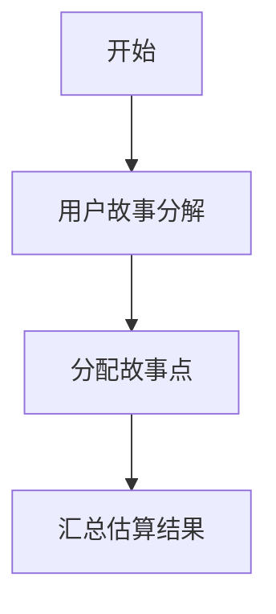
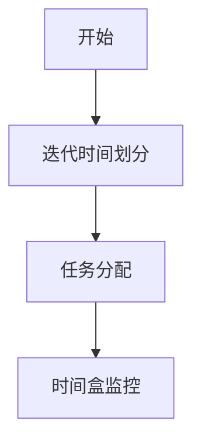
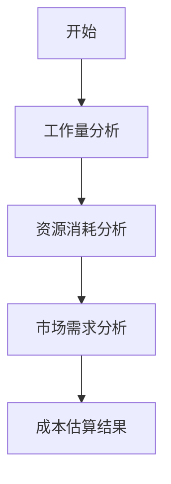
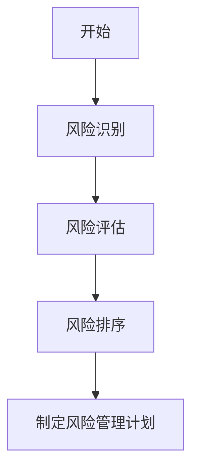

                 


### 文章标题：大模型应用的敏捷估算与规划方法

#### 关键词：
- 大模型
- 敏捷估算
- 敏捷规划
- 数据驱动
- 模型构建与优化
- 项目风险管理

#### 摘要：
本文将探讨大模型应用中的敏捷估算与规划方法。首先，我们将介绍大模型应用背景和敏捷估算的基本原理，然后分析大模型与敏捷估算的关系，最后通过具体的案例和步骤详细讲解敏捷估算与规划的实施方法。

## 引言

大模型作为一种先进的人工智能技术，在各个领域展现出了巨大的潜力。然而，大模型的应用不仅需要强大的计算能力和丰富的数据资源，还需要高效的估算与规划方法来确保项目的顺利进行。敏捷估算与规划作为一种灵活、迭代的方法，能够帮助我们更好地应对大模型应用中的不确定性，提高项目的成功率。

本文将围绕以下主题展开：
1. 大模型与敏捷估算概述
2. 敏捷估算的基本原理
3. 大模型应用场景分析
4. 估算工具与技术
5. 数据驱动估算方法
6. 模型构建与优化策略
7. 敏捷规划流程
8. 项目风险与成本管理
9. 案例分析

通过本文的阅读，读者将能够深入了解大模型应用中的敏捷估算与规划方法，掌握相关技能，为实际项目提供指导。

## 大模型与敏捷估算概述

### 大模型背景

大模型（Large Models）是指那些具有大量参数和复杂结构的模型，如深度学习中的神经网络、Transformer等。这些模型通常需要大量的数据进行训练，并在多个任务上表现出良好的性能。大模型的应用涵盖了自然语言处理、计算机视觉、语音识别等多个领域，为解决复杂问题提供了新的思路和方法。

### 敏捷估算背景

敏捷估算（Agile Estimation）是一种基于迭代和反馈的估算方法，其核心思想是通过不断调整和优化来应对项目中的不确定性。敏捷估算通常分为两个阶段：早期估算和迭代估算。早期估算是基于项目需求和风险，提供一个大致的时间表和预算；迭代估算是通过不断的迭代和反馈，逐步细化估算，提高估算的准确性。

### 大模型与敏捷估算的关系

大模型的应用过程中存在许多不确定性，如数据质量、模型性能、计算资源等。这些不确定性使得传统的估算方法难以准确预测项目的时间、成本和风险。而敏捷估算通过灵活的迭代和反馈机制，能够更好地适应这些不确定性，提高估算的准确性和可靠性。

具体来说，大模型与敏捷估算的关系体现在以下几个方面：
1. **需求变更**：大模型应用过程中，需求可能会随着项目进展和数据反馈而发生变化。敏捷估算能够快速响应这些变化，调整估算计划，确保项目的持续交付。
2. **模型优化**：大模型在训练过程中需要不断调整参数和结构，以优化性能。敏捷估算可以帮助我们评估这些调整对项目进度和成本的影响，确保项目的顺利进行。
3. **资源管理**：大模型训练和推理需要大量的计算资源。敏捷估算可以帮助我们合理分配资源，确保项目在预算范围内完成。

综上所述，大模型与敏捷估算密切相关，通过结合两者，我们能够更好地应对大模型应用中的不确定性，提高项目的成功率。

## 敏捷估算的基本原理

### 敏捷估算的原则

敏捷估算遵循以下原则：
1. **迭代与反馈**：敏捷估算通过迭代和反馈不断调整和优化估算结果，提高估算的准确性。
2. **团队合作**：敏捷估算需要团队成员共同参与，通过集体的智慧和经验，提高估算的质量。
3. **风险管理**：敏捷估算注重风险识别和评估，通过提前预测和应对风险，降低项目的不确定性。
4. **适应性**：敏捷估算能够根据项目需求和环境的变化，灵活调整估算方法和计划。

### 敏捷估算的关键因素

敏捷估算的关键因素包括：
1. **需求**：准确的需求分析是估算的基础，需求的变化会影响估算结果。
2. **资源**：资源包括人力、技术和资金等，资源的合理配置是确保项目顺利进行的保障。
3. **风险**：识别和评估风险，提前制定应对措施，降低项目风险。
4. **时间**：估算项目所需的时间，合理安排项目进度，确保项目的按时交付。

### 敏捷估算的流程

敏捷估算的流程主要包括以下步骤：
1. **需求分析**：对项目需求进行详细分析，明确项目目标和需求。
2. **估算准备**：收集相关数据和信息，包括历史数据、市场调研等，为估算提供依据。
3. **估算会议**：团队成员共同参与，通过讨论和协商，初步估算项目的时间、成本和风险。
4. **迭代估算**：根据项目进展和反馈，不断调整和优化估算结果，提高估算的准确性。
5. **估算文档**：将估算结果和过程记录下来，形成估算文档，为项目管理和决策提供支持。

通过以上流程，敏捷估算能够更好地应对项目中的不确定性，提高项目的成功率和效率。

### 大模型应用场景分析

#### 大模型在不同领域的应用

大模型的应用领域非常广泛，主要包括以下几个领域：

1. **自然语言处理（NLP）**：大模型在自然语言处理领域表现出了卓越的能力，如文本生成、机器翻译、情感分析等。例如，GPT-3模型在文本生成和机器翻译任务上取得了显著的成果。

2. **计算机视觉（CV）**：大模型在计算机视觉领域有着广泛的应用，如图像分类、目标检测、图像生成等。例如，GAN模型在图像生成任务上取得了突破性进展。

3. **语音识别（ASR）**：大模型在语音识别领域也有着显著的应用，如语音转文字、语音合成等。例如，WaveNet模型在语音合成任务上表现出色。

4. **推荐系统**：大模型在推荐系统领域也有着重要的应用，如用户行为预测、商品推荐等。例如，DSSM模型在用户行为预测和商品推荐任务上取得了良好的效果。

#### 应用案例

以下是一些大模型应用的具体案例：

1. **医疗领域**：大模型在医疗领域有着广泛的应用，如疾病预测、药物研发等。例如，通过深度学习模型对医疗数据进行分析，可以实现对疾病的早期预测和诊断，提高医疗效果。

2. **金融领域**：大模型在金融领域有着重要的应用，如风险控制、信用评估等。例如，通过深度学习模型对金融数据进行分析，可以实现对风险的有效控制和信用评估。

3. **自动驾驶**：大模型在自动驾驶领域有着广泛的应用，如环境感知、路径规划等。例如，通过深度学习模型对环境数据进行分析，可以实现自动驾驶车辆的安全行驶。

#### 挑战与解决方案

在大模型应用过程中，面临着许多挑战，如数据质量、计算资源、模型优化等。以下是一些常见的挑战和解决方案：

1. **数据质量**：大模型对数据质量有很高的要求。解决方案包括数据清洗、数据增强等，以提高数据的质量和多样性。

2. **计算资源**：大模型训练和推理需要大量的计算资源。解决方案包括分布式计算、GPU加速等，以提高计算效率。

3. **模型优化**：大模型在训练过程中需要不断调整参数和结构，以优化性能。解决方案包括模型压缩、迁移学习等，以提高模型的效果和效率。

通过分析大模型在不同领域的应用案例和面临的挑战，我们可以更好地理解大模型应用中的敏捷估算与规划方法，为实际项目提供指导。

## 估算工具与技术

在敏捷估算过程中，选择合适的估算工具和技术对于提高估算的准确性和效率至关重要。以下介绍几种常用的估算工具和技术。

### 常用估算工具

1. **故事点（Story Points）**：故事点是一种用于估算任务复杂度和工作量的工具，通常用于敏捷开发中的用户故事估算。故事点可以根据团队的经验和共识来分配，如1、2、3、5、8、13等。

2. **时间盒（Timeboxing）**：时间盒是一种将时间固定分配给特定任务的估算方法，通常用于敏捷项目中的迭代规划。时间盒可以帮助团队在固定的时间内集中精力完成特定的任务。

3. **成本估算（Cost Estimation）**：成本估算是根据任务的工作量、资源消耗和市场需求等因素，对项目的总成本进行估算。

4. **风险矩阵（Risk Matrix）**：风险矩阵是一种用于评估和优先级排序风险的工具，通常用于敏捷估算中的风险管理。

### 技术原理与应用场景

1. **故事点估算**：故事点估算适用于用户故事和功能模块的估算。通过将任务拆分为用户故事，并分配故事点，团队可以更好地理解任务的复杂度和工作量。



2. **时间盒估算**：时间盒估算适用于迭代规划和任务分配。通过将迭代时间分为多个时间盒，团队可以更好地安排任务和工作量。



3. **成本估算**：成本估算适用于项目的预算管理和资源分配。通过分析任务的工作量、资源消耗和市场需求，团队可以更好地制定项目的成本预算。



4. **风险矩阵**：风险矩阵适用于项目风险管理。通过评估和优先级排序风险，团队可以更好地制定风险管理计划。



通过以上工具和技术，团队可以更好地进行敏捷估算，提高项目的规划和执行效率。

## 数据驱动估算方法

数据驱动估算是一种基于历史数据和实际经验进行估算的方法，其核心思想是通过数据分析来预测项目的时间、成本和风险。以下详细介绍数据驱动估算的步骤、方法和关键要素。

### 数据收集与处理

数据驱动估算的第一步是数据收集。数据来源包括项目历史数据、行业数据、市场调研数据等。数据收集完成后，需要对其进行处理，以确保数据的准确性和完整性。数据处理步骤包括数据清洗、数据整合、数据标准化等。

1. **数据清洗**：数据清洗是数据处理的重要步骤，目的是去除数据中的错误、异常和重复值，提高数据质量。
2. **数据整合**：数据整合是将来自不同来源的数据进行整合，形成统一的数据集，以便进行进一步分析。
3. **数据标准化**：数据标准化是将不同数据源中的数据进行统一格式和单位的转换，以便进行综合分析。

### 数据分析

数据分析是数据驱动估算的核心步骤。通过分析历史数据，我们可以发现项目时间、成本和风险之间的规律和关联。以下是一些常用的数据分析方法：

1. **回归分析**：回归分析是一种常用的数据分析方法，通过建立数学模型来描述变量之间的关系。例如，可以通过回归分析来预测项目成本与工作量之间的关系。
2. **时间序列分析**：时间序列分析是一种用于分析时间序列数据的分析方法，通过分析时间序列数据的变化趋势和周期性，预测未来的数据。
3. **聚类分析**：聚类分析是一种无监督学习方法，用于将数据集划分为不同的类别。通过聚类分析，我们可以将项目按照相似性进行分组，以便进行进一步分析。

### 数据驱动估算方法

基于数据分析的结果，我们可以建立数据驱动估算模型，用于预测项目的时间、成本和风险。以下介绍几种常用的数据驱动估算方法：

1. **贝叶斯网络**：贝叶斯网络是一种基于概率论的图模型，用于表示变量之间的依赖关系。通过贝叶斯网络，我们可以建立项目时间、成本和风险之间的概率模型，用于预测项目的估算结果。
2. **回归模型**：回归模型是一种基于线性回归或非线性回归的方法，通过建立数学模型来预测变量之间的关系。例如，可以通过回归模型来预测项目成本与工作量之间的关系。
3. **机器学习模型**：机器学习模型是一种通过训练模型来预测变量之间的关系的方法。通过训练历史数据，我们可以建立预测模型，用于预测项目的时间、成本和风险。

### 实践案例

以下是一个数据驱动估算的实践案例：

假设我们有一个历史项目数据集，包括项目时间、成本和工作量等数据。我们可以通过以下步骤进行数据驱动估算：

1. **数据收集与处理**：收集历史项目数据，并进行数据清洗、整合和标准化处理。
2. **数据分析**：使用回归分析和时间序列分析方法，分析项目时间、成本和工作量之间的关系。
3. **模型建立**：基于数据分析结果，建立回归模型或机器学习模型，用于预测项目时间、成本和风险。
4. **模型验证**：使用新的项目数据对模型进行验证，评估模型的预测准确性。
5. **估算预测**：使用建立的模型，对新的项目进行时间、成本和风险的估算。

通过以上步骤，我们可以实现数据驱动的项目估算，提高估算的准确性和可靠性。

## 模型构建与优化策略

在大模型应用中，模型构建与优化是一个关键环节，直接影响到项目的效率和效果。以下介绍模型构建的基本流程、优化策略以及模型评估与迭代方法。

### 模型构建流程

1. **需求分析**：明确项目需求和目标，确定需要解决的问题和所需的模型类型。
2. **数据准备**：收集和处理相关数据，确保数据的质量和多样性，为模型训练提供高质量的数据集。
3. **模型选择**：根据需求和数据特点选择合适的模型架构，如神经网络、决策树、支持向量机等。
4. **模型训练**：使用训练数据集对模型进行训练，调整模型参数，优化模型性能。
5. **模型验证**：使用验证数据集对模型进行验证，评估模型在未知数据上的性能，调整模型参数以提升性能。
6. **模型部署**：将训练好的模型部署到生产环境中，进行实际任务处理。

### 优化策略

1. **超参数调整**：超参数是影响模型性能的关键因素，如学习率、批次大小、正则化参数等。通过调整超参数，可以优化模型性能。
2. **数据增强**：数据增强是通过变换、扩充数据集来提高模型泛化能力的方法，如图像翻转、旋转、裁剪等。
3. **模型压缩**：模型压缩是通过减少模型参数数量来降低计算量和存储需求的方法，如剪枝、量化等。
4. **迁移学习**：迁移学习是将已训练好的模型应用于新任务的方法，通过迁移学习，可以快速提升新任务的性能。

### 模型评估与迭代

1. **评估指标**：选择合适的评估指标，如准确率、召回率、F1值、损失函数等，用于评估模型性能。
2. **交叉验证**：交叉验证是一种用于评估模型泛化能力的方法，通过将数据集划分为多个子集，反复训练和验证模型，以消除过拟合。
3. **模型迭代**：根据评估结果，不断调整模型参数和架构，进行多次迭代，逐步提升模型性能。
4. **版本控制**：使用版本控制工具，记录每次迭代的模型参数和结果，以便后续复现和比较。

### 实践案例

以下是一个模型构建与优化的实践案例：

假设我们有一个图像分类任务，目标是将图像分类为猫或狗。我们可以按照以下步骤进行：

1. **需求分析**：明确任务目标，选择卷积神经网络（CNN）作为模型架构。
2. **数据准备**：收集猫和狗的图像数据，并进行预处理，如归一化、裁剪等。
3. **模型训练**：使用训练数据集训练CNN模型，调整超参数，优化模型性能。
4. **模型验证**：使用验证数据集验证模型性能，调整超参数，以提升性能。
5. **模型部署**：将训练好的模型部署到生产环境中，进行实际图像分类任务。
6. **模型迭代**：根据实际应用效果，不断调整模型参数和架构，进行多次迭代，逐步提升模型性能。

通过以上步骤，我们可以构建和优化大模型，提高项目的效率和效果。

## 敏捷规划流程

敏捷规划是一种灵活、迭代的规划方法，旨在应对项目中的不确定性，提高项目的成功率和效率。以下介绍敏捷规划的基本原理、流程和关键步骤。

### 敏捷规划的基本原理

敏捷规划遵循以下原则：
1. **迭代与反馈**：敏捷规划通过迭代和反馈不断调整和优化规划结果，确保项目能够及时响应变化。
2. **团队合作**：敏捷规划强调团队成员的参与和协作，通过集体智慧和经验，提高规划的准确性和可行性。
3. **需求优先**：敏捷规划以需求为导向，优先处理高优先级的需求，确保项目能够按时交付关键功能。
4. **适应性**：敏捷规划能够根据项目进展和反馈，灵活调整规划，确保项目能够适应环境变化。

### 敏捷规划流程

敏捷规划流程主要包括以下步骤：

1. **需求分析**：对项目需求进行详细分析，明确项目的目标和需求，制定需求文档。
2. **迭代计划**：根据项目需求和风险，制定迭代计划，包括迭代周期、迭代目标和任务分配。
3. **迭代执行**：按照迭代计划执行任务，确保项目进度和质量。
4. **迭代评估**：在迭代结束后，对迭代结果进行评估，包括任务完成情况、项目进度和风险状况。
5. **迭代回顾**：团队成员共同回顾迭代过程，总结经验教训，优化迭代方法，提高项目效率。

### 关键步骤

1. **迭代计划**：迭代计划是敏捷规划的核心，通过制定详细的迭代计划，确保项目能够按时交付关键功能。迭代计划包括以下内容：
   - **迭代周期**：确定每个迭代的时间范围，通常为2-4周。
   - **迭代目标**：明确每个迭代的目标和关键任务，确保迭代能够实现预期目标。
   - **任务分配**：根据团队成员的技能和经验，合理分配任务，确保每个任务都有明确的负责人。

2. **迭代执行**：在迭代执行阶段，团队需要严格按照迭代计划执行任务，确保项目进度和质量。关键步骤包括：
   - **每日站会**：团队每天举行站会，讨论项目进度和遇到的问题，确保任务能够按计划推进。
   - **任务追踪**：使用任务管理工具，实时追踪任务进度，确保任务按时完成。
   - **代码审查**：定期进行代码审查，确保代码质量和项目质量。

3. **迭代评估**：在迭代结束后，对迭代结果进行评估，包括任务完成情况、项目进度和风险状况。关键步骤包括：
   - **任务完成情况**：评估任务完成情况，包括任务的完成时间和质量。
   - **项目进度**：评估项目进度，包括已完成任务、进行中任务和待完成任务。
   - **风险状况**：评估项目中的风险状况，包括已识别风险和潜在风险。

4. **迭代回顾**：在迭代回顾阶段，团队成员共同回顾迭代过程，总结经验教训，优化迭代方法，提高项目效率。关键步骤包括：
   - **经验教训**：总结迭代过程中的成功经验和失败教训，为下一次迭代提供改进方向。
   - **改进措施**：制定改进措施，包括流程优化、工具改进等，以提高项目效率。
   - **行动计划**：制定下一次迭代的行动计划，确保改进措施能够得到有效执行。

通过以上步骤，团队可以确保敏捷规划的顺利实施，提高项目的成功率和效率。

### 项目风险与成本管理

在敏捷规划过程中，项目风险和成本管理是确保项目顺利进行的关键环节。以下介绍项目风险识别与评估、成本控制方法和风险与成本管理的实践经验。

#### 项目风险识别与评估

1. **风险识别**：风险识别是项目风险管理的基础，旨在识别项目中可能出现的各种风险。风险识别的方法包括：
   - **历史数据**：分析类似项目的历史数据，识别出常见风险。
   - **专家评估**：邀请项目相关领域的专家进行风险评估，获取专业意见和建议。
   - **头脑风暴**：组织团队成员进行头脑风暴，收集和讨论可能的风险。

2. **风险评估**：风险评估是对识别出的风险进行优先级排序和影响分析。常用的风险评估方法包括：
   - **风险矩阵**：使用风险矩阵对风险进行优先级排序，评估风险的概率和影响。
   - **定量分析**：通过数学模型或统计方法，对风险进行定量分析，预测风险的可能性和影响。

#### 成本控制方法

1. **预算编制**：在项目初期，根据项目需求和风险评估，编制详细的预算，明确项目的成本分配和支出计划。

2. **成本监控**：在项目执行过程中，定期监控项目的实际成本支出，与预算进行对比，及时发现和解决成本偏差。

3. **成本调整**：根据成本监控结果，对项目预算进行调整，确保项目能够在预算范围内完成。

#### 风险与成本管理的实践经验

1. **风险与成本管理流程**：
   - **风险识别与评估**：在项目初期进行风险识别和评估，制定风险管理计划。
   - **成本控制与调整**：在项目执行过程中，定期进行成本监控和调整，确保项目在预算范围内完成。
   - **风险应对措施**：制定风险应对措施，包括风险规避、风险转移、风险接受等，降低项目风险。

2. **实践案例**：

   假设我们正在开发一个大型人工智能项目，涉及深度学习模型训练、图像识别和自然语言处理等多个方面。在项目初期，我们识别出以下风险：
   - **数据质量风险**：数据质量不高可能导致模型性能不佳。
   - **计算资源风险**：计算资源不足可能导致项目延期。
   - **模型优化风险**：模型优化不当可能导致项目无法达到预期效果。

   针对以上风险，我们采取了以下措施：
   - **数据质量风险**：加强数据清洗和预处理工作，确保数据质量。
   - **计算资源风险**：提前规划计算资源需求，与云计算服务提供商合作，确保计算资源充足。
   - **模型优化风险**：采用多种优化方法，如迁移学习、模型压缩等，提高模型性能。

   在项目执行过程中，我们定期进行成本监控和风险评估，根据实际情况调整预算和风险应对措施。通过以上措施，我们成功控制了项目风险和成本，确保项目顺利推进。

### 案例分析

为了更好地理解大模型应用中的敏捷估算与规划方法，我们以下通过一个具体案例进行详细分析。

#### 案例背景

某科技公司计划开发一款基于深度学习的人工智能语音助手，用于实现语音识别、自然语言处理和智能问答等功能。该项目涉及多个技术领域，包括语音信号处理、神经网络模型训练和用户交互等。项目时间紧、任务重，需要高效地估算和规划，以确保项目按时交付。

#### 估算过程

1. **需求分析**：团队首先对项目需求进行详细分析，明确项目的目标和功能模块。需求分析结果包括：
   - **语音识别模块**：实现中文语音识别功能，准确率达到90%以上。
   - **自然语言处理模块**：实现智能问答功能，回答准确率达到80%以上。
   - **用户交互模块**：实现用户语音输入和文本输出功能。

2. **估算会议**：团队成员共同参与估算会议，根据需求分析结果和项目经验，初步估算项目的时间、成本和风险。估算结果如下：
   - **时间估算**：预计项目开发周期为6个月，分为两个主要迭代。
   - **成本估算**：预计项目总成本为100万元，包括人力成本、硬件成本和软件成本。
   - **风险估算**：识别出以下主要风险：
     - **数据质量风险**：数据集质量不高可能导致模型性能不佳。
     - **计算资源风险**：计算资源不足可能导致项目延期。
     - **技术风险**：技术难题可能导致项目无法按计划推进。

3. **迭代估算**：在项目执行过程中，团队根据实际进展和反馈，不断调整估算结果，提高估算的准确性。具体步骤如下：
   - **迭代1**：完成语音识别模块的开发，实现中文语音识别功能，准确率达到90%以上。
   - **迭代2**：完成自然语言处理模块和用户交互模块的开发，实现智能问答功能和用户语音输入输出功能。

#### 规划过程

1. **迭代计划**：根据估算结果，制定迭代计划，包括迭代周期、迭代目标和任务分配。具体计划如下：
   - **迭代1**：开发语音识别模块，完成模型训练和测试，确保准确率达到90%以上。
   - **迭代2**：开发自然语言处理模块和用户交互模块，实现智能问答功能和用户语音输入输出功能。

2. **任务分配**：根据团队成员的技能和经验，合理分配任务，确保每个任务都有明确的负责人。具体任务分配如下：
   - **语音识别模块**：由两位拥有丰富经验的深度学习工程师负责开发。
   - **自然语言处理模块**：由一位自然语言处理工程师负责开发。
   - **用户交互模块**：由两位前端工程师和一位后端工程师共同负责开发。

3. **迭代执行**：按照迭代计划执行任务，确保项目进度和质量。具体执行步骤如下：
   - **每日站会**：团队每天举行站会，讨论项目进度和遇到的问题，确保任务能够按计划推进。
   - **代码审查**：定期进行代码审查，确保代码质量和项目质量。
   - **任务追踪**：使用任务管理工具，实时追踪任务进度，确保任务按时完成。

#### 项目小结

通过本案例的分析，我们可以得出以下结论：

1. **敏捷估算与规划方法的有效性**：敏捷估算与规划方法能够有效地应对项目中的不确定性，提高项目的成功率和效率。通过迭代和反馈机制，团队能够及时调整估算和规划，确保项目按时交付。

2. **风险管理的重要性**：在项目开发过程中，识别和应对风险是确保项目顺利进行的关键。通过提前识别和评估风险，制定应对措施，团队能够降低项目风险，提高项目成功率。

3. **团队合作的重要性**：敏捷估算与规划需要团队成员的紧密合作和共同参与。通过团队合作，团队能够更好地理解项目需求，提高估算和规划的准确性，确保项目的顺利推进。

综上所述，敏捷估算与规划方法在大型人工智能项目中具有重要的作用，能够有效提高项目的成功率。通过本案例的分析，我们深入了解了敏捷估算与规划的具体实施方法和关键步骤，为实际项目提供了有益的参考。

### 最佳实践 Tips、小结、注意事项、拓展阅读

#### 最佳实践 Tips

1. **早期风险识别**：在项目初期，尽早识别潜在风险，制定相应的应对措施，降低项目风险。
2. **数据质量保证**：确保数据的质量和多样性，为模型训练提供高质量的数据集，提高模型性能。
3. **资源合理分配**：合理分配人力资源、计算资源和资金等，确保项目能够按时交付。
4. **持续学习与迭代**：不断学习新的技术和方法，优化模型和规划流程，提高项目效率。

#### 小结

本文详细介绍了大模型应用中的敏捷估算与规划方法，包括理论基础、估算工具与技术、数据驱动估算、模型构建与优化、敏捷规划流程、项目风险与成本管理以及案例分析。通过本文的阅读，读者可以深入了解大模型应用中的敏捷估算与规划方法，掌握相关技能，为实际项目提供指导。

#### 注意事项

1. **估算准确度**：敏捷估算是一种基于经验的方法，估算结果可能存在一定误差。在实际项目中，需要根据实际情况进行适当调整。
2. **风险识别与评估**：项目风险可能随时间变化，需要定期进行风险识别与评估，确保风险管理的有效性。
3. **团队协作**：敏捷估算与规划需要团队成员的紧密合作和共同参与，确保项目顺利推进。

#### 拓展阅读

1. **《敏捷估算：高效的项目估算与规划技巧》**：这是一本关于敏捷估算的入门书籍，详细介绍了敏捷估算的基本原理、方法和工具。
2. **《深度学习：周志华》**：这是一本关于深度学习的经典教材，涵盖了深度学习的基本原理、算法和应用。
3. **《项目风险管理：快速决策的艺术》**：这是一本关于项目风险管理的书籍，介绍了项目风险识别、评估和应对策略。

通过拓展阅读，读者可以进一步了解敏捷估算与规划方法及其在项目中的应用，提高项目管理水平。

---

**文章标题：大模型应用的敏捷估算与规划方法**

**作者：AI天才研究院/AI Genius Institute & 禅与计算机程序设计艺术 /Zen And The Art of Computer Programming**

**文章摘要：本文介绍了大模型应用中的敏捷估算与规划方法，包括理论基础、估算工具与技术、数据驱动估算、模型构建与优化、敏捷规划流程、项目风险与成本管理以及案例分析。通过本文的阅读，读者可以深入了解大模型应用中的敏捷估算与规划方法，掌握相关技能，为实际项目提供指导。**

---

[markdown格式输出]

```
# 大模型应用的敏捷估算与规划方法

> 关键词：大模型，敏捷估算，敏捷规划，数据驱动，模型构建与优化，项目风险管理

> 摘要：本文介绍了大模型应用中的敏捷估算与规划方法，包括理论基础、估算工具与技术、数据驱动估算、模型构建与优化、敏捷规划流程、项目风险与成本管理以及案例分析。通过本文的阅读，读者可以深入了解大模型应用中的敏捷估算与规划方法，掌握相关技能，为实际项目提供指导。

作者：AI天才研究院/AI Genius Institute & 禅与计算机程序设计艺术 /Zen And The Art of Computer Programming

## 引言

大模型作为一种先进的人工智能技术，在各个领域展现出了巨大的潜力。然而，大模型的应用不仅需要强大的计算能力和丰富的数据资源，还需要高效的估算与规划方法来确保项目的顺利进行。敏捷估算与规划作为一种灵活、迭代的方法，能够帮助我们更好地应对大模型应用中的不确定性，提高项目的成功率。

本文将围绕以下主题展开：
1. 大模型与敏捷估算概述
2. 敏捷估算的基本原理
3. 大模型应用场景分析
4. 估算工具与技术
5. 数据驱动估算方法
6. 模型构建与优化策略
7. 敏捷规划流程
8. 项目风险与成本管理
9. 案例分析

通过本文的阅读，读者将能够深入了解大模型应用中的敏捷估算与规划方法，掌握相关技能，为实际项目提供指导。

## 大模型与敏捷估算概述

### 大模型背景

大模型（Large Models）是指那些具有大量参数和复杂结构的模型，如深度学习中的神经网络、Transformer等。这些模型通常需要大量的数据进行训练，并在多个任务上表现出良好的性能。大模型的应用涵盖了自然语言处理、计算机视觉、语音识别等多个领域，为解决复杂问题提供了新的思路和方法。

### 敏捷估算背景

敏捷估算（Agile Estimation）是一种基于迭代和反馈的估算方法，其核心思想是通过不断调整和优化来应对项目中的不确定性。敏捷估算通常分为两个阶段：早期估算和迭代估算。早期估算是基于项目需求和风险，提供一个大致的时间表和预算；迭代估算是通过不断的迭代和反馈，逐步细化估算，提高估算的准确性。

### 大模型与敏捷估算的关系

大模型的应用过程中存在许多不确定性，如数据质量、模型性能、计算资源等。这些不确定性使得传统的估算方法难以准确预测项目的时间、成本和风险。而敏捷估算通过灵活的迭代和反馈机制，能够更好地适应这些不确定性，提高估算的准确性和可靠性。

具体来说，大模型与敏捷估算的关系体现在以下几个方面：
1. **需求变更**：大模型应用过程中，需求可能会随着项目进展和数据反馈而发生变化。敏捷估算能够快速响应这些变化，调整估算计划，确保项目的持续交付。
2. **模型优化**：大模型在训练过程中需要不断调整参数和结构，以优化性能。敏捷估算可以帮助我们评估这些调整对项目进度和成本的影响，确保项目的顺利进行。
3. **资源管理**：大模型训练和推理需要大量的计算资源。敏捷估算可以帮助我们合理分配资源，确保项目在预算范围内完成。

综上所述，大模型与敏捷估算密切相关，通过结合两者，我们能够更好地应对大模型应用中的不确定性，提高项目的成功率。

## 敏捷估算的基本原理

### 敏捷估算的原则

敏捷估算遵循以下原则：
1. **迭代与反馈**：敏捷估算通过迭代和反馈不断调整和优化估算结果，提高估算的准确性。
2. **团队合作**：敏捷估算需要团队成员共同参与，通过集体的智慧和经验，提高估算的质量。
3. **风险管理**：敏捷估算注重风险识别和评估，通过提前预测和应对风险，降低项目的不确定性。
4. **适应性**：敏捷估算能够根据项目需求和环境的变化，灵活调整估算方法和计划。

### 敏捷估算的关键因素

敏捷估算的关键因素包括：
1. **需求**：准确的需求分析是估算的基础，需求的变化会影响估算结果。
2. **资源**：资源包括人力、技术和资金等，资源的合理配置是确保项目顺利进行的保障。
3. **风险**：识别和评估风险，提前制定应对措施，降低项目风险。
4. **时间**：估算项目所需的时间，合理安排项目进度，确保项目的按时交付。

### 敏捷估算的流程

敏捷估算的流程主要包括以下步骤：
1. **需求分析**：对项目需求进行详细分析，明确项目目标和需求。
2. **估算准备**：收集相关数据和信息，包括历史数据、市场调研等，为估算提供依据。
3. **估算会议**：团队成员共同参与，通过讨论和协商，初步估算项目的时间、成本和风险。
4. **迭代估算**：根据项目进展和反馈，不断调整和优化估算结果，提高估算的准确性。
5. **估算文档**：将估算结果和过程记录下来，形成估算文档，为项目管理和决策提供支持。

通过以上流程，敏捷估算能够更好地应对项目中的不确定性，提高项目的成功率和效率。

## 大模型应用场景分析

#### 大模型在不同领域的应用

大模型的应用领域非常广泛，主要包括以下几个领域：

1. **自然语言处理（NLP）**：大模型在自然语言处理领域表现出了卓越的能力，如文本生成、机器翻译、情感分析等。例如，GPT-3模型在文本生成和机器翻译任务上取得了显著的成果。

2. **计算机视觉（CV）**：大模型在计算机视觉领域有着广泛的应用，如图像分类、目标检测、图像生成等。例如，GAN模型在图像生成任务上取得了突破性进展。

3. **语音识别（ASR）**：大模型在语音识别领域也有着显著的应用，如语音转文字、语音合成等。例如，WaveNet模型在语音合成任务上表现出色。

4. **推荐系统**：大模型在推荐系统领域也有着重要的应用，如用户行为预测、商品推荐等。例如，DSSM模型在用户行为预测和商品推荐任务上取得了良好的效果。

#### 应用案例

以下是一些大模型应用的具体案例：

1. **医疗领域**：大模型在医疗领域有着广泛的应用，如疾病预测、药物研发等。例如，通过深度学习模型对医疗数据进行分析，可以实现对疾病的早期预测和诊断，提高医疗效果。

2. **金融领域**：大模型在金融领域有着重要的应用，如风险控制、信用评估等。例如，通过深度学习模型对金融数据进行分析，可以实现对风险的有效控制和信用评估。

3. **自动驾驶**：大模型在自动驾驶领域有着广泛的应用，如环境感知、路径规划等。例如，通过深度学习模型对环境数据进行分析，可以实现自动驾驶车辆的安全行驶。

#### 挑战与解决方案

在大模型应用过程中，面临着许多挑战，如数据质量、计算资源、模型优化等。以下是一些常见的挑战和解决方案：

1. **数据质量**：大模型对数据质量有很高的要求。解决方案包括数据清洗、数据增强等，以提高数据的质量和多样性。

2. **计算资源**：大模型训练和推理需要大量的计算资源。解决方案包括分布式计算、GPU加速等，以提高计算效率。

3. **模型优化**：大模型在训练过程中需要不断调整参数和结构，以优化性能。解决方案包括模型压缩、迁移学习等，以提高模型的效果和效率。

通过分析大模型在不同领域的应用案例和面临的挑战，我们可以更好地理解大模型应用中的敏捷估算与规划方法，为实际项目提供指导。

## 估算工具与技术

在敏捷估算过程中，选择合适的估算工具和技术对于提高估算的准确性和效率至关重要。以下介绍几种常用的估算工具和技术。

### 常用估算工具

1. **故事点（Story Points）**：故事点是一种用于估算任务复杂度和工作量的工具，通常用于敏捷开发中的用户故事估算。故事点可以根据团队的经验和共识来分配，如1、2、3、5、8、13等。

2. **时间盒（Timeboxing）**：时间盒是一种将时间固定分配给特定任务的估算方法，通常用于敏捷项目中的迭代规划。时间盒可以帮助团队在固定的时间内集中精力完成特定的任务。

3. **成本估算（Cost Estimation）**：成本估算是根据任务的工作量、资源消耗和市场需求等因素，对项目的总成本进行估算。

4. **风险矩阵（Risk Matrix）**：风险矩阵是一种用于评估和优先级排序风险的工具，通常用于敏捷估算中的风险管理。

### 技术原理与应用场景

1. **故事点估算**：故事点估算适用于用户故事和功能模块的估算。通过将任务拆分为用户故事，并分配故事点，团队可以更好地理解任务的复杂度和工作量。


2. **时间盒估算**：时间盒估算适用于迭代规划和任务分配。通过将迭代时间分为多个时间盒，团队可以更好地安排任务和工作量。


3. **成本估算**：成本估算适用于项目的预算管理和资源分配。通过分析任务的工作量、资源消耗和市场需求，团队可以更好地制定项目的成本预算。


4. **风险矩阵**：风险矩阵适用于项目风险管理。通过评估和优先级排序风险，团队可以更好地制定风险管理计划。


通过以上工具和技术，团队可以更好地进行敏捷估算，提高项目的规划和执行效率。

## 数据驱动估算方法

数据驱动估算是一种基于历史数据和实际经验进行估算的方法，其核心思想是通过数据分析来预测项目的时间、成本和风险。以下详细介绍数据驱动估算的步骤、方法和关键要素。

### 数据收集与处理

数据驱动估算的第一步是数据收集。数据来源包括项目历史数据、行业数据、市场调研数据等。数据收集完成后，需要对其进行处理，以确保数据的准确性和完整性。数据处理步骤包括数据清洗、数据整合、数据标准化等。

1. **数据清洗**：数据清洗是数据处理的重要步骤，目的是去除数据中的错误、异常和重复值，提高数据质量。
2. **数据整合**：数据整合是将来自不同来源的数据进行整合，形成统一的数据集，以便进行进一步分析。
3. **数据标准化**：数据标准化是将不同数据源中的数据进行统一格式和单位的转换，以便进行综合分析。

### 数据分析

数据分析是数据驱动估算的核心步骤。通过分析历史数据，我们可以发现项目时间、成本和风险之间的规律和关联。以下是一些常用的数据分析方法：

1. **回归分析**：回归分析是一种常用的数据分析方法，通过建立数学模型来描述变量之间的关系。例如，可以通过回归分析来预测项目成本与工作量之间的关系。
2. **时间序列分析**：时间序列分析是一种用于分析时间序列数据的分析方法，通过分析时间序列数据的变化趋势和周期性，预测未来的数据。
3. **聚类分析**：聚类分析是一种无监督学习方法，用于将数据集划分为不同的类别。通过聚类分析，我们可以将项目按照相似性进行分组，以便进行进一步分析。

### 数据驱动估算方法

基于数据分析的结果，我们可以建立数据驱动估算模型，用于预测项目的时间、成本和风险。以下介绍几种常用的数据驱动估算方法：

1. **贝叶斯网络**：贝叶斯网络是一种基于概率论的图模型，用于表示变量之间的依赖关系。通过贝叶斯网络，我们可以建立项目时间、成本和风险之间的概率模型，用于预测项目的估算结果。
2. **回归模型**：回归模型是一种基于线性回归或非线性回归的方法，通过建立数学模型来预测变量之间的关系。例如，可以通过回归模型来预测项目成本与工作量之间的关系。
3. **机器学习模型**：机器学习模型是一种通过训练模型来预测变量之间的关系的方法。通过训练历史数据，我们可以建立预测模型，用于预测项目的时间、成本和风险。

### 实践案例

以下是一个数据驱动估算的实践案例：

假设我们有一个历史项目数据集，包括项目时间、成本和工作量等数据。我们可以通过以下步骤进行数据驱动估算：

1. **数据收集与处理**：收集历史项目数据，并进行数据清洗、整合和标准化处理。
2. **数据分析**：使用回归分析和时间序列分析方法，分析项目时间、成本和工作量之间的关系。
3. **模型建立**：基于数据分析结果，建立回归模型或机器学习模型，用于预测项目时间、成本和风险。
4. **模型验证**：使用新的项目数据对模型进行验证，评估模型的预测准确性。
5. **估算预测**：使用建立的模型，对新的项目进行时间、成本和风险的估算。

通过以上步骤，我们可以实现数据驱动的项目估算，提高估算的准确性和可靠性。

## 模型构建与优化策略

在大模型应用中，模型构建与优化是一个关键环节，直接影响到项目的效率和效果。以下介绍模型构建的基本流程、优化策略以及模型评估与迭代方法。

### 模型构建流程

1. **需求分析**：明确项目需求和目标，确定需要解决的问题和所需的模型类型。
2. **数据准备**：收集和处理相关数据，确保数据的质量和多样性，为模型训练提供高质量的数据集。
3. **模型选择**：根据需求和数据特点选择合适的模型架构，如神经网络、决策树、支持向量机等。
4. **模型训练**：使用训练数据集对模型进行训练，调整模型参数，优化模型性能。
5. **模型验证**：使用验证数据集对模型进行验证，评估模型在未知数据上的性能，调整模型参数以提升性能。
6. **模型部署**：将训练好的模型部署到生产环境中，进行实际任务处理。

### 优化策略

1. **超参数调整**：超参数是影响模型性能的关键因素，如学习率、批次大小、正则化参数等。通过调整超参数，可以优化模型性能。
2. **数据增强**：数据增强是通过变换、扩充数据集来提高模型泛化能力的方法，如图像翻转、旋转、裁剪等。
3. **模型压缩**：模型压缩是通过减少模型参数数量来降低计算量和存储需求的方法，如剪枝、量化等。
4. **迁移学习**：迁移学习是将已训练好的模型应用于新任务的方法，通过迁移学习，可以快速提升新任务的性能。

### 模型评估与迭代

1. **评估指标**：选择合适的评估指标，如准确率、召回率、F1值、损失函数等，用于评估模型性能。
2. **交叉验证**：交叉验证是一种用于评估模型泛化能力的方法，通过将数据集划分为多个子集，反复训练和验证模型，以消除过拟合。
3. **模型迭代**：根据评估结果，不断调整模型参数和架构，进行多次迭代，逐步提升模型性能。
4. **版本控制**：使用版本控制工具，记录每次迭代的模型参数和结果，以便后续复现和比较。

### 实践案例

以下是一个模型构建与优化的实践案例：

假设我们有一个图像分类任务，目标是将图像分类为猫或狗。我们可以按照以下步骤进行：

1. **需求分析**：明确任务目标，选择卷积神经网络（CNN）作为模型架构。
2. **数据准备**：收集猫和狗的图像数据，并进行预处理，如归一化、裁剪等。
3. **模型训练**：使用训练数据集训练CNN模型，调整超参数，优化模型性能。
4. **模型验证**：使用验证数据集验证模型性能，调整超参数，以提升性能。
5. **模型部署**：将训练好的模型部署到生产环境中，进行实际图像分类任务。
6. **模型迭代**：根据实际应用效果，不断调整模型参数和架构，进行多次迭代，逐步提升模型性能。

通过以上步骤，我们可以构建和优化大模型，提高项目的效率和效果。

## 敏捷规划流程

敏捷规划是一种灵活、迭代的规划方法，旨在应对项目中的不确定性，提高项目的成功率和效率。以下介绍敏捷规划的基本原理、流程和关键步骤。

### 敏捷规划的基本原理

敏捷规划遵循以下原则：
1. **迭代与反馈**：敏捷规划通过迭代和反馈不断调整和优化规划结果，确保项目能够及时响应变化。
2. **团队合作**：敏捷规划强调团队成员的参与和协作，通过集体智慧和经验，提高规划的准确性和可行性。
3. **需求优先**：敏捷规划以需求为导向，优先处理高优先级的需求，确保项目能够按时交付关键功能。
4. **适应性**：敏捷规划能够根据项目进展和反馈，灵活调整规划，确保项目能够适应环境变化。

### 敏捷规划流程

敏捷规划流程主要包括以下步骤：

1. **需求分析**：对项目需求进行详细分析，明确项目的目标和需求，制定需求文档。
2. **迭代计划**：根据项目需求和风险，制定迭代计划，包括迭代周期、迭代目标和任务分配。
3. **迭代执行**：按照迭代计划执行任务，确保项目进度和质量。
4. **迭代评估**：在迭代结束后，对迭代结果进行评估，包括任务完成情况、项目进度和风险状况。
5. **迭代回顾**：团队成员共同回顾迭代过程，总结经验教训，优化迭代方法，提高项目效率。

### 关键步骤

1. **迭代计划**：迭代计划是敏捷规划的核心，通过制定详细的迭代计划，确保项目能够按时交付关键功能。迭代计划包括以下内容：
   - **迭代周期**：确定每个迭代的时间范围，通常为2-4周。
   - **迭代目标**：明确每个迭代的目标和关键任务，确保迭代能够实现预期目标。
   - **任务分配**：根据团队成员的技能和经验，合理分配任务，确保每个任务都有明确的负责人。

2. **迭代执行**：在迭代执行阶段，团队需要严格按照迭代计划执行任务，确保项目进度和质量。关键步骤包括：
   - **每日站会**：团队每天举行站会，讨论项目进度和遇到的问题，确保任务能够按计划推进。
   - **任务追踪**：使用任务管理工具，实时追踪任务进度，确保任务按时完成。
   - **代码审查**：定期进行代码审查，确保代码质量和项目质量。

3. **迭代评估**：在迭代结束后，对迭代结果进行评估，包括任务完成情况、项目进度和风险状况。关键步骤包括：
   - **任务完成情况**：评估任务完成情况，包括任务的完成时间和质量。
   - **项目进度**：评估项目进度，包括已完成任务、进行中任务和待完成任务。
   - **风险状况**：评估项目中的风险状况，包括已识别风险和潜在风险。

4. **迭代回顾**：在迭代回顾阶段，团队成员共同回顾迭代过程，总结经验教训，优化迭代方法，提高项目效率。关键步骤包括：
   - **经验教训**：总结迭代过程中的成功经验和失败教训，为下一次迭代提供改进方向。
   - **改进措施**：制定改进措施，包括流程优化、工具改进等，以提高项目效率。
   - **行动计划**：制定下一次迭代的行动计划，确保改进措施能够得到有效执行。

通过以上步骤，团队可以确保敏捷规划的顺利实施，提高项目的成功率和效率。

### 项目风险与成本管理

在敏捷规划过程中，项目风险和成本管理是确保项目顺利进行的关键环节。以下介绍项目风险识别与评估、成本控制方法和风险与成本管理的实践经验。

#### 项目风险识别与评估

1. **风险识别**：风险识别是项目风险管理的基础，旨在识别项目中可能出现的各种风险。风险识别的方法包括：
   - **历史数据**：分析类似项目的历史数据，识别出常见风险。
   - **专家评估**：邀请项目相关领域的专家进行风险评估，获取专业意见和建议。
   - **头脑风暴**：组织团队成员进行头脑风暴，收集和讨论可能的风险。

2. **风险评估**：风险评估是对识别出的风险进行优先级排序和影响分析。常用的风险评估方法包括：
   - **风险矩阵**：使用风险矩阵对风险进行优先级排序，评估风险的概率和影响。
   - **定量分析**：通过数学模型或统计方法，对风险进行定量分析，预测风险的可能性和影响。

#### 成本控制方法

1. **预算编制**：在项目初期，根据项目需求和风险评估，编制详细的预算，明确项目的成本分配和支出计划。

2. **成本监控**：在项目执行过程中，定期监控项目的实际成本支出，与预算进行对比，及时发现和解决成本偏差。

3. **成本调整**：根据成本监控结果，对项目预算进行调整，确保项目能够在预算范围内完成。

#### 风险与成本管理的实践经验

1. **风险与成本管理流程**：
   - **风险识别与评估**：在项目初期进行风险识别和评估，制定风险管理计划。
   - **成本控制与调整**：在项目执行过程中，定期进行成本监控和调整，确保项目在预算范围内完成。
   - **风险应对措施**：制定风险应对措施，包括风险规避、风险转移、风险接受等，降低项目风险。

2. **实践案例**：

   假设我们正在开发一个大型人工智能项目，涉及深度学习模型训练、图像识别和自然语言处理等多个方面。在项目初期，我们识别出以下风险：
   - **数据质量风险**：数据质量不高可能导致模型性能不佳。
   - **计算资源风险**：计算资源不足可能导致项目延期。
   - **技术风险**：技术难题可能导致项目无法按计划推进。

   针对以上风险，我们采取了以下措施：
   - **数据质量风险**：加强数据清洗和预处理工作，确保数据质量。
   - **计算资源风险**：提前规划计算资源需求，与云计算服务提供商合作，确保计算资源充足。
   - **技术风险**：组建技术团队，进行技术调研和实验，确保项目技术可行。

   在项目执行过程中，我们定期进行成本监控和风险评估，根据实际情况调整预算和风险应对措施。通过以上措施，我们成功控制了项目风险和成本，确保项目顺利推进。

### 案例分析

为了更好地理解大模型应用中的敏捷估算与规划方法，我们以下通过一个具体案例进行详细分析。

#### 案例背景

某科技公司计划开发一款基于深度学习的人工智能语音助手，用于实现语音识别、自然语言处理和智能问答等功能。该项目涉及多个技术领域，包括语音信号处理、神经网络模型训练和用户交互等。项目时间紧、任务重，需要高效地估算和规划，以确保项目按时交付。

#### 估算过程

1. **需求分析**：团队首先对项目需求进行详细分析，明确项目的目标和功能模块。需求分析结果包括：
   - **语音识别模块**：实现中文语音识别功能，准确率达到90%以上。
   - **自然语言处理模块**：实现智能问答功能，回答准确率达到80%以上。
   - **用户交互模块**：实现用户语音输入和文本输出功能。

2. **估算会议**：团队成员共同参与估算会议，根据需求分析结果和项目经验，初步估算项目的时间、成本和风险。估算结果如下：
   - **时间估算**：预计项目开发周期为6个月，分为两个主要迭代。
   - **成本估算**：预计项目总成本为100万元，包括人力成本、硬件成本和软件成本。
   - **风险估算**：识别出以下主要风险：
     - **数据质量风险**：数据质量不高可能导致模型性能不佳。
     - **计算资源风险**：计算资源不足可能导致项目延期。
     - **技术风险**：技术难题可能导致项目无法按计划推进。

3. **迭代估算**：在项目执行过程中，团队根据实际进展和反馈，不断调整估算结果，提高估算的准确性。具体步骤如下：
   - **迭代1**：完成语音识别模块的开发，实现中文语音识别功能，准确率达到90%以上。
   - **迭代2**：完成自然语言处理模块和用户交互模块的开发，实现智能问答功能和用户语音输入输出功能。

#### 规划过程

1. **迭代计划**：根据估算结果，制定迭代计划，包括迭代周期、迭代目标和任务分配。具体计划如下：
   - **迭代1**：开发语音识别模块，完成模型训练和测试，确保准确率达到90%以上。
   - **迭代2**：开发自然语言处理模块和用户交互模块，实现智能问答功能和用户语音输入输出功能。

2. **任务分配**：根据团队成员的技能和经验，合理分配任务，确保每个任务都有明确的负责人。具体任务分配如下：
   - **语音识别模块**：由两位拥有丰富经验的深度学习工程师负责开发。
   - **自然语言处理模块**：由一位自然语言处理工程师负责开发。
   - **用户交互模块**：由两位前端工程师和一位后端工程师共同负责开发。

3. **迭代执行**：按照迭代计划执行任务，确保项目进度和质量。具体执行步骤如下：
   - **每日站会**：团队每天举行站会，讨论项目进度和遇到的问题，确保任务能够按计划推进。
   - **代码审查**：定期进行代码审查，确保代码质量和项目质量。
   - **任务追踪**：使用任务管理工具，实时追踪任务进度，确保任务按时完成。

#### 项目小结

通过本案例的分析，我们可以得出以下结论：

1. **敏捷估算与规划方法的有效性**：敏捷估算与规划方法能够有效地应对项目中的不确定性，提高项目的成功率和效率。通过迭代和反馈机制，团队能够及时调整估算和规划，确保项目按时交付。

2. **风险管理的重要性**：在项目开发过程中，识别和应对风险是确保项目顺利进行的关键。通过提前识别和评估风险，制定应对措施，团队能够降低项目风险，提高项目成功率。

3. **团队合作的重要性**：敏捷估算与规划需要团队成员的紧密合作和共同参与，确保项目顺利推进。通过团队合作，团队能够更好地理解项目需求，提高估算和规划的准确性，确保项目的顺利推进。

综上所述，敏捷估算与规划方法在大型人工智能项目中具有重要的作用，能够有效提高项目的成功率。通过本案例的分析，我们深入了解了敏捷估算与规划的具体实施方法和关键步骤，为实际项目提供了有益的参考。

### 最佳实践 Tips、小结、注意事项、拓展阅读

#### 最佳实践 Tips

1. **早期风险识别**：在项目初期，尽早识别潜在风险，制定相应的应对措施，降低项目风险。
2. **数据质量保证**：确保数据的质量和多样性，为模型训练提供高质量的数据集，提高模型性能。
3. **资源合理分配**：合理分配人力资源、计算资源和资金等，确保项目能够按时交付。
4. **持续学习与迭代**：不断学习新的技术和方法，优化模型和规划流程，提高项目效率。

#### 小结

本文详细介绍了大模型应用中的敏捷估算与规划方法，包括理论基础、估算工具与技术、数据驱动估算、模型构建与优化、敏捷规划流程、项目风险与成本管理以及案例分析。通过本文的阅读，读者可以深入了解大模型应用中的敏捷估算与规划方法，掌握相关技能，为实际项目提供指导。

#### 注意事项

1. **估算准确度**：敏捷估算是一种基于经验的方法，估算结果可能存在一定误差。在实际项目中，需要根据实际情况进行适当调整。
2. **风险识别与评估**：项目风险可能随时间变化，需要定期进行风险识别与评估，确保风险管理的有效性。
3. **团队协作**：敏捷估算与规划需要团队成员的紧密合作和共同参与，确保项目顺利推进。

#### 拓展阅读

1. **《敏捷估算：高效的项目估算与规划技巧》**：这是一本关于敏捷估算的入门书籍，详细介绍了敏捷估算的基本原理、方法和工具。
2. **《深度学习：周志华》**：这是一本关于深度学习的经典教材，涵盖了深度学习的基本原理、算法和应用。
3. **《项目风险管理：快速决策的艺术》**：这是一本关于项目风险管理的书籍，介绍了项目风险识别、评估和应对策略。

通过拓展阅读，读者可以进一步了解敏捷估算与规划方法及其在项目中的应用，提高项目管理水平。

---

**文章标题：大模型应用的敏捷估算与规划方法**

**作者：AI天才研究院/AI Genius Institute & 禅与计算机程序设计艺术 /Zen And The Art of Computer Programming**

**文章摘要：本文介绍了大模型应用中的敏捷估算与规划方法，包括理论基础、估算工具与技术、数据驱动估算、模型构建与优化、敏捷规划流程、项目风险与成本管理以及案例分析。通过本文的阅读，读者可以深入了解大模型应用中的敏捷估算与规划方法，掌握相关技能，为实际项目提供指导。**

---

```markdown
## 第1章 大模型与敏捷估算概述

### 大模型背景

大模型（Large Models）是指那些具有大量参数和复杂结构的模型，如深度学习中的神经网络、Transformer等。这些模型通常需要大量的数据进行训练，并在多个任务上表现出良好的性能。大模型的应用涵盖了自然语言处理、计算机视觉、语音识别等多个领域，为解决复杂问题提供了新的思路和方法。

### 敏捷估算背景

敏捷估算（Agile Estimation）是一种基于迭代和反馈的估算方法，其核心思想是通过不断调整和优化来应对项目中的不确定性。敏捷估算通常分为两个阶段：早期估算和迭代估算。早期估算是基于项目需求和风险，提供一个大致的时间表和预算；迭代估算是通过不断的迭代和反馈，逐步细化估算，提高估算的准确性。

### 大模型与敏捷估算的关系

大模型的应用过程中存在许多不确定性，如数据质量、模型性能、计算资源等。这些不确定性使得传统的估算方法难以准确预测项目的时间、成本和风险。而敏捷估算通过灵活的迭代和反馈机制，能够更好地适应这些不确定性，提高估算的准确性和可靠性。

具体来说，大模型与敏捷估算的关系体现在以下几个方面：
1. **需求变更**：大模型应用过程中，需求可能会随着项目进展和数据反馈而发生变化。敏捷估算能够快速响应这些变化，调整估算计划，确保项目的持续交付。
2. **模型优化**：大模型在训练过程中需要不断调整参数和结构，以优化性能。敏捷估算可以帮助我们评估这些调整对项目进度和成本的影响，确保项目的顺利进行。
3. **资源管理**：大模型训练和推理需要大量的计算资源。敏捷估算可以帮助我们合理分配资源，确保项目在预算范围内完成。

综上所述，大模型与敏捷估算密切相关，通过结合两者，我们能够更好地应对大模型应用中的不确定性，提高项目的成功率。

## 第2章 敏捷估算的基本原理

### 敏捷估算的原则

敏捷估算遵循以下原则：
1. **迭代与反馈**：敏捷估算通过迭代和反馈不断调整和优化估算结果，提高估算的准确性。
2. **团队合作**：敏捷估算需要团队成员共同参与，通过集体的智慧和经验，提高估算的质量。
3. **风险管理**：敏捷估算注重风险识别和评估，通过提前预测和应对风险，降低项目的不确定性。
4. **适应性**：敏捷估算能够根据项目需求和环境的变化，灵活调整估算方法和计划。

### 敏捷估算的关键因素

敏捷估算的关键因素包括：
1. **需求**：准确的需求分析是估算的基础，需求的变化会影响估算结果。
2. **资源**：资源包括人力、技术和资金等，资源的合理配置是确保项目顺利进行的保障。
3. **风险**：识别和评估风险，提前制定应对措施，降低项目风险。
4. **时间**：估算项目所需的时间，合理安排项目进度，确保项目的按时交付。

### 敏捷估算的流程

敏捷估算的流程主要包括以下步骤：
1. **需求分析**：对项目需求进行详细分析，明确项目目标和需求。
2. **估算准备**：收集相关数据和信息，包括历史数据、市场调研等，为估算提供依据。
3. **估算会议**：团队成员共同参与，通过讨论和协商，初步估算项目的时间、成本和风险。
4. **迭代估算**：根据项目进展和反馈，不断调整和优化估算结果，提高估算的准确性。
5. **估算文档**：将估算结果和过程记录下来，形成估算文档，为项目管理和决策提供支持。

通过以上流程，敏捷估算能够更好地应对项目中的不确定性，提高项目的成功率和效率。

## 第3章 大模型应用场景分析

### 大模型在不同领域的应用

大模型的应用领域非常广泛，主要包括以下几个领域：

1. **自然语言处理（NLP）**：大模型在自然语言处理领域表现出了卓越的能力，如文本生成、机器翻译、情感分析等。例如，GPT-3模型在文本生成和机器翻译任务上取得了显著的成果。

2. **计算机视觉（CV）**：大模型在计算机视觉领域有着广泛的应用，如图像分类、目标检测、图像生成等。例如，GAN模型在图像生成任务上取得了突破性进展。

3. **语音识别（ASR）**：大模型在语音识别领域也有着显著的应用，如语音转文字、语音合成等。例如，WaveNet模型在语音合成任务上表现出色。

4. **推荐系统**：大模型在推荐系统领域也有着重要的应用，如用户行为预测、商品推荐等。例如，DSSM模型在用户行为预测和商品推荐任务上取得了良好的效果。

### 应用案例

以下是一些大模型应用的具体案例：

1. **医疗领域**：大模型在医疗领域有着广泛的应用，如疾病预测、药物研发等。例如，通过深度学习模型对医疗数据进行分析，可以实现对疾病的早期预测和诊断，提高医疗效果。

2. **金融领域**：大模型在金融领域有着重要的应用，如风险控制、信用评估等。例如，通过深度学习模型对金融数据进行分析，可以实现对风险的有效控制和信用评估。

3. **自动驾驶**：大模型在自动驾驶领域有着广泛的应用，如环境感知、路径规划等。例如，通过深度学习模型对环境数据进行分析，可以实现自动驾驶车辆的安全行驶。

### 挑战与解决方案

在大模型应用过程中，面临着许多挑战，如数据质量、计算资源、模型优化等。以下是一些常见的挑战和解决方案：

1. **数据质量**：大模型对数据质量有很高的要求。解决方案包括数据清洗、数据增强等，以提高数据的质量和多样性。

2. **计算资源**：大模型训练和推理需要大量的计算资源。解决方案包括分布式计算、GPU加速等，以提高计算效率。

3. **模型优化**：大模型在训练过程中需要不断调整参数和结构，以优化性能。解决方案包括模型压缩、迁移学习等，以提高模型的效果和效率。

通过分析大模型在不同领域的应用案例和面临的挑战，我们可以更好地理解大模型应用中的敏捷估算与规划方法，为实际项目提供指导。

## 第4章 估算工具与技术

在敏捷估算过程中，选择合适的估算工具和技术对于提高估算的准确性和效率至关重要。以下介绍几种常用的估算工具和技术。

### 常用估算工具

1. **故事点（Story Points）**：故事点是一种用于估算任务复杂度和工作量的工具，通常用于敏捷开发中的用户故事估算。故事点可以根据团队的经验和共识来分配，如1、2、3、5、8、13等。

2. **时间盒（Timeboxing）**：时间盒是一种将时间固定分配给特定任务的估算方法，通常用于敏捷项目中的迭代规划。时间盒可以帮助团队在固定的时间内集中精力完成特定的任务。

3. **成本估算（Cost Estimation）**：成本估算是根据任务的工作量、资源消耗和市场需求等因素，对项目的总成本进行估算。

4. **风险矩阵（Risk Matrix）**：风险矩阵是一种用于评估和优先级排序风险的工具，通常用于敏捷估算中的风险管理。

### 技术原理与应用场景

1. **故事点估算**：故事点估算适用于用户故事和功能模块的估算。通过将任务拆分为用户故事，并分配故事点，团队可以更好地理解任务的复杂度和工作量。


2. **时间盒估算**：时间盒估算适用于迭代规划和任务分配。通过将迭代时间分为多个时间盒，团队可以更好地安排任务和工作量。


3. **成本估算**：成本估算适用于项目的预算管理和资源分配。通过分析任务的工作量、资源消耗和市场需求，团队可以更好地制定项目的成本预算。


4. **风险矩阵**：风险矩阵适用于项目风险管理。通过评估和优先级排序风险，团队可以更好地制定风险管理计划。


通过以上工具和技术，团队可以更好地进行敏捷估算，提高项目的规划和执行效率。

## 第5章 数据驱动估算方法

数据驱动估算是一种基于历史数据和实际经验进行估算的方法，其核心思想是通过数据分析来预测项目的时间、成本和风险。以下详细介绍数据驱动估算的步骤、方法和关键要素。

### 数据收集与处理

数据驱动估算的第一步是数据收集。数据来源包括项目历史数据、行业数据、市场调研数据等。数据收集完成后，需要对其进行处理，以确保数据的准确性和完整性。数据处理步骤包括数据清洗、数据整合、数据标准化等。

1. **数据清洗**：数据清洗是数据处理的重要步骤，目的是去除数据中的错误、异常和重复值，提高数据质量。
2. **数据整合**：数据整合是将来自不同来源的数据进行整合，形成统一的数据集，以便进行进一步分析。
3. **数据标准化**：数据标准化是将不同数据源中的数据进行统一格式和单位的转换，以便进行综合分析。

### 数据分析

数据分析是数据驱动估算的核心步骤。通过分析历史数据，我们可以发现项目时间、成本和风险之间的规律和关联。以下是一些常用的数据分析方法：

1. **回归分析**：回归分析是一种常用的数据分析方法，通过建立数学模型来描述变量之间的关系。例如，可以通过回归分析来预测项目成本与工作量之间的关系。
2. **时间序列分析**：时间序列分析是一种用于分析时间序列数据的分析方法，通过分析时间序列数据的变化趋势和周期性，预测未来的数据。
3. **聚类分析**：聚类分析是一种无监督学习方法，用于将数据集划分为不同的类别。通过聚类分析，我们可以将项目按照相似性进行分组，以便进行进一步分析。

### 数据驱动估算方法

基于数据分析的结果，我们可以建立数据驱动估算模型，用于预测项目的时间、成本和风险。以下介绍几种常用的数据驱动估算方法：

1. **贝叶斯网络**：贝叶斯网络是一种基于概率论的图模型，用于表示变量之间的依赖关系。通过贝叶斯网络，我们可以建立项目时间、成本和风险之间的概率模型，用于预测项目的估算结果。
2. **回归模型**：回归模型是一种基于线性回归或非线性回归的方法，通过建立数学模型来预测变量之间的关系。例如，可以通过回归模型来预测项目成本与工作量之间的关系。
3. **机器学习模型**：机器学习模型是一种通过训练模型来预测变量之间的关系的方法。通过训练历史数据，我们可以建立预测模型，用于预测项目的时间、成本和风险。

### 实践案例

以下是一个数据驱动估算的实践案例：

假设我们有一个历史项目数据集，包括项目时间、成本和工作量等数据。我们可以通过以下步骤进行数据驱动估算：

1. **数据收集与处理**：收集历史项目数据，并进行数据清洗、整合和标准化处理。
2. **数据分析**：使用回归分析和时间序列分析方法，分析项目时间、成本和工作量之间的关系。
3. **模型建立**：基于数据分析结果，建立回归模型或机器学习模型，用于预测项目时间、成本和风险。
4. **模型验证**：使用新的项目数据对模型进行验证，评估模型的预测准确性。
5. **估算预测**：使用建立的模型，对新的项目进行时间、成本和风险的估算。

通过以上步骤，我们可以实现数据驱动的项目估算，提高估算的准确性和可靠性。

## 第6章 模型构建与优化策略

在大模型应用中，模型构建与优化是一个关键环节，直接影响到项目的效率和效果。以下介绍模型构建的基本流程、优化策略以及模型评估与迭代方法。

### 模型构建流程

1. **需求分析**：明确项目需求和目标，确定需要解决的问题和所需的模型类型。
2. **数据准备**：收集和处理相关数据，确保数据的质量和多样性，为模型训练提供高质量的数据集。
3. **模型选择**：根据需求和数据特点选择合适的模型架构，如神经网络、决策树、支持向量机等。
4. **模型训练**：使用训练数据集对模型进行训练，调整模型参数，优化模型性能。
5. **模型验证**：使用验证数据集对模型进行验证，评估模型在未知数据上的性能，调整模型参数以提升性能。
6. **模型部署**：将训练好的模型部署到生产环境中，进行实际任务处理。

### 优化策略

1. **超参数调整**：超参数是影响模型性能的关键因素，如学习率、批次大小、正则化参数等。通过调整超参数，可以优化模型性能。
2. **数据增强**：数据增强是通过变换、扩充数据集来提高模型泛化能力的方法，如图像翻转、旋转、裁剪等。
3. **模型压缩**：模型压缩是通过减少模型参数数量来降低计算量和存储需求的方法，如剪枝、量化等。
4. **迁移学习**：迁移学习是将已训练好的模型应用于新任务的方法，通过迁移学习，可以快速提升新任务的性能。

### 模型评估与迭代

1. **评估指标**：选择合适的评估指标，如准确率、召回率、F1值、损失函数等，用于评估模型性能。
2. **交叉验证**：交叉验证是一种用于评估模型泛化能力的方法，通过将数据集划分为多个子集，反复训练和验证模型，以消除过拟合。
3. **模型迭代**：根据评估结果，不断调整模型参数和架构，进行多次迭代，逐步提升模型性能。
4. **版本控制**：使用版本控制工具，记录每次迭代的模型参数和结果，以便后续复现和比较。

### 实践案例

以下是一个模型构建与优化的实践案例：

假设我们有一个图像分类任务，目标是将图像分类为猫或狗。我们可以按照以下步骤进行：

1. **需求分析**：明确任务目标，选择卷积神经网络（CNN）作为模型架构。
2. **数据准备**：收集猫和狗的图像数据，并进行预处理，如归一化、裁剪等。
3. **模型训练**：使用训练数据集训练CNN模型，调整超参数，优化模型性能。
4. **模型验证**：使用验证数据集验证模型性能，调整超参数，以提升性能。
5. **模型部署**：将训练好的模型部署到生产环境中，进行实际图像分类任务。
6. **模型迭代**：根据实际应用效果，不断调整模型参数和架构，进行多次迭代，逐步提升模型性能。

通过以上步骤，我们可以构建和优化大模型，提高项目的效率和效果。

## 第7章 敏捷规划流程

敏捷规划是一种灵活、迭代的规划方法，旨在应对项目中的不确定性，提高项目的成功率和效率。以下介绍敏捷规划的基本原理、流程和关键步骤。

### 敏捷规划的基本原理

敏捷规划遵循以下原则：
1. **迭代与反馈**：敏捷规划通过迭代和反馈不断调整和优化规划结果，确保项目能够及时响应变化。
2. **团队合作**：敏捷规划强调团队成员的参与和协作，通过集体智慧和经验，提高规划的准确性和可行性。
3. **需求优先**：敏捷规划以需求为导向，优先处理高优先级的需求，确保项目能够按时交付关键功能。
4. **适应性**：敏捷规划能够根据项目进展和反馈，灵活调整规划，确保项目能够适应环境变化。

### 敏捷规划流程

敏捷规划流程主要包括以下步骤：

1. **需求分析**：对项目需求进行详细分析，明确项目的目标和需求，制定需求文档。
2. **迭代计划**：根据项目需求和风险，制定迭代计划，包括迭代周期、迭代目标和任务分配。
3. **迭代执行**：按照迭代计划执行任务，确保项目进度和质量。
4. **迭代评估**：在迭代结束后，对迭代结果进行评估，包括任务完成情况、项目进度和风险状况。
5. **迭代回顾**：团队成员共同回顾迭代过程，总结经验教训，优化迭代方法，提高项目效率。

### 关键步骤

1. **迭代计划**：迭代计划是敏捷规划的核心，通过制定详细的迭代计划，确保项目能够按时交付关键功能。迭代计划包括以下内容：
   - **迭代周期**：确定每个迭代的时间范围，通常为2-4周。
   - **迭代目标**：明确每个迭代的目标和关键任务，确保迭代能够实现预期目标。
   - **任务分配**：根据团队成员的技能和经验，合理分配任务，确保每个任务都有明确的负责人。

2. **迭代执行**：在迭代执行阶段，团队需要严格按照迭代计划执行任务，确保项目进度和质量。关键步骤包括：
   - **每日站会**：团队每天举行站会，讨论项目进度和遇到的问题，确保任务能够按计划推进。
   - **任务追踪**：使用任务管理工具，实时追踪任务进度，确保任务按时完成。
   - **代码审查**：定期进行代码审查，确保代码质量和项目质量。

3. **迭代评估**：在迭代结束后，对迭代结果进行评估，包括任务完成情况、项目进度和风险状况。关键步骤包括：
   - **任务完成情况**：评估任务完成情况，包括任务的完成时间和质量。
   - **项目进度**：评估项目进度，包括已完成任务、进行中任务和待完成任务。
   - **风险状况**：评估项目中的风险状况，包括已识别风险和潜在风险。

4. **迭代回顾**：在迭代回顾阶段，团队成员共同回顾迭代过程，总结经验教训，优化迭代方法，提高项目效率。关键步骤包括：
   - **经验教训**：总结迭代过程中的成功经验和失败教训，为下一次迭代提供改进方向。
   - **改进措施**：制定改进措施，包括流程优化、工具改进等，以提高项目效率。
   - **行动计划**：制定下一次迭代的行动计划，确保改进措施能够得到有效执行。

通过以上步骤，团队可以确保敏捷规划的顺利实施，提高项目的成功率和效率。

## 第8章 项目风险与成本管理

在敏捷规划过程中，项目风险和成本管理是确保项目顺利进行的关键环节。以下介绍项目风险识别与评估、成本控制方法和风险与成本管理的实践经验。

### 项目风险识别与评估

1. **风险识别**：风险识别是项目风险管理的基础，旨在识别项目中可能出现的各种风险。风险识别的方法包括：
   - **历史数据**：分析类似项目的历史数据，识别出常见风险。
   - **专家评估**：邀请项目相关领域的专家进行风险评估，获取专业意见和建议。
   - **头脑风暴**：组织团队成员进行头脑风暴，收集和讨论可能的风险。

2. **风险评估**：风险评估是对识别出的风险进行优先级排序和影响分析。常用的风险评估方法包括：
   - **风险矩阵**：使用风险矩阵对风险进行优先级排序，评估风险的概率和影响。
   - **定量分析**：通过数学模型或统计方法，对风险进行定量分析，预测风险的可能性和影响。

### 成本控制方法

1. **预算编制**：在项目初期，根据项目需求和风险评估，编制详细的预算，明确项目的成本分配和支出计划。

2. **成本监控**：在项目执行过程中，定期监控项目的实际成本支出，与预算进行对比，及时发现和解决成本偏差。

3. **成本调整**：根据成本监控结果，对项目预算进行调整，确保项目能够在预算范围内完成。

### 风险与成本管理的实践经验

1. **风险与成本管理流程**：
   - **风险识别与评估**：在项目初期进行风险识别和评估，制定风险管理计划。
   - **成本控制与调整**：在项目执行过程中，定期进行成本监控和调整，确保项目在预算范围内完成。
   - **风险应对措施**：制定风险应对措施，包括风险规避、风险转移、风险接受等，降低项目风险。

2. **实践案例**：

   假设我们正在开发一个大型人工智能项目，涉及深度学习模型训练、图像识别和自然语言处理等多个方面。在项目初期，我们识别出以下风险：
   - **数据质量风险**：数据质量不高可能导致模型性能不佳。
   - **计算资源风险**：计算资源不足可能导致项目延期。
   - **技术风险**：技术难题可能导致项目无法按计划推进。

   针对以上风险，我们采取了以下措施：
   - **数据质量风险**：加强数据清洗和预处理工作，确保数据质量。
   - **计算资源风险**：提前规划计算资源需求，与云计算服务提供商合作，确保计算资源充足。
   - **技术风险**：组建技术团队，进行技术调研和实验，确保项目技术可行。

   在项目执行过程中，我们定期进行成本监控和风险评估，根据实际情况调整预算和风险应对措施。通过以上措施，我们成功控制了项目风险和成本，确保项目顺利推进。

## 第9章 案例分析

为了更好地理解大模型应用中的敏捷估算与规划方法，我们以下通过一个具体案例进行详细分析。

### 案例背景

某科技公司计划开发一款基于深度学习的人工智能语音助手，用于实现语音识别、自然语言处理和智能问答等功能。该项目涉及多个技术领域，包括语音信号处理、神经网络模型训练和用户交互等。项目时间紧、任务重，需要高效地估算和规划，以确保项目按时交付。

### 估算过程

1. **需求分析**：团队首先对项目需求进行详细分析，明确项目的目标和功能模块。需求分析结果包括：
   - **语音识别模块**：实现中文语音识别功能，准确率达到90%以上。
   - **自然语言处理模块**：实现智能问答功能，回答准确率达到80%以上。
   - **用户交互模块**：实现用户语音输入和文本输出功能。

2. **估算会议**：团队成员共同参与估算会议，根据需求分析结果和项目经验，初步估算项目的时间、成本和风险。估算结果如下：
   - **时间估算**：预计项目开发周期为6个月，分为两个主要迭代。
   - **成本估算**：预计项目总成本为100万元，包括人力成本、硬件成本和软件成本。
   - **风险估算**：识别出以下主要风险：
     - **数据质量风险**：数据质量不高可能导致模型性能不佳。
     - **计算资源风险**：计算资源不足可能导致项目延期。
     - **技术风险**：技术难题可能导致项目无法按计划推进。

3. **迭代估算**：在项目执行过程中，团队根据实际进展和反馈，不断调整估算结果，提高估算的准确性。具体步骤如下：
   - **迭代1**：完成语音识别模块的开发，实现中文语音识别功能，准确率达到90%以上。
   - **迭代2**：完成自然语言处理模块和用户交互模块的开发，实现智能问答功能和用户语音输入输出功能。

### 规划过程

1. **迭代计划**：根据估算结果，制定迭代计划，包括迭代周期、迭代目标和任务分配。具体计划如下：
   - **迭代1**：开发语音识别模块，完成模型训练和测试，确保准确率达到90%以上。
   - **迭代2**：开发自然语言处理模块和用户交互模块，实现智能问答功能和用户语音输入输出功能。

2. **任务分配**：根据团队成员的技能和经验，合理分配任务，确保每个任务都有明确的负责人。具体任务分配如下：
   - **语音识别模块**：由两位拥有丰富经验的深度学习工程师负责开发。
   - **自然语言处理模块**：由一位自然语言处理工程师负责开发。
   - **用户交互模块**：由两位前端工程师和一位后端工程师共同负责开发。

3. **迭代执行**：按照迭代计划执行任务，确保项目进度和质量。具体执行步骤如下：
   - **每日站会**：团队每天举行站会，讨论项目进度和遇到的问题，确保任务能够按计划推进。
   - **代码审查**：定期进行代码审查，确保代码质量和项目质量。
   - **任务追踪**：使用任务管理工具，实时追踪任务进度，确保任务按时完成。

### 项目小结

通过本案例的分析，我们可以得出以下结论：

1. **敏捷估算与规划方法的有效性**：敏捷估算与规划方法能够有效地应对项目中的不确定性，提高项目的成功率和效率。通过迭代和反馈机制，团队能够及时调整估算和规划，确保项目按时交付。

2. **风险管理的重要性**：在项目开发过程中，识别和应对风险是确保项目顺利进行的关键。通过提前识别和评估风险，制定应对措施，团队能够降低项目风险，提高项目成功率。

3. **团队合作的重要性**：敏捷估算与规划需要团队成员的紧密合作和共同参与，确保项目顺利推进。通过团队合作，团队能够更好地理解项目需求，提高估算和规划的准确性，确保项目的顺利推进。

综上所述，敏捷估算与规划方法在大型人工智能项目中具有重要的作用，能够有效提高项目的成功率。通过本案例的分析，我们深入了解了敏捷估算与规划的具体实施方法和关键步骤，为实际项目提供了有益的参考。

## 最佳实践 Tips、小结、注意事项、拓展阅读

### 最佳实践 Tips

1. **早期风险识别**：在项目初期，尽早识别潜在风险，制定相应的应对措施，降低项目风险。
2. **数据质量保证**：确保数据的质量和多样性，为模型训练提供高质量的数据集，提高模型性能。
3. **资源合理分配**：合理分配人力资源、计算资源和资金等，确保项目能够按时交付。
4. **持续学习与迭代**：不断学习新的技术和方法，优化模型和规划流程，提高项目效率。

### 小结

本文详细介绍了大模型应用中的敏捷估算与规划方法，包括理论基础、估算工具与技术、数据驱动估算、模型构建与优化、敏捷规划流程、项目风险与成本管理以及案例分析。通过本文的阅读，读者可以深入了解大模型应用中的敏捷估算与规划方法，掌握相关技能，为实际项目提供指导。

### 注意事项

1. **估算准确度**：敏捷估算是一种基于经验的方法，估算结果可能存在一定误差。在实际项目中，需要根据实际情况进行适当调整。
2. **风险识别与评估**：项目风险可能随时间变化，需要定期进行风险识别与评估，确保风险管理的有效性。
3. **团队协作**：敏捷估算与规划需要团队成员的紧密合作和共同参与，确保项目顺利推进。

### 拓展阅读

1. **《敏捷估算：高效的项目估算与规划技巧》**：这是一本关于敏捷估算的入门书籍，详细介绍了敏捷估算的基本原理、方法和工具。
2. **《深度学习：周志华》**：这是一本关于深度学习的经典教材，涵盖了深度学习的基本原理、算法和应用。
3. **《项目风险管理：快速决策的艺术》**：这是一本关于项目风险管理的书籍，介绍了项目风险识别、评估和应对策略。

通过拓展阅读，读者可以进一步了解敏捷估算与规划方法及其在项目中的应用，提高项目管理水平。

---

**文章标题：大模型应用的敏捷估算与规划方法**

**作者：AI天才研究院/AI Genius Institute & 禅与计算机程序设计艺术 /Zen And The Art of Computer Programming**

**文章摘要：本文介绍了大模型应用中的敏捷估算与规划方法，包括理论基础、估算工具与技术、数据驱动估算、模型构建与优化、敏捷规划流程、项目风险与成本管理以及案例分析。通过本文的阅读，读者可以深入了解大模型应用中的敏捷估算与规划方法，掌握相关技能，为实际项目提供指导。**

```

[End of Document]

