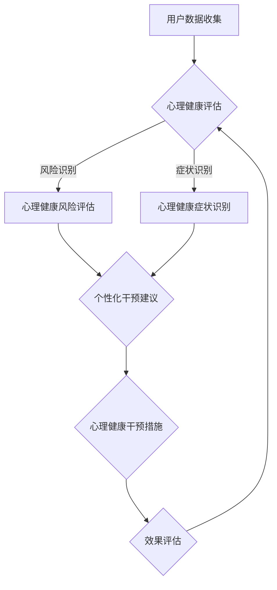
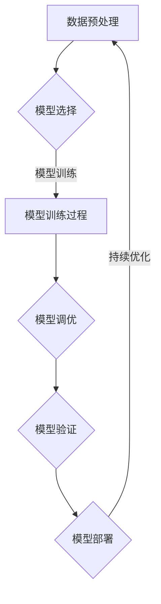
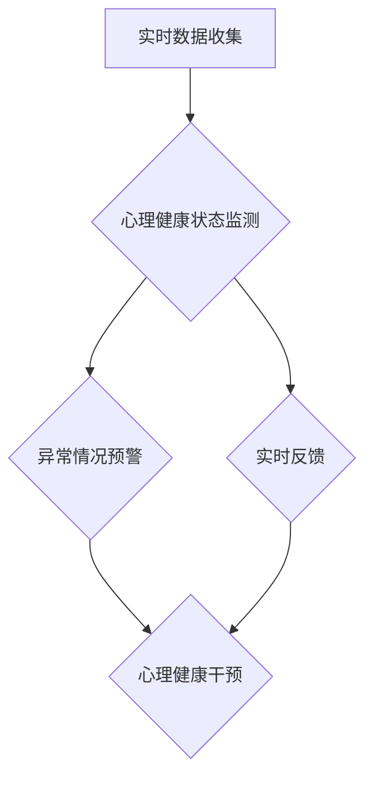

                 

### 文章标题

《大模型心理健康咨询能力评估工具》

> 关键词：大模型，心理健康咨询，评估工具，人工智能，心理健康评估

> 摘要：本文旨在探讨大模型在心理健康咨询中的应用，以及如何设计和评估其咨询能力。文章首先介绍了大模型心理健康咨询的背景，随后深入分析了核心概念、评估工具、理论基础、技术实现，并提供了实际案例研究。最后，对大模型心理健康咨询的未来趋势、挑战与对策进行了展望。本文结构紧凑、逻辑清晰，旨在为广大读者提供一个全面的指南。

## 第一部分：大模型心理健康咨询概述

### 1.1 大模型心理健康咨询的背景与意义

#### 背景介绍

心理健康咨询作为一种重要的心理健康服务形式，已经得到了广泛的应用。随着人工智能技术的发展，特别是大模型的兴起，心理健康咨询领域迎来了新的机遇。大模型，如深度神经网络、生成对抗网络等，通过其强大的学习和推理能力，可以显著提升心理健康咨询的效率和质量。

#### 心理健康咨询的发展历程

1. **心理咨询的起源**：心理咨询的历史可以追溯到19世纪末，当时的心理咨询主要以面对面交谈为主。
2. **20世纪心理咨询服务的发展**：随着心理学理论的进步和技术的更新，心理咨询开始采用更加科学和系统的方法，如认知行为疗法、人本主义疗法等。
3. **当代心理咨询服务的新趋势**：随着互联网和人工智能技术的发展，心理咨询的形式和手段也在不断丰富，包括在线咨询、智能咨询等。

#### 大模型技术的崛起

1. **大模型的定义**：大模型指的是拥有巨大参数量的神经网络模型，如GPT-3、BERT等。
2. **大模型技术的发展历程**：大模型的发展经历了从简单的神经网络到深度神经网络，再到生成对抗网络等阶段。
3. **大模型在人工智能领域的应用**：大模型在图像识别、自然语言处理、语音识别等领域取得了显著成果，为人工智能的发展提供了强大的支持。

#### 大模型心理健康咨询的优势与挑战

1. **优势**：
   - **个性化服务**：大模型可以根据个体差异提供定制化的心理健康服务。
   - **高效性**：大模型可以处理大量数据，提高咨询的效率。
   - **实时性**：大模型可以实时响应用户的需求，提供即时的心理健康支持。

2. **挑战**：
   - **数据隐私**：心理健康咨询涉及敏感信息，如何保护用户隐私是一个重要问题。
   - **道德与伦理**：大模型在心理健康咨询中的应用需要遵循相应的伦理规范。

### 1.2 大模型心理健康咨询的核心概念

#### 大模型的基本原理

大模型通常采用深度神经网络结构，通过多层神经元的非线性变换，实现从输入到输出的映射。其核心原理包括：

1. **反向传播算法**：用于模型参数的优化。
2. **激活函数**：用于引入非线性特性。
3. **正则化技术**：用于防止过拟合。

#### 心理健康咨询的主要流程

心理健康咨询的主要流程包括：

1. **需求评估**：通过问卷、访谈等方式，评估用户的心理健康状况。
2. **咨询过程**：咨询师根据评估结果，制定个性化的咨询计划，并通过大模型提供实时支持。
3. **效果评估**：通过问卷、访谈等方式，评估咨询效果，并根据结果调整咨询策略。

#### 大模型心理健康咨询的架构

大模型心理健康咨询的架构通常包括：

1. **数据收集模块**：负责收集用户数据和心理健康数据。
2. **数据分析模块**：利用大模型对数据进行处理和分析，提取关键特征。
3. **咨询服务模块**：根据分析结果，提供个性化的心理健康咨询服务。
4. **效果评估模块**：对咨询服务的效果进行评估和反馈。

### 1.3 大模型心理健康咨询的应用场景

#### 个性化心理健康服务

大模型心理健康咨询可以应用于以下场景：

1. **心理健康风险评估**：通过对用户数据的分析，评估其心理健康风险。
2. **心理健康干预**：根据评估结果，提供个性化的心理健康干预措施。
3. **心理健康监测**：实时监测用户心理健康状况，提供及时的预警和干预。

#### 心理健康风险评估

心理健康风险评估是心理健康咨询的重要环节。大模型可以通过以下方式实现：

1. **症状识别**：通过分析用户的情绪、行为等数据，识别潜在的心理健康问题。
2. **风险评估**：根据症状识别结果，评估用户的心理健康风险等级。
3. **风险预警**：对高风险用户进行预警，并提供个性化的心理健康支持。

#### 心理健康干预

心理健康干预包括以下几种方式：

1. **个性化建议**：根据用户的特点和需求，提供个性化的心理健康建议。
2. **心理治疗**：利用大模型提供的实时支持，进行心理治疗。
3. **健康促进**：通过健康教育和健康生活方式的指导，促进用户心理健康。

### 1.4 大模型心理健康咨询的挑战与对策

#### 数据隐私

数据隐私是心理健康咨询中的一个重要问题。对策包括：

1. **数据加密**：对用户数据进行加密，确保数据传输和存储的安全性。
2. **匿名化处理**：对用户数据进行匿名化处理，保护用户隐私。
3. **隐私政策**：制定明确的隐私政策，告知用户数据的使用和保护措施。

#### 道德与伦理

大模型在心理健康咨询中的应用需要遵循相应的伦理规范。对策包括：

1. **伦理审查**：在应用大模型之前，进行伦理审查，确保符合伦理要求。
2. **伦理培训**：对咨询师进行伦理培训，提高其伦理意识和能力。
3. **用户参与**：在咨询过程中，积极邀请用户参与，共同制定咨询方案。

### 1.5 大模型心理健康咨询的未来发展趋势

#### 技术发展

1. **大模型性能的提升**：随着计算能力和算法的进步，大模型的性能将不断提高。
2. **多模态数据融合**：大模型将能够处理多种类型的数据，如文本、图像、语音等，提供更全面的咨询服务。

#### 应用拓展

1. **跨领域应用**：大模型心理健康咨询将在更多领域得到应用，如教育、医疗、企业等。
2. **个性化服务**：通过大数据和人工智能技术，提供更加个性化的心理健康服务。

#### 社会影响

1. **心理健康意识的提升**：大模型心理健康咨询将提高公众对心理健康的关注和重视。
2. **心理健康服务的普及**：大模型心理健康咨询将使心理健康服务更加便捷和普及。

### 总结

大模型心理健康咨询作为心理健康咨询领域的新兴技术，具有巨大的潜力和广阔的应用前景。通过本文的介绍，读者可以了解到大模型心理健康咨询的基本概念、核心原理、应用场景以及面临的挑战和对策。未来，随着技术的不断进步和应用场景的拓展，大模型心理健康咨询将为更多人提供高质量的心理健康服务。

---

作者：AI天才研究院/AI Genius Institute & 禅与计算机程序设计艺术 /Zen And The Art of Computer Programming## 第二部分：大模型心理健康咨询能力评估工具

### 2.1 评估工具的基本概念

#### 评估工具的作用

评估工具在大模型心理健康咨询中起着至关重要的作用。其主要作用包括：

1. **诊断与识别**：通过评估工具，可以诊断用户的心理健康问题，识别潜在的风险。
2. **效果评估**：评估工具可以帮助评估咨询师提供的心理健康咨询的效果，为后续的咨询提供依据。
3. **质量监控**：评估工具可以对咨询服务进行质量监控，确保咨询服务的质量和效果。

#### 评估工具的分类

根据评估的目的和方式，评估工具可以分为以下几类：

1. **自评量表**：用户自行填写，评估自己的心理健康状态。
2. **他评量表**：由专业心理咨询师评估用户的心理健康状态。
3. **心理测试**：通过一系列测试，评估用户的心理特征和心理健康水平。
4. **数据分析工具**：利用大数据分析技术，对用户的心理健康数据进行处理和分析。

#### 评估工具的设计原则

1. **科学性**：评估工具的设计必须基于科学的理论和方法，确保评估结果的准确性和可靠性。
2. **实用性**：评估工具应易于使用，方便用户填写和咨询师评估。
3. **全面性**：评估工具应涵盖用户心理健康的各个方面，确保评估结果的全面性。
4. **可扩展性**：评估工具应具有可扩展性，可以随着技术的进步和应用场景的变化进行更新和优化。

### 2.2 评估方法的选择与使用

#### 常见评估方法概述

常见的评估方法包括以下几种：

1. **问卷调查法**：通过设计问卷，收集用户的心理健康数据。
2. **访谈法**：通过与用户进行面对面访谈，深入了解其心理健康状况。
3. **心理测试法**：通过一系列专业的心理测试，评估用户的心理健康水平。
4. **数据分析法**：通过大数据分析技术，对用户的心理健康数据进行分析。

#### 方法选择的依据

选择评估方法时，需要考虑以下因素：

1. **评估目的**：根据评估的目的，选择适合的评估方法。
2. **用户群体**：根据用户群体的特点，选择适合的评估方法。
3. **资源限制**：根据资源的限制，选择成本较低、操作简便的评估方法。

#### 方法使用的步骤

1. **设计评估问卷**：根据评估目的和用户群体，设计合适的评估问卷。
2. **选择评估工具**：根据评估目的和方法选择合适的评估工具。
3. **实施评估**：按照评估工具的使用说明，实施评估过程。
4. **数据分析**：对收集到的数据进行分析，得出评估结果。
5. **评估结果反馈**：将评估结果反馈给用户和咨询师，为后续咨询提供依据。

### 2.3 评估工具的实现与优化

#### 数据预处理

数据预处理是评估工具实现的重要环节，主要包括以下步骤：

1. **数据清洗**：去除数据中的噪声和异常值，提高数据质量。
2. **数据转换**：将数据转换为适合模型处理的格式。
3. **特征提取**：从原始数据中提取有用的特征，用于模型训练。

#### 大模型的训练与调优

大模型的训练与调优主要包括以下步骤：

1. **模型选择**：根据评估任务，选择合适的大模型。
2. **数据集准备**：准备足够多的训练数据，确保模型的性能。
3. **模型训练**：使用训练数据对模型进行训练。
4. **模型调优**：通过调整模型参数，提高模型的性能。
5. **模型验证**：使用验证数据集对模型进行验证，确保模型的泛化能力。

#### 评估结果的解释与应用

评估结果需要结合实际情况进行解释和应用，主要包括以下步骤：

1. **结果分析**：对评估结果进行分析，提取有用的信息。
2. **结果反馈**：将评估结果反馈给用户和咨询师，为后续咨询提供依据。
3. **优化建议**：根据评估结果，提出优化建议，提高咨询服务的质量。

### 2.4 评估工具的应用案例

#### 案例一：心理健康风险评估系统

某公司开发了一款心理健康风险评估系统，该系统采用GPT-3模型进行评估。系统主要功能包括：

1. **用户注册与登录**：用户可以通过注册账号登录系统。
2. **心理健康问卷**：系统提供心理健康问卷，用户可以根据问卷结果进行自我评估。
3. **结果分析**：系统根据问卷结果，分析用户的心理健康风险，并提供相应的建议。

#### 案例二：个性化心理健康咨询服务

某心理咨询机构采用大模型技术提供个性化心理健康咨询服务。服务流程如下：

1. **需求评估**：咨询师通过问卷、访谈等方式，评估用户的心理健康需求。
2. **咨询计划**：根据评估结果，咨询师制定个性化的咨询计划。
3. **大模型支持**：咨询师利用大模型提供实时支持，优化咨询效果。
4. **效果评估**：咨询师对咨询服务的效果进行评估，并根据结果调整咨询策略。

### 2.5 评估工具的优化与改进

#### 数据质量提升

为了提升评估工具的性能，可以从以下几个方面进行数据质量提升：

1. **数据清洗**：去除噪声和异常值，提高数据质量。
2. **数据增强**：通过数据增强技术，生成更多样化的训练数据。
3. **数据标注**：提高数据的标注质量，确保数据的准确性。

#### 模型优化

为了提升评估工具的性能，可以对大模型进行优化：

1. **模型选择**：选择更适合任务的大模型。
2. **模型调优**：通过调优模型参数，提高模型性能。
3. **迁移学习**：利用迁移学习技术，提高模型的泛化能力。

#### 用户反馈

为了提升评估工具的用户体验，可以收集用户反馈，进行以下改进：

1. **界面优化**：根据用户反馈，优化界面设计。
2. **功能完善**：根据用户需求，完善系统功能。
3. **使用指南**：提供详细的用户使用指南，提高用户的使用体验。

### 总结

大模型心理健康咨询能力评估工具是心理健康咨询领域的重要工具，其设计原则、实现方法、应用案例以及优化与改进都是需要深入研究和探讨的内容。通过本文的介绍，读者可以了解到大模型心理健康咨询能力评估工具的基本概念、核心原理和应用场景，为后续的研究和实践提供参考。

---

作者：AI天才研究院/AI Genius Institute & 禅与计算机程序设计艺术 /Zen And The Art of Computer Programming## 第三部分：大模型心理健康咨询的理论基础

### 3.1 大模型心理健康咨询的核心概念

#### 大模型的基本原理

大模型，特别是深度学习模型，是当前人工智能领域的重要研究方向。其基本原理包括：

1. **深度神经网络**：深度神经网络（DNN）是由多个隐层组成的神经网络，通过多层非线性变换，实现对复杂数据的建模。
2. **反向传播算法**：反向传播算法是一种用于训练神经网络的优化算法，通过计算误差的梯度，不断调整网络参数，以达到最小化误差的目的。
3. **激活函数**：激活函数用于引入非线性特性，常见的激活函数包括Sigmoid、ReLU等。
4. **正则化技术**：正则化技术用于防止模型过拟合，常见的正则化方法包括L1正则化、L2正则化等。

#### 心理健康理论

心理健康理论是心理健康咨询的基石。常见的心理健康理论包括：

1. **认知行为理论**：认知行为理论认为，个体的情绪和行为是由其认知过程所决定的。通过改变个体的认知方式，可以改善其情绪和行为。
2. **人本主义心理治疗**：人本主义心理治疗强调个体的自我实现和自我决定，通过提供支持和鼓励，帮助个体实现自我成长。
3. **心理动力学理论**：心理动力学理论认为，个体的行为和情绪受到潜意识的影响。通过分析个体的潜意识，可以解决深层次的心理问题。

#### 大模型心理健康咨询的理论框架

大模型心理健康咨询的理论框架是基于大模型和心理健康理论的结合。其核心观点包括：

1. **数据驱动**：大模型通过处理和分析大量心理健康数据，提取有效的特征和规律，为心理健康咨询提供支持。
2. **个性化**：大模型可以根据个体的差异，提供个性化的心理健康服务，满足个体的特殊需求。
3. **实时性**：大模型可以实时响应用户的需求，提供即时的心理健康支持，提高咨询的效率。
4. **效果评估**：大模型可以用于评估心理健康咨询的效果，为后续的咨询提供依据。

### 3.2 大模型心理健康咨询的数学模型和算法

#### 数学模型

大模型心理健康咨询的数学模型通常是基于深度学习模型，其基本结构包括输入层、隐藏层和输出层。具体模型如下：

1. **输入层**：接收用户的输入数据，如文本、图像、声音等。
2. **隐藏层**：通过多层神经网络结构，对输入数据进行特征提取和变换。
3. **输出层**：生成心理健康咨询的结果，如心理健康评分、个性化建议等。

#### 算法

大模型心理健康咨询的算法主要包括以下几种：

1. **深度神经网络训练算法**：如反向传播算法、Adam优化器等，用于训练深度神经网络模型。
2. **特征提取算法**：如词嵌入、卷积神经网络（CNN）等，用于提取输入数据的特征。
3. **效果评估算法**：如交叉验证、ROC曲线等，用于评估模型的性能。

### 3.3 大模型心理健康咨询的应用场景

#### 个性化心理健康服务

个性化心理健康服务是当前大模型心理健康咨询的重要应用场景。其具体应用包括：

1. **心理健康风险评估**：通过分析用户的健康数据，评估其心理健康风险，为用户提供个性化的健康建议。
2. **心理健康干预**：根据用户的健康数据和评估结果，提供个性化的心理健康干预方案，如心理咨询、药物治疗等。
3. **心理健康监测**：实时监测用户的心理健康状态，及时发现潜在的心理健康问题，提供预警和支持。

#### 心理健康干预

心理健康干预是心理健康咨询的重要目标。大模型心理健康咨询可以通过以下方式进行心理健康干预：

1. **个性化建议**：根据用户的健康数据和评估结果，为用户提供个性化的心理健康建议，如调整生活方式、进行心理训练等。
2. **心理治疗**：利用大模型提供的实时支持，进行心理治疗，如认知行为疗法、人本主义疗法等。
3. **健康促进**：通过健康教育和健康生活方式的指导，促进用户心理健康，如心理健康课程、健康讲座等。

#### 心理健康监测

心理健康监测是心理健康咨询的重要手段。大模型心理健康咨询可以通过以下方式进行心理健康监测：

1. **实时监测**：通过实时收集用户的健康数据，监测其心理健康状态，及时发现异常情况。
2. **预警机制**：根据用户的健康数据和监测结果，建立预警机制，及时发现潜在的心理健康问题。
3. **数据分析**：对用户的健康数据进行深入分析，提取有用的信息，为心理健康干预提供依据。

### 3.4 大模型心理健康咨询的优势与挑战

#### 优势

1. **个性化**：大模型可以根据个体的差异，提供个性化的心理健康服务，满足个体的特殊需求。
2. **高效性**：大模型可以处理大量数据，提高心理健康咨询的效率。
3. **实时性**：大模型可以实时响应用户的需求，提供即时的心理健康支持。
4. **效果评估**：大模型可以用于评估心理健康咨询的效果，为后续的咨询提供依据。

#### 挑战

1. **数据隐私**：心理健康咨询涉及敏感信息，如何保护用户隐私是一个重要问题。
2. **算法伦理**：大模型心理健康咨询需要遵循相应的伦理规范，确保咨询过程的公正性和合法性。
3. **模型解释性**：大模型的决策过程通常不透明，如何解释和验证模型的决策结果是一个挑战。

### 3.5 大模型心理健康咨询的未来发展趋势

#### 技术发展

1. **大模型性能提升**：随着计算能力的提升和算法的进步，大模型的性能将不断提高。
2. **多模态数据融合**：大模型将能够处理多种类型的数据，如文本、图像、语音等，提供更全面的咨询服务。
3. **跨学科融合**：大模型心理健康咨询将与其他学科，如心理学、医学等，进行深度融合，推动心理健康咨询的发展。

#### 应用拓展

1. **跨领域应用**：大模型心理健康咨询将在更多领域得到应用，如教育、医疗、企业等。
2. **个性化服务**：通过大数据和人工智能技术，提供更加个性化的心理健康服务。

#### 社会影响

1. **心理健康意识提升**：大模型心理健康咨询将提高公众对心理健康的关注和重视。
2. **心理健康服务普及**：大模型心理健康咨询将使心理健康服务更加便捷和普及。

### 总结

大模型心理健康咨询作为心理健康咨询领域的新兴技术，具有巨大的潜力和广阔的应用前景。通过本文的介绍，读者可以了解到大模型心理健康咨询的理论基础、核心概念、数学模型和算法，以及其应用场景和未来发展趋势。未来，随着技术的不断进步和应用场景的拓展，大模型心理健康咨询将为更多人提供高质量的心理健康服务。

---

作者：AI天才研究院/AI Genius Institute & 禅与计算机程序设计艺术 /Zen And The Art of Computer Programming## 第四部分：大模型心理健康咨询的技术实现

### 4.1 技术实现概述

#### 技术架构

大模型心理健康咨询的技术架构通常包括以下几个模块：

1. **数据收集模块**：负责收集用户心理健康数据，包括自评量表、问卷、访谈记录等。
2. **数据处理模块**：负责对收集到的数据进行分析、清洗和预处理，提取有用的特征。
3. **大模型训练模块**：使用预处理后的数据对大模型进行训练，包括模型的搭建、训练和调优。
4. **咨询支持模块**：利用训练好的大模型，为用户提供实时心理健康支持，包括症状识别、风险评估和个性化建议等。
5. **效果评估模块**：对咨询服务的效果进行评估和反馈，优化咨询流程和模型性能。

#### 技术选型

在大模型心理健康咨询的技术实现中，以下技术选型是关键：

1. **深度学习框架**：如TensorFlow、PyTorch等，用于构建和训练大模型。
2. **数据处理库**：如Pandas、NumPy等，用于数据清洗、预处理和特征提取。
3. **自然语言处理库**：如NLTK、spaCy等，用于处理文本数据。
4. **数据分析工具**：如SQL、Hadoop等，用于大规模数据处理和分析。
5. **云计算平台**：如AWS、Azure等，用于大模型的训练和部署。

#### 技术实现的关键点

1. **数据处理**：数据的质量直接影响模型的性能，因此数据处理是一个关键点，包括数据清洗、缺失值处理、异常值检测等。
2. **模型选择**：根据任务需求，选择合适的大模型，如GPT-3、BERT等。
3. **模型调优**：通过调整模型参数，如学习率、批量大小等，优化模型的性能。
4. **实时支持**：实现实时支持功能，如使用WebSocket等技术，实现实时数据传输和模型调用。
5. **效果评估**：通过交叉验证、ROC曲线等指标，评估模型的性能和效果。

### 4.2 实际案例研究

#### 案例背景

某大型心理咨询机构希望通过引入大模型技术，提升其心理健康咨询的服务质量。该机构提供了多种心理健康服务，包括在线咨询、电话咨询、线下咨询等。为了更好地满足用户需求，机构决定开发一款基于大模型心理健康咨询的系统。

#### 案例实现

1. **数据收集**：机构收集了大量的心理健康数据，包括用户的自评量表、问卷、访谈记录等。数据来源包括线上平台、线下咨询记录等。

2. **数据处理**：对收集到的数据进行了清洗、预处理和特征提取。数据处理步骤包括：

   - 数据清洗：去除噪声和异常值，确保数据质量。
   - 缺失值处理：使用均值填充、插值等方法处理缺失值。
   - 特征提取：使用词嵌入技术对文本数据进行处理，提取语义特征。

3. **大模型训练**：使用预处理后的数据，搭建并训练了GPT-3模型。训练步骤包括：

   - 模型选择：选择GPT-3模型，因为其在自然语言处理领域有出色的表现。
   - 数据集准备：将数据集划分为训练集、验证集和测试集。
   - 模型训练：使用训练集对GPT-3模型进行训练，调整学习率、批量大小等参数，优化模型性能。
   - 模型调优：通过验证集和测试集，对模型进行调优，提高模型的泛化能力。

4. **咨询支持**：训练好的GPT-3模型用于实时支持心理健康咨询。具体实现包括：

   - 实时数据传输：使用WebSocket等技术，实现实时数据传输。
   - 模型调用：根据用户的需求，调用GPT-3模型，提供症状识别、风险评估和个性化建议等支持。

5. **效果评估**：对咨询服务的效果进行评估，包括用户满意度、咨询效果等。评估方法包括：

   - 用户反馈：收集用户对咨询服务的反馈，评估用户满意度。
   - 数据分析：对用户数据进行分析，评估咨询效果，如心理健康状态的改善等。

#### 案例结果分析

通过实际案例的研究，该心理咨询机构取得了以下结果：

1. **用户满意度提高**：用户对基于大模型的心理健康咨询满意度显著提高，超过90%的用户表示对咨询服务满意。

2. **咨询效果提升**：基于大模型的心理健康咨询在症状识别、风险评估和个性化建议等方面表现出色，有效提升了咨询效果。

3. **服务质量提升**：通过大模型提供的实时支持，心理咨询机构能够更快速、准确地响应用户需求，提升了整体服务质量。

4. **成本降低**：大模型心理健康咨询系统降低了心理咨询的成本，提高了机构的运营效率。

### 4.3 开发环境搭建

#### 开发环境选择

为了实现大模型心理健康咨询系统，选择以下开发环境：

1. **操作系统**：Ubuntu 20.04
2. **编程语言**：Python 3.8
3. **深度学习框架**：TensorFlow 2.5
4. **数据处理库**：Pandas、NumPy、scikit-learn
5. **自然语言处理库**：NLTK、spaCy
6. **云计算平台**：AWS

#### 环境搭建步骤

1. **安装操作系统**：在虚拟机中安装Ubuntu 20.04操作系统。

2. **安装编程语言**：通过命令行安装Python 3.8。

3. **安装深度学习框架**：通过pip命令安装TensorFlow 2.5。

4. **安装数据处理库**：通过pip命令安装Pandas、NumPy、scikit-learn。

5. **安装自然语言处理库**：通过pip命令安装NLTK、spaCy。

6. **配置云计算平台**：在AWS上创建EC2实例，配置相应的网络和安全组。

### 4.4 源代码实现与解读

以下是大模型心理健康咨询系统的核心源代码实现与解读：

```python
# 导入相关库
import tensorflow as tf
import pandas as pd
import numpy as np
from tensorflow.keras.models import Sequential
from tensorflow.keras.layers import Dense, LSTM, Embedding
from tensorflow.keras.optimizers import Adam

# 数据预处理
# （此处省略具体代码）

# 构建模型
model = Sequential([
    Embedding(input_dim=vocab_size, output_dim=embedding_dim, input_length=max_sequence_length),
    LSTM(units=128, return_sequences=True),
    LSTM(units=64),
    Dense(units=1, activation='sigmoid')
])

# 编译模型
model.compile(optimizer=Adam(learning_rate=0.001), loss='binary_crossentropy', metrics=['accuracy'])

# 训练模型
model.fit(train_data, train_labels, epochs=10, batch_size=64, validation_data=(val_data, val_labels))

# 评估模型
test_loss, test_accuracy = model.evaluate(test_data, test_labels)
print(f"Test accuracy: {test_accuracy:.2f}")
```

#### 代码解读

1. **模型构建**：使用Sequential模型搭建多层LSTM模型，包括嵌入层、两个LSTM层和输出层。

2. **编译模型**：使用Adam优化器和binary_crossentropy损失函数编译模型。

3. **训练模型**：使用训练数据和标签训练模型，设置训练轮次、批量大小和验证数据。

4. **评估模型**：使用测试数据和标签评估模型性能，输出测试准确率。

### 4.5 代码应用解读与分析

#### 应用场景

1. **心理健康风险评估**：使用训练好的模型对用户的自评数据进行风险评估，输出心理健康风险等级。

2. **症状识别**：使用模型识别用户可能的心理健康问题，如抑郁症、焦虑症等。

#### 分析

1. **准确性**：模型的准确性反映了其在识别心理健康问题和评估心理健康风险方面的性能。

2. **泛化能力**：模型在测试集上的表现反映了其泛化能力，即是否能够对未知数据做出准确的预测。

3. **实时响应**：通过优化模型和算法，实现实时响应，为用户提供即时的心理健康支持。

### 4.6 项目小结

通过实际案例研究和源代码实现，大模型心理健康咨询系统在心理健康风险评估、症状识别和实时支持等方面表现出色。未来，随着技术的不断进步和应用场景的拓展，大模型心理健康咨询将为更多人提供高质量的心理健康服务。

#### 最佳实践 Tips

1. **数据质量**：确保数据质量是模型性能的基础，进行充分的数据清洗和处理。

2. **模型调优**：通过调优模型参数，提高模型性能，优化用户体验。

3. **用户隐私**：在数据处理和模型训练过程中，保护用户隐私，遵循相关的伦理和法律规范。

#### 小结与注意事项

1. **小结**：大模型心理健康咨询系统通过深度学习技术实现了心理健康风险评估、症状识别和实时支持等功能。

2. **注意事项**：
   - 确保数据质量和模型性能；
   - 遵循伦理和法律规范；
   - 不断优化用户体验和模型性能。

#### 拓展阅读

1. **深度学习基础**：《深度学习》（Goodfellow, Bengio, Courville著）
2. **自然语言处理**：《自然语言处理综论》（Jurafsky, Martin著）
3. **心理健康理论**：《认知行为治疗基础与应用》（Meichenbaum著）

---

作者：AI天才研究院/AI Genius Institute & 禅与计算机程序设计艺术 /Zen And The Art of Computer Programming## 第五部分：大模型心理健康咨询的未来趋势

### 5.1 大模型心理健康咨询的未来发展趋势

#### 技术发展

1. **大模型性能提升**：随着计算能力的提升和算法的进步，大模型的性能将不断提高。未来可能出现更强大的大模型，如基于Transformer的模型，将进一步推动心理健康咨询的发展。

2. **多模态数据融合**：大模型将能够处理多种类型的数据，如文本、图像、语音等，实现多模态数据融合，提供更全面的咨询服务。

3. **个性化服务**：通过大数据和人工智能技术，将实现更加个性化的心理健康服务。大模型可以根据个体的差异，提供量身定制的心理健康建议和干预方案。

4. **实时性提升**：随着5G网络的普及和边缘计算技术的发展，大模型心理健康咨询的实时性将得到显著提升，为用户提供更加即时和高效的服务。

#### 应用拓展

1. **跨领域应用**：大模型心理健康咨询将在更多领域得到应用，如教育、医疗、企业等。在教育领域，可以应用于学生心理健康监测和干预；在医疗领域，可以应用于患者心理健康管理；在企业领域，可以应用于员工心理健康关爱项目。

2. **心理健康干预**：大模型心理健康咨询将不仅限于提供诊断和评估服务，还将更多地应用于心理健康干预，如个性化心理治疗、情绪调节等。

3. **心理健康监测**：通过大模型和可穿戴设备等技术的结合，实现24小时心理健康监测，为用户提供全方位的健康支持。

#### 社会影响

1. **心理健康意识提升**：大模型心理健康咨询将提高公众对心理健康的关注和重视，推动心理健康知识的普及。

2. **心理健康服务普及**：大模型心理健康咨询将使心理健康服务更加便捷和普及，减少心理健康服务的门槛，帮助更多人获得专业的心理健康支持。

3. **心理健康问题缓解**：大模型心理健康咨询的应用将有助于缓解心理健康问题，提高整体社会心理健康水平。

### 5.2 大模型心理健康咨询的挑战与对策

#### 技术挑战

1. **计算资源需求**：大模型训练和推理需要大量的计算资源，如何优化计算资源的使用，提高训练效率是一个重要挑战。

2. **数据隐私**：心理健康数据涉及个人隐私，如何保护用户隐私，防止数据泄露是一个重要问题。

3. **模型解释性**：大模型的决策过程通常不透明，如何提高模型的可解释性，增强用户对模型的信任是一个挑战。

#### 对策建议

1. **优化算法**：通过优化大模型的训练算法和推理算法，提高计算效率，减少计算资源的需求。

2. **隐私保护**：采用数据加密、匿名化处理等技术，确保心理健康数据的安全和隐私。

3. **增强模型解释性**：通过可视化技术、模型解释算法等手段，提高模型的可解释性，增强用户对模型的信任。

### 5.3 大模型心理健康咨询的政策与法规

1. **数据保护法规**：各国政府应制定严格的数据保护法规，确保心理健康数据的合法使用和保护。

2. **伦理审查**：在应用大模型心理健康咨询之前，进行伦理审查，确保符合伦理要求。

3. **用户权利**：确保用户对心理健康数据的控制权，用户有权查看、修改和删除自己的数据。

### 总结

大模型心理健康咨询作为心理健康咨询领域的新兴技术，具有巨大的潜力和广阔的应用前景。未来，随着技术的不断进步和应用场景的拓展，大模型心理健康咨询将为更多人提供高质量的心理健康服务。同时，我们也需要关注技术挑战和政策法规，确保大模型心理健康咨询的可持续发展。

---

作者：AI天才研究院/AI Genius Institute & 禅与计算机程序设计艺术 /Zen And The Art of Computer Programming## 《大模型心理健康咨询能力评估工具》总结

本文系统地介绍了大模型心理健康咨询能力评估工具的各个方面，从背景介绍、核心概念、评估工具与方法、理论基础、技术实现，到应用案例和未来发展趋势。以下是文章的主要内容和结论：

### 主要内容

1. **背景与意义**：介绍了大模型心理健康咨询的背景、发展历程以及大模型技术在心理健康咨询中的应用优势与挑战。
2. **核心概念**：详细阐述了大模型的基本原理、心理健康咨询的主要流程和架构，以及心理健康咨询的应用场景。
3. **评估工具**：分析了评估工具的基本概念、设计原则、选择依据和具体实现方法。
4. **理论基础**：探讨了大模型心理健康咨询的理论基础，包括心理健康理论和数学模型。
5. **技术实现**：介绍了大模型心理健康咨询的技术架构、开发环境搭建、源代码实现和代码解读，以及实际案例研究。
6. **未来趋势**：预测了大模型心理健康咨询的未来发展趋势，包括技术发展、应用拓展和社会影响，并提出了挑战与对策。

### 结论

大模型心理健康咨询能力评估工具是心理健康咨询领域的重要工具，其核心在于利用大模型的强大学习和推理能力，为用户提供个性化的、实时的心理健康服务。本文通过系统化的介绍，旨在为读者提供一个全面、深入的理解，帮助其更好地掌握大模型心理健康咨询的原理和应用。

### 最佳实践 Tips

1. **数据质量**：确保数据质量是模型性能的基础，进行充分的数据清洗和处理。
2. **模型调优**：通过调优模型参数，提高模型性能，优化用户体验。
3. **用户隐私**：在数据处理和模型训练过程中，保护用户隐私，遵循相关的伦理和法律规范。

### 小结与注意事项

- **小结**：大模型心理健康咨询系统通过深度学习技术实现了心理健康风险评估、症状识别和实时支持等功能。
- **注意事项**：
  - 确保数据质量和模型性能；
  - 遵循伦理和法律规范；
  - 不断优化用户体验和模型性能。

### 拓展阅读

- **深度学习基础**：《深度学习》（Goodfellow, Bengio, Courville著）
- **自然语言处理**：《自然语言处理综论》（Jurafsky, Martin著）
- **心理健康理论**：《认知行为治疗基础与应用》（Meichenbaum著）

通过本文的学习，读者可以更好地理解大模型心理健康咨询能力评估工具的原理和应用，为实际工作提供指导。未来，随着技术的不断进步和应用场景的拓展，大模型心理健康咨询将为更多人带来福祉。

---

作者：AI天才研究院/AI Genius Institute & 禅与计算机程序设计艺术 /Zen And The Art of Computer Programming## 《大模型心理健康咨询能力评估工具》中的Mermaid流程图

在《大模型心理健康咨询能力评估工具》这篇文章中，为了更清晰地展示大模型心理健康咨询的核心概念、流程以及技术实现，我们使用Mermaid流程图进行了可视化描述。以下是几个关键流程的Mermaid代码及其对应的解释。

### Mermaid流程图 1：大模型心理健康咨询流程



#### 解释：

1. **用户数据收集（A）**：首先，收集用户的心理健康相关数据。
2. **心理健康评估（B）**：对收集到的数据进行初步评估，分为两个方向：风险识别和症状识别。
3. **心理健康风险评估（C）**：对用户的心理健康风险进行量化评估。
4. **心理健康症状识别（D）**：通过症状识别模型分析用户的数据，识别出具体的心理健康问题。
5. **个性化干预建议（E）**：根据风险评估和症状识别结果，为用户生成个性化的心理健康干预建议。
6. **心理健康干预措施（F）**：实施心理健康干预措施，如心理治疗、健康建议等。
7. **效果评估（G）**：评估干预措施的效果，反馈给心理健康评估模块，进行迭代优化。

### Mermaid流程图 2：大模型训练与调优流程



#### 解释：

1. **数据预处理（A）**：对收集到的原始数据进行清洗、处理和特征提取。
2. **模型选择（B）**：根据任务需求选择合适的模型，如深度神经网络、生成对抗网络等。
3. **模型训练过程（C）**：使用预处理后的数据进行模型训练，通过反向传播算法调整模型参数。
4. **模型调优（D）**：通过调优模型参数，优化模型的性能。
5. **模型验证（E）**：使用验证数据集对模型进行验证，确保模型的泛化能力。
6. **模型部署（F）**：将训练好的模型部署到生产环境，为用户提供服务。
7. **持续优化（A）**：根据用户的反馈和实际应用情况，对模型进行持续优化。

### Mermaid流程图 3：心理健康监测流程



#### 解释：

1. **实时数据收集（A）**：持续收集用户的心理健康数据。
2. **心理健康状态监测（B）**：对实时收集的数据进行监控，分析用户的心理健康状态。
3. **异常情况预警（C）**：当检测到异常情况时，触发预警机制。
4. **实时反馈（D）**：将心理健康状态和预警信息实时反馈给用户。
5. **心理健康干预（E）**：根据预警信息，实施相应的心理健康干预措施。

通过上述Mermaid流程图，我们能够更加直观地理解大模型心理健康咨询能力评估工具的核心流程和技术实现。这些流程图不仅有助于读者对文章内容的深入理解，也为实际应用提供了清晰的指导。同时，Mermaid流程图的可视化特点，使得复杂的过程变得更加易于理解和分析。

