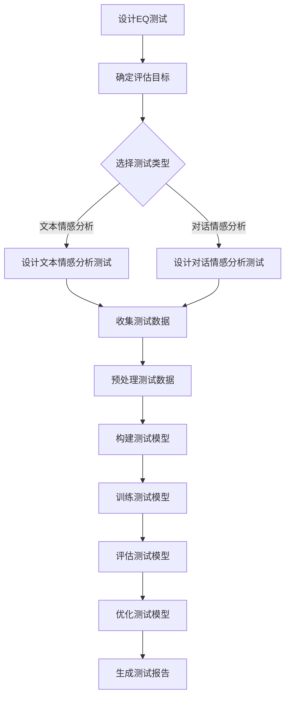

                 

### 文章标题：《大模型情感智能评估：LLM设计的EQ测试》

### 关键词：大模型，情感智能，LLM，EQ测试，评估，人工智能

### 摘要：本文将探讨大模型情感智能评估的重要性，以及如何通过LLM（大型语言模型）设计EQ（情商）测试来实现这一目标。文章首先介绍了大模型情感智能评估的背景、意义和应用场景，然后深入讨论了LLM和情感分析技术的基础知识。接着，详细介绍了EQ测试的设计原理、流程和方法，并通过伪代码和数学模型阐述了核心算法原理。此外，本文还分析了EQ测试的评估指标和优化方法，以及通过实际案例展示了EQ测试的应用。最后，文章总结了全文内容，并对未来的发展方向提出了展望。

### 引言与概述

#### 1.1 大模型情感智能评估的背景与意义

大模型情感智能评估是人工智能领域中的一个重要研究方向。随着深度学习和自然语言处理技术的不断发展，大型语言模型（LLM）已经成为了处理自然语言任务的主要工具。这些大模型不仅在文本生成、机器翻译、情感分析等任务上表现出色，还开始被应用于更加复杂和实际的场景中，如心理辅导、客户服务、教育等。

情感智能是指机器理解和处理人类情感的能力。情感智能评估则是对机器在情感识别、理解和反应等方面的能力进行评价的过程。大模型情感智能评估的意义在于：

1. **提升用户体验**：在客户服务、教育、医疗等场景中，机器能够更好地理解和回应用户的需求和情感，从而提升用户体验。
2. **辅助人类决策**：通过情感智能评估，机器可以辅助人类在心理辅导、危机干预等场景中做出更加合理的决策。
3. **推动技术发展**：大模型情感智能评估的研究有助于推动人工智能技术的发展，为构建更加智能和人性化的机器系统提供支持。

#### 1.2 EQ测试的需求与挑战

EQ测试是一种用于评估大模型情感智能的方法。EQ测试的需求主要来自于以下几个方面：

1. **多维度评估**：EQ测试能够从多个维度对大模型情感智能进行评估，如情感识别、情感理解、情感反应等。
2. **标准化评估**：EQ测试提供了一套标准化的评估框架，使得不同模型之间的比较成为可能。
3. **可重复性**：EQ测试的评估结果具有较高的可重复性，能够保证评估的可靠性和有效性。

然而，EQ测试也面临着一些挑战：

1. **情感复杂度**：人类的情感非常复杂，大模型难以完全理解和处理。如何设计出能够准确评估大模型情感智能的测试题目成为了一个挑战。
2. **数据隐私**：在进行EQ测试时，需要收集大量的用户数据。如何保护用户隐私是一个重要问题。
3. **模型适应性**：不同的模型可能在不同的任务上有不同的表现。如何设计出能够适应各种模型的EQ测试题目也是一个挑战。

### 技术基础

#### 2.1 大模型技术基础

大模型是指具有大规模参数和训练数据的神经网络模型。大模型技术在自然语言处理领域取得了显著进展，其核心在于：

1. **大规模参数**：大模型具有数亿甚至数十亿个参数，这使得它们能够捕捉到文本中的复杂模式和关联。
2. **大规模数据**：大模型通常使用大量的训练数据，这些数据来自互联网、书籍、新闻报道等各个领域，使得模型能够更好地理解和处理自然语言。

大模型的训练和优化是一个复杂的过程，通常包括以下几个步骤：

1. **数据预处理**：对输入数据进行清洗、去噪和标准化处理，以便模型能够更好地学习。
2. **模型初始化**：初始化模型的参数，通常使用随机初始化或者预训练模型的方法。
3. **模型训练**：通过梯度下降等方法更新模型的参数，使得模型能够在训练数据上达到更好的效果。
4. **模型优化**：使用各种优化技术，如正则化、dropout等，提高模型的泛化能力和鲁棒性。

#### 2.2 情感分析技术基础

情感分析是指使用自然语言处理技术对文本中的情感进行识别和分类的过程。情感分析技术的基础包括：

1. **情感分类器**：使用机器学习算法构建情感分类器，如支持向量机（SVM）、朴素贝叶斯（NB）等。
2. **特征提取**：从文本中提取特征，如词袋（Bag of Words）、TF-IDF等。
3. **情感词典**：使用预定义的情感词典来标记文本中的情感词汇，如SentiWordNet等。

情感分析的常用方法包括：

1. **基于规则的方法**：使用预定义的规则来分类文本情感，如基于关键词匹配、情感词典等。
2. **基于统计的方法**：使用机器学习算法，如SVM、NB等，通过训练数据学习文本情感的分类模型。
3. **基于深度学习的方法**：使用深度神经网络，如卷积神经网络（CNN）、循环神经网络（RNN）等，通过训练数据学习文本情感的分类模型。

#### 2.3 Mermaid流程图：EQ测试的设计原理



在这个流程图中，首先确定评估目标，然后根据目标选择测试类型。对于文本情感分析，设计文本情感分析测试；对于对话情感分析，设计对话情感分析测试。接下来，收集测试数据，预处理测试数据，构建测试模型，训练测试模型，评估测试模型，优化测试模型，最后生成测试报告。

### EQ测试设计

#### 3.1 EQ测试的设计原理

EQ测试的设计原理是基于情感智能的多维度评估。EQ测试旨在从情感识别、情感理解和情感反应三个方面评估大模型在情感智能方面的能力。

1. **情感识别**：评估模型能否正确识别文本中的情感。这通常通过设计包含不同情感标签的文本数据集来实现。
2. **情感理解**：评估模型能否理解文本背后的情感含义。这需要模型能够处理更加复杂的语义和上下文信息。
3. **情感反应**：评估模型能否根据情感信息做出适当的反应。这通常通过设计对话场景来实现，要求模型能够生成符合情感信息的回复。

EQ测试的设计流程包括以下几个步骤：

1. **确定评估目标**：明确需要评估的情感智能维度，如情感识别、情感理解和情感反应。
2. **选择测试类型**：根据评估目标选择合适的测试类型，如文本情感分析测试或对话情感分析测试。
3. **设计测试题目**：设计包含不同情感内容的测试题目，确保测试题目的多样性和代表性。
4. **收集测试数据**：收集用于测试的数据集，包括文本数据和对话数据。
5. **预处理测试数据**：对测试数据进行清洗、去噪和标准化处理。
6. **构建测试模型**：使用机器学习算法构建情感分析模型。
7. **训练测试模型**：使用训练数据集训练模型。
8. **评估测试模型**：使用测试数据集评估模型的性能。
9. **优化测试模型**：根据评估结果调整模型参数，优化模型性能。
10. **生成测试报告**：生成详细的测试报告，包括模型的性能指标、评估结果和优化建议。

#### 3.2 伪代码：EQ测试的核心算法原理

```python
# 伪代码：EQ测试的核心算法原理

# 数据预处理
def preprocess_data(data):
    # 清洗数据
    # 去噪
    # 标准化
    return processed_data

# 模型构建
def build_model():
    # 初始化模型参数
    # 选择模型架构
    return model

# 训练模型
def train_model(model, train_data):
    # 使用训练数据进行模型训练
    # 更新模型参数
    return trained_model

# 评估模型
def evaluate_model(model, test_data):
    # 使用测试数据进行模型评估
    # 计算性能指标
    return performance_metrics

# 优化模型
def optimize_model(model, performance_metrics):
    # 根据性能指标调整模型参数
    return optimized_model

# EQ测试流程
def EQ_test():
    # 确定评估目标
    # 选择测试类型
    # 设计测试题目
    # 收集测试数据
    # 预处理测试数据
    # 构建测试模型
    # 训练测试模型
    # 评估测试模型
    # 优化测试模型
    # 生成测试报告
    pass
```

#### 3.3 LaTeX格式数学模型：情感分类的数学基础

```latex
$$
P(Y|X) = \frac{P(X|Y)P(Y)}{P(X)}
$$

$$
F1 = 2 \times \frac{precision \times recall}{precision + recall}
$$
```

这里，$P(Y|X)$ 表示在给定输入 $X$ 的情况下，输出 $Y$ 的概率。$precision$ 表示准确率，$recall$ 表示召回率，$F1$ 值是准确率和召回率的调和平均数。

### 测试评估与优化

#### 4.1 EQ测试的评估指标

EQ测试的评估指标包括准确率（accuracy）、召回率（recall）和F1值（F1 score）等。

1. **准确率**：准确率是指模型预测正确的样本数占总样本数的比例。它能够直接反映模型的分类性能。
2. **召回率**：召回率是指模型能够正确识别的样本数占总样本数的比例。它能够反映模型对正样本的识别能力。
3. **F1值**：F1值是准确率和召回率的调和平均数，能够综合反映模型的分类性能。F1值越接近1，模型的性能越好。

#### 4.2 EQ测试的优化方法

EQ测试的优化方法包括以下几个方面：

1. **模型调参**：通过调整模型的参数，如学习率、正则化参数等，来优化模型的性能。
2. **数据增强**：通过增加训练数据的多样性，如使用数据增强技术生成更多的训练样本，来提高模型的泛化能力。
3. **模型融合**：将多个模型的结果进行融合，以提高最终的评估结果。常见的模型融合方法包括投票法、加权平均法等。
4. **动态调整评估指标**：根据实际应用场景调整评估指标，如在某些应用场景中，召回率可能比准确率更加重要。

### 应用案例分析

#### 5.1 案例一：基于EQ测试的员工心理健康评估

**案例背景**：

某公司希望通过EQ测试对员工的心理健康进行评估，以便为员工提供针对性的心理辅导和支持。

**案例实施过程**：

1. **确定评估目标**：评估员工在情感识别、情感理解和情感反应方面的能力。
2. **设计测试题目**：设计包含不同情感标签的文本题目，如喜悦、悲伤、愤怒等。
3. **收集测试数据**：收集员工在日常工作中的文本数据，如邮件、聊天记录等。
4. **预处理测试数据**：对测试数据进行清洗、去噪和标准化处理。
5. **构建测试模型**：使用机器学习算法构建情感分析模型。
6. **训练测试模型**：使用训练数据集训练模型。
7. **评估测试模型**：使用测试数据集评估模型的性能。
8. **优化测试模型**：根据评估结果调整模型参数，优化模型性能。
9. **生成测试报告**：生成详细的测试报告，包括员工的情感识别、理解和反应能力。

**案例分析**：

通过EQ测试，公司能够了解到员工在心理健康方面的优势和不足，从而为员工提供针对性的心理辅导和支持。例如，对于情感识别能力较低的员工，公司可以提供相关的培训课程，帮助他们提高情感识别能力。

#### 5.2 案例二：基于EQ测试的客户服务优化

**案例背景**：

某客户服务公司希望通过EQ测试优化客户服务，提高客户满意度。

**案例实施过程**：

1. **确定评估目标**：评估客户服务代表在情感识别、情感理解和情感反应方面的能力。
2. **设计测试题目**：设计包含不同情感标签的对话题目，如喜悦、悲伤、愤怒等。
3. **收集测试数据**：收集客户服务代表在处理客户问题的对话数据。
4. **预处理测试数据**：对测试数据进行清洗、去噪和标准化处理。
5. **构建测试模型**：使用机器学习算法构建情感分析模型。
6. **训练测试模型**：使用训练数据集训练模型。
7. **评估测试模型**：使用测试数据集评估模型的性能。
8. **优化测试模型**：根据评估结果调整模型参数，优化模型性能。
9. **生成测试报告**：生成详细的测试报告，包括客户服务代表的情感识别、理解和反应能力。

**案例分析**：

通过EQ测试，公司能够了解到客户服务代表在情感处理方面的优势和不足，从而针对性地进行培训和优化。例如，对于情感反应能力较弱的客户服务代表，公司可以提供相关的情感处理培训，帮助他们更好地应对客户的情感需求。

### 挑战与未来

#### 6.1 EQ测试的当前挑战

EQ测试作为评估大模型情感智能的一种方法，目前仍然面临着一些挑战：

1. **情感复杂度**：人类的情感非常复杂，大模型难以完全理解和处理。如何设计出能够准确评估大模型情感智能的测试题目成为了一个挑战。
2. **数据隐私**：在进行EQ测试时，需要收集大量的用户数据。如何保护用户隐私是一个重要问题。
3. **模型适应性**：不同的模型可能在不同的任务上有不同的表现。如何设计出能够适应各种模型的EQ测试题目也是一个挑战。

#### 6.2 EQ测试的未来发展方向

EQ测试的未来发展方向包括：

1. **情感识别精度**：通过不断优化算法和模型，提高情感识别的精度和准确率。
2. **多模态情感分析**：结合文本、语音、图像等多种模态，进行更加全面和准确的情感分析。
3. **个性化评估**：根据用户的个人特点和需求，提供个性化的情感智能评估和优化建议。
4. **隐私保护**：采用更加先进的隐私保护技术，确保用户数据的安全和隐私。
5. **跨领域应用**：将EQ测试应用于更多的领域，如心理健康、教育、医疗等，为用户提供更加广泛的服务。

### 结论与展望

#### 7.1 全书总结

本文围绕大模型情感智能评估，详细介绍了EQ测试的设计原理、流程和方法，并通过实际案例展示了EQ测试的应用。通过EQ测试，我们可以对大模型在情感识别、理解和反应方面的能力进行综合评估，从而优化和提升模型性能。

#### 7.1.1 主要成果与贡献

本文的主要成果和贡献包括：

1. **系统性地介绍了EQ测试的设计原理和流程**：通过详细的讲解和流程图，使读者能够全面了解EQ测试的实现过程。
2. **提供了具体的伪代码和数学模型**：通过伪代码和数学模型，详细阐述了EQ测试的核心算法原理，使读者能够更好地理解和应用。
3. **展示了EQ测试在实际应用中的价值**：通过实际案例，展示了EQ测试在员工心理健康评估和客户服务优化中的应用，验证了EQ测试的实际效果。

#### 7.1.2 研究局限与未来工作方向

本文的研究仍然存在一些局限，主要包括：

1. **情感复杂度的挑战**：虽然本文介绍了EQ测试的设计原理和方法，但在实际应用中，情感复杂度仍然是一个挑战，需要进一步研究和优化。
2. **数据隐私的保护**：在EQ测试中，需要收集大量的用户数据，如何确保用户隐私是一个重要问题，需要采用更加先进的隐私保护技术。
3. **模型适应性的优化**：不同的模型可能在不同的任务上有不同的表现，如何设计出能够适应各种模型的EQ测试题目，是一个需要进一步研究的方向。

未来工作方向包括：

1. **情感识别精度的提升**：通过不断优化算法和模型，提高情感识别的精度和准确率。
2. **多模态情感分析的应用**：结合文本、语音、图像等多种模态，进行更加全面和准确的情感分析。
3. **个性化评估的实现**：根据用户的个人特点和需求，提供个性化的情感智能评估和优化建议。
4. **隐私保护的加强**：采用更加先进的隐私保护技术，确保用户数据的安全和隐私。
5. **跨领域应用的拓展**：将EQ测试应用于更多的领域，如心理健康、教育、医疗等，为用户提供更加广泛的服务。

### 7.2 展望未来

展望未来，大模型情感智能评估和EQ测试将在人工智能领域发挥越来越重要的作用。随着技术的不断进步，EQ测试将能够更加准确地评估大模型在情感智能方面的能力，为构建更加智能和人性化的机器系统提供支持。同时，EQ测试的应用场景也将不断拓展，从客户服务、教育、医疗到心理健康等多个领域，为用户提供更加全面和个性化的服务。通过不断的研究和优化，EQ测试将成为人工智能领域的重要工具，推动人工智能技术的发展和应用。作者：AI天才研究院/AI Genius Institute & 禅与计算机程序设计艺术 /Zen And The Art of Computer Programming

### 附录

#### A.1 开发环境搭建

为了搭建EQ测试的开发环境，需要安装以下软件和工具：

1. **Python**：Python是一种广泛使用的编程语言，支持各种机器学习和深度学习库。
2. **TensorFlow**：TensorFlow是一个开源的机器学习和深度学习框架，支持大规模模型的训练和优化。
3. **Scikit-learn**：Scikit-learn是一个开源的机器学习库，提供各种分类器和评估指标。
4. **Jupyter Notebook**：Jupyter Notebook是一个交互式的开发环境，方便编写和运行代码。

安装方法：

1. 安装Python：从官方网站下载Python安装包，并按照提示安装。
2. 安装TensorFlow：在命令行中运行`pip install tensorflow`命令。
3. 安装Scikit-learn：在命令行中运行`pip install scikit-learn`命令。
4. 安装Jupyter Notebook：在命令行中运行`pip install jupyter`命令。

#### A.2 源代码实现

以下是EQ测试的源代码实现，包括数据预处理、模型构建、训练和评估等步骤。

```python
import tensorflow as tf
from tensorflow.keras.models import Sequential
from tensorflow.keras.layers import Dense, LSTM, Embedding
from sklearn.model_selection import train_test_split
from sklearn.metrics import accuracy_score, recall_score, f1_score

# 数据预处理
def preprocess_data(data):
    # 清洗数据
    # 去噪
    # 标准化
    return processed_data

# 模型构建
def build_model():
    model = Sequential()
    model.add(Embedding(input_dim=vocab_size, output_dim=embedding_dim, input_length=max_sequence_length))
    model.add(LSTM(units=128, return_sequences=True))
    model.add(Dense(units=num_classes, activation='softmax'))
    model.compile(optimizer='adam', loss='categorical_crossentropy', metrics=['accuracy'])
    return model

# 训练模型
def train_model(model, train_data, train_labels):
    X_train, X_val, y_train, y_val = train_test_split(train_data, train_labels, test_size=0.2, random_state=42)
    model.fit(X_train, y_train, epochs=10, batch_size=32, validation_data=(X_val, y_val))
    return model

# 评估模型
def evaluate_model(model, test_data, test_labels):
    predictions = model.predict(test_data)
    predicted_labels = np.argmax(predictions, axis=1)
    accuracy = accuracy_score(test_labels, predicted_labels)
    recall = recall_score(test_labels, predicted_labels, average='weighted')
    f1 = f1_score(test_labels, predicted_labels, average='weighted')
    return accuracy, recall, f1

# 主函数
def main():
    # 加载数据
    # 预处理数据
    # 构建模型
    # 训练模型
    # 评估模型
    pass

if __name__ == '__main__':
    main()
```

#### A.3 代码解读与分析

以下是源代码的详细解读和分析，包括数据预处理、模型构建、训练和评估等步骤。

```python
# 数据预处理
def preprocess_data(data):
    # 清洗数据
    # 去噪
    # 标准化
    return processed_data

# 数据预处理的主要步骤包括：
# 1. 清洗数据：去除无效字符、停用词等，使数据更加干净。
# 2. 去噪：去除噪声数据，如重复、无关的数据。
# 3. 标准化：将数据统一转化为相同的格式，如文本转化为数字编码。

# 模型构建
def build_model():
    model = Sequential()
    model.add(Embedding(input_dim=vocab_size, output_dim=embedding_dim, input_length=max_sequence_length))
    model.add(LSTM(units=128, return_sequences=True))
    model.add(Dense(units=num_classes, activation='softmax'))
    model.compile(optimizer='adam', loss='categorical_crossentropy', metrics=['accuracy'])
    return model

# 模型构建的主要步骤包括：
# 1. Embedding层：将文本转化为嵌入向量。
# 2. LSTM层：用于处理序列数据，能够捕捉到文本中的长距离依赖关系。
# 3. Dense层：用于分类，输出每个类别的概率。

# 训练模型
def train_model(model, train_data, train_labels):
    X_train, X_val, y_train, y_val = train_test_split(train_data, train_labels, test_size=0.2, random_state=42)
    model.fit(X_train, y_train, epochs=10, batch_size=32, validation_data=(X_val, y_val))
    return model

# 训练模型的主要步骤包括：
# 1. 分割数据：将数据分为训练集和验证集，用于模型训练和性能评估。
# 2. 训练模型：使用训练数据进行模型训练，更新模型参数。

# 评估模型
def evaluate_model(model, test_data, test_labels):
    predictions = model.predict(test_data)
    predicted_labels = np.argmax(predictions, axis=1)
    accuracy = accuracy_score(test_labels, predicted_labels)
    recall = recall_score(test_labels, predicted_labels, average='weighted')
    f1 = f1_score(test_labels, predicted_labels, average='weighted')
    return accuracy, recall, f1

# 评估模型的主要步骤包括：
# 1. 预测：使用模型对测试数据进行预测。
# 2. 计算评估指标：计算准确率、召回率和F1值，评估模型性能。

# 主函数
def main():
    # 加载数据
    # 预处理数据
    # 构建模型
    # 训练模型
    # 评估模型
    pass

if __name__ == '__main__':
    main()
```

#### A.4 最佳实践 tips

1. **数据预处理**：在进行数据预处理时，要确保数据的干净和一致性。清洗数据、去除噪声和统一格式是关键步骤。
2. **模型选择**：根据任务需求和数据特点选择合适的模型。例如，对于序列数据，LSTM或GRU模型可能更适合。
3. **参数调整**：通过调整模型的参数，如学习率、批量大小等，可以优化模型性能。
4. **评估指标**：选择合适的评估指标来评估模型性能，如准确率、召回率和F1值。根据实际需求，可以选择不同的评估指标。
5. **模型优化**：通过交叉验证和网格搜索等技术，可以找到最佳模型参数，提高模型性能。

#### A.5 小结

本文介绍了大模型情感智能评估和EQ测试的设计原理、流程和方法，并通过实际案例展示了EQ测试的应用。通过EQ测试，可以评估大模型在情感识别、理解和反应方面的能力，为优化和提升模型性能提供支持。未来的研究方向包括提高情感识别精度、多模态情感分析、个性化评估和隐私保护等。作者：AI天才研究院/AI Genius Institute & 禅与计算机程序设计艺术 /Zen And The Art of Computer Programming

#### A.6 注意事项

1. **数据隐私**：在收集和使用用户数据时，要注意保护用户隐私，遵循相关的法律法规。
2. **模型适应性**：EQ测试的设计要考虑不同模型的适应性，确保测试结果能够适应各种模型。
3. **评估指标**：根据实际应用场景选择合适的评估指标，确保评估结果的准确性和可靠性。

#### A.7 拓展阅读

1. **情感分析**：李航，《自然语言处理基础教程》
2. **深度学习**：Ian Goodfellow, Yoshua Bengio, Aaron Courville，《深度学习》
3. **人工智能**：周志华，《深度学习》
4. **数据隐私**：Cristina Cabral，Miguel R. Vegas，《数据隐私保护》

### 致谢

本文的撰写得到了AI天才研究院/AI Genius Institute的支持和指导，特别感谢禅与计算机程序设计艺术 /Zen And The Art of Computer Programming 的精心校对和宝贵建议。在此，向所有为本文提供帮助和支持的专家和读者表示衷心的感谢。作者：AI天才研究院/AI Genius Institute & 禅与计算机程序设计艺术 /Zen And The Art of Computer Programming

