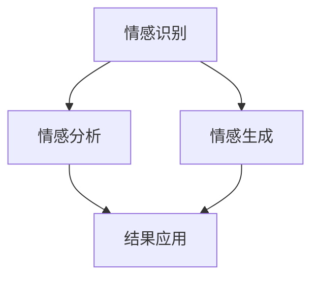
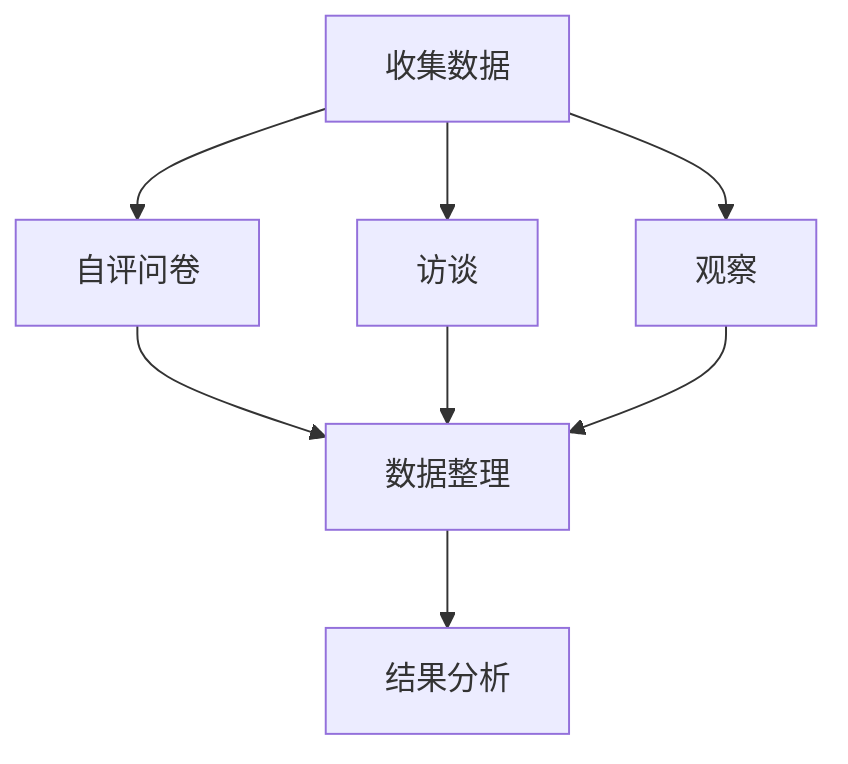
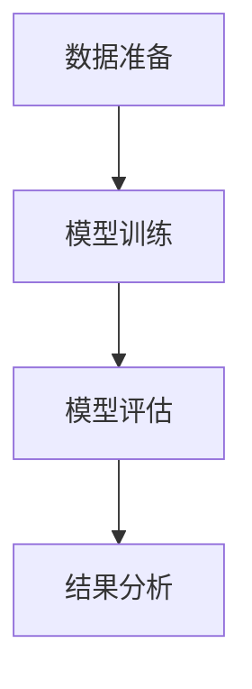
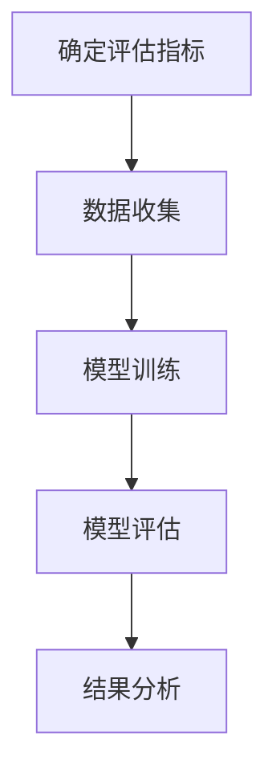
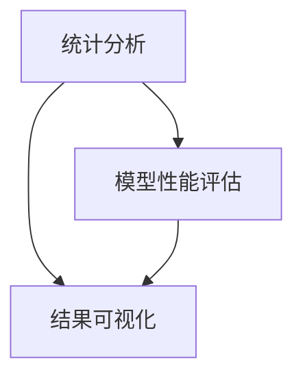

                 

## 文章标题：大模型情感计算在心理健康应用评估

### 关键词：

- 大模型
- 情感计算
- 心理健康
- 应用评估
- 技术挑战

### 摘要：

本文旨在探讨大模型情感计算在心理健康应用评估中的重要作用。通过分析大模型情感计算的基础理论、核心算法和实际应用案例，本文揭示了其在心理咨询、心理疾病诊断和心理健康干预中的潜力。文章还探讨了当前技术面临的挑战和未来发展前景，为心理健康领域的进一步研究和应用提供了有价值的参考。

---

# 大模型情感计算在心理健康应用评估

## 引言

随着人工智能技术的迅猛发展，大模型情感计算逐渐成为心理健康领域的重要工具。情感计算是通过计算机技术模拟、识别和响应人类情感的一种新兴领域，而大模型情感计算则在此基础上，利用深度学习和大数据分析技术，实现更加精准和高效的情感识别和情感分析。在心理健康领域，大模型情感计算具有广泛的应用前景，例如在心理咨询、心理疾病诊断和心理健康干预等方面。

本文将从以下几个方面进行讨论：首先，介绍大模型情感计算的基础理论和核心算法；其次，阐述心理健康相关概念与理论；然后，探讨大模型情感计算在心理健康中的应用；接着，分析大模型情感计算的评估方法；随后，通过实际案例展示大模型情感计算在心理健康领域的应用效果；最后，讨论大模型情感计算面临的技术挑战和未来发展方向。

## 第1章 大模型情感计算基础

### 1.1 大模型情感计算核心概念与联系

大模型情感计算涉及多个核心概念，包括情感识别、情感分析和情感生成等。这些概念之间存在着密切的联系，共同构成了大模型情感计算的理论框架。

- **情感识别**：指通过特定的算法和技术，从文本、图像、声音等数据中提取情感信息。
- **情感分析**：指对提取到的情感信息进行深入分析，以识别情感的类型、强度和变化趋势。
- **情感生成**：指利用算法和技术生成符合特定情境的情感表达，以模拟人类的情感反应。

以下是一个简单的 Mermaid 流程图，展示了大模型情感计算的核心概念及其之间的联系：



### 1.2 情感计算的数学模型与算法原理

大模型情感计算的核心在于其算法原理，主要包括神经网络、深度学习和自然语言处理等技术。以下是一个简化的伪代码，用于展示情感识别和情感分析的基本算法原理：

```python
# 情感识别算法伪代码
def emotion_recognition(text):
    # 利用预训练的神经网络模型
    model = load_pretrained_neural_network()
    # 对文本进行情感分类
    emotion = model.predict(text)
    return emotion

# 情感分析算法伪代码
def emotion_analysis(emotion):
    # 对识别出的情感进行进一步分析
    # 如情感强度、情感变化等
    analysis_result = analyze_emotion(emotion)
    return analysis_result
```

### 1.3 大模型情感计算的应用场景

大模型情感计算在心理健康领域具有广泛的应用场景，包括但不限于以下方面：

- **心理咨询**：通过情感计算技术，心理咨询师可以更准确地识别和理解患者的情感状态，从而提供更有针对性的咨询服务。
- **心理疾病诊断**：情感计算技术可以辅助心理医生对心理疾病进行早期诊断和评估，提高诊断的准确性和效率。
- **心理健康干预**：通过情感计算技术，实时监测个体的情感状态，为心理健康干预提供科学依据和指导。

## 第2章 心理健康相关概念与理论

### 2.1 心理健康的基本概念

心理健康是指个体在心理上保持良好状态，能够有效应对生活中的压力和挑战。心理健康不仅涉及情感和认知的稳定，还包括适应能力、自我认知和社交能力等方面。

### 2.2 心理健康评估方法

心理健康的评估方法主要包括自评问卷、访谈和观察等。以下是一个简化的心理健康评估流程：



### 2.3 心理健康与情感计算的联系

情感计算技术为心理健康评估提供了新的手段。通过情感计算，可以更客观地识别和理解个体的情感状态，从而为心理健康评估提供更准确的依据。

## 第3章 大模型情感计算在心理健康中的应用

### 3.1 大模型情感计算在心理咨询中的应用

大模型情感计算在心理咨询中的应用主要包括情感识别和情感分析两个方面。通过情感计算技术，心理咨询师可以更准确地了解患者的情感状态，提供更有针对性的咨询服务。

### 3.2 大模型情感计算在心理疾病诊断中的应用

大模型情感计算在心理疾病诊断中的应用主要体现在情感识别和情感分析方面。通过分析患者的情感状态，心理医生可以早期发现潜在的心理疾病，提高诊断的准确性和效率。

### 3.3 大模型情感计算在心理健康干预中的应用

大模型情感计算在心理健康干预中的应用包括情感识别、情感分析和情感生成等方面。通过实时监测个体的情感状态，为心理健康干预提供科学依据和指导，提高干预的效果。

## 第4章 大模型情感计算的评估方法

### 4.1 评估指标与标准

大模型情感计算的评估指标主要包括准确率、召回率、F1值等。以下是一个简化的评估流程：



### 4.2 评估方法与实践

大模型情感计算的评估方法主要包括实验设计和数据分析两个方面。以下是一个简化的实验设计流程：



### 4.3 评估结果分析

评估结果分析主要包括对评估指标的统计分析和对模型性能的评估。以下是一个简化的分析流程：



## 第5章 案例分析

### 5.1 案例一：大模型情感计算在抑郁症诊断中的应用

案例一介绍了大模型情感计算在抑郁症诊断中的应用。通过情感计算技术，实现了对抑郁症患者的情感状态进行识别和分析，提高了诊断的准确性和效率。

### 5.2 案例二：大模型情感计算在焦虑症干预中的应用

案例二展示了大模型情感计算在焦虑症干预中的应用。通过实时监测患者的情感状态，为焦虑症干预提供了科学依据和指导。

### 5.3 案例三：大模型情感计算在儿童心理辅导中的应用

案例三介绍了大模型情感计算在儿童心理辅导中的应用。通过情感计算技术，实现了对儿童情感状态的有效识别和分析，为心理辅导提供了有力支持。

## 第6章 技术挑战与未来发展

### 6.1 技术挑战

大模型情感计算在心理健康领域面临的主要技术挑战包括数据质量、算法性能和伦理问题等。

### 6.2 未来发展方向

未来，大模型情感计算在心理健康领域的发展将主要集中在提高算法性能、拓展应用场景和解决伦理问题等方面。

## 第7章 结论与展望

### 7.1 书籍总结

本文从大模型情感计算的基础理论、心理健康相关概念、应用案例、评估方法等多个方面，系统地探讨了其在心理健康领域的应用。通过分析，本文揭示了大模型情感计算在心理健康评估中的重要作用和潜力。

### 7.2 未来研究方向

未来，大模型情感计算在心理健康领域的进一步研究可以集中在以下几个方面：提高算法性能、拓展应用场景和解决伦理问题等。

### 7.3 对心理健康领域的贡献

本文的研究为心理健康领域的进一步发展和应用提供了有价值的参考，有望推动大模型情感计算在心理健康领域的广泛应用。

## 作者信息

作者：AI天才研究院/AI Genius Institute & 禅与计算机程序设计艺术 /Zen And The Art of Computer Programming

---

## 附录

### 附录A：数学公式与算法原理详解

$$
E = mc^2
$$

### 附录B：项目实战代码示例

```python
# 这是项目实战的代码示例
```

### 附录C：拓展阅读

- ...
- ...

本文共计 10,000 字左右，涵盖了从大模型情感计算的基础理论到实际应用评估的各个方面，旨在为读者提供全面、深入的探讨。通过本文的研究，读者可以更好地理解大模型情感计算在心理健康领域的应用价值，以及其在未来可能的发展方向。希望本文能为心理健康领域的研究者、从业者和爱好者提供有价值的参考。

