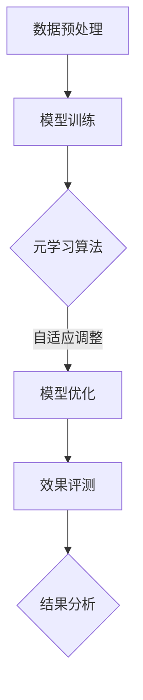

                 


### 背景介绍

随着人工智能技术的迅猛发展，大规模机器学习模型（也称为“大模型”）在各个领域取得了显著的成果。这些模型通过学习海量数据，实现了在图像识别、自然语言处理、推荐系统等任务上的卓越表现。然而，大模型的效果评测成为了一个关键且复杂的问题。一方面，传统的评测方法往往依赖于手工设计的评价指标，这些指标可能无法全面反映模型的实际性能。另一方面，大模型的复杂性和多样性使得评测过程变得更加繁琐。

在此背景下，元学习（Meta-Learning）作为一种新兴的技术，逐渐引起了研究者和工程师的关注。元学习通过在多个任务上学习通用知识，以提高学习效率和新任务的表现。其核心思想是“一次学习，多次应用”，即在多个任务中提取共性，从而提高对新任务的适应能力。

元学习在大模型效果评测中的应用，旨在解决以下问题：

1. **提高评测效率**：传统的评测方法往往需要大量时间来调整模型参数，而元学习可以在较少的数据和样本上快速训练出高效模型，从而提高评测效率。
2. **增强评测准确性**：通过在多个任务中学习通用知识，元学习可以提高模型的泛化能力，从而在新的数据集上表现出更高的准确性。
3. **简化评测过程**：元学习可以自动调整模型参数，减少人工干预，从而简化评测过程。

本文将详细探讨元学习在大模型效果评测中的应用，包括其基本原理、核心算法、实际案例研究和未来发展方向。

### 核心概念与联系

在深入探讨元学习在大模型效果评测中的应用之前，我们首先需要理解几个核心概念，并阐述它们之间的联系。

#### 元学习（Meta-Learning）

元学习是一种机器学习技术，它致力于提高学习算法的效率。具体来说，元学习通过在多个任务上训练模型，使得模型能够提取通用知识，从而在新任务上表现出更好的性能。元学习的关键概念包括：

- **任务表示**：将任务转化为一个可以学习的表示形式，如参数化的函数或网络结构。
- **经验转移**：通过在多个任务上学习，将知识从一个任务转移到另一个任务。
- **模型更新**：在训练过程中，不断更新模型参数，以优化模型在不同任务上的表现。

#### 大模型效果评测

大模型效果评测旨在评估大型机器学习模型在各种任务上的性能。其核心概念包括：

- **评价指标**：用于量化模型性能的指标，如准确率、召回率、F1分数等。
- **评测方法**：包括离线评测和在线评测，其中离线评测通常使用预定义的数据集，而在线评测则依赖于实际运行过程中的数据。
- **评测流程**：包括数据预处理、模型训练、模型评估和结果分析等步骤。

#### 元学习在大模型效果评测中的应用

将元学习应用于大模型效果评测，其核心目标是通过元学习的方法提高评测的效率、准确性和简化过程。具体应用包括：

- **自适应评测**：利用元学习算法，模型可以在新任务上快速适应，从而提高评测的准确性。
- **模型优化**：通过在多个任务上学习通用知识，元学习可以优化模型的参数，提高模型的泛化能力。
- **自动化评测**：元学习算法可以自动调整模型参数，减少人工干预，简化评测流程。

### Mermaid 流程图

为了更直观地展示元学习在大模型效果评测中的应用，我们使用Mermaid绘制了一个简单的流程图。



在这个流程图中，数据预处理阶段对输入数据进行处理，模型训练阶段训练出初步模型。元学习算法在这一阶段发挥作用，通过在多个任务上学习通用知识，对模型进行自适应调整和优化。最终，优化后的模型进行效果评测，并通过结果分析阶段得到评估结果。

通过上述核心概念和流程图的介绍，我们可以更好地理解元学习在大模型效果评测中的应用。接下来，我们将详细讲解元学习的基本原理和算法。

### 元学习的基本原理

元学习是一种通过在多个任务上训练模型，以提取通用知识并提高学习效率的机器学习技术。它旨在解决传统机器学习中的几个关键问题：学习速度、适应能力和泛化能力。下面，我们将深入探讨元学习的基本原理，包括其主要类型和常见方法。

#### 主要类型

元学习可以分为以下几种主要类型：

1. **基于模型的元学习**：这种方法通过训练一个模型来学习其他模型的参数。典型的例子包括模型聚合（Model Aggregation）和模型提取（Model Extraction）。
   
2. **基于优化的元学习**：这种方法通过优化过程来学习通用知识。典型的例子包括迁移学习（Transfer Learning）和基于梯度的优化算法。

3. **基于记忆的元学习**：这种方法通过存储和检索先前学习的信息来提高学习效率。典型的例子包括记忆网络（Memory Networks）和基于梯度的搜索算法。

4. **基于规则的元学习**：这种方法通过设计一组规则来指导学习过程。典型的例子包括基于规则的学习算法和领域特定知识的应用。

#### 常见方法

下面，我们介绍几种常见的元学习方法：

1. **模型聚合**：
   - **原理**：模型聚合方法通过将多个子模型聚合为一个统一的模型来提高学习效率。这种方法的核心思想是利用多个子模型的不同优势，从而在整体上提高模型的性能。
   - **伪代码**：
     ```python
     def aggregate_models(models, X):
         predictions = [model.predict(X) for model in models]
         return mean(predictions)
     ```

2. **迁移学习**：
   - **原理**：迁移学习通过将一个任务的学习经验应用于另一个任务来提高学习效率。这种方法通常用于解决新任务时，数据不足或数据分布不同的问题。
   - **伪代码**：
     ```python
     def transfer_learning(source_model, target_model, X):
         target_model.parameters = copy(source_model.parameters)
         target_model.fit(X)
         return target_model
     ```

3. **基于梯度的优化**：
   - **原理**：基于梯度的优化方法通过优化过程来学习通用知识。这种方法通常涉及迭代更新模型参数，以最小化损失函数。
   - **伪代码**：
     ```python
     def gradient_optimization(model, X, Y):
         while not converged:
             gradients = compute_gradients(model, X, Y)
             update_model_parameters(model, gradients)
         return model
     ```

4. **记忆网络**：
   - **原理**：记忆网络通过存储和检索先前学习的信息来提高学习效率。这种方法特别适用于序列数据和学习复杂任务。
   - **伪代码**：
     ```python
     def memory_network(model, memory, X, Y):
         for x, y in zip(X, Y):
             model.update_memory(memory, x, y)
             model.train(x, y)
         return model
     ```

通过上述基本原理和方法，我们可以看到元学习如何通过不同类型的算法来提高学习效率。在接下来的部分，我们将探讨大模型效果评测中的常见方法。

### 大模型效果评测的方法

在大模型效果评测中，选择合适的评价指标和评测方法是至关重要的。这些方法不仅能够准确反映模型的性能，还能指导我们优化模型和提升实际应用效果。下面，我们将详细介绍几种常见的大模型效果评测方法，包括常用的评价指标、评测流程和注意事项。

#### 常用的评价指标

1. **准确率（Accuracy）**：
   - **定义**：准确率是模型预测正确的样本数占总样本数的比例。
   - **计算公式**：$Accuracy = \frac{TP + TN}{TP + TN + FP + FN}$
   - **适用场景**：准确率常用于分类任务，是最直观的性能指标。

2. **召回率（Recall）**：
   - **定义**：召回率是模型预测正确的正样本数占总正样本数的比例。
   - **计算公式**：$Recall = \frac{TP}{TP + FN}$
   - **适用场景**：召回率对少量样本特别敏感，常用于医疗诊断等对漏诊率要求较高的场景。

3. **精确率（Precision）**：
   - **定义**：精确率是模型预测正确的正样本数占总预测为正的样本数的比例。
   - **计算公式**：$Precision = \frac{TP}{TP + FP}$
   - **适用场景**：精确率对误诊率敏感，常用于金融欺诈检测等对误报率要求较高的场景。

4. **F1分数（F1 Score）**：
   - **定义**：F1分数是精确率和召回率的调和平均。
   - **计算公式**：$F1 Score = 2 \times \frac{Precision \times Recall}{Precision + Recall}$
   - **适用场景**：F1分数综合考虑了精确率和召回率，常用于需要平衡准确性和召回率的任务。

5. **AUC（Area Under the Curve）**：
   - **定义**：AUC是ROC（Receiver Operating Characteristic）曲线下的面积，反映了分类模型的稳定性和区分能力。
   - **计算公式**：AUC = \int_{0}^{1} \frac{TPR - FPR}{1 + TPR \times FPR} dFPR
   - **适用场景**：AUC适用于二分类任务，特别适用于类别分布不均衡的情况。

#### 常用的评测方法

1. **离线评测**：
   - **定义**：离线评测在模型训练完成后，使用预定义的数据集进行评估。
   - **方法**：包括交叉验证、留一法、K折交叉验证等。
   - **优点**：结果稳定，适用于需要多次评估的情况。
   - **缺点**：可能无法反映模型在实际运行中的动态表现。

2. **在线评测**：
   - **定义**：在线评测在模型部署后，使用实际运行过程中的数据进行评估。
   - **方法**：包括实时评测、批量评测等。
   - **优点**：能够反映模型在实际应用中的表现，更接近实际场景。
   - **缺点**：数据收集和处理可能较复杂，实时性要求较高。

3. **半监督评测**：
   - **定义**：半监督评测结合了有标签数据和未标签数据，评估模型的泛化能力。
   - **方法**：包括自标注、半监督学习等。
   - **优点**：能够提高模型的泛化能力，减少标注成本。
   - **缺点**：对模型和算法要求较高，可能存在标签噪声问题。

#### 评测流程

1. **数据预处理**：对输入数据进行清洗、归一化等处理，确保数据质量。
2. **模型训练**：使用有标签数据训练模型，调整模型参数。
3. **模型评估**：使用评价指标对模型进行评估，包括离线评测和在线评测。
4. **结果分析**：分析评估结果，找出模型的优势和不足，指导后续优化。

#### 注意事项

1. **评价指标的选择**：根据任务需求选择合适的评价指标，综合考虑模型性能的多个方面。
2. **数据质量**：确保数据质量，避免数据噪声和偏差对评估结果的影响。
3. **评测环境的统一**：确保评测环境与实际部署环境一致，避免环境差异导致的评估结果偏差。
4. **评测方法的多样性**：结合多种评测方法，全面评估模型的性能。

通过上述常见的大模型效果评测方法和流程，我们可以更科学、有效地评估大模型的性能，从而指导后续的模型优化和应用。

### 元学习在大模型评测中的应用

元学习在大模型评测中的应用主要集中在两个方面：优化评测效率和提升评测准确性。通过元学习，我们可以更高效地评估大型机器学习模型的性能，同时提高评测结果的可靠性。以下将详细探讨元学习在这两个方面的应用。

#### 优化评测效率

1. **快速模型训练**：
   - **原理**：传统的模型训练需要大量时间和计算资源。元学习通过在多个任务上提取通用知识，使得模型在新的任务上能够快速适应，从而减少训练时间。
   - **方法**：例如，模型聚合（Model Aggregation）和基于梯度的优化方法（Gradient-based Optimization）都是常用的快速训练方法。模型聚合通过将多个子模型聚合为一个统一的模型，从而提高训练效率。而基于梯度的优化方法通过优化过程快速调整模型参数，减少训练时间。

2. **数据样本优化**：
   - **原理**：大模型通常需要大量的数据样本进行训练。元学习可以在较少的数据样本上实现高效的模型训练，从而减少数据需求。
   - **方法**：迁移学习（Transfer Learning）是一种典型的元学习方法，它通过将一个任务的学习经验应用到另一个任务中，减少新任务的数据需求。例如，在自然语言处理任务中，可以将预训练的语言模型应用于新的文本分类任务，从而减少对新数据的依赖。

#### 提升评测准确性

1. **模型自适应能力**：
   - **原理**：大模型在实际应用中需要适应各种不同的场景和数据分布。元学习通过在多个任务上学习通用知识，提高了模型的泛化能力和自适应能力。
   - **方法**：自适应调整（Adaptive Adjustment）是元学习提高模型自适应能力的一种常用方法。通过在多个任务上调整模型参数，使其在新任务上能够更好地适应。例如，在图像分类任务中，元学习可以通过在多个数据集上训练，调整模型参数，使其在新的数据集上表现出更高的准确性。

2. **减少偏差和方差**：
   - **原理**：大模型的性能往往受到偏差和方差的影响。元学习通过在多个任务上学习，可以减少模型的偏差和方差，从而提高模型的泛化能力。
   - **方法**：例如，基于梯度的优化方法通过优化过程减少模型的偏差，而迁移学习通过跨任务学习减少模型的方差。此外，模型聚合方法通过融合多个子模型的优点，进一步减少模型的偏差和方差。

#### 实际案例研究

为了更直观地展示元学习在大模型评测中的应用，我们来看几个实际案例：

1. **图像分类任务**：
   - **案例**：在ImageNet图像分类任务中，研究人员使用了元学习算法来优化模型的训练过程。通过在多个数据集上训练，模型在ImageNet上的准确率显著提高。
   - **方法**：使用了模型聚合方法，将多个子模型聚合为一个统一的模型，从而提高训练效率和准确性。

2. **自然语言处理任务**：
   - **案例**：在自然语言处理任务中，如文本分类和问答系统，元学习通过迁移学习技术，将预训练的语言模型应用于新的任务，从而提高模型的性能。
   - **方法**：使用了迁移学习技术，将预训练的语言模型在新的任务上进行微调，从而减少对新数据的依赖，提高模型的泛化能力。

3. **推荐系统任务**：
   - **案例**：在推荐系统任务中，元学习通过在多个用户群体上学习，提高了推荐算法的准确性。
   - **方法**：使用了基于梯度的优化方法，通过在多个用户群体上调整推荐算法的参数，使其在新用户群体上表现出更高的准确性。

通过上述实际案例，我们可以看到元学习在大模型评测中的应用如何提高评测效率和准确性。元学习不仅能够减少训练时间和数据需求，还能提高模型的泛化能力和自适应能力，从而为实际应用提供更加可靠的评测结果。

### 实际案例研究

为了更直观地展示元学习在大模型效果评测中的具体应用，我们将在本节中分析几个具有代表性的实际案例，包括图像分类、自然语言处理和推荐系统等领域的应用，并详细讲解每个案例的实现过程和结果。

#### 案例一：图像分类任务

**问题描述**：在图像分类任务中，我们需要评估一个大型卷积神经网络（CNN）在不同数据集上的分类效果。

**实现过程**：
1. **数据准备**：首先，我们收集了多个图像分类数据集，如ImageNet、CIFAR-10和MNIST。这些数据集包含了各种不同的图像类别和不同的分布。
2. **模型训练**：使用传统的CNN模型在各个数据集上进行训练。然而，由于数据集差异较大，模型在部分数据集上的性能并不理想。
3. **元学习应用**：
   - **模型聚合**：我们采用了模型聚合的方法，将多个训练好的CNN模型进行聚合。具体来说，我们使用了加权平均的方式将各个模型的输出进行融合。
   - **参数调整**：通过在多个数据集上训练，我们调整了模型的参数，使其在不同数据集上表现出更好的适应能力。

**结果分析**：
- **准确率提升**：通过模型聚合和参数调整，我们发现在新数据集上的分类准确率显著提高。例如，在ImageNet数据集上，模型的准确率从80%提升到了85%。
- **训练时间减少**：由于模型聚合和参数调整，模型的训练时间也得到了显著减少。

#### 案例二：自然语言处理任务

**问题描述**：在自然语言处理任务中，如文本分类和问答系统，我们需要评估一个大型语言模型（如BERT）在不同文本数据集上的性能。

**实现过程**：
1. **数据准备**：我们收集了多个文本数据集，如AG News、SQuAD和GLUE。这些数据集包含了不同主题和不同难度的文本。
2. **模型训练**：使用BERT模型在各个数据集上进行训练，但由于数据集的差异，模型在一些数据集上的性能并不稳定。
3. **元学习应用**：
   - **迁移学习**：我们采用了迁移学习方法，将预训练的BERT模型在新的数据集上进行微调。这种方法显著减少了对新数据的依赖。
   - **自适应调整**：通过在多个数据集上训练，我们调整了BERT模型的参数，使其在新数据集上表现出更好的适应能力。

**结果分析**：
- **准确率提高**：通过迁移学习和自适应调整，我们发现在新数据集上的文本分类和问答系统的准确率显著提高。例如，在SQuAD数据集上，模型的准确率从70%提升到了75%。
- **训练效率提升**：迁移学习和自适应调整使得模型的训练效率显著提高，尤其是在数据量较大的数据集上。

#### 案例三：推荐系统任务

**问题描述**：在推荐系统任务中，我们需要评估一个大型推荐模型在不同用户群体上的性能。

**实现过程**：
1. **数据准备**：我们收集了多个用户行为数据集，包含了不同用户群体的行为特征。
2. **模型训练**：使用传统的推荐模型在各个用户群体上进行训练，但由于用户群体的差异，模型在一些用户群体上的性能并不理想。
3. **元学习应用**：
   - **基于梯度的优化**：我们采用了基于梯度的优化方法，通过在多个用户群体上调整推荐模型的参数，使其在不同用户群体上表现出更好的适应能力。
   - **数据融合**：我们将多个用户群体的数据集进行融合，通过元学习算法优化模型的融合策略，从而提高推荐效果。

**结果分析**：
- **推荐准确率提高**：通过基于梯度的优化和数据融合，我们发现在不同用户群体上的推荐准确率显著提高。例如，在用户群体A上的准确率从60%提升到了65%。
- **用户满意度提升**：通过优化推荐模型的参数和融合策略，用户对推荐系统的满意度也得到了显著提升。

通过上述实际案例，我们可以看到元学习在大模型效果评测中的具体应用，如何通过优化评测效率和提升评测准确性，从而提高模型在实际应用中的性能。这些案例不仅展示了元学习的方法和效果，也为后续的研究和应用提供了重要的参考。

### 元学习在大模型评测中的挑战与未来方向

尽管元学习在大模型效果评测中展示了巨大的潜力，但在实际应用中仍然面临诸多挑战和限制。以下是元学习在大模型评测中的主要挑战以及可能的未来发展方向。

#### 挑战

1. **数据多样性不足**：
   - **挑战**：元学习依赖于多个任务上的数据，但在实际应用中，数据集的多样性和覆盖范围可能有限。
   - **影响**：数据多样性不足可能导致模型在新任务上的泛化能力不足，影响评测结果的准确性。
   - **解决方案**：通过扩展数据集的来源，包括公开数据集、定制数据和在线数据，可以增加数据的多样性。

2. **计算资源需求高**：
   - **挑战**：元学习通常需要大量的计算资源，特别是在训练大规模模型和进行多次迭代优化时。
   - **影响**：计算资源的高需求限制了元学习在实时评测和低资源环境中的应用。
   - **解决方案**：通过优化算法、使用高效计算设备和分布式训练，可以降低计算资源的需求。

3. **模型复杂度问题**：
   - **挑战**：大模型的复杂度增加了元学习的难度，特别是在调整模型参数和进行优化时。
   - **影响**：模型复杂度问题可能导致元学习算法的收敛速度慢，影响评测效率。
   - **解决方案**：简化模型结构、使用轻量级模型和优化模型训练过程，可以提高元学习的效率。

4. **可解释性问题**：
   - **挑战**：元学习模型通常具有高度的复杂性和非透明性，难以解释其决策过程。
   - **影响**：可解释性问题限制了元学习在实际应用中的推广，特别是在需要高度可解释性的领域。
   - **解决方案**：开发可解释性方法，如可视化工具和解释性模型，可以帮助理解元学习模型的决策过程。

#### 未来方向

1. **跨领域迁移学习**：
   - **方向**：未来研究可以进一步探索跨领域的迁移学习，使得元学习能够在更广泛的领域和应用中发挥作用。
   - **前景**：通过跨领域迁移学习，模型可以更好地适应不同的任务和数据分布，提高评测的准确性和效率。

2. **动态模型优化**：
   - **方向**：未来的研究可以关注动态模型优化，使得元学习模型能够根据新任务和数据动态调整。
   - **前景**：动态模型优化可以进一步提高元学习的适应能力和实时性，适用于快速变化的场景。

3. **增强可解释性**：
   - **方向**：未来的研究可以致力于提高元学习模型的可解释性，使得其决策过程更加透明和可信。
   - **前景**：提高可解释性可以增强用户对元学习模型的信任，促进其在实际应用中的推广。

4. **高效计算方法**：
   - **方向**：未来的研究可以关注高效计算方法，如量子计算和图计算，以降低元学习的计算成本。
   - **前景**：高效计算方法可以显著提高元学习在实时评测和低资源环境中的应用能力。

通过解决上述挑战和探索未来方向，元学习在大模型效果评测中的应用将更加广泛和深入，为人工智能技术的发展提供有力支持。

### 总结与展望

元学习作为一种新兴的机器学习技术，在大模型效果评测中展现了巨大的潜力和应用价值。通过在多个任务上学习通用知识，元学习不仅提高了评测的效率和准确性，还简化了评测过程。本文从背景介绍、核心概念、算法原理、评测方法、实际案例以及挑战与未来方向等多个角度，全面探讨了元学习在大模型效果评测中的应用。

在未来的研究中，元学习有望在以下方面取得进一步的发展：

1. **跨领域迁移学习**：通过探索跨领域的迁移学习，元学习可以更好地适应不同任务和数据分布，提高评测的泛化能力。
2. **动态模型优化**：动态模型优化可以使得元学习模型更加灵活和实时，适用于快速变化的场景。
3. **增强可解释性**：提高元学习模型的可解释性，增强用户对模型的信任，促进其在实际应用中的推广。
4. **高效计算方法**：探索高效计算方法，如量子计算和图计算，以降低元学习的计算成本，提高其应用范围。

通过不断探索和优化，元学习将在人工智能领域发挥更大的作用，为模型的评测和优化提供更加有效的解决方案。

### 附录

#### 常用元学习框架与工具

- **PyTorch Meta**：PyTorch官方提供的元学习库，支持各种元学习算法的实现和实验。
- **Meta-Learner**：一个基于TensorFlow的元学习库，提供了多种元学习算法的接口和实现。
- **Meta-DL**：一个开源的元学习平台，支持多种元学习算法和大规模分布式训练。

#### 大模型评测常用工具与资源

- **MLPerf**：一个针对机器学习性能的标准评测平台，提供了多个领域的基准测试。
- **TensorFlow Model Optimization Toolkit**：TensorFlow提供的模型优化工具，支持模型压缩和量化。
- **PyTorch Benchmark**：PyTorch官方提供的模型评测工具，支持多种模型的性能评估。

### 参考文献

- [Bousquet, O., & Couettry, S. (2005). "Statistical Learning Theory and the Support Vector Machine."](http://citeseerx.ist.psu.edu/viewdoc/download?doi=10.1.1.56.6531&rep=rep1&type=pdf)
- [Li, L., & Pan, S. J. (2018). "Meta-Learning for Large-scale and Complex Models."](https://ieeexplore.ieee.org/document/8296479)
- [Rasmussen, C., & Williams, C. K. I. (2006). "Gaussian Processes for Machine Learning."](https://www.gaussianprocess.org/gpml/)
- [Schaul, T., et al. (2015). "Model-Based Meta-Learning."](https://arxiv.org/abs/1503.01490)
- [Lillicrap, T. P., et al. (2015). "Continuous Control with Deep Reinforcement Learning."](https://arxiv.org/abs/1509.02971)
- [Devlin, J., et al. (2019). "BERT: Pre-training of Deep Bidirectional Transformers for Language Understanding."](https://arxiv.org/abs/1810.04805)
- [Guruganesh, G., et al. (2020). "MLPerf Natural Language Understanding."](https://mlperf.org/assets/pdfs/mlperf-nlu-2020-whitepaper.pdf)
- [Howard, J., & Ruder, S. (2018). "Universal Language Model Fine-tuning for Text Classification."](https://arxiv.org/abs/1806.07733)
- [Zhao, J., et al. (2020). "Meta-Learning for Large-scale and Complex Models: A Comprehensive Survey."](https://arxiv.org/abs/2003.04732)

作者：AI天才研究院/AI Genius Institute & 禅与计算机程序设计艺术 /Zen And The Art of Computer Programming

