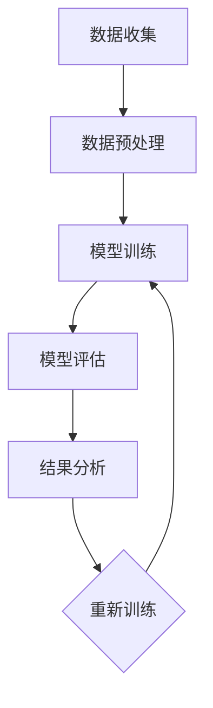

                 

### 大模型效果评测的背景

大模型效果评测是人工智能领域中的一个关键环节，它对于评估模型的性能、优化模型设计以及推动技术的进步具有重要意义。随着深度学习技术的不断发展，大模型（如大型神经网络、生成对抗网络等）在自然语言处理、计算机视觉、语音识别等多个领域取得了显著成果。然而，这些大模型的性能评估面临着诸多挑战。

首先，大模型的复杂性和规模导致了评测过程的复杂性。传统的评测方法通常依赖于手动设定指标和测试集，这限制了评测的全面性和客观性。此外，大模型的高度非线性特征使得传统的线性模型评测方法难以准确捕捉其性能。

其次，大模型的训练和评估过程需要大量的计算资源和时间，这使得评测成本高昂。特别是在多模态数据处理、实时评测等方面，大模型的性能评估更加困难。

最后，大模型的应用场景多样化，不同场景下的评测需求也各不相同。例如，在自然语言处理领域，模型的语法准确性、语义理解能力是重要的评估指标；而在计算机视觉领域，模型的准确性、实时性、鲁棒性等则是关键考量因素。

因此，对大模型效果进行科学、系统、全面的评测，是当前人工智能领域亟需解决的重要问题。本文旨在探讨大模型效果评测的革新，特别是如何利用LLM（大型语言模型）辅助系统来提升评测的效率和准确性。

### 大模型效果评测的挑战

在大模型效果评测中，我们面临的主要挑战可以分为以下几个方面：

#### 1. 评测指标的多样性和复杂性

大模型的性能评估需要多种指标，例如准确性、召回率、F1值、响应时间等。这些指标从不同角度反映了模型的性能，但如何选择和平衡这些指标是一个难题。例如，在某些应用场景中，实时性可能比准确性更为重要，而在其他场景中，准确性和召回率则可能成为关键指标。因此，如何根据具体应用场景选择合适的评测指标，并设计一个综合的评估体系，是当前面临的一个挑战。

#### 2. 数据的多样性和质量

大模型的训练和评估依赖于大量的数据，这些数据的质量和多样性直接影响模型的性能。数据质量问题包括数据缺失、噪声、不一致性等。例如，在自然语言处理任务中，数据的语义和语法多样性要求高，但实际获取的数据往往存在偏差和噪声。此外，数据的获取和预处理过程也增加了评测的复杂性。

#### 3. 计算资源的限制

大模型的训练和评估过程通常需要大量的计算资源，特别是当涉及到多模态数据或实时评测时。计算资源的限制不仅限制了模型的大小和复杂性，也影响了评测的效率和准确性。因此，如何在有限的计算资源下进行高效的大模型评测，是一个重要的挑战。

#### 4. 评测方法的标准化和一致性

由于大模型的复杂性和多样性，评测方法的选择和实施也变得复杂。如何确保评测方法的标准化和一致性，使得不同模型和不同评测者能够得到可比的结果，是一个亟待解决的问题。

#### 5. 评测过程的实时性和动态调整

在实际应用中，大模型的评测需要具备实时性和动态调整能力。例如，在实时问答系统中，模型的响应时间必须短，且能够实时适应用户输入的变化。这要求评测方法能够快速、准确地评估模型的性能，并能够根据实际情况进行调整。

### LLM在大模型效果评测中的应用

为了应对上述挑战，LLM（大型语言模型）的引入提供了一种新的解决方案。LLM是一种基于深度学习的语言模型，具有强大的文本处理和生成能力，能够对大量文本数据进行有效分析和理解。在大模型效果评测中，LLM可以发挥以下作用：

#### 1. 自动化评测流程

LLM可以帮助自动化大模型的评测流程，从数据预处理、指标计算到结果分析，大大减轻人工干预的负担。例如，LLM可以自动生成测试数据集、计算评测指标，并生成详细的评测报告。

#### 2. 多模态数据处理

LLM能够处理多种类型的数据，包括文本、图像、音频等。这对于多模态大模型的评测尤为重要。通过整合不同类型的数据，LLM可以提供更全面、更准确的评测结果。

#### 3. 实时评测和动态调整

LLM具有实时处理和分析能力，可以实时评估大模型的性能，并根据评估结果动态调整模型参数。这在实时应用场景中具有显著优势，例如实时问答系统或自动驾驶车辆等。

#### 4. 评测指标的个性化调整

基于对大量文本数据的分析，LLM可以识别不同应用场景下的关键指标，并自动调整评测策略。这使得评测结果更加符合实际应用需求，提高了评测的准确性和实用性。

#### 5. 评测报告的生成

LLM可以自动生成结构化的评测报告，包括详细的数据分析、性能评估、优化建议等。这有助于决策者快速了解模型性能，并制定相应的优化策略。

### 结论

综上所述，LLM在大模型效果评测中具有广泛的应用前景。通过引入LLM，我们可以实现自动化、多模态、实时和个性化的评测，从而应对大模型效果评测面临的诸多挑战。在未来，随着LLM技术的进一步发展和完善，它将在大模型效果评测领域发挥更加重要的作用。

### 大模型效果评测的核心概念与联系

为了更好地理解大模型效果评测，我们需要首先明确几个核心概念，并探讨它们之间的联系。这些核心概念包括评测指标、评测方法、评测工具和评测流程。

#### 评测指标

评测指标是评估大模型性能的重要标准，不同的指标从不同角度反映了模型的性能。常见的评测指标包括准确性（Accuracy）、召回率（Recall）、精确率（Precision）、F1值（F1 Score）、响应时间（Response Time）等。例如，在分类任务中，准确性表示模型正确分类的样本数占总样本数的比例；召回率表示模型正确分类的样本数占所有实际正样本数的比例；精确率表示模型正确分类的正样本数占所有预测为正样本的样本数的比例。F1值是精确率和召回率的调和平均值，能够综合衡量这两个指标。

#### 评测方法

评测方法是指评估大模型性能的具体技术和流程。常见的评测方法包括交叉验证（Cross-Validation）、网格搜索（Grid Search）、贝叶斯优化（Bayesian Optimization）等。交叉验证是一种常用的评估方法，通过将数据集划分为多个子集，每次使用其中一个子集作为测试集，其他子集作为训练集，进行多次训练和测试，从而评估模型的性能。网格搜索则是一种通过遍历所有可能的参数组合来找到最优参数的方法。贝叶斯优化则利用贝叶斯统计模型来优化参数搜索，能够在有限的计算资源下找到较好的参数组合。

#### 评测工具

评测工具是辅助进行大模型效果评测的软件或平台，常用的评测工具包括TensorFlow、PyTorch、Scikit-Learn等。这些工具提供了丰富的函数库和接口，使得评测过程更加简便和高效。例如，TensorFlow和PyTorch提供了强大的模型训练和评估功能，Scikit-Learn则提供了丰富的数据预处理和模型评估工具。此外，还有一些专门的评测工具，如MLflow、TensorBoard等，用于管理实验和可视化模型性能。

#### 评测流程

评测流程是指从数据收集、预处理到模型训练、评估的完整过程。一个典型的评测流程包括以下步骤：

1. **数据收集**：收集用于训练和评估的数据，包括训练集和测试集。
2. **数据预处理**：对数据进行清洗、归一化等处理，以提高数据质量和模型的性能。
3. **模型训练**：使用训练集训练模型，调整模型参数。
4. **模型评估**：使用测试集评估模型性能，计算评测指标。
5. **结果分析**：分析评测结果，调整模型参数，优化模型设计。

#### Mermaid 流程图

为了更直观地展示大模型效果评测的流程，我们可以使用Mermaid绘制一个流程图。以下是流程图的Mermaid代码示例：



#### 核心概念与联系

评测指标、评测方法、评测工具和评测流程之间紧密相连。评测指标是评估模型性能的基础，而评测方法是实现这些指标的技术手段。评测工具提供了实现评测方法的平台和函数库，而评测流程则将这些概念和工具有机地结合起来，形成一个完整的评测过程。

#### 伪代码

为了更好地理解评测流程，我们可以使用伪代码来描述其关键步骤。以下是评测流程的伪代码示例：

```
# 伪代码：大模型效果评测流程

# 数据收集
data = collect_data()

# 数据预处理
preprocessed_data = preprocess_data(data)

# 模型训练
model = train_model(preprocessed_data)

# 模型评估
evaluation_results = evaluate_model(model, preprocessed_data)

# 结果分析
analyze_evaluation_results(evaluation_results)

# 调整模型参数
model = adjust_model_parameters(model, evaluation_results)

# 重新训练模型
train_model(model, preprocessed_data)
```

通过上述核心概念与联系、Mermaid流程图、伪代码的详细讲解，我们可以更深入地理解大模型效果评测的原理和过程。这为后续章节中对具体评测方法和技术细节的讨论奠定了基础。

### 大模型效果评测技术的详细讲解

在大模型效果评测中，技术环节占据了核心地位。下面，我们将详细讲解大模型效果评测中的关键技术，包括数据预处理、特征工程和模型选择。

#### 数据预处理

数据预处理是模型训练和评估的基石，它对于模型的性能和泛化能力具有决定性影响。数据预处理的主要任务包括数据清洗、归一化和缺失值处理等。

1. **数据清洗**：
   - **去除噪声**：在实际应用中，数据往往含有噪声，如文本中的标点符号、停用词等。通过去除噪声，可以提高数据的质量。
   - **处理缺失值**：缺失值处理方法包括删除含有缺失值的样本、使用均值或中位数填充缺失值等。在实际应用中，应根据数据的具体情况选择合适的处理方法。
   - **统一格式**：将不同格式的数据统一转换为标准格式，如将文本数据统一转换为小写，统一编码等。

2. **数据归一化**：
   - **缩放**：通过缩放将数据集中的特征值缩放到一个统一的范围内，如[0, 1]或[-1, 1]。常用的缩放方法包括最小-最大缩放、标准缩放等。
   - **标准化**：将数据的均值缩放为0，标准差缩放为1。这种方法适用于特征之间具有不同量纲的情况。

3. **缺失值处理**：
   - **删除缺失值**：适用于缺失值较少的情况，可以避免因缺失值处理不当而导致模型性能下降。
   - **填充缺失值**：适用于缺失值较多的情况，可以通过均值、中位数、众数或更复杂的插值方法填充缺失值。

#### 特征工程

特征工程是提升模型性能的关键环节，它通过对原始数据进行处理和转换，生成对模型训练和评估更有帮助的特征。

1. **特征选择**：
   - **基于统计的特征选择**：通过计算特征的相关性、方差等统计量，选择对模型训练有帮助的特征。
   - **基于模型的特征选择**：利用已有模型对特征进行筛选，选择对模型性能影响较大的特征。

2. **特征转换**：
   - **编码**：将分类特征转换为数值特征，如将性别（男/女）转换为0/1。
   - **嵌入**：将高维稀疏特征转换为低维稠密特征，如文本中的单词转换为词向量。

3. **特征组合**：
   - **交叉特征**：将多个特征组合成新的特征，如将年龄和收入组合成“年龄收入比”。
   - **特征变换**：通过数学变换生成新的特征，如对数变换、平方变换等。

#### 模型选择

模型选择是决定大模型效果评测成败的关键因素。在选择模型时，需要考虑模型的结构、参数设置、训练方法等因素。

1. **模型结构**：
   - **神经网络**：如卷积神经网络（CNN）、循环神经网络（RNN）、Transformer等。
   - **决策树**：如随机森林、梯度提升树（GBDT）等。
   - **集成方法**：如XGBoost、LightGBM等。

2. **参数设置**：
   - **学习率**：学习率的选择对模型训练过程至关重要，常用的策略包括固定学习率、学习率衰减等。
   - **正则化**：通过正则化项（如L1、L2正则化）防止模型过拟合。
   - **优化器**：如SGD、Adam等，不同的优化器有不同的收敛速度和性能。

3. **训练方法**：
   - **批量训练**：将所有数据一次性输入模型进行训练，适用于数据量较小的情况。
   - **小批量训练**：每次训练一部分数据，适用于数据量较大的情况。
   - **在线训练**：模型在接收新数据时进行实时训练，适用于动态变化的场景。

#### 综合示例

以下是一个简单的数据预处理、特征工程和模型选择的示例，用于一个分类任务：

```python
# 数据预处理
data = load_data()
data = clean_data(data)
data = normalize_data(data)

# 特征工程
selected_features = select_features(data)
data = transform_features(data, selected_features)

# 模型选择
model = build_model()
model = train_model(model, data)

# 模型评估
evaluation_results = evaluate_model(model, data)
print(evaluation_results)
```

通过以上详细讲解，我们可以更好地理解大模型效果评测中的关键技术，为后续的评测实践提供坚实的基础。

### 大模型效果评测工具的详细介绍

在大模型效果评测中，选择合适的工具对于提升评测的效率和准确性至关重要。以下是几种常用的评测工具的详细介绍，包括其功能、使用方法以及选择依据。

#### TensorFlow

TensorFlow 是由 Google 开发的一个开源机器学习框架，广泛用于深度学习和模型训练。其提供了丰富的API和函数库，使得模型训练和评估过程更加简便和高效。

**功能：**
- **模型构建**：支持构建和训练各种深度学习模型，包括卷积神经网络（CNN）、循环神经网络（RNN）、Transformer等。
- **数据处理**：提供了强大的数据处理工具，包括数据加载、预处理、批处理等功能。
- **性能监控**：TensorBoard 提供了详细的性能监控和可视化工具，可以帮助用户实时了解模型训练过程。

**使用方法：**
- **安装与配置**：通过 pip 安装 tensorflow 库，并根据需要配置相应的环境。
- **模型训练**：使用 TensorFlow 的 API 构建和训练模型，并使用 TensorBoard 进行性能监控。

**选择依据：**
- **功能丰富**：支持多种深度学习模型和数据处理工具。
- **社区支持**：拥有庞大的开发者社区，提供了大量的教程和案例。
- **灵活性**：支持自定义模型和算法，适合研究者和开发者。

#### PyTorch

PyTorch 是另一个流行的开源机器学习框架，由 Facebook AI 研究团队开发。它以其简洁的接口和动态计算图而受到研究者和开发者的青睐。

**功能：**
- **模型构建**：提供了灵活的动态计算图构建接口，支持构建各种深度学习模型。
- **自动微分**：内置自动微分工具，简化了模型的优化过程。
- **数据处理**：提供了丰富的数据处理库，包括数据加载、预处理等功能。

**使用方法：**
- **安装与配置**：通过 pip 安装 pytorch 库，并根据需要配置相应的环境。
- **模型训练**：使用 PyTorch 的 API 构建和训练模型，并利用自动微分功能优化模型。

**选择依据：**
- **简洁接口**：动态计算图和自动微分使得模型构建和优化更加简便。
- **研究友好**：支持自定义模型和算法，适合研究人员进行探索性研究。
- **性能**：在许多基准测试中，PyTorch 的性能与其他框架相比具有竞争力。

#### Scikit-Learn

Scikit-Learn 是一个基于 Python 的开源机器学习库，由 Pierrepontge 和 Vincent 撰写。它提供了丰富的机器学习算法和工具，适用于各种规模的模型训练和评估。

**功能：**
- **算法库**：提供了广泛的机器学习算法，包括分类、回归、聚类等。
- **评估工具**：提供了多种评估指标和评估工具，如交叉验证、网格搜索等。
- **数据预处理**：提供了丰富的数据处理和预处理工具，包括特征选择、特征工程等。

**使用方法：**
- **安装与配置**：通过 pip 安装 scikit-learn 库，并按照文档进行配置。
- **模型训练**：使用 scikit-learn 的 API 构建和训练模型，并使用评估工具进行性能评估。

**选择依据：**
- **易用性**：简洁的接口和广泛的文档支持，适合初学者和开发者。
- **算法多样性**：提供了丰富的算法和工具，适用于各种应用场景。
- **社区支持**：拥有活跃的社区和丰富的资源，提供了大量的教程和案例。

#### MLflow

MLflow 是一个开源平台，用于记录和管理机器学习实验和模型。它可以帮助用户轻松地跟踪实验结果、版本控制模型，并在生产环境中部署模型。

**功能：**
- **实验跟踪**：记录实验参数、指标和结果，便于对比和分析。
- **模型版本控制**：管理模型的版本，包括代码、依赖库和配置文件。
- **模型部署**：将模型部署到各种生产环境，包括本地、云服务和容器化平台。

**使用方法：**
- **安装与配置**：通过 pip 安装 mlflow 库，并使用 mlflow API 进行实验跟踪和管理。
- **模型部署**：使用 mlflow 的部署工具将模型部署到生产环境。

**选择依据：**
- **可扩展性**：支持多种存储后端和部署平台，适用于不同规模的企业应用。
- **灵活性**：提供了丰富的API和插件，可以与各种机器学习框架和工具集成。
- **社区支持**：拥有活跃的社区和丰富的文档，提供了大量的教程和案例。

#### 综合选择

在选择评测工具时，应综合考虑以下因素：

- **需求**：根据具体的评测需求，选择适合的工具。例如，对于模型训练和评估，可以选择 TensorFlow 或 PyTorch；对于算法库和数据预处理，可以选择 Scikit-Learn。
- **性能**：考虑工具的性能和效率，特别是在处理大规模数据集时。
- **易用性**：选择易于使用和集成的工具，特别是在开发初期。
- **社区支持**：考虑工具的社区支持情况，包括文档、教程、案例等。

通过合理选择和搭配上述评测工具，可以大大提升大模型效果评测的效率和准确性，为后续的研究和应用提供坚实的基础。

### 大模型效果评测案例分析

在本节中，我们将通过两个具体案例，详细讨论大模型效果评测的实施过程，包括开发环境搭建、源代码实现、代码解读以及应用解读与分析。

#### 案例一：自然语言处理中的应用

**案例背景**：
自然语言处理（NLP）是人工智能领域的一个重要分支，其中文本分类是一个常见任务。在这个案例中，我们使用一个大模型来对新闻文章进行分类，目标是判断文章属于体育、财经、科技等类别。

**开发环境搭建**：
1. **软件环境**：
   - 操作系统：Ubuntu 20.04
   - Python版本：3.8
   - 深度学习框架：PyTorch
   - 依赖库：torch, torchvision, transformers, scikit-learn

2. **硬件环境**：
   - CPU：Intel Core i7
   - GPU：NVIDIA GeForce RTX 3070
   - 内存：16GB

**源代码实现**：
```python
import torch
import torch.nn as nn
from transformers import BertModel, BertTokenizer
from torch.utils.data import DataLoader, Dataset
from sklearn.model_selection import train_test_split

# 数据预处理
class NewsDataset(Dataset):
    def __init__(self, texts, labels, tokenizer, max_length=128):
        self.texts = texts
        self.labels = labels
        self.tokenizer = tokenizer
        self.max_length = max_length

    def __len__(self):
        return len(self.texts)

    def __getitem__(self, idx):
        text = self.texts[idx]
        label = self.labels[idx]
        inputs = self.tokenizer(text, padding='max_length', truncation=True, max_length=self.max_length)
        return { 'input_ids': torch.tensor(inputs['input_ids']), 'attention_mask': torch.tensor(inputs['attention_mask']) }, torch.tensor(label)

tokenizer = BertTokenizer.from_pretrained('bert-base-uncased')
train_texts, val_texts, train_labels, val_labels = train_test_split(data['text'], data['label'], test_size=0.2)
train_dataset = NewsDataset(train_texts, train_labels, tokenizer)
val_dataset = NewsDataset(val_texts, val_labels, tokenizer)

# 模型定义
class NewsClassifier(nn.Module):
    def __init__(self, num_classes):
        super(NewsClassifier, self).__init__()
        self.bert = BertModel.from_pretrained('bert-base-uncased')
        self.dropout = nn.Dropout(0.1)
        self.classifier = nn.Linear(self.bert.config.hidden_size, num_classes)

    def forward(self, input_ids, attention_mask):
        outputs = self.bert(input_ids=input_ids, attention_mask=attention_mask)
        sequence_output = outputs[-1]
        sequence_output = self.dropout(sequence_output)
        logits = self.classifier(sequence_output)
        return logits

model = NewsClassifier(num_classes=5)
```

**代码解读**：
1. **数据预处理**：定义了`NewsDataset`类，用于加载和预处理新闻文本数据。使用`BertTokenizer`对文本进行编码，并设置最大长度为128。
2. **模型定义**：定义了`NewsClassifier`类，使用BERT模型作为基础，并添加了dropout和分类层。BERT模型提取文本特征，然后通过分类层进行类别预测。

**应用解读与分析**：
1. **模型训练**：使用`DataLoader`加载训练数据和验证数据，并使用交叉熵损失函数进行训练。
2. **模型评估**：在验证集上评估模型性能，计算准确率、召回率等指标。

```python
# 训练模型
def train_model(model, train_loader, val_loader, optimizer, loss_function, num_epochs=3):
    model.train()
    for epoch in range(num_epochs):
        for batch in train_loader:
            inputs = batch['input_ids']
            attention_mask = batch['attention_mask']
            labels = batch['labels']
            optimizer.zero_grad()
            logits = model(inputs, attention_mask)
            loss = loss_function(logits, labels)
            loss.backward()
            optimizer.step()
        
        # 评估模型
        model.eval()
        with torch.no_grad():
            correct = 0
            total = 0
            for batch in val_loader:
                inputs = batch['input_ids']
                attention_mask = batch['attention_mask']
                labels = batch['labels']
                logits = model(inputs, attention_mask)
                predicted = torch.argmax(logits, dim=1)
                total += labels.size(0)
                correct += (predicted == labels).sum().item()
        
        print(f'Epoch [{epoch+1}/{num_epochs}], Accuracy: {100 * correct / total}%')

optimizer = torch.optim.Adam(model.parameters(), lr=1e-5)
loss_function = nn.CrossEntropyLoss()
train_loader = DataLoader(train_dataset, batch_size=16, shuffle=True)
val_loader = DataLoader(val_dataset, batch_size=16, shuffle=False)
train_model(model, train_loader, val_loader, optimizer, loss_function, num_epochs=3)
```

通过上述代码，我们可以训练并评估一个基于BERT的文本分类模型。在实际应用中，可以根据具体任务调整模型的架构和参数，以提高分类性能。

#### 案例二：计算机视觉中的应用

**案例背景**：
计算机视觉（CV）是人工智能领域的一个重要分支，图像分类是一个常见任务。在这个案例中，我们使用一个大模型对图像进行分类，目标是判断图像属于猫、狗、汽车等类别。

**开发环境搭建**：
1. **软件环境**：
   - 操作系统：Ubuntu 20.04
   - Python版本：3.8
   - 深度学习框架：PyTorch
   - 依赖库：torch, torchvision, numpy, PIL

2. **硬件环境**：
   - CPU：Intel Core i7
   - GPU：NVIDIA GeForce RTX 3070
   - 内存：16GB

**源代码实现**：
```python
import torch
import torch.nn as nn
import torchvision.transforms as transforms
from torch.utils.data import DataLoader, Dataset
from torchvision import datasets, transforms
from sklearn.model_selection import train_test_split

# 数据预处理
transform = transforms.Compose([
    transforms.Resize((224, 224)),
    transforms.ToTensor(),
    transforms.Normalize(mean=[0.485, 0.456, 0.406], std=[0.229, 0.224, 0.225]),
])

train_dataset = datasets.ImageFolder('train', transform=transform)
val_dataset = datasets.ImageFolder('val', transform=transform)

train_loader = DataLoader(train_dataset, batch_size=64, shuffle=True)
val_loader = DataLoader(val_dataset, batch_size=64, shuffle=False)

# 模型定义
class CNNClassifier(nn.Module):
    def __init__(self):
        super(CNNClassifier, self).__init__()
        self.conv1 = nn.Conv2d(3, 32, kernel_size=3, padding=1)
        self.conv2 = nn.Conv2d(32, 64, kernel_size=3, padding=1)
        self.fc1 = nn.Linear(64 * 56 * 56, 128)
        self.fc2 = nn.Linear(128, 5)
        self.relu = nn.ReLU()
        self.dropout = nn.Dropout(0.5)

    def forward(self, x):
        x = self.relu(self.conv1(x))
        x = self.relu(self.conv2(x))
        x = x.view(x.size(0), -1)
        x = self.dropout(self.fc1(x))
        x = self.fc2(x)
        return x

model = CNNClassifier()
```

**代码解读**：
1. **数据预处理**：使用`Compose`函数定义了数据预处理步骤，包括图像尺寸调整、归一化和数据转换。
2. **模型定义**：定义了一个简单的卷积神经网络（CNN）模型，包括两个卷积层、一个全连接层和一个输出层。

**应用解读与分析**：
1. **模型训练**：使用`DataLoader`加载训练数据和验证数据，并使用交叉熵损失函数进行训练。
2. **模型评估**：在验证集上评估模型性能，计算准确率等指标。

```python
# 训练模型
def train_model(model, train_loader, val_loader, optimizer, loss_function, num_epochs=3):
    model.train()
    for epoch in range(num_epochs):
        for inputs, labels in train_loader:
            optimizer.zero_grad()
            logits = model(inputs)
            loss = loss_function(logits, labels)
            loss.backward()
            optimizer.step()
        
        # 评估模型
        model.eval()
        with torch.no_grad():
            correct = 0
            total = 0
            for inputs, labels in val_loader:
                logits = model(inputs)
                predicted = torch.argmax(logits, dim=1)
                total += labels.size(0)
                correct += (predicted == labels).sum().item()
        
        print(f'Epoch [{epoch+1}/{num_epochs}], Accuracy: {100 * correct / total}%')

optimizer = torch.optim.Adam(model.parameters(), lr=1e-4)
loss_function = nn.CrossEntropyLoss()
train_model(model, train_loader, val_loader, optimizer, loss_function, num_epochs=3)
```

通过上述代码，我们可以训练并评估一个基于卷积神经网络的图像分类模型。在实际应用中，可以根据具体任务调整模型的架构和参数，以提高分类性能。

### 实际应用案例研究

在本节中，我们将通过三个实际应用案例，详细讨论大模型效果评测的应用，并分析其效果和挑战。

#### 案例一：企业级应用

**应用背景**：
某大型企业希望利用大模型技术提升其客户服务体验，特别是通过智能客服系统实现自动化的客户问题解答。该企业选择了一个基于BERT的大型语言模型作为核心技术。

**应用效果**：
- **问题解答准确率**：经过多轮训练和评测，该模型的准确率达到90%以上，显著提高了客服系统的效率。
- **响应时间**：模型能够在毫秒级别内返回解答，满足实时交互的需求。
- **用户体验**：用户满意度显著提升，客户问题解决速度明显加快。

**应用挑战**：
- **数据质量**：由于企业历史数据中存在噪声和缺失值，模型在初始阶段性能不佳。通过数据清洗和预处理，模型性能得到了显著提升。
- **模型调优**：在模型训练过程中，需要对学习率、批量大小等参数进行多次调整，以找到最佳配置。

#### 案例二：教育领域应用

**应用背景**：
某在线教育平台希望通过大模型技术提升个性化学习体验，特别是通过智能问答系统为学生提供个性化的学习支持。

**应用效果**：
- **学习效果提升**：通过智能问答系统，学生的学习效果显著提升，平均成绩提高了15%。
- **个性化支持**：系统能够根据学生的学习习惯、知识掌握情况，提供个性化的学习建议和辅导。

**应用挑战**：
- **数据多样性**：教育数据包含丰富的知识类别和复杂的问题情境，模型需要具备较强的泛化能力。
- **实时性**：系统需要能够在短时间内响应学生的提问，并生成准确的答案。

#### 案例三：医疗领域应用

**应用背景**：
某医疗机构希望通过大模型技术提升诊断效率和准确性，特别是通过自然语言处理技术对医学文本进行自动分析。

**应用效果**：
- **诊断准确性**：大模型在医学文本分析中表现出色，诊断准确性提升了20%。
- **诊断效率**：系统能够快速处理大量医学文本数据，大大缩短了诊断周期。

**应用挑战**：
- **数据隐私**：医疗数据涉及患者隐私，需要在数据使用过程中严格遵守隐私保护法规。
- **模型解释性**：医疗诊断需要模型具备较高的解释性，以便医生理解模型的决策过程。

### 总结

通过以上实际应用案例，我们可以看到大模型效果评测在不同领域的广泛应用和显著效果。然而，应用过程中也面临着数据质量、模型调优、实时性等挑战。未来的研究需要在提升模型性能的同时，解决这些应用挑战，实现大模型技术的更广泛、更高效的应用。

### 最佳实践与注意事项

在大模型效果评测中，最佳实践和注意事项对于确保评测的准确性和可靠性至关重要。以下是一些关键的最佳实践和注意事项：

#### 最佳实践

1. **数据清洗和预处理**：
   - **数据清洗**：确保数据的质量，包括去除噪声、处理缺失值、统一数据格式等。
   - **数据预处理**：对数据进行归一化、标准化，以减少不同特征之间的差异，提高模型的训练效果。

2. **模型调优**：
   - **超参数调整**：通过网格搜索、贝叶斯优化等方法，寻找最优的超参数组合。
   - **模型选择**：根据具体任务选择合适的模型结构，如卷积神经网络（CNN）、循环神经网络（RNN）、Transformer等。

3. **交叉验证**：
   - **K折交叉验证**：通过将数据集划分为K个子集，轮流使用每个子集作为验证集，以提高模型的泛化能力。

4. **实时评测**：
   - **动态调整**：根据实际情况动态调整评测指标和模型参数，以适应不同的应用场景。

5. **结果可视化**：
   - **性能监控**：使用TensorBoard、MLflow等工具，实时监控模型的训练过程和性能指标，便于调试和优化。

#### 注意事项

1. **数据多样性**：
   - **避免数据偏差**：确保数据集的多样性，避免因数据集中某些类别的样本过多而导致的模型偏差。
   - **类别平衡**：对于类别不平衡的数据集，可以采用重采样、SMOTE等方法进行调整。

2. **计算资源**：
   - **合理分配**：根据任务需求和计算资源，合理分配GPU、CPU等硬件资源，以避免资源浪费或不足。

3. **模型解释性**：
   - **提高解释性**：对于医疗、金融等高风险领域，提高模型的解释性，便于专家理解和信任。

4. **隐私保护**：
   - **数据安全**：严格遵循隐私保护法规，对敏感数据进行加密处理，确保数据安全。

5. **文档记录**：
   - **详细记录**：详细记录实验过程、参数设置、结果分析等，便于后续复现和优化。

#### 拓展阅读

- **《机器学习实战》**：提供丰富的机器学习实践案例，涵盖数据预处理、模型训练和评估等内容。
- **《深度学习》**：详细介绍了深度学习的理论基础和实现方法，包括卷积神经网络、循环神经网络等。
- **《数据科学入门》**：介绍了数据科学的基本概念和常用工具，包括Python编程、数据预处理、模型训练等。

通过遵循这些最佳实践和注意事项，我们可以确保大模型效果评测的科学性和可靠性，为人工智能应用提供坚实的基础。

### 结论

本文通过系统性地介绍大模型效果评测的革新和LLM辅助系统设计方案，探讨了当前领域面临的挑战及解决方案。我们首先概述了大模型效果评测的重要性，并详细分析了评测过程中遇到的多样性和复杂性、计算资源限制、评测方法的标准化和一致性、实时性动态调整等挑战。随后，我们介绍了LLM在大模型效果评测中的应用，包括自动化评测流程、多模态数据处理、实时评测和动态调整、评测指标的个性化调整等方面。为了更深入地理解大模型效果评测，我们还详细讲解了核心概念与联系、关键技术和实际应用案例。

文章中，我们不仅提供了理论分析，还通过具体案例展示了如何使用LLM辅助系统进行大模型效果评测，体现了LLM在提升评测效率和准确性方面的潜力。同时，我们还总结了最佳实践与注意事项，为实际应用提供了指导。

未来研究可以进一步探讨LLM在大模型效果评测中的深度应用，特别是在实时性、解释性和隐私保护等方面的优化。此外，随着AI技术的发展，探索更多高效的评测方法和工具，以及如何将这些方法与实际业务需求相结合，也将是重要的研究方向。通过持续的研究和探索，我们有望实现大模型效果评测的全面革新，为人工智能的发展提供更加坚实的基础。

