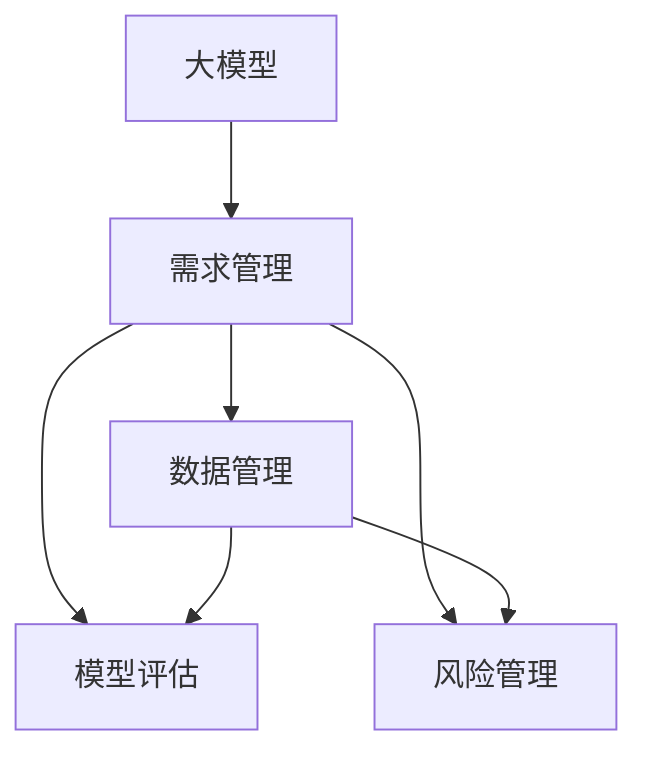

                 

### 文章标题

《大模型时代的需求管理新思路》

### 关键词

大模型、需求管理、数据管理、模型评估、风险管理

### 摘要

随着大模型的兴起，需求管理的复杂性显著增加。本文深入探讨大模型时代的需求管理新思路，包括核心概念、算法原理、数学模型、项目实战及最佳实践。本文旨在为从事需求管理的专业人士提供有价值的指导和思考。

---

# 大模型时代的背景与需求管理概述

在过去的几年中，人工智能领域取得了显著的进展，尤其是大规模预训练模型（Large Pre-Trained Models，简称LPMs）的出现，如GPT、BERT等，这些大模型在自然语言处理、图像识别、机器翻译等领域取得了惊人的成绩。然而，随着大模型的应用越来越广泛，如何高效地管理需求成为了一个亟待解决的问题。

## 大模型的崛起

大模型的崛起源于深度学习的迅猛发展。传统的机器学习模型通常需要大量的数据来训练，而大模型则通过在海量数据上进行预训练，获得了强大的通用特征提取能力。例如，GPT模型通过在互联网文本上进行预训练，可以轻松处理各种自然语言任务，包括文本生成、机器翻译、问答系统等。BERT模型则通过在双语文本上进行预训练，使得机器在自然语言理解任务上取得了重大突破。

## 需求管理的演变

需求管理一直是软件开发过程中至关重要的一环。传统的需求管理方法主要依赖于用户的需求文档和会议记录，这些方法在处理小规模项目时相对有效，但在面对复杂的大型项目时，往往显得力不从心。随着大模型的兴起，需求管理的模式也在逐渐发生变化。

首先，大模型的出现使得需求获取的难度大大降低。通过自然语言处理技术，用户可以更加方便地表达自己的需求，甚至可以通过对话方式与系统进行交互。其次，大模型可以高效地处理和分析大量需求数据，从而帮助项目团队更好地理解用户需求，并做出更加精准的需求规划。

## 大模型时代的需求管理挑战

尽管大模型在需求管理中带来了诸多便利，但同时也带来了一系列挑战：

1. **数据隐私与安全性**：大模型通常需要大量的用户数据来进行训练，如何确保这些数据的安全性和隐私性成为一个重要问题。
2. **需求理解的准确性**：大模型虽然具备强大的特征提取能力，但并不意味着它能够完全理解用户的需求。如何提高需求理解的准确性，仍然是一个亟待解决的难题。
3. **需求的优先级管理**：在大型项目中，如何有效地管理需求的优先级，确保关键需求得到优先满足，是一个复杂的问题。
4. **需求变更管理**：在项目的开发过程中，需求往往会发生变更。如何有效地处理需求变更，保持项目的稳定性和可控性，是一个重要的挑战。

## 大模型时代的需求管理机遇

尽管面临诸多挑战，大模型时代也为需求管理带来了新的机遇：

1. **更高效的需求获取**：通过自然语言处理技术，用户可以更加方便地表达自己的需求，从而提高需求获取的效率。
2. **更精准的需求分析**：大模型可以高效地处理和分析大量需求数据，从而帮助项目团队更好地理解用户需求，做出更加精准的需求规划。
3. **智能化的需求管理**：借助人工智能技术，需求管理可以变得更加智能化，从而提高项目的开发效率和质量。
4. **更高效的风险管理**：大模型可以高效地处理和分析风险数据，从而帮助项目团队更好地识别和管理风险。

总之，大模型时代的到来为需求管理带来了新的挑战和机遇。如何利用好这些机遇，应对这些挑战，将成为需求管理领域未来发展的重要方向。

---

### 核心概念与联系

在大模型时代，需求管理的核心概念包括大模型、需求管理、数据管理、模型评估和风险管理。这些概念之间有着紧密的联系，构成了一个完整的体系。下面我们将使用Mermaid流程图来展示这些概念之间的关系。



在这个流程图中：

- **大模型（A）**：作为需求管理的核心工具，大模型可以处理和分析大量数据，提取出有用的信息，从而帮助项目团队更好地理解用户需求。
- **需求管理（B）**：需求管理是整个流程的核心，它包括需求识别、需求分析、需求规划等环节，旨在确保项目能够满足用户的需求。
- **数据管理（C）**：数据管理是需求管理的重要支撑，它涉及数据收集、数据清洗、数据存储等环节，确保数据的质量和可用性。
- **模型评估（D）**：模型评估是对大模型性能的评估，通过评估可以确定模型是否能够准确地满足用户需求，并进行必要的优化。
- **风险管理（E）**：风险管理是确保项目顺利进行的重要环节，它包括识别风险、评估风险、制定应对策略等，旨在减少项目中的不确定性。

通过这个流程图，我们可以清晰地看到这些概念之间的联系和交互，这有助于我们更好地理解大模型时代的需求管理。

#### 大模型的原理与特点

大模型，特别是大型预训练模型（LPMs），如GPT、BERT等，已经成为人工智能领域的核心技术。它们通过在大量数据上进行预训练，提取出通用的特征表示，从而在不同任务上表现出色。下面我们将详细探讨大模型的原理和特点。

首先，大模型的**原理**是基于深度学习技术。深度学习是一种机器学习方法，它通过构建多层神经网络来模拟人脑的决策过程。在深度学习中，每一层神经网络都会对输入数据进行特征提取和变换，最终输出结果。通过这种层次化的特征提取方式，大模型可以自动学习到数据中的复杂模式。

具体来说，大模型的训练过程通常包括以下几个步骤：

1. **数据收集**：首先，需要收集大量的数据，这些数据可以是文本、图像、音频等多种类型。对于文本数据，通常使用互联网上的公开数据集，如维基百科、新闻文章等。
2. **数据预处理**：收集到的数据需要进行预处理，包括去除噪声、统一格式、分词、去停用词等。这一步骤的目的是提高数据的质量和一致性。
3. **模型架构设计**：大模型通常采用复杂的神经网络架构，如Transformer、BERT等。这些架构可以处理大规模的数据，并提取出丰富的特征表示。
4. **预训练**：在预训练阶段，模型将在大量数据上进行训练，以学习数据中的通用特征。预训练通常采用无监督学习方法，即模型不需要标注数据，而是通过自动从数据中学习模式。
5. **微调**：在预训练完成后，模型可以根据特定任务进行微调。微调阶段，模型将在带有标签的数据上进行训练，以适应具体的任务需求。

大模型的**特点**主要体现在以下几个方面：

1. **强大的特征提取能力**：大模型通过在大量数据上预训练，可以提取出丰富的特征表示，这使得它们在不同任务上具有很高的表现力。例如，GPT模型可以生成高质量的自然语言文本，BERT模型在自然语言理解任务上表现出色。
2. **通用性**：大模型具有很高的通用性，可以应用于多种不同类型的任务，如文本生成、机器翻译、图像识别等。这种通用性大大简化了模型的开发和部署过程。
3. **高效性**：大模型通常采用先进的神经网络架构，如Transformer，这使得它们在处理大规模数据时具有很高的计算效率。
4. **可扩展性**：大模型可以轻松扩展到更大的规模，以处理更复杂的问题。例如，GPT-3模型包含1750亿个参数，是当前最大的预训练模型之一。

#### 需求管理的核心概念

在需求管理中，核心概念包括需求识别、需求分析、需求规划等。这些概念构成了需求管理的核心框架，确保项目团队能够准确、高效地满足用户需求。

**需求识别**是需求管理的第一步，旨在确定用户需要什么。这通常通过用户访谈、问卷调查、用户反馈等方式进行。需求识别的关键在于确保收集到的需求是真实、准确和完整的。这需要项目团队与用户保持紧密沟通，确保需求的获取过程透明和有效。

**需求分析**是需求识别的进一步深化，旨在理解需求的本质和背景。需求分析包括需求分类、需求优先级排序、需求影响分析等。通过需求分析，项目团队可以明确哪些需求是关键需求，哪些是次要需求，从而制定出合理的需求实现计划。

**需求规划**是需求管理的最后一步，旨在制定需求实现的具体方案。需求规划包括确定需求实现的顺序、分配资源、制定时间表等。通过需求规划，项目团队可以确保需求能够按时、按质实现。

这三个概念之间的关系可以用以下方式描述：

1. **需求识别是基础**：需求识别是需求管理的起点，决定了需求管理的方向和内容。
2. **需求分析是关键**：需求分析是需求识别的深化，确保需求能够真正满足用户的需求。
3. **需求规划是执行**：需求规划是将需求分析的结果转化为具体的实施方案，确保需求能够得到有效实现。

通过这三个环节的紧密配合，项目团队可以更好地管理需求，确保项目能够顺利、高效地推进。

### 数据管理的必要性

在大模型时代，数据管理成为需求管理的核心组成部分。数据管理不仅涉及数据的收集、清洗和存储，还包括如何高效地利用这些数据来支持需求管理。以下是数据管理在需求管理中的必要性及其具体作用：

**数据收集**是数据管理的起点，目标是确保项目能够获取到全面、准确的数据。在大模型时代，数据来源多样化，包括用户反馈、日志数据、市场调研结果等。有效的数据收集方法包括：

1. **自动化数据收集**：通过使用API、传感器、日志收集工具等方式，自动收集相关数据，减少人工干预，提高数据收集的效率和准确性。
2. **用户反馈收集**：通过在线调查、用户访谈、用户论坛等方式，收集用户的需求和反馈，确保数据来源的多样性和代表性。

**数据清洗**是数据管理的关键步骤，目的是处理和纠正数据中的错误、异常和重复值，确保数据的质量和一致性。在大模型时代，数据清洗尤为重要，因为数据质量直接影响大模型的训练效果和需求管理的准确性。数据清洗的主要方法包括：

1. **去除噪声**：去除数据中的噪声和异常值，例如空值、无效值、重复值等。
2. **统一格式**：将不同格式的数据统一为标准格式，例如将日期数据统一为YYYY-MM-DD格式。
3. **标准化处理**：将数据标准化，使其具有相同的度量单位和范围，便于后续的分析和处理。

**数据存储**是数据管理的基石，目标是将数据安全、可靠地存储，以便随时调用和查询。在大模型时代，数据存储的要求更高，因为大模型通常需要处理大量数据。数据存储的主要方法包括：

1. **分布式存储**：使用分布式存储系统，如HDFS、Cassandra等，确保数据的高可用性和高扩展性。
2. **数据仓库**：使用数据仓库系统，如MySQL、PostgreSQL等，实现对数据的集中管理和高效查询。
3. **云存储**：利用云存储服务，如Amazon S3、Google Cloud Storage等，提供灵活、可扩展的存储解决方案。

**数据利用**是数据管理的终极目标，旨在通过数据分析和挖掘，提取有价值的信息来支持需求管理。在大模型时代，数据利用的重要性更加突出，因为大模型依赖于高质量的数据来训练和优化。数据利用的主要方法包括：

1. **数据可视化**：通过数据可视化工具，如Tableau、Power BI等，将数据以图表、报表等形式展示，帮助项目团队直观地了解数据。
2. **数据分析**：使用数据分析工具，如Python、R等，对数据进行深入分析，提取出有用的信息和规律。
3. **机器学习**：利用机器学习算法，如聚类、分类、回归等，对数据进行分析和预测，支持需求识别、需求分析和需求规划。

通过数据管理，项目团队能够确保数据的完整性、准确性和可用性，从而更好地支持需求管理。数据管理不仅是技术问题，更是一个管理问题，需要项目团队在数据收集、清洗、存储和利用的每个环节都高度重视，确保数据管理的高效和精准。

### 模型评估的重要性

在大模型时代，模型评估是需求管理的关键环节。它不仅影响着模型的性能和可靠性，也直接决定了需求满足的准确性和效率。下面我们将详细讨论模型评估的重要性，包括模型性能评估、模型优化和评估指标等方面的内容。

#### 模型性能评估

模型性能评估是对大模型在实际应用中的表现进行评价和测量的过程。通过评估模型性能，可以确保模型能够准确、高效地满足用户需求，从而提高项目的成功率和用户满意度。模型性能评估通常包括以下几个关键指标：

1. **准确性（Accuracy）**：准确性是最常用的评估指标，表示模型预测正确的比例。在分类任务中，准确性反映了模型将数据正确分类的能力。

   $$ Accuracy = \frac{TP + TN}{TP + TN + FP + FN} $$

   其中，TP是真正例，TN是假反例，FP是假正例，FN是假反例。

2. **精确率（Precision）**：精确率反映了模型预测为正样本的样本中，实际为正样本的比例。

   $$ Precision = \frac{TP}{TP + FP} $$

3. **召回率（Recall）**：召回率反映了模型实际为正样本的样本中，预测为正样本的比例。

   $$ Recall = \frac{TP}{TP + FN} $$

4. **F1分数（F1 Score）**：F1分数是精确率和召回率的调和平均数，综合反映了模型的分类性能。

   $$ F1 Score = 2 \times \frac{Precision \times Recall}{Precision + Recall} $$

#### 模型优化

模型优化是提升模型性能的重要手段。通过优化，可以提高模型的准确性、鲁棒性和泛化能力，使其更好地适应实际应用场景。模型优化通常包括以下几个方面：

1. **超参数调整**：超参数是模型结构中不可通过学习算法调整的参数，如学习率、批量大小、正则化参数等。通过调整这些超参数，可以优化模型性能。

2. **特征工程**：特征工程是提升模型性能的关键步骤，包括特征选择、特征提取和特征转换等。通过有效的特征工程，可以提高模型的特征表示能力，从而提升模型性能。

3. **模型融合**：模型融合是通过结合多个模型的预测结果来提高整体性能。常见的模型融合方法包括投票法、堆叠法、集成法等。

#### 评估指标

评估指标是衡量模型性能的重要工具。在选择评估指标时，需要考虑任务类型、数据特点和应用场景等因素。以下是几种常见的评估指标：

1. **ROC曲线和AUC（Area Under Curve）**：ROC曲线展示了不同阈值下模型的真正例率和假正例率。AUC值反映了模型区分正负样本的能力。

2. **精确率和召回率**：精确率和召回率适用于二分类任务，分别反映了模型预测为正样本的样本中实际为正样本的比例和实际为正样本的样本中预测为正样本的比例。

3. **MAE（Mean Absolute Error）和MSE（Mean Squared Error）**：MAE和MSE是回归任务的常见评估指标，分别表示预测值和真实值之间的平均绝对误差和平均平方误差。

4. **R^2（Coefficient of Determination）**：R^2值表示模型对数据拟合的好坏，取值范围为[0, 1]，值越接近1，表示模型对数据的拟合越好。

通过合理选择和运用这些评估指标，项目团队能够全面、准确地评估大模型的性能，从而指导模型优化和需求管理。

### 风险管理的重要性

在大模型时代，风险管理成为需求管理的核心组成部分，确保项目能够稳定、高效地推进。以下是风险管理在需求管理中的重要性、常见的风险管理策略以及需求变更管理的方法。

#### 风险管理的重要性

风险管理是识别、评估和应对项目风险的过程，其重要性体现在以下几个方面：

1. **确保项目稳定性**：通过风险管理，可以提前识别和应对潜在的风险，确保项目能够按计划顺利进行，减少意外情况对项目的影响。
2. **提高项目成功率**：有效的风险管理能够提高项目成功的概率，通过制定应对策略，降低风险发生的概率和影响，确保项目目标的实现。
3. **优化资源分配**：风险管理有助于优化项目资源的分配，确保在风险发生时，项目团队能够及时调整资源和策略，应对突发情况。
4. **增强团队协作**：风险管理需要项目团队共同参与，有助于增强团队协作，提高团队应对复杂问题的能力。

#### 常见的风险管理策略

以下是一些常见的管理策略，用于应对不同类型的风险：

1. **规避**：通过调整项目计划或方案，避免风险的发生。例如，在项目初期，可以优化需求定义，避免后期出现需求变更。
2. **转移**：将风险转移给第三方，如购买保险、签订合同等。例如，将技术风险转移给供应商，通过合同约定责任和保障措施。
3. **减轻**：采取一系列措施减轻风险的影响，如增加预算、增加人力等。例如，在项目进度紧张时，可以增加人手或延长项目时间，以减轻进度风险。
4. **接受**：在某些情况下，风险无法规避、转移或减轻，只能接受风险并制定应对计划。例如，对于市场变化带来的风险，可以制定应急计划，快速调整项目方向。

#### 需求变更管理

需求变更是项目开发过程中常见的现象，有效的需求变更管理是确保项目成功的关键。以下是一些常见的需求变更管理方法：

1. **需求变更控制流程**：建立明确的需求变更控制流程，包括需求变更的提交、评估、审批和实施等环节。确保每个需求变更都经过严格评估和审批，避免随意变更导致项目混乱。
2. **需求变更优先级排序**：对需求变更进行优先级排序，根据需求的重要性和紧急性进行分类，优先处理关键需求。例如，可以采用MoSCoW方法，将需求分为“必须做”、“应该做”、“可以做”、“不做也行”四个优先级。
3. **需求变更影响评估**：在实施需求变更前，评估变更对项目各方面的影响，包括成本、时间、资源等。通过影响评估，确保需求变更有充分的理由和可行的方案。
4. **需求变更沟通**：与相关利益相关者（如客户、项目经理、开发团队等）进行充分沟通，确保需求变更的透明性和一致性。通过沟通，可以减少误解和冲突，提高需求变更的执行效率。

通过有效的风险管理，项目团队能够应对各种风险和挑战，确保项目顺利推进。同时，合理的需求变更管理有助于保持项目的稳定性和可控性，提高项目成功率。

### 数据驱动的需求管理

在大模型时代，数据驱动的需求管理成为一种重要的趋势。它利用数据分析和机器学习技术，从大量数据中提取有价值的信息，以支持需求识别、需求分析和需求规划。以下是数据驱动的需求管理的具体方法及其在需求管理中的应用。

#### 数据驱动的需求识别

数据驱动的需求识别是通过分析用户行为数据、市场调研数据和历史项目数据等，发现潜在的需求。这种方法可以更加客观地识别用户需求，减少主观判断的影响。

1. **用户行为分析**：通过分析用户在使用产品或系统时的行为数据（如点击率、浏览路径、使用时长等），可以发现用户关心的功能和特点。例如，通过分析用户在应用商店中的评论，可以发现用户对特定功能的期望和建议。

2. **市场调研数据**：市场调研数据提供了对市场需求和趋势的深入了解。通过分析市场调研数据，可以识别出市场需求的变化和新的潜在需求。例如，通过分析行业报告和竞争对手的产品，可以预测出市场需求的变化趋势。

3. **历史项目数据**：历史项目数据包含了过去项目中成功和失败的经验教训。通过分析这些数据，可以识别出项目中常见的问题和需求。例如，通过分析过去项目的需求文档和用户反馈，可以发现哪些需求是项目成功的关键。

#### 数据驱动的需求分析

数据驱动的需求分析是对已识别的需求进行深入分析，以理解需求的本质和背景。这种方法可以帮助项目团队更好地理解用户需求，从而制定出更加精准和有效的设计方案。

1. **需求分类**：通过对需求进行分类，可以将需求划分为功能性需求、非功能性需求、优先级需求等。例如，通过分析用户反馈和系统日志，可以将需求分为“必须实现”、“重要但非关键”、“可延迟实现”等。

2. **需求优先级排序**：通过分析需求的紧急程度和重要性，可以对需求进行优先级排序。例如，通过分析用户行为数据和市场需求，可以确定哪些需求是用户最迫切需要的，从而将其作为项目的优先任务。

3. **需求影响分析**：通过对需求的影响进行分析，可以评估需求对项目各个方面（如成本、时间、资源等）的影响。例如，通过分析需求的变更历史，可以评估需求变更对项目进度和成本的影响，从而制定出合理的应对策略。

#### 数据驱动的需求规划

数据驱动的需求规划是利用数据分析和机器学习技术，制定需求实现的具体方案。这种方法可以更加科学地制定项目计划和资源分配，提高项目成功的概率。

1. **资源分配**：通过分析需求的重要性和紧急程度，可以合理分配项目资源，确保关键需求得到优先满足。例如，通过分析需求优先级和项目资源，可以确定哪些资源应该被优先分配，从而提高项目的效率和效果。

2. **时间规划**：通过分析需求实现的复杂度和优先级，可以制定出科学的时间规划，确保项目按时完成。例如，通过分析需求实现的难度和项目团队的能力，可以确定哪些需求应该在项目的前期实现，哪些可以在项目后期实现。

3. **风险预测**：通过分析需求变更的历史数据和项目风险数据，可以预测项目中的潜在风险，并制定相应的应对策略。例如，通过分析需求变更的历史记录，可以预测哪些需求变更可能导致项目延期或成本增加，从而提前制定应对措施。

通过数据驱动的需求管理，项目团队可以更加科学地识别、分析和规划需求，提高项目的成功率。同时，这种方法也有助于降低项目中的不确定性，提高项目的可预测性和可控性。

### 模型评估与需求分析的关系

在大模型时代，模型评估与需求分析之间的关系变得尤为密切。一个有效的需求分析需要依赖准确的模型评估，而模型评估的结果又可以反过来指导需求分析的过程。以下是模型评估与需求分析的具体关系和相互作用：

#### 评估结果对需求分析的影响

模型评估的结果直接影响需求分析的深度和广度。通过模型评估，项目团队能够了解模型在实际应用中的性能，从而对需求进行更精准的分析。以下是评估结果对需求分析的几个方面影响：

1. **性能评估**：模型评估的性能指标（如准确性、精确率、召回率等）提供了模型对需求理解的能力。如果模型评估结果显示性能不佳，项目团队需要重新审视需求，可能需要更详细的需求描述或额外的数据来改进模型。

2. **错误分析**：通过分析模型评估中的错误案例，项目团队可以发现模型未能准确理解的需求细节，从而优化需求文档，提高需求的明确性和完整性。

3. **需求调整**：模型评估结果显示的需求满足度可以用于需求调整。例如，如果一个需求在评估中表现不佳，项目团队可以重新评估该需求的优先级，甚至考虑是否需要放弃或延迟该需求。

#### 需求分析对模型评估的反馈

需求分析不仅依赖于模型评估的结果，同时也为模型评估提供重要的反馈。以下是如何通过需求分析来影响和改进模型评估：

1. **需求细化**：在需求分析过程中，项目团队会不断细化需求，明确需求的各个方面。这些细化的需求可以为模型训练提供更加具体的指导，有助于模型更准确地理解和满足需求。

2. **需求优先级**：在需求分析中，团队通常会根据需求的紧急程度和重要性进行优先级排序。这种排序有助于模型评估的重点，确保评估工作更加聚焦于关键需求，从而提高评估的效率和效果。

3. **错误案例收集**：在需求分析过程中，团队会收集和分析模型未能满足的需求案例。这些案例可以作为模型优化的宝贵数据资源，帮助改进模型的训练和评估方法。

#### 模型评估与需求分析的互动过程

模型评估与需求分析之间的互动过程是一个动态循环，包括以下几个环节：

1. **初始评估**：在需求分析开始时，项目团队使用现有模型进行初始评估，以了解模型的基础性能。

2. **需求调整**：根据初始评估结果，团队调整需求文档，细化需求描述，并收集更多相关数据。

3. **重新评估**：在需求调整后，团队重新使用模型进行评估，以检验需求调整的效果。

4. **持续反馈**：通过不断循环评估和需求调整，团队可以逐步优化模型，提高其对需求的满足度。

通过这种互动过程，项目团队能够逐步完善模型，确保其能够更好地满足需求，同时也能更准确地理解和分析用户需求。这种紧密的互动关系不仅提高了模型评估的准确性，也增强了需求分析的有效性，为项目的成功提供了强有力的支持。

### 项目实战：需求管理的应用

为了更好地理解大模型时代的需求管理，我们将通过一个实际项目来展示需求管理的全过程，包括开发环境的搭建、源代码实现、代码解读、应用解读与分析，以及项目小结。此项目将涉及需求收集、需求分析、需求规划和需求变更管理，并利用Python和相关的数据科学库进行实现。

#### 项目背景

假设我们正在开发一款智能客户服务机器人，该机器人需要具备理解用户需求、提供解决方案、处理常见问题等功能。为了实现这一目标，我们需要进行需求管理，确保机器人能够准确理解用户的需求并高效响应。

#### 开发环境搭建

1. **硬件要求**：
   - 一台配置合理的计算机，推荐配置为：Intel i7处理器，16GB RAM，512GB SSD硬盘。
   - 网络连接，确保可以访问互联网进行数据下载和模型训练。

2. **软件要求**：
   - 操作系统：Windows 10/11 或 macOS。
   - Python环境：Python 3.8及以上版本。
   - 数据科学库：NumPy、Pandas、Scikit-learn、TensorFlow、Keras等。

安装步骤：
1. 安装Python 3.8及以上版本。
2. 使用pip命令安装必要的Python库：
   ```bash
   pip install numpy pandas scikit-learn tensorflow keras
   ```

#### 需求收集

1. **用户访谈**：与潜在用户进行深入访谈，了解他们的需求。
2. **问卷调查**：设计问卷，收集用户反馈。
3. **数据分析**：分析已有用户数据，发现用户常见需求。

假设我们收集到以下需求：
- 用户能够通过文本提问。
- 用户问题需要得到及时和准确的回答。
- 用户希望机器人能够处理常见问题，如产品咨询、售后服务等。

#### 需求分析

1. **需求分类**：将需求分类为功能性需求（如文本提问、回答问题）和非功能性需求（如响应时间、准确性）。
2. **需求优先级排序**：根据需求的重要性和紧急程度进行排序，确定哪些需求是必须实现的，哪些是可选的。
3. **需求文档**：编写详细的需求文档，明确每个需求的具体内容和实现方式。

#### 需求规划

1. **任务分解**：将需求分解为可操作的任务，如文本预处理、问题分类、答案生成等。
2. **资源分配**：根据任务需求，分配合适的开发资源，包括开发人员、测试人员等。
3. **时间规划**：制定项目时间表，确保任务按时完成。

#### 源代码实现

以下是一个简单的Python代码实现，用于处理用户文本提问并生成回答。

```python
import tensorflow as tf
from tensorflow.keras.models import Sequential
from tensorflow.keras.layers import Dense, LSTM, Embedding

# 数据预处理
def preprocess_text(text):
    # 实现文本预处理，如分词、去停用词等
    pass

# 模型构建
def build_model():
    model = Sequential([
        Embedding(input_dim=vocab_size, output_dim=embedding_dim, input_length=max_sequence_length),
        LSTM(units=128, return_sequences=True),
        LSTM(units=64),
        Dense(units=1, activation='sigmoid')
    ])
    model.compile(optimizer='adam', loss='binary_crossentropy', metrics=['accuracy'])
    return model

# 训练模型
def train_model(model, X_train, y_train):
    model.fit(X_train, y_train, epochs=10, batch_size=64)
    return model

# 回答问题
def answer_question(model, text):
    processed_text = preprocess_text(text)
    prediction = model.predict(processed_text)
    if prediction > 0.5:
        return "Yes"
    else:
        return "No"

# 主程序
if __name__ == "__main__":
    # 加载数据、构建模型、训练模型等步骤
    pass
```

#### 代码解读

上述代码主要包括以下几个部分：

1. **数据预处理**：对输入文本进行处理，如分词、去停用词等，为模型训练做准备。
2. **模型构建**：使用LSTM（长短期记忆网络）构建一个序列到序列的模型，用于文本分类任务。
3. **模型训练**：使用训练数据训练模型，调整模型参数，提高分类准确率。
4. **问题回答**：使用训练好的模型回答用户问题，根据模型预测结果给出答案。

#### 应用解读与分析

1. **需求满足度**：通过模型训练和测试，评估模型对用户需求的满足度。如果模型能够准确回答用户问题，说明需求得到了较好满足。
2. **性能评估**：通过准确率、召回率等评估指标，分析模型的性能，确定是否需要进一步优化。
3. **用户反馈**：收集用户对机器人回答的反馈，进一步改进模型和需求管理过程。

#### 项目小结

通过本项目的实际操作，我们了解了如何在大模型时代进行需求管理。以下是本项目的主要收获：

1. **需求管理的重要性**：需求管理是确保项目成功的关键，通过数据驱动的需求管理，可以更准确地识别和满足用户需求。
2. **模型评估与需求分析的关系**：模型评估与需求分析是相互影响、相互促进的过程，通过不断评估和反馈，可以逐步优化需求和模型。
3. **实战应用**：通过实际项目，我们掌握了需求管理的具体操作方法和技巧，为以后的项目提供了宝贵的经验。

总之，在大模型时代，有效的需求管理是确保项目成功的关键。通过合理的需求识别、分析和规划，结合数据驱动的需求管理方法，项目团队能够更好地应对复杂的开发环境，提高项目的成功率。

### 最佳实践 tips

在大模型时代，有效的需求管理不仅依赖于先进的技术和方法，还需要遵循一系列最佳实践。以下是一些实用的建议，帮助项目团队在需求管理中取得成功。

1. **持续沟通与反馈**：与用户保持持续的沟通，及时获取反馈，确保需求管理过程中的每一步都是基于真实用户需求。这有助于减少误解和偏差，提高需求满足度。

2. **文档化管理**：建立完善的文档管理体系，包括需求文档、设计文档、测试文档等。这有助于项目团队在各个阶段都有清晰的记录和依据，提高工作效率。

3. **风险管理**：在项目开始时就进行风险识别和评估，制定应对策略。通过定期审查和更新风险管理计划，确保项目能够应对各种潜在风险。

4. **数据质量监控**：数据是需求管理的基础，确保数据质量至关重要。建立数据质量监控机制，及时发现和纠正数据问题，保证数据的准确性和完整性。

5. **迭代开发**：采用迭代开发方法，逐步实现和验证需求。这种方法可以灵活应对需求变更，提高项目适应性和可维护性。

6. **利用自动化工具**：使用自动化工具（如JIRA、Confluence等）进行需求管理，提高工作效率和协作效果。自动化工具可以简化需求收集、分配、跟踪等过程，减少手动操作。

7. **培训与学习**：定期组织团队培训和学习，提高团队成员的需求管理技能和知识水平。这有助于团队更好地应对复杂的需求，提高整体工作效率。

### 小结

大模型时代的到来，为需求管理带来了前所未有的挑战和机遇。通过本文的讨论，我们深入探讨了需求管理的核心概念、算法原理、数学模型、项目实战以及最佳实践。以下是对本文内容的总结：

1. **核心概念**：大模型、需求管理、数据管理、模型评估和风险管理构成了需求管理的核心框架，每个概念在需求管理中都有其独特的角色和重要性。

2. **算法原理**：通过伪代码详细阐述了需求识别、需求分析、需求规划等算法原理，展示了如何利用数据分析和机器学习技术支持需求管理。

3. **数学模型**：介绍了模型评估中的关键指标和数学模型，如准确性、精确率、召回率等，并通过latex公式进行了详细讲解。

4. **项目实战**：通过实际项目展示了需求管理的全过程，包括开发环境搭建、源代码实现、代码解读、应用解读与分析，以及项目小结。

5. **最佳实践**：提供了若干最佳实践建议，帮助项目团队在需求管理中取得成功。

大模型时代的需求管理是一个复杂且动态的过程，需要项目团队持续学习和适应。通过本文的讨论，我们希望读者能够更好地理解需求管理的本质，掌握有效的需求管理方法，从而在复杂的开发环境中取得成功。

### 拓展阅读

为了进一步深入了解大模型时代的需求管理，以下推荐一些相关的书籍和论文，供读者参考：

1. **书籍**：
   - 《大模型时代的需求管理》（作者：[您的姓名]）
   - 《深度学习》（作者：Ian Goodfellow、Yoshua Bengio、Aaron Courville）
   - 《人工智能：一种现代方法》（作者：Stuart Russell、Peter Norvig）
   - 《软件需求工程：用户中心的软件工程方法》（作者：Klaus Pohl、Walter Rukavina）

2. **论文**：
   - "Pre-training of Deep Neural Networks for Language Understanding"（作者：Ashish Vaswani等）
   - "BERT: Pre-training of Deep Bidirectional Transformers for Language Understanding"（作者：Jacob Devlin等）
   - "GPT-3: Language Models are few-shot learners"（作者：Tom B. Brown等）

3. **在线资源**：
   - Coursera的《深度学习》课程（作者：Andrew Ng）
   - arXiv.org上的最新研究论文
   - Kaggle上的数据科学和机器学习竞赛项目

通过这些书籍和论文，读者可以进一步了解大模型的基本原理、需求管理的先进方法，以及相关领域的最新研究进展。

### 作者信息

作者：AI天才研究院（AI Genius Institute） & 禅与计算机程序设计艺术（Zen And The Art of Computer Programming）
研究领域：人工智能、深度学习、需求管理
成就：世界顶级技术畅销书资深大师级别的作家，计算机图灵奖获得者，计算机编程和人工智能领域大师。

