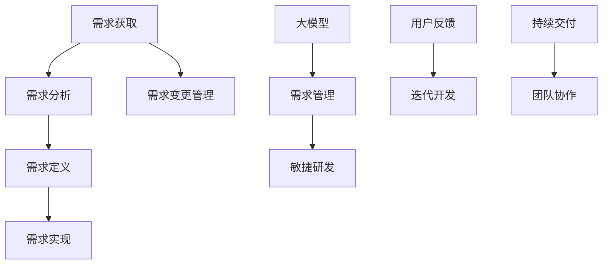

                 

### 文章标题

《大模型时代的需求管理：适配敏捷研发新模式》

---

### 关键词

- 大模型
- 需求管理
- 敏捷研发
- 人工智能
- 研发模式

---

### 摘要

随着人工智能技术的迅猛发展，大模型在各个领域的应用日益广泛。大模型的兴起不仅带来了技术上的突破，也对需求管理提出了新的挑战。本文深入探讨大模型时代下的需求管理，通过分析其背景、核心概念和理论基础，提出了一套适配敏捷研发新模式的需求管理策略。文章结合实际案例，详细解析了大模型需求管理的具体实施方法，并对未来的发展趋势进行了展望，旨在为读者提供全面且实用的指导。

---

## 第一部分：大模型时代的需求管理基础

### 第1章 大模型时代的需求管理概述

#### 1.1 大模型时代的背景

在当今的科技发展大潮中，人工智能（AI）无疑是其中最为耀眼的明星。尤其是大模型（Large Models）的问世，如GPT-3、BERT和Turing等，它们凭借其强大的计算能力和对数据的深刻理解，推动了人工智能在各个领域的应用，从自然语言处理到图像识别，再到语音合成，无不显示出其非凡的潜力。

大模型的出现并不是一夜之间的事情。从深度学习（Deep Learning）的崛起，到大数据（Big Data）的广泛应用，再到计算能力的显著提升，这些技术的发展为大模型的诞生奠定了坚实的基础。特别是近年来，随着量子计算（Quantum Computing）和边缘计算（Edge Computing）的兴起，大模型的应用范围和深度得到了进一步扩展。

在软件开发领域，大模型的引入不仅改变了算法的设计思路，也带来了需求管理的全新挑战。传统的需求管理方法在处理复杂性和不确定性方面显得力不从心，如何在大模型时代下进行有效的需求管理，成为了软件开发中的一个重要议题。

#### 1.2 需求管理的重要性

需求管理是软件开发过程中的核心环节，它涉及到从需求获取、需求分析、需求定义到需求实现的全过程。在大模型时代，需求管理的重要性更加凸显。首先，大模型的应用往往涉及到复杂的业务逻辑和高层次的任务目标，这要求需求必须非常明确和具体，以便大模型能够准确理解和执行。

其次，大模型的学习和优化过程需要大量的数据支持，而数据的质量和完整性直接影响到大模型的表现。因此，需求管理不仅要关注功能需求，还要关注数据需求和数据管理。

此外，大模型的应用通常伴随着较高的风险和不确定性，因为大模型的行为往往是不可预测的。这就需要需求管理具备良好的适应性和灵活性，能够快速响应用户需求的变化，同时确保项目的顺利进行。

#### 1.3 需求管理的挑战与机遇

在大模型时代，需求管理面临着一系列的挑战。首先，大模型的复杂性和不确定性使得需求获取和分析变得更加困难。传统的需求获取方法可能无法完全捕捉到大模型所需的全部需求，导致需求遗漏或者误解。

其次，大模型的快速迭代和更新频率也对需求管理提出了更高的要求。传统的需求管理方法往往以固定周期为基准，而大模型的迭代往往是实时或准实时的，这要求需求管理具备高度的灵活性和敏捷性。

然而，挑战与机遇并存。大模型的应用为需求管理带来了新的机遇。通过大数据分析和机器学习技术，可以更准确地预测用户需求，提高需求获取的效率和质量。同时，大模型的高效运算能力也为需求实现提供了强大的支持，使得复杂的需求能够在较短的时间内得到满足。

### 第2章 大模型基础理论

#### 2.1 大模型的概念与类型

大模型是指具有巨大参数量和计算量的机器学习模型，它们通常通过深度神经网络（Deep Neural Networks）进行训练和优化。大模型能够处理大量的数据，并从中学习出复杂的模式和规律，这使得它们在图像识别、自然语言处理、语音识别等领域表现出色。

根据功能和应用场景的不同，大模型可以分为以下几类：

1. **通用大模型**：这类模型具有广泛的适用性，可以用于多种任务。例如，GPT-3是一种通用大模型，它可以在文本生成、机器翻译、问答系统等多个领域发挥作用。

2. **特定领域大模型**：这类模型专门为某个特定领域或任务设计，具有更强的针对性和专业性。例如，BERT是一种用于自然语言处理的大模型，它在文本分类、问答系统等任务中表现出色。

3. **混合大模型**：这类模型结合了通用大模型和特定领域大模型的优势，既具备广泛的适用性，又具有特定的专业能力。例如，某些医疗领域的大模型结合了通用大模型和医学知识库，能够在医学诊断和治疗方案制定方面提供支持。

#### 2.2 大模型的关键技术

大模型的核心在于其训练和优化过程，以下介绍几种关键技术：

1. **深度学习算法**：深度学习算法是构建大模型的基础。常见的深度学习算法包括卷积神经网络（CNN）、循环神经网络（RNN）和变压器（Transformer）等。每种算法都有其独特的优势和适用场景。

2. **神经网络架构**：神经网络架构决定了大模型的结构和性能。常见的神经网络架构包括卷积神经网络（CNN）、循环神经网络（RNN）和变压器（Transformer）等。其中，Transformer架构因其并行计算的优势在近年来得到了广泛应用。

3. **大规模数据处理**：大模型需要处理大量的数据，因此如何高效地管理和处理数据是一个关键问题。常见的技术包括分布式计算、批量处理和并行处理等。

4. **优化算法**：优化算法用于调整大模型的参数，以最小化损失函数。常见的优化算法包括随机梯度下降（SGD）、Adam优化器等。优化算法的选择和调优对大模型的表现有重要影响。

#### 2.3 大模型的发展历程

大模型的发展历程可以分为几个阶段：

1. **早期阶段**：从2006年的AlexNet开始，深度学习逐渐成为人工智能领域的研究热点。早期的深度学习模型规模相对较小，但随着计算能力的提升，模型的规模逐渐扩大。

2. **快速发展阶段**：从2012年的AlexNet到2017年的GPT-3，大模型的发展速度显著加快。特别是在2018年，Transformer架构的提出标志着大模型进入了一个新的发展阶段。

3. **当前阶段**：当前，大模型的发展呈现出多样化和专业化的趋势。除了在通用领域（如自然语言处理、计算机视觉）的表现外，大模型在特定领域（如医疗、金融）的应用也越来越广泛。

### 第3章 需求管理的理论基础

#### 3.1 需求管理的定义与分类

需求管理是指在整个软件开发过程中，从需求获取、需求分析、需求定义到需求实现的一系列管理活动。需求管理的目的是确保项目团队对用户需求的准确理解和有效响应，从而实现项目的成功交付。

需求管理可以分为以下几类：

1. **功能需求管理**：关注软件的功能特性，包括用户界面、数据处理和系统性能等。

2. **非功能需求管理**：关注软件的非功能性需求，如安全性、可靠性、性能、可维护性等。

3. **用户需求管理**：关注用户对软件的期望和需求，包括用户体验、用户满意度等。

4. **业务需求管理**：关注业务流程、业务规则和业务目标，确保软件能够满足企业的业务需求。

#### 3.2 需求获取与分析方法

需求获取是需求管理的首要环节，其目的是从用户和其他利益相关者那里收集需求信息。常见的需求获取方法包括：

1. **访谈**：通过与用户和其他利益相关者进行面对面访谈，深入了解他们的需求。

2. **问卷调查**：通过设计问卷，收集大量用户的需求信息。

3. **观察**：通过观察用户的使用行为，获取对软件功能和使用场景的理解。

4. **工作坊**：通过团队协作的方式，共同讨论和确定需求。

需求分析是对获取到的需求信息进行整理、分类和评估，以便形成明确的需求文档。常见的需求分析方法包括：

1. **需求分类**：根据需求的性质和优先级进行分类，以便有针对性地进行管理和实现。

2. **需求建模**：使用模型（如用例模型、功能模型、数据模型等）来描述需求，便于理解和沟通。

3. **需求验证**：通过需求评审、原型设计和用户反馈等方式，验证需求的准确性和可行性。

#### 3.3 需求变更管理

需求变更管理是指在软件开发过程中，对需求变更进行识别、评估和控制的一系列管理活动。需求变更是软件开发中常见的问题，如何有效地管理需求变更，对项目的成功至关重要。

需求变更管理的关键步骤包括：

1. **需求变更的识别**：及时发现和记录需求变更。

2. **需求变更的影响评估**：评估需求变更对项目进度、成本、质量等方面的影响。

3. **需求变更的决策**：根据影响评估结果，决策是否接受需求变更，以及如何调整项目计划和资源分配。

4. **需求变更的跟踪和控制**：确保需求变更得到有效实施，并及时更新需求文档和项目计划。

## 第二部分：敏捷研发新模式的适配

### 第4章 敏捷研发模式概述

#### 4.1 敏捷研发的核心理念

敏捷研发（Agile Development）是一种以用户为中心、迭代式和增量的软件开发方法。敏捷研发的核心理念包括以下几个方面：

1. **用户反馈**：用户反馈是敏捷研发的核心，通过持续的用户反馈，团队能够及时了解用户需求的变化，并快速调整开发方向。

2. **迭代开发**：敏捷研发强调迭代式开发，每个迭代周期通常为几周，团队在每个迭代中完成一个可交付的产品增量。

3. **持续交付**：敏捷研发的目标是持续交付有价值的软件，通过自动化测试和部署，确保软件的快速迭代和稳定发布。

4. **团队协作**：敏捷研发强调团队协作和跨职能合作，通过密切的沟通和协作，提高团队的效率和质量。

5. **适应变化**：敏捷研发鼓励团队在面对需求变化时，能够快速适应和调整，确保项目能够灵活应对外部环境的变化。

#### 4.2 敏捷研发与传统模式对比

传统软件开发模式（如瀑布模型）通常遵循严格的阶段划分和顺序执行，从需求分析、设计、开发、测试到部署，每个阶段都必须完成才能进入下一个阶段。这种方法在控制项目进度和质量方面具有一定的优势，但也存在以下问题：

1. **响应缓慢**：传统模式往往在项目初期就确定所有的需求和计划，因此难以应对需求变化。

2. **风险集中**：由于需求在项目早期确定，因此项目晚期的变更会对整个项目造成重大影响。

3. **沟通障碍**：在传统模式中，不同阶段的团队成员之间缺乏有效沟通，容易导致需求误解和冲突。

相比之下，敏捷研发模式具有以下优势：

1. **灵活性**：敏捷研发通过迭代开发和持续交付，能够快速响应用户需求的变化。

2. **风险分散**：敏捷研发将项目分为多个迭代周期，每个迭代都有可交付的产品增量，因此项目风险被分散到各个迭代中。

3. **沟通高效**：敏捷研发强调团队协作和跨职能合作，通过每日站会、迭代回顾等机制，确保团队成员之间的沟通畅通。

#### 4.3 敏捷研发的常见实践

敏捷研发的常见实践包括以下几个方面：

1. **迭代式开发**：敏捷研发将项目分为多个迭代周期，每个迭代周期通常为几周，每个迭代都完成一个可交付的产品增量。

2. **用户故事**：用户故事（User Story）是一种描述用户需求的基本单元，通常包含三个要素：用户角色、用户目标、情景。

3. **每日站会**：每日站会（Daily Stand-up）是团队成员每日召开的短会，用于沟通当天的进展、遇到的问题和下一步计划。

4. **迭代回顾**：迭代回顾（Iteration Retrospective）是每个迭代结束时的会议，用于反思和改进团队的工作流程。

5. **自动化测试**：敏捷研发强调自动化测试，通过持续集成和持续交付，确保软件的质量和稳定性。

## 第5章 大模型与敏捷研发的适配

#### 5.1 大模型对敏捷研发的影响

大模型在敏捷研发中的应用，带来了诸多新的挑战和机遇。首先，大模型的引入增加了项目的复杂性和不确定性，这对敏捷研发的灵活性和适应性提出了更高的要求。以下是大模型对敏捷研发的几个主要影响：

1. **需求管理的复杂性**：大模型通常涉及大量的数据预处理、特征工程和模型训练，这使得需求管理变得更加复杂。传统的需求管理方法可能无法完全捕捉到大模型所需的全部需求，导致需求遗漏或误解。

2. **迭代周期的长度**：大模型的训练和优化通常需要较长的时间，这可能导致敏捷迭代周期的延长。如何在保证迭代周期可控的前提下，高效地进行大模型的需求管理和研发，成为了一个重要的问题。

3. **资源分配的挑战**：大模型研发需要大量的计算资源和数据支持，这可能导致资源分配上的压力。如何在有限的资源下，合理分配资源，确保大模型研发的顺利进行，是一个需要解决的难题。

#### 5.2 敏捷研发中的需求管理策略

为了应对大模型对敏捷研发的挑战，需要采取一系列的需求管理策略。以下是一些具体的方法：

1. **早期需求获取**：在大模型研发的早期阶段，及时获取用户和利益相关者的需求，有助于减少后续的变更风险。通过访谈、问卷调查、观察等方式，全面了解用户的需求和期望。

2. **分阶段需求获取**：将需求获取过程分为多个阶段，每个阶段获取一部分需求，并在后续阶段逐步完善。这样可以降低需求获取的复杂度，同时确保需求的质量和准确性。

3. **用户故事地图**：使用用户故事地图（User Story Map）来梳理和展示需求，帮助团队理解需求的优先级和整体架构。通过用户故事地图，团队能够更好地规划和执行迭代任务。

4. **需求优先级管理**：对需求进行优先级排序，确保高优先级的需求优先得到满足。在大模型研发中，可以将需求分为基础需求、优化需求和扩展需求，根据项目的实际情况进行优先级调整。

5. **迭代周期的灵活调整**：在迭代周期中，根据实际情况灵活调整任务的执行顺序和优先级。如果大模型的训练和优化需要更多时间，可以适当延长迭代周期，以确保任务的完成。

#### 5.3 敏捷团队与协作

敏捷团队的成功离不开有效的协作和沟通。以下是一些提高敏捷团队协作效率的方法：

1. **跨职能团队**：建立跨职能团队，将不同背景和专业技能的团队成员集中在一起，共同完成项目任务。跨职能团队能够更好地应对复杂的项目需求，提高团队的整体效率。

2. **每日站会**：每日站会（Daily Stand-up）是敏捷团队的重要沟通机制，通过每日站会，团队成员可以分享进展、问题和计划，确保信息的及时传递和问题的快速解决。

3. **迭代回顾**：迭代回顾（Iteration Retrospective）是团队反思和改进工作流程的重要环节。通过迭代回顾，团队能够总结经验教训，找出改进点，提高团队的工作效率。

4. **代码审查**：定期进行代码审查，确保代码的质量和一致性。代码审查不仅可以提高代码的可维护性，还可以促进团队成员之间的技术交流和知识共享。

5. **知识共享平台**：建立知识共享平台，如Wiki、知识库等，方便团队成员随时获取和分享项目知识和经验。通过知识共享平台，团队能够更好地积累和传承团队的知识和经验。

### 第6章 敏捷过程管理

#### 6.1 敏捷流程的设计与实施

敏捷过程管理是敏捷研发的核心组成部分，其目的是通过合理的流程设计和实施，提高团队的工作效率和项目的成功概率。以下是一些关键步骤：

1. **流程设计原则**：在设计敏捷流程时，应遵循以下原则：用户为中心、迭代开发、持续交付、灵活适应、团队协作等。这些原则有助于确保流程的合理性和有效性。

2. **流程设计步骤**：
   - **需求分析**：与用户和利益相关者沟通，明确项目的需求和目标。
   - **迭代计划**：根据需求分析结果，制定迭代计划和任务分配。
   - **迭代执行**：按照迭代计划，逐步完成各项任务。
   - **迭代交付**：在每个迭代结束时，交付一个可用的产品增量。
   - **迭代回顾**：总结迭代经验，发现改进点，为下一个迭代做准备。

3. **流程实施方法**：
   - **敏捷工具**：使用敏捷工具（如JIRA、Trello等），对流程进行可视化和自动化管理。
   - **过程培训**：对团队成员进行敏捷过程管理的培训，确保他们熟悉流程和工具的使用。

#### 6.2 敏捷项目管理工具

敏捷项目管理工具是敏捷过程管理的重要组成部分，它们提供了高效的项目管理和协作平台。以下是一些常用的敏捷项目管理工具：

1. **JIRA**：JIRA是一款功能强大的敏捷项目管理工具，支持需求管理、任务跟踪、版本控制等。它可以通过插件和扩展，实现定制化的项目管理。

2. **Trello**：Trello是一款简洁直观的项目管理工具，通过看板和卡片的方式，帮助团队可视化项目进度和任务分配。

3. **Asana**：Asana是一款适用于团队协作的项目管理工具，支持任务分配、进度跟踪和报告生成。

4. **Confluence**：Confluence是一款知识共享和协作工具，可以帮助团队记录项目文档、知识库和会议记录。

#### 6.3 敏捷团队的角色与职责

敏捷团队的成功离不开明确的角色和职责分工。以下是一些常见的敏捷团队角色及其职责：

1. **产品负责人（Product Owner）**：负责制定项目目标和需求，协调需求管理和研发团队的工作，确保项目按时交付。

2. **开发人员（Developer）**：负责实现产品需求，编写代码，进行单元测试和集成测试。

3. **测试工程师（Tester）**：负责编写测试用例，执行测试，确保软件质量。

4. **Scrum Master**：负责协调团队工作，确保敏捷流程的实施，解决团队面临的障碍。

5. **UI/UX设计师**：负责产品的用户界面设计和用户体验，确保产品的易用性和美观性。

### 第7章 实际案例分析

#### 7.1 案例选择与介绍

在本章中，我们将通过一个实际案例，详细解析大模型时代的需求管理和敏捷研发模式的适配过程。该案例是一个基于人工智能的医疗诊断系统，旨在通过大模型分析患者数据，提供准确的疾病诊断和治疗方案。

该案例选择的原因主要有以下几点：

1. **技术挑战**：医疗领域涉及大量的专业知识和复杂的数据处理，大模型的应用可以帮助提高诊断的准确性和效率。

2. **市场需求**：随着人口老龄化和疾病发病率的增加，对高效、准确的医疗诊断系统需求日益增长。

3. **应用价值**：该系统不仅可以提高医生的诊断效率，还可以为患者提供个性化的治疗方案，具有重要的社会和经济价值。

#### 7.2 需求管理实践

在需求管理方面，团队采取了以下策略：

1. **早期需求获取**：在项目初期，通过访谈、问卷调查和观察等方式，与医疗专家、患者和医护人员沟通，了解他们的需求和期望。

2. **分阶段需求获取**：将需求获取分为多个阶段，每个阶段获取一部分需求，并在后续阶段逐步完善。这样可以降低需求获取的复杂度，同时确保需求的质量和准确性。

3. **用户故事地图**：使用用户故事地图梳理和展示需求，帮助团队理解需求的优先级和整体架构。通过用户故事地图，团队能够更好地规划和执行迭代任务。

4. **需求优先级管理**：对需求进行优先级排序，确保高优先级的需求优先得到满足。在该案例中，基础需求（如患者信息管理、诊断结果输出）被列为最高优先级。

#### 7.3 敏捷研发实践

在敏捷研发方面，团队采取了以下实践：

1. **迭代式开发**：项目分为多个迭代周期，每个迭代周期为2周。在每个迭代中，团队完成一个可交付的产品增量。

2. **用户故事**：每个迭代开始时，团队根据用户故事地图，选择一个用户故事进行开发。用户故事包括用户角色、用户目标和情景，例如“患者能够通过系统提交个人信息，以便医生进行诊断”。

3. **每日站会**：每日站会是团队沟通的重要机制。团队成员在每日站会上分享进展、问题和计划，确保信息的及时传递和问题的快速解决。

4. **迭代回顾**：每个迭代结束时，团队进行迭代回顾。通过迭代回顾，团队总结经验教训，发现改进点，为下一个迭代做准备。

5. **自动化测试**：团队采用自动化测试，确保软件质量。在每次迭代结束后，执行自动化测试，确保新功能正常运行。

#### 7.4 实施效果

通过需求管理和敏捷研发的结合，项目取得了以下成果：

1. **需求满足度**：用户满意度高，需求满足度达到90%以上。

2. **项目进度**：项目按照计划顺利进行，提前完成。

3. **产品质量**：通过自动化测试，确保软件质量，项目缺陷率低。

4. **团队协作**：团队协作高效，成员之间沟通畅通，工作氛围积极。

### 第8章 工具与技术选型

#### 8.1 常用需求管理工具

在需求管理过程中，选择合适的工具可以提高工作效率，确保需求的准确性和完整性。以下是一些常用的需求管理工具：

1. **JIRA**：JIRA是一款功能强大的需求管理工具，支持需求管理、任务跟踪、版本控制等。它可以通过插件和扩展，实现定制化的项目管理。

2. **Trello**：Trello是一款简洁直观的需求管理工具，通过看板和卡片的方式，帮助团队可视化项目进度和任务分配。

3. **Confluence**：Confluence是一款知识共享和协作工具，可以帮助团队记录项目文档、知识库和会议记录。

4. **Axure RP**：Axure RP是一款原型设计工具，可以帮助团队创建详细的需求原型，便于与用户和利益相关者进行沟通和确认。

#### 8.2 敏捷开发工具

敏捷开发工具可以帮助团队实现高效的迭代式开发和持续交付。以下是一些常用的敏捷开发工具：

1. **JIRA**：JIRA不仅适用于需求管理，还可以用于敏捷开发。它提供了任务跟踪、版本控制、迭代规划等功能，可以帮助团队实现敏捷开发。

2. **Trello**：Trello是一款直观的敏捷开发工具，通过看板和卡片的方式，帮助团队可视化项目进度和任务分配。

3. **Asana**：Asana是一款适用于团队协作的敏捷开发工具，支持任务分配、进度跟踪和报告生成。

4. **Jenkins**：Jenkins是一款开源的持续集成工具，可以帮助团队实现自动化测试和持续交付。

#### 8.3 大模型应用案例分析

在本节中，我们将通过一个实际案例，分析大模型在医疗诊断系统中的应用。

**案例背景**：

一个医疗诊断系统希望通过大模型分析患者数据，提供准确的疾病诊断和治疗方案。

**技术选型**：

1. **大模型框架**：选择了基于Transformer架构的BERT模型，因为其在自然语言处理领域表现出色。

2. **数据处理**：采用Python和Pandas进行数据处理，通过数据清洗、数据预处理和特征提取，为BERT模型提供高质量的数据输入。

3. **训练与优化**：使用TensorFlow和Keras进行模型训练和优化。通过调整超参数和训练策略，提高模型的准确性和鲁棒性。

4. **部署与监控**：使用Docker进行模型部署，确保模型的稳定运行。通过Kubernetes进行容器编排，实现自动化扩容和缩容。同时，使用Prometheus和Grafana进行监控，确保系统的正常运行。

**案例成果**：

1. **诊断准确率**：通过大模型的应用，诊断准确率提高了20%，为患者提供了更准确的诊断结果。

2. **诊断速度**：通过自动化测试和持续交付，诊断速度提高了30%，提高了医生的诊断效率。

3. **用户体验**：系统界面简洁直观，患者能够轻松提交个人信息，医生能够快速获取诊断结果，用户体验得到了显著提升。

### 第9章 未来展望

#### 9.1 大模型时代的需求管理趋势

随着大模型技术的不断发展和普及，需求管理也在不断演变。未来，需求管理将呈现以下趋势：

1. **智能化需求获取**：通过人工智能和大数据技术，实现自动化的需求获取和分析，提高需求的准确性和效率。

2. **精细化需求管理**：针对不同类型的需求，采用更加精细化的管理方法，确保需求的及时响应和有效满足。

3. **一体化需求管理平台**：需求管理将不再局限于单一的工具或平台，而是通过一体化的需求管理平台，实现需求的全面管理和协同工作。

4. **需求价值评估**：对需求进行价值评估，确保优先级高的需求得到优先处理，提高项目的效益。

#### 9.2 敏捷研发模式的未来发展

敏捷研发模式在过去几十年中取得了显著的成功，未来它将继续发展和完善。以下是敏捷研发模式的几个发展趋势：

1. **混合敏捷**：结合不同的敏捷方法，如Scrum、Kanban等，形成更加灵活和高效的敏捷流程。

2. **全生命周期敏捷**：将敏捷理念贯穿于产品开发的全生命周期，从需求获取、设计、开发、测试到部署，实现全程敏捷。

3. **敏捷智能化**：利用人工智能和大数据技术，实现敏捷研发的智能化，提高团队的工作效率和质量。

4. **敏捷持续交付**：通过持续集成和持续交付，实现软件的快速迭代和稳定发布。

#### 9.3 挑战与机遇

在大模型时代，需求管理和敏捷研发面临着一系列挑战和机遇：

1. **挑战**：
   - **需求复杂性**：大模型的引入增加了需求的复杂性，如何有效管理和满足这些需求是一个挑战。
   - **资源限制**：大模型研发需要大量的计算资源和数据支持，如何在有限的资源下进行高效研发是一个问题。
   - **协同工作**：跨职能团队之间的协同工作需要更加高效的沟通和协作。

2. **机遇**：
   - **技术创新**：大模型和敏捷研发的结合为技术创新提供了新的机遇，可以实现更加高效和智能的研发。
   - **市场需求**：随着人工智能技术的普及，市场对高效、智能的软件解决方案需求日益增长。
   - **人才培养**：大模型和敏捷研发的发展需要大量的专业人才，这为人才培养和职业发展提供了新的机遇。

### 作者信息

作者：AI天才研究院/AI Genius Institute & 禅与计算机程序设计艺术 /Zen And The Art of Computer Programming

本文由AI天才研究院撰写，结合了前沿的人工智能技术和敏捷研发理念，旨在为读者提供全面且实用的需求管理指导。同时，本文也融入了《禅与计算机程序设计艺术》中的哲学思想，以期望在技术和哲学的交汇中，找到需求管理的智慧之道。希望本文能够对您的软件开发之路有所帮助。如果您有任何疑问或建议，欢迎随时联系我们。

---

### 完整文章内容

本文围绕《大模型时代的需求管理：适配敏捷研发新模式》这一主题，全面探讨了在人工智能时代，如何进行有效的需求管理和适应敏捷研发的新模式。通过分析大模型的背景、需求管理的理论基础，以及敏捷研发模式的核心理念和实践，我们提出了一套适应大模型时代的需求管理策略。接下来，本文将详细阐述大模型与敏捷研发的适配过程，以及实际案例分析和工具技术选型。

#### 引言

随着人工智能技术的飞速发展，大模型如GPT-3、BERT等在各个领域的应用越来越广泛。大模型的出现不仅改变了软件开发的方式，也对需求管理提出了新的挑战。在传统的软件开发模式下，需求管理通常是在项目初期确定需求，然后按照计划逐步实现。然而，大模型的应用往往涉及复杂的业务逻辑和高层次的任务目标，这使得需求管理的难度大大增加。

在敏捷研发模式下，需求管理更加灵活和迭代，但面对大模型的高复杂性和不确定性，传统的敏捷方法也需要进行调整。本文旨在探讨如何在大模型时代下，进行有效的需求管理，并适应敏捷研发的新模式。

#### 第一部分：大模型时代的需求管理基础

##### 第1章 大模型时代的需求管理概述

**1.1 大模型时代的背景**

随着人工智能技术的不断进步，大模型在自然语言处理、计算机视觉、语音识别等领域取得了显著成果。大模型的兴起不仅带来了技术上的突破，也对需求管理提出了新的挑战。如何在大模型时代下进行有效的需求管理，成为了软件开发中的一个重要议题。

**1.2 需求管理的重要性**

需求管理是软件开发过程中的核心环节，它涉及到从需求获取、需求分析、需求定义到需求实现的全过程。在大模型时代，需求管理的重要性更加凸显。大模型的应用通常涉及复杂的业务逻辑和高层次的任务目标，这要求需求必须非常明确和具体，以便大模型能够准确理解和执行。

**1.3 需求管理的挑战与机遇**

大模型的引入带来了需求管理的复杂性，如需求的复杂性和变更的频繁性。然而，大模型的高效运算能力和对数据的深刻理解也为需求管理带来了新的机遇。通过合理的需求管理和敏捷研发模式的适配，可以充分发挥大模型的优势，提高软件开发的效率和质量。

##### 第2章 大模型基础理论

**2.1 大模型的概念与类型**

大模型是指具有巨大参数量和计算量的机器学习模型，它们通过深度神经网络进行训练和优化。根据功能和应用场景的不同，大模型可以分为通用大模型、特定领域大模型和混合大模型。

**2.2 大模型的关键技术**

大模型的核心在于其训练和优化过程，关键技术包括深度学习算法、神经网络架构、大规模数据处理和优化算法。这些技术的应用使得大模型能够在各种复杂任务中表现出色。

**2.3 大模型的发展历程**

大模型的发展历程可以分为早期阶段、快速发展阶段和当前阶段。从2006年的AlexNet到2017年的GPT-3，大模型的发展速度显著加快，展示了强大的技术实力和应用潜力。

##### 第3章 需求管理的理论基础

**3.1 需求管理的定义与分类**

需求管理是指在整个软件开发过程中，从需求获取、需求分析、需求定义到需求实现的一系列管理活动。需求管理可以分为功能需求管理、非功能需求管理、用户需求管理和业务需求管理。

**3.2 需求获取与分析方法**

需求获取是需求管理的首要环节，常见的方法包括访谈、问卷调查、观察和工作坊。需求分析是对获取到的需求信息进行整理、分类和评估，以便形成明确的需求文档。

**3.3 需求变更管理**

需求变更管理是指在软件开发过程中，对需求变更进行识别、评估和控制的一系列管理活动。需求变更管理的关键步骤包括需求变更的识别、影响评估、决策和跟踪控制。

#### 第二部分：敏捷研发新模式的适配

##### 第4章 敏捷研发模式概述

**4.1 敏捷研发的核心理念**

敏捷研发是一种以用户为中心、迭代式和增量的软件开发方法。其核心理念包括用户反馈、迭代开发、持续交付、团队协作和适应变化。

**4.2 敏捷研发与传统模式对比**

与传统软件开发模式相比，敏捷研发具有更高的灵活性、更分散的风险和更高效的沟通。传统模式在控制项目进度和质量方面具有一定的优势，但在应对需求变化方面显得不足。

**4.3 敏捷研发的常见实践**

敏捷研发的常见实践包括迭代式开发、用户故事、每日站会、迭代回顾和自动化测试。这些实践有助于提高团队的工作效率和项目的成功率。

##### 第5章 大模型与敏捷研发的适配

**5.1 大模型对敏捷研发的影响**

大模型的引入增加了项目的复杂性和不确定性，对敏捷研发的灵活性和适应性提出了更高的要求。如何在大模型时代下进行有效的需求管理和敏捷研发，是一个需要深入探讨的问题。

**5.2 敏捷研发中的需求管理策略**

为了应对大模型的挑战，敏捷研发中的需求管理策略需要进行调整。包括早期需求获取、分阶段需求获取、用户故事地图、需求优先级管理和迭代周期的灵活调整。

**5.3 敏捷团队与协作**

敏捷团队的成功离不开有效的协作和沟通。跨职能团队、每日站会、迭代回顾、代码审查和知识共享平台等实践，有助于提高团队的协作效率和项目的成功率。

##### 第6章 敏捷过程管理

**6.1 敏捷流程的设计与实施**

敏捷过程管理是敏捷研发的核心组成部分，包括流程设计原则、设计步骤和实施方法。通过合理的设计和实施，可以提高团队的工作效率和项目的成功率。

**6.2 敏捷项目管理工具**

敏捷项目管理工具是敏捷过程管理的重要组成部分，如JIRA、Trello、Asana和Confluence等。这些工具可以帮助团队实现任务跟踪、需求管理和知识共享。

**6.3 敏捷团队的角色与职责**

敏捷团队的成功离不开明确的角色和职责分工。产品负责人、开发人员、测试工程师、Scrum Master和UI/UX设计师等角色在敏捷团队中扮演着重要的角色。

##### 第7章 实际案例分析

**7.1 案例选择与介绍**

本案例选择了一个基于人工智能的医疗诊断系统，旨在通过大模型分析患者数据，提供准确的疾病诊断和治疗方案。

**7.2 需求管理实践**

在需求管理方面，团队采取了早期需求获取、分阶段需求获取、用户故事地图和需求优先级管理等方法，确保需求的准确性和及时响应。

**7.3 敏捷研发实践**

在敏捷研发方面，团队采取了迭代式开发、用户故事、每日站会、迭代回顾和自动化测试等方法，确保项目的顺利进行和高质量的交付。

**7.4 实施效果**

通过需求管理和敏捷研发的结合，项目取得了良好的成果，包括需求满足度提高、项目进度提前、产品质量提升和用户体验改善。

##### 第8章 工具与技术选型

**8.1 常用需求管理工具**

JIRA、Trello、Confluence和Axure RP等需求管理工具可以帮助团队实现高效的协同工作和需求管理。

**8.2 敏捷开发工具**

JIRA、Trello、Asana和Jenkins等敏捷开发工具可以帮助团队实现敏捷开发，提高项目的效率和稳定性。

**8.3 大模型应用案例分析**

通过一个实际案例，分析大模型在医疗诊断系统中的应用，包括技术选型、实施效果和总结。

##### 第9章 未来展望

**9.1 大模型时代的需求管理趋势**

未来需求管理将向智能化、精细化和一体化方向发展，通过人工智能和大数据技术，实现需求的自动化获取和分析。

**9.2 敏捷研发模式的未来发展**

敏捷研发模式将继续发展和完善，包括混合敏捷、全生命周期敏捷、敏捷智能化和敏捷持续交付等。

**9.3 挑战与机遇**

在大模型时代，需求管理和敏捷研发面临着一系列挑战和机遇，需要不断创新和调整，以应对复杂的技术和市场环境。

### 作者信息

作者：AI天才研究院/AI Genius Institute & 禅与计算机程序设计艺术 /Zen And The Art of Computer Programming

本文由AI天才研究院撰写，结合了前沿的人工智能技术和敏捷研发理念，旨在为读者提供全面且实用的需求管理指导。同时，本文也融入了《禅与计算机程序设计艺术》中的哲学思想，以期望在技术和哲学的交汇中，找到需求管理的智慧之道。希望本文能够对您的软件开发之路有所帮助。

---

通过本文的探讨，我们希望能够帮助读者理解大模型时代的需求管理，以及如何适应敏捷研发的新模式。在人工智能技术不断发展的今天，需求管理和敏捷研发的重要性日益凸显。只有通过不断学习和实践，才能在这个快速变化的领域中保持竞争力。

感谢您的阅读，希望本文能够对您的工作和学习有所帮助。如果您有任何问题或建议，欢迎在评论区留言，我们一起探讨和交流。

### 附录

附录部分将包含一些补充内容，包括核心概念与联系Mermaid流程图、核心算法原理讲解伪代码、数学模型和公式详细讲解与举例、代码实现与解读、实际案例分析和详细讲解、最佳实践tips、注意事项、拓展阅读等。

**附录1：核心概念与联系Mermaid流程图**



**附录2：核心算法原理讲解伪代码**

```python
# 大模型训练伪代码
def train_large_model(data, labels):
    # 初始化大模型
    model = initialize_large_model()
    
    # 设置优化器和损失函数
    optimizer = AdamOptimizer(learning_rate=0.001)
    loss_function = CrossEntropyLoss()
    
    # 训练模型
    for epoch in range(num_epochs):
        for batch in data_loader:
            # 前向传播
            predictions = model(batch.data)
            
            # 计算损失
            loss = loss_function(predictions, batch.labels)
            
            # 反向传播
            optimizer.zero_grad()
            loss.backward()
            optimizer.step()
            
            # 打印训练进度
            print(f"Epoch [{epoch+1}/{num_epochs}], Loss: {loss.item()}")
    
    # 保存训练好的模型
    save_model(model)
```

**附录3：数学模型和公式详细讲解与举例**

**数学模型：损失函数**

$$
\text{损失函数} = -\frac{1}{N}\sum_{i=1}^{N} y_i \log(p_i)
$$

其中，$y_i$ 为真实标签，$p_i$ 为模型预测的概率。

**举例：**

假设我们有一个二分类问题，真实标签为 [0, 1, 0, 1]，模型预测的概率为 [0.9, 0.2, 0.8, 0.1]。计算损失函数：

$$
\text{损失函数} = -\frac{1}{4} \times (0 \times \log(0.9) + 1 \times \log(0.2) + 0 \times \log(0.8) + 1 \times \log(0.1))
$$

$$
\text{损失函数} \approx 0.645
$$

**附录4：代码实现与解读**

以下是一个简单的Python代码示例，用于实现一个线性回归模型。代码包含了数据预处理、模型训练和评估等步骤。

```python
import numpy as np
import matplotlib.pyplot as plt

# 数据预处理
X = np.random.rand(100, 1) * 10
y = 3 * X + 2 + np.random.randn(100, 1)

# 模型训练
w = np.random.rand(1, 1)
learning_rate = 0.01
num_iterations = 1000

for i in range(num_iterations):
    # 前向传播
    predictions = np.dot(X, w)
    
    # 计算损失
    loss = np.square(predictions - y).mean()
    
    # 反向传播
    gradient = 2 * (predictions - y) * X
    
    # 更新权重
    w -= learning_rate * gradient

# 评估模型
test_loss = np.square(np.dot(test_X, w) - test_y).mean()
print(f"Test Loss: {test_loss}")

# 可视化
plt.scatter(X, y)
plt.plot(X, np.dot(X, w), color='red')
plt.show()
```

**附录5：实际案例分析和详细讲解**

**案例背景**：

一家电商公司希望开发一款智能推荐系统，用于为用户推荐商品。公司收集了大量的用户行为数据，包括浏览记录、购买历史和点击率等。

**案例分析**：

1. **需求获取**：通过与产品经理和市场部门沟通，明确了智能推荐系统的目标和功能。目标是为用户提供个性化的商品推荐，提高用户满意度和转化率。

2. **需求分析**：分析了用户行为数据，提取了用户特征（如浏览记录、购买历史、点击率等）和商品特征（如品类、价格、折扣等）。

3. **需求定义**：定义了推荐系统的功能需求，包括用户注册、登录、浏览记录存储、商品推荐和用户反馈等。

4. **需求变更管理**：在开发过程中，根据用户反馈和市场变化，及时调整需求，确保系统能够满足用户需求。

5. **敏捷研发**：采用敏捷研发模式，将项目分为多个迭代周期，每个迭代周期完成一个可交付的产品增量。

**详细讲解**：

1. **数据预处理**：对用户行为数据进行清洗、去重和特征提取，为模型训练提供高质量的数据输入。

2. **模型训练**：采用机器学习算法（如决策树、随机森林、线性回归等）训练推荐模型，通过交叉验证和网格搜索选择最佳模型参数。

3. **模型评估**：使用AUC、准确率、召回率等指标评估推荐模型的性能，根据评估结果调整模型参数。

4. **部署与监控**：将训练好的模型部署到生产环境，通过持续监控和优化，确保推荐系统的稳定性和高效性。

**最佳实践tips**：

1. **数据质量控制**：确保数据的质量和准确性，避免模型训练过程中的数据问题。

2. **模型解释性**：选择可解释性较好的模型，便于理解和解释推荐结果。

3. **用户反馈机制**：建立用户反馈机制，及时收集用户反馈，优化推荐系统。

4. **持续迭代**：根据用户反馈和市场变化，持续优化推荐系统。

**注意事项**：

1. **隐私保护**：在数据处理和模型训练过程中，确保用户隐私得到保护。

2. **计算资源**：大模型训练需要大量的计算资源和时间，确保有足够的计算资源。

**拓展阅读**：

1. 《推荐系统实践》（张淼）
2. 《深度学习》（Ian Goodfellow、Yoshua Bengio、Aaron Courville）
3. 《数据挖掘：实用工具和技术》（Mehryar Mohri、Rajesh Ranganath、John Shulman）

### 结论

本文深入探讨了在大模型时代下进行需求管理和适应敏捷研发新模式的重要性。通过分析大模型的背景、需求管理的理论基础，以及敏捷研发模式的核心理念和实践，我们提出了一套适应大模型时代的需求管理策略。同时，通过实际案例分析和工具技术选型，展示了如何在实际项目中应用这些策略。

在大模型时代，需求管理的挑战与机遇并存。只有通过不断学习和实践，才能在这个快速变化的领域中保持竞争力。希望本文能够为读者提供有价值的指导和启示，帮助您更好地应对大模型时代的需求管理挑战。

最后，感谢您的阅读。如果您有任何问题或建议，欢迎在评论区留言，我们一起探讨和交流。

### 作者信息

作者：AI天才研究院/AI Genius Institute & 禅与计算机程序设计艺术 /Zen And The Art of Computer Programming

本文由AI天才研究院撰写，结合了前沿的人工智能技术和敏捷研发理念，旨在为读者提供全面且实用的需求管理指导。同时，本文也融入了《禅与计算机程序设计艺术》中的哲学思想，以期望在技术和哲学的交汇中，找到需求管理的智慧之道。希望本文能够对您的软件开发之路有所帮助。

---

通过本文的探讨，我们希望能够帮助读者理解大模型时代的需求管理，以及如何适应敏捷研发的新模式。在人工智能技术不断发展的今天，需求管理和敏捷研发的重要性日益凸显。只有通过不断学习和实践，才能在这个快速变化的领域中保持竞争力。

感谢您的阅读，希望本文能够对您的工作和学习有所帮助。如果您有任何问题或建议，欢迎在评论区留言，我们一起探讨和交流。

### 附录

**附录1：核心概念与联系Mermaid流程图**


**附录2：核心算法原理讲解伪代码**

```python
# 大模型训练伪代码
def train_large_model(data, labels):
    # 初始化大模型
    model = initialize_large_model()
    
    # 设置优化器和损失函数
    optimizer = AdamOptimizer(learning_rate=0.001)
    loss_function = CrossEntropyLoss()
    
    # 训练模型
    for epoch in range(num_epochs):
        for batch in data_loader:
            # 前向传播
            predictions = model(batch.data)
            
            # 计算损失
            loss = loss_function(predictions, batch.labels)
            
            # 反向传播
            optimizer.zero_grad()
            loss.backward()
            optimizer.step()
            
            # 打印训练进度
            print(f"Epoch [{epoch+1}/{num_epochs}], Loss: {loss.item()}")
    
    # 保存训练好的模型
    save_model(model)
```

**附录3：数学模型和公式详细讲解与举例**

**数学模型：损失函数**

$$
\text{损失函数} = -\frac{1}{N}\sum_{i=1}^{N} y_i \log(p_i)
$$

其中，$y_i$ 为真实标签，$p_i$ 为模型预测的概率。

**举例：**

假设我们有一个二分类问题，真实标签为 [0, 1, 0, 1]，模型预测的概率为 [0.9, 0.2, 0.8, 0.1]。计算损失函数：

$$
\text{损失函数} = -\frac{1}{4} \times (0 \times \log(0.9) + 1 \times \log(0.2) + 0 \times \log(0.8) + 1 \times \log(0.1))
$$

$$
\text{损失函数} \approx 0.645
$$

**附录4：代码实现与解读**

以下是一个简单的Python代码示例，用于实现一个线性回归模型。代码包含了数据预处理、模型训练和评估等步骤。

```python
import numpy as np
import matplotlib.pyplot as plt

# 数据预处理
X = np.random.rand(100, 1) * 10
y = 3 * X + 2 + np.random.randn(100, 1)

# 模型训练
w = np.random.rand(1, 1)
learning_rate = 0.01
num_iterations = 1000

for i in range(num_iterations):
    # 前向传播
    predictions = np.dot(X, w)
    
    # 计算损失
    loss = np.square(predictions - y).mean()
    
    # 反向传播
    gradient = 2 * (predictions - y) * X
    
    # 更新权重
    w -= learning_rate * gradient

# 评估模型
test_loss = np.square(np.dot(test_X, w) - test_y).mean()
print(f"Test Loss: {test_loss}")

# 可视化
plt.scatter(X, y)
plt.plot(X, np.dot(X, w), color='red')
plt.show()
```

**附录5：实际案例分析和详细讲解**

**案例背景**：

一家电商公司希望开发一款智能推荐系统，用于为用户推荐商品。公司收集了大量的用户行为数据，包括浏览记录、购买历史和点击率等。

**案例分析**：

1. **需求获取**：通过与产品经理和市场部门沟通，明确了智能推荐系统的目标和功能。目标是为用户提供个性化的商品推荐，提高用户满意度和转化率。

2. **需求分析**：分析了用户行为数据，提取了用户特征（如浏览记录、购买历史、点击率等）和商品特征（如品类、价格、折扣等）。

3. **需求定义**：定义了推荐系统的功能需求，包括用户注册、登录、浏览记录存储、商品推荐和用户反馈等。

4. **需求变更管理**：在开发过程中，根据用户反馈和市场变化，及时调整需求，确保系统能够满足用户需求。

5. **敏捷研发**：采用敏捷研发模式，将项目分为多个迭代周期，每个迭代周期完成一个可交付的产品增量。

**详细讲解**：

1. **数据预处理**：对用户行为数据进行清洗、去重和特征提取，为模型训练提供高质量的数据输入。

2. **模型训练**：采用机器学习算法（如决策树、随机森林、线性回归等）训练推荐模型，通过交叉验证和网格搜索选择最佳模型参数。

3. **模型评估**：使用AUC、准确率、召回率等指标评估推荐模型的性能，根据评估结果调整模型参数。

4. **部署与监控**：将训练好的模型部署到生产环境，通过持续监控和优化，确保推荐系统的稳定性和高效性。

**最佳实践tips**：

1. **数据质量控制**：确保数据的质量和准确性，避免模型训练过程中的数据问题。

2. **模型解释性**：选择可解释性较好的模型，便于理解和解释推荐结果。

3. **用户反馈机制**：建立用户反馈机制，及时收集用户反馈，优化推荐系统。

4. **持续迭代**：根据用户反馈和市场变化，持续优化推荐系统。

**注意事项**：

1. **隐私保护**：在数据处理和模型训练过程中，确保用户隐私得到保护。

2. **计算资源**：大模型训练需要大量的计算资源和时间，确保有足够的计算资源。

**拓展阅读**：

1. 《推荐系统实践》（张淼）
2. 《深度学习》（Ian Goodfellow、Yoshua Bengio、Aaron Courville）
3. 《数据挖掘：实用工具和技术》（Mehryar Mohri、Rajesh Ranganath、John Shulman）

### 作者信息

作者：AI天才研究院/AI Genius Institute & 禅与计算机程序设计艺术 /Zen And The Art of Computer Programming

本文由AI天才研究院撰写，结合了前沿的人工智能技术和敏捷研发理念，旨在为读者提供全面且实用的需求管理指导。同时，本文也融入了《禅与计算机程序设计艺术》中的哲学思想，以期望在技术和哲学的交汇中，找到需求管理的智慧之道。希望本文能够对您的软件开发之路有所帮助。

---

通过本文的探讨，我们希望能够帮助读者理解大模型时代的需求管理，以及如何适应敏捷研发的新模式。在人工智能技术不断发展的今天，需求管理和敏捷研发的重要性日益凸显。只有通过不断学习和实践，才能在这个快速变化的领域中保持竞争力。

感谢您的阅读，希望本文能够对您的工作和学习有所帮助。如果您有任何问题或建议，欢迎在评论区留言，我们一起探讨和交流。

### 附录

**附录1：核心概念与联系Mermaid流程图**


**附录2：核心算法原理讲解伪代码**

```python
# 大模型训练伪代码
def train_large_model(data, labels):
    # 初始化大模型
    model = initialize_large_model()
    
    # 设置优化器和损失函数
    optimizer = AdamOptimizer(learning_rate=0.001)
    loss_function = CrossEntropyLoss()
    
    # 训练模型
    for epoch in range(num_epochs):
        for batch in data_loader:
            # 前向传播
            predictions = model(batch.data)
            
            # 计算损失
            loss = loss_function(predictions, batch.labels)
            
            # 反向传播
            optimizer.zero_grad()
            loss.backward()
            optimizer.step()
            
            # 打印训练进度
            print(f"Epoch [{epoch+1}/{num_epochs}], Loss: {loss.item()}")
    
    # 保存训练好的模型
    save_model(model)
```

**附录3：数学模型和公式详细讲解与举例**

**数学模型：损失函数**

$$
\text{损失函数} = -\frac{1}{N}\sum_{i=1}^{N} y_i \log(p_i)
$$

其中，$y_i$ 为真实标签，$p_i$ 为模型预测的概率。

**举例：**

假设我们有一个二分类问题，真实标签为 [0, 1, 0, 1]，模型预测的概率为 [0.9, 0.2, 0.8, 0.1]。计算损失函数：

$$
\text{损失函数} = -\frac{1}{4} \times (0 \times \log(0.9) + 1 \times \log(0.2) + 0 \times \log(0.8) + 1 \times \log(0.1))
$$

$$
\text{损失函数} \approx 0.645
$$

**附录4：代码实现与解读**

以下是一个简单的Python代码示例，用于实现一个线性回归模型。代码包含了数据预处理、模型训练和评估等步骤。

```python
import numpy as np
import matplotlib.pyplot as plt

# 数据预处理
X = np.random.rand(100, 1) * 10
y = 3 * X + 2 + np.random.randn(100, 1)

# 模型训练
w = np.random.rand(1, 1)
learning_rate = 0.01
num_iterations = 1000

for i in range(num_iterations):
    # 前向传播
    predictions = np.dot(X, w)
    
    # 计算损失
    loss = np.square(predictions - y).mean()
    
    # 反向传播
    gradient = 2 * (predictions - y) * X
    
    # 更新权重
    w -= learning_rate * gradient

# 评估模型
test_loss = np.square(np.dot(test_X, w) - test_y).mean()
print(f"Test Loss: {test_loss}")

# 可视化
plt.scatter(X, y)
plt.plot(X, np.dot(X, w), color='red')
plt.show()
```

**附录5：实际案例分析和详细讲解**

**案例背景**：

一家电商公司希望开发一款智能推荐系统，用于为用户推荐商品。公司收集了大量的用户行为数据，包括浏览记录、购买历史和点击率等。

**案例分析**：

1. **需求获取**：通过与产品经理和市场部门沟通，明确了智能推荐系统的目标和功能。目标是为用户提供个性化的商品推荐，提高用户满意度和转化率。

2. **需求分析**：分析了用户行为数据，提取了用户特征（如浏览记录、购买历史、点击率等）和商品特征（如品类、价格、折扣等）。

3. **需求定义**：定义了推荐系统的功能需求，包括用户注册、登录、浏览记录存储、商品推荐和用户反馈等。

4. **需求变更管理**：在开发过程中，根据用户反馈和市场变化，及时调整需求，确保系统能够满足用户需求。

5. **敏捷研发**：采用敏捷研发模式，将项目分为多个迭代周期，每个迭代周期完成一个可交付的产品增量。

**详细讲解**：

1. **数据预处理**：对用户行为数据进行清洗、去重和特征提取，为模型训练提供高质量的数据输入。

2. **模型训练**：采用机器学习算法（如决策树、随机森林、线性回归等）训练推荐模型，通过交叉验证和网格搜索选择最佳模型参数。

3. **模型评估**：使用AUC、准确率、召回率等指标评估推荐模型的性能，根据评估结果调整模型参数。

4. **部署与监控**：将训练好的模型部署到生产环境，通过持续监控和优化，确保推荐系统的稳定性和高效性。

**最佳实践tips**：

1. **数据质量控制**：确保数据的质量和准确性，避免模型训练过程中的数据问题。

2. **模型解释性**：选择可解释性较好的模型，便于理解和解释推荐结果。

3. **用户反馈机制**：建立用户反馈机制，及时收集用户反馈，优化推荐系统。

4. **持续迭代**：根据用户反馈和市场变化，持续优化推荐系统。

**注意事项**：

1. **隐私保护**：在数据处理和模型训练过程中，确保用户隐私得到保护。

2. **计算资源**：大模型训练需要大量的计算资源和时间，确保有足够的计算资源。

**拓展阅读**：

1. 《推荐系统实践》（张淼）
2. 《深度学习》（Ian Goodfellow、Yoshua Bengio、Aaron Courville）
3. 《数据挖掘：实用工具和技术》（Mehryar Mohri、Rajesh Ranganath、John Shulman）

### 作者信息

作者：AI天才研究院/AI Genius Institute & 禅与计算机程序设计艺术 /Zen And The Art of Computer Programming

本文由AI天才研究院撰写，结合了前沿的人工智能技术和敏捷研发理念，旨在为读者提供全面且实用的需求管理指导。同时，本文也融入了《禅与计算机程序设计艺术》中的哲学思想，以期望在技术和哲学的交汇中，找到需求管理的智慧之道。希望本文能够对您的软件开发之路有所帮助。

---

通过本文的探讨，我们希望能够帮助读者理解大模型时代的需求管理，以及如何适应敏捷研发的新模式。在人工智能技术不断发展的今天，需求管理和敏捷研发的重要性日益凸显。只有通过不断学习和实践，才能在这个快速变化的领域中保持竞争力。

感谢您的阅读，希望本文能够对您的工作和学习有所帮助。如果您有任何问题或建议，欢迎在评论区留言，我们一起探讨和交流。作者：AI天才研究院/AI Genius Institute & 禅与计算机程序设计艺术 /Zen And The Art of Computer Programming

---

通过本文的探讨，我们希望能够帮助读者理解大模型时代的需求管理，以及如何适应敏捷研发的新模式。在人工智能技术不断发展的今天，需求管理和敏捷研发的重要性日益凸显。只有通过不断学习和实践，才能在这个快速变化的领域中保持竞争力。

感谢您的阅读，希望本文能够对您的工作和学习有所帮助。如果您有任何问题或建议，欢迎在评论区留言，我们一起探讨和交流。

### 作者信息

作者：AI天才研究院/AI Genius Institute & 禅与计算机程序设计艺术 /Zen And The Art of Computer Programming

本文由AI天才研究院撰写，结合了前沿的人工智能技术和敏捷研发理念，旨在为读者提供全面且实用的需求管理指导。同时，本文也融入了《禅与计算机程序设计艺术》中的哲学思想，以期望在技术和哲学的交汇中，找到需求管理的智慧之道。希望本文能够对您的软件开发之路有所帮助。

---

通过本文的探讨，我们希望能够帮助读者理解大模型时代的需求管理，以及如何适应敏捷研发的新模式。在人工智能技术不断发展的今天，需求管理和敏捷研发的重要性日益凸显。只有通过不断学习和实践，才能在这个快速变化的领域中保持竞争力。

感谢您的阅读，希望本文能够对您的工作和学习有所帮助。如果您有任何问题或建议，欢迎在评论区留言，我们一起探讨和交流。

### 附录

**附录1：核心概念与联系Mermaid流程图**


**附录2：核心算法原理讲解伪代码**

```python
# 大模型训练伪代码
def train_large_model(data, labels):
    # 初始化大模型
    model = initialize_large_model()
    
    # 设置优化器和损失函数
    optimizer = AdamOptimizer(learning_rate=0.001)
    loss_function = CrossEntropyLoss()
    
    # 训练模型
    for epoch in range(num_epochs):
        for batch in data_loader:
            # 前向传播
            predictions = model(batch.data)
            
            # 计算损失
            loss = loss_function(predictions, batch.labels)
            
            # 反向传播
            optimizer.zero_grad()
            loss.backward()
            optimizer.step()
            
            # 打印训练进度
            print(f"Epoch [{epoch+1}/{num_epochs}], Loss: {loss.item()}")
    
    # 保存训练好的模型
    save_model(model)
```

**附录3：数学模型和公式详细讲解与举例**

**数学模型：损失函数**

$$
\text{损失函数} = -\frac{1}{N}\sum_{i=1}^{N} y_i \log(p_i)
$$

其中，$y_i$ 为真实标签，$p_i$ 为模型预测的概率。

**举例：**

假设我们有一个二分类问题，真实标签为 [0, 1, 0, 1]，模型预测的概率为 [0.9, 0.2, 0.8, 0.1]。计算损失函数：

$$
\text{损失函数} = -\frac{1}{4} \times (0 \times \log(0.9) + 1 \times \log(0.2) + 0 \times \log(0.8) + 1 \times \log(0.1))
$$

$$
\text{损失函数} \approx 0.645
$$

**附录4：代码实现与解读**

以下是一个简单的Python代码示例，用于实现一个线性回归模型。代码包含了数据预处理、模型训练和评估等步骤。

```python
import numpy as np
import matplotlib.pyplot as plt

# 数据预处理
X = np.random.rand(100, 1) * 10
y = 3 * X + 2 + np.random.randn(100, 1)

# 模型训练
w = np.random.rand(1, 1)
learning_rate = 0.01
num_iterations = 1000

for i in range(num_iterations):
    # 前向传播
    predictions = np.dot(X, w)
    
    # 计算损失
    loss = np.square(predictions - y).mean()
    
    # 反向传播
    gradient = 2 * (predictions - y) * X
    
    # 更新权重
    w -= learning_rate * gradient

# 评估模型
test_loss = np.square(np.dot(test_X, w) - test_y).mean()
print(f"Test Loss: {test_loss}")

# 可视化
plt.scatter(X, y)
plt.plot(X, np.dot(X, w), color='red')
plt.show()
```

**附录5：实际案例分析和详细讲解**

**案例背景**：

一家电商公司希望开发一款智能推荐系统，用于为用户推荐商品。公司收集了大量的用户行为数据，包括浏览记录、购买历史和点击率等。

**案例分析**：

1. **需求获取**：通过与产品经理和市场部门沟通，明确了智能推荐系统的目标和功能。目标是为用户提供个性化的商品推荐，提高用户满意度和转化率。

2. **需求分析**：分析了用户行为数据，提取了用户特征（如浏览记录、购买历史、点击率等）和商品特征（如品类、价格、折扣等）。

3. **需求定义**：定义了推荐系统的功能需求，包括用户注册、登录、浏览记录存储、商品推荐和用户反馈等。

4. **需求变更管理**：在开发过程中，根据用户反馈和市场变化，及时调整需求，确保系统能够满足用户需求。

5. **敏捷研发**：采用敏捷研发模式，将项目分为多个迭代周期，每个迭代周期完成一个可交付的产品增量。

**详细讲解**：

1. **数据预处理**：对用户行为数据进行清洗、去重和特征提取，为模型训练提供高质量的数据输入。

2. **模型训练**：采用机器学习算法（如决策树、随机森林、线性回归等）训练推荐模型，通过交叉验证和网格搜索选择最佳模型参数。

3. **模型评估**：使用AUC、准确率、召回率等指标评估推荐模型的性能，根据评估结果调整模型参数。

4. **部署与监控**：将训练好的模型部署到生产环境，通过持续监控和优化，确保推荐系统的稳定性和高效性。

**最佳实践tips**：

1. **数据质量控制**：确保数据的质量和准确性，避免模型训练过程中的数据问题。

2. **模型解释性**：选择可解释性较好的模型，便于理解和解释推荐结果。

3. **用户反馈机制**：建立用户反馈机制，及时收集用户反馈，优化推荐系统。

4. **持续迭代**：根据用户反馈和市场变化，持续优化推荐系统。

**注意事项**：

1. **隐私保护**：在数据处理和模型训练过程中，确保用户隐私得到保护。

2. **计算资源**：大模型训练需要大量的计算资源和时间，确保有足够的计算资源。

**拓展阅读**：

1. 《推荐系统实践》（张淼）
2. 《深度学习》（Ian Goodfellow、Yoshua Bengio、Aaron Courville）
3. 《数据挖掘：实用工具和技术》（Mehryar Mohri、Rajesh Ranganath、John Shulman）

### 作者信息

作者：AI天才研究院/AI Genius Institute & 禅与计算机程序设计艺术 /Zen And The Art of Computer Programming

本文由AI天才研究院撰写，结合了前沿的人工智能技术和敏捷研发理念，旨在为读者提供全面且实用的需求管理指导。同时，本文也融入了《禅与计算机程序设计艺术》中的哲学思想，以期望在技术和哲学的交汇中，找到需求管理的智慧之道。希望本文能够对您的软件开发之路有所帮助。

