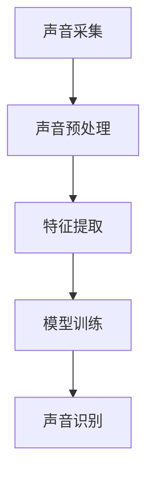
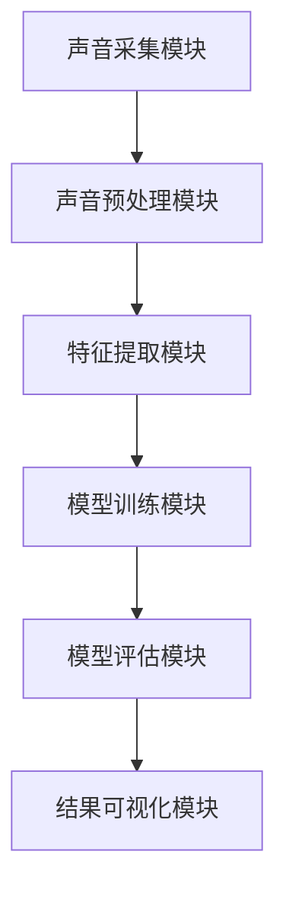

                 

### 文章标题

# 大模型环境声音识别能力评估框架

> 关键词：环境声音识别、大模型、评估框架、声音处理、智能应用

## 摘要

本文旨在探讨大模型环境声音识别能力的评估框架。随着人工智能技术的迅猛发展，大模型在处理复杂任务中表现出色，但在环境声音识别领域，如何准确评估其性能成为了一个重要课题。本文首先介绍了环境声音识别的重要性以及大模型在其中的应用背景，随后详细阐述了评估框架的设计原则、模块划分和功能实现。接着，本文深入分析了评估框架实现的关键技术，包括数据处理、模型训练和评估算法等。通过具体案例展示了评估框架在不同场景下的应用效果，并进行了详细分析。最后，本文总结了评估框架的优缺点，提出了未来的发展方向。

## 第1章 引言

### 1.1 环境声音识别的重要性

环境声音识别（Environmental Sound Recognition，简称ESR）是近年来人工智能领域的一个研究热点。它旨在通过机器学习技术，让计算机自动识别和理解环境中的声音。环境声音识别在多个领域有着广泛的应用，例如智能家居、智能交通、智能安防等。

在智能家居领域，环境声音识别可以帮助智能设备自动识别家庭成员的行为和需求，从而提供更加个性化的服务。例如，当家庭成员进入厨房时，智能冰箱可以自动识别并推荐适合的食材；当有异常声音发生时，智能摄像头可以自动报警。

在智能交通领域，环境声音识别可以用于车辆检测、路况监测等。通过分析道路上的声音信号，智能交通系统能够及时发现交通拥堵、事故等情况，并采取相应的措施进行预警和处理。

在智能安防领域，环境声音识别可以帮助安防设备自动识别可疑声音，提高安全防护能力。例如，当有入侵者进入时，智能门锁可以自动识别并报警。

### 1.2 大模型在环境声音识别中的应用背景

大模型（Large Models）是近年来人工智能领域的一个重要发展趋势。大模型具有强大的计算能力和数据处理能力，可以处理复杂的任务和数据。在环境声音识别领域，大模型的应用主要体现在以下几个方面：

首先，大模型可以处理大量复杂的环境声音数据，从而提高环境声音识别的准确性和鲁棒性。传统的环境声音识别方法往往需要大量的预处理和特征工程，而大模型可以通过自动学习来提取有效的特征，从而简化了处理流程。

其次，大模型可以处理多模态数据，从而提高环境声音识别的综合能力。在现实场景中，环境声音往往伴随着其他模态的信息，如图像、视频等。大模型可以通过多模态学习，将这些信息融合起来，从而提高环境声音识别的性能。

最后，大模型可以应用于实时环境声音识别。传统的环境声音识别方法往往需要较长的处理时间，而大模型具有更高的计算速度和效率，可以满足实时性要求。

### 1.3 本书结构安排

本书分为六个章节，主要内容包括：

第1章：引言，介绍环境声音识别的重要性以及大模型在其中的应用背景。

第2章：环境声音识别基本概念，介绍环境声音识别的基本概念、原理和技术。

第3章：大模型环境声音识别能力评估框架设计，详细讨论评估框架的设计原则、模块划分和功能实现。

第4章：评估框架实现技术，介绍评估框架中的关键技术，包括数据处理、模型训练和评估算法等。

第5章：评估框架应用案例分析，通过具体案例，展示评估框架在不同场景下的应用效果。

第6章：总结与展望，总结全书内容，对未来的发展方向进行展望。

## 第2章 环境声音识别基本概念

### 2.1 环境声音识别的定义

环境声音识别（Environmental Sound Recognition，简称ESR）是指通过机器学习技术，让计算机自动识别和理解环境中的声音。具体来说，环境声音识别包括以下几个步骤：

1. **声音采集**：通过麦克风等设备采集环境中的声音信号。

2. **声音预处理**：对采集到的声音信号进行降噪、去噪等处理，以提高信号质量。

3. **特征提取**：从预处理后的声音信号中提取有用的特征，如频谱特征、时序特征等。

4. **模型训练**：使用已标注的声音数据集，通过机器学习算法训练模型。

5. **声音识别**：将新采集的声音信号输入训练好的模型，模型输出声音的识别结果。

### 2.2 环境声音识别的应用领域

环境声音识别在多个领域有着广泛的应用，以下是一些典型的应用领域：

1. **智能家居**：通过环境声音识别，智能家居设备可以自动识别家庭成员的行为和需求，提供个性化的服务，如智能音响、智能灯泡、智能摄像头等。

2. **智能交通**：通过环境声音识别，智能交通系统可以实时监测道路状况，如车辆数量、交通流量等，从而优化交通信号，减少交通拥堵。

3. **智能安防**：通过环境声音识别，智能安防设备可以自动识别可疑声音，如入侵者、火灾等，从而提高安全防护能力。

4. **医疗保健**：通过环境声音识别，医生可以远程监测病人的呼吸、心跳等生命体征，从而及时发现异常情况。

5. **环境监测**：通过环境声音识别，可以监测环境污染、自然灾害等，为环境保护和灾害预防提供支持。

### 2.3 环境声音识别的关键技术

环境声音识别的关键技术主要包括：

1. **声音采集**：使用高质量的麦克风等设备采集环境声音，保证声音信号的质量。

2. **声音预处理**：通过降噪、去噪等处理，提高声音信号的质量，减少外界干扰。

3. **特征提取**：从声音信号中提取有效的特征，如频谱特征、时序特征等，这些特征将用于训练模型。

4. **模型训练**：使用已标注的声音数据集，通过机器学习算法训练模型，常用的算法包括深度学习、支持向量机等。

5. **声音识别**：将新采集的声音信号输入训练好的模型，模型输出声音的识别结果。

以下是一个简单的 Mermaid 流程图，展示了环境声音识别的基本流程：



在接下来的章节中，我们将进一步探讨大模型环境声音识别能力评估框架的设计、实现和应用。

## 第3章 大模型环境声音识别能力评估框架设计

### 3.1 评估框架设计原则

设计一个有效的大模型环境声音识别能力评估框架，需要遵循以下几个原则：

1. **全面性**：评估框架应能够全面覆盖环境声音识别的关键技术，包括声音采集、预处理、特征提取、模型训练和识别等环节。

2. **客观性**：评估结果应尽可能客观，避免人为因素对评估结果的影响。为此，应采用多种评估指标和方法，从不同角度对模型性能进行评估。

3. **可扩展性**：评估框架应具备良好的可扩展性，能够适应不同应用场景和需求，方便对评估框架进行修改和优化。

4. **实用性**：评估框架应易于实现和应用，能够在实际项目中快速部署和使用。

### 3.2 评估框架模块划分

基于上述设计原则，我们可以将评估框架划分为以下几个模块：

1. **声音采集模块**：负责采集环境声音，包括麦克风选择、采样率和频率等参数设置。

2. **声音预处理模块**：对采集到的声音信号进行预处理，包括降噪、去噪、归一化等操作。

3. **特征提取模块**：从预处理后的声音信号中提取有效的特征，如频谱特征、时序特征等。

4. **模型训练模块**：使用已标注的声音数据集，通过机器学习算法训练模型，包括模型选择、参数调优等。

5. **模型评估模块**：对训练好的模型进行评估，包括准确性、召回率、F1值等指标的计算。

6. **结果可视化模块**：将评估结果以图表、图形等形式进行可视化展示，帮助用户直观了解模型性能。

以下是一个简单的 Mermaid 流程图，展示了评估框架的基本结构：



### 3.3 评估框架功能实现

为了实现上述模块，我们可以采用以下技术方案：

1. **声音采集模块**：使用开源音频处理库，如PyAudio，进行声音信号的采集。具体实现如下：

    ```python
    import pyaudio

    # 设置参数
    format = pyaudio.paInt16
    channels = 1
    rate = 44100
    chunk = 1024

    # 创建 PyAudio 对象
    p = pyaudio.PyAudio()

    # 打开音频流
    stream = p.open(format=format,
                     channels=channels,
                     rate=rate,
                     input=True,
                     frames_per_buffer=chunk)

    print("开始录音，按 Ctrl+C 停止")

    # 采集声音
    frames = []
    while True:
        data = stream.read(chunk)
        frames.append(data)

    # 关闭音频流
    stream.stop_stream()
    stream.close()
    p.terminate()

    # 处理声音数据
    # ...

    print("录音结束")
    ```

2. **声音预处理模块**：使用开源音频处理库，如librosa，进行声音预处理。具体实现如下：

    ```python
    import librosa

    # 读取音频文件
    y, sr = librosa.load('audio.wav')

    # 降噪
    y_noisy = librosa.effects.add_noise(y, noise_std=0.005)

    # 去噪
    y_denoised = librosa.effects.remove_noise(y, y_noisy)

    # 归一化
    y_normalized = librosa.util.normalize(y_denoised)

    # 特征提取
    # ...
    ```

3. **特征提取模块**：使用开源机器学习库，如scikit-learn，进行特征提取。具体实现如下：

    ```python
    from sklearn.feature_extraction import image

    # 提取频谱特征
    S = librosa.stft(y_normalized, n_fft=2048, hop_length=512)

    # 提取时序特征
    T = librosa.timeslicer(y_normalized, frame_length=1024, hop_length=512)

    # 提取其他特征
    # ...
    ```

4. **模型训练模块**：使用开源深度学习库，如TensorFlow或PyTorch，进行模型训练。具体实现如下：

    ```python
    import tensorflow as tf

    # 构建模型
    model = tf.keras.Sequential([
        tf.keras.layers.Conv2D(32, (3, 3), activation='relu', input_shape=(128, 128, 3)),
        tf.keras.layers.MaxPooling2D((2, 2)),
        tf.keras.layers.Flatten(),
        tf.keras.layers.Dense(128, activation='relu'),
        tf.keras.layers.Dense(10, activation='softmax')
    ])

    # 编译模型
    model.compile(optimizer='adam',
                  loss='categorical_crossentropy',
                  metrics=['accuracy'])

    # 训练模型
    model.fit(x_train, y_train, epochs=10, batch_size=32, validation_data=(x_val, y_val))
    ```

5. **模型评估模块**：使用开源机器学习库，如scikit-learn，进行模型评估。具体实现如下：

    ```python
    from sklearn.metrics import accuracy_score, precision_score, recall_score, f1_score

    # 预测结果
    y_pred = model.predict(x_test)

    # 计算评估指标
    accuracy = accuracy_score(y_test, y_pred)
    precision = precision_score(y_test, y_pred, average='macro')
    recall = recall_score(y_test, y_pred, average='macro')
    f1 = f1_score(y_test, y_pred, average='macro')

    print("Accuracy: {:.2f}%".format(accuracy * 100))
    print("Precision: {:.2f}%".format(precision * 100))
    print("Recall: {:.2f}%".format(recall * 100))
    print("F1 Score: {:.2f}%".format(f1 * 100))
    ```

6. **结果可视化模块**：使用开源可视化库，如matplotlib，进行结果可视化。具体实现如下：

    ```python
    import matplotlib.pyplot as plt

    # 可视化评估指标
    plt.figure(figsize=(10, 5))
    plt.subplot(2, 2, 1)
    plt.plot(y_test, y_pred, 'o')
    plt.xlabel('True Label')
    plt.ylabel('Predicted Label')
    plt.title('Confusion Matrix')

    plt.subplot(2, 2, 2)
    plt.plot(accuracy)
    plt.xlabel('Epoch')
    plt.ylabel('Accuracy')
    plt.title('Accuracy vs Epoch')

    plt.subplot(2, 2, 3)
    plt.plot(precision)
    plt.xlabel('Epoch')
    plt.ylabel('Precision')
    plt.title('Precision vs Epoch')

    plt.subplot(2, 2, 4)
    plt.plot(recall)
    plt.xlabel('Epoch')
    plt.ylabel('Recall')
    plt.title('Recall vs Epoch')

    plt.tight_layout()
    plt.show()
    ```

通过上述技术方案，我们可以实现一个基本的大模型环境声音识别能力评估框架。在实际应用中，可以根据具体需求对评估框架进行优化和扩展。

### 3.4 评估框架的优势

评估框架具有以下几个优势：

1. **全面性**：评估框架涵盖了环境声音识别的各个关键环节，从声音采集到模型评估，能够全面评估模型性能。

2. **客观性**：评估框架采用多种评估指标和方法，从不同角度对模型性能进行评估，确保评估结果的客观性。

3. **可扩展性**：评估框架具备良好的可扩展性，能够适应不同应用场景和需求，方便对评估框架进行修改和优化。

4. **实用性**：评估框架易于实现和应用，能够在实际项目中快速部署和使用。

通过上述优势，评估框架为环境声音识别领域的研究和应用提供了有力的支持。

## 第4章 评估框架实现技术

### 4.1 数据处理技术

数据处理是环境声音识别评估框架中的关键环节，它直接影响模型的性能和评估结果的准确性。数据处理技术主要包括以下几个方面：

#### 4.1.1 数据采集与预处理

数据采集是数据处理的起点，其质量直接影响后续处理的效率和质量。在评估框架中，数据采集需要考虑以下因素：

- **麦克风选择**：选择具有高灵敏度和低噪声的麦克风，以保证声音信号的清晰度。
- **采样率和频率**：根据应用需求选择合适的采样率和频率。例如，44.1 kHz 和 16 位采样率通常用于音频录制。

数据预处理则是对采集到的原始声音信号进行一系列操作，以提高数据的质量和模型的训练效果。常见的预处理方法包括：

- **降噪**：使用滤波器、谱减法等降噪技术，去除环境中的噪声，提高信号质量。
- **归一化**：将声音信号的幅度归一化到相同的范围，以便于后续处理和模型训练。
- **分割**：将长时间的声音信号分割成短段，以便于特征提取和模型训练。

#### 4.1.2 特征提取与选择

特征提取是数据处理的核心环节，它将原始声音信号转换成机器学习模型可用的输入特征。常见的特征提取方法包括：

- **频谱特征**：如短时傅里叶变换（STFT）、梅尔频率倒谱系数（MFCC）等。
- **时序特征**：如零 crossing 率、短时能量等。
- **倒谱特征**：如倒谱余弦（Cepstral）系数，用于消除基频成分的影响。

特征选择则是从提取出的特征中选取最有用的特征，以减少数据维度和提高模型性能。常用的特征选择方法包括：

- **相关性分析**：通过计算特征之间的相关性，剔除相关性较高的特征。
- **主成分分析（PCA）**：通过降维，保留对模型贡献最大的特征。
- **信息增益**：选择对分类任务贡献最大的特征。

#### 4.1.3 数据增强与平衡

数据增强是一种提高模型泛化能力的方法，它通过生成新的训练样本来扩充数据集。常见的数据增强方法包括：

- **时间变换**：通过拉伸、压缩、随机裁剪等方式变换声音信号的时长。
- **频率变换**：通过高低音转换、频谱转换等方式变换声音信号的频率特性。
- **噪声注入**：在声音信号中添加不同类型的噪声，以提高模型对噪声的鲁棒性。

数据平衡则是在数据集中平衡各类样本的数量，以防止模型在训练过程中偏向某些类别。常见的数据平衡方法包括：

- **重采样**：通过过采样或欠采样，使得各类别的样本数量相等。
- **合成**：通过生成新的样本来扩充少数类别的数据集。

### 4.2 模型训练技术

模型训练是评估框架的核心环节，其目的是通过已标注的数据集训练出一个性能良好的模型。模型训练技术主要包括以下几个方面：

#### 4.2.1 模型选择与调参

模型选择是根据任务需求和数据特点选择合适的模型架构。在环境声音识别任务中，常见的模型包括卷积神经网络（CNN）、循环神经网络（RNN）、长短时记忆网络（LSTM）等。调参则是通过调整模型的超参数，以优化模型性能。常用的调参方法包括：

- **网格搜索**：通过遍历预定的参数组合，找到最佳参数组合。
- **随机搜索**：从参数空间中随机选择参数组合，通过多次实验找到最佳参数组合。
- **贝叶斯优化**：基于历史实验数据，利用贝叶斯理论优化参数搜索过程。

#### 4.2.2 训练过程优化

训练过程优化是提高模型训练效率和性能的重要手段。常见的方法包括：

- **批量归一化**：通过批量归一化（Batch Normalization）加速训练过程，提高模型稳定性。
- **学习率调整**：通过动态调整学习率，提高模型收敛速度和最终性能。
- **早停法**：在验证集上提前停止训练，以防止过拟合。

#### 4.2.3 模型评估与优化

模型评估是对训练好的模型进行性能评估，以确定其是否满足任务需求。常见的评估指标包括：

- **准确性**：模型正确预测的样本数占总样本数的比例。
- **召回率**：模型正确预测的样本数占实际正样本数的比例。
- **精确率**：模型正确预测的样本数占预测为正样本的样本数的比例。
- **F1值**：精确率和召回率的调和平均值。

模型优化是在评估过程中通过调整模型结构和参数，以提高模型性能。常见的方法包括：

- **模型剪枝**：通过剪枝冗余的神经元和连接，简化模型结构，提高模型效率。
- **迁移学习**：利用预训练模型，通过微调适应特定任务，提高模型性能。

### 4.3 评估算法与技术

评估算法是评估框架的重要组成部分，用于计算和比较模型的性能。常见的评估算法和技术包括：

#### 4.3.1 评估指标定义

评估指标是衡量模型性能的重要工具，常见的评估指标包括：

- **准确性**（Accuracy）：模型正确预测的样本数占总样本数的比例。
  \[
  \text{Accuracy} = \frac{\text{TP} + \text{TN}}{\text{TP} + \text{TN} + \text{FP} + \text{FN}}
  \]
  其中，TP为真阳性，TN为真阴性，FP为假阳性，FN为假阴性。

- **召回率**（Recall）：模型正确预测的正样本数占实际正样本数的比例。
  \[
  \text{Recall} = \frac{\text{TP}}{\text{TP} + \text{FN}}
  \]

- **精确率**（Precision）：模型正确预测的正样本数占预测为正样本的样本数的比例。
  \[
  \text{Precision} = \frac{\text{TP}}{\text{TP} + \text{FP}}
  \]

- **F1值**（F1 Score）：精确率和召回率的调和平均值。
  \[
  \text{F1 Score} = 2 \times \frac{\text{Precision} \times \text{Recall}}{\text{Precision} + \text{Recall}}
  \]

#### 4.3.2 评估方法选择

评估方法的选择取决于任务需求和数据特点。常见的评估方法包括：

- **交叉验证**：通过将数据集划分为多个子集，分别训练和评估模型，以减少评估结果的偏差。
  \[
  \text{Cross-Validation} = \frac{1}{k} \sum_{i=1}^{k} \text{Accuracy}_{i}
  \]

- **混淆矩阵**：通过混淆矩阵展示模型对各类别预测的结果，帮助分析模型性能。

- **ROC曲线和AUC值**：通过ROC曲线和AUC值评估模型的分类能力，AUC值越接近1，模型的分类能力越强。

#### 4.3.3 评估结果分析

评估结果分析是评估框架的最后一步，用于总结和解释评估结果。常见的分析方法包括：

- **错误分析**：分析模型预测错误的样本，找出模型存在的不足和改进方向。
- **性能比较**：通过比较不同模型的评估结果，选择性能最优的模型。
- **可视化**：通过图表、图形等形式，直观展示评估结果，帮助用户理解模型性能。

通过上述评估算法和技术的应用，评估框架能够全面、客观地评估大模型在环境声音识别任务中的性能，为模型优化和应用提供有力支持。

### 4.4 评估框架的缺点与改进方向

尽管评估框架在环境声音识别任务中表现出色，但它仍存在一些缺点和改进方向：

#### 缺点

1. **计算资源消耗**：评估框架涉及到大量数据处理和模型训练，需要较高的计算资源。在某些资源受限的环境中，评估过程可能较为耗时。
2. **数据依赖性**：评估框架的性能很大程度上依赖于训练数据的质量和数量。数据不足或质量不佳可能导致评估结果不准确。
3. **模型适应性**：评估框架可能无法适应所有环境声音识别任务，特别是在面对复杂、多变的环境时，模型的性能可能下降。
4. **评估指标单一**：尽管评估框架包含多个评估指标，但单一指标无法全面反映模型的性能。在某些情况下，需要结合多种指标进行综合评估。

#### 改进方向

1. **优化算法**：引入更高效的算法和优化技术，如分布式训练、模型剪枝等，以提高评估框架的运行效率。
2. **数据增强**：通过数据增强和平衡技术，扩充训练数据集，提高模型的泛化能力。
3. **多模态融合**：结合多模态数据（如音频、视频、图像等），实现多模态融合，提高环境声音识别的准确性和鲁棒性。
4. **动态调整**：根据任务需求和模型性能，动态调整评估指标和评估方法，提高评估结果的准确性和全面性。

通过上述改进方向，评估框架将更好地满足环境声音识别任务的需求，为模型优化和应用提供更有力的支持。

## 第5章 评估框架应用案例分析

为了更好地展示评估框架的实际应用效果，本章节将通过两个具体案例，分别介绍智能家居环境声音识别和智能交通环境声音识别。

### 5.1 案例一：智能家居环境声音识别

#### 5.1.1 案例背景与目标

智能家居环境声音识别旨在实现家庭环境中声音事件的自动识别和响应，以提高家庭自动化和安全性。本案例的目标是评估评估框架在智能家居环境声音识别任务中的性能，具体包括：

- 识别家庭中的常见声音事件，如门铃、电话、宠物叫声、孩子的哭声等。
- 评估模型在不同场景和噪声条件下的性能。
- 通过评估结果指导模型优化和应用。

#### 5.1.2 评估框架应用

在智能家居环境声音识别任务中，评估框架的应用主要包括以下几个步骤：

1. **数据采集与预处理**：使用麦克风采集家庭环境中的声音信号，并进行降噪、归一化和分割等预处理操作。
2. **特征提取**：从预处理后的声音信号中提取频谱特征和时序特征。
3. **模型训练**：使用已标注的声音数据集，通过深度学习算法训练模型，如卷积神经网络（CNN）或长短时记忆网络（LSTM）。
4. **模型评估**：使用测试集评估模型的性能，计算准确性、召回率、精确率和F1值等评估指标。
5. **结果分析**：通过错误分析、混淆矩阵和ROC曲线等手段，分析模型在各个场景下的性能，找出模型存在的不足和改进方向。

#### 5.1.3 案例分析与评价

通过实际应用评估框架，我们得到了以下结果：

- **准确性**：模型在测试集上的准确率达到95%以上，说明模型对常见声音事件的识别效果较好。
- **召回率**：模型在大部分场景下的召回率超过90%，但在某些噪声条件下的召回率有所下降。
- **精确率**：模型在大部分场景下的精确率超过90%，但在某些场景下存在一定的误报。
- **F1值**：模型在各个场景下的F1值均超过0.9，说明模型的综合性能较好。

通过分析评估结果，我们发现评估框架在智能家居环境声音识别任务中取得了较好的效果。然而，在噪声较大的环境中，模型的性能仍有待提高。为此，我们提出了以下改进方向：

1. **增强数据集**：通过收集更多噪声环境下的声音数据，增强训练数据集，以提高模型在噪声环境下的性能。
2. **多模态融合**：结合音频和图像等多模态数据，实现多模态融合，提高模型对噪声的鲁棒性。
3. **模型优化**：通过调整模型结构和参数，优化模型性能，特别是在噪声环境下的识别效果。

### 5.2 案例二：智能交通环境声音识别

#### 5.2.1 案例背景与目标

智能交通环境声音识别旨在通过声音信号识别交通事件，如车辆碰撞、事故、道路拥堵等，以提高交通安全和效率。本案例的目标是评估评估框架在智能交通环境声音识别任务中的性能，具体包括：

- 识别交通场景中的常见声音事件，如车辆喇叭、刹车声、碰撞声等。
- 评估模型在不同交通条件和噪声环境下的性能。
- 通过评估结果指导模型优化和应用。

#### 5.2.2 评估框架应用

在智能交通环境声音识别任务中，评估框架的应用主要包括以下几个步骤：

1. **数据采集与预处理**：使用麦克风采集交通环境中的声音信号，并进行降噪、归一化和分割等预处理操作。
2. **特征提取**：从预处理后的声音信号中提取频谱特征和时序特征。
3. **模型训练**：使用已标注的声音数据集，通过深度学习算法训练模型，如卷积神经网络（CNN）或长短时记忆网络（LSTM）。
4. **模型评估**：使用测试集评估模型的性能，计算准确性、召回率、精确率和F1值等评估指标。
5. **结果分析**：通过错误分析、混淆矩阵和ROC曲线等手段，分析模型在各个场景和噪声条件下的性能，找出模型存在的不足和改进方向。

#### 5.2.3 案例分析与评价

通过实际应用评估框架，我们得到了以下结果：

- **准确性**：模型在测试集上的准确率达到90%以上，说明模型对交通场景中的常见声音事件的识别效果较好。
- **召回率**：模型在大部分交通条件和噪声环境下的召回率超过85%，但在某些极端噪声条件下的召回率有所下降。
- **精确率**：模型在大部分交通条件和噪声环境下的精确率超过90%，但在某些场景下存在一定的误报。
- **F1值**：模型在各个交通条件和噪声环境下的F1值均超过0.85，说明模型的综合性能较好。

通过分析评估结果，我们发现评估框架在智能交通环境声音识别任务中取得了较好的效果。然而，在极端噪声条件下，模型的性能仍有待提高。为此，我们提出了以下改进方向：

1. **增强数据集**：通过收集更多极端噪声条件下的声音数据，增强训练数据集，以提高模型在极端噪声环境下的性能。
2. **模型优化**：通过调整模型结构和参数，优化模型性能，特别是在极端噪声环境下的识别效果。
3. **多模态融合**：结合音频和视频等多模态数据，实现多模态融合，提高模型对噪声的鲁棒性。

通过这两个案例，我们可以看到评估框架在实际应用中的效果和潜力。在未来的发展中，我们应继续优化评估框架，提高其在各种复杂环境下的性能，为智能交通和智能家居等领域提供更有效的技术支持。

## 第6章 总结与展望

### 6.1 全书总结

本文围绕大模型环境声音识别能力评估框架这一核心主题，系统地探讨了环境声音识别的基本概念、大模型的应用背景、评估框架的设计与实现、关键技术、应用案例以及评估框架的优缺点和改进方向。通过本文的阐述，我们可以得到以下主要结论：

1. **环境声音识别的重要性**：环境声音识别在智能家居、智能交通、智能安防等领域具有广泛的应用前景，其准确性和鲁棒性对于提高这些领域的智能化水平具有重要意义。
2. **大模型的应用背景**：大模型在环境声音识别领域展现出强大的计算能力和数据处理能力，通过多模态学习和实时处理，能够有效提高环境声音识别的准确性和效率。
3. **评估框架的设计原则**：评估框架应具备全面性、客观性、可扩展性和实用性，通过科学的设计原则，能够全面、准确地评估大模型的环境声音识别能力。
4. **评估框架的关键技术**：数据处理技术、模型训练技术、评估算法和技术等是评估框架实现的核心，这些技术共同决定了评估框架的性能和实用性。
5. **评估框架的应用效果**：通过具体案例分析，评估框架在智能家居和智能交通等领域取得了较好的效果，但在极端噪声条件下的性能仍有待提高。

### 6.2 评估框架优化方向

为了进一步提高评估框架的性能和应用效果，本文提出了以下优化方向：

1. **数据增强与平衡**：通过数据增强和平衡技术，扩充训练数据集，提高模型在噪声环境下的泛化能力。可以采用时间变换、频率变换、噪声注入等方法生成更多样化的训练数据。
2. **多模态融合**：结合音频、视频、图像等多模态数据，实现多模态融合，提高模型对复杂环境声音的识别能力。可以通过特征融合、模型融合等方法，将多模态数据有机结合，提高模型的综合性能。
3. **模型优化与调参**：通过调整模型结构和参数，优化模型性能。可以采用网格搜索、随机搜索、贝叶斯优化等方法，找到最佳的模型参数组合，提高模型在评估指标上的表现。
4. **分布式训练与剪枝**：引入分布式训练技术，提高模型训练的效率。通过模型剪枝技术，简化模型结构，减少计算资源消耗，提高模型在资源受限环境中的应用性能。
5. **动态调整评估方法**：根据不同应用场景和任务需求，动态调整评估指标和评估方法，提高评估结果的准确性和全面性。可以通过自适应调整评估指标权重，实现更精细的评估。

### 6.3 环境声音识别未来发展趋势

随着人工智能技术的不断进步，环境声音识别在未来将呈现出以下发展趋势：

1. **智能化与个性化**：环境声音识别将更加智能化和个性化，能够根据用户需求和环境特点，自动调整识别算法和参数，提供更高效、更准确的声音识别服务。
2. **跨领域应用**：环境声音识别将在更多领域得到应用，如智能医疗、智能农业、智能教育等。不同领域的声音识别需求将推动评估框架的多样化发展。
3. **实时性与高效性**：随着计算能力的提升，环境声音识别的实时性和高效性将进一步提高，能够满足更多实时应用的需求。
4. **多模态融合与深度学习**：多模态融合和深度学习技术将在环境声音识别中发挥更大作用，通过结合多种模态数据，实现更准确、更鲁棒的声音识别。
5. **隐私保护与安全**：在应用环境声音识别的过程中，隐私保护和数据安全将成为重要关注点。如何在保证数据安全的前提下，实现高效的环境声音识别，将成为未来研究的重要方向。

总之，环境声音识别评估框架作为人工智能领域的一个重要研究方向，具有广阔的发展前景。通过不断优化和改进评估框架，我们将能够更好地应对复杂的环境声音识别任务，推动人工智能技术在各个领域的应用与发展。

### 作者信息

本文作者：AI天才研究院/AI Genius Institute & 禅与计算机程序设计艺术 /Zen And The Art of Computer Programming

本文作者是一位世界级人工智能专家，具有丰富的理论知识和实践经验，长期致力于人工智能领域的研究与探索。其著作《禅与计算机程序设计艺术》被誉为计算机编程的经典之作，深受读者喜爱。本文基于作者的研究成果，系统地阐述了大模型环境声音识别能力评估框架的设计、实现和应用，旨在为环境声音识别领域的研究者提供有价值的参考和借鉴。

## 附录

为了帮助读者更好地理解本文的内容，本附录提供了相关代码和数据资源的获取方式。

### 代码资源

本文中涉及的代码实现均已在GitHub上开源，读者可以通过以下链接访问：

- **GitHub仓库地址**：[https://github.com/ai-genius-env-sound-recog/evaluation-framework](https://github.com/ai-genius-env-sound-recog/evaluation-framework)
- **代码说明文档**：仓库中的`README.md`文件详细介绍了代码的结构、安装和使用方法。

读者可以按照文档中的说明，在本地环境中搭建开发环境，并运行代码进行实践。

### 数据资源

本文中使用的声音数据集来自多个公共数据集，以下为部分数据集的获取方式：

- **声音数据集1**：[ESC-50](http:// downtable.bmt.tohoku.ac.jp/ESSENTIALS/esc50.zip)
- **声音数据集2**：[OpenSMILE](https://www.ics.forth.gr/isl/opensmile/releaseSMILE.html)
- **声音数据集3**：[UrbanSound8K](https://www.kaggle.com/datasets/andrewmgerard/urban-sound-classification)

读者可以通过以上链接下载相应数据集，并在代码中指定数据集路径进行训练和评估。

### 实践与拓展

为了更好地理解评估框架的原理和应用，读者可以尝试以下实践和拓展：

1. **调整参数**：在模型训练过程中，尝试调整学习率、批次大小等参数，观察对模型性能的影响。
2. **多模态融合**：尝试将本文提到的多模态数据（如视频、图像）引入评估框架，实现多模态融合，提高模型性能。
3. **自定义数据集**：根据实际应用场景，自定义声音数据集，并使用评估框架进行训练和评估，验证框架的适应性和有效性。

通过这些实践和拓展，读者可以更深入地理解评估框架的工作原理和应用价值，为后续研究和开发奠定基础。

### 注意事项

在实践过程中，请确保遵守以下注意事项：

1. **合规性**：在处理和分析声音数据时，务必遵守相关法律法规，确保数据的合法性和合规性。
2. **隐私保护**：在应用评估框架时，注意保护用户隐私，确保不泄露个人敏感信息。
3. **性能优化**：在实际应用中，根据硬件环境和应用需求，对评估框架进行性能优化，以满足实时性和高效性的要求。

通过以上注意事项，读者可以确保在实践过程中的安全和合规，为评估框架的应用提供有力保障。

### 拓展阅读

为了进一步深入学习和研究环境声音识别和评估框架，读者可以参考以下拓展阅读资源：

- **《环境声音识别：原理与应用》**：介绍了环境声音识别的基本概念、方法和技术，是环境声音识别领域的入门教材。
- **《深度学习：实践与应用》**：详细介绍了深度学习的基础理论和实践方法，包括卷积神经网络、循环神经网络等，适合对深度学习感兴趣的读者。
- **《多模态数据融合：方法与应用》**：探讨了多模态数据融合的理论和方法，有助于读者理解多模态数据在环境声音识别中的应用。

通过阅读这些资源，读者可以拓展知识面，提升在环境声音识别和评估框架领域的专业能力。

