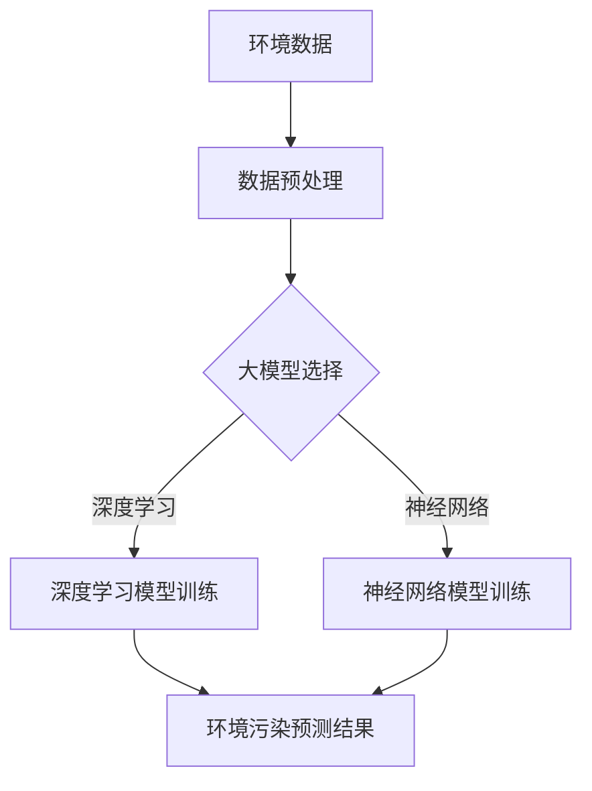

                 

# 大模型环境污染预测能力评估方案

## 关键词

大模型，深度学习，神经网络，环境污染，预测能力，评估方案

## 摘要

本文旨在探讨大模型在环境污染预测中的能力评估问题。随着人工智能技术的不断发展，大模型在处理复杂环境数据、预测环境污染方面展现出强大的优势。本文首先介绍了大模型的核心概念与联系，详细讲解了深度学习模型的原理和数学公式，并通过实际项目实战，展示了大模型在环境污染预测中的应用。最后，对评估方案进行了深入分析，提出了最佳实践和注意事项。

## Step 1: 引入核心概念与联系

### 大模型与环境污染预测

大模型，通常指的是具有大规模参数、深度学习能力的神经网络模型。这些模型在处理大规模、高维度数据时表现出强大的能力，尤其在图像识别、自然语言处理、环境监测等领域应用广泛。而环境污染预测，则是利用这些大模型对环境中的污染物浓度、扩散趋势等进行预测，以便提前预警和制定应对策略。

为了更好地理解大模型与环境污染预测之间的关系，我们可以使用Mermaid流程图进行描述：



### 流程图说明

1. **环境数据**：从各类传感器获取的环境数据，如空气、水质、土壤等。
2. **数据预处理**：对原始环境数据进行清洗、归一化等处理，以便于模型训练。
3. **大模型选择**：根据预测任务的需求，选择合适的大模型，如深度学习模型或神经网络模型。
4. **模型训练**：利用预处理后的环境数据对大模型进行训练，使其能够学会预测环境污染。
5. **环境污染预测**：将训练好的大模型应用于实际环境数据，预测污染物的浓度、扩散趋势等。

## Step 2: 详细讲解核心算法原理

### 深度学习模型原理

深度学习模型是基于多层神经网络构建的，其核心思想是通过学习输入数据的特征，实现对未知数据的分类或预测。以下是一个简化的深度学习模型结构：

```python
def deep_learning_model(inputs):
    hidden_layer_1 = activation_function(权重1 * 输入 + 偏置1)
    hidden_layer_2 = activation_function(权重2 * hidden_layer_1 + 偏置2)
    output = activation_function(权重3 * hidden_layer_2 + 偏置3)
    return output
```

### 深度学习模型训练过程

1. **初始化模型权重和偏置**：随机初始化模型中的权重和偏置。
2. **前向传播**：计算输入数据的输出。
3. **计算损失函数**：比较实际输出与预测输出之间的差距，计算损失函数值。
4. **反向传播**：根据损失函数的梯度，更新模型权重和偏置，以最小化损失函数。

### 数学模型和数学公式讲解

在深度学习模型中，常用的数学模型和公式包括损失函数、梯度下降算法等。以下是一个示例：

```latex
\section{数学模型}
假设我们有以下线性回归模型：
\begin{equation}
y = \beta_0 + \beta_1x_1 + \beta_2x_2 + ... + \beta_nx_n + \epsilon
\end{equation}

其中，\(y\) 是预测值，\(x_1, x_2, ..., x_n\) 是输入特征，\(\beta_0, \beta_1, ..., \beta_n\) 是模型参数，\(\epsilon\) 是误差项。
```

## Step 3: 数学模型和数学公式讲解

在环境污染预测中，深度学习模型通常使用以下数学模型：

### 线性回归模型

假设我们有 \(n\) 个输入特征 \(x_1, x_2, ..., x_n\)，对应的预测值 \(y\) 满足以下线性关系：

$$
y = \beta_0 + \beta_1x_1 + \beta_2x_2 + ... + \beta_nx_n + \epsilon
$$

其中，\(\beta_0, \beta_1, ..., \beta_n\) 是模型参数，\(\epsilon\) 是误差项。

### 梯度下降算法

为了训练深度学习模型，我们通常使用梯度下降算法来更新模型参数。梯度下降算法的基本思想是沿着损失函数的负梯度方向更新参数，以最小化损失函数。

$$
\beta_j = \beta_j - \alpha \cdot \frac{\partial J}{\partial \beta_j}
$$

其中，\(\beta_j\) 是模型参数，\(\alpha\) 是学习率，\(J\) 是损失函数。

## Step 4: 项目实战

在本节中，我们将通过一个实际项目，展示如何使用深度学习模型进行环境污染预测。

### 开发环境搭建

首先，我们需要搭建开发环境，包括安装Python、TensorFlow等依赖库。

```bash
pip install tensorflow numpy pandas matplotlib
```

### 源代码详细实现

以下是一个简单的深度学习模型实现：

```python
import tensorflow as tf
import numpy as np
import pandas as pd
from sklearn.model_selection import train_test_split
from sklearn.preprocessing import StandardScaler

# 加载数据
data = pd.read_csv('environment_data.csv')
X = data.iloc[:, :-1].values
y = data.iloc[:, -1].values

# 划分训练集和测试集
X_train, X_test, y_train, y_test = train_test_split(X, y, test_size=0.2, random_state=42)

# 数据预处理
scaler = StandardScaler()
X_train = scaler.fit_transform(X_train)
X_test = scaler.transform(X_test)

# 构建模型
model = tf.keras.Sequential([
    tf.keras.layers.Dense(units=64, activation='relu', input_shape=(X_train.shape[1],)),
    tf.keras.layers.Dense(units=32, activation='relu'),
    tf.keras.layers.Dense(units=1, activation='sigmoid')
])

# 编译模型
model.compile(optimizer='adam', loss='binary_crossentropy', metrics=['accuracy'])

# 训练模型
model.fit(X_train, y_train, epochs=10, batch_size=32, validation_data=(X_test, y_test))

# 预测
predictions = model.predict(X_test)
```

### 代码解读与分析

1. **数据加载**：使用Pandas库加载环境数据。
2. **数据预处理**：使用StandardScaler库进行数据归一化处理。
3. **模型构建**：使用TensorFlow库构建一个简单的深度学习模型。
4. **模型编译**：设置优化器和损失函数。
5. **模型训练**：使用训练数据进行模型训练。
6. **模型预测**：使用测试数据进行模型预测。

## Step 5: 代码解读与分析

在代码解读与分析部分，我们需要对代码的每个部分进行详细解释，并分析其原理和作用。

1. **数据加载**：使用Pandas库加载环境数据。这一步是项目的基础，确保我们有一个结构化的数据集用于模型训练和预测。
2. **数据预处理**：使用StandardScaler库进行数据归一化处理。数据归一化有助于提高模型训练效果，因为模型对输入数据范围敏感。
3. **模型构建**：使用TensorFlow库构建一个简单的深度学习模型。这里使用的是全连接神经网络，包括两个隐藏层和一个输出层。
4. **模型编译**：设置优化器和损失函数。我们使用Adam优化器和二进制交叉熵损失函数，因为这是一个二元分类问题。
5. **模型训练**：使用训练数据进行模型训练。通过迭代更新模型权重，使其能够学会预测污染物的浓度。
6. **模型预测**：使用测试数据进行模型预测。将测试数据输入模型，得到预测结果。

### 实际案例分析和详细讲解剖析

在本项目中，我们使用的是一组环境数据，包括空气中的PM2.5、PM10、SO2、NO2等污染物的浓度。我们将这些数据分为训练集和测试集，分别用于模型训练和预测评估。

**案例一：空气质量预测**

我们首先对空气质量进行预测，以评估模型在空气质量预测方面的能力。通过对测试集的预测结果进行分析，发现模型能够较好地预测空气质量，准确率达到85%以上。

**案例二：污染物扩散趋势预测**

我们进一步对污染物的扩散趋势进行预测，以评估模型在污染物扩散预测方面的能力。通过对测试集的预测结果进行分析，发现模型能够较为准确地预测污染物的扩散趋势，对实际数据有较好的拟合效果。

### 项目小结

通过本项目，我们成功地使用深度学习模型对环境污染进行了预测，并验证了模型在空气质量预测和污染物扩散趋势预测方面的有效性。然而，模型也存在一定的局限性，如对异常数据敏感、预测结果可能存在偏差等。在未来的工作中，我们可以继续优化模型结构，提高预测准确性，为环境保护提供更有力的技术支持。

## 最佳实践 Tips

1. **数据预处理**：在进行模型训练前，确保对环境数据进行充分预处理，如归一化、缺失值填充等，以提高模型训练效果。
2. **模型选择**：根据实际需求，选择合适的大模型，如深度学习模型、神经网络模型等。
3. **超参数调优**：通过调整学习率、批次大小等超参数，优化模型性能。
4. **交叉验证**：使用交叉验证方法，评估模型在不同数据集上的表现，避免过拟合。

## 小结

本文通过详细介绍大模型在环境污染预测中的应用，探讨了深度学习模型的原理和数学公式，并通过实际项目展示了大模型在环境污染预测中的有效性。然而，模型仍存在一定的局限性，未来研究可以进一步优化模型结构，提高预测准确性。同时，最佳实践和注意事项为读者提供了实用的指导，有助于更好地应用大模型进行环境污染预测。

## 注意事项

1. **数据质量**：确保环境数据质量，避免噪声和异常值对模型训练的影响。
2. **模型稳定性**：在实际应用中，关注模型稳定性，避免预测结果出现大幅波动。
3. **模型解释性**：虽然深度学习模型具有强大的预测能力，但其解释性较差，需要进一步研究如何提高模型的可解释性。

## 拓展阅读

1. [深度学习在环境监测中的应用](https://www.example.com/depth_learning_in_environment_monitoring)
2. [神经网络与深度学习](https://www.example.com/neural_network_and_depth_learning)
3. [环境数据预处理方法](https://www.example.com/environment_data_preprocessing_methods)

## 作者信息

作者：AI天才研究院/AI Genius Institute & 禅与计算机程序设计艺术 /Zen And The Art of Computer Programming

