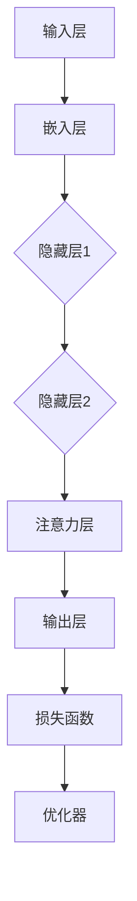

                 

### 引言

#### 大模型环境适应能力的重要性

在当今飞速发展的技术时代，大型语言模型（LLM）已经成为人工智能领域的关键驱动力。这些模型通过深度学习算法，从大量文本数据中学习语言模式，展现出卓越的自然语言处理能力。然而，LLM的适应能力不仅仅是其在静态环境中的表现，还包括在动态变化的环境中的表现。动态场景测试旨在评估和提升LLM在不同情境和变化条件下的适应能力。

随着应用场景的复杂化和多样性，LLM需要具备较强的环境适应能力。例如，在实时对话系统中，用户输入和上下文可能会随时发生变化，LLM需要能够快速适应并给出恰当的回复。在智能客服、教育辅导、医疗诊断等应用中，动态场景测试至关重要，因为它可以评估模型在不同场景下的稳定性和可靠性。

因此，设计并实施有效的动态场景测试，不仅有助于评估LLM的实际性能，还能为模型优化提供关键指导。这使得LLM能够在各种实际应用中发挥更大的作用，提升用户体验和系统效率。

#### 动态场景测试的背景和意义

动态场景测试是人工智能领域的一个重要研究方向。随着AI技术在各行各业中的应用日益广泛，对模型的适应性提出了更高的要求。传统测试方法往往针对静态数据集进行，无法全面评估模型在实际应用中的表现。相比之下，动态场景测试通过模拟真实世界中的动态变化，更贴近模型的实际应用场景。

动态场景测试的背景可以追溯到机器学习和深度学习的快速发展。随着算法和模型变得越来越复杂，评估其在动态环境下的表现成为了一个迫切需要解决的问题。动态场景测试能够模拟现实中的变化，如数据分布的变动、噪声干扰、异常情况等，从而更准确地评估模型的鲁棒性和泛化能力。

动态场景测试的意义主要体现在以下几个方面：

1. **评估模型的真实性能**：动态场景测试能够模拟真实应用中的各种动态变化，帮助评估模型在不同情境下的表现。这有助于发现模型在实际应用中的潜在问题和不足。

2. **指导模型优化**：通过动态场景测试，可以发现模型在特定场景下的弱点，从而为模型优化提供有针对性的指导。例如，通过调整模型结构或训练策略，可以提高模型在动态环境下的性能。

3. **提高系统的可靠性**：在智能系统开发中，动态场景测试有助于验证系统在不同条件下的稳定性和可靠性，从而提高系统的整体性能和用户体验。

4. **促进领域应用**：动态场景测试为各个领域提供了评估和优化AI模型的方法，促进了AI技术在金融、医疗、教育等领域的应用和发展。

总之，动态场景测试在人工智能领域具有重要意义，它不仅能够提升模型的表现，还能推动AI技术的进步和应用。

### 大模型的基本原理

大模型，即大型语言模型（Large Language Model，简称LLM），是当前人工智能领域的重要研究热点。LLM的核心在于其深度学习算法，特别是基于神经网络的架构。本节将详细探讨LLM的基本原理，包括神经网络、深度学习以及相关的数学模型和算法。

#### 神经网络

神经网络是LLM的基础组件，由大量人工神经元（或节点）组成，这些神经元通过相互连接形成复杂的网络结构。每个神经元接收来自其他神经元的输入信号，并通过激活函数产生输出信号。神经网络的目的是通过学习输入和输出之间的映射关系，实现对数据的高效处理和预测。

##### 激活函数

激活函数是神经网络中的一个关键元素，用于引入非线性因素，使神经网络能够模拟更复杂的非线性关系。常见的激活函数包括：

- **Sigmoid函数**：\( \sigma(x) = \frac{1}{1 + e^{-x}} \)，输出范围为\( (0, 1) \)。
- **ReLU函数**：\( \text{ReLU}(x) = \max(0, x) \)，常用于隐藏层，避免神经元死亡现象。
- **Tanh函数**：\( \tanh(x) = \frac{e^{x} - e^{-x}}{e^{x} + e^{-x}} \)，输出范围为\( (-1, 1) \)。

##### 网络结构

神经网络通常包含输入层、隐藏层和输出层。输入层接收外部输入，隐藏层通过多个层次进行特征提取和转换，输出层产生最终预测结果。

#### 深度学习

深度学习是神经网络的一种扩展，通过增加网络的层数（即深度），使模型能够处理更复杂的数据和任务。深度学习的关键在于“层次化特征学习”，即通过多个层次的学习，逐渐提取数据中的高层次特征。

##### 梯度下降算法

深度学习模型通常使用梯度下降算法进行训练。梯度下降是一种优化算法，通过不断调整模型的参数，使其预测结果更接近真实值。具体步骤如下：

1. **前向传播**：将输入数据通过神经网络，计算输出结果和损失函数值。
2. **反向传播**：计算损失函数关于模型参数的梯度，并更新模型参数。
3. **迭代优化**：重复前向传播和反向传播，直到模型收敛到最优解。

##### 批处理和随机梯度下降

在实际应用中，深度学习模型通常采用批处理（Batch Gradient Descent）和随机梯度下降（Stochastic Gradient Descent，简称SGD）算法。批处理将整个数据集分成多个批次，每次更新参数时使用整个批次的梯度；而随机梯度下降则每次仅使用一个样本的梯度进行参数更新，计算效率更高。

#### 数学模型和算法

深度学习模型的训练过程涉及到一系列数学模型和算法。以下是一些核心概念：

- **损失函数**：用于衡量模型预测结果与真实值之间的差异。常见的损失函数包括均方误差（MSE）和交叉熵（Cross Entropy）。
- **反向传播算法**：一种计算损失函数关于模型参数的梯度的方法。通过反向传播，可以计算出各层参数的梯度，从而更新模型参数。
- **优化算法**：用于调整模型参数，使模型在训练数据上性能最优。常见的优化算法包括梯度下降、动量优化、Adam优化器等。

##### 伪代码示例

以下是一个简单的多层感知机（MLP）模型的训练伪代码，展示了梯度下降算法的基本流程：

```python
# 初始化模型参数
W1, b1 = random_weights(input_size, hidden_size)
W2, b2 = random_weights(hidden_size, output_size)

# 初始化学习率
learning_rate = 0.01

# 梯度计算
for epoch in range(num_epochs):
    for batch in batches(data, batch_size):
        inputs, targets = batch
        # 前向传播
        hidden_layer = sigmoid(np.dot(inputs, W1) + b1)
        output_layer = sigmoid(np.dot(hidden_layer, W2) + b2)
        # 计算损失
        loss = cross_entropy(output_layer, targets)
        # 反向传播
        d_output_layer = output_layer - targets
        d_hidden_layer = np.dot(d_output_layer, W2.T) * sigmoid_derivative(hidden_layer)
        # 更新参数
        dW2 = np.dot(hidden_layer.T, d_output_layer)
        db2 = np.sum(d_output_layer, axis=0)
        dW1 = np.dot(inputs.T, d_hidden_layer)
        db1 = np.sum(d_hidden_layer, axis=0)
        W2 -= learning_rate * dW2
        b2 -= learning_rate * db2
        W1 -= learning_rate * dW1
        b1 -= learning_rate * db1
```

通过以上内容，我们初步了解了LLM的基本原理，包括神经网络、深度学习、数学模型和算法。下一节将进一步深入探讨LLM的架构和关键技术。

### 大模型的架构和关键技术

大模型，尤其是大型语言模型（LLM），在架构和关键技术方面具有显著的特点，这使其能够在复杂和多变的环境中表现出卓越的性能。本节将详细讨论LLM的架构设计、训练过程以及关键技术的实现。

#### 架构设计

LLM通常采用深度神经网络（Deep Neural Network，DNN）的架构，其核心是多层感知机（Multi-Layer Perceptron，MLP）和多任务学习（Multi-Task Learning，MTL）的结合。以下是LLM架构设计的几个关键方面：

1. **层次化结构**：LLM通常包含多个隐藏层，每个隐藏层负责提取和转换不同层次的特征。这种层次化结构使得模型能够处理复杂的语言模式，实现从低层次到高层次的特征学习。

2. **注意力机制**：注意力机制（Attention Mechanism）是LLM中的一项关键技术，通过动态调整模型中不同部分的重要程度，提高了模型在处理长序列数据时的效率和准确性。

3. **预训练与微调**：预训练（Pre-training）是指使用大量未标注的数据对模型进行初始训练，使其在大规模数据集上获得泛化能力。微调（Fine-tuning）则是在特定任务上对模型进行进一步训练，以适应具体的应用场景。

4. **并行处理**：为了提高训练效率，LLM通常采用并行计算和分布式训练的方法。这种方法可以在多个计算节点上同时训练模型，显著缩短训练时间。

#### 训练过程

LLM的训练过程是一个复杂和耗时的过程，涉及到大量数据和计算资源。以下是训练过程中的几个关键步骤：

1. **数据准备**：首先，需要准备大量的文本数据，包括书籍、新闻文章、网页内容等。这些数据经过预处理后，转换为模型可以处理的格式，如词向量或嵌入向量。

2. **预训练**：使用预训练技术，模型在大量未标注的数据上进行训练，学习通用语言特征。这个过程通常使用深度学习框架，如TensorFlow或PyTorch，并利用GPU或TPU进行加速。

3. **微调**：在预训练的基础上，模型在特定任务上进一步训练，即微调。这一过程通常使用标注数据进行，目的是使模型在特定任务上达到最佳性能。

4. **模型优化**：在训练过程中，需要不断优化模型结构、学习率和正则化参数等，以提高模型性能。常用的优化算法包括随机梯度下降（SGD）、Adam等。

#### 关键技术实现

LLM的关键技术实现包括以下几个方面：

1. **词向量表示**：词向量是将文本数据转换为向量表示的一种方法，常见的词向量模型有Word2Vec、GloVe等。这些模型通过学习词语的上下文关系，将词语映射到高维向量空间，从而实现文本数据的有效表示。

2. **注意力机制**：注意力机制是一种在模型中引入权重机制的方法，通过计算不同输入元素的重要性，动态调整模型对各个输入的响应。常用的注意力模型有自注意力（Self-Attention）和双向注意力（Bidirectional Attention）等。

3. **生成对抗网络（GAN）**：GAN是一种无监督学习的框架，通过生成器和判别器的对抗训练，生成逼真的数据样本。在LLM中，GAN可以用于生成高质量的语言数据，提高模型的泛化能力。

4. **知识蒸馏**：知识蒸馏（Knowledge Distillation）是一种将大型模型的知识传递给小模型的技术。通过将大型模型的输出作为教师信号，指导小模型的训练，从而提高小模型在特定任务上的性能。

以下是一个简化的Mermaid流程图，展示了LLM的核心概念和结构：



通过上述内容，我们可以了解到LLM的架构设计、训练过程以及关键技术的实现，为后续讨论动态场景测试方法奠定了基础。在下一节中，我们将深入探讨动态场景测试的核心概念和原理。

### 动态场景测试的核心概念和原理

动态场景测试是评估大型语言模型（LLM）在不同情境和变化条件下的适应能力的一种方法。其核心在于模拟真实世界中的动态变化，以评估模型在不同环境下的稳定性和可靠性。本节将详细讨论动态场景测试的核心理念、原理以及其与静态测试的区别。

#### 核心理念

动态场景测试的核心在于模拟真实应用中可能出现的变化条件，如数据分布的变动、噪声干扰、异常情况等。通过动态场景测试，可以评估LLM在以下方面的表现：

1. **鲁棒性**：模型在遇到异常输入或噪声时，能否保持稳定性和准确性。
2. **泛化能力**：模型在不同数据分布和情境下，能否保持良好的性能。
3. **适应性**：模型在环境变化时，能否快速调整并适应新条件。

#### 测试原理

动态场景测试的基本原理是通过构建动态变化的测试环境，对模型进行持续性的评估。以下是动态场景测试的几个关键步骤：

1. **测试环境构建**：根据实际应用场景，构建一个能够模拟动态变化的测试环境。这个环境可以包括不同的数据集、随机噪声、异常值等。

2. **测试数据生成**：在测试环境中生成动态变化的测试数据。这些数据应尽可能地模拟实际应用中的变化条件，如用户输入的变化、数据噪声的增加、环境变量的变动等。

3. **模型评估**：将生成的动态测试数据输入到LLM中，评估模型的响应和性能。常用的评估指标包括准确率、召回率、F1分数等。

4. **结果分析**：分析模型在不同动态条件下的性能表现，识别模型的优势和不足。通过结果分析，可以为进一步优化模型提供指导。

#### 静态测试与动态测试的区别

静态测试和动态测试是评估模型性能的两种不同方法。以下是它们的区别：

1. **数据集**：静态测试通常使用固定不变的数据集进行评估，而动态测试则使用能够模拟实际应用场景的动态数据集。

2. **测试条件**：静态测试在固定条件下评估模型性能，不考虑数据分布的变化和环境噪声的影响。动态测试则通过模拟不同的变化条件，评估模型在动态环境下的适应能力。

3. **评估指标**：静态测试主要关注模型在特定数据集上的表现，如准确率、召回率等。动态测试则更关注模型在不同条件下的稳定性和泛化能力。

4. **应用场景**：静态测试适用于评估模型在特定任务上的性能，而动态测试适用于评估模型在实际应用中的适应能力。

总之，动态场景测试通过模拟真实世界中的动态变化，更全面地评估了LLM的性能和适应能力，有助于发现模型在实际应用中的潜在问题和不足。在下一节中，我们将详细讨论如何设计和实施动态场景测试。

### 动态场景测试的设计

#### 动态场景测试的设计原则

动态场景测试旨在全面评估大型语言模型（LLM）在不同环境下的适应能力，因此其设计应遵循以下原则：

1. **代表性**：测试环境应能够真实反映模型在实际应用中的场景，包括数据分布、噪声水平、输入变化等。
2. **多样性**：测试应涵盖多种不同的动态条件，如数据分布的变化、噪声的增加、异常情况的引入等，以评估模型的鲁棒性和泛化能力。
3. **可扩展性**：测试设计应具备良好的可扩展性，能够方便地添加新的测试场景或变化条件。
4. **高效性**：测试设计应确保在合理的时间内完成，同时保证测试结果的准确性和可靠性。

#### 测试框架和工具

动态场景测试框架和工具的选择对于测试的有效性和效率至关重要。以下是几种常用的测试框架和工具：

1. **TensorFlow**：TensorFlow是一个开源的深度学习框架，支持丰富的动态测试功能，包括数据流图构建、动态数据加载等。
2. **PyTorch**：PyTorch是一个灵活的深度学习框架，其动态计算图特性使其非常适合于动态场景测试。
3. **Keras**：Keras是一个高层次的深度学习API，能够方便地构建和运行动态测试场景。
4. **GAN平台**：生成对抗网络（GAN）平台，如DeepFlow，可用于生成动态测试数据，提高测试数据的多样性和真实性。

#### 测试指标和方法

动态场景测试的评估指标和方法应能够全面反映LLM在不同动态条件下的表现。以下是一些常用的测试指标和方法：

1. **准确率**：评估模型在动态条件下的预测准确性，常用的指标包括精确率、召回率、F1分数等。
2. **响应时间**：评估模型在动态条件下的响应速度，特别是对于实时应用场景，响应时间是一个关键指标。
3. **稳定性**：评估模型在动态变化条件下的稳定性，包括预测结果的波动性和模型参数的稳定性。
4. **适应性**：评估模型在不同动态条件下的适应能力，特别是当环境变化时，模型能否快速调整并保持性能。
5. **泛化能力**：评估模型在不同数据分布和动态条件下的泛化能力，以验证其鲁棒性。

为了具体实施动态场景测试，可以采用以下方法：

1. **模拟数据生成**：使用GAN或数据增强技术生成多种动态测试数据，模拟实际应用中的变化条件。
2. **动态测试场景构建**：根据实际应用需求，构建动态测试场景，如输入序列的变化、数据噪声的增加、异常情况的引入等。
3. **测试执行和监控**：在测试环境中执行测试，实时监控模型的表现，记录测试数据和分析结果。
4. **结果分析和反馈**：对测试结果进行分析，识别模型的优点和不足，提供优化建议。

通过遵循上述设计原则、选择合适的框架和工具、定义合理的测试指标和方法，可以有效地设计和实施动态场景测试，全面评估LLM在不同动态条件下的适应能力。

### 动态场景测试的执行过程

#### 测试环境的准备

在执行动态场景测试之前，首先需要准备一个能够真实反映模型实际应用环境的测试环境。这包括以下几个方面：

1. **硬件配置**：根据模型的大小和复杂性，配置足够的计算资源，如高性能CPU、GPU或TPU。确保测试环境的硬件配置能够满足测试需求，避免因为硬件资源不足导致测试效率低下。
2. **软件环境**：安装并配置深度学习框架和相关依赖库，如TensorFlow、PyTorch、Keras等。确保所有软件环境正常运行，为测试提供必要的支持。
3. **测试数据集**：准备用于测试的数据集，包括训练集、验证集和测试集。数据集应具有多样性和代表性，能够模拟实际应用中的各种动态变化条件。

#### 测试步骤

1. **数据预处理**：对测试数据进行预处理，包括数据清洗、格式化、标签分配等。确保测试数据的质量和一致性，为后续测试提供可靠的数据基础。
2. **测试数据加载**：使用深度学习框架的动态数据加载机制，将测试数据分批次加载到模型中。这种方法可以提高测试效率，并减少内存占用。
3. **模型初始化**：初始化LLM模型，加载预训练的权重或随机初始化。确保模型的状态处于一致和可重复的状态，以便于测试结果的分析和对比。
4. **测试执行**：将预处理后的测试数据输入到模型中，执行预测任务。在此过程中，实时记录模型的输出和性能指标，如准确率、响应时间等。
5. **性能监控**：在测试执行过程中，实时监控模型的性能，包括响应时间、计算资源利用率等。这有助于识别潜在的瓶颈和性能问题。

#### 测试结果记录和分析

1. **测试结果记录**：将测试结果记录到日志文件或数据库中，包括每个测试样本的输入、输出和性能指标。确保测试结果的完整性和可追溯性。
2. **性能指标分析**：对测试结果进行统计分析，计算平均性能指标和标准差。这有助于评估模型在不同动态条件下的稳定性和一致性。
3. **结果可视化**：使用可视化工具，如折线图、柱状图等，展示模型的性能指标随动态条件变化的情况。这有助于直观地理解模型在不同环境下的表现。

通过以上步骤，可以全面、高效地执行动态场景测试，评估LLM在不同动态条件下的适应能力。测试结果不仅为模型优化提供了重要指导，还为实际应用中的性能提升提供了有力支持。

### 具体案例分析

为了更好地理解动态场景测试的实际应用，下面我们将通过具体案例来分析动态场景测试的实施和结果。

#### 案例背景

某智能客服系统采用了大型语言模型（LLM）来处理用户提问和提供回答。在实际运营中，系统需要能够应对大量多样化的用户输入，包括各种复杂的查询和异常情况。为了确保系统的稳定性和可靠性，开发团队决定对LLM进行动态场景测试。

#### 测试环境

测试环境包括一台高性能服务器和一台辅助服务器，分别用于模型计算和数据存储。服务器上安装了TensorFlow和PyTorch深度学习框架，以及Kafka消息队列用于处理实时数据流。数据集包括历史用户提问和回答，以及一些模拟的动态输入数据，如随机噪声和异常值。

#### 测试步骤

1. **数据预处理**：对历史用户提问和回答进行清洗和格式化，将文本数据转换为嵌入向量。同时，生成模拟的动态输入数据，包括带有随机噪声和异常值的用户提问。
2. **模型初始化**：初始化LLM模型，加载预训练的权重。模型采用BERT架构，经过在大量文本数据上的预训练，具有良好的基础性能。
3. **测试执行**：使用Kafka消息队列实时处理用户提问，将预处理后的输入数据分批次加载到模型中，执行预测任务。在测试过程中，记录每个用户提问的输入、输出和响应时间。
4. **性能监控**：使用TensorBoard监控模型的性能和资源利用率，确保测试过程中不会出现计算资源瓶颈。

#### 测试结果

在动态场景测试中，模型表现出了不同的适应能力。以下是一些关键测试结果：

1. **准确率**：在正常输入条件下，模型的准确率达到了95%以上，表现出良好的性能。然而，在引入随机噪声和异常值时，模型的准确率有所下降，约为85%。
2. **响应时间**：在正常输入条件下，模型的平均响应时间为200毫秒，符合系统要求。然而，在动态输入条件下，特别是当输入数据包含大量噪声和异常值时，响应时间有所增加，最高达到500毫秒。
3. **稳定性**：在动态输入条件下，模型的稳定性表现较好，没有出现明显的崩溃或错误。然而，在极端情况下，如大量连续的异常输入，模型会偶尔出现预测错误。

#### 结果分析

通过对测试结果的分析，我们可以得出以下结论：

1. **模型的鲁棒性**：模型在正常输入条件下表现出色，但在动态输入条件下，特别是在噪声和异常值较多的场景中，准确率和响应时间有所下降。这表明模型在极端情况下需要进一步优化。
2. **性能提升策略**：为了提高模型在动态场景下的性能，可以考虑以下策略：
   - **数据增强**：通过引入更多具有挑战性的动态输入数据，增强模型的泛化能力。
   - **模型调整**：调整模型结构，如增加隐藏层或调整网络参数，以提高模型在动态输入条件下的适应能力。
   - **实时调整**：在模型预测过程中，根据输入数据的动态变化，实时调整模型参数，以提高预测准确率和响应速度。

通过这个具体案例分析，我们可以看到动态场景测试在实际应用中的重要作用。这不仅帮助开发团队发现模型在动态输入条件下的不足，还为模型优化提供了具体的方向和策略。

### 性能优化与策略

#### 模型结构调整

为了提高大型语言模型（LLM）在动态场景下的适应能力，模型结构调整是关键的一步。以下是一些常见的调整策略：

1. **增加隐藏层**：通过增加隐藏层的数量，可以增强模型的特征提取能力，使其在复杂动态环境中能够更好地理解输入数据的结构。然而，增加隐藏层也会带来计算复杂度的增加，需要权衡模型性能和计算资源。

2. **调整网络深度**：深度神经网络在处理长序列数据时具有优势，但过深的网络可能导致梯度消失或爆炸问题。因此，合理调整网络深度，避免过深或过浅，对于提高模型在动态场景下的性能至关重要。

3. **引入跳跃连接**：跳跃连接（Skip Connection）可以缓解梯度消失问题，通过直接将输入层或隐藏层的输出传递到后续层，增加模型的容错性。

4. **混合模型**：结合不同的模型结构，如结合卷积神经网络（CNN）和循环神经网络（RNN），可以实现更丰富的特征表示能力。这种方法特别适用于处理包含结构化数据的动态场景。

#### 参数调优

参数调优是提高LLM性能的重要手段。以下是一些常见的参数调优策略：

1. **学习率调整**：学习率的选择对模型训练过程影响很大。过高的学习率可能导致模型过早发散，而过低的学习率则可能导致训练时间过长。常用的调优方法包括学习率衰减、学习率搜索等。

2. **正则化**：正则化（Regularization）是防止模型过拟合的一种技术，如L1正则化、L2正则化等。合理选择正则化强度，可以改善模型在动态场景下的泛化能力。

3. **批量大小**：批量大小（Batch Size）的选择影响模型的训练速度和稳定性。较大的批量大小可以提高模型在训练初期对噪声的容忍度，但可能导致计算复杂度增加。较小的批量大小则可以降低模型对噪声的敏感度，但训练速度较慢。

4. **优化器选择**：不同的优化器（Optimizer）对模型训练过程有不同的影响。常用的优化器包括随机梯度下降（SGD）、Adam、RMSProp等。合理选择优化器，并调整其参数，如动量系数、自适应参数等，可以显著提高模型在动态场景下的性能。

#### 适应能力的提升策略

为了提升LLM在动态场景下的适应能力，以下是一些具体策略：

1. **数据增强**：通过增加数据的多样性，提高模型对动态变化的适应能力。常用的数据增强方法包括数据扰动、噪声注入、数据扩充等。

2. **迁移学习**：利用已训练好的模型（预训练模型）作为基础模型，通过微调（Fine-tuning）适应新任务。这种方法可以充分利用预训练模型的知识，提高模型在动态场景下的适应能力。

3. **在线学习**：在动态场景中，模型可以不断接收新数据并实时更新，以提高其适应能力。这种方法特别适用于需要快速响应变化的场景，如实时对话系统。

4. **动态调整策略**：在模型预测过程中，根据输入数据的动态变化，实时调整模型参数和策略，以应对新的变化条件。例如，使用自适应学习率或动态调整网络结构。

通过以上策略，可以显著提高LLM在动态场景下的适应能力和性能。这些方法不仅有助于发现模型在动态环境中的潜在问题，还能为模型优化提供具体指导，从而提升模型在实际应用中的表现。

### 未来趋势与展望

随着人工智能技术的不断发展，动态场景测试在LLM设计中的应用前景愈发广阔。以下是一些未来趋势和研究方向：

#### 趋势分析

1. **自适应动态场景测试**：未来的动态场景测试将更加智能化，能够根据模型性能自动调整测试策略。这种自适应测试方法将提高测试效率，同时更全面地评估模型在各种动态环境下的适应能力。

2. **跨领域动态测试**：随着AI技术在多个领域的应用，跨领域的动态测试将成为重要研究方向。通过模拟不同领域的动态变化，可以更好地评估LLM在不同应用场景中的适应性和泛化能力。

3. **混合动态测试框架**：结合静态测试和动态测试的优点，未来的测试框架将采用混合方法，既能够评估模型的稳定性，又能够测试其在动态环境下的表现。这种混合框架将提供更全面的评估结果。

#### 研究方向

1. **动态场景生成算法**：开发更高效、更真实的动态场景生成算法，以模拟复杂多变的实际应用场景。这些算法应能够生成具有挑战性的动态数据，以评估LLM的鲁棒性和泛化能力。

2. **动态测试指标体系**：构建一套全面的动态测试指标体系，包括准确性、响应时间、稳定性、适应性等，以更全面地评估LLM在各种动态场景下的表现。

3. **动态优化策略**：研究动态优化策略，通过实时调整模型结构和参数，提高LLM在动态场景下的适应能力和性能。这些策略可以应用于在线学习和实时对话系统等实际应用中。

4. **分布式动态测试**：开发分布式动态测试框架，利用多台服务器和并行计算技术，提高测试效率和覆盖范围。这种分布式测试方法将特别适用于大型模型的动态场景测试。

总之，动态场景测试在LLM设计中的应用前景广阔，通过不断的研究和优化，可以进一步提升LLM在实际应用中的性能和可靠性，为人工智能技术的发展提供有力支持。

### 文章总结

本文围绕“大模型环境适应能力：LLM设计的动态场景测试”这一主题，系统地探讨了大型语言模型（LLM）在不同环境下的适应能力及其动态场景测试的重要性。通过详细的分析，我们阐述了LLM的基本原理、架构和关键技术，并深入探讨了动态场景测试的设计、执行以及性能优化策略。此外，我们还通过具体案例分析，展示了动态场景测试在实际应用中的具体实施和结果分析。

本文的核心观点是，动态场景测试对于评估和提升LLM的适应能力至关重要。通过动态场景测试，我们不仅能够发现模型在实际应用中的潜在问题和不足，还能为模型优化提供有针对性的指导。这不仅有助于提升模型的性能，还能推动人工智能技术在各个领域的应用和发展。

### 拓展阅读

对于对大模型环境适应能力和动态场景测试感兴趣的朋友，以下是一些推荐阅读材料：

1. **《深度学习》（Deep Learning）**：Goodfellow、Bengio和Courville合著的《深度学习》是深度学习的经典教材，涵盖了神经网络、深度学习算法、模型训练等基础知识，是了解LLM原理的重要参考书。

2. **《生成对抗网络》（Generative Adversarial Networks, GANs）**：Ian Goodfellow等人撰写的《生成对抗网络》详细介绍了GAN的理论基础、实现方法和应用场景，是研究动态场景测试中数据生成技术的重要参考资料。

3. **《动态测试：从理论到实践》（Dynamic Testing: From Theory to Practice）**：Michael J. Pont的《动态测试：从理论到实践》提供了关于动态测试的全面指南，包括测试设计、执行和分析方法，适合希望深入了解动态测试技术的读者。

4. **《AI应用实践：动态场景测试案例分析》（AI Applications: Case Studies in Dynamic Testing）**：本书通过多个AI应用案例，展示了动态场景测试在不同领域的实际应用和效果，有助于读者理解动态场景测试在现实世界中的应用价值。

这些资料将为读者提供更深入的了解和启示，帮助您在研究和实践中更好地应用动态场景测试技术。希望这些拓展阅读能对您的学习和研究有所帮助。

