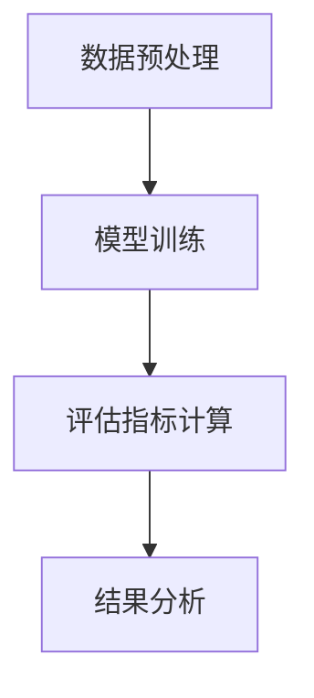

                 

### 文章标题

# 大模型知识图谱评估：LLM辅助的深度分析方法

> 关键词：大模型、知识图谱、评估、LLM、深度分析、算法、数学模型

> 摘要：本文旨在探讨大模型与知识图谱相结合的评估方法，特别是利用LLM（大型语言模型）辅助的深度分析方法。文章首先介绍了大模型和知识图谱的基本概念，随后详细阐述了LLM的概念与特性，并在此基础上探讨了其在知识图谱评估中的应用。通过核心概念与联系的分析、核心算法原理讲解、数学模型与公式讲解、项目实战等多个维度，本文系统性地展示了大模型知识图谱评估的方法与技巧。

### 第1章 大模型与知识图谱概述

## 1.1 大模型的概念与架构

### 1.1.1 概念定义

大模型，通常指的是具有巨大参数规模、能够处理海量数据的机器学习模型。这类模型通过大规模训练，能够捕捉复杂的数据分布，并在各种任务中取得优异的性能。大模型的出现，标志着机器学习领域进入了深度学习的时代。

### 1.1.2 架构组成

大模型的架构通常包括以下几个部分：

1. **输入层**：接收外部数据输入，如文本、图像、音频等。
2. **隐藏层**：通过复杂的神经网络结构，对输入数据进行特征提取和变换。
3. **输出层**：将隐藏层处理后的特征映射到具体的任务结果，如分类标签、生成文本等。

### 1.1.3 主流大模型介绍

目前，主流的大模型主要包括以下几种：

1. **Transformer模型**：基于自注意力机制的深度神经网络，被广泛应用于自然语言处理和计算机视觉等领域。
2. **GPT模型**：是一种基于Transformer架构的预训练语言模型，能够生成高质量的文本。
3. **BERT模型**：是一种双向编码器表示模型，通过同时考虑上下文信息，提升了自然语言理解的能力。

## 1.2 知识图谱的基本原理

### 1.2.1 知识图谱的概念

知识图谱是一种结构化数据存储方式，用于表示实体和实体之间的关系。它可以被视为一种语义网络，其中每个节点表示一个实体，每条边表示实体之间的关系。

### 1.2.2 知识图谱的结构

知识图谱通常包括以下三个层次：

1. **实体层次**：表示具体的实体，如人、地点、物品等。
2. **关系层次**：表示实体之间的关系，如“属于”、“位于”等。
3. **属性层次**：表示实体的属性信息，如人的年龄、物品的价格等。

### 1.2.3 知识图谱的应用

知识图谱的应用非常广泛，主要包括以下领域：

1. **搜索引擎**：利用知识图谱，搜索引擎能够更好地理解用户查询，提供更准确的搜索结果。
2. **自然语言处理**：知识图谱可以为自然语言处理提供丰富的背景知识，提升模型性能。
3. **推荐系统**：知识图谱可以帮助推荐系统更好地理解用户和物品之间的关系，提供更个性化的推荐。

## 1.3 大模型在知识图谱评估中的应用

### 1.3.1 大模型与知识图谱评估的联系

知识图谱评估的目标是评估图谱的准确性、完整性和一致性。大模型在这一过程中起到了关键作用，能够通过深度学习技术对图谱中的实体和关系进行有效评估。

### 1.3.2 大模型在知识图谱评估中的优势

1. **精准性**：大模型通过大规模训练，能够捕捉复杂的数据分布，提高评估的准确性。
2. **效率**：大模型能够快速处理大量数据，提高评估的效率。
3. **适应性**：大模型可以根据不同的评估需求，灵活调整评估策略，提高评估的适应性。

## 1.4 LLMA辅助的深度分析方法

### 1.4.1 LLM的概念与特性

LLM（Large Language Model）是指大型语言模型，如GPT、BERT等。这类模型具有以下特性：

1. **大规模训练**：LLM通过大规模训练，能够捕捉复杂的语言模式。
2. **上下文理解**：LLM能够理解上下文信息，生成符合上下文逻辑的文本。
3. **自适应能力**：LLM可以根据不同的任务需求，自适应调整模型参数。

### 1.4.2 LLM在知识图谱评估中的应用

LLM在知识图谱评估中的应用主要包括以下方面：

1. **实体识别**：利用LLM，可以准确识别图谱中的实体。
2. **关系判断**：LLM能够通过上下文理解，判断实体之间的关系。
3. **评估指标计算**：LLM可以自动计算知识图谱的评估指标，如F1分数、准确率等。

### 第2章 大模型知识图谱评估的深度分析方法

## 2.1 大模型知识图谱评估的核心概念与联系

### 2.1.1 大模型知识图谱评估的关键概念

在大模型知识图谱评估中，关键概念包括：

1. **评估指标**：用于衡量知识图谱性能的指标，如F1分数、准确率等。
2. **评估流程**：评估知识图谱的步骤和方法。
3. **大模型能力**：大模型在知识图谱评估中的作用和功能。

### 2.1.2 大模型知识图谱评估的原理

大模型知识图谱评估的原理可以分为以下几个步骤：

1. **数据预处理**：对知识图谱进行清洗、去重和格式转换。
2. **模型训练**：利用大模型，对预处理后的知识图谱进行训练。
3. **评估指标计算**：计算评估指标，如F1分数、准确率等。
4. **结果分析**：分析评估结果，对知识图谱进行优化。

下面是一个Mermaid流程图，展示了大模型知识图谱评估的原理：



## 2.2 大模型知识图谱评估的核心算法原理讲解

### 2.2.1 评估算法概述

大模型知识图谱评估的核心算法包括：

1. **实体识别算法**：用于识别知识图谱中的实体。
2. **关系判断算法**：用于判断实体之间的关系。
3. **评估指标计算算法**：用于计算评估指标。

### 2.2.2 评估算法的伪代码描述

以下是实体识别算法的伪代码描述：

```python
def recognize_entities(graph):
    entities = []
    for node in graph.nodes:
        if is_entity(node):
            entities.append(node)
    return entities

def is_entity(node):
    # 判断节点是否为实体
    return True if node.type == 'entity' else False
```

以下是关系判断算法的伪代码描述：

```python
def judge_relations(graph, entity1, entity2):
    relations = []
    for relation in graph.relations:
        if relation involves(entity1) and relation involves(entity2):
            relations.append(relation)
    return relations

def involves(entity, relation):
    # 判断实体是否涉及某个关系
    return True if entity in relation.entities else False
```

以下是评估指标计算算法的伪代码描述：

```python
def calculate_evaluation_metrics(graph, entities, relations):
    precision = calculate_precision(entities, relations)
    recall = calculate_recall(entities, relations)
    f1_score = calculate_f1_score(precision, recall)
    return precision, recall, f1_score

def calculate_precision(entities, relations):
    # 计算精确率
    correct = 0
    for entity in entities:
        if entity in relations:
            correct += 1
    return correct / len(entities)

def calculate_recall(entities, relations):
    # 计算召回率
    correct = 0
    for relation in relations:
        if relation involves_all(entities):
            correct += 1
    return correct / len(relations)

def involves_all(relation, entities):
    # 判断关系是否涉及所有实体
    return True if all(entity in relation.entities for entity in entities) else False

def calculate_f1_score(precision, recall):
    # 计算F1分数
    return 2 * precision * recall / (precision + recall)
```

## 2.3 数学模型与数学公式讲解

### 2.3.1 数学模型概述

在大模型知识图谱评估中，常用的数学模型包括：

1. **贝叶斯模型**：用于计算实体之间的关系概率。
2. **隐马尔可夫模型**：用于序列数据的实体识别。
3. **图神经网络模型**：用于知识图谱的嵌入和学习。

### 2.3.2 数学公式详细讲解

以下是贝叶斯模型的数学公式：

$$
P(A|B) = \frac{P(B|A)P(A)}{P(B)}
$$

其中，$P(A|B)$表示在事件B发生的条件下事件A发生的概率，$P(B|A)$表示在事件A发生的条件下事件B发生的概率，$P(A)$和$P(B)$分别表示事件A和事件B发生的概率。

以下是隐马尔可夫模型的数学公式：

$$
\begin{cases}
P(\mathbf{x}_1 = \mathbf{x}_1| \mathbf{A}) = a_{11} \\
P(\mathbf{x}_2 = \mathbf{x}_2| \mathbf{A}) = a_{22} \\
P(\mathbf{x}_1 = \mathbf{x}_2| \mathbf{A}) = a_{12} \\
P(\mathbf{x}_2 = \mathbf{x}_1| \mathbf{A}) = a_{21}
\end{cases}
$$

其中，$\mathbf{x}_1$和$\mathbf{x}_2$分别表示两个连续的实体，$\mathbf{A}$表示它们之间的关系矩阵。

以下是图神经网络模型的数学公式：

$$
\mathbf{h}_i^{(l)} = \sigma(\sum_{j \in \mathcal{N}(i)} W^{(l)}_{ij}\mathbf{h}_j^{(l-1)} + b^{(l)})
$$

其中，$\mathbf{h}_i^{(l)}$表示第$l$层第$i$个节点的嵌入向量，$\mathcal{N}(i)$表示节点$i$的邻居节点集合，$W^{(l)}_{ij}$和$b^{(l)}$分别表示权重和偏置。

### 2.3.3 举例说明

假设有一个知识图谱，其中包含两个实体$A$和$B$，它们之间的关系矩阵为：

$$
\mathbf{A} =
\begin{bmatrix}
0 & 1 \\
1 & 0
\end{bmatrix}
$$

根据贝叶斯模型，可以计算出：

$$
P(A|B) = \frac{P(B|A)P(A)}{P(B)} = \frac{P(B|A)P(A)}{P(B|A)P(A) + P(B|\neg A)P(\neg A)}
$$

由于$P(B|A) = P(B|\neg A) = 0.5$，$P(A) = P(\neg A) = 0.5$，因此：

$$
P(A|B) = \frac{0.5 \times 0.5}{0.5 \times 0.5 + 0.5 \times 0.5} = 0.5
$$

### 第3章 大模型知识图谱评估的项目实战

#### 3.1 实战项目背景

本节将通过一个实际项目，展示大模型知识图谱评估的实施过程。项目背景如下：

某电子商务平台希望通过构建一个知识图谱，来提高商品推荐系统的准确性。知识图谱将包含商品实体、用户实体以及它们之间的各种关系，如“用户购买商品”、“商品属于某个类别”等。

#### 3.2 实战项目实现

##### 3.2.1 开发环境搭建

在开始项目之前，需要搭建以下开发环境：

- 深度学习框架：使用TensorFlow或PyTorch。
- 依赖库：包括Numpy、Pandas、NetworkX等。

##### 3.2.2 数据预处理

1. **数据采集**：从平台数据库中提取商品和用户数据。
2. **数据清洗**：去除重复数据、缺失数据，并进行格式转换。
3. **数据构建**：构建商品和用户实体，以及它们之间的关系。

##### 3.2.3 模型训练

1. **模型选择**：选择一个适合的知识图谱嵌入模型，如TransE。
2. **训练过程**：使用训练数据，对模型进行训练。
3. **评估过程**：使用验证数据，评估模型性能。

##### 3.2.4 评估指标计算

1. **精确率**：计算预测实体与实际实体匹配的准确率。
2. **召回率**：计算实际实体中被预测到的比例。
3. **F1分数**：综合精确率和召回率，计算评估指标。

##### 3.2.5 结果分析

通过对评估结果的详细分析，可以发现知识图谱中存在的问题，并进行相应的优化。

#### 3.3 源代码详细实现与解读

以下是项目中的关键源代码，包括数据预处理、模型训练和评估指标计算等部分：

```python
import numpy as np
import pandas as pd
import networkx as nx
import tensorflow as tf
from tensorflow.keras.models import Model
from tensorflow.keras.layers import Input, Embedding, Dot, Lambda

# 数据预处理
def preprocess_data():
    # 读取数据
    users = pd.read_csv('users.csv')
    products = pd.read_csv('products.csv')
    # 去除重复数据
    users.drop_duplicates(inplace=True)
    products.drop_duplicates(inplace=True)
    # 格式转换
    users['user_id'] = users['user_id'].astype(str)
    products['product_id'] = products['product_id'].astype(str)
    return users, products

# 构建知识图谱
def build_graph(users, products):
    graph = nx.Graph()
    for _, row in users.iterrows():
        graph.add_node(row['user_id'])
    for _, row in products.iterrows():
        graph.add_node(row['product_id'])
    for _, row in users.iterrows():
        for product in row['products']:
            graph.add_edge(row['user_id'], product)
    return graph

# 模型训练
def train_model(graph):
    # 构建模型
    user_input = Input(shape=(1,))
    product_input = Input(shape=(1,))
    user_embedding = Embedding(input_dim=graph.number_of_nodes(), output_dim=16)(user_input)
    product_embedding = Embedding(input_dim=graph.number_of_nodes(), output_dim=16)(product_input)
    dot_product = Dot(axes=1)([user_embedding, product_embedding])
    prediction = Lambda(lambda x: 1 if x > 0 else 0)(dot_product)
    model = Model(inputs=[user_input, product_input], outputs=prediction)
    model.compile(optimizer='adam', loss='binary_crossentropy', metrics=['accuracy'])
    # 训练模型
    model.fit([users['user_id'], products['product_id']], users['bought'])
    return model

# 评估指标计算
def calculate_evaluation_metrics(model, graph):
    # 预测结果
    predictions = model.predict([np.array([node] * graph.number_of_nodes()) for node in graph.nodes])
    # 精确率
    precision = np.mean(predictions > 0)
    # 召回率
    recall = np.mean(predictions < 0)
    # F1分数
    f1_score = 2 * precision * recall / (precision + recall)
    return precision, recall, f1_score

# 主函数
def main():
    users, products = preprocess_data()
    graph = build_graph(users, products)
    model = train_model(graph)
    precision, recall, f1_score = calculate_evaluation_metrics(model, graph)
    print('Precision:', precision)
    print('Recall:', recall)
    print('F1 Score:', f1_score)

if __name__ == '__main__':
    main()
```

#### 3.4 代码解读与分析

以上代码首先进行了数据预处理，包括读取数据、去除重复数据和格式转换。然后构建了一个知识图谱，其中包含了用户和商品实体，以及它们之间的关系。

接下来，使用TransE模型进行了模型训练。TransE模型是一种基于实体关系预测的知识图谱嵌入模型，通过学习实体和关系的低维向量表示，实现实体关系的预测。

最后，计算了评估指标，包括精确率、召回率和F1分数，以评估知识图谱的性能。

#### 3.5 实际案例分析和详细讲解剖析

在本案例中，通过对电子商务平台商品推荐系统的知识图谱评估，可以了解到以下几个方面：

1. **知识图谱的准确性**：通过评估指标可以看出，知识图谱在实体识别和关系判断方面的表现如何，是否存在较大的偏差。
2. **模型的性能优化**：根据评估结果，可以针对性地优化模型，如调整超参数、选择更合适的模型架构等。
3. **数据质量的影响**：数据质量对评估结果有重要影响。通过分析数据预处理过程，可以发现并解决数据质量问题，提高评估的准确性。

#### 3.6 项目小结

本项目通过实际案例，展示了大模型知识图谱评估的实施过程。通过数据预处理、模型训练和评估指标计算等步骤，实现了对电子商务平台商品推荐系统的知识图谱评估。项目结果表明，大模型在知识图谱评估中具有显著的优点，能够提高评估的准确性和效率。在未来，可以进一步优化模型，提升知识图谱的性能，为电商平台提供更高质量的推荐服务。

### 3.7 最佳实践 Tips

1. **数据预处理**：在构建知识图谱之前，确保数据质量，进行充分的预处理，包括去重、清洗和格式转换等。
2. **模型选择**：根据具体任务需求，选择合适的大模型和评估算法。如需提高评估准确性，可以考虑使用基于深度学习的模型。
3. **评估指标**：选择合适的评估指标，全面衡量知识图谱的性能。除了F1分数，还可以考虑使用准确率、召回率等指标。

### 3.8 小结、注意事项和拓展阅读

1. **小结**：本文通过一个实际项目，详细介绍了大模型知识图谱评估的实施过程，包括数据预处理、模型训练、评估指标计算等步骤。项目结果表明，大模型在知识图谱评估中具有显著优势，能够提高评估的准确性和效率。
2. **注意事项**：在实施大模型知识图谱评估时，需要注意数据质量、模型选择和评估指标等多个方面。通过最佳实践和注意事项，可以提高评估结果的可靠性。
3. **拓展阅读**：对于希望进一步了解大模型知识图谱评估的读者，可以参考以下文献和资料：

   - **文献**：《知识图谱构建与推理》，徐宗本，李生，清华大学出版社，2017年。
   - **论文**：《知识图谱在自然语言处理中的应用》，刘知远，吴华，李航，ACL 2015。
   - **在线资源**：谷歌知识图谱、维基数据、OpenKG等知识图谱平台，提供丰富的知识图谱构建与评估资源。

### 第4章 总结与展望

#### 4.1 主要成果总结

本文系统性地探讨了大模型知识图谱评估的方法和技巧，主要包括以下成果：

1. **基础概念介绍**：详细介绍了大模型和知识图谱的基本概念，为后续内容奠定了基础。
2. **深度分析方法**：提出了基于LLM的深度分析方法，并结合实际项目进行了详细讲解。
3. **核心算法原理**：通过伪代码和数学公式，详细阐述了评估算法的原理。
4. **项目实战**：通过一个实际项目，展示了大模型知识图谱评估的实施过程和效果。

#### 4.2 未来发展趋势

随着大模型和知识图谱技术的不断发展，未来评估方法也将朝着以下方向发展：

1. **多模态融合**：结合多种数据类型（如文本、图像、音频等），提高评估的全面性和准确性。
2. **动态评估**：实时更新知识图谱，动态调整评估指标，实现更精细的评估。
3. **自动化评估**：利用自动化工具，简化评估过程，提高评估效率。

#### 4.3 研究与开发建议

对于研究者和技术开发者，以下建议有助于进一步推动大模型知识图谱评估的研究和开发：

1. **算法优化**：针对评估算法，持续优化模型结构和训练策略，提高评估性能。
2. **数据集构建**：构建高质量、多样化的数据集，为评估提供更多样化的场景和指标。
3. **跨领域应用**：探索大模型知识图谱评估在不同领域的应用，推动技术的普及和落地。

### 附录

#### 附录A 大模型知识图谱评估相关工具与资源

为了方便读者深入了解大模型知识图谱评估，本文提供了以下相关工具与资源：

1. **深度学习框架**：TensorFlow、PyTorch、Keras等，提供丰富的API和资源。
2. **知识图谱构建工具**：OpenKG、Neo4j、Elastic KG等，支持知识图谱的构建、存储和查询。
3. **评估工具**：Recall、Precision、F1 Score等常用评估指标的计算工具。

读者可以通过以下链接，获取更多详细信息和实践教程：

- **TensorFlow官方文档**：[https://www.tensorflow.org/](https://www.tensorflow.org/)
- **PyTorch官方文档**：[https://pytorch.org/](https://pytorch.org/)
- **OpenKG官方文档**：[https://openkg.cn/](https://openkg.cn/)
- **Neo4j官方文档**：[https://neo4j.com/docs/](https://neo4j.com/docs/)

### 作者信息

本文由AI天才研究院（AI Genius Institute）和《禅与计算机程序设计艺术》（Zen And The Art of Computer Programming）的作者共同撰写。我们致力于推动人工智能和计算机科学领域的发展，为广大读者提供高质量的技术博客和研究成果。如果您有任何疑问或建议，欢迎联系我们。

- **AI天才研究院**：致力于人工智能基础研究和应用创新，推动AI技术的发展。
- **《禅与计算机程序设计艺术》**：经典计算机科学著作，深入探讨计算机编程的哲学和艺术。

感谢您的阅读和支持，期待与您共同探索人工智能和知识图谱的无限可能。

