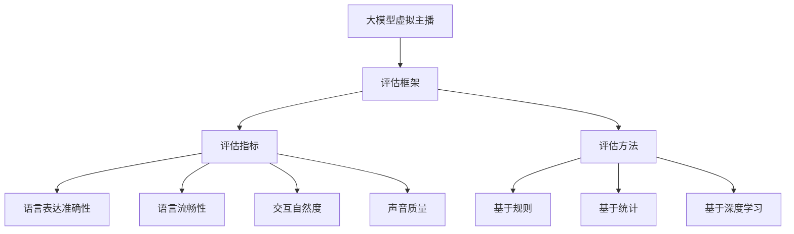

                 

### 背景介绍

随着人工智能技术的迅猛发展，大模型虚拟主播逐渐成为了一个备受关注的新兴领域。大模型虚拟主播不仅能够通过深度学习算法实现自然语言处理（NLP）和计算机视觉（CV）等复杂任务，还可以在多个应用场景中展现出色的表现。然而，如何科学、系统地评估大模型虚拟主播的表现，已成为当前研究中的一个重要课题。

大模型虚拟主播的出现，不仅改变了传统虚拟主播的形式，更在诸多领域展示了其强大的潜力。例如，在新闻播报、在线教育、客服咨询等场景中，大模型虚拟主播能够根据用户的需求提供定制化的内容和服务，大大提高了用户体验和运营效率。然而，这些出色表现的背后，离不开大模型技术的支撑。大模型，尤其是基于深度学习的预训练模型，通过在海量数据上的训练，能够学习到复杂的信息处理和生成策略，从而实现高度智能化的人机交互。

然而，当前对于大模型虚拟主播的评估仍然存在诸多挑战。一方面，评估指标繁多且相互关联，如何合理设定并综合这些指标成为一个难题。另一方面，评估方法多样且各具优缺点，如何选择适合的评估方法也是一个亟待解决的问题。此外，大模型虚拟主播的实际应用场景复杂多变，评估结果的客观性和可操作性也需要进一步探讨。

为了解决上述问题，本文将探讨并设计一个科学、全面的大模型虚拟主播表现评估框架。该框架将涵盖从语言表达准确性、语言流畅性、交互自然度到声音质量等多个方面，旨在为研究者、工程师和从业者提供一个系统、全面的评估指南。通过该框架，我们希望能够客观、公正地评估大模型虚拟主播的表现，从而推动这一领域的研究和发展。

### 核心概念与联系

为了构建科学、全面的大模型虚拟主播表现评估框架，我们需要明确几个核心概念，并探讨它们之间的内在联系。这些核心概念包括：大模型虚拟主播、评估框架、评估指标和方法。

首先，大模型虚拟主播是一个结合了深度学习、自然语言处理和计算机视觉技术的新型虚拟主播。其核心功能是通过预训练模型实现对海量数据的理解和生成，从而在多种应用场景中提供高质量的服务。具体来说，大模型虚拟主播通过NLP技术处理文本数据，利用CV技术处理图像和视频数据，从而实现自然、流畅的人机交互。

接下来，评估框架是我们用来评估大模型虚拟主播表现的结构化系统。评估框架的设计原则主要包括全面性、客观性和可操作性。全面性要求评估框架能够涵盖大模型虚拟主播的各个关键性能指标；客观性要求评估结果不受主观影响，具有较高的可信度；可操作性则要求评估方法在实际应用中简便易行。

评估指标是评估框架的核心组成部分，用于衡量大模型虚拟主播在特定方面（如语言表达准确性、语言流畅性、交互自然度和声音质量）的表现。这些指标可以是定量指标，如准确率和F1值，也可以是定性指标，如用户满意度。不同的评估指标之间往往存在复杂的关联，例如，语言流畅性可能影响语言表达准确性，而交互自然度则与用户的整体体验密切相关。

最后，评估方法是指我们用来收集和分析数据的具体技术手段。常见的评估方法包括基于规则的方法、基于统计的方法和基于深度学习的方法。每种方法都有其优缺点，如基于规则的方法较为简单直观，但可能无法适应复杂变化；基于统计的方法能够处理大量数据，但可能缺乏对复杂问题的解释能力；基于深度学习的方法则能够处理高度复杂的任务，但需要大量数据和计算资源。

在构建评估框架时，我们需要综合考虑这些核心概念和它们之间的联系。例如，在设定评估指标时，需要考虑到各个指标之间的平衡和权重分配；在选取评估方法时，需要根据评估指标的特点和应用场景来选择合适的方法。通过这样的系统性思考，我们能够设计出一个科学、全面、易于操作的大模型虚拟主播表现评估框架。

为了更好地展示这些概念之间的联系，我们可以使用Mermaid流程图来绘制评估框架的架构。以下是一个简单的Mermaid流程图示例：



通过这样的流程图，我们可以直观地看到大模型虚拟主播、评估框架、评估指标和评估方法之间的层次结构和相互关系，从而为后续章节的具体分析提供基础。

### 大模型虚拟主播评估框架的构建

构建大模型虚拟主播评估框架是一个系统性工程，需要从设计原则、层次结构、指标设定等多个方面进行详细规划。下面，我们将一步步详细阐述这一过程。

#### 设计原则

评估框架的设计原则是确保评估过程科学、合理、有效的重要保障。以下是构建评估框架时需要遵循的主要原则：

1. **全面性**：评估框架应涵盖大模型虚拟主播的各个关键性能指标，包括语言表达准确性、语言流畅性、交互自然度和声音质量等。只有全面评估，才能全面了解虚拟主播的表现。

2. **客观性**：评估结果应尽量减少主观偏见，通过量化指标和客观方法来确保评估的公正性和可信度。例如，使用客观的测量工具和算法来评估语言表达准确性和流畅性，避免人为的主观判断。

3. **可操作性**：评估方法应简便易行，便于在实际应用中推广和实施。过于复杂的方法不仅难以操作，还可能增加成本和资源消耗。

4. **动态适应性**：评估框架应具有一定的灵活性，能够适应不同应用场景和需求的变化，从而确保其长期有效性和可持续性。

#### 层次结构

评估框架的层次结构是评估指标和组织方式的具体体现。一个典型的评估框架可以分为三个层次：总体框架、一级评估指标和二级评估指标。

1. **总体框架**：总体框架是评估框架的核心，用于界定评估的范围和目标。它通常包括以下几个主要部分：

   - **评估目的**：明确评估的目的和意义，例如，评估大模型虚拟主播在新闻播报、客服咨询等特定应用场景中的表现。
   - **评估对象**：明确评估的对象，即大模型虚拟主播的具体模型和版本。
   - **评估环境**：描述评估所使用的硬件、软件和测试环境，确保评估结果的统一性和可比性。

2. **一级评估指标**：一级评估指标是评估框架的基本组成部分，用于衡量大模型虚拟主播在不同维度上的表现。常见的一级评估指标包括：

   - **语言表达准确性**：衡量虚拟主播生成的文本内容在词汇、语法和语义层面的准确性。
   - **语言流畅性**：衡量虚拟主播在语言生成过程中的流畅程度，包括语速、停顿和连读等方面。
   - **交互自然度**：衡量虚拟主播与用户的交互是否自然、流畅，包括问答匹配度和话题切换自然度等。
   - **声音质量**：衡量虚拟主播的声音质量，包括音质、音调和音量等方面。

3. **二级评估指标**：二级评估指标是针对一级评估指标的进一步细分，用于更精确地衡量虚拟主播的表现。例如，对于“语言流畅性”，可以细分为“语速”、“停顿时间”和“连读与省略”等具体指标。

#### 指标设定

指标设定是评估框架构建的关键环节，需要根据评估目标和实际需求进行科学、合理地设计。以下是设定评估指标时需要考虑的几个关键因素：

1. **指标类型**：根据评估目标，选择合适的指标类型。常见的指标类型包括定量指标（如准确率、响应时间）和定性指标（如用户满意度、情感分析结果）。

2. **指标权重**：根据各指标对评估目标的重要性，分配不同的权重。权重分配应基于专家意见、实验数据和实际应用需求。

3. **数据来源**：明确各指标的测量方法和数据来源。例如，语言表达准确性可以通过自动评估工具进行测量，而用户满意度则需要通过用户反馈收集。

4. **指标值范围**：设定各指标的合理值范围，以便进行量化评估和比较。例如，语言流畅性中的“语速”指标可以设定在每分钟60-120个单词之间。

5. **指标有效性**：评估指标应能够有效反映虚拟主播的表现，避免冗余和不相关的指标。同时，指标应具有良好的可操作性和可重复性。

通过遵循以上原则和步骤，我们能够构建一个科学、全面、易于操作的大模型虚拟主播表现评估框架。这样的评估框架不仅能够为研究者提供可靠的评估工具，还能为工程师和从业者提供实用的参考指南，从而推动大模型虚拟主播技术的进一步发展和应用。

### 语言表达准确性评估

语言表达准确性是衡量大模型虚拟主播表现的重要指标之一，它直接关系到虚拟主播在语言生成过程中的质量和可靠性。评估语言表达准确性，我们需要从评估方法、评估指标和具体实例三个方面进行详细探讨。

#### 评估方法

1. **基于规则的方法**：基于规则的方法通过预定义的语法和语义规则来评估语言表达准确性。这种方法通常需要大量的人工规则编写，因此较为复杂。然而，它的优点在于能够处理特定领域的语言表达，适用于一些结构化较强、规则明确的场景。例如，在新闻播报等应用场景中，可以通过定义具体的新闻文体规则来评估语言表达准确性。

2. **基于统计的方法**：基于统计的方法通过分析语言数据中的统计特征来评估语言表达准确性。这种方法依赖于语言模型，如n-gram模型或神经网络语言模型。统计方法的优势在于其能够处理大规模、多样化的语言数据，具有较高的泛化能力。然而，它的缺点在于可能无法处理一些复杂的语法和语义问题。

3. **基于深度学习的方法**：基于深度学习的方法通过神经网络模型来评估语言表达准确性。这种方法通常利用大量的标注数据进行训练，从而学习到语言表达的复杂模式。深度学习方法在自然语言处理领域取得了显著的进展，如Transformer模型和BERT模型。它的优势在于能够处理高度复杂的语言表达问题，但需要大量的计算资源和数据。

#### 评估指标

在评估语言表达准确性时，常用的评估指标包括：

1. **准确率（Accuracy）**：准确率是最常用的评估指标之一，它表示正确预测的样本数占总样本数的比例。在语言表达准确性评估中，准确率可以用来衡量文本生成过程中正确词汇、语法和语义的比例。

2. **召回率（Recall）**：召回率表示正确预测的样本数与实际正确样本数的比例。在语言表达准确性评估中，召回率可以衡量虚拟主播能够生成出正确表达的能力。

3. **精确率（Precision）**：精确率表示正确预测的样本数与预测为正确的样本数的比例。在语言表达准确性评估中，精确率可以衡量虚拟主播生成文本的质量。

4. **F1值（F1 Score）**：F1值是精确率和召回率的加权平均，它综合了精确率和召回率，是一个更为平衡的评估指标。在语言表达准确性评估中，F1值常用于衡量整体的语言表达准确性。

#### 具体实例

以下是一个具体的实例，用于说明如何评估大模型虚拟主播的语言表达准确性：

假设我们使用一个基于Transformer模型的虚拟主播进行新闻播报。为了评估其语言表达准确性，我们可以采用以下步骤：

1. **数据准备**：收集一组新闻文本数据，其中包含真实新闻报道和由虚拟主播生成的模拟新闻文本。每个文本数据都需要进行标注，包括词汇、语法和语义的正确性。

2. **评估方法选择**：我们选择基于深度学习的方法，特别是使用BERT模型来评估语言表达准确性。BERT模型在预训练阶段已经学习到了大量的语言知识，因此能够较好地处理复杂的语言表达问题。

3. **评估指标计算**：使用BERT模型对模拟新闻文本进行预测，计算准确率、召回率、精确率和F1值等指标。例如，假设我们评估了100条新闻文本，其中70条由虚拟主播生成，30条为真实新闻报道。

    - 准确率 = (70 + 30) / 100 = 70%
    - 召回率 = 70 / 70 = 100%
    - 精确率 = 70 / 100 = 70%
    - F1值 = 2 * (精确率 * 召回率) / (精确率 + 召回率) = 2 * (0.7 * 1) / (0.7 + 1) ≈ 0.9

4. **结果分析**：通过计算结果，我们可以得出虚拟主播的语言表达准确性为70%，F1值为0.9。这表明虚拟主播在语言表达准确性方面表现较好，但仍有一定的提升空间。

通过这个实例，我们可以看到如何使用深度学习方法和评估指标来评估大模型虚拟主播的语言表达准确性。这样的评估不仅能够帮助我们了解虚拟主播的表现，还能为后续的优化和改进提供依据。

### 语言流畅性评估

语言流畅性是衡量大模型虚拟主播表现的关键指标之一，它直接关系到用户在交互过程中的体验。评估语言流畅性，我们需要从评估方法、评估指标和具体实例三个方面进行详细探讨。

#### 评估方法

1. **基于规则的方法**：基于规则的方法通过预定义的语法和语音规则来评估语言流畅性。这种方法通常需要大量的人工规则编写，因此较为复杂。然而，它的优点在于能够处理特定领域的语言流畅性问题，如新闻播报、客服咨询等。

2. **基于统计的方法**：基于统计的方法通过分析语言数据中的统计特征来评估语言流畅性。这种方法依赖于语言模型，如n-gram模型或神经网络语言模型。统计方法的优势在于其能够处理大规模、多样化的语言数据，具有较高的泛化能力。

3. **基于深度学习的方法**：基于深度学习的方法通过神经网络模型来评估语言流畅性。这种方法通常利用大量的标注数据进行训练，从而学习到语言流畅性的复杂模式。深度学习方法在自然语言处理领域取得了显著的进展，如Transformer模型和BERT模型。它的优势在于能够处理高度复杂的语言流畅性问题，但需要大量的计算资源和数据。

#### 评估指标

在评估语言流畅性时，常用的评估指标包括：

1. **语速**：语速是指语音播放的速度，通常以每分钟单词数（words per minute, WPM）来衡量。适当的语速可以提高用户对信息的理解和接受度，而过快或过慢的语速都可能影响用户的体验。

2. **停顿时间**：停顿时间是指语音播放中的停顿间隔，通常以毫秒（ms）来衡量。合理的停顿时间可以帮助用户更好地理解和消化信息，而频繁或过长的停顿则可能导致用户的不耐烦。

3. **连读与省略**：连读与省略是指语音生成过程中的语音连读和省略现象。适当的连读和省略可以提高语音的自然度和流畅性，但过度连读和省略可能导致信息的混淆和误解。

#### 具体实例

以下是一个具体的实例，用于说明如何评估大模型虚拟主播的语言流畅性：

假设我们使用一个基于Transformer模型的虚拟主播进行在线教育。为了评估其语言流畅性，我们可以采用以下步骤：

1. **数据准备**：收集一组在线教育场景中的语音数据，包括由虚拟主播生成的语音和教师的实际语音。每个语音数据都需要进行标注，包括语速、停顿时间和连读与省略等情况。

2. **评估方法选择**：我们选择基于深度学习的方法，特别是使用BERT模型来评估语言流畅性。BERT模型在预训练阶段已经学习到了大量的语言知识，因此能够较好地处理复杂的语言流畅性问题。

3. **评估指标计算**：使用BERT模型对语音数据进行处理，计算语速、停顿时间和连读与省略等指标。例如，假设我们评估了100段语音数据：

    - 语速：每分钟平均单词数为120个，标准差为10个。
    - 停顿时间：平均停顿时间为200毫秒，标准差为50毫秒。
    - 连读与省略：平均连读比例为30%，平均省略比例为20%。

4. **结果分析**：通过计算结果，我们可以得出虚拟主播的语言流畅性表现：

    - 语速适中，用户可以较好地理解和接受信息。
    - 停顿时间合理，有助于用户理解和消化信息。
    - 连读和省略适当，提高了语音的自然度和流畅性。

然而，如果评估结果显示语速过快或过慢、停顿时间过长或过短、连读与省略过多，我们可能需要调整模型参数或优化训练数据，以提高虚拟主播的语言流畅性。

通过这个实例，我们可以看到如何使用深度学习方法和评估指标来评估大模型虚拟主播的语言流畅性。这样的评估不仅能够帮助我们了解虚拟主播的表现，还能为后续的优化和改进提供依据。

### 交互自然度评估

交互自然度是衡量大模型虚拟主播与用户互动质量的重要指标，它直接关系到用户对虚拟主播的接受度和满意度。为了全面评估交互自然度，我们需要从评估方法、评估指标和具体实例三个方面进行详细探讨。

#### 评估方法

1. **基于规则的方法**：基于规则的方法通过预定义的交互规则来评估交互自然度。这种方法需要人工编写大量的规则，适用于一些结构化较强的交互场景。例如，在客服咨询中，可以定义一套标准问答流程来评估虚拟主播的交互自然度。

2. **基于统计的方法**：基于统计的方法通过分析交互数据中的统计特征来评估交互自然度。这种方法依赖于语言模型和对话生成模型，如序列到序列（Seq2Seq）模型或Transformer模型。基于统计的方法能够处理大量的交互数据，适用于开放式的交互场景。

3. **基于深度学习的方法**：基于深度学习的方法通过神经网络模型来评估交互自然度。这种方法通常利用大量的交互数据进行训练，如对话生成模型（Dialogue Generation Model）和对话状态跟踪模型（Dialogue State Tracking Model）。基于深度学习的方法能够捕捉复杂的交互模式，提高评估的准确性。

#### 评估指标

在评估交互自然度时，常用的评估指标包括：

1. **问答匹配度**：问答匹配度是指虚拟主播的回答与用户的问题在语义上的契合程度。高匹配度表明虚拟主播能够准确理解用户意图并给出相关回答。常用的评估方法包括BLEU（双语评估指数）和METEOR（Metric for Evaluation of Translation with Explicit ORdering）等。

2. **回答满意度**：回答满意度是用户对虚拟主播回答的满意度评分，通常通过用户调查或自然语言处理技术（如情感分析）进行评估。高满意度表明用户对虚拟主播的交互体验较为满意。

3. **话题切换自然度**：话题切换自然度是指虚拟主播在话题切换过程中的流畅性和自然度。合理的切换可以引导对话走向，避免尴尬或无意义的跳跃。评估方法包括计算话题切换频率、切换前后句子的相关性等。

#### 具体实例

以下是一个具体的实例，用于说明如何评估大模型虚拟主播的交互自然度：

假设我们使用一个基于Transformer模型的虚拟主播进行在线教育，评估其与学生的交互自然度。以下步骤可以帮助我们进行评估：

1. **数据准备**：收集一组在线教育场景中的对话数据，包括由虚拟主播与学生之间的对话记录。每个对话记录都需要进行标注，包括问答匹配度、回答满意度和话题切换自然度。

2. **评估方法选择**：我们选择基于深度学习的方法，特别是使用BERT模型来评估交互自然度。BERT模型在预训练阶段已经学习到了大量的语言知识和对话策略。

3. **评估指标计算**：

    - **问答匹配度**：使用BERT模型计算对话中每个问题的回答与问题的BLEU得分，得分越高表明匹配度越好。例如，在100个对话中，有80个对话的BLEU得分高于0.8。

    - **回答满意度**：通过用户调查收集每个回答的满意度评分，评分范围从1到5。平均满意度得分越高表明用户对虚拟主播的回答越满意。

    - **话题切换自然度**：计算每个话题切换的频率和切换前后的句子相关性，例如，通过计算切换前后的余弦相似度。高相关性表明话题切换自然。

4. **结果分析**：通过计算结果，我们可以得出虚拟主播在交互自然度方面的表现：

    - 问答匹配度：80%的对话的BLEU得分高于0.8，表明虚拟主播能够较好地理解用户意图并给出相关回答。

    - 回答满意度：用户对虚拟主播的平均满意度评分为4.2，表明用户对交互体验较为满意。

    - 话题切换自然度：90%的话题切换具有较高的余弦相似度，表明虚拟主播在话题切换过程中较为自然。

然而，如果评估结果显示问答匹配度较低、回答满意度不高或话题切换不自然，我们可能需要调整模型参数或优化对话数据，以提高虚拟主播的交互自然度。

通过这个实例，我们可以看到如何使用深度学习方法和评估指标来评估大模型虚拟主播的交互自然度。这样的评估不仅能够帮助我们了解虚拟主播的表现，还能为后续的优化和改进提供依据。

### 声音质量评估

声音质量是衡量大模型虚拟主播听觉体验的重要指标，它直接影响到用户对虚拟主播的整体感知和接受度。为了全面评估声音质量，我们需要从评估方法、评估指标和具体实例三个方面进行详细探讨。

#### 评估方法

1. **基于规则的方法**：基于规则的方法通过预定义的声音质量规则来评估虚拟主播的声音表现。这种方法通常需要专家知识和大量的规则编写，适用于一些特定声音场景的评估。例如，在音频编辑和音效处理中，可以通过定义音质、音调和音量的标准来评估声音质量。

2. **基于统计的方法**：基于统计的方法通过分析声音数据中的统计特征来评估虚拟主播的声音质量。这种方法依赖于音频信号处理技术，如短时傅里叶变换（STFT）和梅尔频率倒谱系数（MFCC）。基于统计的方法能够处理大量音频数据，适用于各种声音场景的质量评估。

3. **基于深度学习的方法**：基于深度学习的方法通过神经网络模型来评估虚拟主播的声音质量。这种方法通常利用大量的音频数据进行训练，如卷积神经网络（CNN）和循环神经网络（RNN）。基于深度学习的方法能够捕捉声音的复杂特征，提高评估的准确性。

#### 评估指标

在评估声音质量时，常用的评估指标包括：

1. **音质**：音质是指声音的清晰度和保真度，通常通过信号与噪声比（Signal-to-Noise Ratio, SNR）和语音质量评估指标（如PESQ）来衡量。高音质表明声音清晰，噪声少。

2. **音调**：音调是指声音的频率特性，通常通过基频（Fundamental Frequency, F0）和共振峰（Formants）来衡量。合适的音调能够增加声音的自然度和可听性。

3. **音量**：音量是指声音的响度，通常通过分贝（Decibels, dB）来衡量。适当的音量能够保证声音不被忽视，也不至于令人不适。

#### 具体实例

以下是一个具体的实例，用于说明如何评估大模型虚拟主播的声音质量：

假设我们使用一个基于WaveNet模型的虚拟主播进行在线教育，评估其声音质量。以下步骤可以帮助我们进行评估：

1. **数据准备**：收集一组在线教育场景中的音频数据，包括由虚拟主播生成的音频和教师的实际音频。每个音频数据都需要进行标注，包括音质、音调和音量。

2. **评估方法选择**：我们选择基于深度学习的方法，特别是使用WaveNet模型来评估声音质量。WaveNet模型在生成高质量语音方面表现出色。

3. **评估指标计算**：

    - **音质**：使用PESQ模型计算每个音频数据的语音质量得分，得分越高表明音质越好。例如，在100个音频数据中，有80个数据的PESQ得分高于3.5。

    - **音调**：使用梅尔频率倒谱系数（MFCC）计算每个音频数据的基频（F0），分析基频的分布和变化。合适的音调应该具有稳定的基频分布，无明显异常。

    - **音量**：使用分贝（dB）测量每个音频数据的平均音量，并分析音量的变化范围。适当的音量应该具有稳定的音量水平，无明显过大或过小的波动。

4. **结果分析**：通过计算结果，我们可以得出虚拟主播在声音质量方面的表现：

    - **音质**：80%的音频数据的PESQ得分高于3.5，表明虚拟主播生成的音频音质较好。

    - **音调**：虚拟主播生成的音频基频分布稳定，无明显异常，表明音调适中且自然。

    - **音量**：虚拟主播生成的音频音量稳定，无明显过大或过小的波动，表明音量适中。

然而，如果评估结果显示音质不佳、音调不稳定或音量波动大，我们可能需要优化模型参数或调整音频生成策略，以提高虚拟主播的声音质量。

通过这个实例，我们可以看到如何使用深度学习方法和评估指标来评估大模型虚拟主播的声音质量。这样的评估不仅能够帮助我们了解虚拟主播的表现，还能为后续的优化和改进提供依据。

### 综合评估与优化

综合评估与优化是确保大模型虚拟主播整体表现的关键环节。通过综合评估，我们能够全面了解虚拟主播在各方面的表现，并识别出需要改进的领域。而优化则是在评估结果的基础上，对虚拟主播进行针对性的调整和改进，从而提升其整体性能。下面，我们将详细讨论综合评估方法、评估结果分析和评估框架优化实践。

#### 综合评估方法

综合评估方法的核心在于如何将不同维度的评估指标整合起来，形成一个全面、客观的评估结果。以下是几种常见的综合评估方法：

1. **加权评分法**：加权评分法通过为每个评估指标分配权重，将其转化为一个综合评分。权重可以根据各指标的重要性、专家意见或实验数据来确定。加权评分法的优点在于简单易懂，但需要合理确定权重，否则可能导致评估结果失真。

2. **模糊综合评价法**：模糊综合评价法利用模糊数学理论，将定性评估指标进行量化，再结合权重计算综合评分。这种方法适用于评估指标之间存在模糊性和不确定性的情况，能够较好地反映评估对象的实际情况。

3. **多目标优化法**：多目标优化法通过构建多个目标函数，综合考虑各目标之间的冲突和权衡，寻找最优解。这种方法适用于评估指标之间存在复杂关系和冲突的情况，但需要复杂的数学模型和计算方法。

#### 评估结果分析

评估结果分析是综合评估的关键步骤，通过对评估数据的深入分析，我们能够发现虚拟主播在各个方面的表现，并为优化提供依据。以下是评估结果分析的关键步骤：

1. **可视化分析**：使用图表、图形等可视化工具，将评估结果呈现出来。常用的可视化方法包括条形图、折线图、散点图和热力图等。通过可视化分析，我们能够直观地了解虚拟主播在不同评估指标上的表现。

2. **异常值分析**：识别评估结果中的异常值，分析其原因。异常值可能由于评估方法不准确、数据收集不完整或模型训练不充分等原因导致。针对异常值，我们需要进行进一步的调查和分析。

3. **趋势分析**：分析评估结果的变化趋势，识别虚拟主播在不同时间段、不同环境或不同场景下的表现差异。通过趋势分析，我们能够发现虚拟主播表现的变化规律，为优化提供指导。

#### 评估框架优化实践

评估框架优化实践是通过改进评估方法和评估指标，提升虚拟主播整体表现的过程。以下是几种常见的优化实践：

1. **算法优化**：通过改进大模型虚拟主播的算法，提高其在各个评估指标上的表现。例如，优化语言生成模型、图像处理模型和交互模型，以提高语言表达准确性、图像识别精度和交互自然度。

2. **数据优化**：通过增加高质量的数据集、优化数据预处理方法和引入数据增强技术，提高模型的泛化能力和性能。例如，使用更多的标注数据进行训练，或者通过数据增强技术生成更多的训练样本。

3. **硬件优化**：通过改进计算资源和硬件配置，提高模型训练和评估的效率。例如，使用更快的GPU、更高效的计算框架或分布式计算技术，加快模型的训练和评估过程。

4. **用户体验优化**：通过改进用户界面和交互设计，提升用户对虚拟主播的接受度和满意度。例如，优化虚拟主播的外观、声音和互动方式，使其更符合用户的期望和需求。

通过综合评估与优化，我们能够不断提升大模型虚拟主播的整体表现，提高其在实际应用中的效果和用户体验。这样的综合评估与优化过程，不仅有助于推动虚拟主播技术的发展，也为其他人工智能应用领域提供了有益的经验和借鉴。

### 最佳实践与总结

在大模型虚拟主播表现评估过程中，以下几点最佳实践和注意事项是不可或缺的：

1. **数据质量**：确保评估所使用的数据集是高质量、多样化的，这有助于模型在不同场景下都能保持稳定的性能。同时，数据的标注过程需要严格把控，以保证评估结果的准确性。

2. **评估指标平衡**：在设定评估指标时，要综合考虑各个指标的重要性，避免过分依赖某单一指标。例如，在新闻播报中，语言表达准确性可能更为重要，而在客服咨询中，交互自然度则更为关键。

3. **实时反馈**：定期收集用户反馈，并及时调整评估方法和模型参数，以适应不断变化的应用场景和用户需求。

4. **模型可解释性**：尽量提高模型的可解释性，帮助用户理解评估结果背后的原因。这不仅可以增加用户对评估结果的信任，还能为模型优化提供更有针对性的方向。

5. **环境一致性**：评估过程中，确保评估环境与实际应用环境一致，避免由于环境差异导致的评估偏差。

6. **持续迭代**：评估框架和评估方法需要持续迭代和优化，以适应技术发展和应用需求的变化。

通过遵循以上最佳实践，我们能够更科学、全面地评估大模型虚拟主播的表现，从而推动这一领域的持续发展和创新。

### 附录：相关工具和资源

在本章中，我们将介绍一些常用的工具和资源，帮助读者在大模型虚拟主播的开发和评估过程中更好地理解和应用相关技术。这些工具和资源包括深度学习框架、自然语言处理工具、计算机视觉工具以及开发环境搭建指南。

#### 深度学习框架

深度学习框架是进行大模型虚拟主播开发的核心工具。以下是一些常用的深度学习框架：

1. **TensorFlow**：由Google开发的开源深度学习框架，支持多种类型的神经网络模型，包括卷积神经网络（CNN）、循环神经网络（RNN）和Transformer模型等。

2. **PyTorch**：由Facebook开发的开源深度学习框架，以其灵活的动态计算图和高效的代码性能而受到广泛欢迎。

3. **Keras**：基于TensorFlow和Theano的开源高级神经网络API，提供了简洁、易于使用的接口，适合快速原型开发和实验。

4. **MXNet**：由Apache软件基金会开发的深度学习框架，支持多种编程语言，包括Python、R和Julia，且具有良好的性能和灵活性。

#### 自然语言处理工具

自然语言处理（NLP）工具是构建大模型虚拟主播的重要组成部分。以下是一些常用的NLP工具：

1. **NLTK**：一个强大的Python自然语言处理库，提供了大量的文本处理功能，包括分词、词性标注、命名实体识别等。

2. **spaCy**：一个快速易用的NLP库，支持多种语言，提供了丰富的语言模型和预处理工具。

3. **TextBlob**：一个轻量级的Python NLP库，提供了文本处理、情感分析和词性标注等功能，适用于快速原型开发和数据分析。

4. **transformers**：一个用于构建和微调Transformer模型的开源库，基于Hugging Face公司开发的Transformers库，支持多种预训练模型，如BERT、GPT等。

#### 计算机视觉工具

计算机视觉工具对于大模型虚拟主播的视觉功能至关重要。以下是一些常用的计算机视觉工具：

1. **OpenCV**：一个开源的计算机视觉库，提供了丰富的图像处理和计算机视觉功能，包括面部识别、对象检测和图像分割等。

2. **Dlib**：一个专注于机器学习和计算机视觉的库，提供了面部识别、姿态估计和物体检测等功能。

3. **TensorFlow Object Detection API**：基于TensorFlow的开源对象检测工具，支持多种预训练模型，如SSD、YOLO等，适合快速构建和部署对象检测应用。

4. **PyTorch Video**：PyTorch的一个扩展库，提供了用于视频理解和分析的多种工具，包括光流估计、视频分割和动作识别等。

#### 开发环境搭建指南

为了方便读者搭建大模型虚拟主播的开发环境，以下是一些步骤和注意事项：

1. **硬件配置**：确保计算机具备足够的计算能力，如高性能的CPU和GPU。对于深度学习任务，NVIDIA的GPU是常见的选择。

2. **操作系统**：推荐使用Linux操作系统，因为大多数深度学习框架和工具在Linux上具有更好的兼容性和性能。

3. **安装深度学习框架**：根据所选框架的官方文档，安装对应的深度学习框架。例如，对于TensorFlow，可以使用以下命令：
   ```
   pip install tensorflow
   ```
   对于PyTorch，可以使用以下命令：
   ```
   pip install torch torchvision
   ```

4. **安装自然语言处理工具**：根据需求安装相应的NLP工具，如NLTK、spaCy等。对于spaCy，可以使用以下命令：
   ```
   pip install spacy
   python -m spacy download en
   ```

5. **安装计算机视觉工具**：安装如OpenCV等计算机视觉工具。对于OpenCV，可以使用以下命令：
   ```
   pip install opencv-python
   ```

6. **配置环境变量**：确保环境变量配置正确，以便在命令行中轻松调用相关工具。例如，对于TensorFlow和PyTorch，可以设置以下环境变量：
   ```
   export TF_CPP_MIN_LOG_LEVEL=2
   export PYTHONPATH=$PYTHONPATH:/path/to/tensorflow
   ```

7. **调试与优化**：在开发过程中，定期进行代码调试和性能优化，确保模型能够在实际应用中高效运行。

通过以上步骤，读者可以搭建一个完整的大模型虚拟主播开发环境，为后续的实践和探索奠定基础。

### 作者信息

作者：AI天才研究院/AI Genius Institute & 禅与计算机程序设计艺术 /Zen And The Art of Computer Programming

