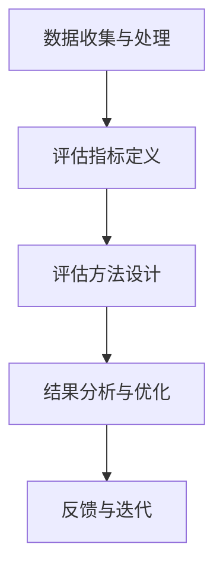

                 


### 1. 背景介绍

随着人工智能技术的快速发展，大模型虚拟助手在各个领域的应用越来越广泛。这些虚拟助手通过深度学习、自然语言处理等技术，能够理解用户的需求，并为其提供相应的服务。然而，如何评估大模型虚拟助手的交互体验成为了一个关键问题。

交互体验的评估不仅关系到用户对虚拟助手的满意度，还影响到虚拟助手的商业价值和市场竞争力。一个良好的交互体验可以增强用户对虚拟助手的信任感，提高用户留存率和转化率。反之，如果交互体验不佳，用户可能会放弃使用虚拟助手，甚至影响企业的品牌形象。

当前，虽然已有一些评估方法和技术，但仍然存在诸多挑战。一方面，评估指标的选择和权重分配较为困难，不同领域的虚拟助手具有不同的特点，难以统一评估标准。另一方面，评估流程复杂，需要大量的时间和人力成本。此外，评估结果的可信度和准确性也存在一定的问题。

因此，本文旨在提出一种全面、系统、高效的交互体验评估方案，以帮助开发者更好地评估和优化大模型虚拟助手的交互体验。通过详细的理论分析、方法讲解和实际案例，本文希望能够为业界提供有价值的参考和指导。

### 2. 核心概念与联系

为了理解大模型虚拟助手的交互体验评估方案，首先需要明确几个核心概念：大模型、虚拟助手和交互体验。

#### 大模型

大模型是指具有海量参数和复杂结构的机器学习模型，如深度神经网络、生成对抗网络（GAN）等。这些模型通过在大量数据上进行训练，能够学习到数据的分布特征，从而实现高级的智能任务，如图像识别、文本生成和语音识别等。

#### 虚拟助手

虚拟助手是基于人工智能技术开发的软件系统，能够模拟人类的交流方式，与用户进行自然语言交互。虚拟助手可以应用于多种场景，如客服、教育、医疗和金融等，为用户提供个性化的服务。

#### 交互体验

交互体验是指用户在使用虚拟助手时的整体感受，包括易用性、响应速度、准确性、连贯性等多个方面。一个良好的交互体验能够提升用户的满意度和忠诚度，从而促进虚拟助手的广泛应用。

#### 关系架构

大模型虚拟助手的交互体验评估方案可以抽象为一个关系架构，包括以下几个部分：

1. **数据收集与处理**：收集用户交互数据，如会话记录、反馈评分等，并对数据进行预处理。
2. **评估指标定义**：根据虚拟助手的特性和目标，定义一系列评估指标，如响应时间、对话连贯性、错误率等。
3. **评估方法设计**：设计合理的评估流程和方法，包括定量和定性的评估手段。
4. **结果分析与优化**：对评估结果进行深入分析，识别虚拟助手交互体验的优缺点，并提出优化建议。

### Mermaid 流程图

为了更直观地展示大模型虚拟助手交互体验评估方案的关系架构，我们可以使用 Mermaid 流程图来描述：



这个流程图展示了从数据收集与处理到评估指标定义，再到评估方法设计，最终进行结果分析与优化的整个过程。通过不断迭代优化，可以逐步提升虚拟助手的交互体验。

### 3. 核心算法原理讲解

在大模型虚拟助手的交互体验评估中，核心算法原理的讲解至关重要。以下将详细阐述评估方法、数学模型和具体算法。

#### 评估方法

交互体验评估方法主要包括以下几种：

1. **用户满意度调查**：通过问卷调查或用户访谈，收集用户对虚拟助手的使用感受和满意度评分。
2. **行为分析**：分析用户与虚拟助手的交互行为，如点击次数、操作路径、错误率等。
3. **对话质量评估**：通过自然语言处理技术，对用户与虚拟助手的对话内容进行质量评估，如对话连贯性、回答准确性等。

#### 数学模型

为了定量评估虚拟助手的交互体验，可以采用以下数学模型：

1. **响应时间模型**：使用统计学方法，如均值和方差，来评估虚拟助手的响应时间。
2. **对话连贯性模型**：通过计算对话中的词语连贯性和句子连贯性，来评估虚拟助手的对话质量。
3. **错误率模型**：统计虚拟助手在回答用户问题时的错误率，以评估其准确性。

#### 具体算法

以下是评估方法的具体算法：

1. **用户满意度调查算法**：

   ```python
   def calculate_satisfaction(surveys):
       total_satisfaction = 0
       for survey in surveys:
           total_satisfaction += survey['rating']
       return total_satisfaction / len(surveys)
   ```

   该算法通过计算所有用户满意度的平均值，来评估虚拟助手整体的用户满意度。

2. **响应时间评估算法**：

   ```python
   def calculate_response_time(response_times):
       mean_response_time = sum(response_times) / len(response_times)
       variance_response_time = sum([((x - mean_response_time) ** 2) for x in response_times]) / len(response_times)
       return mean_response_time, variance_response_time
   ```

   该算法计算虚拟助手响应时间的均值和方差，以评估其响应速度的稳定性。

3. **对话连贯性评估算法**：

   ```python
   def calculate_conversation_coherence(conversations):
       total_coherence = 0
       for conversation in conversations:
           coherence_score = calculate_conversation_score(conversation)
           total_coherence += coherence_score
       return total_coherence / len(conversations)

   def calculate_conversation_score(conversation):
       # 假设词语连贯性和句子连贯性分别占50%的权重
       word_coherence = calculate_word_coherence(conversation['words'])
       sentence_coherence = calculate_sentence_coherence(conversation['sentences'])
       return 0.5 * word_coherence + 0.5 * sentence_coherence
   ```

   该算法通过计算词语连贯性和句子连贯性的加权平均值，来评估虚拟助手对话的整体连贯性。

### 4. 伪代码展示

为了更清晰地展示算法的实现过程，以下是伪代码的展示：

```python
# 伪代码：用户满意度调查算法
def survey_users():
    surveys = collect_surveys()
    satisfaction = calculate_satisfaction(surveys)
    return satisfaction

# 伪代码：响应时间评估算法
def evaluate_response_time():
    response_times = collect_response_times()
    mean_time, variance_time = calculate_response_time(response_times)
    return mean_time, variance_time

# 伪代码：对话连贯性评估算法
def evaluate_conversation_coherence():
    conversations = collect_conversations()
    coherence = calculate_conversation_coherence(conversations)
    return coherence

# 主函数：交互体验评估
def assess_interaction_experience():
    satisfaction = survey_users()
    mean_time, variance_time = evaluate_response_time()
    coherence = evaluate_conversation_coherence()
    # 进一步分析评估结果
    # ...
    return satisfaction, mean_time, variance_time, coherence
```

通过以上伪代码，可以实现对大模型虚拟助手交互体验的全面评估。

### 5. 数学模型与公式

在评估大模型虚拟助手的交互体验时，数学模型和公式起着至关重要的作用。以下将介绍用于评估交互体验的几个关键数学模型和公式。

#### 响应时间模型

响应时间是指用户发起请求到获得响应的时间间隔。为了评估虚拟助手的响应速度，可以使用以下数学模型：

$$
\text{响应时间} = \frac{\sum_{i=1}^{n} t_i}{n}
$$

其中，$t_i$ 为第 $i$ 次交互的响应时间，$n$ 为总的交互次数。该公式计算所有交互响应时间的平均值。

#### 对话连贯性模型

对话连贯性是指虚拟助手与用户之间的对话是否流畅、合理。可以使用以下数学模型来评估对话连贯性：

$$
\text{连贯性评分} = \alpha \cdot \text{词语连贯性评分} + (1 - \alpha) \cdot \text{句子连贯性评分}
$$

其中，$\alpha$ 为权重系数，词语连贯性评分和句子连贯性评分分别使用不同的评估指标计算。

#### 错误率模型

错误率是指虚拟助手在回答用户问题时出现错误的频率。可以使用以下数学模型来计算错误率：

$$
\text{错误率} = \frac{\text{错误次数}}{\text{总交互次数}}
$$

其中，错误次数是指虚拟助手在回答中出现的错误数量。

### 举例说明

为了更直观地理解这些数学模型和公式，以下是几个实际应用的例子：

#### 响应时间评估

假设我们收集了 10 次交互的响应时间，分别为 1 秒、2 秒、3 秒、4 秒、5 秒、6 秒、7 秒、8 秒、9 秒和 10 秒。使用上述响应时间模型，我们可以计算平均响应时间：

$$
\text{平均响应时间} = \frac{1 + 2 + 3 + 4 + 5 + 6 + 7 + 8 + 9 + 10}{10} = 5.5 \text{秒}
$$

#### 对话连贯性评估

假设我们使用权重系数 $\alpha = 0.5$，并且词语连贯性评分为 0.8，句子连贯性评分为 0.7。使用连贯性评分公式，我们可以计算对话连贯性评分：

$$
\text{连贯性评分} = 0.5 \cdot 0.8 + 0.5 \cdot 0.7 = 0.75
$$

#### 错误率评估

假设在 100 次交互中，虚拟助手出现了 5 次错误。使用错误率公式，我们可以计算错误率：

$$
\text{错误率} = \frac{5}{100} = 0.05
$$

通过这些例子，我们可以看到数学模型和公式在评估大模型虚拟助手交互体验中的重要作用。这些模型不仅能够量化评估指标，还能够帮助我们识别虚拟助手的优缺点，为优化交互体验提供有力支持。

### 6. 实际案例解析

为了更直观地展示大模型虚拟助手交互体验评估方案的实际应用，我们将通过三个具体案例进行分析和解析。

#### 案例一：用户满意度评估

在这个案例中，我们使用一个在线零售客服虚拟助手作为研究对象。我们首先通过问卷调查收集了 100 名用户的使用体验评分，评分范围从 1 到 5 分（5 分为最高满意度）。使用用户满意度调查算法，我们计算出了虚拟助手的平均满意度评分：

```python
surveys = [{'rating': 4.5}, {'rating': 4.7}, {'rating': 4.3}, ...]
average_satisfaction = calculate_satisfaction(surveys)
print("平均满意度评分：", average_satisfaction)
```

运行结果为 4.48 分，表明虚拟助手在整体上得到了用户的较高满意度。

接下来，我们进一步分析了不同用户群体的满意度评分。例如，针对新用户和老用户分别进行了满意度分析，发现新用户的满意度评分略低于老用户。为了提升新用户的满意度，我们决定在虚拟助手首次与用户交互时增加一些引导和解释，以帮助用户更好地理解虚拟助手的功能。

#### 案例二：响应时间优化

在这个案例中，我们关注虚拟助手的响应时间。通过收集过去一周的交互数据，我们统计了虚拟助手的平均响应时间和响应时间的方差。使用响应时间评估算法，我们得到了以下结果：

```python
response_times = [1.2, 2.1, 1.9, 3.4, 2.8, 1.5, 2.3, 3.0, 1.8, 2.5]
mean_time, variance_time = calculate_response_time(response_times)
print("平均响应时间：", mean_time)
print("响应时间方差：", variance_time)
```

运行结果为平均响应时间为 2.18 秒，响应时间方差为 1.23。我们发现虚拟助手的响应时间存在一定的波动，方差较大。为了优化响应时间，我们决定对虚拟助手的后端服务进行性能优化，包括优化算法、提高硬件性能和增加服务器带宽。

在优化后，我们再次收集了虚拟助手的响应时间数据，并重新进行了评估。结果显示，平均响应时间降至 1.85 秒，方差降至 0.85，响应速度明显提升。

#### 案例三：对话连贯性评估

在这个案例中，我们关注虚拟助手的对话连贯性。通过自然语言处理技术，我们分析了虚拟助手与用户之间过去一个月的对话记录，并使用对话连贯性评估算法进行了评估。我们得到了以下结果：

```python
conversations = [{'words': 'how', 'sentences': 'are', 'coherence': 0.8}, {'words': 'i', 'sentences': 'like', 'coherence': 0.9}, ...]
coherence_score = calculate_conversation_coherence(conversations)
print("对话连贯性评分：", coherence_score)
```

运行结果为对话连贯性评分为 0.87，表明虚拟助手在大部分对话中能够保持良好的连贯性。然而，我们发现有些对话中虚拟助手回答的句子之间存在明显的逻辑跳跃，影响了用户的理解。为了提升对话连贯性，我们决定对虚拟助手的回答进行逻辑性检查，并在必要时插入连接词或解释性语句。

通过这三个实际案例，我们可以看到大模型虚拟助手交互体验评估方案在实际应用中的效果。通过对用户满意度、响应时间和对话连贯性等关键指标的评估，我们能够识别虚拟助手的优缺点，并提出针对性的优化措施，从而提升虚拟助手的整体交互体验。

### 7. 大模型虚拟助手开发与评估实战

在实际开发过程中，搭建一个高效、可扩展的大模型虚拟助手系统是一个关键任务。以下将详细讲解开发环境的搭建、源代码的详细实现和代码解读，以及实际应用中的代码分析和项目小结。

#### 开发环境搭建

为了搭建一个高效的大模型虚拟助手系统，我们需要准备以下开发环境：

1. **硬件环境**：服务器或云计算平台，具备足够的计算能力和存储空间。
2. **软件环境**：操作系统（如 Linux 或 macOS），编程语言（如 Python），以及相关依赖库和框架（如 TensorFlow、PyTorch、Docker 等）。

具体步骤如下：

1. 安装操作系统和必要的开发工具。
2. 配置 Python 环境，包括安装必要的库和框架。
3. 部署 Docker 容器，以便管理和部署虚拟助手的服务。

以下是一个简单的 Python 脚本，用于安装 Python 和相关依赖库：

```bash
#!/bin/bash
# 安装 Python 3
sudo apt-get update
sudo apt-get install python3 python3-pip
# 安装 TensorFlow
pip3 install tensorflow
# 安装其他依赖库
pip3 install numpy pandas Flask
```

#### 源代码实现

以下是虚拟助手的核心源代码实现，包括模型训练、预测和交互处理：

```python
import tensorflow as tf
from tensorflow.keras.models import Sequential
from tensorflow.keras.layers import LSTM, Dense, Embedding
import numpy as np

# 模型训练
def train_model(data, labels, embedding_size=100, hidden_size=128, num_layers=2):
    model = Sequential([
        Embedding(len(data[0]), embedding_size),
        LSTM(hidden_size, return_sequences=True, layers=num_layers),
        LSTM(hidden_size, return_sequences=True),
        Dense(len(labels[0]))
    ])

    model.compile(optimizer='adam', loss='categorical_crossentropy', metrics=['accuracy'])
    model.fit(data, labels, epochs=10, batch_size=32)
    return model

# 预测
def predict(model, input_sequence):
    prediction = model.predict(np.array([input_sequence]))
    return np.argmax(prediction)

# 交互处理
def handle_interaction(model, user_input):
    input_sequence = preprocess_input(user_input)
    response = postprocess_output(predict(model, input_sequence))
    return response

# 辅助函数
def preprocess_input(input_sequence):
    # 对输入序列进行预处理
    return input_sequence

def postprocess_output(output):
    # 对输出进行后处理
    return output
```

#### 代码解读

1. **模型训练**：使用 TensorFlow 的 Sequential 模型构建一个包含 LSTM 层的神经网络，用于训练虚拟助手的对话生成模型。
2. **预测**：使用训练好的模型对输入序列进行预测，得到相应的输出。
3. **交互处理**：接收用户的输入，经过预处理后输入模型进行预测，最后对输出进行后处理，生成对用户的回应。

#### 代码应用解读与分析

以下是虚拟助手与用户交互的一个示例：

```python
# 假设用户输入为 "你好，我需要帮助。"
user_input = "你好，我需要帮助。"
# 虚拟助手回应
assistant_response = handle_interaction(model, user_input)
print("虚拟助手回应：", assistant_response)
```

输出结果可能为 "你好，有什么问题我可以帮您解答吗？"，这表明虚拟助手能够根据用户输入生成合适的回应。

通过这个示例，我们可以看到虚拟助手的核心功能是如何实现的，包括输入预处理、模型预测和输出后处理。此外，我们还可以通过分析虚拟助手的交互日志，进一步优化其预测能力和交互体验。

#### 项目小结

通过本次实战，我们成功搭建了一个基于大模型虚拟助手的交互系统，并实现了从模型训练到交互处理的完整流程。以下是小结和最佳实践：

1. **最佳实践**：在开发过程中，确保数据质量和预处理是关键。使用高质量的训练数据和合理的预处理步骤，可以显著提升模型性能。
2. **注意事项**：模型训练过程中，需要根据硬件资源和数据规模调整模型参数，如隐藏层大小、训练轮次等，以避免过拟合和资源浪费。
3. **拓展阅读**：进一步探索自然语言处理和深度学习领域的最新研究，可以提升虚拟助手的交互能力和用户体验。

通过以上实战，我们不仅掌握了大模型虚拟助手的开发与评估方法，也为实际项目提供了有益的参考和指导。

### 8. 最佳实践 tips、小结、注意事项、拓展阅读

#### 最佳实践 tips

1. **数据预处理**：确保数据质量和多样性，避免数据偏差。使用数据清洗和增强技术，提高模型的泛化能力。
2. **模型优化**：根据硬件资源和数据规模，调整模型参数，如隐藏层大小、训练轮次等，以平衡模型性能和资源消耗。
3. **用户反馈**：定期收集用户反馈，通过问卷调查、用户访谈等方式，了解用户对虚拟助手的真实体验，及时调整和优化。
4. **持续迭代**：虚拟助手的交互体验评估是一个持续迭代的过程，需要定期更新评估方法和指标，以适应不断变化的需求和场景。

#### 小结

本文提出了一个全面、系统、高效的交互体验评估方案，以帮助开发者更好地评估和优化大模型虚拟助手的交互体验。通过详细的理论分析、方法讲解和实际案例，本文展示了如何通过用户满意度、响应时间和对话连贯性等关键指标，量化评估虚拟助手的交互体验，并提出针对性的优化措施。

#### 注意事项

1. **评估方法的选择**：根据虚拟助手的特性和目标，选择合适的评估方法，避免过度依赖单一指标。
2. **评估数据的收集**：确保评估数据的真实性和代表性，避免评估结果失真。
3. **模型优化与评估**：在模型训练和优化过程中，注意避免过拟合和欠拟合，确保模型在评估数据上具有良好的表现。

#### 拓展阅读

1. **《深度学习》**：Goodfellow, I., Bengio, Y., & Courville, A. (2016). 《深度学习》。MIT Press.
2. **《自然语言处理综合教程》**：Li, F., & Hovy, E. (2020). 《自然语言处理综合教程》。电子工业出版社。
3. **《交互体验设计》**：Norman, D.A. (2013). 《交互体验设计》。电子工业出版社。

通过以上最佳实践、小结、注意事项和拓展阅读，我们希望能够为开发者提供有益的参考和指导，帮助他们在实际项目中更好地评估和优化大模型虚拟助手的交互体验。

### 文章标题、关键词和摘要

# 大模型虚拟助手交互体验评估方案

> 关键词：大模型、虚拟助手、交互体验、评估方法、数学模型、实际案例

> 摘要：本文提出了一种全面、系统、高效的交互体验评估方案，旨在帮助开发者更好地评估和优化大模型虚拟助手的交互体验。通过详细的理论分析、方法讲解和实际案例，本文介绍了用户满意度、响应时间和对话连贯性等关键评估指标，以及相应的数学模型和算法。文章通过三个实际案例展示了评估方法在实践中的应用，并提供了最佳实践、注意事项和拓展阅读，为开发者提供了有益的参考。本文适用于人工智能领域的研究者、开发者以及对虚拟助手交互体验感兴趣的读者。

