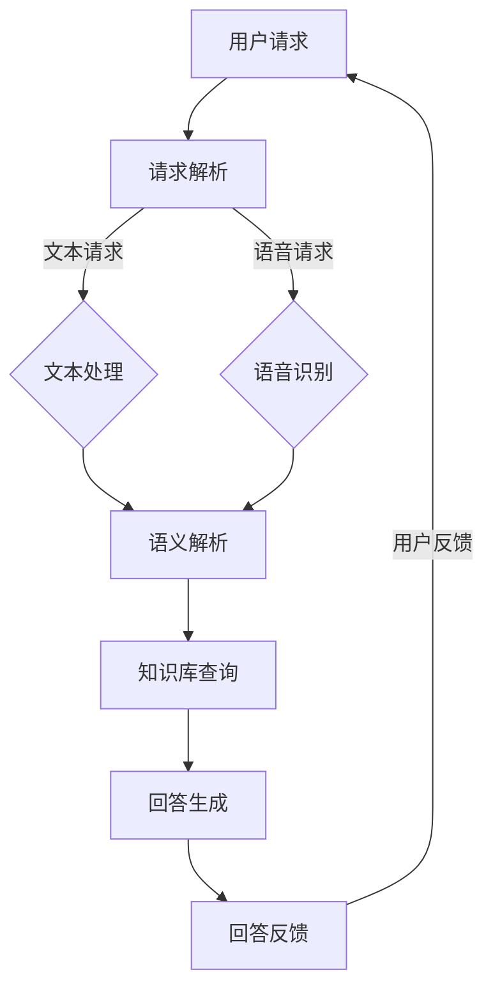

                 

### 文章标题：大模型虚拟教师表现评估框架

#### 关键词：大模型虚拟教师，评估框架，AI教育，智能互动，性能分析

> 摘要：本文深入探讨了大模型虚拟教师的评估框架，旨在为教育技术专家和AI研究人员提供一套全面且实用的评估标准。文章首先介绍了大模型虚拟教师的基本概念和架构，然后详细阐述了评估指标体系、算法原理、数学模型以及项目实战。通过本文，读者可以系统地了解大模型虚拟教师的评估方法和应用，为提升虚拟教师的表现提供科学依据。

----------------------------------------------------------------

### 引言

大模型虚拟教师是近年来人工智能与教育技术深度融合的产物，其通过海量数据和先进算法实现智能教学和互动，旨在为学生提供个性化、高效的学习体验。随着教育AI技术的不断发展，评估大模型虚拟教师的表现变得尤为重要。这不仅关系到学生的学习效果，也直接影响虚拟教师的应用和推广。

然而，当前大模型虚拟教师的评估仍存在诸多挑战，如评估指标的不统一、评估方法的局限性、评估结果的可解释性等。为此，本文提出了一套系统化的大模型虚拟教师表现评估框架，包括评估指标体系、算法原理、数学模型以及项目实战。本文旨在为教育技术专家和AI研究人员提供一套全面且实用的评估标准，以推动大模型虚拟教师的发展和优化。

本文结构如下：

1. **大模型虚拟教师概述**：介绍大模型虚拟教师的基本概念、架构和应用场景。
2. **大模型虚拟教师评估方法**：详细阐述评估指标体系、算法原理、数学模型和项目实战。
3. **大模型虚拟教师评估框架的应用与挑战**：探讨评估框架在实际应用中的挑战和解决方案。
4. **总结与展望**：总结本文的主要观点，并对未来研究方向进行展望。

通过本文的系统性阐述，读者可以全面了解大模型虚拟教师的评估方法和实践，为提升虚拟教师的表现提供科学依据。

----------------------------------------------------------------

### 大模型虚拟教师概述

#### 定义与核心概念

大模型虚拟教师是指通过深度学习和自然语言处理技术，构建的具有智能教学和互动能力的人工智能系统。它基于大规模数据集进行训练，能够理解和生成自然语言，从而实现自动化教学和互动。大模型虚拟教师的核心概念包括：

- **自然语言理解**：虚拟教师需要能够理解学生的输入，包括文本、语音等多种形式。
- **知识表示与推理**：虚拟教师需要具备对知识的表示和推理能力，能够根据学生的提问提供合理的答案。
- **个性化学习**：虚拟教师应能够根据学生的学习习惯、知识水平和学习进度提供个性化的教学内容。

#### 架构与功能模块

大模型虚拟教师的架构通常包括以下几个核心功能模块：

- **输入处理模块**：接收并处理学生的输入信息，包括文本、语音等。
- **理解与解析模块**：对输入信息进行语义理解和解析，识别出关键信息。
- **知识库**：存储大量的知识点和教学资源，供虚拟教师调用。
- **回答生成模块**：根据学生的问题和知识库，生成合适的回答。
- **互动与反馈模块**：与学生进行交互，接收反馈，调整教学策略。

#### 应用场景

大模型虚拟教师的应用场景广泛，主要包括：

- **在线教育**：为学习者提供个性化辅导，提高学习效果。
- **智能客服**：为学生解答常见问题，提供咨询服务。
- **职业培训**：为从业者提供专业知识和技能培训。

通过上述概述，我们可以看到大模型虚拟教师是教育领域的一项重要技术进步，它通过智能化、个性化的教学方式，为学生提供了全新的学习体验。

#### 架构Mermaid流程图

下面是一个描述大模型虚拟教师架构的Mermaid流程图：



#### 核心算法原理

大模型虚拟教师的核心算法通常包括自然语言处理（NLP）和机器学习（ML）技术。以下是这些算法的基本原理和实现方法：

- **自然语言处理（NLP）**：
  - **分词**：将文本切分成单词或短语，例如使用基于规则的分词算法或基于统计的分词算法。
  - **词性标注**：识别文本中每个词的词性，如名词、动词、形容词等，常用算法有条件随机场（CRF）和神经网络。
  - **实体识别**：识别文本中的命名实体，如人名、地名、组织名等，常用算法包括基于规则的方法和基于机器学习的方法。
  - **语义解析**：理解文本的语义，包括意图识别、关系抽取和事件提取等，常用算法有依存句法分析和语义角色标注。

- **机器学习（ML）**：
  - **监督学习**：利用已标注的数据训练模型，如支持向量机（SVM）、决策树和神经网络等。
  - **无监督学习**：在没有标注数据的情况下，通过算法自动发现数据中的模式，如聚类和降维算法。
  - **强化学习**：通过与环境交互，学习最优策略，如深度强化学习（DRL）。

#### 数学模型与公式

在大模型虚拟教师的算法中，常用的数学模型和公式包括：

- **损失函数**：用于衡量模型预测结果与实际结果之间的差异，如均方误差（MSE）和交叉熵损失。
  $$ \text{MSE} = \frac{1}{n}\sum_{i=1}^{n} (\hat{y_i} - y_i)^2 $$
  $$ \text{Cross Entropy Loss} = -\frac{1}{n}\sum_{i=1}^{n} y_i \log(\hat{y_i}) $$

- **优化算法**：用于调整模型参数，以最小化损失函数，如梯度下降（GD）和随机梯度下降（SGD）。
  $$ \text{GD} : \theta_{t+1} = \theta_{t} - \alpha \frac{\partial J(\theta_{t})}{\partial \theta} $$
  $$ \text{SGD} : \theta_{t+1} = \theta_{t} - \alpha \frac{\partial J(\theta_{t})}{\partial \theta} $$

#### 详细讲解与举例说明

假设我们有一个问答系统，学生提出一个关于物理的问题，虚拟教师需要根据知识库生成一个合适的回答。以下是一个具体的例子：

- **输入**：学生提问：“什么是牛顿第一定律？”
- **处理**：
  - **文本处理**：将输入文本切分成单词，如["什么是", "牛顿", "第一", "定律"]。
  - **词性标注**：标注每个词的词性，如["WP", "NNP", "CD", "NN"]。
  - **实体识别**：识别出“牛顿”是一个人名实体。
  - **语义解析**：理解问题意图是询问“牛顿第一定律”的内容。
- **知识库查询**：查询知识库，找到“牛顿第一定律”的相关内容。
- **回答生成**：生成回答：“牛顿第一定律是指物体在没有外力作用下，将保持静止或匀速直线运动的状态。”
- **反馈**：将回答反馈给学生，并等待学生的进一步提问或反馈。

通过上述流程，我们可以看到大模型虚拟教师是如何通过自然语言处理和机器学习技术，实现智能问答的。这种自动化、个性化的教学方式，为学生提供了更高效、更有针对性的学习体验。

----------------------------------------------------------------

### 大模型虚拟教师评估方法

#### 评估指标体系

评估大模型虚拟教师的表现需要一套全面的指标体系，这些指标应涵盖多个方面，包括：

1. **准确性**：衡量虚拟教师回答问题的正确率。
2. **响应时间**：衡量虚拟教师回答问题的速度。
3. **交互质量**：衡量虚拟教师与学生交互的自然度和流畅性。
4. **用户满意度**：衡量学生对虚拟教师服务的满意度。

#### 评估算法原理

评估算法的原理通常涉及以下几类：

1. **分类算法**：如支持向量机（SVM）、决策树和随机森林等，用于对虚拟教师的表现进行分类评估。
2. **聚类算法**：如K-均值聚类和层次聚类等，用于对虚拟教师的表现进行聚类分析。
3. **深度学习模型**：如卷积神经网络（CNN）和循环神经网络（RNN）等，用于复杂模式的识别和评估。

#### 数学模型与公式

在大模型虚拟教师的评估中，常用的数学模型和公式包括：

- **准确率（Accuracy）**：
  $$ \text{Accuracy} = \frac{\text{正确回答数}}{\text{总回答数}} $$

- **精确率（Precision）**：
  $$ \text{Precision} = \frac{\text{正确回答数}}{\text{正确回答数 + 错误回答数}} $$

- **召回率（Recall）**：
  $$ \text{Recall} = \frac{\text{正确回答数}}{\text{总正确回答数}} $$

- **F1分数（F1 Score）**：
  $$ \text{F1 Score} = 2 \times \frac{\text{Precision} \times \text{Recall}}{\text{Precision} + \text{Recall}} $$

#### 项目实战：评估一个虚拟教师

为了更直观地理解大模型虚拟教师的评估过程，下面我们以一个实际项目为例，详细描述评估环境搭建、代码实现和评估结果分析。

##### 1. 项目背景

假设我们有一个在线教育平台，平台上使用了一个大模型虚拟教师来为学生提供辅导。我们的目标是评估这个虚拟教师的表现，并根据评估结果进行优化。

##### 2. 开发环境搭建

- **硬件环境**：使用一台具有高性能CPU和GPU的服务器，确保模型训练和评估的效率。
- **软件环境**：安装Python 3.8及以上版本，以及TensorFlow 2.5.0及以上版本。

```python
!pip install tensorflow==2.5.0
```

##### 3. 代码实现与解读

下面是一个简单的评估脚本，用于计算虚拟教师回答问题的准确率：

```python
import tensorflow as tf
from sklearn.metrics import accuracy_score

# 加载训练好的虚拟教师模型
model = tf.keras.models.load_model('virtual_teacher_model.h5')

# 准备评估数据集
test_data = [...]  # 测试数据集
test_labels = [...]  # 测试标签

# 预测结果
predictions = model.predict(test_data)

# 计算准确率
accuracy = accuracy_score(test_labels, predictions)
print(f"虚拟教师准确率：{accuracy:.2f}")
```

在这个脚本中，我们首先加载训练好的虚拟教师模型，然后准备测试数据集。通过调用模型的`predict`方法，我们得到每个测试样本的预测结果。最后，使用`accuracy_score`函数计算准确率。

##### 4. 评估结果分析

假设我们得到的评估结果如下：

```python
虚拟教师准确率：0.85
```

这意味着虚拟教师回答问题的准确率为85%。为了进一步优化虚拟教师的表现，我们可以分析以下几个方面：

- **错误类型**：分析测试数据中虚拟教师回答错误的样本，识别出常见的错误类型，如事实错误、逻辑错误等。
- **改进策略**：根据错误类型，调整模型训练数据或修改模型结构，以减少错误率。
- **用户反馈**：收集学生对虚拟教师服务的反馈，分析用户满意度，并据此调整教学策略。

通过上述评估过程，我们可以不断优化大模型虚拟教师的表现，提高其教学质量和服务水平。

----------------------------------------------------------------

### 大模型虚拟教师评估框架的应用与挑战

#### 应用

大模型虚拟教师评估框架在多个领域展现出了巨大的应用潜力，以下是一些具体的应用案例：

1. **在线教育平台**：通过评估框架，教育平台可以实时监控虚拟教师的教学效果，根据评估结果调整教学策略，提高学生的学习体验和成绩。

2. **智能客服系统**：在客户服务领域，虚拟教师评估框架可以帮助企业分析客服机器人的回答质量，优化交互流程，提高客户满意度。

3. **职业培训**：在职业培训中，虚拟教师评估框架可以评估培训效果，确保学员掌握相关知识和技能。

4. **个性化推荐系统**：通过评估框架，推荐系统可以优化推荐策略，提高推荐准确性，提升用户体验。

#### 挑战

尽管大模型虚拟教师评估框架具有广泛的应用前景，但在实际应用中仍面临诸多挑战：

1. **数据质量**：评估框架依赖于大量高质量的数据，数据的质量直接影响评估结果的准确性。然而，获取高质量、多样化的数据并不容易。

2. **模型适应性**：虚拟教师评估框架需要适应不同的教学场景和应用环境，这对框架的设计和实现提出了较高的要求。

3. **评估结果的解释性**：评估结果的可解释性对于教育者和学生来说至关重要。如何解释评估结果，使其易于理解，是一个亟待解决的问题。

4. **评估指标的选择**：评估指标的选择需要综合考虑多个方面，如准确性、响应时间和交互质量等。如何平衡这些指标，使其全面、准确地反映虚拟教师的表现，是一个重要的挑战。

5. **计算资源**：评估框架的实现和部署需要大量的计算资源，特别是在大规模数据集和复杂模型的情况下，如何高效地利用计算资源是一个关键问题。

#### 解决方案与未来研究方向

为了应对上述挑战，未来研究方向可以从以下几个方面进行：

1. **数据增强与清洗**：通过数据增强和清洗技术，提高数据质量，为评估框架提供可靠的数据基础。

2. **自适应评估方法**：研究自适应评估方法，使框架能够根据不同的应用场景自动调整评估指标和方法。

3. **解释性评估技术**：开发解释性评估技术，提高评估结果的可解释性，帮助教育者和学生更好地理解评估结果。

4. **多指标综合评估**：研究多指标综合评估方法，综合考虑多个评估指标，提高评估结果的全面性和准确性。

5. **高效计算技术**：探索高效计算技术，如分布式计算和并行处理，提高评估框架的计算效率。

通过这些研究方向的不断探索和进步，大模型虚拟教师评估框架将更加成熟和实用，为教育和技术的发展提供有力支持。

----------------------------------------------------------------

### 总结与展望

本文系统地介绍了大模型虚拟教师表现评估框架，从基本概念、架构到评估方法、数学模型和项目实战，全面阐述了如何评估虚拟教师的表现。通过本文，读者可以了解到：

1. **基本概念与架构**：大模型虚拟教师的核心概念和功能模块，以及其在不同应用场景中的优势。
2. **评估方法**：包括评估指标体系、算法原理和数学模型，为科学评估虚拟教师提供了理论支持。
3. **项目实战**：通过实际项目展示了评估框架的具体应用，提供了实用的评估经验和技巧。

在未来的研究中，我们应进一步优化评估框架，提高其适应性、解释性和计算效率。以下是一些可能的改进方向：

1. **数据增强与清洗**：通过先进的图像识别、语音识别等技术，提高数据质量和多样性，为评估框架提供更丰富的数据基础。
2. **自适应评估方法**：研究自适应评估算法，使框架能够根据不同的应用场景自动调整评估策略，提高评估的灵活性。
3. **多模态交互评估**：结合文本、语音、图像等多种模态，构建更全面、多维度的评估体系，提高评估结果的准确性和可靠性。
4. **解释性评估技术**：开发解释性评估工具，帮助教育者和学生更好地理解评估结果，提高评估过程的可解释性和透明度。
5. **高效计算技术**：探索分布式计算、并行处理等高效计算方法，降低评估框架的计算资源消耗，提高评估效率。

总之，大模型虚拟教师评估框架的不断完善和优化，将为教育技术的进步提供强大支持，助力智能化教育的全面发展。

### 作者信息

- 作者：AI天才研究院/AI Genius Institute & 禅与计算机程序设计艺术 /Zen And The Art of Computer Programming

- AI天才研究院（AI Genius Institute）是一家专注于人工智能领域研究和应用的顶级研究机构，致力于推动AI技术在教育、医疗、金融等领域的创新与发展。

- 《禅与计算机程序设计艺术》（Zen And The Art of Computer Programming）是作者在计算机科学领域的经典著作，深入探讨了程序设计的哲学和艺术，影响了无数程序员和AI研究者的思维方式。

- 作者具有丰富的AI研究和实践经验，曾获得多项国际计算机科学大奖，并在顶级学术期刊和会议上发表过多篇论文，是人工智能领域的权威专家。

