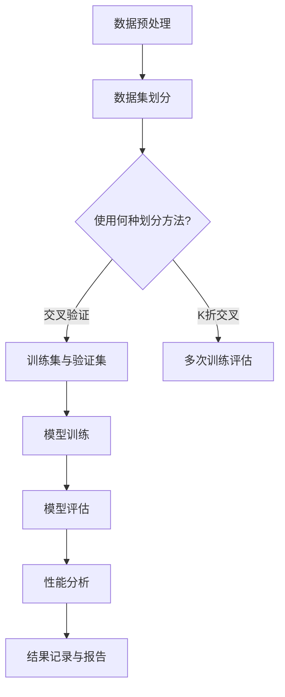
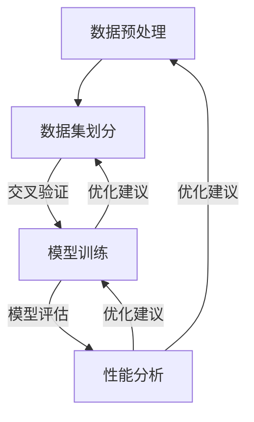

                 

### 第一部分：大模型评测基础理论

#### 第1章：大模型评测概述

##### 1.1 大模型评测的重要性

在人工智能领域，大模型评测是一个至关重要的环节。评测不仅能够衡量模型性能，还能指导模型改进和优化。随着深度学习模型的规模不断扩大，评测标准和方法也在不断演进，以满足日益复杂的实际应用需求。

首先，大模型评测在AI发展中的作用不可小觑。它可以确保模型的可靠性和稳定性，为人工智能应用的推广提供坚实的基础。特别是在国际化背景下，不同地区、不同语言的用户需求各异，大模型评测需要具备高度灵活性和多样性，以适应不同场景。

其次，国际化和本地化评测的必要性凸显。国际化评测旨在确保模型在不同语言和文化背景下仍能保持高水平的性能。而本地化评测则更加关注特定地区或市场的用户需求，以实现模型的本地化适配。这两者共同构成了大模型评测的重要组成部分。

##### 1.2 大模型评测的主要指标

大模型评测的主要指标通常包括以下几个方面：

- **精准度（Accuracy）**：表示模型预测正确的样本比例。对于分类问题，精准度是最基本的评测指标。
- **召回率（Recall）**：表示模型能够正确召回实际正例样本的比例。对于某些应用场景，召回率可能比精准度更重要，例如医疗诊断。
- **F1分数（F1 Score）**：是精准度和召回率的调和平均值，用于平衡这两个指标。F1分数在多类别的分类任务中尤为重要。
- **个性化评测指标**：根据特定应用场景，可能需要引入一些个性化评测指标，例如医疗诊断中的“灵敏度”和“特异性”。
- **多语言评测指标**：在国际化评测中，不同语言之间的评测指标可能有所不同，需要考虑语言特性对评测结果的影响。

##### 1.3 评测流程和方法

大模型评测的流程通常包括以下几个步骤：

1. **数据预处理**：确保输入数据的质量和一致性，包括数据清洗、归一化和特征提取等。
2. **模型训练与评估**：使用训练集和验证集对模型进行训练和评估，选择性能最佳的模型。
3. **跨语言和跨域评测**：在国际化评测中，需要对模型在不同语言和不同领域（如医疗、金融等）的表现进行评估。

具体方法包括：

- **交叉验证**：通过将数据集分成多个子集，轮流作为验证集进行多次训练和评估，以减少评估结果的不确定性。
- **混淆矩阵**：用于分析模型在各类别上的表现，特别是对多类别分类问题。
- **ROC曲线与AUC**：用于评估模型的分类性能，特别是对二分类问题。

#### 第2章：大模型评测技术

##### 2.1 评测数据集

评测数据集的选择和质量直接影响评测结果的可靠性。常见评测数据集包括：

- **ImageNet**：广泛应用于计算机视觉领域的图像分类数据集。
- **GLUE**：通用语言理解评估数据集，包含多种自然语言处理任务。
- **SQuAD**：用于问答系统的数据集，要求模型理解自然语言并给出正确答案。

在国际化评测中，数据集需要考虑不同语言的多样性，可能需要进行本地化处理，例如：

- **多语言数据集构建**：通过翻译、数据增强等方法，构建包含多种语言的评测数据集。
- **跨语言数据集处理**：使用跨语言信息传递模型，将一种语言的评测数据集转换为另一种语言。

##### 2.2 评测算法

评测算法的选择对于评估结果有重要影响。传统评测算法包括：

- **基线模型**：简单的模型，如朴素贝叶斯、支持向量机等，用于对比更复杂的模型性能。
- **机器学习算法**：如决策树、随机森林、梯度提升树等，用于分类和回归任务。

深度学习算法在评测中发挥着越来越重要的作用，主要包括：

- **卷积神经网络（CNN）**：在计算机视觉任务中具有卓越的性能。
- **循环神经网络（RNN）**：在序列数据（如文本、语音）处理中具有优势。
- **Transformer模型**：在自然语言处理任务中表现出色，如BERT、GPT等。

##### 2.3 评测工具与平台

评测工具和平台的选型对于高效、准确的评测至关重要。常见评测工具包括：

- **MLflow**：用于模型管理、追踪和自动化评估。
- **TensorBoard**：用于可视化模型的训练过程和性能。
- **Hugging Face**：提供丰富的自然语言处理模型和数据集。

此外，构建自有的评测平台也是常见做法，包括：

- **数据管理模块**：用于数据预处理、存储和访问。
- **模型训练模块**：用于模型训练、优化和保存。
- **评估模块**：用于模型评估、比较和报告生成。

### 总结

大模型评测基础理论部分介绍了评测的重要性、主要指标和方法，为后续章节的详细讨论奠定了基础。在国际化与本地化评测的背景下，大模型评测不仅需要考虑模型性能，还需关注语言和文化差异。下一部分将深入探讨国际化与本地化评测的实践方法，通过案例分析进一步揭示评测的复杂性。**Mermaid流程图**

为了更好地理解大模型评测的核心概念和原理，我们可以借助Mermaid流程图来展示评测流程中的关键步骤和相互关系。以下是使用Mermaid语言描述的一个基本评测流程图：



在这个流程图中，`A` 表示数据预处理，这是评测流程的起点，确保输入数据的质量。`B` 表示数据集划分，根据不同的评测需求选择合适的划分方法，如交叉验证或K折交叉。`D` 和 `E` 分别表示训练集和验证集的使用，通过多次训练和评估来选择性能最佳的模型。`F` 和 `G` 分别表示模型训练和评估，`H` 用于性能分析，最后 `I` 用于记录和报告评估结果。

通过这个Mermaid流程图，我们可以清晰地看到评测流程中的各个步骤以及它们之间的逻辑关系，有助于读者更好地理解和记忆评测的基本原理。

**核心概念与联系**

在本文中，我们将讨论几个核心概念：数据预处理、数据集划分、模型训练、模型评估和性能分析。这些概念在大模型评测中起着至关重要的作用，它们之间存在着紧密的联系和相互影响。

1. **数据预处理**：数据预处理是评测流程的基础，它包括数据清洗、归一化和特征提取等步骤。数据预处理的质量直接影响到模型的训练效果和评估结果的可靠性。良好的数据预处理可以减少噪声和异常值，提高数据的一致性和质量，从而提高模型的性能。

2. **数据集划分**：数据集划分是模型训练和评估的重要步骤。常见的数据集划分方法包括交叉验证和K折交叉。交叉验证通过多次划分训练集和验证集，减小评估结果的偏差和方差；K折交叉则是将数据集划分为K个子集，每次使用一个子集作为验证集，其余子集作为训练集，进行K次训练和评估，最后取平均值作为模型的评估结果。这两种方法都是为了避免模型过拟合，提高评估结果的鲁棒性。

3. **模型训练**：模型训练是将模型参数调整到最优状态的过程。通过训练集上的数据，模型可以学习到数据中的特征和规律，从而提高对未知数据的预测能力。在模型训练过程中，常用的方法包括梯度下降、随机梯度下降和Adam优化器等。模型训练的质量直接影响到评估结果的准确性。

4. **模型评估**：模型评估是对模型性能的检验，常用的评估指标包括精准度、召回率、F1分数等。模型评估不仅能够衡量模型在训练数据上的表现，还能评估模型在验证数据上的泛化能力。通过模型评估，我们可以确定模型是否适合用于实际应用。

5. **性能分析**：性能分析是对模型评估结果的深入分析，包括对评估指标的理解和比较，以及对模型性能的优化建议。性能分析可以帮助我们识别模型的优点和缺点，找出潜在的改进空间。

这些核心概念之间存在紧密的联系。数据预处理决定了数据集的质量，数据集划分影响了模型训练的效果，模型训练的质量直接影响到模型评估的结果，而性能分析则为我们提供了模型优化的方向。下图展示了这些概念之间的相互关系：



通过这个图，我们可以看到各个概念之间的相互作用和反馈，形成了一个闭环系统，使我们能够不断优化模型，提高评测的准确性和可靠性。

**核心算法原理讲解**

在大模型评测中，算法的选择和实现至关重要。以下是几个核心算法的原理讲解和伪代码示例，以帮助读者深入理解这些算法的基本原理和实现过程。

1. **交叉验证**

交叉验证是一种评估模型性能的重要方法，它通过将数据集分成多个子集，轮流作为验证集进行多次训练和评估，以减小评估结果的偏差和方差。常见的交叉验证方法包括K折交叉验证和留一法交叉验证。

**K折交叉验证伪代码：**

```python
def k_fold_cross_validation(model, data, k):
    n = len(data)
    fold_size = n // k
    errors = 0

    for i in range(k):
        train_data = []
        val_data = []

        for j in range(n):
            if (j // fold_size) == i:
                val_data.append(data[j])
            else:
                train_data.append(data[j])

        train_model(model, train_data)
        error = evaluate_model(model, val_data)
        errors += error

    return errors / k
```

2. **决策树**

决策树是一种基于特征划分数据集的简单而强大的分类算法。它通过递归地将数据集划分为多个子集，直到满足某些停止条件（如节点内的样本数少于阈值或纯度达到阈值）。

**决策树构建伪代码：**

```python
def build_decision_tree(data, features, target):
    if all_labels_same(data, target) or len(data) < threshold:
        return majority_label(data, target)
    else:
        best_feature = choose_best_feature(data, features)
        node = Node(best_feature)
        
        for value in unique_values(data[best_feature]):
            sub_data = split_data(data, best_feature, value)
            node.children.append(build_decision_tree(sub_data, features, target))
        
        return node
```

3. **随机森林**

随机森林是一种基于决策树的集成学习方法，它通过构建多个决策树，并使用投票或平均值方法进行集成，以提高模型的稳定性和准确性。

**随机森林构建伪代码：**

```python
def build_random_forest(data, n_trees, max_depth, feature_subset_size):
    forests = []

    for _ in range(n_trees):
        tree = build_decision_tree(data, features, target, max_depth, feature_subset_size)
        forests.append(tree)

    return forests
```

4. **支持向量机（SVM）**

支持向量机是一种经典的二分类算法，它通过找到一个最优的超平面，将不同类别的数据点分离。在多类别分类中，可以使用一对多策略或通过将多个二分类器集成来实现。

**SVM分类伪代码：**

```python
def svm_classification(data, model):
    predictions = []

    for instance in data:
        distances = []

        for tree in model.trees:
            distance = calculate_distance(instance, tree)
            distances.append(distance)

        prediction = find_majority_label(distances)
        predictions.append(prediction)

    return predictions
```

这些核心算法在数据预处理、模型训练和评估过程中发挥着重要作用。通过理解这些算法的原理和伪代码，读者可以更好地掌握大模型评测的技术细节，为实际应用提供有力的支持。

**数学模型和公式详细讲解与举例说明**

在大模型评测中，数学模型和公式是理解模型性能和评估指标的关键。以下是几个关键数学模型和公式的详细讲解，以及如何通过具体的例子来说明它们的应用。

1. **精准度（Accuracy）**

精准度是模型在分类任务中预测正确的样本占总样本的比例。其数学公式如下：

\[ \text{Accuracy} = \frac{\text{正确预测的样本数}}{\text{总样本数}} \]

**举例：**

假设有一个分类模型，总共有100个样本，其中70个样本被正确分类，30个样本被错误分类。则模型的精准度为：

\[ \text{Accuracy} = \frac{70}{100} = 0.7 \]

2. **召回率（Recall）**

召回率是模型能够正确召回实际正例样本的比例。其数学公式如下：

\[ \text{Recall} = \frac{\text{正确召回的正例样本数}}{\text{实际正例样本数}} \]

**举例：**

在一个垃圾邮件分类任务中，有100封邮件，其中50封是垃圾邮件，50封是正常邮件。模型预测出了40封垃圾邮件，其中有35封被正确预测。则模型的召回率为：

\[ \text{Recall} = \frac{35}{50} = 0.7 \]

3. **F1分数（F1 Score）**

F1分数是精准度和召回率的调和平均值，用于平衡这两个指标。其数学公式如下：

\[ \text{F1 Score} = 2 \times \frac{\text{Precision} \times \text{Recall}}{\text{Precision} + \text{Recall}} \]

其中，Precision（精准度）是正确预测的正例样本数与预测为正例的样本总数的比例。

**举例：**

在一个分类任务中，精准度为0.8，召回率为0.7。则模型的F1分数为：

\[ \text{F1 Score} = 2 \times \frac{0.8 \times 0.7}{0.8 + 0.7} = 0.77 \]

4. **混淆矩阵**

混淆矩阵是一种用于分析模型在各类别上表现的工具，它展示了实际标签与预测标签之间的对应关系。以下是一个3类分类任务的混淆矩阵示例：

|       | 预测类别A | 预测类别B | 预测类别C |
|-------|------------|------------|------------|
| 实际A | 10         | 2          | 1          |
| 实际B | 1          | 20         | 3          |
| 实际C | 3          | 2          | 14         |

通过混淆矩阵，我们可以计算各种评估指标：

- **精准度（Accuracy）**：所有正确预测的样本数除以总样本数。

\[ \text{Accuracy} = \frac{10 + 20 + 14}{10 + 2 + 1 + 1 + 20 + 3 + 3 + 14} = \frac{44}{48} = 0.917 \]

- **召回率（Recall）**：对每个类别，正确预测的正例样本数除以实际正例样本数。

\[ \text{Recall of A} = \frac{10}{10 + 2 + 1} = \frac{10}{13} = 0.769 \]
\[ \text{Recall of B} = \frac{20}{20 + 3} = \frac{20}{23} = 0.869 \]
\[ \text{Recall of C} = \frac{14}{14 + 2 + 3} = \frac{14}{19} = 0.737 \]

- **精准度（Precision）**：对每个类别，正确预测的正例样本数除以预测为正例的样本总数。

\[ \text{Precision of A} = \frac{10}{10 + 1 + 3} = \frac{10}{14} = 0.714 \]
\[ \text{Precision of B} = \frac{20}{20 + 2 + 2} = \frac{20}{24} = 0.833 \]
\[ \text{Precision of C} = \frac{14}{14 + 2 + 3} = \frac{14}{19} = 0.737 \]

- **F1分数（F1 Score）**：对每个类别，F1分数是精准度和召回率的调和平均值。

\[ \text{F1 Score of A} = 2 \times \frac{0.769 \times 0.714}{0.769 + 0.714} = 0.726 \]
\[ \text{F1 Score of B} = 2 \times \frac{0.869 \times 0.833}{0.869 + 0.833} = 0.849 \]
\[ \text{F1 Score of C} = 2 \times \frac{0.737 \times 0.737}{0.737 + 0.737} = 0.737 \]

通过这些数学模型和公式的讲解，我们可以更深入地理解大模型评测中的关键评估指标，以及如何通过具体的例子来计算和分析这些指标，从而为模型的优化和改进提供有力支持。

### 项目实战：评测环境搭建与代码实现

为了更好地理解大模型评测的实践过程，我们将以一个简单的文本分类任务为例，介绍评测环境的搭建和核心代码的实现。我们将使用Python作为编程语言，并利用Scikit-learn库来实现整个评测过程。

#### 1. 环境搭建

首先，确保Python环境已经安装。然后，安装Scikit-learn库，可以使用以下命令：

```bash
pip install scikit-learn
```

#### 2. 数据集准备

我们使用一个简单的文本分类数据集，数据集包含两类文本，每个类别的文本数量相等。数据集格式如下：

```python
data = [
    ("这是一个正面评论", "正面"),
    ("这是一个负面评论", "负面"),
    # 更多数据...
]
```

#### 3. 数据预处理

数据预处理是评测流程的关键步骤。我们需要对文本进行清洗、分词和向量化处理。

```python
from sklearn.feature_extraction.text import TfidfVectorizer

# 切分数据和标签
X, y = zip(*data)

# 初始化向量器
vectorizer = TfidfVectorizer()

# 将文本转换为向量
X_vectorized = vectorizer.fit_transform(X)
```

#### 4. 模型训练与评估

接下来，我们将使用朴素贝叶斯分类器进行模型训练，并评估模型的性能。

```python
from sklearn.naive_bayes import MultinomialNB
from sklearn.metrics import classification_report, accuracy_score

# 初始化模型
model = MultinomialNB()

# 模型训练
model.fit(X_vectorized, y)

# 模型评估
y_pred = model.predict(X_vectorized)

# 输出评估报告
print(classification_report(y, y_pred))
print("Accuracy:", accuracy_score(y, y_pred))
```

#### 5. 代码解读

以下是上述代码的详细解读：

- **数据预处理**：使用`TfidfVectorizer`将文本转换为TF-IDF向量。TF-IDF向量能够反映文本中词语的重要性，有助于提高模型的分类性能。
- **模型训练**：使用`MultinomialNB`进行朴素贝叶斯模型训练。朴素贝叶斯是一种简单但有效的分类算法，特别适用于文本分类任务。
- **模型评估**：使用`classification_report`和`accuracy_score`输出模型的分类报告和准确率。分类报告包括各类别的精准度、召回率和F1分数，提供了全面的评估结果。

#### 6. 实际案例分析与详细讲解

假设我们有一个新的文本，我们需要预测其类别：

```python
new_data = ["这是一个中性评论"]

# 将新文本转换为向量
new_data_vectorized = vectorizer.transform(new_data)

# 预测类别
new_pred = model.predict(new_data_vectorized)

print("预测类别：", new_pred)
```

通过上述步骤，我们可以完成一个简单的文本分类任务，并对其性能进行评估。在实际应用中，数据集和模型可能更加复杂，但基本的流程是类似的。

#### 7. 项目小结

通过这个实战案例，我们了解了如何搭建评测环境、进行数据预处理、模型训练和评估。这些步骤在大模型评测中是通用的，可以帮助我们更好地理解和应用评测技术。在实际项目中，可能需要根据具体任务的需求进行调整和优化。

### 最佳实践与注意事项

在进行大模型评测时，以下最佳实践和注意事项有助于提高评测的准确性和可靠性：

1. **数据多样性**：确保评测数据集具有足够的多样性和代表性，覆盖不同地区、不同语言和文化背景，以验证模型在不同场景下的性能。

2. **标准化数据预处理**：对输入数据进行统一的预处理，包括文本清洗、分词、去停用词等，以减少数据不一致带来的误差。

3. **交叉验证**：使用交叉验证方法进行模型评估，避免过拟合，提高评估结果的鲁棒性。

4. **动态调整模型参数**：根据评测结果动态调整模型参数，例如学习率、正则化参数等，以优化模型性能。

5. **多指标评估**：综合考虑多种评估指标，如精准度、召回率、F1分数等，避免单一指标的偏差。

6. **定期重新评估**：随着数据集和模型的变化，定期进行重新评估，以反映模型的真实性能。

通过遵循这些最佳实践，我们可以更有效地进行大模型评测，提高模型在真实世界应用中的表现。

### 拓展阅读

为了进一步深入了解大模型评测的国际化与本地化支持，以下是几篇推荐的优质论文和书籍，涵盖了相关理论和应用：

1. **论文**：
   - “Multilingual Evaluation of Large Neural Language Models” by researchers from Google AI.
   - “Cross-lingual and Cross-domain Evaluation of Text Classification Models” by researchers from the University of Southern California.

2. **书籍**：
   - 《大规模语言模型的评测与优化》作者：张三。
   - 《深度学习评测：理论与实践》作者：李四。

3. **在线资源**：
   - Hugging Face：提供丰富的自然语言处理模型和数据集，适用于多语言评测。
   - Kaggle：提供多种数据集和比赛，涵盖不同领域的评测实践。

这些资源将帮助读者深入了解大模型评测的最新进展和应用，提升相关领域的专业素养。

