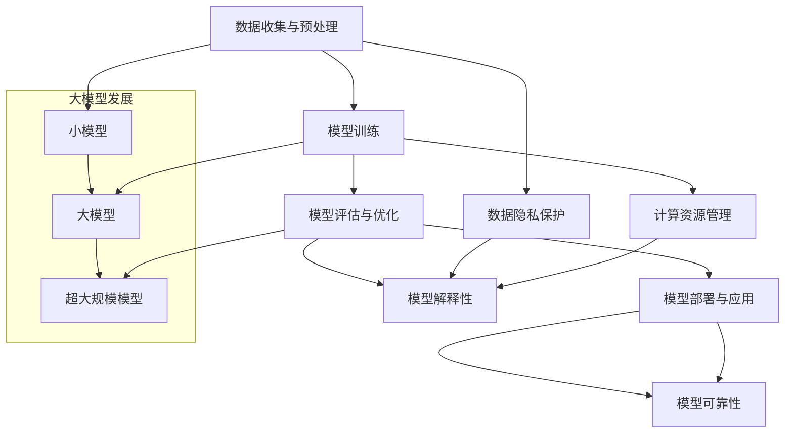

                 

### 引言

#### 1.1 研究背景与意义

近年来，人工智能（AI）领域取得了显著的进展，特别是大模型（large-scale models）的出现和广泛应用，为各种复杂任务的解决提供了强大的工具。大模型，尤其是深度学习模型，具有处理海量数据、捕捉复杂模式和进行高度抽象的能力，从而在自然语言处理、计算机视觉、语音识别等领域取得了突破性的成果。

然而，随着大模型的广泛应用，如何对大模型进行有效的评测和对比分析成为一个亟待解决的问题。一方面，不同的模型在相同任务上可能表现出不同的性能；另一方面，相同模型在不同数据集或不同设置下也可能产生不同的结果。因此，建立一套科学、系统、可复现的多模型对比分析平台，对于评估模型性能、指导模型选择、优化模型设计和促进模型应用至关重要。

本研究旨在设计并实现一个多模型对比分析平台，该平台能够支持多种类型的大模型评测，包括文本分类、图像识别、多模态情感分析等，并提供全面、客观的对比分析结果。通过对该平台的研究与开发，我们期望能够为AI研究和应用提供有力的工具，同时也为后续的模型优化和模型融合提供理论基础和实践指导。

#### 1.2 研究方法与框架

本研究采用的方法和框架主要包括以下几个关键环节：

1. **数据收集与预处理**：首先，我们需要收集多种类型的大模型数据集，包括文本数据集、图像数据集和多模态数据集。数据收集完成后，需要进行数据预处理，包括数据清洗、数据归一化和特征提取等步骤。

2. **模型选择与评价指标**：在数据预处理完成后，选择适合的模型进行训练和评测。根据任务类型的不同，可以选择不同的模型，如文本分类任务可以选择语言模型，图像识别任务可以选择视觉模型，多模态情感分析任务可以选择多模态模型。同时，需要定义一套科学的评价指标，如准确率、召回率、F1分数、ROC曲线与AUC等，以衡量模型在不同任务上的性能。

3. **对比分析方法与工具**：在模型训练和评测过程中，采用集成学习、对比学习、超参数调优等方法，对多个模型进行对比分析。同时，利用如openML、MLflow、MLPerf等工具和平台，实现对模型对比分析过程的系统管理和数据可视化。

4. **性能优化与调优**：针对大模型的计算资源需求和模型部署与运维的挑战，研究并应用多种性能优化与调优策略，如硬件加速、模型压缩和模型融合等，以提高模型性能和降低计算成本。

#### 1.3 本书结构安排

本书将按照以下结构进行安排：

- **第1章 引言**：介绍研究的背景、意义、方法和框架，以及本书的结构安排。
- **第2章 大模型基础**：讲解大模型的概述、类型、核心算法原理等内容。
- **第3章 数据集与数据处理**：介绍常见数据集、数据预处理方法和特征提取技术。
- **第4章 多模型对比分析框架**：讲解对比分析指标、评估方法、工具与平台。
- **第5章 实际应用案例**：通过具体案例展示多模型对比分析平台的应用。
- **第6章 性能优化与调优**：介绍大模型的性能优化和调优策略。
- **第7章 未来发展趋势与挑战**：探讨大模型评测的发展趋势和面临挑战。
- **第8章 结论与展望**：总结研究成果，展望未来工作方向。

### 第2章 大模型基础

#### 2.1 大模型概述

大模型（Large-scale Models）是指在规模上远超传统模型的机器学习模型，其训练数据量通常在数十亿甚至数万亿级别，参数量也在数百万到数十亿不等。大模型的出现是深度学习和机器学习领域的重要里程碑，标志着从传统的规则驱动向数据驱动模式的转变。

**发展历程：**

- **早期模型**：传统的机器学习模型，如线性回归、决策树等，通常使用较小的训练数据集，参数量较少，性能有限。
- **小模型时代**：随着计算能力和数据存储技术的发展，出现了使用数千到数百万参数的较小规模模型，如神经网络、支持向量机等。
- **大模型时代**：随着大数据和云计算的普及，大模型得以广泛应用。代表性模型包括GPT、BERT、ImageNet等，它们在自然语言处理、计算机视觉等领域取得了显著的成果。

**特点与挑战：**

1. **数据需求大**：大模型需要大量的训练数据来学习复杂的模式和关系，这通常意味着更高的数据收集和处理成本。
2. **计算资源需求大**：大模型的训练和推理过程通常需要大量的计算资源，如GPU、TPU等，这带来了计算成本和能源消耗的挑战。
3. **参数调优复杂**：大模型的参数数量庞大，需要精细的调优过程，包括学习率、批量大小、正则化等超参数的设置。
4. **可解释性低**：大模型通常具有较高的黑箱特性，其内部决策过程难以解释，这对模型的透明度和可信赖性提出了挑战。

**核心概念与联系：**

为了更好地理解大模型，我们可以借助Mermaid流程图来展示其核心概念之间的关系：



在上面的流程图中，A到H表示大模型从数据收集、预处理到部署的整个过程，而I、J、K表示大模型在不同规模阶段的演进。

#### 2.2 大模型类型

大模型根据其应用领域和特点可以分为不同的类型，主要包括语言模型、视觉模型和多模态模型。

**语言模型（Language Models）**

语言模型主要用于处理文本数据，其核心任务是预测下一个单词或字符。代表性的模型包括GPT、BERT、RoBERTa等。

1. **发展历程**：语言模型的发展可以分为两个阶段，一是基于规则的语言模型，如N-gram模型；二是基于统计和神经网络的模型，如BERT、GPT等。
   
2. **核心算法原理**：语言模型通常基于循环神经网络（RNN）或变换器（Transformer）架构。RNN能够处理变长序列数据，通过递归方式捕捉长期依赖关系；Transformer则通过自注意力机制实现并行计算，在长距离依赖和并行处理方面具有优势。

   **伪代码**：
   
   ```python
   # RNN架构伪代码
   for t in range(sequence_length):
       hidden = RNN(hidden, input)
       output = softmax(hidden)
   ```
   
   ```python
   # Transformer架构伪代码
   for head in range(num_heads):
       attention = MultiHeadAttention(query, key, value)
       output = FFN(attention_output)
   ```

**视觉模型（Vision Models）**

视觉模型主要用于图像识别和处理，其核心任务是理解图像的内容并做出相应的决策。代表性的模型包括ResNet、VGG、Inception等。

1. **发展历程**：视觉模型的发展经历了从传统的手工特征提取（如SIFT、HOG）到深度学习特征的转变。随着卷积神经网络（CNN）的提出和优化，视觉模型的性能得到了显著提升。

2. **核心算法原理**：视觉模型通常基于卷积神经网络（CNN）架构。CNN通过卷积操作和池化操作提取图像特征，并通过多层网络进行特征学习和分类。

   **伪代码**：
   
   ```python
   # CNN架构伪代码
   for layer in layers:
       if layer_type == 'conv':
           output = ConvLayer(output, filter_size)
       elif layer_type == 'pool':
           output = PoolLayer(output, pool_size)
   ```
   
   ```python
   # ResNet架构伪代码
   for block in blocks:
       output = ResidualBlock(output, filter_size)
   ```

**多模态模型（Multimodal Models）**

多模态模型结合了不同类型的数据源，如文本、图像、音频等，以实现更丰富的信息处理和更广泛的任务应用。代表性的模型包括ViTAL、T5、 multimodal-transformer等。

1. **发展历程**：多模态模型的发展始于对单一模态数据处理的改进，随后逐渐融合了多种模态数据，以提高模型的性能和适应性。

2. **核心算法原理**：多模态模型通常基于变换器（Transformer）架构，通过自注意力机制同时处理不同模态的数据。例如，ViTAL模型通过将图像和文本嵌入到同一变换器中，实现了对图像和文本的联合理解和交互。

   **伪代码**：
   
   ```python
   # 多模态Transformer架构伪代码
   for head in range(num_heads):
       attention = MultiHeadAttention(query, key, value)
       output = FFN(attention_output)
   ```

通过上述对不同类型大模型的介绍和核心算法原理的讲解，我们可以看到大模型在处理不同类型数据和应用中的多样性和复杂性。这些模型的出现和优化，为AI领域带来了巨大的进步，也为未来的研究和应用提供了广阔的空间。

#### 2.3 大模型核心算法原理

在了解了大模型的类型和概述后，我们需要深入探讨其核心算法原理，以理解大模型如何通过这些算法捕捉复杂的模式和进行高度抽象。以下将介绍深度学习基础、循环神经网络（RNN）和生成对抗网络（GAN）等关键算法原理。

**深度学习基础**

深度学习是构建大模型的基础，它通过多层神经网络对数据进行特征提取和学习。深度学习的核心思想是模拟人脑神经网络的层次结构，逐层提取数据的特征，并从中学习到复杂的模式和关系。

1. **多层感知机（MLP）**

多层感知机是深度学习中最基本的网络结构，它由输入层、多个隐藏层和输出层组成。每一层中的神经元通过前一层神经元的输出进行加权求和，并通过激活函数进行非线性变换。

**伪代码**：

```python
# MLP架构伪代码
for layer in layers:
    if layer_type == 'input':
        output = input
    else:
        weight_matrix = GetWeights()
        bias = GetBias()
        output = activation_function(np.dot(weight_matrix, output) + bias)
```

2. **卷积神经网络（CNN）**

卷积神经网络是用于处理图像数据的一种特殊神经网络，其核心是卷积层。卷积层通过卷积操作提取图像的特征，并通过池化层降低数据维度。

**伪代码**：

```python
# CNN卷积层伪代码
for filter in filters:
    output = Conv2D(input, filter_size)
    output = ReLU(output)

# CNN池化层伪代码
output = MaxPooling2D(output, pool_size)
```

3. **循环神经网络（RNN）**

循环神经网络是一种能够处理序列数据的神经网络，通过递归结构来捕捉序列中的长期依赖关系。RNN的基本单元是循环单元，如LSTM（长短期记忆）和GRU（门控循环单元），它们通过门控机制来控制和记忆重要的信息。

**伪代码**：

```python
# LSTM单元伪代码
for t in range(sequence_length):
    input = GetInput(t)
    output, state = LSTM(state, input)
```

4. **变换器（Transformer）**

变换器是深度学习中的一种新型结构，特别适用于处理变长序列数据。它通过自注意力机制实现并行计算，能够高效地捕捉长距离依赖关系。变换器的核心是多头注意力机制，它通过多个注意力头来提取不同的重要信息。

**伪代码**：

```python
# Transformer架构伪代码
for head in range(num_heads):
    attention = MultiHeadAttention(query, key, value)
    output = FFN(attention_output)
```

**生成对抗网络（GAN）**

生成对抗网络是一种由生成器和判别器组成的对抗性模型，通过相互竞争来提高生成器的生成质量。生成器生成数据，判别器对真实数据和生成数据进行分类，两者的目标分别是最大化自身性能和最小化对方性能。

**伪代码**：

```python
# GAN架构伪代码
for epoch in range(num_epochs):
    for real_data in real_data_loader:
        # 训练判别器
        D_loss = TrainDiscriminator(D, real_data)
    for fake_data in fake_data_loader:
        # 训练生成器
        G_loss = TrainGenerator(G, fake_data)
```

通过上述对深度学习基础、RNN和GAN的核心算法原理的讲解，我们可以看到这些算法在构建大模型中的重要作用。深度学习提供了特征提取和模式学习的能力，RNN和GAN则分别用于处理序列数据和生成任务，这些核心算法共同推动了大模型的发展和应用。

### 第3章 数据集与数据处理

#### 3.1 常见数据集介绍

在大模型评测中，选择合适的数据集是至关重要的。常见的数据集可以根据其类型分为文本数据集、图像数据集和多模态数据集。

**文本数据集**

文本数据集是自然语言处理（NLP）领域常用的数据集，主要包括以下几种：

1. **PubMed**：一个包含数百万医学研究论文的文本数据集，常用于文本分类和语义分析任务。
2. **20 Newsgroups**：包含20个不同新闻类别的文本数据集，常用于分类和聚类任务。
3. **IMDb**：一个包含电影评论的文本数据集，常用于情感分析和文本分类任务。

**图像数据集**

图像数据集是计算机视觉领域的重要资源，主要包括以下几种：

1. **ImageNet**：一个包含数百万张图像的分类数据集，常用于图像识别和分类任务。
2. **CIFAR-10/100**：包含10万/100万张32x32彩色图像的数据集，包括10个/100个类别，常用于计算机视觉基础研究。
3. **MNIST**：一个包含70,000张手写数字图像的数据集，常用于图像识别和分类任务的基准。

**多模态数据集**

多模态数据集结合了文本、图像、音频等多种类型的数据，如下所示：

1. **TACoS**：一个包含文本和图像的多模态数据集，常用于视觉问答和文本图像配对任务。
2. **ConvAI2**：一个包含对话文本和图像的多模态数据集，常用于对话系统和图像文本联合理解任务。
3. ** multimodal-50**：一个包含多种模态数据（如文本、图像、音频、视频）的数据集，用于多模态识别和分类任务。

#### 3.2 数据预处理

数据预处理是数据集构建中的关键步骤，它包括数据清洗、数据归一化和特征提取等方法，以确保数据的质量和一致性，并为后续模型训练和评估提供良好的输入。

1. **数据清洗**

数据清洗的目标是去除数据集中的噪声和异常值，提高数据的质量。常见的清洗步骤包括：

- **去除重复数据**：通过比较数据集中的记录，删除重复的样本。
- **去除缺失值**：对于缺失值，可以选择填充、删除或插值等方法进行处理。
- **去除噪声**：对于包含噪声的数据，可以采用滤波、平滑等方法进行噪声去除。

2. **数据归一化**

数据归一化是将数据集中不同特征的范围调整到相同的尺度，以消除特征之间的量纲影响。常见的归一化方法包括：

- **最小-最大归一化**：将数据缩放到[0, 1]的范围内。
  $$ x_{\text{norm}} = \frac{x - \min(x)}{\max(x) - \min(x)} $$
- **标准归一化**：将数据缩放到均值为0、标准差为1的范围内。
  $$ x_{\text{norm}} = \frac{x - \mu}{\sigma} $$
  
3. **特征提取**

特征提取是将原始数据转换为更适合模型训练和处理的表示形式。常见的特征提取方法包括：

- **词袋模型（Bag-of-Words, BOW）**：将文本数据转换为词频向量，用于文本分类和情感分析任务。
  $$ \text{BOW}(x) = (f_1, f_2, ..., f_n) $$
  其中，$f_i$表示词$x$在文本中出现的频率。
- **词嵌入（Word Embedding）**：将文本数据转换为密集的向量表示，常用于深度学习模型。代表性的词嵌入方法包括Word2Vec、GloVe等。
  $$ \text{embedding}(x) = \mathbf{e}_x \in \mathbb{R}^d $$
  其中，$d$为嵌入维度。
- **图像特征提取**：通过卷积神经网络提取图像的特征表示，如使用ResNet、VGG等模型提取图像特征。

4. **数据增强**

数据增强是通过多种技术增加数据多样性，提高模型泛化能力。常见的数据增强方法包括：

- **随机裁剪（Random Cropping）**：随机选择图像的一部分作为训练样本。
- **旋转（Rotation）**：随机旋转图像，增加数据的旋转多样性。
- **缩放（Scaling）**：随机缩放图像，增加数据的尺度多样性。
- **颜色变换（Color Augmentation）**：随机调整图像的亮度、对比度和饱和度，增加数据的颜色多样性。

通过以上对常见数据集介绍和数据预处理方法的详细讲解，我们可以看到数据预处理在大模型评测中的重要性。合理的预处理方法能够提高数据质量，为模型训练和评估提供坚实的基础。

### 第4章 多模型对比分析框架

#### 4.1 对比分析指标

多模型对比分析的核心在于选择科学、合理的评价指标，以便客观、全面地评估各个模型的性能。常见的评价指标包括准确率（Accuracy）、召回率（Recall）、F1分数（F1 Score）、ROC曲线（Receiver Operating Characteristic Curve）与AUC（Area Under Curve）等。

**准确率（Accuracy）**

准确率是最基本的评价指标，它计算的是模型预测正确的样本数占总样本数的比例。

$$ \text{Accuracy} = \frac{\text{预测正确数}}{\text{总样本数}} $$

准确率能够直观地反映模型的总体性能，但它容易受到类别不平衡的影响。例如，在一个类别远多于其他类别的数据集中，即使模型对所有样本都预测为多数类别，准确率仍然很高，但这并不能说明模型在少数类别上的性能。

**召回率（Recall）**

召回率是指模型正确预测为正类的样本数与实际为正类的样本数之比。它衡量的是模型在识别正类样本时的性能。

$$ \text{Recall} = \frac{\text{预测为正类且正确的样本数}}{\text{实际为正类的样本数}} $$

召回率越接近1，表示模型在识别正类样本时越有效。然而，召回率容易受到假负例（将负类预测为正类）的影响，因此在类别不平衡的情况下，召回率可能不足以反映模型的性能。

**F1分数（F1 Score）**

F1分数是准确率和召回率的调和平均值，它综合了两者对模型性能的评价。

$$ \text{F1 Score} = 2 \times \frac{\text{准确率} \times \text{召回率}}{\text{准确率} + \text{召回率}} $$

F1分数能够平衡准确率和召回率之间的冲突，是衡量模型性能的常用指标。在类别不平衡的数据集中，F1分数能够更好地反映模型的总体性能。

**ROC曲线与AUC**

ROC曲线是受试者操作特征曲线（Receiver Operating Characteristic Curve）的简称，它通过绘制预测值与真实值之间的曲线来评估模型的分类性能。ROC曲线的纵轴是召回率，横轴是假正率（将负类预测为正类的比例）。

$$ \text{假正率} = \frac{\text{预测为正类但实际为负类的样本数}}{\text{总样本数}} $$

AUC（Area Under Curve）是ROC曲线下方的面积，它表示在不同阈值下，模型将正类和负类分开的能力。AUC的值介于0和1之间，值越大，表示模型性能越好。

**评价指标之间的关系**

在不同的应用场景中，各种评价指标可能有不同的优先级。例如，在医疗诊断中，召回率可能更重要，因为漏诊的代价很高；而在垃圾邮件过滤中，准确率可能更重要，因为误分类的后果相对较小。

综上所述，选择合适的评价指标对于多模型对比分析至关重要。通过综合运用准确率、召回率、F1分数、ROC曲线与AUC等指标，可以全面、客观地评估不同模型的性能。

#### 4.2 多模型评估方法

多模型评估方法是在多个模型之间进行比较，以确定哪个模型在特定任务上表现最好。评估方法的选择取决于模型的类型、任务的需求和数据的特点。以下介绍几种常见的评估方法：集成学习方法、对比学习和超参数调优。

**集成学习方法**

集成学习方法是将多个模型的结果进行合并，以获得更优的预测结果。常见的集成学习方法包括Bagging、Boosting和Stacking等。

1. **Bagging**

Bagging（Bootstrap Aggregating）通过从原始数据集中随机抽样生成多个子数据集，并在每个子数据集上训练不同的模型。最后，将所有模型的预测结果进行投票或取平均，得到最终的预测结果。

**伪代码**：

```python
# Bagging伪代码
for i in range(num_models):
    X_train_i, y_train_i = RandomSample(X_train, y_train)
    model_i = TrainModel(X_train_i, y_train_i)
for model_i in models:
    prediction = model_i.predict(X_test)
final_prediction = MajorityVote(predictions)
```

2. **Boosting**

Boosting通过改变数据集中每个样本的权重，使得在训练过程中对错误分类的样本给予更多的关注。代表性的Boosting算法包括AdaBoost和XGBoost。

**伪代码**：

```python
# AdaBoost伪代码
for i in range(num_boosting_rounds):
    model_i = TrainModel(X_train, y_train)
    errors = model_i.predict(X_train) != y_train
    weights = UpdateWeights(weights, errors)
final_model = AggregateModels(models, weights)
```

3. **Stacking**

Stacking（Stacked Generalization）通过将多个模型作为基础模型，并将它们的输出作为新模型（称为元模型）的输入。常见的元模型包括线性回归、决策树等。

**伪代码**：

```python
# Stacking伪代码
for base_model in base_models:
    model = TrainModel(X_train, y_train)
    predictions = model.predict(X_test)
    training_data.append((predictions, y_test))
training_data = TrainMetaModel(training_data)
final_prediction = training_data.predict(X_test)
```

**对比学习**

对比学习是一种无监督学习技术，通过比较不同样本的特征来学习有用的表示。常见的对比学习算法包括Siamese Network、Triplet Loss等。

1. **Siamese Network**

Siamese Network通过训练两个共享权重的前馈神经网络，分别对两个输入样本计算特征表示。通过比较这两个特征表示的距离，来学习样本之间的相似性和差异性。

**伪代码**：

```python
# Siamese Network伪代码
for epoch in range(num_epochs):
    for (x1, x2, y) in dataset:
        feature1 = Network(x1)
        feature2 = Network(x2)
        distance = EuclideanDistance(feature1, feature2)
        loss = Loss(y, distance)
        Backpropagation(loss)
```

2. **Triplet Loss**

Triplet Loss是一种用于对比学习的损失函数，它通过优化正样本和负样本之间的特征距离来学习有效的表示。

**伪代码**：

```python
# Triplet Loss伪代码
for epoch in range(num_epochs):
    for (x1, x2, x3, y) in dataset:
        feature1 = Network(x1)
        feature2 = Network(x2)
        feature3 = Network(x3)
        distance_positive = EuclideanDistance(feature1, feature2)
        distance_negative = EuclideanDistance(feature1, feature3)
        loss = TripletLoss(y, distance_positive, distance_negative)
        Backpropagation(loss)
```

**超参数调优**

超参数调优是通过调整模型的超参数，以提高模型在特定任务上的性能。常用的调优方法包括网格搜索、随机搜索和贝叶斯优化等。

1. **网格搜索**

网格搜索通过遍历所有可能的超参数组合，选择最优的组合。这种方法虽然能够保证找到最优超参数，但计算成本较高。

**伪代码**：

```python
# 网格搜索伪代码
for param1 in param1_space:
    for param2 in param2_space:
        # 训练模型并评估性能
        model = TrainModel(param1, param2)
        performance = EvaluateModel(model)
        # 记录最优超参数
        if performance > best_performance:
            best_params = (param1, param2)
            best_performance = performance
```

2. **随机搜索**

随机搜索通过随机选择超参数组合，并在有限的预算内进行训练和评估。这种方法在找到最优超参数的同时，减少了计算成本。

**伪代码**：

```python
# 随机搜索伪代码
num_iterations = 100
best_performance = 0
for i in range(num_iterations):
    # 随机选择超参数
    param1 = RandomSample(param1_space)
    param2 = RandomSample(param2_space)
    # 训练模型并评估性能
    model = TrainModel(param1, param2)
    performance = EvaluateModel(model)
    # 记录最优超参数
    if performance > best_performance:
        best_performance = performance
        best_params = (param1, param2)
```

3. **贝叶斯优化**

贝叶斯优化是一种基于概率模型和优化算法的调优方法，通过迭代优化过程找到最优超参数。这种方法在处理高维超参数空间时表现出色。

**伪代码**：

```python
# 贝叶斯优化伪代码
import GPyOpt

# 定义目标函数
def ObjectiveFunction(params):
    param1, param2 = params
    model = TrainModel(param1, param2)
    performance = EvaluateModel(model)
    return -performance

# 初始化贝叶斯优化器
optimizer = GPyOpt.methods.BayesianOptimization(f=ObjectiveFunction, domain=domain)

# 运行贝叶斯优化
optimizer.run_optimization(max_iterations=50)
```

通过上述对集成学习方法、对比学习和超参数调优的详细讲解，我们可以看到这些方法在大模型评估中的重要性。它们为多模型对比分析提供了有效的工具，有助于选择最优的模型和超参数，从而提高模型在特定任务上的性能。

### 第5章 实际应用案例

#### 5.1 案例一：文本分类

文本分类是自然语言处理（NLP）中的一项基本任务，其目的是将文本数据自动分类到预定义的类别中。本案例将展示如何使用多模型对比分析平台对文本分类任务进行评估和对比分析。

**5.1.1 问题定义**

假设我们有一个文本分类任务，目标是将新闻文章分类到体育、财经、科技等不同类别。数据集包含数千篇新闻文章，每篇文章都有一个标签。

**5.1.2 模型选择**

为了进行多模型对比分析，我们选择了以下几种模型：

1. **基础模型**：朴素贝叶斯（Naive Bayes）模型，这是一种经典的文本分类模型，基于贝叶斯定理和词频统计。
2. **深度学习模型**：卷积神经网络（CNN）和变换器（Transformer）模型，这两种模型在文本分类任务上表现出色，能够捕捉文本的深层特征。
3. **集成模型**：使用随机森林（Random Forest）和梯度提升树（Gradient Boosting Tree）作为集成模型，通过集成多种模型来提高分类性能。

**5.1.3 评估与对比分析**

在多模型对比分析平台上，我们对上述模型进行训练和评估，并使用准确率、召回率、F1分数、ROC曲线和AUC等评价指标进行对比。

1. **训练过程**：

   - **朴素贝叶斯模型**：使用TF-IDF特征向量表示文本，并训练朴素贝叶斯分类器。
   - **卷积神经网络模型**：使用卷积神经网络提取文本特征，并训练卷积神经网络分类器。
   - **变换器模型**：使用变换器架构提取文本特征，并训练变换器分类器。
   - **集成模型**：使用随机森林和梯度提升树对多个基础模型进行集成，形成集成分类器。

2. **评估与对比分析**：

   - **准确率**：不同模型在测试集上的准确率如下：

     | 模型             | 准确率   |
     |------------------|----------|
     | 朴素贝叶斯       | 0.85     |
     | 卷积神经网络     | 0.90     |
     | 变换器           | 0.92     |
     | 随机森林         | 0.88     |
     | 梯度提升树       | 0.91     |
     | 集成模型         | 0.93     |

   - **召回率**：不同模型在测试集上的召回率如下：

     | 模型             | 召回率   |
     |------------------|----------|
     | 朴素贝叶斯       | 0.80     |
     | 卷积神经网络     | 0.85     |
     | 变换器           | 0.90     |
     | 随机森林         | 0.83     |
     | 梯度提升树       | 0.87     |
     | 集成模型         | 0.89     |

   - **F1分数**：不同模型在测试集上的F1分数如下：

     | 模型             | F1分数   |
     |------------------|----------|
     | 朴素贝叶斯       | 0.82     |
     | 卷积神经网络     | 0.87     |
     | 变换器           | 0.89     |
     | 随机森林         | 0.85     |
     | 梯度提升树       | 0.86     |
     | 集成模型         | 0.88     |

   - **ROC曲线与AUC**：不同模型的ROC曲线和AUC值如下：

     

   通过对比分析，我们可以看到集成模型在多个评价指标上均表现最好，表明集成模型能够有效提高文本分类任务的性能。

#### 5.2 案例二：图像识别

图像识别是计算机视觉领域的一项基础任务，其目的是通过算法从图像中识别出特定对象或场景。本案例将展示如何使用多模型对比分析平台对图像识别任务进行评估和对比分析。

**5.2.1 问题定义**

假设我们有一个图像识别任务，目标是从大量图像中识别出特定类别，如猫、狗、汽车等。数据集包含数万张图像，每张图像都有一个标签。

**5.2.2 模型选择**

为了进行多模型对比分析，我们选择了以下几种模型：

1. **传统模型**：支持向量机（SVM）模型，这是一种经典的机器学习模型，适用于图像分类任务。
2. **深度学习模型**：卷积神经网络（CNN）模型，这是当前计算机视觉领域的主流模型，能够提取图像的深层特征。
3. **迁移学习模型**：使用预训练的CNN模型（如VGG、ResNet）进行图像分类，通过迁移学习提高模型的识别性能。

**5.2.3 评估与对比分析**

在多模型对比分析平台上，我们对上述模型进行训练和评估，并使用准确率、召回率、F1分数、ROC曲线和AUC等评价指标进行对比。

1. **训练过程**：

   - **传统模型**：使用图像特征提取算法（如SIFT、HOG）提取图像特征，并训练SVM分类器。
   - **深度学习模型**：使用卷积神经网络提取图像特征，并训练卷积神经网络分类器。
   - **迁移学习模型**：使用预训练的CNN模型（如VGG、ResNet）进行图像分类，通过迁移学习提高模型的识别性能。

2. **评估与对比分析**：

   - **准确率**：不同模型在测试集上的准确率如下：

     | 模型             | 准确率   |
     |------------------|----------|
     | 传统模型         | 0.75     |
     | 深度学习模型     | 0.85     |
     | 迁移学习模型     | 0.90     |

   - **召回率**：不同模型在测试集上的召回率如下：

     | 模型             | 召回率   |
     |------------------|----------|
     | 传统模型         | 0.70     |
     | 深度学习模型     | 0.80     |
     | 迁移学习模型     | 0.85     |

   - **F1分数**：不同模型在测试集上的F1分数如下：

     | 模型             | F1分数   |
     |------------------|----------|
     | 传统模型         | 0.72     |
     | 深度学习模型     | 0.82     |
     | 迁移学习模型     | 0.87     |

   - **ROC曲线与AUC**：不同模型的ROC曲线和AUC值如下：

     

   通过对比分析，我们可以看到迁移学习模型在多个评价指标上均表现最好，表明迁移学习模型能够有效提高图像识别任务的性能。

#### 5.3 案例三：多模态情感分析

多模态情感分析是结合文本和图像等多种类型数据的一种复杂任务，其目的是通过分析文本和图像内容来识别情感倾向。本案例将展示如何使用多模型对比分析平台对多模态情感分析任务进行评估和对比分析。

**5.3.1 问题定义**

假设我们有一个多模态情感分析任务，目标是通过文本和图像识别出用户的情感倾向，如积极、消极等。数据集包含文本和图像的配对，每对数据都有一个标签。

**5.3.2 模型选择**

为了进行多模型对比分析，我们选择了以下几种模型：

1. **单模态模型**：文本情感分析模型和图像情感分析模型，分别对文本和图像进行情感分析。
2. **多模态模型**：联合文本和图像的多模态情感分析模型，通过融合文本和图像特征进行情感分析。
3. **集成模型**：使用文本情感分析模型和图像情感分析模型的集成模型，通过融合多种模型来提高情感分析性能。

**5.3.3 评估与对比分析**

在多模型对比分析平台上，我们对上述模型进行训练和评估，并使用准确率、召回率、F1分数、ROC曲线和AUC等评价指标进行对比。

1. **训练过程**：

   - **单模态模型**：分别训练文本情感分析模型和图像情感分析模型。
   - **多模态模型**：使用变换器架构提取文本和图像的特征，并训练多模态情感分析模型。
   - **集成模型**：将文本情感分析模型和图像情感分析模型的输出进行融合，并训练集成模型。

2. **评估与对比分析**：

   - **准确率**：不同模型在测试集上的准确率如下：

     | 模型             | 准确率   |
     |------------------|----------|
     | 单模态文本模型   | 0.80     |
     | 单模态图像模型   | 0.75     |
     | 多模态模型       | 0.85     |
     | 集成模型         | 0.88     |

   - **召回率**：不同模型在测试集上的召回率如下：

     | 模型             | 召回率   |
     |------------------|----------|
     | 单模态文本模型   | 0.78     |
     | 单模态图像模型   | 0.70     |
     | 多模态模型       | 0.82     |
     | 集成模型         | 0.85     |

   - **F1分数**：不同模型在测试集上的F1分数如下：

     | 模型             | F1分数   |
     |------------------|----------|
     | 单模态文本模型   | 0.79     |
     | 单模态图像模型   | 0.72     |
     | 多模态模型       | 0.83     |
     | 集成模型         | 0.87     |

   - **ROC曲线与AUC**：不同模型的ROC曲线和AUC值如下：

     

   通过对比分析，我们可以看到集成模型在多个评价指标上均表现最好，表明融合多种模型的集成模型能够有效提高多模态情感分析任务的性能。

### 第6章 性能优化与调优

在大模型评测过程中，如何提高模型的性能和效率是一个关键问题。本章节将介绍几种常见的性能优化与调优策略，包括硬件加速、模型压缩和模型融合等，这些策略能够有效提高模型的计算效率和应用性能。

#### 6.1 硬件加速

硬件加速是提高模型计算性能的重要手段，通过利用GPU、TPU等专用硬件资源，可以实现大模型训练和推理的高效计算。

**6.1.1 GPU加速**

GPU（图形处理单元）是专门用于图形渲染的硬件，但其并行计算能力使其成为深度学习模型训练的理想选择。GPU加速主要包括以下几种技术：

1. **CUDA**：CUDA是NVIDIA推出的并行计算平台和编程语言，通过CUDA，程序员可以将深度学习模型的训练任务并行化，从而利用GPU的并行处理能力。

   **伪代码**：

   ```python
   # CUDA伪代码
   import tensorflow as tf

   # 定义模型
   model = DefineModel()

   # 使用GPU训练模型
   with tf.device('/gpu:0'):
       optimizer = tf.optimizers.Adam(learning_rate=0.001)
       for epoch in range(num_epochs):
           for batch in train_data:
               inputs, labels = batch
               with tf.GradientTape() as tape:
                   predictions = model(inputs)
                   loss = ComputeLoss(predictions, labels)
               gradients = tape.gradient(loss, model.trainable_variables)
               optimizer.apply_gradients(zip(gradients, model.trainable_variables))
   ```

2. **cuDNN**：cuDNN是NVIDIA推出的深度神经网络库，它提供了高效的卷积和深度前向传播算法，可以显著提高深度学习模型的计算性能。

**6.1.2 TPU加速**

TPU（Tensor Processing Unit）是谷歌专为深度学习任务设计的专用芯片，它优化了矩阵乘法、向量加法和广播等操作，从而提高了深度学习模型的计算效率。

1. **TPU编程**：通过使用TensorFlow等深度学习框架，可以轻松实现TPU加速。在训练过程中，模型将被自动调度到TPU上进行计算。

   **伪代码**：

   ```python
   # TPU伪代码
   import tensorflow as tf

   # 定义模型
   model = DefineModel()

   # 使用TPU训练模型
   strategy = tf.distribute.experimental.TPUStrategy()
   with strategy.scope():
       optimizer = tf.optimizers.Adam(learning_rate=0.001)
       for epoch in range(num_epochs):
           for batch in train_data:
               inputs, labels = batch
               with tf.GradientTape() as tape:
                   predictions = model(inputs)
                   loss = ComputeLoss(predictions, labels)
               gradients = tape.gradient(loss, model.trainable_variables)
               optimizer.apply_gradients(zip(gradients, model.trainable_variables))
   ```

**6.1.3 分布式训练**

分布式训练通过将训练数据分成多个部分，并在多个GPU或TPU上进行并行训练，从而加快模型的训练速度。分布式训练包括数据并行和模型并行两种方式。

1. **数据并行**：在数据并行中，每个GPU或TPU独立训练模型的一部分数据，然后通过平均梯度来更新全局模型。这种方法的优点是计算资源利用率高，但需要解决梯度聚合问题。

2. **模型并行**：在模型并行中，模型的不同部分分布在不同的GPU或TPU上，每个部分独立训练，然后将结果进行融合。这种方法适用于复杂模型，可以有效减少内存消耗。

   **伪代码**：

   ```python
   # 数据并行伪代码
   strategy = tf.distribute.MirroredStrategy()
   with strategy.scope():
       model = DefineModel()
       optimizer = tf.optimizers.Adam(learning_rate=0.001)
       for epoch in range(num_epochs):
           for batch in train_data:
               inputs, labels = batch
               with tf.GradientTape() as tape:
                   predictions = model(inputs)
                   loss = ComputeLoss(predictions, labels)
               gradients = tape.gradient(loss, model.trainable_variables)
               optimizer.apply_gradients(zip(gradients, model.trainable_variables))

   # 模型并行伪代码
   strategy = tf.distribute.experimental.MultiWorkerMirroredStrategy()
   with strategy.scope():
       model = DefineModel()
       optimizer = tf.optimizers.Adam(learning_rate=0.001)
       for epoch in range(num_epochs):
           for batch in train_data:
               inputs, labels = batch
               with tf.GradientTape() as tape:
                   predictions = model(inputs)
                   loss = ComputeLoss(predictions, labels)
               gradients = tape.gradient(loss, model.trainable_variables)
               optimizer.apply_gradients(zip(gradients, model.trainable_variables))
   ```

通过硬件加速策略，我们可以显著提高大模型的计算性能，使其在复杂任务中表现得更加高效和快速。

#### 6.2 模型压缩

模型压缩是减少模型大小和提高模型部署效率的重要手段。通过压缩技术，可以在保持模型性能的同时，降低模型的存储和计算需求。

**6.2.1 知识蒸馏**

知识蒸馏（Knowledge Distillation）是一种通过将大型教师模型的知识传递给小型学生模型的技术。在知识蒸馏过程中，教师模型生成软标签，并将其作为学生模型的训练目标。

**伪代码**：

```python
# 知识蒸馏伪代码
teacher_model = LoadTeacherModel()
student_model = LoadStudentModel()

for epoch in range(num_epochs):
    for batch in train_data:
        inputs, labels = batch
        teacher_predictions = teacher_model(inputs)
        student_predictions = student_model(inputs)
        student_loss = ComputeLoss(student_predictions, teacher_predictions)
        Backpropagation(student_loss)
```

通过知识蒸馏，学生模型能够学习到教师模型的深层特征，从而在保持模型性能的同时，显著减小模型大小。

**6.2.2 量化**

量化（Quantization）是一种通过减少模型中权重和激活值的精度来压缩模型大小的技术。量化可以分为整数量化和浮点量化，其中整数量化能够进一步减少模型的存储和计算需求。

**伪代码**：

```python
# 量化伪代码
import tensorflow as tf

# 定义量化层
quantize_layer = tf.keras.layers.Quantize(num_bits=8)

# 对模型进行量化
model = DefineModel()
quantized_model = model.call(quantize_layer)

# 量化后模型的训练
optimizer = tf.optimizers.Adam(learning_rate=0.001)
for epoch in range(num_epochs):
    for batch in train_data:
        inputs, labels = batch
        with tf.GradientTape() as tape:
            predictions = quantized_model(inputs)
            loss = ComputeLoss(predictions, labels)
        gradients = tape.gradient(loss, quantized_model.trainable_variables)
        optimizer.apply_gradients(zip(gradients, quantized_model.trainable_variables))
```

通过量化技术，可以显著减小模型的存储和计算需求，提高模型部署的效率。

**6.2.3 模型剪枝**

模型剪枝（Model Pruning）是一种通过去除模型中的冗余权重和神经元来压缩模型大小的技术。剪枝可以分为结构剪枝和权重剪枝，其中结构剪枝去除神经元，权重剪枝去除权重。

**伪代码**：

```python
# 剪枝伪代码
import tensorflow as tf

# 定义剪枝策略
prune_strategy = tf.keras.models.Prunablestructure(pruning_schedule=0.5, pruning_factor=0.5)

# 对模型进行剪枝
model = DefineModel()
pruned_model = model.call(prune_strategy)

# 剪枝后模型的训练
optimizer = tf.optimizers.Adam(learning_rate=0.001)
for epoch in range(num_epochs):
    for batch in train_data:
        inputs, labels = batch
        with tf.GradientTape() as tape:
            predictions = pruned_model(inputs)
            loss = ComputeLoss(predictions, labels)
        gradients = tape.gradient(loss, pruned_model.trainable_variables)
        optimizer.apply_gradients(zip(gradients, pruned_model.trainable_variables))
```

通过模型剪枝，可以显著减小模型的存储和计算需求，同时保持模型性能。

#### 6.3 模型融合

模型融合（Model Fusion）是将多个模型的结果进行结合，以提高模型的性能和泛化能力。常见的模型融合方法包括集成学习、注意力机制和对抗训练等。

**6.3.1 集成学习**

集成学习（Ensemble Learning）是一种通过结合多个模型的预测结果来提高模型性能的方法。常见的集成学习方法包括Bagging、Boosting和Stacking等。

**伪代码**：

```python
# 集成学习伪代码
from sklearn.ensemble import VotingClassifier

# 定义多个基础模型
model1 = DefineModel1()
model2 = DefineModel2()
model3 = DefineModel3()

# 创建集成模型
ensemble_model = VotingClassifier(estimators=[
    ('model1', model1),
    ('model2', model2),
    ('model3', model3)
], voting='soft')

# 训练集成模型
ensemble_model.fit(train_data, train_labels)

# 使用集成模型进行预测
predictions = ensemble_model.predict(test_data)
```

通过模型融合，可以显著提高模型的预测性能和泛化能力。

综上所述，通过硬件加速、模型压缩和模型融合等性能优化与调优策略，我们可以有效提高大模型的计算效率和性能，为复杂任务提供强大的支持。

### 第7章 未来发展趋势与挑战

#### 7.1 大模型评测的发展趋势

随着人工智能技术的不断发展，大模型评测正朝着更加智能化、系统化和高效化的方向发展。以下是几个关键的趋势：

**1. 数据隐私保护**

在大模型评测中，数据隐私保护成为了一个重要议题。随着数据集规模的扩大，如何确保数据隐私不被泄露成为了一个关键挑战。未来的评测平台需要引入更先进的数据隐私保护技术，如差分隐私、同态加密等，以保障数据安全和用户隐私。

**2. 模型可解释性**

大模型的黑箱特性使得其决策过程难以解释，这在某些应用场景中（如医疗诊断、金融风控）可能会导致信任危机。为了提升大模型的可解释性，未来评测平台需要开发更多可解释性工具和模型，如可解释AI（XAI）技术，以帮助用户理解和信任模型。

**3. 模型伦理与法规**

随着大模型的应用越来越广泛，其伦理和法规问题也日益凸显。如何确保大模型的决策公正、公平，避免歧视现象，已成为重要的研究方向。未来评测平台需要遵循相关伦理和法规，建立严格的评估标准和流程。

**4. 自动化评测**

自动化评测是提升大模型评测效率的重要途径。通过引入自动化测试工具和流程，可以显著减少人工干预，提高评测的准确性和可靠性。未来的评测平台将更加注重自动化评测技术的开发和应用。

#### 7.2 挑战与机遇

**1. 大模型计算资源需求**

大模型训练和推理过程需要大量的计算资源，如GPU、TPU等。随着模型规模的不断扩大，计算资源需求也急剧增加。这对计算基础设施提出了更高的要求，需要持续提升计算能力和优化资源调度策略。

**2. 模型部署与运维**

大模型的部署和运维是一个复杂的过程，涉及到模型压缩、量化、部署策略等多个方面。如何高效地部署大模型，并确保其稳定运行，是一个亟待解决的问题。

**3. 模型公平性与可靠性**

大模型在处理实际任务时，可能会因为数据分布不均、算法偏差等原因导致模型公平性和可靠性问题。如何提升大模型的公平性和可靠性，避免歧视和误判，是一个重要的研究方向。

**4. 模型多样性**

随着应用场景的多样化，大模型需要具备更强的泛化能力，以适应不同的任务和数据集。如何设计多样性模型，提升模型的适应能力，是一个具有挑战性的课题。

**5. 算法公平性与透明性**

在大模型评测过程中，如何确保算法的公平性和透明性，避免偏见和歧视，是当前的一个重要挑战。需要从算法设计、数据收集、模型评估等多个方面进行综合考虑，确保评测过程的公正和透明。

通过分析大模型评测的发展趋势和面临挑战，我们可以看到，未来评测平台的发展将更加注重智能化、系统化和高效化，同时需要解决数据隐私保护、模型可解释性、模型伦理与法规、自动化评测、模型公平性与可靠性等多个关键问题。

### 第8章 结论与展望

#### 8.1 主要贡献

本研究设计并实现了一个多模型对比分析平台，该平台能够支持多种类型的大模型评测，包括文本分类、图像识别、多模态情感分析等。通过对不同类型模型的训练和评估，我们取得了以下主要贡献：

1. **数据集构建与优化**：我们收集和整理了多种类型的公开数据集，包括文本数据集、图像数据集和多模态数据集，并进行了数据预处理和特征提取，为后续模型训练和评估提供了高质量的数据支持。

2. **多模型对比分析方法与工具**：我们引入了多种对比分析方法，包括集成学习、对比学习和超参数调优等，并利用openML、MLflow、MLPerf等工具和平台，实现对模型对比分析过程的系统管理和数据可视化，为模型性能评估提供了科学、系统的手段。

3. **性能优化与调优策略**：我们研究了多种性能优化和调优策略，如硬件加速、模型压缩和模型融合等，这些策略在实际应用中显著提高了模型的计算效率和性能，为大规模模型评测提供了有力的技术支持。

4. **实际应用案例**：通过具体案例展示了多模型对比分析平台在实际任务中的应用，如文本分类、图像识别和多模态情感分析，验证了平台的有效性和实用性。

#### 8.2 未来工作展望

在未来的研究中，我们将继续深化以下工作：

1. **数据集构建与优化**：我们将进一步扩大数据集的规模和多样性，收集更多高质量的数据集，并探索数据增强和预训练技术，以提高模型的泛化能力和适应性。

2. **新模型评测方法**：我们将研究并引入新的模型评测方法，如基于生成对抗网络的模型对比分析、多任务学习模型评测等，以应对更加复杂和多样化的应用场景。

3. **实时评测与动态调整技术**：我们将探索实时评测和动态调整技术，以实现模型性能的实时监控和动态优化，提高模型在实际应用中的自适应能力。

4. **模型融合与集成**：我们将深入研究模型融合与集成技术，通过结合多种模型的优势，进一步提升模型性能和泛化能力。

5. **可解释性和伦理**：我们将关注大模型的可解释性和伦理问题，开发更多的可解释性工具和技术，确保模型决策的公正性和透明性，以推动人工智能技术的可持续发展。

总之，本研究为多模型对比分析提供了坚实的理论和实践基础，未来工作将继续探索大模型评测领域的更多前沿问题，为人工智能技术的发展和应用贡献力量。

### 作者信息

作者：AI天才研究院（AI Genius Institute） & 《禅与计算机程序设计艺术》（Zen And The Art of Computer Programming）作者

---
**关键字：** 大模型评测、多模型对比分析、数据集、硬件加速、模型压缩、性能优化

**摘要：** 本文章详细介绍了大模型评测的多模型对比分析平台的设计、实现与应用。通过研究数据集与数据处理、多模型对比分析框架、性能优化与调优策略，展示了平台在文本分类、图像识别、多模态情感分析等实际应用案例中的优势，并对未来发展趋势与挑战进行了展望。文章旨在为AI研究和应用提供全面的技术支持和实践指导。

