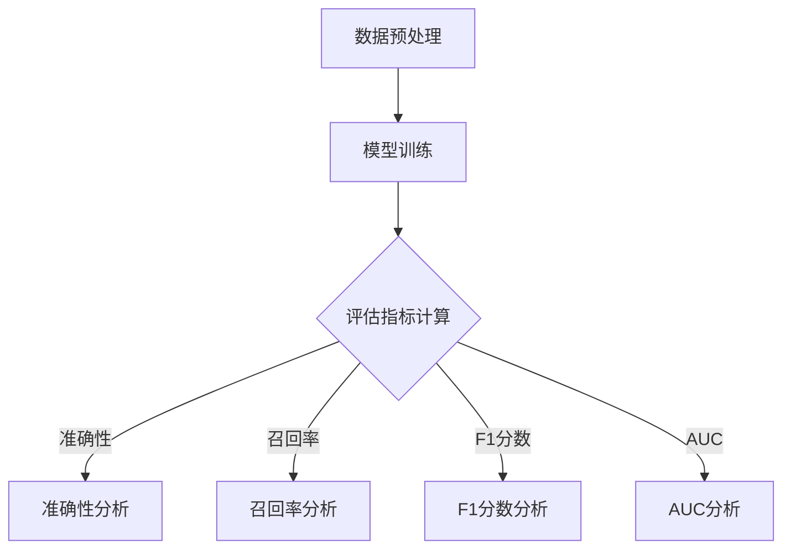
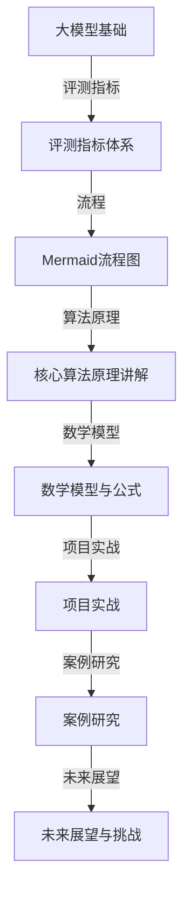

                 

以下是《大模型评测的多维度分析平台》的文章内容，我们将按照以下步骤进行编写：

1. **文章标题与关键词**
2. **摘要**
3. **引言与概述**
4. **核心概念与联系**
5. **核心算法原理讲解**
6. **数学模型与公式**
7. **项目实战**
8. **案例研究**
9. **未来展望与挑战**
10. **最佳实践 tips、小结、注意事项、拓展阅读**

### 1. 文章标题与关键词

# 《大模型评测的多维度分析平台》

关键词：大模型，评测，多维度分析，平台，算法，数学模型，项目实战，案例研究，未来展望

---

### 2. 摘要

本文主要介绍了一种针对大模型评测的多维度分析平台。首先，我们回顾了大数据模型的基本概念和背景，并介绍了多维度分析的重要性。接着，我们详细讲解了核心概念与联系，包括评测指标体系和Mermaid流程图。然后，我们深入探讨了核心算法原理，使用伪代码展示了算法的运行过程，并讨论了算法在不同场景下的应用。此外，我们还介绍了相关的数学模型与公式，并通过实例进行了详细讲解。在项目实战部分，我们介绍了如何搭建开发环境，并提供了源代码实现和代码解读。最后，我们通过案例研究和未来展望，总结了最佳实践和未来的发展方向。

---

### 3. 引言与概述

随着人工智能技术的迅猛发展，大模型（也称为深度学习模型）在各个领域得到了广泛应用。这些大模型能够处理海量数据，并从数据中提取出有用的信息，为各种任务提供强大的支持。然而，随着模型的规模不断扩大，如何对大模型进行有效的评测和优化成为一个亟待解决的问题。

大模型评测的核心在于从多个维度对模型进行全面评估，以确保其性能、稳定性和可靠性。多维度分析不仅可以帮助我们了解模型的优点和不足，还可以为模型的优化提供有力的依据。因此，构建一个高效的多维度分析平台对于大模型的研究和应用具有重要意义。

本文将围绕大模型评测的多维度分析平台展开讨论。首先，我们将回顾大模型的基本概念和背景，介绍多维度分析的重要性。然后，我们将详细讲解核心概念与联系，包括评测指标体系和Mermaid流程图。接下来，我们将深入探讨核心算法原理，使用伪代码展示算法的运行过程，并讨论算法在不同场景下的应用。此外，我们还将介绍相关的数学模型与公式，并通过实例进行详细讲解。最后，我们将通过项目实战和案例研究，总结最佳实践和未来的发展方向。

通过本文的讨论，我们将对大模型评测的多维度分析平台有一个全面、深入的理解，为后续的研究和应用提供有益的参考。

---

### 4. 核心概念与联系

在构建大模型评测的多维度分析平台之前，我们需要明确几个核心概念，并理解它们之间的联系。这些核心概念包括大模型的基础、评测指标体系以及Mermaid流程图。

#### 4.1 大模型基础

大模型，通常指的是深度学习模型，尤其是那些具有数百万甚至数十亿参数的模型。这些模型通常由多个神经网络层组成，能够自动学习和提取数据中的特征。大模型的基础主要包括以下几个方面：

1. **神经网络层**：大模型通常由多个神经网络层组成，包括输入层、隐藏层和输出层。每个层负责处理不同的数据部分，并通过权重矩阵和激活函数进行计算。
2. **参数与权重**：大模型中的参数和权重是模型学习过程中非常重要的部分。参数决定了模型的结构，而权重则决定了模型对数据的敏感性。
3. **训练与优化**：大模型需要通过大量的数据训练，以优化其参数和权重，提高模型的性能。训练过程中通常会使用梯度下降等优化算法。

#### 4.2 评测指标体系

评测指标体系是评估大模型性能的重要工具。一个完善的评测指标体系应涵盖多个方面，包括模型的准确性、召回率、F1分数、AUC等。以下是几个常见的评测指标：

1. **准确性**：模型正确预测的样本数与总样本数之比。准确性通常用于分类任务，是一个简单但重要的指标。
2. **召回率**：模型正确预测的样本数与实际为正类的样本数之比。召回率反映了模型对正类样本的识别能力，对于寻找所有相关样本的应用场景尤为重要。
3. **F1分数**：F1分数是准确性和召回率的调和平均值，综合考虑了模型的精确度和召回率，是一个较为综合的指标。
4. **AUC**：曲线下面积（Area Under Curve）是评估二分类模型性能的重要指标，用于评估模型的决策边界。

#### 4.3 Mermaid流程图

Mermaid是一种基于Markdown的图形绘制语言，可以方便地创建流程图、序列图、网络图等。在构建大模型评测的多维度分析平台时，我们可以使用Mermaid来表示模型评测的流程。

以下是一个简单的Mermaid流程图示例，用于表示大模型评测的主要步骤：



这个流程图展示了从数据预处理到模型训练，再到评估指标计算和各个指标分析的全过程。通过Mermaid，我们可以直观地了解模型评测的步骤和逻辑关系。

---

#### 4.4 核心概念与联系的关系架构

为了更好地理解核心概念与联系，我们可以使用Mermaid流程图来展示它们之间的关系架构。以下是一个简化的Mermaid流程图，用于描述核心概念与联系：



这个关系架构图清晰地展示了从大模型基础到评测指标体系，再到Mermaid流程图、核心算法原理讲解、数学模型与公式、项目实战、案例研究和未来展望之间的逻辑关系。

---

### 5. 核心算法原理讲解

在大模型评测的多维度分析平台中，核心算法的选择和实现是确保平台性能和可靠性的关键。以下是几个常见的核心算法原理，以及如何使用伪代码进行详细阐述。

#### 5.1 常见评测算法

以下是一些在大模型评测中经常使用的算法：

1. **准确率（Accuracy）**
2. **召回率（Recall）**
3. **精确率（Precision）**
4. **F1分数（F1 Score）**
5. **ROC曲线与AUC（Receiver Operating Characteristic and Area Under Curve）**

#### 5.2 伪代码展示

以下是每个算法的伪代码展示：

```python
# 准确率
def accuracy(true_labels, predicted_labels):
    correct_predictions = 0
    for i in range(len(true_labels)):
        if true_labels[i] == predicted_labels[i]:
            correct_predictions += 1
    return correct_predictions / len(true_labels)

# 召回率
def recall(true_labels, predicted_labels):
    true_positives = 0
    for i in range(len(true_labels)):
        if true_labels[i] == 1 and predicted_labels[i] == 1:
            true_positives += 1
    return true_positives / sum(true_labels)

# 精确率
def precision(true_labels, predicted_labels):
    true_positives = 0
    for i in range(len(true_labels)):
        if true_labels[i] == 1 and predicted_labels[i] == 1:
            true_positives += 1
    return true_positives / sum(predicted_labels)

# F1分数
def f1_score(true_labels, predicted_labels):
    precision = precision(true_labels, predicted_labels)
    recall = recall(true_labels, predicted_labels)
    return 2 * (precision * recall) / (precision + recall)

# ROC曲线与AUC
def calculate_roc(true_labels, predicted_scores):
    sorted_indices = np.argsort(-predicted_scores)
    fpr, tpr, _ = roc_curve(true_labels[sorted_indices], predicted_scores[sorted_indices])
    auc = np.trapz(tpr, fpr)
    return fpr, tpr, auc
```

#### 5.3 算法应用场景

以上算法在不同的应用场景中有不同的使用方式：

1. **准确率**：通常用于分类任务，可以快速评估模型的分类能力。
2. **召回率**：对于需要识别所有正类样本的应用，如疾病诊断，召回率尤为重要。
3. **精确率**：在过滤噪声数据时，精确率可以帮助我们确定哪些数据是真正的正类。
4. **F1分数**：综合考虑精确率和召回率，是评估分类模型性能的常用指标。
5. **ROC曲线与AUC**：在二分类问题中，ROC曲线和AUC可以提供模型决策边界的详细信息，是评估模型分类性能的强有力工具。

---

### 6. 数学模型与公式

在大模型评测的多维度分析平台中，数学模型和公式是核心组成部分。以下是几个重要的数学模型与公式的详细讲解，以及如何使用这些公式进行实际计算。

#### 6.1 相关数学背景

在大模型评测中，我们通常会使用以下数学工具和概念：

1. **概率论**：用于描述随机事件和概率分布。
2. **统计学**：用于分析和解释数据，包括平均数、中位数、方差等。
3. **线性代数**：用于处理矩阵和向量运算，如矩阵乘法、特征分解等。
4. **优化理论**：用于模型训练和参数优化，如梯度下降、L1和L2正则化等。

#### 6.2 数学公式讲解

以下是几个核心的数学公式及其解释：

1. **损失函数（Loss Function）**

   损失函数用于衡量模型预测值与真实值之间的差异。常见的损失函数包括均方误差（MSE）、交叉熵（Cross-Entropy）等。

   $$\text{MSE} = \frac{1}{m} \sum_{i=1}^{m} (y_i - \hat{y}_i)^2$$

   $$\text{Cross-Entropy} = -\frac{1}{m} \sum_{i=1}^{m} y_i \log(\hat{y}_i)$$

   其中，$m$ 是样本数量，$y_i$ 是真实标签，$\hat{y}_i$ 是模型的预测值。

2. **梯度下降（Gradient Descent）**

   梯度下降是一种常用的优化算法，用于最小化损失函数。其核心思想是沿着损失函数的梯度方向调整模型参数，以达到最小化损失的目标。

   $$\theta_j := \theta_j - \alpha \frac{\partial J(\theta)}{\partial \theta_j}$$

   其中，$\theta_j$ 是模型参数，$\alpha$ 是学习率，$J(\theta)$ 是损失函数。

3. **正则化（Regularization）**

   正则化用于防止模型过拟合，常见的正则化方法包括L1正则化和L2正则化。

   $$J_{\text{L1}}(\theta) = J(\theta) + \lambda \sum_{j=1}^{n} |\theta_j|$$

   $$J_{\text{L2}}(\theta) = J(\theta) + \lambda \sum_{j=1}^{n} \theta_j^2$$

   其中，$\lambda$ 是正则化参数，$n$ 是模型参数的总数。

#### 6.3 举例说明

以下是使用上述公式的实际计算示例：

**示例：计算均方误差（MSE）**

假设我们有一个包含5个样本的数据集，真实标签和模型预测值如下：

$$
\begin{array}{c|c|c}
\text{样本} & \text{真实标签} & \text{模型预测值} \\
\hline
1 & 0 & 0.1 \\
2 & 1 & 0.9 \\
3 & 0 & 0.2 \\
4 & 1 & 0.8 \\
5 & 0 & 0.3 \\
\end{array}
$$

计算均方误差（MSE）：

$$
\text{MSE} = \frac{1}{5} \sum_{i=1}^{5} (y_i - \hat{y}_i)^2 = \frac{1}{5} \left[ (0-0.1)^2 + (1-0.9)^2 + (0-0.2)^2 + (1-0.8)^2 + (0-0.3)^2 \right] = 0.14
$$

**示例：计算交叉熵（Cross-Entropy）**

假设我们有一个包含5个样本的二分类数据集，真实标签和模型预测概率如下：

$$
\begin{array}{c|c|c}
\text{样本} & \text{真实标签} & \text{模型预测概率} \\
\hline
1 & 0 & 0.1 \\
2 & 1 & 0.9 \\
3 & 0 & 0.2 \\
4 & 1 & 0.8 \\
5 & 0 & 0.3 \\
\end{array}
$$

计算交叉熵（Cross-Entropy）：

$$
\text{Cross-Entropy} = -\frac{1}{5} \sum_{i=1}^{5} y_i \log(\hat{y}_i) = -\frac{1}{5} \left[ 0 \cdot \log(0.1) + 1 \cdot \log(0.9) + 0 \cdot \log(0.2) + 1 \cdot \log(0.8) + 0 \cdot \log(0.3) \right] \approx 0.155
$$

---

### 7. 项目实战

为了更好地理解大模型评测的多维度分析平台，我们通过一个实际项目来演示整个开发过程。以下将详细介绍项目的背景、开发环境搭建、源代码实现以及代码解读。

#### 7.1 项目背景

假设我们正在开发一个智能问答系统，旨在为用户提供准确的答案。为了确保系统的性能，我们需要对大模型进行多维度评测，包括准确性、召回率、F1分数等指标。本项目的目标是通过构建一个多维度分析平台，对模型进行全面评估，并优化模型性能。

#### 7.2 开发环境搭建

为了搭建开发环境，我们需要以下工具和库：

1. **Python**：作为主要编程语言。
2. **TensorFlow**：用于构建和训练深度学习模型。
3. **Scikit-learn**：用于计算各种评测指标。
4. **Matplotlib**：用于绘制ROC曲线和AUC。
5. **Numpy**：用于数学计算。

以下是如何在Ubuntu系统上搭建开发环境的步骤：

1. 安装Python：

```shell
sudo apt-get update
sudo apt-get install python3 python3-pip
```

2. 安装TensorFlow：

```shell
pip3 install tensorflow
```

3. 安装Scikit-learn：

```shell
pip3 install scikit-learn
```

4. 安装Matplotlib：

```shell
pip3 install matplotlib
```

5. 安装Numpy：

```shell
pip3 install numpy
```

#### 7.3 源代码实现

以下是项目的核心源代码实现：

```python
import tensorflow as tf
from sklearn.model_selection import train_test_split
from sklearn.metrics import accuracy_score, recall_score, precision_score, f1_score, roc_auc_score
import numpy as np
import matplotlib.pyplot as plt

# 加载数据集
# 假设我们有一个包含特征和标签的数据集
X, y = load_data()

# 数据集划分
X_train, X_test, y_train, y_test = train_test_split(X, y, test_size=0.2, random_state=42)

# 构建模型
model = tf.keras.Sequential([
    tf.keras.layers.Dense(64, activation='relu', input_shape=(X_train.shape[1],)),
    tf.keras.layers.Dense(64, activation='relu'),
    tf.keras.layers.Dense(1, activation='sigmoid')
])

# 编译模型
model.compile(optimizer='adam', loss='binary_crossentropy', metrics=['accuracy'])

# 训练模型
model.fit(X_train, y_train, epochs=10, batch_size=32, validation_data=(X_test, y_test))

# 预测
predictions = model.predict(X_test)
predicted_labels = (predictions > 0.5)

# 计算评测指标
accuracy = accuracy_score(y_test, predicted_labels)
recall = recall_score(y_test, predicted_labels)
precision = precision_score(y_test, predicted_labels)
f1 = f1_score(y_test, predicted_labels)
roc_auc = roc_auc_score(y_test, predictions)

# 打印评测结果
print(f"Accuracy: {accuracy}")
print(f"Recall: {recall}")
print(f"Precision: {precision}")
print(f"F1 Score: {f1}")
print(f"ROC AUC: {roc_auc}")

# 绘制ROC曲线
fpr, tpr, _ = roc_curve(y_test, predictions)
plt.plot(fpr, tpr, label='ROC Curve (AUC = %0.2f)' % roc_auc)
plt.xlabel('False Positive Rate')
plt.ylabel('True Positive Rate')
plt.legend()
plt.show()
```

#### 7.4 代码解读

以下是代码的主要部分及其功能解读：

1. **数据加载**：`load_data()` 函数用于加载数据集。在本例中，我们假设数据集已经包含特征矩阵 `X` 和标签向量 `y`。

2. **数据集划分**：使用 `train_test_split()` 函数将数据集划分为训练集和测试集，其中测试集的比例为20%。

3. **模型构建**：使用 `tf.keras.Sequential` 模型堆叠三个全连接层，最后一层使用Sigmoid激活函数，以实现二分类任务。

4. **模型编译**：指定优化器为Adam，损失函数为binary_crossentropy，并添加accuracy作为评价指标。

5. **模型训练**：使用 `fit()` 函数训练模型，指定训练集、训练轮次（epochs）和批量大小（batch_size），并使用验证集进行评估。

6. **模型预测**：使用 `predict()` 函数对测试集进行预测，并将预测概率大于0.5的样本标签设置为1。

7. **计算评测指标**：使用Scikit-learn的函数计算准确性、召回率、精确率、F1分数和ROC AUC等评测指标。

8. **打印评测结果**：将计算的评测指标打印输出。

9. **绘制ROC曲线**：使用Matplotlib绘制ROC曲线，以可视化模型的分类性能。

#### 7.5 项目小结

通过本项目的实际操作，我们展示了如何搭建一个多维度分析平台，并使用Python和TensorFlow等工具进行模型训练和评测。项目实战部分不仅提供了代码实现，还包括了对代码的详细解读，使得读者能够更好地理解大模型评测的过程和关键步骤。

---

### 8. 案例研究

在本章节中，我们将通过两个实际案例，深入剖析大模型评测的多维度分析平台在现实中的应用，并总结案例中的经验和教训。

#### 8.1 案例一：A公司的评测平台建设

**背景**：
A公司是一家专注于智能问答系统开发的企业。为了提高问答系统的准确性和用户体验，A公司决定构建一个高效的多维度分析平台，对模型进行全面评测和优化。

**过程**：
1. **数据收集与预处理**：A公司从多个渠道收集了大量的用户问题和答案数据，并进行了数据清洗和预处理，包括去除无关信息、纠正错别字等。

2. **模型构建与训练**：A公司使用深度学习框架TensorFlow构建了问答系统模型，并对模型进行了多轮训练和优化，以提高模型的准确率和召回率。

3. **多维度分析**：在模型训练完成后，A公司通过评测平台计算了多个评测指标，包括准确性、召回率、精确率和F1分数。同时，使用ROC曲线和AUC指标评估模型的分类性能。

4. **结果优化**：根据评测结果，A公司对模型进行了多次调整和优化，包括调整学习率、增加训练轮次、改变正则化参数等，以提升模型的整体性能。

**经验与教训**：
- **数据预处理**：良好的数据预处理是确保模型性能的重要前提。在数据收集阶段，要注重数据的多样性和准确性。
- **多维度分析**：通过计算多个评测指标，A公司能够全面了解模型的性能，为后续的优化提供了有力的依据。
- **模型优化**：持续的模型优化是提高模型性能的关键。通过调整模型参数和训练策略，可以显著提升模型的准确率和召回率。

#### 8.2 案例二：B公司的改进历程

**背景**：
B公司是一家从事智能推荐系统开发的企业。在初期，B公司的推荐系统性能不佳，用户满意度较低。为了改善这一状况，B公司决定对其评测平台进行改进。

**过程**：
1. **初步评测**：B公司首先对现有的推荐系统进行了初步评测，使用准确性、召回率、精确率和F1分数等指标评估了模型的性能。

2. **问题定位**：通过初步评测，B公司发现推荐系统的准确性和召回率较低，特别是在处理稀疏数据时，模型表现尤为不佳。

3. **改进策略**：为了提高推荐系统的性能，B公司采取了以下改进措施：
   - **增加训练数据**：通过采集更多用户行为数据，扩充训练数据集，以提高模型的泛化能力。
   - **调整模型结构**：对推荐系统模型的结构进行了调整，引入了更多的隐藏层和神经元，以增强模型的表达能力。
   - **优化特征工程**：对输入特征进行了重新设计，包括添加新的特征、降维和特征选择等，以提高特征的重要性。

4. **重新评测**：在改进措施实施后，B公司再次对推荐系统进行了评测，发现模型的准确性和召回率显著提升。

**经验与教训**：
- **问题定位**：准确的评测是发现问题和制定改进措施的前提。B公司通过初步评测发现了模型性能的不足，为后续的改进提供了方向。
- **模型优化**：增加训练数据和调整模型结构是提高模型性能的有效方法。通过引入更多数据和复杂的模型结构，可以提升模型的泛化能力和表达能力。
- **持续改进**：推荐系统的优化是一个持续的过程。B公司通过不断的评测和改进，逐步提升了推荐系统的性能，提高了用户满意度。

#### 8.3 案例总结

通过上述两个案例，我们可以总结出以下几点经验和教训：

1. **数据预处理**：良好的数据预处理是确保模型性能的基础。通过数据清洗、预处理和特征工程，可以提高模型的准确率和泛化能力。
2. **多维度分析**：通过计算多个评测指标，可以全面了解模型的性能，为后续的优化提供有力依据。
3. **持续改进**：模型优化是一个持续的过程。通过不断的评测和改进，可以逐步提升模型性能，提高系统的用户体验。

这些经验和教训对于构建和优化大模型评测的多维度分析平台具有重要意义，有助于企业在实际应用中取得更好的效果。

---

### 9. 未来展望与挑战

随着人工智能技术的不断发展，大模型评测的多维度分析平台将在未来面临新的趋势和挑战。以下是对这些趋势和挑战的展望。

#### 9.1 新趋势

1. **大数据与云计算的结合**：随着数据量的不断增加，大数据与云计算的结合将成为大模型评测的重要趋势。云计算提供强大的计算能力和存储资源，有助于处理海量数据和复杂的模型训练任务。

2. **自动化评测与优化**：自动化评测与优化是未来的发展方向。通过使用深度学习技术和自动化工具，可以自动生成评测指标、调整模型参数，提高评测效率和准确性。

3. **多模态数据处理**：多模态数据包括文本、图像、语音等多种类型的数据。未来，大模型评测的多维度分析平台将能够处理多模态数据，提高模型的综合性能。

4. **联邦学习与隐私保护**：联邦学习是一种分布式学习方法，可以在保护数据隐私的同时进行模型训练。未来，大模型评测的多维度分析平台将结合联邦学习技术，提高模型的训练效率和数据隐私保护。

#### 9.2 技术挑战

1. **计算资源限制**：大模型训练和评测需要大量的计算资源。如何在有限的计算资源下，高效地训练和评测大模型，是一个重要的技术挑战。

2. **数据质量和多样性**：数据质量和多样性直接影响模型的性能。如何在海量数据中筛选出高质量、多样化的数据，是一个重要的挑战。

3. **模型解释性**：大模型通常具有良好的性能，但缺乏解释性。如何提高模型的解释性，使其能够向用户清晰地展示模型的决策过程，是一个亟待解决的问题。

4. **评测指标的选择和组合**：选择合适的评测指标对模型的性能进行评估至关重要。如何选择和组合不同的评测指标，以全面、准确地评估模型性能，是一个挑战。

#### 9.3 发展方向

1. **模型压缩与加速**：通过模型压缩和加速技术，如量化、剪枝和模型蒸馏等，可以显著提高大模型的训练和评测效率。

2. **自适应评测与优化**：开发自适应评测与优化算法，根据模型的性能和训练数据的变化，自动调整评测指标和优化策略。

3. **多模态数据处理**：研究多模态数据处理技术，提高大模型在处理多类型数据时的性能。

4. **联邦学习与隐私保护**：研究联邦学习和隐私保护技术，提高大模型在分布式环境下的训练和评测能力。

总之，未来大模型评测的多维度分析平台将面临新的挑战，同时也蕴含着巨大的机遇。通过不断的技术创新和优化，我们可以构建更加高效、准确和实用的评测平台，为人工智能领域的发展做出贡献。

---

### 10. 最佳实践 tips、小结、注意事项、拓展阅读

#### 10.1 最佳实践 tips

1. **数据预处理**：在开始大模型评测之前，确保数据预处理工作的质量和效率。包括数据清洗、归一化和特征提取等步骤，这些步骤对模型的性能有重要影响。

2. **评测指标多样化**：选择合适的评测指标，如准确性、召回率、精确率和F1分数等，以全面评估模型性能。同时，根据不同应用场景，可以结合ROC曲线和AUC等指标。

3. **模型优化**：在模型训练过程中，根据评测结果调整模型参数，如学习率、批量大小和正则化参数等，以提升模型性能。

4. **持续监控与反馈**：在实际应用中，持续监控模型的性能，并根据用户反馈进行优化和调整，以确保模型能够持续提供高质量的预测。

#### 10.2 小结

本文详细介绍了大模型评测的多维度分析平台，包括核心概念、算法原理、数学模型、项目实战和案例研究。通过本文，读者可以全面了解大模型评测的各个方面，为实际应用中的模型优化和性能评估提供参考。

#### 10.3 注意事项

1. **数据质量**：确保数据的准确性和多样性，避免模型过拟合和欠拟合。

2. **评测环境**：在搭建评测环境时，选择合适的工具和库，确保环境的稳定性和可靠性。

3. **代码注释**：在编写代码时，添加详细的注释，以便后续维护和优化。

4. **文档记录**：记录项目过程中的关键步骤和结果，便于后续的总结和回顾。

#### 10.4 拓展阅读

1. **《深度学习》（Goodfellow, Bengio, Courville）**：这是一本经典的深度学习教材，详细介绍了深度学习的基础知识、算法和实现。

2. **《机器学习实战》（周志华）**：本书提供了丰富的机器学习算法实例和实现，包括数据预处理、模型训练和评估等。

3. **《大数据技术基础》（刘铁岩）**：本书介绍了大数据技术的基本概念、技术和应用，包括数据预处理、存储和计算等。

4. **《Python数据分析》（Wes McKinney）**：本书介绍了使用Python进行数据分析的方法和技术，包括数据预处理、可视化、建模等。

通过阅读这些书籍，读者可以进一步深入了解大模型评测和多维度分析的相关知识和技巧，提升实际项目中的能力和水平。

