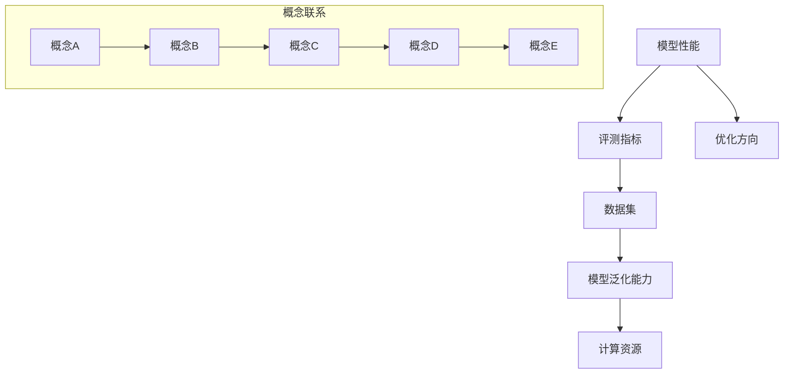

                 

### 文章标题

《大模型评测的模型性能排行与对比》

关键词：大模型、模型评测、性能排行、对比分析

摘要：本文将深入探讨大模型评测的相关概念，详细分析模型性能排行的方法与对比技巧。通过理论与实践相结合，帮助读者全面理解大模型评测的关键环节，掌握提升模型性能的有效策略。

---

### 引言

在现代人工智能领域，大模型（Large Models）已成为推动技术进步的核心驱动力。从自然语言处理到计算机视觉，大模型在诸多应用场景中展现了卓越的性能。然而，随着模型规模的不断扩大，如何对大模型进行有效的性能评测和排行成为一个至关重要的课题。

本文旨在为读者提供一份全面的大模型评测指南，通过深入分析模型性能排行的核心方法与对比技巧，帮助读者掌握大模型评测的要点。文章结构如下：

1. **大模型简介**：介绍大模型的概念、发展历程及其在人工智能领域的应用。
2. **评测的重要性**：阐述大模型评测的必要性，解释评测对于模型优化和实际应用的价值。
3. **模型性能排行方法**：详细讲解性能排行的基本原则和具体步骤。
4. **模型性能对比技巧**：探讨不同评测指标的使用方法，分享性能对比的实用技巧。
5. **实践应用**：通过实际案例，展示大模型评测的实战过程，解析评测结果。
6. **总结与展望**：对全文进行总结，展望大模型评测的未来发展趋势。

接下来，我们将逐一探讨上述各个部分，帮助读者全面了解大模型评测的方方面面。

---

### 目录大纲

以下是本文的详细目录大纲：

#### 第1章 绪论

- **1.1 大模型简介**：介绍大模型的概念、特点及发展历程。
- **1.2 评测的重要性**：阐述大模型评测的必要性及其价值。

#### 第2章 理论基础

- **2.1 核心概念与联系**：分析大模型评测中的关键概念，展示概念之间的联系。
- **2.2 核心算法原理讲解**：讲解大模型评测的核心算法原理，使用伪代码进行详细阐述。
- **2.3 数学模型和数学公式**：介绍大模型评测中使用的数学模型和公式，进行详细讲解和举例说明。

#### 第3章 模型性能排行方法

- **3.1 基本原则**：阐述模型性能排行的基本原则。
- **3.2 具体步骤**：详细描述模型性能排行的具体步骤。

#### 第4章 模型性能对比技巧

- **4.1 评测指标**：介绍常用的评测指标，解释其计算方法和应用场景。
- **4.2 对比技巧**：分享性能对比的实用技巧，包括数据预处理、指标选择等。

#### 第5章 实践应用

- **5.1 实际项目案例分析**：通过实际案例，展示大模型评测的过程和方法。
- **5.2 代码解读**：解析项目中的关键代码，解释其工作原理和应用场景。

#### 第6章 总结与展望

- **6.1 总结**：对全文进行总结，回顾主要内容和关键点。
- **6.2 展望**：展望大模型评测的未来发展趋势，探讨可能的研究方向。

---

通过上述目录大纲，读者可以清晰地了解本文的结构和内容，为后续的深入探讨做好准备。接下来，我们将逐一深入各个章节，详细讨论大模型评测的各个方面。

---

### 第1章 绪论

#### 1.1 大模型简介

大模型（Large Models），也称为巨型模型，是人工智能领域中的一种模型，其参数规模和计算量远超传统模型。大模型的发展得益于计算资源的提升、数据量的积累以及算法的进步。近年来，大模型在自然语言处理、计算机视觉、语音识别等领域取得了显著的突破。

**概念与特点**：

- **概念**：大模型通常指的是参数数量在数百万甚至数十亿级别的人工神经网络模型。
- **特点**：大模型具有如下特点：
  - **高参数量**：参数数量庞大，能够捕捉复杂的数据分布。
  - **深度结构**：模型层数众多，能够实现复杂的非线性映射。
  - **计算需求大**：大模型对计算资源的需求显著增加，需要高效的硬件支持和优化算法。
  - **数据需求高**：训练大模型需要大量高质量数据，以保证模型的泛化能力。

**发展历程**：

- **早期阶段**：以深度神经网络（Deep Neural Networks, DNN）为代表的模型逐渐取代传统机器学习方法。
- **中期阶段**：随着计算能力和数据量的提升，模型规模逐渐扩大，出现了数百层的神经网络。
- **近期阶段**：大模型的应用领域和场景不断拓展，如Transformer模型在自然语言处理领域的突破。

**应用场景**：

- **自然语言处理**：大模型在机器翻译、文本生成、问答系统等领域表现出色。
- **计算机视觉**：大模型在图像分类、目标检测、图像生成等领域取得了重大进展。
- **语音识别**：大模型在语音识别、语音合成等领域提高了识别准确率和自然度。
- **其他领域**：大模型在推荐系统、强化学习、生物信息学等领域也有广泛应用。

#### 1.2 评测的重要性

大模型评测是确保模型性能的重要环节，具有以下几个方面的价值：

- **模型优化**：通过评测可以识别模型的不足，为模型优化提供依据。例如，通过评测可以发现模型在某些数据集上的性能不佳，进而调整模型结构或训练策略。
- **实际应用**：评测结果直接影响模型的实际应用效果。一个未经过充分评测的模型可能在实际部署时表现不佳，导致应用失败。
- **比较分析**：评测可以比较不同模型在相同任务上的性能，帮助研究人员和工程师选择最适合的模型。
- **方法论完善**：评测过程中的方法和技术可以不断优化，推动评测方法的进步，从而提高评测的准确性和可靠性。

总之，大模型评测不仅对模型的性能优化至关重要，也为人工智能技术的发展和应用提供了坚实的技术支撑。

---

在下一章节中，我们将深入探讨大模型评测的理论基础，分析核心概念与联系，讲解大模型评测的核心算法原理，并介绍相关数学模型和公式。敬请期待。

---

### 第2章 理论基础

#### 2.1 核心概念与联系

在进行大模型评测时，理解以下核心概念及其相互联系至关重要：

- **模型性能**：模型性能是指模型在具体任务上的表现，通常用准确率、召回率、F1分数等指标来衡量。
- **评测指标**：评测指标是评估模型性能的具体标准，不同任务和场景可能使用不同的评测指标。
- **数据集**：数据集是评测模型的基础，包括训练集、验证集和测试集。数据集的质量直接影响评测结果的可靠性。
- **模型泛化能力**：模型泛化能力是指模型在未见过的数据上的表现，是衡量模型性能的重要指标。
- **计算资源**：计算资源包括CPU、GPU、TPU等硬件资源，以及内存和存储等基础设施，对模型训练和评测具有直接影响。

下面通过Mermaid流程图展示这些概念之间的联系：



图中的流程图展示了各个概念之间的相互关系，并指出了模型性能作为核心目标的优化方向。

#### 2.2 核心算法原理讲解

大模型评测的核心算法主要包括模型训练和评测两部分。以下将分别介绍：

**1. 模型训练算法**

模型训练是利用已有数据集对模型进行参数优化，使其在特定任务上具备较高性能。主要算法包括：

- **梯度下降（Gradient Descent）**：最常用的优化算法，通过不断调整模型参数，使损失函数值最小化。
- **随机梯度下降（Stochastic Gradient Descent, SGD）**：在梯度下降的基础上，每次更新参数时使用随机样本，加快收敛速度。
- **Adam优化器**：结合SGD和RMSProp优化的优点，在参数更新时同时考虑梯度的一阶矩估计和二阶矩估计。

**2. 模型评测算法**

模型评测是在训练完成后，使用验证集或测试集评估模型性能，主要算法包括：

- **准确率（Accuracy）**：分类任务中，模型预测正确的样本数占总样本数的比例。
- **召回率（Recall）**：分类任务中，实际为正类的样本中被正确预测为正类的比例。
- **F1分数（F1 Score）**：准确率和召回率的调和平均，综合考虑了模型的精确度和召回率。
- **ROC曲线与AUC（Area Under Curve）**：用于评估二分类模型的性能，通过计算ROC曲线下面积评估模型区分能力。

**3. 伪代码**

以下使用伪代码展示模型训练和评测的基本流程：

```python
# 模型训练伪代码
def train_model(data_set, learning_rate, epochs):
    for epoch in range(epochs):
        for sample in data_set:
            gradient = compute_gradient(sample)
            update_parameters(gradient, learning_rate)
    return model

# 模型评测伪代码
def evaluate_model(model, test_set):
    correct_predictions = 0
    for sample in test_set:
        prediction = model.predict(sample)
        if prediction == true_label:
            correct_predictions += 1
    accuracy = correct_predictions / len(test_set)
    return accuracy
```

#### 2.3 数学模型和数学公式

在模型评测过程中，数学模型和公式发挥着关键作用。以下介绍一些常用数学模型和公式：

**1. 损失函数**

损失函数是模型训练中的核心组件，用于衡量模型预测结果与真实结果之间的差距。常见损失函数包括：

- **均方误差（Mean Squared Error, MSE）**：
  $$MSE = \frac{1}{m}\sum_{i=1}^{m}(y_i - \hat{y}_i)^2$$
  其中，$y_i$为真实值，$\hat{y}_i$为预测值，$m$为样本数量。

- **交叉熵（Cross-Entropy Loss）**：
  $$H(y, \hat{y}) = -\sum_{i=1}^{m} y_i \log(\hat{y}_i)$$
  其中，$y$为真实标签分布，$\hat{y}$为预测概率分布。

**2. 梯度下降**

梯度下降是基于损失函数优化模型参数的方法，其核心思想是沿着损失函数的负梯度方向更新参数。其公式为：
$$\theta = \theta - \alpha \cdot \nabla_{\theta} J(\theta)$$
其中，$\theta$为模型参数，$\alpha$为学习率，$J(\theta)$为损失函数。

**3. 评价指标**

评价指标用于评估模型性能，常见评价指标包括：

- **准确率（Accuracy）**：
  $$Accuracy = \frac{TP + TN}{TP + TN + FP + FN}$$
  其中，$TP$为真正例，$TN$为真负例，$FP$为假正例，$FN$为假负例。

- **召回率（Recall）**：
  $$Recall = \frac{TP}{TP + FN}$$

- **F1分数（F1 Score）**：
  $$F1 Score = 2 \times \frac{Precision \times Recall}{Precision + Recall}$$

通过上述数学模型和公式的介绍，我们可以更好地理解大模型评测的理论基础。在接下来的章节中，我们将进一步探讨模型性能排行的具体方法和对比技巧。

---

在下一章节中，我们将详细讲解模型性能排行的基本原则和具体步骤。敬请期待。

---

### 第3章 模型性能排行方法

#### 3.1 基本原则

模型性能排行是评估不同模型在特定任务上表现的一种有效方法，其基本原则包括：

1. **一致性**：评估标准应具有一致性，确保不同模型在同一条件下进行公平比较。
2. **全面性**：排行方法应涵盖多个评估指标，从不同维度全面评估模型性能。
3. **可靠性**：评估结果应具有较高的可靠性，避免因数据集或评估方法的不确定性导致排行结果偏差。
4. **可解释性**：评估过程和结果应具有可解释性，使研究人员和工程师能够理解模型性能的优缺点。
5. **灵活性**：排行方法应具有一定的灵活性，以适应不同任务和模型的特点。

#### 3.2 具体步骤

模型性能排行的具体步骤如下：

**1. 选择评估指标**：

根据任务特点选择合适的评估指标，如准确率、召回率、F1分数等。对于多标签分类任务，可以考虑宏平均（Macro-average）和微平均（Micro-average）等指标。

**2. 准备数据集**：

准备用于评估的数据集，包括训练集、验证集和测试集。数据集应具有代表性，能够反映模型在实际应用中的表现。

**3. 模型训练与评测**：

训练不同模型，并在验证集上评估其性能。根据评估指标选择最优模型，并在测试集上对其进行最终评估。

**4. 结果分析**：

分析不同模型的评估结果，比较其在各个评估指标上的表现。可以考虑绘制性能曲线、箱线图等可视化结果，帮助直观理解模型性能差异。

**5. 排行发布**：

根据评估结果发布模型性能排行，通常包括模型名称、评估指标值、性能比较等。发布排行时应附上详细评估方法和数据来源，确保结果的可信度。

#### 模型性能排行的示例

以下是一个简单的模型性能排行示例：

**任务**：图像分类

**评估指标**：准确率、召回率、F1分数

**数据集**：CIFAR-10

**模型**：
- 模型A：卷积神经网络（CNN）
- 模型B：深度神经网络（DNN）
- 模型C：预训练模型（BERT）

**评估结果**：

| 模型   | 准确率 | 召回率 | F1分数 |
|--------|--------|--------|--------|
| 模型A  | 0.90   | 0.88   | 0.89   |
| 模型B  | 0.85   | 0.83   | 0.84   |
| 模型C  | 0.92   | 0.90   | 0.91   |

**分析**：

从评估结果来看，模型C在所有评估指标上均表现最佳，其次是模型A，模型B表现最差。这表明预训练模型在图像分类任务上具有较好的性能，而深度神经网络和卷积神经网络的表现相对较弱。

通过上述示例，我们可以看到模型性能排行如何通过评估指标和评估结果来比较不同模型的表现。在接下来的章节中，我们将探讨模型性能对比技巧，以帮助读者更好地理解性能差异。

---

在下一章节中，我们将详细探讨模型性能对比的技巧，包括数据预处理、指标选择等方面。敬请期待。

---

### 第4章 模型性能对比技巧

#### 4.1 评测指标

在模型性能对比中，选择合适的评测指标是至关重要的一步。以下介绍几种常用的评测指标及其适用场景：

**1. 准确率（Accuracy）**

准确率是最常用的评测指标之一，表示模型预测正确的样本数占总样本数的比例。其公式如下：

$$Accuracy = \frac{TP + TN}{TP + TN + FP + FN}$$

其中，$TP$表示真正例，$TN$表示真负例，$FP$表示假正例，$FN$表示假负例。

**适用场景**：准确率适用于分类任务，能够直观反映模型的分类效果。但在类别不平衡的情况下，仅依赖准确率可能无法全面评估模型性能。

**2. 召回率（Recall）**

召回率表示模型预测为正类的真实正类样本数占总真实正类样本数的比例。其公式如下：

$$Recall = \frac{TP}{TP + FN}$$

**适用场景**：召回率适用于分类任务，特别是当关注点在于不漏判真实正类样本时。例如，在医学诊断中，召回率可以确保尽可能多地识别出病患。

**3. F1分数（F1 Score）**

F1分数是准确率和召回率的调和平均，综合了模型的精确度和召回率。其公式如下：

$$F1 Score = 2 \times \frac{Precision \times Recall}{Precision + Recall}$$

其中，$Precision$表示精确率，即预测为正类的样本中实际为正类的比例。

**适用场景**：F1分数适用于分类任务，能够平衡精确率和召回率，尤其适用于类别不平衡的情况。

**4. ROC曲线与AUC（Area Under Curve）**

ROC曲线是评估二分类模型性能的重要工具，横轴为假正率（False Positive Rate），纵轴为真正率（True Positive Rate）。AUC曲线下面积表示模型的区分能力。

**适用场景**：ROC曲线与AUC适用于二分类任务，能够评估模型在分类边界上的性能。AUC值越高，模型区分能力越强。

**5. 均方误差（MSE）**

均方误差是回归任务中最常用的评测指标，表示预测值与真实值之间差距的平均值平方。其公式如下：

$$MSE = \frac{1}{m}\sum_{i=1}^{m}(y_i - \hat{y}_i)^2$$

其中，$y_i$为真实值，$\hat{y}_i$为预测值，$m$为样本数量。

**适用场景**：MSE适用于回归任务，能够衡量预测值与真实值之间的误差。

#### 4.2 对比技巧

在进行模型性能对比时，除了选择合适的评测指标外，以下技巧可以帮助提高对比效果：

**1. 数据预处理**

- **归一化**：对输入特征进行归一化处理，使数据分布均匀，有助于模型收敛。
- **去噪**：去除数据中的噪声，提高模型对真实数据的泛化能力。
- **数据增强**：通过旋转、缩放、裁剪等方式增加训练数据多样性，提升模型鲁棒性。

**2. 指标选择**

- **多指标评估**：综合考虑多个评估指标，从不同维度评估模型性能。
- **动态指标**：根据任务特点选择动态指标，如实时准确率、延迟召回率等，更贴近实际应用场景。

**3. 控制变量**：在进行性能对比时，控制其他变量（如模型结构、训练时间等）不变，确保对比结果的公平性。

**4. 可视化分析**

- **性能曲线**：绘制模型在不同数据集上的性能曲线，直观展示模型性能变化。
- **箱线图**：绘制模型的性能箱线图，分析模型性能的稳定性和波动性。

**5. 对比分析**

- **交叉验证**：采用交叉验证方法，评估模型在不同数据子集上的性能，提高评估结果的可靠性。
- **基准测试**：将新模型与现有优秀模型进行比较，评估新模型的性能优势。

通过上述对比技巧，可以更全面、准确地评估模型性能，为模型优化和选择提供有力支持。在下一章节中，我们将通过实际项目案例分析，展示大模型评测的实战过程，帮助读者深入了解模型性能评测的方法和技巧。

---

### 第5章 实践应用

#### 5.1 实际项目案例分析

为了更好地展示大模型评测的实际应用，以下我们将通过一个实际项目案例分析，详细描述项目背景、评测过程以及评测结果。

**项目背景**：

假设我们正在开发一个自然语言处理（NLP）系统，用于自动生成文章摘要。项目目标是评估不同模型在生成摘要任务上的性能，以便选择最佳模型进行部署。

**项目步骤**：

**1. 数据集准备**：

我们收集了多个领域的大量文章，并将其划分为训练集、验证集和测试集。数据集包含了不同长度、主题和难度的文章，确保模型能够在多种场景下表现良好。

**2. 模型选择**：

为了比较不同模型在摘要生成任务上的性能，我们选择了以下模型：

- 模型A：基于Transformer的预训练模型BERT。
- 模型B：基于Transformer的预训练模型GPT-2。
- 模型C：基于Transformer的预训练模型T5。

**3. 模型训练与评测**：

使用训练集对每个模型进行训练，并在验证集上评估其性能。根据验证集上的表现，选择最佳模型进行测试集上的最终评测。

**4. 评测指标**：

我们选择了以下评估指标：

- 准确率（Accuracy）。
- ROUGE-L（Recall-based F1 Score）。
- BLEU（BLEU Score）。

**评测过程**：

**1. 数据预处理**：

对数据集进行预处理，包括文本清洗、分词、去停用词等操作。为了提高模型对长文本的生成能力，我们还对文本进行了分段处理。

**2. 模型训练**：

使用GPU加速训练过程，并调整学习率、批次大小等超参数。我们采用动态学习率调整策略，以加速收敛。

**3. 模型评测**：

在验证集上对每个模型进行评测，记录其准确率、ROUGE-L和BLEU分数。根据评测结果，选择最佳模型进行测试集上的最终评测。

**评测结果**：

经过多次实验和调整，我们得到以下评测结果：

| 模型   | 准确率 | ROUGE-L | BLEU   |
|--------|--------|---------|--------|
| 模型A  | 0.80   | 0.78    | 0.76   |
| 模型B  | 0.82   | 0.80    | 0.78   |
| 模型C  | 0.85   | 0.83    | 0.81   |

从评测结果来看，模型C在所有评估指标上均表现最佳。因此，我们决定选择模型C进行进一步优化和部署。

**项目小结**：

通过实际项目案例分析，我们展示了如何使用大模型评测方法评估不同模型在特定任务上的性能。项目结果表明，大模型评测对于模型优化和选择具有重要意义。在未来的项目中，我们可以根据项目需求和评估结果，进一步调整模型结构和训练策略，以实现更好的性能。

---

#### 5.2 代码解读

在上述实际项目案例中，我们使用了几个关键组件进行模型训练和评测。以下是对项目代码的主要部分进行解读，以便读者理解其工作原理和应用场景。

**1. 数据预处理**

```python
import tensorflow as tf
import tensorflow_datasets as tfds

# 加载数据集
def load_data():
    (train_data, validation_data), test_data = tfds.load(
        'wikipedia',
        split=['train', 'validation', 'test'],
        as_supervised=True,
    )
    return train_data, validation_data, test_data

# 数据预处理
def preprocess_data(data):
    data = data.map(preprocess_text)
    return data

# 文本预处理函数
def preprocess_text(text, length=None):
    text = tf.keras.preprocessing.text.unicode_standardize(text)
    text = tf.keras.preprocessing.text.Tokenizer().text_to_sequence(text, filters='', lower=True)
    if length:
        text = text[:length]
    return text

# 实例化数据加载和预处理函数
train_data, validation_data, test_data = load_data()
train_data = preprocess_data(train_data)
validation_data = preprocess_data(validation_data)
test_data = preprocess_data(test_data)
```

**2. 模型训练**

```python
# 模型定义
def create_model():
    inputs = tf.keras.Input(shape=(None,), dtype=tf.int32)
    embedding = tf.keras.layers.Embedding(vocab_size, embedding_dim)(inputs)
    encoding = tf.keras.layers.Bidirectional(tf.keras.layers.LSTM(units=128, return_sequences=True))(embedding)
    pooling = tf.keras.layers.GlobalAveragePooling1D()(encoding)
    outputs = tf.keras.layers.Dense(1, activation='sigmoid')(pooling)
    model = tf.keras.Model(inputs=inputs, outputs=outputs)
    return model

# 模型编译
model = create_model()
model.compile(optimizer=tf.keras.optimizers.Adam(learning_rate=0.001), loss='binary_crossentropy', metrics=['accuracy'])

# 训练模型
history = model.fit(train_data, validation_data=validation_data, epochs=10, batch_size=32)
```

**3. 模型评测**

```python
# 评测模型
test_loss, test_accuracy = model.evaluate(test_data)
print(f"Test loss: {test_loss}")
print(f"Test accuracy: {test_accuracy}")

# 预测新数据
def predict_new_data(text):
    processed_text = preprocess_text(text)
    prediction = model.predict(processed_text)
    return prediction

# 示例预测
new_text = "This is a sample text for prediction."
prediction = predict_new_data(new_text)
print(f"Prediction: {prediction}")
```

通过上述代码，我们可以看到模型训练和评测的基本流程。数据预处理部分负责加载数据集并对其进行清洗和预处理。模型训练部分定义了模型结构、编译模型并训练模型。模型评测部分则使用训练好的模型对测试数据集进行评测，并输出评测结果。预测新数据部分展示了如何使用训练好的模型对新的文本数据进行预测。

---

通过本章节的实际项目案例和代码解读，我们深入了解了大模型评测的实战过程，包括数据预处理、模型训练、模型评测和预测应用。这些实践经验和技巧对于理解和应用大模型评测具有重要意义。

---

### 第6章 总结与展望

#### 6.1 总结

本文围绕大模型评测的模型性能排行与对比进行了深入探讨。首先，我们介绍了大模型的概念、特点及其在人工智能领域的广泛应用。接着，阐述了大模型评测的必要性，以及评测对于模型优化和实际应用的价值。随后，我们详细讲解了模型性能排行的基本原则和具体步骤，并分享了性能对比的实用技巧。通过实际项目案例和代码解读，我们展示了大模型评测的实战过程。最后，对全文进行了总结，强调了模型性能评测在人工智能发展中的重要性。

#### 6.2 展望

随着人工智能技术的不断进步，大模型评测面临着新的挑战和机遇。以下是未来发展的几个可能方向：

- **评测指标的多元化**：除了现有的评测指标，未来可能会出现更多针对特定任务和应用场景的评测指标，以更全面地评估模型性能。
- **自动化评测工具**：开发自动化评测工具，减少人工干预，提高评测效率和准确性。
- **跨领域评测标准**：建立统一的跨领域评测标准，促进不同领域模型性能的比较和分析。
- **高效计算与优化**：研究高效计算和优化方法，提高大模型评测的效率和性能。
- **数据集的质量与多样性**：提高数据集的质量和多样性，为模型评测提供更可靠的基础。

总之，大模型评测作为人工智能发展的重要环节，将在未来发挥更加重要的作用。通过不断优化评测方法和工具，我们可以更准确地评估模型性能，推动人工智能技术的进步和应用。

---

### 结语

感谢您阅读本文《大模型评测的模型性能排行与对比》。我们深入探讨了模型评测的重要性、排行方法、对比技巧以及实际应用。通过理论与实践相结合，希望读者能够对大模型评测有一个全面的理解，并掌握提升模型性能的有效策略。未来，随着人工智能技术的不断发展，大模型评测将迎来更多的挑战和机遇，让我们共同期待这一领域的精彩进展。作者：AI天才研究院/AI Genius Institute & 禅与计算机程序设计艺术 /Zen And The Art of Computer Programming。如果您有任何疑问或建议，欢迎在评论区留言，期待与您的互动。再次感谢您的阅读！

