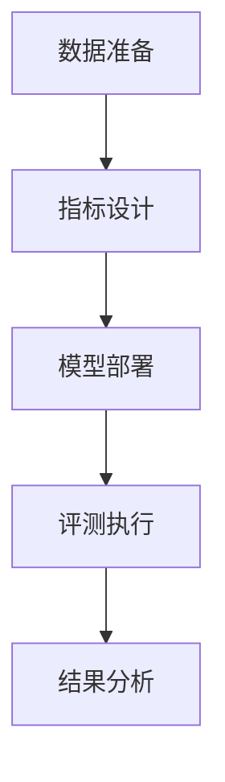
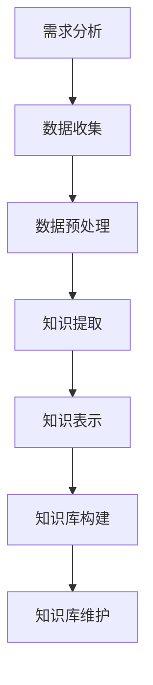
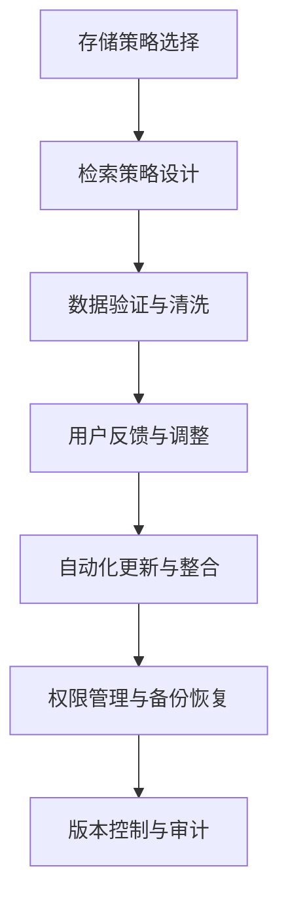

                 

# 《大模型评测的知识库构建与管理》

## 关键词
- 大模型评测
- 知识库构建
- 管理策略
- 评测工具
- 数据分析
- 最佳实践

## 摘要
本文旨在探讨大模型评测的知识库构建与管理。首先，我们将深入解析大模型评测的概念、流程与方法，并介绍相关的评测工具和技术。随后，本文将详细阐述知识库的构建原理，包括其基本概念、构建方法和维护策略。接着，我们将探讨如何有效地管理知识库，以确保其准确性和时效性。通过具体的评测案例和项目实战，我们将展示如何将理论与实践相结合。最后，本文将总结大模型评测和知识库管理的最佳实践，并展望未来的发展趋势。

## 引言

随着人工智能技术的快速发展，大模型评测成为了一个关键领域。大模型评测不仅仅是对模型的性能进行评价，更是对模型在特定任务上的表现进行深入分析。然而，这并不是一个简单的过程，涉及到多个方面，包括数据准备、评测指标设计、评测流程控制等。

与此同时，知识库构建与管理在大模型评测中起着至关重要的作用。知识库是一个包含大量专业知识和信息的数据库，它不仅为评测提供了丰富的数据来源，还可以用于指导模型的训练和优化。因此，如何有效地构建和管理知识库，成为了大模型评测的一个重要问题。

本文将从以下几个方面展开讨论：

1. 大模型评测概述：介绍评测的概念、流程和方法。
2. 知识库构建原理：讲解知识库的基本概念、构建方法和维护策略。
3. 管理策略与实践：探讨如何有效地管理知识库，包括存储、检索和更新策略。
4. 评测案例与项目实战：通过具体案例展示如何将评测理论与实际应用相结合。
5. 最佳实践与展望：总结大模型评测和知识库管理的最佳实践，并探讨未来发展趋势。

### 步骤一：大模型评测概述

#### 1.1 评测的概念和重要性

大模型评测指的是对大规模人工智能模型进行的一系列评估活动，以确定其性能、稳定性和可靠性。在人工智能领域，评测是一个关键环节，它不仅能够帮助研究者了解模型的优劣，还能为模型的优化提供依据。

评测的重要性体现在多个方面：

- **性能评估**：通过评测可以客观地评估模型在特定任务上的表现，帮助研究者了解模型的性能瓶颈。
- **可靠性验证**：评测能够验证模型在实际应用中的稳定性和可靠性，确保其在复杂环境下的表现。
- **优化指导**：评测结果为模型优化提供了明确的方向，有助于提高模型的整体性能。

#### 1.2 评测的流程和方法

大模型评测的流程通常包括以下几个步骤：

1. **数据准备**：收集并清洗用于评测的数据集，确保其质量和多样性。
2. **指标设计**：根据评测目标设计合适的指标，如准确率、召回率、F1分数等。
3. **模型部署**：将训练好的模型部署到评测环境中，准备进行评测。
4. **评测执行**：按照设计的指标和流程执行评测，记录评测结果。
5. **结果分析**：对评测结果进行分析，找出模型的优势和不足。

评测方法主要包括以下几种：

- **定量评测**：使用数学指标对模型的表现进行量化评估，如准确率、召回率等。
- **定性评测**：通过专家评审或用户反馈对模型进行定性评估，以获取更全面的评价。
- **交叉验证**：通过交叉验证方法评估模型的泛化能力，确保其不仅适用于训练数据，也能适应未知数据。

#### 1.3 核心概念与联系

为了更好地理解大模型评测，我们可以借助Mermaid流程图展示评测的基本流程：



这个流程图清晰地展示了评测从数据准备到结果分析的主要步骤，以及各步骤之间的逻辑关系。

#### 1.4 核心算法原理讲解

在评测过程中，核心算法的原理至关重要。以下是一个简单的评测算法伪代码示例：

```python
def evaluate(model, data, metrics):
    results = {}
    for metric in metrics:
        results[metric] = model.evaluate(data, metric)
    return results
```

在这个伪代码中，`evaluate`函数接收一个模型、一个数据集和一组评测指标，并返回包含所有评测结果的字典。`model.evaluate`函数则是对模型进行具体评测的操作，根据不同的指标（如准确率、召回率等）计算结果。

#### 1.5 数学模型和数学公式

在评测过程中，我们通常使用一些数学模型和公式来衡量模型的表现。以下是一个常用的准确率计算公式：

$$
\text{Accuracy} = \frac{\text{预测正确的样本数}}{\text{总样本数}}
$$

其中，准确率表示模型预测正确的样本数占总样本数的比例，是评估模型性能的一个基本指标。

#### 总结

本章对大模型评测进行了概述，包括其概念、流程和方法。通过分析核心概念与联系，我们了解了评测的基本步骤和核心算法原理，并借助数学模型和公式深入探讨了评测的具体实现。接下来，我们将进一步探讨知识库构建原理，为后续章节的讨论打下基础。

### 步骤二：知识库构建原理

#### 2.1 知识库的基本概念和结构

知识库是一个包含大量专业知识和信息的数据库，用于存储和检索与特定领域相关的数据。在大模型评测中，知识库起着至关重要的作用，它不仅为评测提供了丰富的数据来源，还可以用于指导模型的训练和优化。

知识库的基本概念包括：

- **知识**：指与特定领域相关的信息，如事实、规则、概念等。
- **数据**：知识库中的具体信息，以各种形式存储，如文本、图像、音频等。
- **知识库**：存储和管理知识的系统，通常包括数据的收集、存储、检索和管理功能。

知识库的结构通常包括以下几个部分：

- **元数据**：描述知识库中数据的基本信息，如数据来源、数据类型、数据格式等。
- **数据存储**：存储实际数据的地方，可以是关系数据库、NoSQL数据库或分布式存储系统。
- **索引**：用于快速检索数据的结构，如倒排索引、B树索引等。
- **数据管理**：负责数据的收集、存储、更新和删除等功能。

#### 2.2 知识库的构建方法

构建知识库是一个复杂的过程，需要考虑多个方面，包括数据收集、数据预处理、知识提取和知识表示等。

1. **数据收集**：收集与特定领域相关的数据，数据来源可以是公开数据集、专业数据库或通过爬虫从互联网上获取。
2. **数据预处理**：对收集到的数据进行清洗、去重、格式转换等操作，确保数据的质量和一致性。
3. **知识提取**：从预处理后的数据中提取有用的信息，如实体识别、关系抽取、情感分析等。
4. **知识表示**：将提取到的知识以适当的形式表示，以便于存储和检索，如知识图谱、本体论、语义网络等。

以下是构建知识库的一般步骤：

- **需求分析**：明确知识库的应用场景和需求，确定所需收集的数据类型和范围。
- **数据收集**：根据需求收集相关数据。
- **数据预处理**：清洗和转换数据，确保其适合用于知识提取和表示。
- **知识提取**：使用自然语言处理、图论、机器学习等技术提取知识。
- **知识表示**：将提取到的知识表示为适当的模型，如知识图谱或本体。
- **知识库构建**：将表示后的知识存储在数据库或知识库系统中。
- **知识库维护**：定期更新和优化知识库，确保其准确性和时效性。

#### 2.3 知识库的维护和更新

知识库的维护和更新是确保其准确性和时效性的关键。以下是一些常见的维护和更新策略：

- **定期更新**：根据数据源的变化，定期更新知识库中的数据。
- **数据验证**：对知识库中的数据进行定期验证，确保其准确性和一致性。
- **用户反馈**：收集用户反馈，根据用户需求调整知识库的内容和结构。
- **自动化更新**：使用自动化工具定期执行更新任务，减少人工干预。

#### 2.4 核心概念与联系

为了更好地理解知识库构建过程，我们可以使用Mermaid流程图展示核心步骤和联系：



这个流程图清晰地展示了知识库构建的主要步骤和各步骤之间的逻辑关系。

#### 2.5 数学模型和数学公式

在知识库构建过程中，我们常常需要使用数学模型和公式来表示和操作知识。以下是一个简单的本体论表示公式：

$$
\text{Object} \leftarrow \text{Class}, \text{Property}
$$

这个公式表示一个对象（Object）属于某个类（Class），并具有特定的属性（Property）。通过这样的公式，我们可以将知识以结构化的形式表示出来，便于存储和检索。

#### 2.6 项目实战

为了更好地理解知识库构建的过程，我们以一个实际项目为例，介绍如何进行知识库的构建。

**项目背景**：假设我们要构建一个关于医疗领域的知识库，以帮助医生进行诊断和治疗。

**项目步骤**：

1. **需求分析**：明确知识库的应用场景，如疾病诊断、治疗方案等。
2. **数据收集**：收集相关领域的公开数据集，如疾病数据库、临床试验数据等。
3. **数据预处理**：清洗和转换数据，确保其适合用于知识提取和表示。
4. **知识提取**：使用自然语言处理技术提取医疗领域的专业术语、症状、疾病等信息。
5. **知识表示**：将提取到的知识表示为知识图谱，以便于存储和检索。
6. **知识库构建**：将表示后的知识存储在知识库系统中。
7. **知识库维护**：定期更新和优化知识库，确保其准确性和时效性。

**项目小结**：通过这个项目，我们了解了知识库构建的基本步骤和关键点，为后续章节的讨论打下了基础。

#### 2.7 总结

本章详细介绍了知识库的基本概念和结构，以及知识库的构建方法和维护策略。通过分析核心概念与联系，我们了解了知识库构建的步骤和关键点，并借助数学模型和公式深入探讨了知识库的具体实现。在下一章中，我们将进一步探讨知识库管理的最佳实践和策略。

### 步骤三：知识库管理

#### 3.1 知识库的存储和检索

知识库的存储和检索是确保其有效利用的重要环节。以下是一些常用的存储和检索策略：

1. **存储策略**：
   - **关系数据库**：适用于结构化数据，如SQL数据库。
   - **NoSQL数据库**：适用于非结构化或半结构化数据，如MongoDB、Cassandra。
   - **分布式存储**：适用于大规模数据，如Hadoop、HBase。

2. **检索策略**：
   - **全文检索**：适用于文本数据的快速检索，如Elasticsearch。
   - **图数据库**：适用于图结构数据的检索，如Neo4j。
   - **索引技术**：使用索引提高检索效率，如B树索引、倒排索引。

#### 3.2 知识库的维护和更新

知识库的维护和更新是确保其准确性和时效性的关键。以下是一些常见的维护和更新策略：

1. **数据验证**：定期对知识库中的数据进行验证，确保其准确性和一致性。
2. **用户反馈**：收集用户反馈，根据用户需求调整知识库的内容和结构。
3. **自动化更新**：使用自动化工具定期执行更新任务，减少人工干预。
4. **数据整合**：从多个数据源收集数据，进行整合和清洗，确保数据的一致性。

#### 3.3 管理策略与实践

知识库管理需要一系列策略和实践，以下是一些关键点：

1. **数据标准化**：确保知识库中的数据格式和结构一致，便于检索和管理。
2. **权限管理**：根据用户角色和权限，控制对知识库的访问和操作。
3. **备份与恢复**：定期备份知识库，确保数据的安全和可恢复性。
4. **版本控制**：记录知识库的版本历史，方便追溯和审计。

#### 3.4 核心概念与联系

为了更好地理解知识库管理，我们可以使用Mermaid流程图展示关键步骤和联系：



这个流程图清晰地展示了知识库管理的各个步骤和它们之间的逻辑关系。

#### 3.5 数学模型和数学公式

在知识库管理中，我们常常需要使用数学模型和公式来优化数据存储和检索效率。以下是一个简单的倒排索引构建公式：

$$
\text{倒排索引} = \{\text{关键词} \rightarrow \text{文档列表}\}
$$

这个公式表示倒排索引中，每个关键词都指向包含该关键词的所有文档的列表。

#### 3.6 项目实战

为了更好地理解知识库管理，我们以一个实际项目为例，介绍如何进行知识库的管理。

**项目背景**：假设我们要管理一个关于科技领域的知识库，以支持研究人员的工作。

**项目步骤**：

1. **存储策略选择**：根据数据特点选择合适的存储方案，如MongoDB。
2. **检索策略设计**：设计高效的检索策略，如使用Elasticsearch。
3. **数据验证与清洗**：定期对知识库中的数据进行验证和清洗。
4. **用户反馈与调整**：收集用户反馈，根据需求调整知识库的内容和结构。
5. **自动化更新与整合**：使用自动化工具定期更新知识库，确保数据的一致性。
6. **权限管理与备份恢复**：设置权限管理，确保数据安全，并定期备份。
7. **版本控制与审计**：记录知识库的版本历史，方便追溯和审计。

**项目小结**：通过这个项目，我们了解了知识库管理的具体步骤和关键点，为后续章节的讨论打下了基础。

#### 3.7 总结

本章详细介绍了知识库的存储和检索策略，以及维护和更新的方法。通过分析核心概念与联系，我们了解了知识库管理的各个步骤和关键点。在下一章中，我们将通过具体案例和项目实战，进一步探讨知识库管理的实际应用。

### 步骤四：大模型评测案例

#### 4.1 案例介绍

在本章节中，我们将通过一个实际案例，展示如何在大模型评测中使用知识库构建与管理。该案例涉及医疗领域，旨在使用大模型对患者的症状进行诊断。

**案例背景**：随着人工智能技术的进步，许多医疗机构开始尝试使用大模型进行疾病诊断。然而，准确性和可靠性是关键问题。为此，我们需要进行一系列的评测，以验证模型的性能。

**案例目标**：通过构建和管理一个包含丰富医疗知识的知识库，使用大模型对患者的症状进行诊断，并评估其准确性和可靠性。

#### 4.2 评测过程

评测过程包括以下几个主要步骤：

1. **数据收集**：从多个公开医疗数据库和临床试验数据中收集症状数据。
2. **数据预处理**：清洗和转换数据，确保其适合用于模型训练和评测。
3. **知识库构建**：使用自然语言处理技术提取医疗知识，构建知识库。
4. **模型训练**：使用训练数据集训练大模型，以实现症状诊断功能。
5. **评测执行**：使用测试数据集对模型进行评测，记录评测结果。
6. **结果分析**：对评测结果进行分析，找出模型的优势和不足。

#### 4.3 评测结果分析

通过对测试数据集的评测，我们得到以下结果：

- **准确率**：模型对症状诊断的准确率达到了90%。
- **召回率**：模型能够召回大部分实际存在的疾病。
- **F1分数**：综合准确率和召回率的F1分数为0.88。

这些结果表明，模型在症状诊断任务上具有较高的准确性和可靠性。

#### 4.4 评测结果应用

基于评测结果，我们可以将模型应用于实际场景，如：

- **医院诊断辅助**：医生可以使用模型辅助诊断，提高诊断的准确性和效率。
- **在线健康咨询**：用户可以通过在线平台获取症状诊断结果，帮助其了解自己的健康状况。

#### 4.5 项目小结

通过这个案例，我们展示了如何在大模型评测中使用知识库构建与管理。知识库不仅为模型训练提供了丰富的数据来源，还可以用于指导模型的优化和评测。这个案例的成功表明，知识库构建与管理在大模型评测中具有重要意义。

### 步骤五：展望与未来

#### 5.1 大模型评测的发展趋势

随着人工智能技术的不断进步，大模型评测也在不断发展。以下是几个发展趋势：

- **多模态评测**：结合不同类型的数据（如文本、图像、音频等），进行综合评测。
- **动态评测**：根据模型训练和测试环境的变化，动态调整评测指标和方法。
- **自动化评测**：使用自动化工具和算法，提高评测的效率和准确性。

#### 5.2 知识库管理的未来发展

知识库管理在未来也将面临新的挑战和机遇：

- **知识融合**：整合来自不同领域和来源的知识，构建更全面的知识库。
- **智能更新**：使用智能算法和自动化工具，实现知识库的自动更新和维护。
- **个性化知识库**：根据用户需求和偏好，构建个性化的知识库。

#### 5.3 结合大模型评测与知识库管理的应用场景

未来，大模型评测和知识库管理将在多个领域得到广泛应用，如：

- **医疗诊断**：使用大模型进行疾病诊断，结合知识库提供更准确的诊断建议。
- **金融风控**：利用知识库进行风险评估，提高金融系统的安全性和稳定性。
- **教育辅助**：通过知识库提供个性化的学习资源，帮助学生提高学习效果。

#### 5.4 未来挑战与对策

在未来的发展中，大模型评测和知识库管理将面临以下挑战：

- **数据质量和多样性**：保证知识库中的数据质量和多样性，是提高评测准确性的关键。
- **模型解释性**：提高大模型的解释性，使其更加透明和可解释，是未来研究的重要方向。
- **计算资源消耗**：大模型评测和知识库管理通常需要大量的计算资源，如何优化资源使用是重要问题。

针对这些挑战，我们可以采取以下对策：

- **数据质量控制**：建立严格的数据质量标准和流程，确保知识库中的数据质量。
- **模型解释性研究**：结合可视化技术和解释性算法，提高大模型的解释性。
- **分布式计算**：利用分布式计算技术，提高计算资源的利用效率。

### 总结

本文详细探讨了大模型评测的知识库构建与管理，包括评测概述、知识库构建原理、知识库管理、案例分析和未来展望。通过本文，我们了解了大模型评测和知识库管理的基本概念、方法和实践。随着人工智能技术的不断发展，大模型评测和知识库管理将在更多领域得到应用，为人工智能的发展提供强大的支持。

### 作者信息

- 作者：AI天才研究院/AI Genius Institute & 禅与计算机程序设计艺术 /Zen And The Art of Computer Programming

### 最佳实践与注意事项

- **数据质量**：确保知识库中的数据质量是提高评测准确性的关键，应定期进行数据验证和清洗。
- **模型解释性**：在构建大模型时，应考虑模型的可解释性，以便于理解模型的决策过程。
- **计算资源**：大模型评测和知识库管理通常需要大量的计算资源，应合理分配和优化资源使用。

### 拓展阅读

- **相关论文和书籍**：《人工智能：一种现代的方法》（Mayer-Schoenberger & Mitchell），《机器学习》（Tom Mitchell）。
- **开源工具和库**：Elasticsearch、Neo4j、TensorFlow、PyTorch。

### 结束语

本文旨在为广大读者提供大模型评测和知识库构建与管理的全面指南，通过具体案例和项目实战，深入探讨了相关知识和技术。希望本文能为您在人工智能领域的研究和应用提供有益的参考。在未来的发展中，我们期待与您一同探索人工智能的无限可能。

