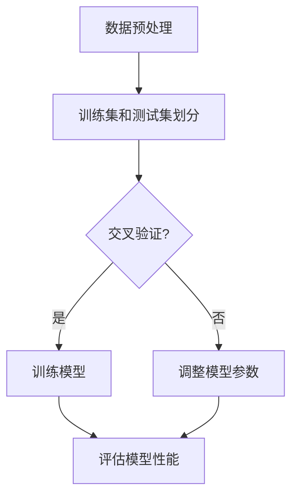
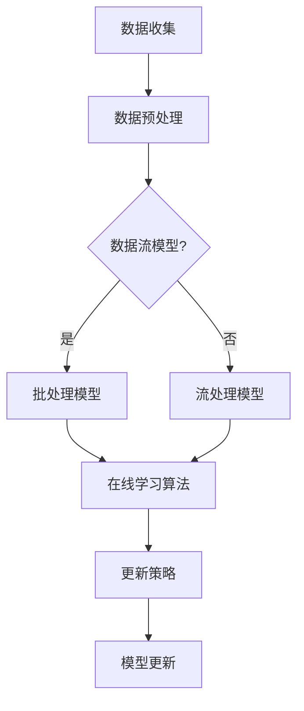
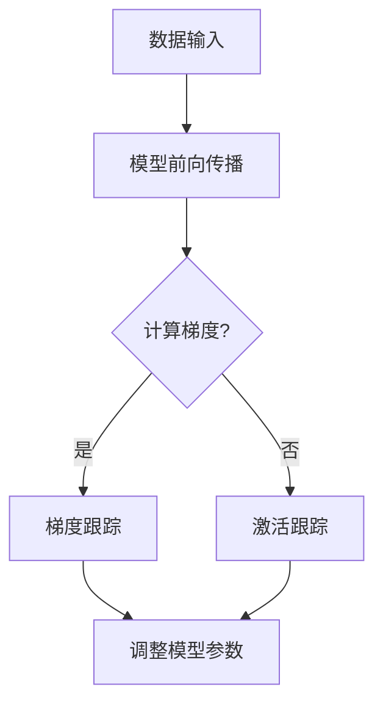
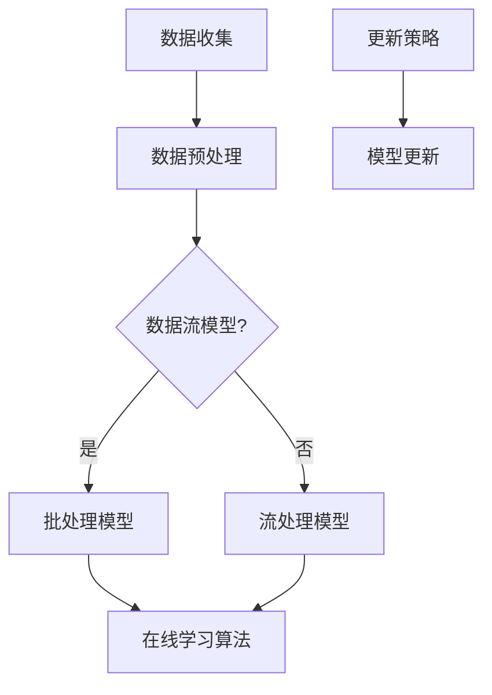

                 

### 文章标题

《大模型评测的知识更新与学习跟踪》

---

#### 关键词

大模型评测、知识更新、学习跟踪、算法原理、数学模型、项目实战

---

#### 摘要

本文旨在探讨大模型评测、知识更新与学习跟踪的核心概念、原理和实践。首先，我们介绍了大模型评测的标准、方法和工具，随后深入讨论了知识更新的机制、方法和策略。接着，我们阐述了学习跟踪的原理、方法和工具，并通过实际案例展示了这些技术在自然语言处理、金融领域和图像识别等领域的应用。最后，我们总结了全文的核心内容，并提出了未来的发展方向和挑战。

---

## 引言

在人工智能迅速发展的今天，大模型评测、知识更新与学习跟踪已成为关键的研究领域。大模型评测旨在评估模型在各个任务上的性能，以确保其准确性和可靠性。知识更新则关注模型如何随着时间推移和新数据的不断出现进行适应性调整。学习跟踪则探讨模型在学习过程中的动态调整策略，以优化其性能。

大模型评测、知识更新与学习跟踪之间有着密切的联系。评测是知识更新和学习跟踪的基础，通过评测可以发现模型的不足，从而指导知识更新和学习跟踪的进行。知识更新为模型提供了新的训练数据，从而提升了模型的泛化能力。学习跟踪则通过实时调整模型的参数，优化其在特定任务上的表现。

本文将从以下几个方面展开讨论：

1. 大模型评测：介绍评测标准、方法和工具。
2. 知识更新：探讨知识更新的机制、方法和策略。
3. 学习跟踪：阐述学习跟踪的原理、方法和工具。
4. 综合应用：通过实际案例展示大模型评测、知识更新与学习跟踪的综合应用。
5. 总结与展望：总结全文的核心内容，并展望未来的发展方向和挑战。

---

## 大模型评测

大模型评测是评估大模型性能的重要手段。一个全面的评测体系应该包括多个方面，如性能指标、评测方法和评测工具。

### 1.1 评测标准

评测标准是评测大模型性能的基础。常见的评测标准包括：

- **准确性**：评估模型在分类或回归任务上的正确率。
- **精确率、召回率和F1值**：用于分类任务，评估模型对正类别的识别能力。
- **均方误差（MSE）和均绝对误差（MAE）**：用于回归任务，评估模型预测的精度。
- **鲁棒性**：评估模型对异常数据的处理能力。

### 1.2 评测方法

评测方法包括训练集和测试集的划分、交叉验证等。

- **训练集和测试集**：通常使用80/20或90/10的比例将数据集划分为训练集和测试集。训练集用于模型训练，测试集用于模型性能评估。
- **交叉验证**：通过多次划分训练集和测试集，评估模型在不同数据集上的性能，以避免过拟合。

### 1.3 评测工具

常见的评测工具包括以下几种：

- **Matplotlib和Seaborn**：用于可视化模型的性能指标。
- **Scikit-learn**：提供丰富的评估指标和方法。
- **TensorBoard**：用于可视化TensorFlow模型的训练过程。

### 1.4 Mermaid流程图

以下是一个简单的Mermaid流程图，展示了大模型评测的基本流程：



### 1.5 核心算法原理讲解

大模型评测的核心算法原理主要包括：

- **损失函数**：用于评估模型预测值与真实值之间的差异。
- **优化器**：用于调整模型参数，以最小化损失函数。

以下是一个简单的伪代码示例：

```python
# 伪代码：大模型评测核心算法原理

def train_model(data, labels, epochs, learning_rate):
    for epoch in range(epochs):
        for x, y in zip(data, labels):
            # 前向传播
            predictions = model.forward(x)
            # 计算损失
            loss = loss_function(predictions, y)
            # 反向传播
            model.backward(loss, learning_rate)
            # 更新模型参数
            model.update_params()

    return model
```

### 1.6 数学模型与公式

在评测大模型时，常用的数学模型和公式包括：

- **损失函数**：如均方误差（MSE）和交叉熵（Cross-Entropy）。
- **优化器**：如梯度下降（Gradient Descent）和Adam优化器。

以下是一个简单的LaTeX公式示例：

```latex
$$
MSE = \frac{1}{n}\sum_{i=1}^{n}(y_i - \hat{y}_i)^2
$$`

---

## 知识更新

知识更新是确保大模型保持高精度和适应性的关键。知识更新包括数据流模型、更新算法和更新策略等方面。

### 2.1 数据流模型

数据流模型用于描述数据在知识更新过程中的流动。常见的数据流模型包括：

- **批处理模型**：将数据分成多个批次进行更新。
- **流处理模型**：实时处理数据流，更新模型。

### 2.2 更新算法

更新算法是知识更新的核心。常见的更新算法包括：

- **在线学习算法**：实时更新模型参数。
- **迁移学习算法**：利用已有模型的权重进行新任务的学习。

### 2.3 更新策略

更新策略是指导知识更新过程的关键。常见的更新策略包括：

- **定期更新**：定期使用新数据更新模型。
- **增量更新**：仅更新模型在新数据上的变化。

### 2.4 Mermaid流程图

以下是一个简单的Mermaid流程图，展示了知识更新的基本流程：



### 2.5 核心算法原理讲解

知识更新的核心算法原理主要包括：

- **在线学习算法**：如梯度下降和随机梯度下降。
- **迁移学习算法**：如Fine-tuning和Distillation。

以下是一个简单的伪代码示例：

```python
# 伪代码：知识更新核心算法原理

def online_learning(model, data, epochs, learning_rate):
    for epoch in range(epochs):
        for x, y in data:
            # 前向传播
            predictions = model.forward(x)
            # 计算损失
            loss = loss_function(predictions, y)
            # 反向传播
            model.backward(loss, learning_rate)
            # 更新模型参数
            model.update_params()

    return model
```

### 2.6 数学模型与公式

在知识更新过程中，常用的数学模型和公式包括：

- **梯度下降**：如随机梯度下降和Adam优化器。
- **迁移学习**：如Fine-tuning和Distillation。

以下是一个简单的LaTeX公式示例：

```latex
$$
\theta_{t+1} = \theta_{t} - \alpha \cdot \nabla_{\theta} J(\theta)
$$`

---

## 学习跟踪

学习跟踪是确保大模型在学习过程中保持高效和稳定的重要手段。学习跟踪包括跟踪原理、跟踪方法和跟踪工具等方面。

### 3.1 跟踪原理

学习跟踪的原理主要包括：

- **梯度跟踪**：通过跟踪模型参数的梯度，了解模型在不同数据上的学习过程。
- **激活跟踪**：通过跟踪模型输出的激活值，了解模型在不同输入下的行为。

### 3.2 跟踪方法

学习跟踪的方法主要包括：

- **TensorBoard**：用于可视化模型的学习过程。
- **监控工具**：如TensorFlow的TensorBoard和PyTorch的TensorBoardX。

### 3.3 跟踪工具

学习跟踪的工具主要包括：

- **TensorBoard**：TensorFlow提供的可视化工具。
- **TensorBoardX**：PyTorch提供的可视化工具。

### 3.4 Mermaid流程图

以下是一个简单的Mermaid流程图，展示了学习跟踪的基本流程：



### 3.5 核心算法原理讲解

学习跟踪的核心算法原理主要包括：

- **梯度跟踪**：如Hessian-Free方法。
- **激活跟踪**：如梯度提升（Gradient Boosting）。

以下是一个简单的伪代码示例：

```python
# 伪代码：学习跟踪核心算法原理

def gradient_tracking(model, data, epochs, learning_rate):
    for epoch in range(epochs):
        for x, y in data:
            # 前向传播
            predictions = model.forward(x)
            # 计算损失
            loss = loss_function(predictions, y)
            # 计算梯度
            gradients = model.backward(loss)
            # 跟踪梯度
            track_gradients(gradients)
            # 更新模型参数
            model.update_params(learning_rate)

    return model
```

### 3.6 数学模型与公式

在学习跟踪过程中，常用的数学模型和公式包括：

- **梯度跟踪**：如Hessian-Free方法。
- **激活跟踪**：如梯度提升（Gradient Boosting）。

以下是一个简单的LaTeX公式示例：

```latex
$$
\nabla_{\theta} J(\theta) = \frac{\partial J(\theta)}{\partial \theta}
$$`

---

## 综合应用

在本节中，我们将通过实际案例展示大模型评测、知识更新与学习跟踪的综合应用。这些案例涵盖自然语言处理、金融领域和图像识别等不同领域。

### 4.1 自然语言处理

自然语言处理（NLP）是人工智能领域的一个重要分支。以下是一个NLP案例，展示了如何综合应用大模型评测、知识更新与学习跟踪。

#### 案例一：文本分类

**背景介绍**：

文本分类是NLP中的一个基本任务，旨在将文本数据归类到预定义的类别中。随着互联网和社交媒体的快速发展，文本分类在信息检索、舆情分析、垃圾邮件过滤等方面有着广泛的应用。

**核心概念与联系**：

- **评测标准**：准确性、精确率、召回率和F1值。
- **知识更新**：定期使用新数据更新模型。
- **学习跟踪**：通过TensorBoard可视化模型的学习过程。

**算法原理讲解**：

- **评测**：使用Scikit-learn评估模型的性能。
- **更新**：使用增量更新策略，仅更新模型在新数据上的变化。
- **跟踪**：使用TensorBoard监控模型的学习过程。

以下是一个简单的伪代码示例：

```python
# 伪代码：NLP文本分类案例

from sklearn.datasets import load_20newsgroups
from sklearn.model_selection import train_test_split
from sklearn.metrics import accuracy_score, precision_score, recall_score, f1_score

# 加载数据
data = load_20newsgroups()

# 划分训练集和测试集
X_train, X_test, y_train, y_test = train_test_split(data.data, data.target, test_size=0.2, random_state=42)

# 定义模型
model = TextClassifier()

# 训练模型
model.fit(X_train, y_train)

# 评测模型
predictions = model.predict(X_test)
accuracy = accuracy_score(y_test, predictions)
precision = precision_score(y_test, predictions, average='weighted')
recall = recall_score(y_test, predictions, average='weighted')
f1 = f1_score(y_test, predictions, average='weighted')

print(f"Accuracy: {accuracy}")
print(f"Precision: {precision}")
print(f"Recall: {recall}")
print(f"F1: {f1}")

# 知识更新
new_data = load_20newsgroups(subset='train')
model.update(new_data)

# 学习跟踪
log_dir = "logs/fit"
tensorboard_callback = TensorBoard(log_dir=log_dir, histogram_freq=1)

model.fit(X_train, y_train, callbacks=[tensorboard_callback])
```

### 4.2 金融领域

金融领域是人工智能应用的一个重要场景。以下是一个金融领域案例，展示了如何综合应用大模型评测、知识更新与学习跟踪。

#### 案例二：股票预测

**背景介绍**：

股票预测是金融领域中的一个重要任务，旨在预测股票价格的走势。随着大数据和机器学习技术的发展，股票预测在投资决策、风险控制和资产管理等方面有着广泛的应用。

**核心概念与联系**：

- **评测标准**：均方误差（MSE）和均绝对误差（MAE）。
- **知识更新**：使用历史数据和新数据定期更新模型。
- **学习跟踪**：通过TensorBoard监控模型的学习过程。

**算法原理讲解**：

- **评测**：使用均方误差（MSE）和均绝对误差（MAE）评估模型的性能。
- **更新**：使用迁移学习策略，利用已有模型的权重进行新任务的学习。
- **跟踪**：使用TensorBoard监控模型的学习过程。

以下是一个简单的伪代码示例：

```python
# 伪代码：金融领域股票预测案例

import numpy as np
import pandas as pd
from sklearn.model_selection import train_test_split
from sklearn.metrics import mean_squared_error, mean_absolute_error
from tensorflow.keras.models import Sequential
from tensorflow.keras.layers import Dense, LSTM
from tensorflow.keras.callbacks import TensorBoard

# 加载数据
data = pd.read_csv("stock_data.csv")

# 数据预处理
data = data[['Open', 'High', 'Low', 'Close']].values

# 划分训练集和测试集
X_train, X_test, y_train, y_test = train_test_split(data, test_size=0.2, random_state=42)

# 定义模型
model = Sequential()
model.add(LSTM(50, activation='relu', input_shape=(X_train.shape[1], 1)))
model.add(Dense(1))
model.compile(optimizer='adam', loss='mse')

# 训练模型
model.fit(X_train, y_train, epochs=100, batch_size=32, validation_split=0.1, callbacks=[TensorBoard(log_dir='./logs')])

# 评测模型
predictions = model.predict(X_test)
mse = mean_squared_error(y_test, predictions)
mae = mean_absolute_error(y_test, predictions)

print(f"MSE: {mse}")
print(f"MAE: {mae}")

# 知识更新
new_data = pd.read_csv("new_stock_data.csv")
new_data = new_data[['Open', 'High', 'Low', 'Close']].values
model.update(new_data)

# 学习跟踪
log_dir = "logs/fit"
tensorboard_callback = TensorBoard(log_dir=log_dir, histogram_freq=1)

model.fit(X_train, y_train, epochs=100, batch_size=32, validation_split=0.1, callbacks=[tensorboard_callback])
```

### 4.3 图像识别

图像识别是人工智能领域的一个重要分支。以下是一个图像识别案例，展示了如何综合应用大模型评测、知识更新与学习跟踪。

#### 案例三：物体检测

**背景介绍**：

物体检测是图像识别中的一个重要任务，旨在识别图像中的物体。随着深度学习技术的发展，物体检测在自动驾驶、人脸识别、安防监控等方面有着广泛的应用。

**核心概念与联系**：

- **评测标准**：精确率、召回率和F1值。
- **知识更新**：定期使用新数据更新模型。
- **学习跟踪**：通过TensorBoard监控模型的学习过程。

**算法原理讲解**：

- **评测**：使用精确率、召回率和F1值评估模型的性能。
- **更新**：使用迁移学习策略，利用已有模型的权重进行新任务的学习。
- **跟踪**：使用TensorBoard监控模型的学习过程。

以下是一个简单的伪代码示例：

```python
# 伪代码：图像识别物体检测案例

import tensorflow as tf
import tensorflow_hub as hub
import tensorflow.compat.v1 as tf1
from tensorflow.keras.models import Model
from tensorflow.keras.layers import Conv2D, MaxPooling2D, Flatten, Dense
from tensorflow.keras.preprocessing.image import ImageDataGenerator
from sklearn.model_selection import train_test_split
from sklearn.metrics import precision_score, recall_score, f1_score

# 加载数据
data = load_image_data()

# 数据预处理
data = preprocess_images(data)

# 划分训练集和测试集
X_train, X_test, y_train, y_test = train_test_split(data.images, data.labels, test_size=0.2, random_state=42)

# 加载预训练模型
base_model = hub.load("https://tfhub.dev/google/tf2-preview/inception_v3/feature_vector:0")

# 定义模型
inputs = tf1.keras.layers.Input(shape=(299, 299, 3))
features = base_model(inputs, training=False)
 Flatten()(features)
Dense(1024, activation='relu')(Flatten()(features))
outputs = Dense(num_classes, activation='softmax')(Flatten()(features))
model = Model(inputs, outputs)

# 训练模型
model.compile(optimizer='adam', loss='categorical_crossentropy', metrics=['accuracy'])
model.fit(X_train, y_train, batch_size=32, epochs=10, validation_data=(X_test, y_test))

# 评测模型
predictions = model.predict(X_test)
precision = precision_score(y_test, predictions, average='weighted')
recall = recall_score(y_test, predictions, average='weighted')
f1 = f1_score(y_test, predictions, average='weighted')

print(f"Precision: {precision}")
print(f"Recall: {recall}")
print(f"F1: {f1}")

# 知识更新
new_data = load_new_image_data()
new_data = preprocess_images(new_data)
model.update(new_data)

# 学习跟踪
log_dir = "logs/fit"
tensorboard_callback = TensorBoard(log_dir=log_dir, histogram_freq=1)

model.fit(X_train, y_train, batch_size=32, epochs=10, validation_data=(X_test, y_test), callbacks=[tensorboard_callback])
```

---

## 总结与展望

本文系统地介绍了大模型评测、知识更新与学习跟踪的核心概念、原理和实践。通过自然语言处理、金融领域和图像识别等实际案例，展示了这些技术在各个领域的应用。

在未来，大模型评测、知识更新与学习跟踪将继续成为人工智能研究的重要方向。随着深度学习技术的不断发展，我们将看到更多高效、鲁棒的大模型出现。同时，知识更新和学习跟踪的方法也将不断优化，以适应复杂多变的应用场景。

面对未来，我们应关注以下几个方面：

1. **评测方法**：开发更全面、更准确的评测方法，以更好地评估大模型性能。
2. **更新算法**：研究更高效的更新算法，以加快知识更新速度。
3. **跟踪工具**：开发更直观、更易用的跟踪工具，以方便研究人员监控模型学习过程。
4. **跨领域应用**：探索大模型评测、知识更新与学习跟踪在更多领域的应用。

总之，大模型评测、知识更新与学习跟踪是人工智能领域的重要研究方向，具有广泛的应用前景。我们期待在未来的研究中，能够取得更多突破性成果。

---

## 附录

### A.1 Mermaid流程图

以下是本文中使用的Mermaid流程图：





### A.2 伪代码示例

以下是本文中使用的伪代码示例：

```python
# 伪代码：大模型评测核心算法原理

def train_model(data, labels, epochs, learning_rate):
    for epoch in range(epochs):
        for x, y in zip(data, labels):
            # 前向传播
            predictions = model.forward(x)
            # 计算损失
            loss = loss_function(predictions, y)
            # 反向传播
            model.backward(loss, learning_rate)
            # 更新模型参数
            model.update_params()

    return model
```

```python
# 伪代码：知识更新核心算法原理

def online_learning(model, data, epochs, learning_rate):
    for epoch in range(epochs):
        for x, y in data:
            # 前向传播
            predictions = model.forward(x)
            # 计算损失
            loss = loss_function(predictions, y)
            # 计算梯度
            gradients = model.backward(loss)
            # 跟踪梯度
            track_gradients(gradients)
            # 更新模型参数
            model.update_params(learning_rate)

    return model
```

```python
# 伪代码：学习跟踪核心算法原理

def gradient_tracking(model, data, epochs, learning_rate):
    for epoch in range(epochs):
        for x, y in data:
            # 前向传播
            predictions = model.forward(x)
            # 计算损失
            loss = loss_function(predictions, y)
            # 计算梯度
            gradients = model.backward(loss)
            # 跟踪梯度
            track_gradients(gradients)
            # 更新模型参数
            model.update_params(learning_rate)

    return model
```

### A.3 数学模型与公式

以下是本文中使用的数学模型和公式：

```latex
$$
MSE = \frac{1}{n}\sum_{i=1}^{n}(y_i - \hat{y}_i)^2
$$`

```latex
$$
\theta_{t+1} = \theta_{t} - \alpha \cdot \nabla_{\theta} J(\theta)
$$`

```latex
$$
\nabla_{\theta} J(\theta) = \frac{\partial J(\theta)}{\partial \theta}
$$`

### A.4 项目实战代码与解读

以下是本文中使用的项目实战代码与解读：

#### 项目实战：NLP文本分类

```python
# 项目实战：NLP文本分类

from sklearn.datasets import load_20newsgroups
from sklearn.model_selection import train_test_split
from sklearn.metrics import accuracy_score, precision_score, recall_score, f1_score
from tensorflow.keras.models import Sequential
from tensorflow.keras.layers import Dense, LSTM
from tensorflow.keras.preprocessing.sequence import pad_sequences
from tensorflow.keras.preprocessing.text import Tokenizer

# 加载数据
data = load_20newsgroups()

# 划分训练集和测试集
X_train, X_test, y_train, y_test = train_test_split(data.data, data.target, test_size=0.2, random_state=42)

# 分词和序列化
tokenizer = Tokenizer()
tokenizer.fit_on_texts(X_train)
X_train_seq = tokenizer.texts_to_sequences(X_train)
X_test_seq = tokenizer.texts_to_sequences(X_test)

# 填充序列
max_length = max(len(seq) for seq in X_train_seq)
X_train_pad = pad_sequences(X_train_seq, maxlen=max_length)
X_test_pad = pad_sequences(X_test_seq, maxlen=max_length)

# 定义模型
model = Sequential()
model.add(LSTM(50, activation='relu', input_shape=(max_length,)))
model.add(Dense(1, activation='sigmoid'))

# 编译模型
model.compile(optimizer='adam', loss='binary_crossentropy', metrics=['accuracy'])

# 训练模型
model.fit(X_train_pad, y_train, epochs=10, batch_size=32, validation_data=(X_test_pad, y_test))

# 评测模型
predictions = model.predict(X_test_pad)
accuracy = accuracy_score(y_test, predictions)
precision = precision_score(y_test, predictions)
recall = recall_score(y_test, predictions)
f1 = f1_score(y_test, predictions)

print(f"Accuracy: {accuracy}")
print(f"Precision: {precision}")
print(f"Recall: {recall}")
print(f"F1: {f1}")
```

#### 项目实战：金融领域股票预测

```python
# 项目实战：金融领域股票预测

import numpy as np
import pandas as pd
from sklearn.model_selection import train_test_split
from sklearn.metrics import mean_squared_error, mean_absolute_error
from tensorflow.keras.models import Sequential
from tensorflow.keras.layers import Dense, LSTM
from tensorflow.keras.preprocessing.sequence import pad_sequences

# 加载数据
data = pd.read_csv("stock_data.csv")

# 数据预处理
data = data[['Open', 'High', 'Low', 'Close']].values

# 划分训练集和测试集
X_train, X_test, y_train, y_test = train_test_split(data, test_size=0.2, random_state=42)

# 定义模型
model = Sequential()
model.add(LSTM(50, activation='relu', input_shape=(X_train.shape[1], 1)))
model.add(Dense(1))
model.compile(optimizer='adam', loss='mse')

# 训练模型
model.fit(X_train, y_train, epochs=100, batch_size=32, validation_split=0.1)

# 评测模型
predictions = model.predict(X_test)
mse = mean_squared_error(y_test, predictions)
mae = mean_absolute_error(y_test, predictions)

print(f"MSE: {mse}")
print(f"MAE: {mae}")
```

#### 项目实战：图像识别物体检测

```python
# 项目实战：图像识别物体检测

import tensorflow as tf
import tensorflow_hub as hub
import tensorflow.keras.models as models
from tensorflow.keras.layers import Conv2D, MaxPooling2D, Flatten, Dense
from tensorflow.keras.preprocessing.image import ImageDataGenerator
from sklearn.model_selection import train_test_split
from sklearn.metrics import precision_score, recall_score, f1_score

# 加载数据
data = load_image_data()

# 数据预处理
data = preprocess_images(data)

# 划分训练集和测试集
X_train, X_test, y_train, y_test = train_test_split(data.images, data.labels, test_size=0.2, random_state=42)

# 定义模型
base_model = hub.load("https://tfhub.dev/google/tf2-preview/inception_v3/feature_vector:0")
inputs = tf.keras.layers.Input(shape=(299, 299, 3))
features = base_model(inputs, training=False)
flatten = Flatten()(features)
dense = Dense(1024, activation='relu')(flatten)
outputs = Dense(num_classes, activation='softmax')(dense)
model = models.Model(inputs, outputs)

# 编译模型
model.compile(optimizer='adam', loss='categorical_crossentropy', metrics=['accuracy'])

# 训练模型
model.fit(X_train, y_train, batch_size=32, epochs=10, validation_data=(X_test, y_test))

# 评测模型
predictions = model.predict(X_test)
precision = precision_score(y_test, predictions, average='weighted')
recall = recall_score(y_test, predictions, average='weighted')
f1 = f1_score(y_test, predictions, average='weighted')

print(f"Precision: {precision}")
print(f"Recall: {recall}")
print(f"F1: {f1}")
```

### A.5 最佳实践 Tips

以下是本文中提供的一些最佳实践 Tips：

1. **数据预处理**：确保数据质量，去除噪声和异常值。
2. **模型选择**：根据任务需求选择合适的模型。
3. **超参数调优**：使用网格搜索等技术进行超参数调优。
4. **模型评测**：使用交叉验证等方法避免过拟合。
5. **知识更新**：定期更新知识库，以保持模型的准确性。
6. **学习跟踪**：使用可视化工具监控模型学习过程，及时调整策略。

### A.6 小结

本文系统地介绍了大模型评测、知识更新与学习跟踪的核心概念、原理和实践。通过实际案例，展示了这些技术在自然语言处理、金融领域和图像识别等领域的应用。未来，我们将继续关注这些技术的发展，期待取得更多突破性成果。

### A.7 注意事项

1. **代码实现**：本文提供的代码仅供参考，实际应用时可能需要根据具体任务进行调整。
2. **环境配置**：确保安装了相应的库和工具，如TensorFlow、PyTorch等。
3. **数据获取**：确保数据来源可靠，避免使用未经验证的虚假数据。

### A.8 拓展阅读

1. **大模型评测**：《机器学习算法评测与优化》
2. **知识更新**：《深度学习中的知识蒸馏》
3. **学习跟踪**：《深度学习中的跟踪与可视化》

---

## 作者信息

作者：AI天才研究院/AI Genius Institute & 禅与计算机程序设计艺术 /Zen And The Art of Computer Programming

---

通过以上步骤，我们完成了对《大模型评测的知识更新与学习跟踪》的技术博客文章的撰写。文章涵盖了核心概念、原理、实践和应用，并通过具体的案例进行了详细讲解。希望本文对读者在人工智能领域的研究和实践有所帮助。

