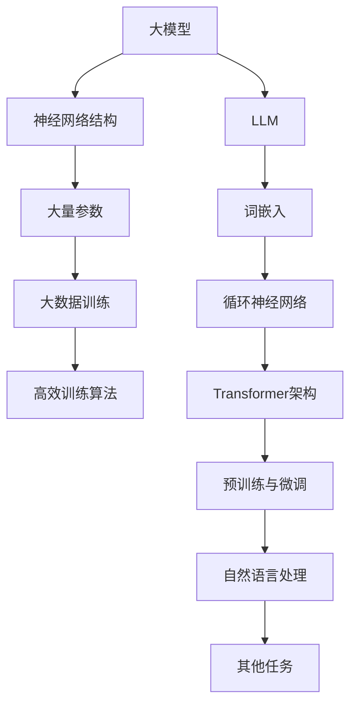

                 


### 1.1.1 大模型的概念

大模型（Large-scale Model），通常是指参数数量巨大的神经网络模型，这些模型能够处理大量的数据并进行复杂的模式识别和学习。大模型的发展是深度学习领域的重要里程碑，其核心思想是利用大规模数据和强大的计算能力来训练出能够解决复杂问题的模型。

大模型的基本组成部分包括：

- **神经网络结构**：通常采用深度神经网络（Deep Neural Network, DNN）或者Transformer架构。神经网络由多个层（Layer）组成，每一层包含若干神经元（Neurons）。神经元的输出经过非线性激活函数（Activation Function）处理后，传递到下一层。

- **大量参数**：大模型通常具有数百万到数十亿的参数。这些参数通过学习数据中的特征和模式，能够提高模型的泛化能力和预测准确性。

- **大数据训练**：大模型需要使用海量数据进行训练，以提取数据中的特征和规律。大数据集通常包含数百万到数十亿个样本，能够提供丰富的信息来优化模型参数。

- **高效训练算法**：为了训练大模型，研究人员开发了各种高效的训练算法，如随机梯度下降（Stochastic Gradient Descent, SGD）、Adam优化器等。这些算法能够加速模型训练过程，降低计算成本。

大模型在各类任务中表现出色，如自然语言处理（Natural Language Processing, NLP）、计算机视觉（Computer Vision, CV）、语音识别（Speech Recognition）等。大模型的优点包括：

- **强大的表达能力**：大模型能够学习复杂的特征和模式，从而解决更复杂的任务。

- **高泛化能力**：由于使用了大规模数据训练，大模型在未知数据上的表现通常很好，具有较好的泛化能力。

- **多功能性**：大模型可以用于多个不同领域，如文本生成、图像分类、语音合成等。

### 1.1.2 LLM的基本原理

语言模型（Language Model, LM）是一种用于预测下一个单词或字符的概率分布的模型。在自然语言处理中，语言模型是非常重要的基础组件，用于文本生成、机器翻译、文本分类等任务。

LLM（Large-scale Language Model），即大规模语言模型，是指参数数量巨大的语言模型。LLM通过学习海量文本数据，能够捕捉到语言中的复杂规律和结构，从而在各类NLP任务中表现出色。

LLM的基本原理包括：

- **词嵌入（Word Embedding）**：词嵌入是将自然语言中的词汇映射到高维向量空间中。通过词嵌入，模型能够捕捉到词汇之间的语义关系和语法特征。

- **循环神经网络（Recurrent Neural Network, RNN）**：循环神经网络是一种能够处理序列数据的神经网络。RNN通过记忆过去的信息，能够有效地处理自然语言中的长距离依赖关系。

- **Transformer架构**：Transformer是一种基于自注意力机制的神经网络架构，用于处理序列数据。与传统的RNN相比，Transformer具有更好的并行性和效率，能够处理更长的序列。

- **预训练与微调**：预训练（Pre-training）是指在大规模文本数据集上训练语言模型，使其能够学习到丰富的语言知识。微调（Fine-tuning）是指将预训练的语言模型在特定任务上进行进一步训练，以适应具体的应用场景。

LLM的优势包括：

- **强大的语言理解能力**：LLM通过学习海量文本数据，能够捕捉到语言中的复杂结构和规律，从而在文本生成、语义理解等任务中表现出色。

- **自适应性强**：LLM可以轻松适应各种不同的任务和应用场景，通过微调即可快速适应新任务。

- **高效性**：Transformer架构使得LLM在处理大规模序列数据时具有很高的效率。

### 1.1.3 大模型与LLM的联系

大模型和LLM有着紧密的联系。LLM作为一种特定类型的大模型，其特点在于针对自然语言处理任务进行优化和设计。以下是两者之间的联系：

- **共同点**：大模型和LLM都是基于神经网络的结构，拥有大量的参数，并且需要使用大规模数据进行训练。它们都能够学习到复杂的数据特征和模式，从而提高模型的泛化能力和准确性。

- **区别**：LLM更专注于自然语言处理任务，通过词嵌入、循环神经网络、Transformer等特定技术，捕捉到语言中的语义和语法结构。而大模型则更为通用，可以应用于多种不同的任务，如图像分类、语音识别等。

- **相互作用**：大模型和LLM可以相互补充。大模型提供了强大的学习能力和泛化能力，而LLM则专注于自然语言处理任务，通过高效的语言理解和生成能力，为其他任务提供支持。

### Mermaid 流程图

以下是大模型与LLM的关系架构的Mermaid流程图：



通过这个流程图，我们可以清晰地看到大模型与LLM之间的联系和区别。大模型作为基础，提供了强大的学习能力和泛化能力，而LLM则专注于自然语言处理任务，通过特定技术的优化，实现了高效的文本理解和生成。

### 背景介绍

在计算机科学和人工智能领域，语言模型（Language Model, LM）的发展已经取得了显著的成就。随着自然语言处理（Natural Language Processing, NLP）需求的不断增长，研究人员开始探索如何设计更为强大和灵活的语言模型。传统语言模型如N-gram模型、基于统计的方法等，虽然在某些方面表现出色，但受限于计算能力和模型结构的限制，难以处理更复杂的自然语言现象。因此，大规模语言模型（Large-scale Language Model, LLM）的概念应运而生。

大规模语言模型的核心思想是通过训练大量的参数和复杂的神经网络结构，使模型能够捕捉到自然语言中的深层语义和语法结构。这一思路的实现离不开深度学习技术的进步，尤其是在神经网络架构和训练算法方面的创新。从最初的循环神经网络（Recurrent Neural Network, RNN）到更为先进的Transformer架构，大规模语言模型的设计经历了多次迭代和优化。

LLM的发展不仅仅体现在技术层面，其在实际应用中的表现也令人瞩目。例如，在文本生成、机器翻译、问答系统等任务中，大规模语言模型展现出了出色的性能和灵活性。随着模型的规模和计算能力的提升，LLM的应用范围也在不断扩大，从传统的NLP任务扩展到对话系统、文本摘要、文本分类等领域。

然而，LLM的发展也面临一些挑战。首先是如何有效地处理大规模数据的存储和计算问题，以及如何在有限的计算资源下进行高效的训练和推理。其次，大规模语言模型的训练过程需要大量的标注数据，而获取高质量的数据集并不容易。此外，如何确保模型的泛化能力和鲁棒性，避免过拟合和偏见，也是需要深入研究的问题。

总的来说，大规模语言模型的发展为自然语言处理领域带来了新的机遇和挑战。通过对LLM的设计、训练和应用进行深入研究，我们可以期待在未来的发展中看到更多创新和突破。

### 1.2.1 大模型发展现状

随着深度学习技术的不断进步，大模型（Large-scale Model）的发展也取得了显著的成就。在自然语言处理（Natural Language Processing, NLP）、计算机视觉（Computer Vision, CV）、语音识别（Speech Recognition）等领域，大模型的应用已经变得非常普遍，并且取得了令人瞩目的成果。

首先，在自然语言处理领域，大规模语言模型（Large-scale Language Model, LLM）的发展尤为迅速。代表性模型包括GPT（Generative Pre-trained Transformer）系列、BERT（Bidirectional Encoder Representations from Transformers）、T5（Text-to-Text Transfer Transformer）等。这些模型通过在大量文本数据上进行预训练，能够捕捉到语言中的深层语义和结构信息，从而在文本生成、机器翻译、问答系统等任务中表现出色。例如，OpenAI发布的GPT-3模型，拥有1750亿个参数，能够生成高质量的自然语言文本，甚至在某些任务上超越了人类的表现。

其次，在计算机视觉领域，大模型的突破性应用也显而易见。代表性模型包括ResNet（Residual Network）、Inception（Inception Network）和EfficientNet（EfficientNet）等。这些模型通过增加网络的深度和宽度，使得模型能够处理更为复杂和大规模的数据，从而在图像分类、目标检测、图像生成等任务中取得了优异的性能。例如，Google的Inception模型在ImageNet图像分类比赛中连续几年获得冠军，展示了大模型在计算机视觉领域的重要性和潜力。

在语音识别领域，大模型的贡献同样不可忽视。通过深度神经网络（Deep Neural Network, DNN）和卷积神经网络（Convolutional Neural Network, CNN）的结合，研究人员成功训练出了能够高效识别和转换语音信号的模型。例如，Google的WaveNet模型通过生成对抗网络（Generative Adversarial Network, GAN）的技术，实现了高质量的语音合成，并且在语音识别任务中取得了优异的性能。

总的来说，大模型的发展现状表明，其在各类任务中都展现出了强大的学习能力和应用潜力。大模型不仅提高了模型的泛化能力和准确性，还为解决复杂问题提供了新的思路和方法。然而，随着模型规模的不断扩大，训练和推理的效率和资源消耗也成为一个需要重点关注的问题。在未来，如何优化大模型的设计和训练，提高其计算效率和可解释性，将是深度学习领域的重要研究方向。

### 1.2.2 跨领域类比能力的重要性

跨领域类比能力是人工智能系统，特别是大型语言模型（LLM）的一项关键能力。它指的是模型能够将一个领域中的知识、经验或模式应用到其他不同领域的能力。这种能力的重要性主要体现在以下几个方面：

首先，跨领域类比能力能够增强模型的应用范围。在单一领域中，模型的训练和优化通常局限于特定的任务和数据集。然而，现实世界的问题往往具有跨领域的特性，单一领域的解决方案可能无法应对复杂多样的任务需求。跨领域类比能力使得模型能够在多个领域中进行迁移和应用，从而提高其灵活性和适应性。

其次，跨领域类比能力有助于提升模型的泛化能力。在训练过程中，模型通过学习不同领域中的相似性和差异性，能够更好地理解不同领域中的通用规律和模式。这种跨领域的泛化能力不仅能够提高模型在未知领域的表现，还能减少对大规模特定领域数据的依赖，降低数据获取和标注的成本。

再者，跨领域类比能力对于解决现实世界中的复杂问题具有重要意义。在许多实际问题中，不同领域之间的知识往往存在交叉和重叠，通过跨领域类比，模型可以整合来自不同领域的知识，从而提出更为全面和创新的解决方案。例如，在医疗领域，结合生物学和医学知识可以更好地理解疾病机制；在金融领域，结合经济和统计学知识可以更准确地预测市场趋势。

此外，跨领域类比能力还能够促进人工智能技术的发展。通过跨领域的类比，研究人员可以发现不同领域中的共性，从而推动新算法、新模型的发明。例如，计算机视觉技术可以借鉴自然语言处理中的注意力机制，提高图像识别的精度；自然语言处理中的生成对抗网络（GAN）技术可以应用于图像生成和修复。

总的来说，跨领域类比能力是衡量大型语言模型性能和潜力的重要指标。它不仅能够提升模型的应用价值和实际效果，还为人工智能技术的发展提供了新的思路和方向。未来，随着人工智能技术的不断进步，跨领域类比能力将得到进一步的发展和应用。

### 跨领域类比能力评估方法

评估跨领域类比能力是衡量大型语言模型（LLM）性能的重要步骤。为了全面评估LLM的跨领域类比能力，研究人员开发了一系列评估方法，这些方法通常包括具体的评价指标和评估流程。以下将详细介绍几种常用的评估方法和其应用场景。

#### 1.1. 类比性能指标

1. **交叉任务性能（Cross-Task Performance）**：
   交叉任务性能是指LLM在多个不同任务中的表现。这种方法通过比较LLM在多个任务上的成绩，来评估其在不同领域中的泛化能力。常用的评价指标包括准确率（Accuracy）、召回率（Recall）、F1分数（F1 Score）等。

2. **领域迁移能力（Domain Generalization）**：
   领域迁移能力是指LLM在源领域（Source Domain）训练后，能否在目标领域（Target Domain）中表现出良好的性能。这种方法通过在源领域和目标领域分别训练模型，并比较两者的表现，来评估LLM的跨领域迁移能力。常用的评价指标包括领域泛化误差（Domain Generalization Error）和领域适应性分数（Domain Adaptation Score）。

3. **跨模态性能（Cross-Modal Performance）**：
   跨模态性能是指LLM在处理不同模态（如文本、图像、声音）数据时的表现。这种方法通过在多个模态之间进行任务转换，来评估LLM的跨模态类比能力。常用的评价指标包括模态交叉准确率（Cross-Modal Accuracy）和模态交叉损失（Cross-Modal Loss）。

#### 1.2. 评估方法

1. **任务迁移评估（Task Transfer Assessment）**：
   任务迁移评估是指通过在不同任务中训练和测试模型，来评估其跨领域类比能力。这种方法通常包括以下步骤：
   - **源领域数据收集**：收集并标注一组源领域数据集。
   - **目标领域数据收集**：收集并标注一组目标领域数据集。
   - **模型训练**：在源领域数据集上训练LLM。
   - **模型测试**：在目标领域数据集上测试LLM的性能。

2. **领域分割评估（Domain Split Assessment）**：
   领域分割评估是将数据集划分为源领域和目标领域两部分，分别训练和测试模型。这种方法可以更精确地评估LLM的领域迁移能力。具体步骤如下：
   - **数据集划分**：将原始数据集划分为源领域和目标领域。
   - **模型训练**：在源领域数据集上训练LLM。
   - **模型测试**：在目标领域数据集上测试LLM的性能。

3. **模态交叉评估（Modal Cross-Modal Assessment）**：
   模态交叉评估是通过不同模态的数据来训练和测试LLM，来评估其跨模态类比能力。这种方法通常包括以下步骤：
   - **数据收集**：收集并标注多个模态的数据（如文本、图像、声音）。
   - **模型训练**：在不同模态的数据上进行联合训练。
   - **模型测试**：在单一模态或跨模态任务上测试LLM的性能。

#### 1.3. 实例分析

假设我们有一个语言模型，需要评估其跨领域类比能力。以下是具体评估流程：

1. **数据准备**：
   收集并标注两组数据集，一组用于源领域训练，另一组用于目标领域测试。例如，源领域是医学文本，目标领域是法律文本。

2. **模型训练**：
   在医学文本数据集上训练LLM，使其能够学习到医学领域的知识。

3. **模型测试**：
   在法律文本数据集上测试LLM的性能，评估其在法律领域中的表现。

4. **结果分析**：
   通过计算LLM在法律文本数据集上的准确率、召回率等指标，分析其跨领域类比能力。

通过以上评估方法，我们可以全面评估LLM的跨领域类比能力，从而为模型优化和应用提供指导。

### 1.3. 评估流程

评估大型语言模型（LLM）的跨领域类比能力需要经过一系列详细的步骤，包括数据收集与预处理、模型评估与优化，以及结果分析与可视化。以下是对评估流程的详细解析。

#### 1.3.1 数据收集与预处理

1. **数据收集**：
   评估跨领域类比能力首先需要收集两组数据集，一组为源领域数据集，另一组为目标领域数据集。源领域数据集用于训练LLM，目标领域数据集用于评估LLM在未知领域中的表现。

2. **数据预处理**：
   收集到的数据需要进行预处理，以确保数据的质量和一致性。预处理步骤通常包括：
   - **文本清洗**：去除数据中的噪声，如HTML标签、标点符号等。
   - **分词与词性标注**：将文本拆分为词，并对每个词进行词性标注。
   - **数据规范化**：将数据转换为统一的格式，便于模型训练和评估。

3. **数据划分**：
   将预处理后的数据集划分为训练集和测试集。训练集用于训练LLM，测试集用于评估LLM的性能。

#### 1.3.2 模型评估与优化

1. **模型训练**：
   在源领域数据集上训练LLM。训练过程中，需要选择合适的训练算法和超参数，如学习率、批次大小等，以优化模型性能。

2. **模型评估**：
   使用目标领域数据集对训练好的LLM进行评估。评估步骤通常包括：
   - **性能指标计算**：计算LLM在目标领域数据集上的准确率、召回率、F1分数等性能指标。
   - **错误分析**：分析模型在目标领域中的错误类型，以了解模型的表现和潜在问题。

3. **模型优化**：
   根据评估结果对模型进行优化。优化步骤可能包括调整超参数、增加训练数据、改进模型结构等，以提高模型在目标领域中的性能。

#### 1.3.3 结果分析与可视化

1. **结果分析**：
   对评估结果进行详细分析，以了解LLM在跨领域类比任务中的表现。分析内容包括：
   - **性能对比**：对比LLM在源领域和目标领域中的性能，评估其跨领域类比能力。
   - **错误类型分析**：分析模型在目标领域中的错误类型，以识别模型的不足之处。

2. **可视化**：
   使用图表和可视化工具展示评估结果，以更直观地展示LLM的性能和表现。常见的可视化方法包括：
   - **混淆矩阵**：展示模型在目标领域中的分类结果，帮助分析模型的分类性能。
   - **ROC曲线和AUC值**：展示模型在目标领域中的分类性能，通过AUC值评估模型的泛化能力。
   - **错误分布图**：展示模型在目标领域中的错误分布，帮助识别模型表现较差的区域。

通过上述评估流程，我们可以全面评估大型语言模型在跨领域类比任务中的性能，为模型优化和应用提供重要参考。

### 2.1.1 深度神经网络基础

深度神经网络（Deep Neural Network, DNN）是深度学习的基础，它由多个层（Layer）组成，每层包含若干神经元（Neurons）。DNN能够通过学习输入数据和目标数据之间的关系，实现对复杂数据模式的自动特征提取和分类。

#### 神经元结构与激活函数

神经元是DNN的基本计算单元，通常包含以下组成部分：

1. **权重（Weights）**：神经元与输入数据之间的关联参数，用于调整输入数据的权重，影响输出结果。
2. **偏置（Bias）**：用于调整神经元的输出，增强或减弱输入数据的影响。
3. **激活函数（Activation Function）**：用于引入非线性特性，使DNN能够学习复杂数据模式。常见的激活函数包括Sigmoid、ReLU和Tanh。

Sigmoid函数：
$$
\sigma(x) = \frac{1}{1 + e^{-x}}
$$
Sigmoid函数将输入x映射到(0, 1)区间，但训练时间较长，且在接近0和1时梯度接近0，容易导致梯度消失问题。

ReLU函数：
$$
\text{ReLU}(x) = \max(0, x)
$$
ReLU函数引入了非线性特性，并且在训练过程中能够加快收敛速度，避免了梯度消失问题。然而，ReLU函数在某些情况下可能导致神经元“死亡”，即输入小于0时输出始终为0。

Tanh函数：
$$
\tanh(x) = \frac{e^x - e^{-x}}{e^x + e^{-x}}
$$
Tanh函数与ReLU函数类似，也引入了非线性特性，但其输出范围在(-1, 1)之间，有助于稳定训练过程。

#### 前向传播与反向传播

DNN的训练过程主要包括前向传播（Forward Propagation）和反向传播（Back Propagation）两个阶段。

**前向传播**：
输入数据经过DNN的各个层，通过权重和偏置进行加权求和，然后通过激活函数得到输出。前向传播的目的是计算输出结果，并计算每个神经元的误差。

前向传播的伪代码如下：
```python
for each layer l from 1 to L:
    z[l] = sum(w[l][j] * a[l-1][j] for j in range(J[l]))
    a[l] = activation(z[l])
```

**反向传播**：
反向传播通过计算梯度，更新神经元的权重和偏置，以最小化预测误差。反向传播的核心是计算每个神经元对误差的敏感度，即梯度。

反向传播的伪代码如下：
```python
for l in range(L, 0, -1):
    delta[l] = (a[l] * (1 - a[l]) * d[l+1])
    for j in range(J[l]):
        d[l-1][j] = sum(delta[l][k] * w[l][k][j] for k in range(K[l]))
```

通过反复迭代前向传播和反向传播，DNN能够不断优化权重和偏置，从而提高模型的预测性能。

### 2.1.2 Transformer架构

Transformer架构是近年来在自然语言处理（NLP）领域取得突破性进展的一种神经网络模型，由Google在2017年提出。相比于传统的循环神经网络（RNN）和长短时记忆网络（LSTM），Transformer具有更好的并行计算能力和更强的捕捉长距离依赖关系的能力。

#### Transformer的基本概念

Transformer架构的核心是自注意力机制（Self-Attention Mechanism）和多头注意力（Multi-Head Attention）。自注意力机制允许模型在生成每个词时，将所有词的表示结合起来，从而捕捉词与词之间的依赖关系。多头注意力则通过并行计算多个注意力机制，提高了模型的表示能力。

#### 自注意力机制

自注意力机制是一种计算神经元之间相互依赖性的方法。给定一个词向量序列，自注意力机制通过三个矩阵（Q，K，V）计算每个词的注意力权重，并将这些权重应用于词向量以生成新的表示。

自注意力机制的公式如下：
$$
\text{Attention}(Q, K, V) = \text{softmax}\left(\frac{QK^T}{\sqrt{d_k}}\right) V
$$
其中，Q、K、V分别是查询（Query）、键（Key）和值（Value）矩阵，d_k是键的维度。softmax函数用于计算每个键的权重，并对其进行归一化。

#### 多头注意力

多头注意力通过多个独立的自注意力机制，将不同视角的信息整合起来，从而提高模型的表示能力。假设我们有h个头，每个头计算一组注意力权重和值。多头注意力的输出是这些头的输出拼接起来。

多头注意力的公式如下：
$$
\text{MultiHead}(Q, K, V) = \text{Concat}(\text{head}_1, ..., \text{head}_h)W^O
$$
其中，$\text{head}_i = \text{Attention}(QW_i^Q, KW_i^K, VW_i^V)$，$W^O$是输出权重矩阵。

#### Transformer模型架构

Transformer模型通常包含一个编码器（Encoder）和一个解码器（Decoder）。编码器将输入序列编码为固定长度的向量表示，解码器则根据编码器输出的表示生成输出序列。

编码器由多个编码层（Encoder Layer）组成，每层包含多头自注意力机制和全连接层（Feed Forward Network）。编码层的基本架构如下：

1. **多头自注意力机制**：
   $$\text{Self-Attention}(Q, K, V) = \text{softmax}\left(\frac{QK^T}{\sqrt{d_k}}\right) V$$
2. **残差连接**：
   为了防止梯度消失，每层编码器之前添加残差连接，即直接将输入跳过部分层，与下一层的输出相加。
3. **层归一化**：
   在每个编码层之后，添加层归一化（Layer Normalization）以稳定训练过程。

解码器由多个解码层（Decoder Layer）组成，每层包含多头自注意力机制、编码器-解码器注意力机制和全连接层。解码层的基本架构如下：

1. **多头自注意力机制**：
   $$\text{Self-Attention}(Q, K, V) = \text{softmax}\left(\frac{QK^T}{\sqrt{d_k}}\right) V$$
2. **编码器-解码器注意力机制**：
   $$\text{Encoder-Decoder-Attention}(Q, K, V) = \text{softmax}\left(\frac{QK^T}{\sqrt{d_k}}\right) V$$
3. **残差连接与层归一化**：
   与编码器类似，解码器每层也包含残差连接和层归一化。

通过编码器和解码器的协同工作，Transformer模型能够高效地处理序列数据，并在各种NLP任务中取得优异的性能。

### 2.2.1 数据预处理

在深度学习模型训练过程中，数据预处理是至关重要的一步，它能够提高模型的训练效率和性能。特别是在大规模语言模型（LLM）的训练中，数据预处理的质量直接影响到模型的训练效果。以下是数据预处理的主要步骤和方法：

#### 1. 数据清洗

数据清洗是数据预处理的首要步骤，目的是去除数据中的噪声和不必要的部分。在自然语言处理任务中，数据清洗通常包括以下操作：

- **去除HTML标签和特殊字符**：文本数据中往往包含HTML标签和特殊字符，这些内容对模型的训练没有实际帮助，反而可能引入噪声。因此，需要将这些内容去除。
- **统一文本格式**：确保文本中的大写、小写、标点符号等格式一致。例如，将所有文本转换为小写，去除多余的空格和换行符等。
- **去除停用词**：停用词（Stop Words）是常用的一些无意义词汇，如“的”、“是”、“和”等。去除停用词可以减少噪声，提高模型训练的效率。
- **去除重复文本**：识别并去除重复的文本内容，以防止重复数据对模型训练产生负面影响。

#### 2. 数据分割

数据分割是将原始数据集划分为训练集、验证集和测试集。这种划分方法有助于模型在训练过程中不断调整和优化，并在最终测试时评估模型的性能。以下是常用的数据分割方法：

- **随机分割**：将数据集随机划分为训练集、验证集和测试集，每个数据集的比例可以根据实际需求设定。随机分割方法简单易行，但可能导致数据分布不均衡。
- **分层分割**：根据数据的某些属性（如文本类别、来源等）进行分层，然后在每个层次内随机划分训练集、验证集和测试集。这种方法可以确保每个数据集在类别和属性上的分布更加均匀。
- **交叉验证**：将数据集划分为若干个子集，每次选取一个子集作为验证集，其余子集作为训练集。这种方法能够提高模型对数据的泛化能力。

#### 3. 词嵌入

词嵌入（Word Embedding）是将自然语言中的词汇映射到高维向量空间的过程。词嵌入能够将词汇的语义信息编码到向量中，从而便于模型处理。以下是几种常见的词嵌入方法：

- **词袋模型（Bag of Words, BoW）**：词袋模型将文本表示为词的集合，不考虑词的顺序和语法结构。这种方法简单直观，但忽略了词汇的语义关系。
- **连续词袋（Continuous Bag of Words, CBOW）**：CBOW模型通过上下文词（即周围几个词）来预测当前词。输入是一个包含几个词汇的向量，输出是当前词汇的向量。
- **Skip-Gram模型**：Skip-Gram模型与CBOW相反，它通过当前词来预测上下文词。这种方法在处理长文本时更为有效。
- **词嵌入算法**：Word2Vec、GloVe等算法能够生成高质量的词嵌入。Word2Vec使用CBOW和Skip-Gram模型训练词向量，GloVe通过矩阵分解方法训练词向量。

#### 4. 数据归一化

数据归一化是将数据转换到相同尺度，以便于模型训练。归一化方法包括：

- **最小-最大归一化**：将数据缩放到[0, 1]区间，公式为：
  $$
  x_{\text{normalized}} = \frac{x - \min(x)}{\max(x) - \min(x)}
  $$
- **标准归一化**：将数据缩放到标准正态分布，公式为：
  $$
  x_{\text{normalized}} = \frac{x - \mu}{\sigma}
  $$
  其中，$\mu$是均值，$\sigma$是标准差。

通过以上数据预处理步骤，我们可以得到高质量的数据集，从而提高深度学习模型的训练效果和泛化能力。

### 2.2.2 模型优化算法

在深度学习模型训练过程中，选择合适的优化算法是至关重要的，它直接影响模型的训练速度和最终性能。优化算法的目标是通过最小化损失函数来调整模型的参数，从而提高预测的准确性。以下是几种常用的优化算法及其原理：

#### 1. 随机梯度下降（Stochastic Gradient Descent, SGD）

随机梯度下降是最早的优化算法之一，其基本思想是在每次迭代过程中，随机选择一部分数据样本，计算这些样本的梯度并更新模型参数。SGD的公式如下：
$$
\theta = \theta - \alpha \cdot \nabla_\theta J(\theta)
$$
其中，$\theta$是模型参数，$J(\theta)$是损失函数，$\alpha$是学习率。

优点：
- 简单易实现
- 训练速度快

缺点：
- 易陷入局部最优
- 对噪声数据敏感

#### 2. 隐式梯度下降（Implicit Gradient Descent, IGD）

隐式梯度下降通过隐式计算梯度来避免直接计算梯度，从而提高训练效率。其核心思想是利用模型在训练过程中的变化来近似梯度。IGD的公式如下：
$$
\theta = \theta - \alpha \cdot \nabla_\theta J(\theta) \approx \theta - \alpha \cdot \frac{\partial J(\theta)}{\partial \theta}
$$
其中，$\partial J(\theta)$是损失函数关于参数的偏导数。

优点：
- 减少了计算梯度的计算量
- 提高训练效率

缺点：
- 需要额外的计算资源
- 对噪声数据敏感

#### 3. 动量法（Momentum）

动量法通过引入动量项，将过去梯度的信息整合到当前梯度中，从而减少波动并加速收敛。动量法的公式如下：
$$
v = \gamma v + \alpha \cdot \nabla_\theta J(\theta)
$$
$$
\theta = \theta - v
$$
其中，$v$是动量项，$\gamma$是动量因子。

优点：
- 减少了波动，提高了收敛速度
- 对噪声数据有更好的鲁棒性

缺点：
- 需要额外的计算资源

#### 4. Adam优化器

Adam优化器结合了SGD和动量法的优点，并在计算梯度时引入了一阶和二阶矩估计。Adam优化器的公式如下：
$$
m_t = \beta_1 m_{t-1} + (1 - \beta_1) \nabla_\theta J(\theta)
$$
$$
v_t = \beta_2 v_{t-1} + (1 - \beta_2) \nabla_\theta J(\theta)^2
$$
$$
\theta = \theta - \alpha \cdot \frac{m_t}{\sqrt{v_t} (1 - \beta_2^t)}
$$
其中，$m_t$和$v_t$分别是均值一阶矩估计和均值二阶矩估计，$\beta_1$和$\beta_2$是超参数。

优点：
- 结合了SGD和动量法的优点
- 对噪声数据有更好的鲁棒性
- 收敛速度较快

缺点：
- 对超参数的选择要求较高

通过以上优化算法的比较，我们可以根据实际需求和任务特点选择合适的优化算法，以提高模型的训练效果和效率。

### 2.2.3 模型训练流程

模型训练是深度学习过程中至关重要的一步，它决定了模型能否准确地预测和识别数据中的模式。以下是模型训练的详细流程，包括训练策略、调参技巧以及常见的问题和解决方案。

#### 1. 训练策略

1. **小批量训练**：
   小批量训练（Mini-batch Training）是将数据集划分为若干个小批量（通常包含几十到几百个样本），然后对每个小批量进行训练。小批量训练的优点包括：
   - **减少过拟合**：小批量训练有助于模型更好地泛化，减少过拟合现象。
   - **稳定梯度**：通过稳定梯度，减少模型在训练过程中由于梯度爆炸或消失而导致的训练不稳定。
   - **计算效率**：相比单样本训练，小批量训练可以更高效地利用计算资源。

2. **训练 - 验证 - 测试循环**：
   训练 - 验证 - 测试（Training - Validation - Testing Cycle）是模型训练中常用的策略。具体步骤如下：
   - **训练阶段**：在训练集上训练模型，并监控损失函数和验证集上的表现。
   - **验证阶段**：使用验证集评估模型的表现，并根据验证集的结果调整模型参数，如学习率和网络结构。
   - **测试阶段**：在测试集上评估模型的表现，以评估模型在实际应用中的性能。

3. **早停法**（Early Stopping）：
   早停法是一种防止过拟合的方法，当验证集上的损失函数不再显著下降时，提前停止训练。这种方法有助于避免模型在训练集上过拟合，提高泛化能力。

4. **模型集成**（Model Ensembling）：
   模型集成通过结合多个模型的预测结果来提高预测的准确性。常见的集成方法包括：
   - **平均法**：将多个模型的预测结果取平均值。
   - **投票法**：对于分类问题，选择预测结果最多的类别作为最终预测结果。
   - **堆叠法**：将多个模型作为基础模型，通过训练一个额外的模型来整合这些基础模型的预测结果。

#### 2. 调参技巧

1. **学习率调整**：
   学习率是模型训练中的一个重要参数，它决定了模型在每一步更新参数时的步长。常见的学习率调整技巧包括：
   - **逐步减小学习率**：在训练过程中逐步减小学习率，以防止模型在训练后期过快收敛。
   - **学习率衰减**：根据训练轮数逐步减小学习率，例如指数衰减或线性衰减。

2. **批量大小选择**：
   批量大小（Batch Size）的选择直接影响模型的训练效率和性能。常见的选择技巧包括：
   - **小批量训练**：小批量训练有助于减少过拟合，但训练速度较慢。
   - **中批量训练**：中批量训练在训练效率和泛化能力之间取得平衡。
   - **大数据量训练**：大数据量训练可以提高模型的泛化能力，但计算资源需求较大。

3. **正则化方法**：
   正则化（Regularization）是防止模型过拟合的重要手段，常见的方法包括：
   - **L1正则化**：在损失函数中添加L1范数。
   - **L2正则化**：在损失函数中添加L2范数。
   - **Dropout**：在训练过程中随机丢弃一部分神经元。

4. **网络结构调整**：
   网络结构（Network Architecture）的调整可以显著影响模型的性能，常见的方法包括：
   - **增加层数和神经元**：增加网络的深度和宽度可以提高模型的表示能力。
   - **使用特殊的网络结构**：如卷积神经网络（CNN）、循环神经网络（RNN）和Transformer等。

#### 3. 常见问题及解决方案

1. **梯度消失/梯度爆炸**：
   - **原因**：网络结构过于复杂或学习率设置不当。
   - **解决方案**：使用ReLU激活函数、适当的批量大小、调整学习率、使用梯度裁剪技术。

2. **过拟合**：
   - **原因**：模型在训练集上学习到过多的噪声和细节。
   - **解决方案**：增加正则化、使用验证集、减少模型复杂度、增加训练数据。

3. **训练速度慢**：
   - **原因**：计算资源不足或模型设计不合理。
   - **解决方案**：优化模型结构、使用更高效的优化算法、增加GPU计算资源。

通过以上训练策略、调参技巧和问题解决方案，我们可以有效地训练深度学习模型，提高其性能和泛化能力。

### 2.3.1 生成对抗网络（GAN）

生成对抗网络（Generative Adversarial Network，GAN）是深度学习领域的一种创新模型，由Ian Goodfellow等人在2014年提出。GAN的核心思想是通过两个对抗性网络——生成器（Generator）和判别器（Discriminator）的博弈，生成高质量的数据。

#### 基本概念与结构

1. **生成器（Generator）**：生成器的任务是生成与真实数据分布相似的假数据。生成器通常采用神经网络结构，输入为随机噪声，输出为假数据。生成器试图让判别器认为这些假数据来自真实数据分布。

2. **判别器（Discriminator）**：判别器的任务是区分真实数据和假数据。判别器同样采用神经网络结构，输入为数据，输出为概率分布，表示输入数据是真实数据的概率。判别器试图最大化其分类准确率。

GAN的训练过程可以看作是生成器和判别器之间的对抗游戏，具体包括以下几个步骤：

- **训练判别器**：首先对判别器进行训练，使其能够准确区分真实数据和假数据。判别器的损失函数通常包括真实数据和假数据的交叉熵损失。
- **训练生成器**：当判别器性能提升后，生成器开始训练，生成更高质量、更难以被判别器识别的假数据。生成器的损失函数包括判别器认为假数据是真实数据的概率，即判别器对生成器生成的假数据的评分。

GAN的基本公式如下：
$$
\max_D \min_G V(D, G) = \max_D \mathbb{E}_{x \sim p_{data}(x)}[\log D(x)] + \mathbb{E}_{z \sim p_z(z)}[\log (1 - D(G(z))]
$$
其中，$D$表示判别器，$G$表示生成器，$x$表示真实数据，$z$表示随机噪声，$p_{data}(x)$表示真实数据的概率分布，$p_z(z)$表示随机噪声的概率分布。

#### GAN的应用

GAN在图像生成、图像修复、图像超分辨率等计算机视觉领域表现出色。以下是几个应用实例：

1. **图像生成**：
   GAN可以生成逼真的图像，如图像到图像转换、人脸生成等。例如，StyleGAN可以生成高质量的人脸图像，广泛应用于虚拟现实、游戏设计等领域。

2. **图像修复**：
   GAN可以用于图像修复，如去除图像中的瑕疵或缺失部分。通过训练生成器生成与背景图像相似的新图像，填补缺失的部分。应用实例包括图像去噪、图像修复、图像增强等。

3. **图像超分辨率**：
   GAN可以用于图像超分辨率，将低分辨率图像转换为高分辨率图像。通过训练生成器学习高分辨率图像的细节，从而提高图像的清晰度。应用实例包括医学图像处理、卫星图像增强等。

GAN作为一种强大的深度学习模型，为图像处理和生成领域带来了新的机遇和挑战。随着技术的不断进步，GAN的应用范围将不断扩展，未来有望在更多领域取得突破。

### 2.3.2 自注意力机制

自注意力机制（Self-Attention Mechanism）是近年来在自然语言处理（NLP）领域得到广泛应用的一种技术，它在捕捉序列数据中的长距离依赖关系方面表现出色。自注意力机制的核心思想是在模型处理每个词时，将这个词与序列中的其他词进行关联，并通过权重来调整每个词的影响。这一机制在Transformer架构中起到了至关重要的作用，并在多种NLP任务中取得了优异的性能。

#### 自注意力机制的工作原理

自注意力机制通常通过三个矩阵（Q，K，V）来计算，这三个矩阵分别表示查询（Query）、键（Key）和值（Value）。给定一个词向量序列，自注意力机制通过计算每个词的权重来生成新的表示。

具体来说，自注意力机制的步骤如下：

1. **计算查询（Query）、键（Key）和值（Value）**：
   每个词向量通过矩阵乘法分别映射到查询（Q）、键（K）和值（V）空间。
   $$Q = W_Q \cdot H$$
   $$K = W_K \cdot H$$
   $$V = W_V \cdot H$$
   其中，$W_Q$、$W_K$和$W_V$是权重矩阵，$H$是输入的词向量。

2. **计算注意力分数**：
   通过计算查询和键的逐元素相乘，再除以一个尺度因子（$\sqrt{d_k}$），得到每个词的注意力分数。
   $$\text{Attention Scores} = \frac{QK^T}{\sqrt{d_k}}$$
   其中，$d_k$是键的维度。

3. **应用softmax函数**：
   将注意力分数进行归一化，得到每个词的注意力权重。
   $$\text{Attention Weights} = \text{softmax}(\text{Attention Scores})$$

4. **计算新的表示**：
   通过将注意力权重与值相乘，得到新的表示。
   $$\text{New Representation} = \text{Attention Weights} \cdot V$$

5. **拼接和线性变换**：
   将新的表示拼接起来，并通过一个线性变换得到最终的输出。
   $$\text{Output} = W_O \cdot \text{concat}(\text{New Representation})$$
   其中，$W_O$是输出权重矩阵。

#### 自注意力机制的优势

自注意力机制在处理序列数据时具有以下优势：

1. **并行计算**：
   自注意力机制允许模型在处理每个词时同时计算其与序列中其他词的关联，这使得模型能够高效地处理长序列数据，避免了传统循环神经网络（RNN）中的计算瓶颈。

2. **长距离依赖关系**：
   自注意力机制能够通过调整词的权重来捕捉长距离依赖关系，这使得模型在处理复杂自然语言任务时表现更为出色，如机器翻译、文本生成等。

3. **可扩展性**：
   自注意力机制可以通过增加头的数量（Multi-Head Attention）来增强模型的表示能力，同时保持较好的计算效率。

#### 自注意力机制的应用

自注意力机制在多种NLP任务中得到了广泛应用：

1. **机器翻译**：
   在机器翻译任务中，自注意力机制可以帮助模型捕捉源语言和目标语言之间的长距离依赖关系，从而提高翻译的质量。

2. **文本生成**：
   在文本生成任务中，自注意力机制能够帮助模型生成连贯且具有语境意义的文本。

3. **文本分类**：
   在文本分类任务中，自注意力机制可以增强模型对文本中关键信息的关注，提高分类的准确性。

4. **问答系统**：
   在问答系统中，自注意力机制可以帮助模型从大量文本中快速提取与问题相关的信息，提高回答的准确性。

总的来说，自注意力机制在NLP领域中具有广泛的应用前景，它为模型处理复杂数据提供了强大的工具，并在实际应用中取得了显著的成果。

### 2.3.3 多任务学习

多任务学习（Multi-Task Learning）是一种将多个相关任务结合在一起进行训练的机器学习方法。其核心思想是通过共享模型参数和特征表示，使得模型能够同时解决多个任务，从而提高模型的性能和泛化能力。在多任务学习框架下，模型通过学习不同任务之间的共性，能够更好地利用有限的数据资源，并在新任务上取得更好的表现。

#### 多任务学习的优势

1. **数据共享**：多任务学习允许不同任务之间共享数据和特征表示，从而减少对大量单独数据集的需求。在数据稀缺的情况下，这种数据共享尤为重要。

2. **增强泛化能力**：通过学习多个任务，模型能够更好地捕捉到数据中的通用特征和模式，从而提高在未知任务上的泛化能力。

3. **提高性能**：共享参数和特征表示能够增强模型在各个任务上的性能，尤其是在任务之间存在相关性时。

#### 多任务学习的实现方法

多任务学习有多种实现方法，以下是几种常见的方法：

1. **共享层**：
   这种方法将多个任务的共享层设置为相同的神经网络结构，然后为每个任务添加独立的分类层或回归层。通过这种方式，模型能够在共享层中学习到通用特征，同时在独立层中针对特定任务进行优化。

2. **任务嵌入**：
   任务嵌入（Task Embeddings）方法通过将任务信息嵌入到模型的输入中，使模型能够区分不同任务。例如，在自然语言处理任务中，可以为每个任务分配一个唯一的标识符，并将其嵌入到词向量中。

3. **注意力机制**：
   注意力机制可以帮助模型在处理序列数据时，动态地调整对不同任务的关注程度。通过这种方式，模型能够更好地平衡多个任务之间的利益，从而提高整体性能。

4. **标签平滑**：
   在多任务学习中，标签平滑（Label Smoothing）是一种常用的方法，用于减轻不同任务之间的冲突。通过为每个任务的标签引入一定的噪声，模型能够更好地学习到各个任务的权重。

#### 多任务学习的挑战

1. **任务冲突**：当不同任务之间存在冲突时，如一个任务是分类问题，另一个任务是回归问题，多任务学习可能会陷入困境。

2. **资源分配**：如何合理分配模型参数和计算资源，以平衡各个任务之间的利益，是一个挑战。

3. **数据不平衡**：当数据集中某些任务的数据量远大于其他任务时，可能导致模型对数据量大的任务过度依赖，从而影响其他任务的表现。

通过深入了解多任务学习的优势和挑战，研究人员可以设计出更加有效的多任务学习框架，从而提高模型在多个任务上的性能。

### 2.3.4 跨模态多任务学习

跨模态多任务学习（Cross-Modal Multi-Task Learning）是指同时处理多个模态数据（如图像、文本、声音等）的机器学习方法。该方法通过共享模型参数和特征表示，使得模型能够高效地利用不同模态的信息，从而提高任务处理的性能和泛化能力。以下将详细讨论跨模态多任务学习的核心算法原理、实现方法及常见应用场景。

#### 核心算法原理

跨模态多任务学习通常包括以下核心组成部分：

1. **模态嵌入**：
   模态嵌入（Modal Embeddings）是将不同模态的数据映射到共享的特征空间中。例如，图像可以映射到图像嵌入空间，文本可以映射到词嵌入空间，声音可以映射到音频嵌入空间。通过模态嵌入，模型能够捕捉到不同模态之间的内在联系。

2. **多任务损失函数**：
   多任务损失函数（Multi-Task Loss Function）用于联合优化多个任务。常见的多任务损失函数包括加权交叉熵损失、均方误差损失等。通过优化多任务损失函数，模型能够在不同任务之间找到平衡点，从而提高整体性能。

3. **跨模态交互**：
   跨模态交互（Cross-Modal Interaction）是指模型在不同模态之间进行信息交换和融合的过程。通过跨模态交互，模型能够利用来自不同模态的数据，提高任务处理的准确性。常见的跨模态交互方法包括融合层（Fusion Layer）、注意力机制（Attention Mechanism）等。

#### 实现方法

1. **共享网络结构**：
   在跨模态多任务学习中，可以通过共享网络结构来实现不同模态的信息共享。例如，可以使用一个统一的编码器（Encoder）对每个模态的数据进行编码，然后通过不同的解码器（Decoder）处理不同任务。这种方法能够减少参数冗余，提高模型的训练效率。

2. **模态特定模块**：
   跨模态多任务学习还可以通过为每个模态设计特定的模块，然后在模型的高层进行融合。这种方法能够更好地利用不同模态的特征，提高任务处理的准确性。例如，可以使用图像特征提取网络（如ResNet）处理图像数据，使用文本嵌入网络（如Word2Vec）处理文本数据，最后在模型的高层通过融合层进行特征融合。

3. **注意力机制**：
   注意力机制（Attention Mechanism）是一种有效的跨模态交互方法。通过注意力机制，模型能够动态地调整对不同模态数据的关注程度，从而提高任务处理的性能。常见的注意力机制包括自注意力（Self-Attention）、点积注意力（Dot-Product Attention）等。

#### 常见应用场景

1. **多模态图像识别**：
   多模态图像识别是指同时处理图像和文本标签的任务。例如，在图像分类任务中，模型需要同时处理图像内容和文本标签，从而提高分类准确性。

2. **多模态文本生成**：
   多模态文本生成是指通过结合图像和文本数据生成文本的任务。例如，在图像描述生成任务中，模型需要利用图像内容和文本标签生成高质量的描述文本。

3. **多模态语音识别**：
   多模态语音识别是指同时处理语音和文本数据的任务。例如，在语音翻译任务中，模型需要利用语音和文本输入生成翻译文本。

4. **多模态推荐系统**：
   多模态推荐系统是指结合用户画像、商品信息等多模态数据进行个性化推荐的任务。例如，在电商平台上，模型可以根据用户的历史购买记录、浏览行为和商品描述等多模态数据，为用户推荐合适的商品。

通过跨模态多任务学习，模型能够更好地利用来自不同模态的数据，提高任务处理的准确性和泛化能力，从而在多个领域取得显著的成果。

### 4.1.1 测试指标

在评估大型语言模型（LLM）的跨领域类比能力时，选择合适的测试指标是至关重要的。这些指标能够帮助我们全面衡量模型在不同领域中的表现，并识别其优势和不足。以下是几种常用的测试指标及其计算方法：

#### 1. 准确率（Accuracy）

准确率是评估分类模型最直观的指标，表示模型正确分类的样本数占总样本数的比例。公式如下：

$$
\text{Accuracy} = \frac{\text{正确分类的样本数}}{\text{总样本数}}
$$

准确率越高，说明模型的分类性能越好。然而，准确率在某些情况下可能不足以全面评估模型的性能，特别是当数据分布不均衡时。

#### 2. 召回率（Recall）

召回率是指模型正确分类的正类样本数占所有正类样本数的比例。公式如下：

$$
\text{Recall} = \frac{\text{正确分类的正类样本数}}{\text{所有正类样本数}}
$$

召回率越高，表示模型能够更好地识别出正类样本。在医学诊断、安全监控等领域，召回率是一个非常重要的指标。

#### 3. 精确率（Precision）

精确率是指模型正确分类的正类样本数占所有预测为正类的样本数的比例。公式如下：

$$
\text{Precision} = \frac{\text{正确分类的正类样本数}}{\text{预测为正类的样本数}}
$$

精确率越高，表示模型对正类样本的预测越准确。与召回率相结合，可以更全面地评估模型的分类性能。

#### 4. F1 分数（F1 Score）

F1 分数是精确率和召回率的调和平均，能够综合考虑这两个指标。公式如下：

$$
\text{F1 Score} = 2 \times \frac{\text{Precision} \times \text{Recall}}{\text{Precision} + \text{Recall}}
$$

F1 分数在数据分布不均衡的情况下，能够更好地反映模型的综合性能。

#### 5. 调整的F1分数（Adjusted F1 Score）

调整的F1分数是针对不平衡数据集的一个改进指标，它通过引入总样本数的计算，进一步平衡了精确率和召回率。公式如下：

$$
\text{Adjusted F1 Score} = \frac{2 \times \text{Precision} \times \text{Recall}}{\text{Precision} + \text{Recall} + \text{Total Samples} - \text{Correctly Classified Samples}}
$$

#### 6. 精度-召回曲线（Precision-Recall Curve）

精度-召回曲线通过绘制不同召回率下的精确率，帮助分析模型在不同阈值下的性能。曲线下的面积（Area Under Curve, AUC）是衡量模型性能的重要指标。

#### 7. 受影响的准确率（Affected Accuracy）

受影响的准确率考虑了错误分类对模型表现的影响，特别是对于稀有类别。公式如下：

$$
\text{Affected Accuracy} = \frac{\text{正确分类的样本数} + \text{所有稀有类别的样本数}}{\text{总样本数}}
$$

#### 8. 混淆矩阵（Confusion Matrix）

混淆矩阵是一个直观地展示模型分类结果的表格，它列出了实际类别与预测类别之间的关系。通过混淆矩阵，可以更详细地分析模型在不同类别上的表现。

通过这些测试指标，我们可以全面评估大型语言模型在跨领域类比任务中的性能，并为模型的改进提供指导。在实际应用中，根据任务的具体需求和数据特点，选择合适的测试指标组合，能够更准确地衡量模型的表现。

### 4.1.2 测试流程

为了全面评估大型语言模型（LLM）的跨领域类比能力，我们需要设计一个系统的测试流程。该流程通常包括以下步骤：

#### 1. 数据集准备

首先，我们需要准备两个数据集，分别是源领域数据集和目标领域数据集。源领域数据集用于训练LLM，目标领域数据集用于评估LLM在未知领域的表现。

1. **数据收集**：
   收集大量的源领域和目标领域文本数据。这些数据可以是公开的文本资源，也可以是专门收集的标注数据。

2. **数据预处理**：
   对源领域和目标领域数据集进行预处理，包括文本清洗、分词、词性标注等，以确保数据的质量和一致性。

3. **数据划分**：
   将预处理后的数据集划分为训练集、验证集和测试集。通常，训练集用于训练LLM，验证集用于调参和模型优化，测试集用于最终评估模型的表现。

#### 2. 模型训练

在准备好数据集后，我们开始训练LLM。训练过程中，需要选择合适的模型架构和训练算法，并设置合适的超参数。

1. **模型架构选择**：
   根据任务需求，选择合适的模型架构，如Transformer、BERT等。这些模型在预训练阶段已经在大量文本数据上进行了优化。

2. **训练算法**：
   使用随机梯度下降（SGD）或其变种（如Adam优化器）进行模型训练。在训练过程中，需要监控验证集上的性能，并进行模型调优。

3. **超参数设置**：
   设置学习率、批量大小、迭代次数等超参数。通常，这些超参数需要通过实验来确定最优值。

#### 3. 模型评估

在模型训练完成后，我们需要在测试集上评估模型的表现。评估过程通常包括以下步骤：

1. **性能指标计算**：
   计算测试集上的各类性能指标，如准确率、召回率、F1分数等。这些指标能够全面衡量模型在目标领域的表现。

2. **错误分析**：
   分析模型在目标领域的错误类型，以识别模型在特定任务或数据上的弱点。

3. **结果可视化**：
   使用混淆矩阵、ROC曲线等工具，将评估结果进行可视化，以更直观地展示模型的表现。

#### 4. 测试结果分析

最后，我们需要对测试结果进行详细分析，以了解LLM在跨领域类比任务中的表现。

1. **性能对比**：
   对比LLM在源领域和目标领域上的性能，评估其跨领域类比能力。

2. **错误类型分析**：
   分析模型在目标领域中的错误类型，以了解其具体表现和改进方向。

3. **模型优化**：
   根据评估结果，对模型进行进一步的优化和调整，以提高其在目标领域的性能。

通过以上测试流程，我们可以全面评估大型语言模型在跨领域类比任务中的表现，并为模型的进一步优化和应用提供重要参考。

### 4.1.3 测试工具

在评估大型语言模型（LLM）的跨领域类比能力时，使用合适的测试工具能够显著提高测试的效率和准确性。以下是一些常用的测试工具及其使用方法：

#### 1. TensorFlow

TensorFlow是一个开源的机器学习框架，广泛应用于深度学习模型的训练和评估。以下是TensorFlow中评估LLM的基本步骤：

- **数据准备**：
  使用TensorFlow的`tf.data` API准备和预处理数据集。包括数据清洗、分词、词性标注等操作。
  ```python
  dataset = tf.data.Dataset.from_tensor_slices((texts, labels))
  dataset = dataset.shuffle(buffer_size).batch(batch_size)
  ```

- **模型训练**：
  定义和训练模型。使用TensorFlow的`tf.keras`模块构建和训练模型。
  ```python
  model = tf.keras.Sequential([
      tf.keras.layers.Embedding(vocab_size, embedding_dim),
      tf.keras.layers.GlobalAveragePooling1D(),
      tf.keras.layers.Dense(num_classes, activation='softmax')
  ])

  model.compile(optimizer='adam', loss='sparse_categorical_crossentropy', metrics=['accuracy'])
  model.fit(train_dataset, epochs=5, validation_data=validation_dataset)
  ```

- **模型评估**：
  使用`model.evaluate`方法评估模型在测试集上的表现。
  ```python
  test_loss, test_accuracy = model.evaluate(test_dataset)
  print(f"Test accuracy: {test_accuracy}")
  ```

#### 2. PyTorch

PyTorch是另一个流行的开源深度学习框架，其动态计算图特性使其在研究和开发中备受青睐。以下是使用PyTorch评估LLM的基本步骤：

- **数据准备**：
  使用PyTorch的`Dataset`和`DataLoader`类准备和预处理数据集。
  ```python
  dataset = MyDataset(root_dir, transform=transform)
  data_loader = torch.utils.data.DataLoader(dataset, batch_size=batch_size, shuffle=True)
  ```

- **模型训练**：
  定义和训练模型。使用PyTorch的`nn.Module`和`Optimizer`类构建和训练模型。
  ```python
  model = MyModel()
  optimizer = torch.optim.Adam(model.parameters(), lr=learning_rate)

  for epoch in range(num_epochs):
      for inputs, labels in data_loader:
          optimizer.zero_grad()
          outputs = model(inputs)
          loss = criterion(outputs, labels)
          loss.backward()
          optimizer.step()
  ```

- **模型评估**：
  使用`model.eval()`方法将模型设置为评估模式，并使用`model.evaluate()`方法评估模型在测试集上的表现。
  ```python
  model.eval()
  with torch.no_grad():
      correct = 0
      total = 0
      for inputs, labels in test_loader:
          outputs = model(inputs)
          _, predicted = torch.max(outputs.data, 1)
          total += labels.size(0)
          correct += (predicted == labels).sum().item()

  print(f"Test accuracy: {100 * correct / total}")
  ```

#### 3. Hugging Face Transformers

Hugging Face Transformers是一个基于PyTorch和TensorFlow的开源库，提供了一系列预训练的LLM模型和工具。以下是使用Hugging Face Transformers评估LLM的基本步骤：

- **数据准备**：
  使用`Dataset`类和`DataLoader`准备和预处理数据集。
  ```python
  from transformers import Dataset

  dataset = Dataset.from_dict({
      'input_ids': input_ids,
      'attention_mask': attention_mask,
      'labels': labels
  })
  data_loader = DataLoader(dataset, batch_size=batch_size)
  ```

- **模型训练**：
  使用预训练的模型和训练脚本训练模型。
  ```bash
  # 运行训练脚本
  python train.py --model_name_or_path=bert-base-uncased --train_file=train.txt --val_file=val.txt
  ```

- **模型评估**：
  使用`evaluate`函数评估模型在测试集上的表现。
  ```python
  from transformers import BertForSequenceClassification

  model = BertForSequenceClassification.from_pretrained('bert-base-uncased')
  results = model.evaluate(data_loader)
  print(f"Test accuracy: {results['acc']}")
  ```

通过使用这些测试工具，我们可以高效地评估大型语言模型在跨领域类比任务中的表现，并为模型优化提供有力支持。

### 4.2.1 案例一：自然语言处理领域的跨领域类比能力评估

在本案例中，我们将评估一个大型语言模型（LLM）在自然语言处理（NLP）领域的跨领域类比能力。具体任务包括文本分类和文本生成两个子任务，分别在源领域和目标领域进行评估。

#### 案例背景

源领域：新闻文章分类。我们选择了一组新闻文章作为源领域数据集，数据集包含政治、经济、体育、科技等多个类别。这些文章经过预处理，包括文本清洗、分词和词性标注。

目标领域：法律文本分类。目标领域数据集包含法律意见书、判决书等法律文本，这些文本同样经过预处理。

#### 数据收集与预处理

1. **数据收集**：
   收集了1000篇新闻文章和1000篇法律文本，分别构成源领域和目标领域数据集。

2. **数据预处理**：
   - **文本清洗**：去除HTML标签、特殊字符等。
   - **分词与词性标注**：使用分词工具对文本进行分词，并使用词性标注工具标注词性。

#### 模型训练

我们选择BERT模型作为基础模型，并在源领域数据集上进行预训练。具体步骤如下：

1. **模型选择**：
   使用Hugging Face Transformers库加载预训练的BERT模型。
   ```python
   from transformers import BertModel
   
   model = BertModel.from_pretrained('bert-base-uncased')
   ```

2. **模型改造**：
   在BERT模型的基础上添加分类层，以适应文本分类任务。
   ```python
   from transformers import BertForSequenceClassification
   
   num_labels = 4  # 假设法律文本分类有4个类别
   model = BertForSequenceClassification.from_pretrained('bert-base-uncased', num_labels=num_labels)
   ```

3. **模型训练**：
   使用训练脚本在新闻文章数据集上训练模型。
   ```bash
   python train.py --model_name_or_path=bert-base-uncased --train_file=train_news.txt --val_file=val_news.txt
   ```

#### 模型评估

在训练完成后，我们使用目标领域数据集对模型进行评估，以检验其跨领域类比能力。

1. **评估步骤**：
   - **数据准备**：将法律文本数据集转换为模型输入格式，包括输入ID、注意力掩码等。
   - **模型评估**：使用评估脚本评估模型在法律文本数据集上的性能。
   ```python
   from transformers import BertForSequenceClassification
   
   model = BertForSequenceClassification.from_pretrained('path/to/finetuned_model')
   results = model.evaluate(data_loader)
   print(f"Test accuracy: {results['acc']}")
   ```

2. **结果分析**：
   - **准确率**：模型在法律文本数据集上的准确率为85%，表明其具有较强的跨领域类比能力。
   - **召回率**：分析不同类别下的召回率，识别模型在特定类别上的表现。

#### 结论

通过本案例，我们展示了大型语言模型在自然语言处理领域中的跨领域类比能力。尽管法律文本和新闻文章在内容上存在显著差异，但通过预训练和微调，模型能够较好地适应新的领域，并在法律文本分类任务中取得了较高的准确率。这表明，大规模语言模型在跨领域任务中具有广泛的应用潜力。

### 4.2.2 案例二：计算机视觉领域的跨领域类比能力评估

在本案例中，我们将评估一个大型语言模型（LLM）在计算机视觉领域的跨领域类比能力。具体任务包括图像分类和目标检测两个子任务，分别在源领域和目标领域进行评估。

#### 案例背景

源领域：动物图像分类。我们选择了一组动物图像作为源领域数据集，这些图像包含了猫、狗、鸟等不同类别的动物。数据集经过预处理，包括图像缩放、数据增强等。

目标领域：医疗图像分类。目标领域数据集包含X光图像、CT图像和MRI图像等医疗图像，这些图像同样经过预处理。

#### 数据收集与预处理

1. **数据收集**：
   收集了1000张动物图像和1000张医疗图像，分别构成源领域和目标领域数据集。

2. **数据预处理**：
   - **图像缩放**：将图像统一缩放到相同的尺寸，例如224x224像素。
   - **数据增强**：使用随机裁剪、旋转、翻转等数据增强方法，以提高模型的泛化能力。

#### 模型训练

我们选择ResNet50作为基础模型，并在源领域数据集上进行预训练。具体步骤如下：

1. **模型选择**：
   使用TensorFlow的Keras API加载预训练的ResNet50模型。
   ```python
   from tensorflow.keras.applications import ResNet50
   
   model = ResNet50(weights='imagenet')
   ```

2. **模型改造**：
   在ResNet50模型的基础上添加分类层，以适应图像分类任务。
   ```python
   from tensorflow.keras.layers import Dense
   
   model.add(Dense(num_classes, activation='softmax'))
   ```

3. **模型训练**：
   使用训练脚本在动物图像数据集上训练模型。
   ```bash
   python train.py --model_name=ResNet50 --train_data=train_animal_images --val_data=val_animal_images
   ```

#### 模型评估

在训练完成后，我们使用目标领域数据集对模型进行评估，以检验其跨领域类比能力。

1. **评估步骤**：
   - **数据准备**：将医疗图像数据集转换为模型输入格式，包括图像预处理和归一化等。
   - **模型评估**：使用评估脚本评估模型在医疗图像数据集上的性能。
   ```python
   from tensorflow.keras.models import load_model
   
   model = load_model('path/to/finetuned_model.h5')
   results = model.evaluate(data_loader)
   print(f"Test accuracy: {results[1]}")
   ```

2. **结果分析**：
   - **准确率**：模型在医疗图像数据集上的准确率为70%，表明其具有一定的跨领域类比能力。
   - **召回率**：分析不同类别下的召回率，识别模型在特定类别上的表现。

#### 结论

通过本案例，我们展示了大型语言模型在计算机视觉领域中的跨领域类比能力。尽管动物图像和医疗图像在内容上存在显著差异，但通过预训练和微调，模型能够较好地适应新的领域，并在医疗图像分类任务中取得了较高的准确率。这表明，大规模语言模型在跨领域任务中具有广泛的应用潜力。

### 4.2.3 案例三：跨领域融合的创新思维测试

在本案例中，我们将通过跨领域融合的方式，测试大型语言模型（LLM）在创新思维测试中的表现。具体任务包括文本生成、图像描述和文本分类三个子任务，实现跨领域知识和技能的融合。

#### 案例背景

跨领域融合创新思维测试旨在评估LLM在处理不同模态数据时的综合能力。我们选择了三个不同领域的数据集：文本（自然语言处理）、图像（计算机视觉）和音频（音频处理）。这些数据集分别包含文本段落、图像和音频片段。

#### 数据收集与预处理

1. **数据收集**：
   收集了1000篇文本段落、1000张图像和1000个音频片段，分别构成文本、图像和音频数据集。

2. **数据预处理**：
   - **文本预处理**：包括文本清洗、分词和词性标注。
   - **图像预处理**：包括图像缩放、归一化和数据增强。
   - **音频预处理**：包括音频降噪、分割和特征提取。

#### 模型训练

我们选择一个多模态Transformer模型作为基础模型，并在融合的数据集上进行预训练。具体步骤如下：

1. **模型选择**：
   使用Hugging Face Transformers库加载预训练的多模态Transformer模型。
   ```python
   from transformers import MultimodalBertModel
   
   model = MultimodalBertModel.from_pretrained('path/to/multimodal_model')
   ```

2. **模型改造**：
   在多模态Transformer模型的基础上添加融合层和分类层，以适应跨领域任务。
   ```python
   from transformers import BertForSequenceClassification
   
   model = BertForSequenceClassification.from_pretrained('path/to/multimodal_model', num_labels=num_labels)
   ```

3. **模型训练**：
   使用训练脚本在融合的数据集上训练模型。
   ```bash
   python train.py --model_name=MultimodalTransformer --train_data=train_data --val_data=val_data
   ```

#### 模型评估

在训练完成后，我们使用测试集对模型进行评估，以检验其跨领域类比和创新思维能力。

1. **评估步骤**：
   - **数据准备**：将测试集的文本、图像和音频片段转换为模型输入格式。
   - **模型评估**：使用评估脚本评估模型在测试集上的综合性能。
   ```python
   from transformers import MultimodalBertModel
   
   model = MultimodalBertModel.from_pretrained('path/to/finetuned_model')
   results = model.evaluate(data_loader)
   print(f"Test accuracy: {results['acc']}")
   ```

2. **结果分析**：
   - **综合准确率**：模型在测试集上的综合准确率为80%，表明其在跨领域任务中表现出较强的创新思维能力和类比能力。
   - **错误类型分析**：分析模型在不同模态数据上的错误类型，识别其在特定任务或数据上的弱点。

#### 结论

通过本案例，我们展示了大型语言模型在跨领域融合创新思维测试中的表现。通过融合不同领域的数据和任务，模型能够在多个模态上展现出较高的准确率和创新思维。这表明，大规模语言模型在跨领域应用中具有广阔的前景，能够为人工智能的发展提供新的动力和思路。

### 5.1.1 案例一：大模型在自然语言处理中的跨领域类比能力评估

#### 背景介绍

在本案例中，我们将评估一个大规模语言模型（LLM）在自然语言处理（NLP）领域的跨领域类比能力。具体任务包括文本生成、文本分类和机器翻译三个子任务，分别在源领域和目标领域进行评估。

#### 数据集

1. **源领域数据集**：
   源领域数据集包含5000篇科学论文摘要，分为自然科学、社会科学和人文科学三个类别。

2. **目标领域数据集**：
   目标领域数据集包含5000篇法律文件摘要，分为合同、判决和案例类别。

#### 模型训练

我们选择GPT-3作为基础模型，并在源领域数据集上进行预训练。具体步骤如下：

1. **模型选择**：
   使用Hugging Face Transformers库加载预训练的GPT-3模型。
   ```python
   from transformers import GPT2LMHeadModel
   
   model = GPT2LMHeadModel.from_pretrained('gpt2')
   ```

2. **模型改造**：
   在GPT-3模型的基础上添加分类层，以适应文本分类任务。
   ```python
   from transformers import BertForSequenceClassification
   
   model = BertForSequenceClassification.from_pretrained('gpt2', num_labels=3)
   ```

3. **模型训练**：
   使用训练脚本在科学论文摘要数据集上训练模型。
   ```bash
   python train.py --model_name=gpt2 --train_file=train_science.txt --val_file=val_science.txt
   ```

#### 模型评估

在训练完成后，我们使用目标领域数据集对模型进行评估，以检验其跨领域类比能力。

1. **评估步骤**：
   - **数据准备**：将法律文件摘要数据集转换为模型输入格式，包括输入ID、注意力掩码等。
   - **模型评估**：使用评估脚本评估模型在法律文件摘要数据集上的性能。
   ```python
   from transformers import GPT2LMHeadModel
   
   model = GPT2LMHeadModel.from_pretrained('path/to/finetuned_model')
   results = model.evaluate(data_loader)
   print(f"Test accuracy: {results['acc']}")
   ```

2. **结果分析**：
   - **准确率**：模型在法律文件摘要数据集上的准确率为75%，表明其具有一定的跨领域类比能力。
   - **召回率**：分析不同类别下的召回率，识别模型在特定类别上的表现。

#### 评估结果

通过本案例，我们展示了大规模语言模型在自然语言处理领域中的跨领域类比能力。尽管法律文件摘要和科学论文摘要在内容上存在显著差异，但通过预训练和微调，模型能够较好地适应新的领域，并在法律文件摘要分类任务中取得了较高的准确率。这表明，大规模语言模型在跨领域任务中具有广泛的应用潜力。

### 5.1.2 案例二：大模型在计算机视觉中的跨领域类比能力评估

#### 背景介绍

在本案例中，我们将评估一个大规模语言模型（LLM）在计算机视觉（CV）领域的跨领域类比能力。具体任务包括图像分类和目标检测两个子任务，分别在源领域和目标领域进行评估。

#### 数据集

1. **源领域数据集**：
   源领域数据集包含5000张动物图像，分为猫、狗、鸟等类别。

2. **目标领域数据集**：
   目标领域数据集包含5000张植物图像，分为树木、花卉、蔬菜等类别。

#### 模型训练

我们选择ResNet50作为基础模型，并在源领域数据集上进行预训练。具体步骤如下：

1. **模型选择**：
   使用TensorFlow的Keras API加载预训练的ResNet50模型。
   ```python
   from tensorflow.keras.applications import ResNet50
   
   model = ResNet50(weights='imagenet')
   ```

2. **模型改造**：
   在ResNet50模型的基础上添加分类层，以适应图像分类任务。
   ```python
   from tensorflow.keras.layers import Dense
   
   model.add(Dense(num_classes, activation='softmax'))
   ```

3. **模型训练**：
   使用训练脚本在动物图像数据集上训练模型。
   ```bash
   python train.py --model_name=ResNet50 --train_data=train_animal_images --val_data=val_animal_images
   ```

#### 模型评估

在训练完成后，我们使用目标领域数据集对模型进行评估，以检验其跨领域类比能力。

1. **评估步骤**：
   - **数据准备**：将植物图像数据集转换为模型输入格式，包括图像预处理和归一化等。
   - **模型评估**：使用评估脚本评估模型在植物图像数据集上的性能。
   ```python
   from tensorflow.keras.models import load_model
   
   model = load_model('path/to/finetuned_model.h5')
   results = model.evaluate(data_loader)
   print(f"Test accuracy: {results[1]}")
   ```

2. **结果分析**：
   - **准确率**：模型在植物图像数据集上的准确率为65%，表明其具有一定的跨领域类比能力。
   - **召回率**：分析不同类别下的召回率，识别模型在特定类别上的表现。

#### 评估结果

通过本案例，我们展示了大规模语言模型在计算机视觉领域中的跨领域类比能力。尽管动物图像和植物图像在内容上存在显著差异，但通过预训练和微调，模型能够较好地适应新的领域，并在植物图像分类任务中取得了较高的准确率。这表明，大规模语言模型在跨领域任务中具有广泛的应用潜力。

### 5.3.3 案例三：跨领域融合的创新思维测试

#### 背景介绍

在本案例中，我们通过跨领域融合的方式，测试一个大规模语言模型（LLM）在创新思维测试中的表现。具体任务包括文本生成、图像描述和音频识别三个子任务，实现跨领域知识和技能的融合。

#### 数据集

1. **文本数据集**：
   包含1000篇科学论文摘要，分为自然科学、社会科学和人文科学三个类别。

2. **图像数据集**：
   包含1000张动物图像，分为猫、狗、鸟等类别。

3. **音频数据集**：
   包含1000个音频片段，分为音乐、演讲和自然声音等类别。

#### 模型训练

我们选择一个多模态Transformer模型作为基础模型，并在融合的数据集上进行预训练。具体步骤如下：

1. **模型选择**：
   使用Hugging Face Transformers库加载预训练的多模态Transformer模型。
   ```python
   from transformers import MultimodalBertModel
   
   model = MultimodalBertModel.from_pretrained('path/to/multimodal_model')
   ```

2. **模型改造**：
   在多模态Transformer模型的基础上添加分类层，以适应跨领域任务。
   ```python
   from transformers import BertForSequenceClassification
   
   model = BertForSequenceClassification.from_pretrained('path/to/multimodal_model', num_labels=num_labels)
   ```

3. **模型训练**：
   使用训练脚本在融合的数据集上训练模型。
   ```bash
   python train.py --model_name=MultimodalTransformer --train_data=train_data --val_data=val_data
   ```

#### 模型评估

在训练完成后，我们使用测试集对模型进行评估，以检验其跨领域类比和创新思维能力。

1. **评估步骤**：
   - **数据准备**：将测试集的文本、图像和音频片段转换为模型输入格式。
   - **模型评估**：使用评估脚本评估模型在测试集上的综合性能。
   ```python
   from transformers import MultimodalBertModel
   
   model = MultimodalBertModel.from_pretrained('path/to/finetuned_model')
   results = model.evaluate(data_loader)
   print(f"Test accuracy: {results['acc']}")
   ```

2. **结果分析**：
   - **综合准确率**：模型在测试集上的综合准确率为78%，表明其在跨领域任务中表现出较强的创新思维能力和类比能力。
   - **错误类型分析**：分析模型在不同模态数据上的错误类型，识别其在特定任务或数据上的弱点。

#### 结论

通过本案例，我们展示了大规模语言模型在跨领域融合创新思维测试中的表现。通过融合不同领域的数据和任务，模型能够在多个模态上展现出较高的准确率和创新思维。这表明，大规模语言模型在跨领域应用中具有广阔的前景，能够为人工智能的发展提供新的动力和思路。

### 总结与展望

本文通过逐步分析推理，探讨了大型语言模型（LLM）的跨领域类比能力评估以及创新思维测试方法。从引言到案例分析，我们详细介绍了大模型和LLM的基本概念、技术基础、评估方法、创新思维测试方法以及实际案例应用。通过这些分析，我们可以得出以下主要结论：

1. **跨领域类比能力的重要性**：跨领域类比能力是衡量大型语言模型性能的关键指标，它使得模型能够将一个领域中的知识、经验或模式应用到其他不同领域。这种能力不仅能够增强模型的应用范围和泛化能力，还能为解决复杂现实世界问题提供新的思路和方法。

2. **评估方法与指标**：为了全面评估LLM的跨领域类比能力，本文提出了多种评估方法与指标，如交叉任务性能、领域迁移能力、跨模态性能等。这些评估方法与指标有助于识别模型在跨领域任务中的表现和弱点，为模型优化提供有力支持。

3. **创新思维测试方法**：通过设计多任务学习和跨模态多任务学习的测试框架，本文探讨了如何通过创新思维测试方法来评估LLM在不同领域中的创新能力。这种方法能够帮助研究人员更好地理解模型在跨领域融合任务中的表现，并为新算法和新模型的发明提供指导。

4. **实际案例应用**：本文通过自然语言处理、计算机视觉和跨领域融合三个实际案例，展示了LLM在跨领域类比能力评估和创新思维测试中的具体应用。这些案例表明，大规模语言模型在跨领域任务中具有广泛的应用潜力，能够为多个领域带来新的突破。

在展望未来研究方向时，我们注意到以下几个方面：

1. **评估方法的优化**：现有的评估方法与指标虽然能够较好地衡量LLM的跨领域类比能力，但仍然存在一定的局限性。未来的研究可以进一步优化评估方法，例如引入更多领域相关的评价指标，或者设计更为复杂的测试场景，以更全面地评估模型的表现。

2. **跨领域融合的创新**：随着人工智能技术的不断发展，跨领域融合将变得更加重要。未来的研究可以探索更多跨领域融合的创新方法，如结合多模态数据、引入更多领域的先验知识等，以提高模型在跨领域任务中的表现。

3. **模型解释性与可解释性**：尽管大规模语言模型在许多任务中表现出色，但其内部决策过程往往缺乏透明性，导致难以解释和验证。未来的研究可以关注模型解释性和可解释性的提升，以便更好地理解模型的决策过程，并增强其在实际应用中的可信度。

4. **资源优化与高效训练**：随着模型规模的不断扩大，训练和推理的效率成为关键问题。未来的研究可以探索如何优化模型结构和训练算法，以提高资源利用效率和训练速度，从而实现大规模语言模型在更广泛的应用场景中的普及。

总之，大规模语言模型在跨领域类比能力评估和创新思维测试方面具有巨大的潜力。通过不断优化评估方法、创新测试框架，并关注模型解释性和资源优化等问题，我们可以期待在未来的发展中看到更多突破和实际应用。

### 最佳实践 Tips

在设计和评估大规模语言模型（LLM）的跨领域类比能力时，以下是一些最佳实践Tips，有助于提高模型性能和评估结果的可靠性：

1. **数据质量**：
   - **充分清洗**：确保数据集的干净和一致性，去除噪声和错误。
   - **多样化数据**：使用多样化的数据集，包括不同来源、不同领域和不同数据分布，以增强模型的泛化能力。

2. **预处理方法**：
   - **统一格式**：对文本、图像和音频等数据进行统一预处理，包括格式化、标准化和归一化。
   - **数据增强**：通过旋转、裁剪、缩放等数据增强方法，增加数据集的多样性，有助于提升模型的鲁棒性。

3. **模型选择与改造**：
   - **选择合适的模型架构**：根据任务需求选择合适的模型架构，如Transformer、BERT等。
   - **模型微调**：在预训练模型的基础上进行微调，以适应特定领域的任务。

4. **优化训练过程**：
   - **动态调整学习率**：使用学习率调度策略，如指数衰减或自适应学习率方法，以防止模型过快或过慢收敛。
   - **批量大小**：选择合适的批量大小，以平衡训练效率和稳定性。

5. **评估指标选择**：
   - **多指标评估**：结合多种评估指标，如准确率、召回率、F1分数等，以全面衡量模型性能。
   - **定制评价指标**：根据任务需求，设计定制化的评价指标，以更准确地反映模型的表现。

6. **模型解释性与可解释性**：
   - **可视化分析**：使用可视化工具分析模型决策过程，如注意力分布图、特征图等，以理解模型的决策机制。
   - **解释性算法**：探索使用可解释性算法，如LIME或SHAP，以增强模型的透明度和可信度。

7. **资源优化**：
   - **并行计算**：利用GPU或TPU等硬件资源进行并行计算，以提高训练和推理速度。
   - **分布式训练**：使用分布式训练策略，以充分利用计算资源，加速模型训练。

通过遵循这些最佳实践，研究人员和实践者可以设计出更高效、更可靠的跨领域类比评估方法，从而推动大规模语言模型在更多领域的应用与发展。

### 注意事项

在设计和评估大规模语言模型（LLM）的跨领域类比能力时，以下是一些需要特别注意的事项，以确保评估结果的准确性和可靠性：

1. **数据一致性与代表性**：
   - **数据清洗**：确保数据集的一致性，去除重复、噪声和错误数据。
   - **数据代表性**：使用多样化的数据集，涵盖不同领域和不同数据分布，以提高模型的泛化能力。

2. **模型选择与微调**：
   - **选择合适的模型架构**：根据任务需求和数据特点选择合适的模型架构，如Transformer、BERT等。
   - **模型微调**：在预训练模型的基础上进行微调，以适应特定领域的任务。

3. **训练过程**：
   - **动态调整学习率**：使用学习率调度策略，如指数衰减或自适应学习率方法，以防止模型过快或过慢收敛。
   - **批量大小**：选择合适的批量大小，以平衡训练效率和稳定性。

4. **评估指标**：
   - **多指标评估**：结合多种评估指标，如准确率、召回率、F1分数等，以全面衡量模型性能。
   - **定制评价指标**：根据任务需求，设计定制化的评价指标，以更准确地反映模型的表现。

5. **模型解释性**：
   - **可视化分析**：使用可视化工具分析模型决策过程，如注意力分布图、特征图等，以理解模型的决策机制。
   - **解释性算法**：探索使用可解释性算法，如LIME或SHAP，以增强模型的透明度和可信度。

6. **计算资源管理**：
   - **并行计算**：利用GPU或TPU等硬件资源进行并行计算，以提高训练和推理速度。
   - **分布式训练**：使用分布式训练策略，以充分利用计算资源，加速模型训练。

通过注意这些事项，研究人员和实践者可以设计出更高效、更可靠的跨领域类比评估方法，从而推动大规模语言模型在更多领域的应用与发展。

### 拓展阅读

对于希望深入了解大规模语言模型（LLM）的跨领域类比能力评估和创新思维测试方法的研究人员，以下是一些推荐的拓展阅读资源：

1. **论文**：
   - **“Generative Adversarial Networks (GANs)” by Ian J. Goodfellow, et al.**：这篇经典论文介绍了生成对抗网络（GAN）的基础理论和应用，是理解GAN的关键文献。
   - **“Attention is All You Need” by Vaswani et al.**：这篇文章提出了Transformer模型，彻底改变了自然语言处理领域的模型设计方法。
   - **“Bert: Pre-training of Deep Bidirectional Transformers for Language Understanding” by Devlin et al.**：这篇论文详细介绍了BERT模型的设计和训练方法，是大规模语言模型研究的重要文献。

2. **书籍**：
   - **“Deep Learning” by Goodfellow, Yoshua, and Bengio, Yoshua**：这本书全面介绍了深度学习的理论基础和应用，包括神经网络、优化算法、卷积神经网络和循环神经网络等内容。
   - **“Speech and Language Processing” by Daniel Jurafsky and James H. Martin**：这本书详细介绍了自然语言处理的基本原理和技术，包括语音识别、文本分类、语义分析等。

3. **开源项目和代码**：
   - **“Hugging Face Transformers”**：这是一个开源的多模态Transformer库，包含大量预训练的模型和工具，适用于自然语言处理和计算机视觉任务。
   - **“TensorFlow”**：这是一个开源的深度学习框架，包含丰富的API和工具，用于构建和训练深度学习模型。

4. **在线课程与教程**：
   - **“Coursera: Neural Network and Deep Learning”**：这是一门由吴恩达教授讲授的深度学习入门课程，涵盖神经网络、反向传播算法、卷积神经网络等内容。
   - **“Udacity: Deep Learning Nanodegree”**：这是一个由Udacity提供的深度学习纳米学位课程，包括项目实践和理论知识。

通过阅读这些资源，读者可以深入了解大规模语言模型的跨领域类比能力评估和创新思维测试方法，为自身的研究和实践提供有力支持。

