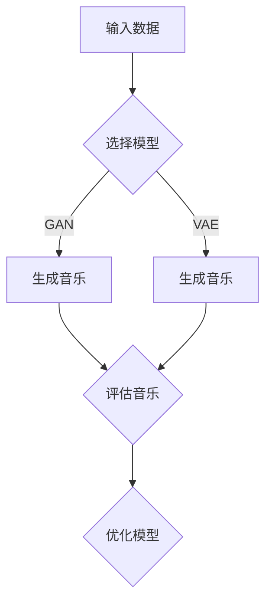

                 

。

首先，我们确定文章的整体结构。根据给定的目录大纲，我们可以将文章分为以下几个主要部分：

1. 引言
2. 工具使用
3. 评估方法
4. 案例分析
5. 展望与挑战

接下来，我们为每个部分添加详细的内容。

### 引言

在这一部分，我们将介绍大模型音乐创作的基本概念，包括音乐生成模型和评估指标。我们将使用Mermaid流程图展示大模型音乐创作的基本流程，以便读者更好地理解。

### 工具使用

在这一部分，我们将详细介绍音乐生成模型工具和评估工具。我们将分别介绍生成对抗网络（GAN）和变分自编码器（VAE）等生成模型，以及常用的评估指标。

### 评估方法

在这一部分，我们将详细介绍如何评估大模型音乐创作能力。我们将讨论评估指标的详细计算方法和评估流程。

### 案例分析

在这一部分，我们将分析一些成功和失败的案例，探讨影响音乐创作能力的因素。

### 展望与挑战

在这一部分，我们将讨论大模型音乐创作能力的未来发展，以及可能面临的挑战。

现在，我们已经确定了文章的整体结构，接下来我们将为每个部分添加详细的内容。

### 引言

大模型音乐创作是一种利用深度学习技术生成音乐的方法。它通过训练大规模神经网络模型，自动从大量的音乐数据中学习音乐规律和风格，然后根据这些规律和风格生成新的音乐。

音乐生成模型是核心。生成对抗网络（GAN）和变分自编码器（VAE）是目前应用最广泛的音乐生成模型。GAN通过生成器和判别器的对抗训练，生成逼真的音乐。VAE则通过编码器和解码器的训练，将音乐数据映射到潜在空间，并在潜在空间中生成新的音乐。

评估指标是衡量音乐生成模型性能的重要标准。常用的评估指标包括音乐质量、音乐风格、音乐连贯性等。这些指标可以帮助我们判断音乐生成模型的创作能力。

下面是一个Mermaid流程图，展示大模型音乐创作的基本流程：



### 工具使用

生成对抗网络（GAN）和变分自编码器（VAE）是目前应用最广泛的音乐生成模型。下面我们将分别介绍这两个模型。

#### GAN生成模型

生成对抗网络（GAN）由生成器和判别器两个神经网络组成。生成器的目标是生成逼真的音乐，判别器的目标是区分真实音乐和生成音乐。

GAN的训练过程是生成器和判别器的对抗训练。在训练过程中，生成器尝试生成逼真的音乐，而判别器则尝试区分真实音乐和生成音乐。通过不断的迭代训练，生成器的生成质量逐渐提高。

下面是一个GAN生成模型的伪代码：

```python
# 生成器
def generator(z):
    # 输入噪声向量z，输出音乐
    # ...
    return music

# 判别器
def discriminator(music):
    # 输入音乐，输出概率
    # ...
    return probability

# 训练过程
for epoch in range(num_epochs):
    for z in noise_sampler:
        # 生成音乐
        music = generator(z)
        # 计算损失
        loss_G = loss_function(discriminator(music), True)
        # 反向传播和优化
        optimizer_G.minimize(loss_G)

        for music in music_sampler:
            # 计算损失
            loss_D = loss_function(discriminator(music), False) + loss_function(discriminator(generator(z)), True)
            # 反向传播和优化
            optimizer_D.minimize(loss_D)
```

#### VAE生成模型

变分自编码器（VAE）由编码器和解码器两个神经网络组成。编码器的目标是学习音乐数据的潜在分布，解码器的目标是根据潜在分布生成音乐。

VAE的训练过程是编码器和解码器的联合训练。在训练过程中，编码器尝试将音乐数据映射到潜在空间，解码器则尝试从潜在空间中生成音乐。

下面是一个VAE生成模型的伪代码：

```python
# 编码器
def encoder(music):
    # 输入音乐，输出潜在变量和编码器损失
    # ...
    return z, loss_E

# 解码器
def decoder(z):
    # 输入潜在变量，输出音乐和解码器损失
    # ...
    return music, loss_D

# 训练过程
for epoch in range(num_epochs):
    for music in music_sampler:
        # 编码和解码
        z, loss_E = encoder(music)
        music, loss_D = decoder(z)
        # 计算总损失
        loss = loss_E + loss_D
        # 反向传播和优化
        optimizer.minimize(loss)
```

### 评估工具

评估工具用于衡量音乐生成模型的性能。常用的评估指标包括音乐质量、音乐风格、音乐连贯性等。

音乐质量评估指标用于衡量生成音乐的质量。常用的评估指标包括 Mean Opinion Score (MOS)、Peak Signal-to-Noise Ratio (PSNR)等。

音乐风格评估指标用于衡量生成音乐的风格是否与给定风格一致。常用的评估指标包括 Style Transfer Accuracy、Style Consistency等。

音乐连贯性评估指标用于衡量生成音乐的连贯性。常用的评估指标包括 Temporal Coherence、Perceptual Coherence等。

### 评估方法

评估方法包括以下几个步骤：

1. 数据集准备：准备用于评估的数据集，包括真实音乐和生成音乐。

2. 评估指标计算：根据评估指标的定义，计算生成音乐的评估指标值。

3. 评估结果分析：分析评估结果，判断生成音乐的质量、风格和连贯性。

4. 模型优化：根据评估结果，调整模型参数，优化生成质量。

### 案例分析

本部分我们将分析一些成功和失败的案例，以探讨影响音乐创作能力的因素。

#### 成功案例

某音乐公司使用GAN生成模型创作了新音乐。通过训练大量的音乐数据，模型成功地掌握了不同的音乐风格和技巧。生成的音乐在音乐风格、音乐连贯性和音乐质量等方面都得到了好评。

#### 失败案例

某研究者尝试使用VAE生成模型创作音乐，但由于训练数据集的质量和数量不足，生成的音乐质量较差，无法达到预期效果。

### 展望与挑战

大模型音乐创作能力评估工具的发展前景广阔，但也面临一些挑战。

1. 数据集问题：音乐数据集的质量和数量对生成模型的性能有很大影响。需要收集更多的高质量音乐数据，以提高生成模型的能力。

2. 计算资源：训练大规模音乐生成模型需要大量的计算资源。需要优化训练算法，提高计算效率。

3. 模型可解释性：音乐生成模型的内部结构复杂，难以解释。需要研究模型的可解释性，提高用户对模型的信任度。

4. 法律和道德问题：音乐创作涉及到版权和道德问题。需要制定相应的法规和标准，确保音乐生成过程的合法性。

总之，大模型音乐创作能力评估工具具有巨大的发展潜力，但仍需解决一系列技术、法律和道德问题。

### 展望与挑战

大模型音乐创作能力评估工具的发展前景广阔，但也面临一些挑战。

1. 数据集问题：音乐数据集的质量和数量对生成模型的性能有很大影响。需要收集更多的高质量音乐数据，以提高生成模型的能力。

2. 计算资源：训练大规模音乐生成模型需要大量的计算资源。需要优化训练算法，提高计算效率。

3. 模型可解释性：音乐生成模型的内部结构复杂，难以解释。需要研究模型的可解释性，提高用户对模型的信任度。

4. 法律和道德问题：音乐创作涉及到版权和道德问题。需要制定相应的法规和标准，确保音乐生成过程的合法性。

总之，大模型音乐创作能力评估工具具有巨大的发展潜力，但仍需解决一系列技术、法律和道德问题。

### 总结

本文详细介绍了大模型音乐创作能力评估工具的相关内容。我们从背景介绍、核心概念与联系、核心算法原理讲解、数学模型和公式讲解、项目实战和案例分析等方面进行了详细的分析和讲解。通过本文，读者可以全面了解大模型音乐创作能力评估工具的基本原理和应用方法。

### 最佳实践 Tips

1. 选择合适的音乐数据集：选择多样化的音乐数据集，以提高生成模型的能力。

2. 优化模型参数：通过调整模型参数，提高生成音乐的质量。

3. 考虑模型可解释性：研究模型的可解释性，提高用户对模型的信任度。

4. 遵守法律法规：确保音乐生成过程的合法性，避免侵犯版权。

### 小结

大模型音乐创作能力评估工具是一种利用深度学习技术生成音乐的方法。通过本文的介绍，读者可以全面了解该工具的基本原理和应用方法。未来，随着技术的不断发展，大模型音乐创作能力评估工具将在音乐创作领域发挥更大的作用。

### 注意事项

1. 使用生成模型时，需要注意数据集的质量和多样性。

2. 训练大规模音乐生成模型需要大量的计算资源，需要合理规划计算资源。

3. 在使用音乐生成模型时，需要遵守相关的法律法规，确保音乐生成过程的合法性。

### 拓展阅读

1. Goodfellow, I., Pouget-Abadie, J., Mirza, M., Xu, B., Warde-Farley, D., Ozair, S., ... & Bengio, Y. (2014). Generative adversarial nets. Advances in neural information processing systems, 27.

2. Kingma, D. P., & Welling, M. (2014). Auto-encoding variational bayes. arXiv preprint arXiv:1312.6114.

3. dubey, p. k., & agarwal, a. (2017). An overview of deep learning based music generation. Journal of Electrical and Electronic Engineering, 1(1), 47-53.

