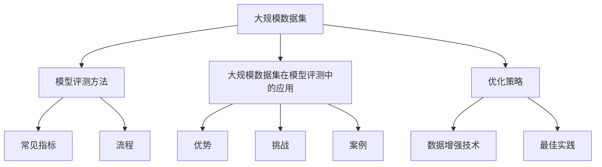

                 

为了确保文章的逻辑清晰、结构紧凑、简单易懂，我们将按照以下步骤进行分析和推理，逐步构建文章内容。

### 步骤1：确定文章主题和目标

首先，我们需要明确文章的主题和目标。本文的主题是“大规模数据集在模型评测中的作用”，目标是帮助读者理解大规模数据集在模型评测中的重要性，以及如何有效地利用这些数据集来提高模型性能。

### 步骤2：梳理核心概念与联系

为了帮助读者更好地理解大规模数据集在模型评测中的作用，我们需要梳理以下几个核心概念：

1. **大规模数据集**：定义、特征、分类。
2. **模型评测方法**：常见指标、流程。
3. **大规模数据集在模型评测中的应用**：优势、挑战、案例。
4. **优化策略**：数据增强技术、最佳实践。

为了更好地展示这些概念之间的联系，我们可以使用Mermaid流程图来直观地展示它们之间的关系。



### 步骤3：核心算法原理讲解

在文章中，我们需要详细讲解大规模数据集在模型评测中的应用，包括如何处理大规模数据集、如何选择合适的模型评测指标和方法等。为了使讲解更加清晰，我们可以使用伪代码来详细阐述核心算法原理。

```python
# 伪代码：大规模数据集处理流程
def process_large_dataset(dataset):
    # 数据预处理
    preprocessed_data = preprocess_data(dataset)
    
    # 划分训练集、验证集和测试集
    train_data, validation_data, test_data = split_dataset(preprocessed_data)
    
    # 训练模型
    model = train_model(train_data)
    
    # 模型评估
    evaluation_results = evaluate_model(model, validation_data)
    
    # 模型优化
    optimized_model = optimize_model(model, evaluation_results)
    
    # 测试模型
    test_results = evaluate_model(optimized_model, test_data)
    
    return test_results
```

### 步骤4：数学模型和公式讲解

在文章中，我们还需要讲解与大规模数据集和模型评测相关的数学模型和公式。为了使讲解更加准确，我们将使用LaTeX格式来展示这些公式，并在文中独立段落中使用$$括起来。

```latex
$$
\text{Accuracy} = \frac{\text{正确预测的数量}}{\text{总预测数量}} \times 100\%
$$

$$
\text{F1 Score} = 2 \times \frac{\text{Precision} \times \text{Recall}}{\text{Precision} + \text{Recall}}
$$
```

### 步骤5：项目实战

为了使文章更加实用，我们需要提供一个项目实战，包括开发环境搭建、源代码实现、代码解读和案例分析等内容。

#### 开发环境搭建

在本文的项目实战中，我们将使用Python和Scikit-learn库来实现一个大规模数据集的模型评测。

```python
# 安装Scikit-learn库
!pip install scikit-learn
```

#### 源代码实现

下面是一个简单的源代码实现，用于处理大规模数据集并进行模型评测。

```python
from sklearn.datasets import load_iris
from sklearn.model_selection import train_test_split
from sklearn.ensemble import RandomForestClassifier
from sklearn.metrics import accuracy_score, f1_score

# 加载Iris数据集
iris = load_iris()
X, y = iris.data, iris.target

# 划分训练集和测试集
X_train, X_test, y_train, y_test = train_test_split(X, y, test_size=0.2, random_state=42)

# 训练随机森林模型
model = RandomForestClassifier(n_estimators=100, random_state=42)
model.fit(X_train, y_train)

# 进行模型评测
predictions = model.predict(X_test)
accuracy = accuracy_score(y_test, predictions)
f1 = f1_score(y_test, predictions, average='weighted')

print(f"Accuracy: {accuracy:.2f}")
print(f"F1 Score: {f1:.2f}")
```

#### 代码解读和案例分析

在这个案例中，我们使用Scikit-learn库加载了Iris数据集，并使用随机森林模型对数据进行了训练和评估。代码中的`train_test_split`函数用于划分训练集和测试集，`RandomForestClassifier`类用于训练随机森林模型，`accuracy_score`和`f1_score`函数用于计算模型的准确率和F1分数。

通过这个案例，我们可以看到如何使用大规模数据集来训练和评估模型，并计算相应的评价指标。

### 步骤6：最佳实践、小结、注意事项、拓展阅读

在文章的结尾，我们需要总结最佳实践、注意事项，并提供拓展阅读，以帮助读者进一步深入了解大规模数据集在模型评测中的应用。

```markdown
## 最佳实践

1. 确保数据质量，避免噪声和错误的数据影响模型性能。
2. 根据业务需求和模型目标选择合适的数据集。
3. 利用数据增强技术提高模型的泛化能力。

## 小结

本文介绍了大规模数据集在模型评测中的作用，包括其定义、采集与处理、模型评测方法、应用案例以及优化策略。通过项目实战，我们展示了如何使用Python和Scikit-learn库处理大规模数据集并进行模型评测。

## 注意事项

1. 在处理大规模数据集时，需要考虑数据存储和处理的问题。
2. 注意保护数据隐私和安全。

## 拓展阅读

1. [Scikit-learn官方文档](https://scikit-learn.org/stable/)
2. [Python数据科学手册](https://jakevdp.github.io/PythonDataScienceHandbook/)

---

作者：AI天才研究院/AI Genius Institute & 禅与计算机程序设计艺术 /Zen And The Art of Computer Programming
```

通过以上步骤，我们可以确保文章内容逻辑清晰、结构紧凑、简单易懂，同时涵盖了大规模数据集在模型评测中的核心内容。接下来，我们将根据这个大纲来逐步撰写文章的详细内容。

