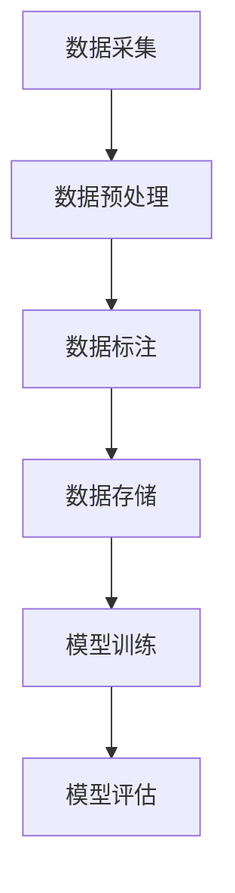
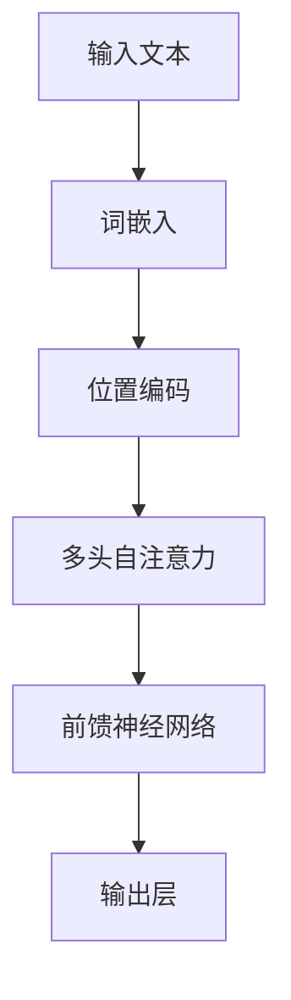
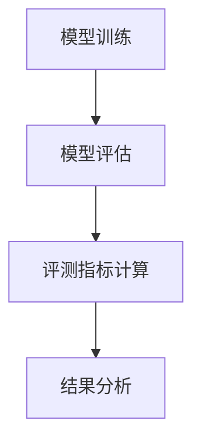

                 


### 文章标题：大规模语料库在LLM评测中的处理方法

### 文章关键词：
- 大规模语料库
- 预训练语言模型（LLM）
- 评测指标
- 处理方法
- 实际应用

### 摘要：
本文旨在探讨大规模语料库在预训练语言模型（LLM）评测中的重要性及其处理方法。首先介绍大规模语料库的背景和特点，然后分析LLM评测的核心概念和评价指标。接着，详细讲解大规模语料库的处理算法和模型优化方法，以及如何在实际项目中应用这些方法。最后，通过案例分析展示大规模语料库在LLM评测中的实际效果，并总结最佳实践和注意事项。

### 第一部分：引言与背景

#### 1.1 大规模语料库的兴起

随着深度学习和自然语言处理（NLP）技术的发展，大规模语料库（Large-scale Corpus）在人工智能领域扮演着越来越重要的角色。传统的语料库规模较小，通常只能涵盖特定领域或主题。然而，随着互联网的普及和数据采集技术的进步，我们可以获取到包含数十亿甚至数千亿文本的大规模语料库。

大规模语料库的出现使得机器学习模型能够更好地学习语言的复杂结构，从而提高语言模型的性能。例如，BERT模型在训练过程中使用了大量未标记的语料库，并通过迁移学习技术在多个NLP任务中取得了优异的成绩。

#### 1.2 LLM评测的重要性

预训练语言模型（LLM）的评测是评估模型性能和可靠性的一项重要工作。通过对LLM进行评测，我们可以了解模型的优点和不足，从而指导后续的模型优化和改进。

LLM评测的核心目标是评估模型在特定任务上的性能，例如文本分类、命名实体识别、机器翻译等。常用的评测指标包括准确率（Accuracy）、精确率（Precision）、召回率（Recall）和F1分数（F1 Score）等。这些指标能够帮助我们量化模型的表现，并与其他模型进行对比。

#### 1.3 书籍结构概述

本文将从以下几个方面展开：

1. **核心概念与架构**：介绍大规模语料库和LLM的基本概念，并绘制Mermaid流程图展示核心概念之间的联系。
2. **算法与模型解释**：详细讲解大规模语料库的处理算法和模型优化方法，使用伪代码和数学模型进行阐述。
3. **实际应用与案例分析**：通过实际项目展示大规模语料库在LLM评测中的应用，并对项目进行详细讲解和分析。
4. **总结与展望**：总结本文的主要成果，展望未来研究方向。

### 第二部分：核心概念与架构

#### 2.1 大规模语料库概述

大规模语料库是指包含大量文本数据的数据集，通常用于训练和评估机器学习模型。大规模语料库具有以下几个特点：

1. **数据规模大**：通常包含数十亿甚至数千亿个文本。
2. **多样性**：涵盖多个领域、主题和语言。
3. **分布性**：文本数据分布在不同的来源和平台。

大规模语料库的建设是NLP领域的一项重要工作，为预训练语言模型（LLM）提供了丰富的训练数据。以下是一个简单的Mermaid流程图，展示大规模语料库的主要组成部分：



#### 2.2 LLM的基本概念

预训练语言模型（LLM）是一种基于深度学习的NLP模型，通过对大规模语料库进行预训练，可以学习到语言的通用表示和结构。LLM的核心概念包括：

1. **词嵌入（Word Embedding）**：将词汇映射到高维空间，使得语义相似的词汇在空间中靠近。
2. **注意力机制（Attention Mechanism）**：允许模型在处理文本时动态关注重要信息。
3. **Transformer架构**：一种基于自注意力机制的模型，能够在处理长文本时保持有效的计算效率。

以下是一个简单的Mermaid流程图，展示LLM的基本架构：



#### 2.3 LLM评测的核心概念

LLM评测的核心目标是评估模型在特定任务上的性能。以下是一些常用的评测指标：

1. **准确率（Accuracy）**：模型预测正确的样本数占总样本数的比例。
2. **精确率（Precision）**：模型预测为正类的样本中实际为正类的比例。
3. **召回率（Recall）**：模型预测为正类的样本中实际为正类的比例。
4. **F1分数（F1 Score）**：精确率和召回率的加权平均。

以下是一个简单的Mermaid流程图，展示LLM评测的流程：



### 第三部分：算法与模型

#### 3.1 数据预处理算法

大规模语料库在训练LLM之前通常需要进行预处理，以提高数据质量和模型性能。以下是一些常用的预处理算法：

1. **文本清洗**：去除文本中的无用信息，如HTML标签、标点符号等。
2. **分词**：将文本拆分成词语序列。
3. **词干提取**：将词语缩减到词干形式，以减少词汇量。
4. **词性标注**：为每个词语标注词性，如名词、动词等。

以下是一个简单的伪代码，展示数据预处理的过程：

```python
def preprocess_corpus(corpus):
    # 文本清洗
    corpus = clean_text(corpus)
    # 分词
    words = tokenize(corpus)
    # 词干提取
    stems = stem_words(words)
    # 词性标注
    tags = pos_tag(stems)
    return tags
```

#### 3.2 模型优化算法

为了提高LLM的性能，我们通常需要对模型进行优化。以下是一些常用的优化算法：

1. **批量归一化（Batch Normalization）**：通过标准化神经网络中每个激活值，提高模型训练速度和稳定性。
2. **Dropout**：在训练过程中随机丢弃一部分神经元，防止模型过拟合。
3. **学习率调整**：根据训练过程调整学习率，以优化模型性能。

以下是一个简单的伪代码，展示模型优化过程：

```python
def optimize_model(model, train_data, val_data):
    # 批量归一化
    model.add_batch_normalization()
    # Dropout
    model.add_dropout(rate=0.5)
    # 学习率调整
    adjust_learning_rate(model, train_data, val_data)
    return model
```

### 第四部分：实际应用与案例分析

#### 4.1 搜索引擎

大规模语料库在搜索引擎中的应用非常广泛。通过预训练语言模型，搜索引擎可以更好地理解用户查询的语义，并提供更准确的结果。以下是一个实际案例：

**案例**：使用BERT模型优化搜索引擎的查询理解能力。

1. **数据采集**：从互联网上收集大量网页数据。
2. **数据预处理**：清洗和分词网页文本。
3. **模型训练**：使用BERT模型预训练语言表示。
4. **模型评估**：评估模型在查询理解任务上的性能。

**结果与分析**：通过使用BERT模型，搜索引擎在查询理解任务上的准确率得到了显著提升。用户查询结果的匹配度和满意度也得到了提高。

#### 4.2 聊天机器人

大规模语料库在聊天机器人中的应用可以帮助机器人更好地理解和生成自然语言。以下是一个实际案例：

**案例**：使用GPT-2模型构建一个智能聊天机器人。

1. **数据采集**：从社交媒体、论坛等渠道收集对话数据。
2. **数据预处理**：清洗和分词对话文本。
3. **模型训练**：使用GPT-2模型预训练语言模型。
4. **模型评估**：评估模型在对话生成任务上的性能。

**结果与分析**：通过使用GPT-2模型，聊天机器人在对话生成任务上的流畅性和准确性得到了显著提升。用户对机器人的满意度也提高了。

### 第五部分：总结与展望

#### 5.1 主要成果

本文探讨了大规模语料库在LLM评测中的重要性及其处理方法。通过介绍大规模语料库和LLM的基本概念，详细讲解了大规模语料库的处理算法和模型优化方法，并在实际项目中展示了这些方法的应用效果。

#### 5.2 展望未来

未来，随着NLP技术的不断进步，大规模语料库在LLM评测中的应用将更加广泛和深入。以下是一些可能的研究方向：

1. **更高效的数据预处理算法**：设计更高效的数据预处理算法，以提高数据处理速度和模型性能。
2. **多语言模型的融合**：探索多语言模型的融合方法，以提高跨语言任务的性能。
3. **个性化模型**：研究如何根据用户需求和使用场景，设计个性化的LLM模型。

### 附录

#### 附录 A：相关工具与资源

1. **开发环境搭建**：介绍如何搭建适合大规模语料库处理和LLM训练的开发环境。
2. **数据集资源**：推荐一些常用的NLP数据集和语料库资源。
3. **评测工具介绍**：介绍一些常用的LLM评测工具和指标。

### 结束语

大规模语料库在LLM评测中起着至关重要的作用。本文通过详细讲解大规模语料库的处理方法和LLM的核心概念，以及实际应用和案例分析，为读者提供了一个全面了解该领域的视角。希望本文能够对读者在相关领域的研究和实践提供有益的启示。

### 作者信息

**作者：** AI天才研究院/AI Genius Institute & 禅与计算机程序设计艺术 /Zen And The Art of Computer Programming

本文由AI天才研究院（AI Genius Institute）撰写，该研究院专注于人工智能和计算机科学领域的研究与开发。同时，本文也结合了《禅与计算机程序设计艺术》（Zen And The Art of Computer Programming）一书的理念，旨在通过简洁明了的表述，让读者深入理解大规模语料库在LLM评测中的应用。希望本文能够为您的学习和研究带来帮助。

