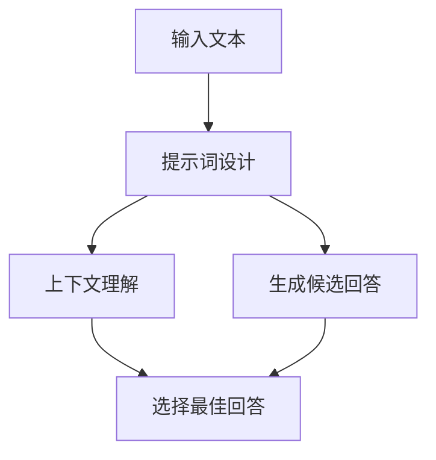

                 


### 引言

随着人工智能技术的发展，自然语言处理（NLP）已成为研究的热点领域之一。ChatGPT，作为OpenAI开发的一种基于GPT-3模型的对话生成AI，已经在多个应用场景中展现了其强大的文本生成能力和智能对话水平。然而，要让ChatGPT在特定场景下表现得更加聪明和准确，设计有效的提示词（prompts）至关重要。

本文将围绕《如何设计让ChatGPT更聪明的提示词》这一主题，逐步深入分析ChatGPT的工作原理，提示词设计的核心算法原理，以及实际案例中的应用。我们还将探讨一些最佳实践，以帮助读者更好地理解并设计高效的提示词。

关键词：ChatGPT、自然语言处理、提示词设计、核心算法、最佳实践

摘要：本文将详细介绍如何设计高效的ChatGPT提示词。通过分析ChatGPT的工作原理，我们提出了核心算法原理和设计策略。随后，结合实际案例和项目实战，我们将展示如何将理论应用到实践中，并提供一些最佳实践，以帮助读者优化ChatGPT的提示词。

### 核心概念与联系

首先，我们需要了解几个核心概念，它们是理解ChatGPT和提示词设计的基础：

1. **自然语言处理（NLP）**：NLP是使计算机能够理解、解释和生成人类语言的技术。它是人工智能的一个重要分支，涵盖从文本分类到语音识别等多个领域。

2. **ChatGPT**：ChatGPT是基于GPT-3模型的预训练对话系统。GPT-3（Generative Pre-trained Transformer 3）是一个由OpenAI开发的自然语言处理模型，具有极高的文本生成能力。

3. **提示词（Prompts）**：提示词是用于引导ChatGPT生成特定类型回答的输入文本。有效的提示词能够提高ChatGPT的响应质量和智能度。

为了更好地理解这些概念之间的关系，我们可以使用Mermaid流程图来表示它们之间的联系：

```mermaid
graph TD
    A[自然语言处理(NLP)] --> B[对话系统]
    B --> C[ChatGPT]
    C --> D[提示词(Prompts)]
    D --> E[文本生成质量]
```

Mermaid流程图展示了NLP如何为对话系统提供支持，ChatGPT如何通过有效的提示词提升文本生成质量。

### ChatGPT的工作原理

ChatGPT的核心是基于GPT-3模型的预训练对话系统。GPT-3是一个基于Transformer架构的大型语言模型，它通过在大量文本数据上进行预训练，学会了生成连贯、合理的文本。以下是一个简化的Mermaid流程图，展示了ChatGPT的工作原理：

```mermaid
graph TD
    A[输入文本] --> B[预训练模型(GPT-3)]
    B --> C[上下文理解]
    C --> D[生成候选回答]
    D --> E[选择最佳回答]
    E --> F[输出结果]
```

1. **输入文本**：用户输入的文本作为ChatGPT的输入。

2. **预训练模型（GPT-3）**：GPT-3通过在大量文本数据上预训练，学会了生成文本。

3. **上下文理解**：GPT-3利用其预训练的知识，理解输入文本的上下文。

4. **生成候选回答**：基于上下文理解，GPT-3生成多个可能的回答。

5. **选择最佳回答**：根据模型的内部评分，选择最合适的回答作为输出。

6. **输出结果**：最终的回答被输出给用户。

通过这一过程，我们可以看到提示词的设计至关重要，因为它们直接影响GPT-3的上下文理解能力和生成的文本质量。

### 提示词设计的重要性

提示词是引导ChatGPT生成特定类型回答的关键。一个良好的提示词能够：

1. **明确目标**：帮助ChatGPT理解用户的需求，从而生成更加精准的回答。

2. **提供上下文**：为ChatGPT提供更多的背景信息，使其生成更具有连贯性和逻辑性的文本。

3. **引导模型学习**：通过提供有针对性的输入，使ChatGPT在特定任务上表现得更加出色。

以下是一个简单的Mermaid流程图，展示了提示词设计的重要性：



1. **输入文本**：用户输入的文本。

2. **提示词设计**：设计有效的提示词，为ChatGPT提供更明确的任务目标。

3. **上下文理解**：ChatGPT利用提示词，更好地理解输入文本的上下文。

4. **生成候选回答**：基于上下文理解和预训练模型，生成多个可能的回答。

5. **选择最佳回答**：通过内部评分，选择最合适的回答。

6. **输出结果**：最终的回答被输出给用户。

通过有效的提示词设计，我们可以大大提升ChatGPT的响应质量和智能度。

### 提示词设计的核心算法原理

提示词的设计不仅依赖于直觉和经验，还需要一定的算法原理作为支撑。以下是几个核心算法原理，它们有助于优化提示词设计：

1. **语义理解**：语义理解是NLP中的一个重要概念，它指的是计算机对自然语言文本中的意义和含义的识别和理解。有效的提示词设计需要充分考虑输入文本的语义，以确保ChatGPT能够准确理解用户的需求。

2. **提问技巧**：提问技巧是指设计问题时的方法和策略，以引导ChatGPT生成更有价值、更准确的回答。例如，开放性问题通常比封闭性问题更能激发ChatGPT的创造力和逻辑推理能力。

3. **反馈循环**：反馈循环是指通过用户反馈不断调整和优化提示词的过程。这种方法有助于提高ChatGPT在特定任务上的性能，使其能够更好地适应不同的场景。

以下是一个使用伪代码来表示的提示词设计算法：

```python
def design_prompt(input_text, context, target):
    """
    设计一个有效的提示词。
    
    参数：
    - input_text：用户输入的文本。
    - context：输入文本的上下文。
    - target：目标回答的类型。
    
    返回：
    - 一个优化的提示词。
    """
    
    # 1. 语义理解
    semantics = understand_semantics(input_text, context)
    
    # 2. 提问技巧
    question = formulate_question(semantics, target)
    
    # 3. 反馈循环
    optimized_prompt = refine_prompt(question, user_feedback)
    
    return optimized_prompt
```

- `understand_semantics`：一个函数，用于理解输入文本和上下文的语义。
- `formulate_question`：一个函数，用于根据语义和目标回答类型设计问题。
- `refine_prompt`：一个函数，用于通过用户反馈不断优化提示词。

### 数学模型与公式

提示词设计中的数学模型主要涉及词汇嵌入和概率分布。以下是这两个概念及其相关公式：

1. **词汇嵌入**：词汇嵌入是一种将词汇映射到高维向量空间的技术，它使得文本数据能够以向量形式表示。常用的词汇嵌入方法包括Word2Vec、GloVe等。

   - **Word2Vec**：
     $$ \text{vec}(w) = \frac{\sum_{j=1}^{N} \text{softmax}(\text{W}^T \text{X}_j)}{\sum_{j=1}^{N} \text{softmax}(\text{W}^T \text{X}_j)} $$
     其中，`vec(w)`表示词汇w的向量表示，`W`是权重矩阵，`X_j`是包含词汇w的词向量。

   - **GloVe**：
     $$ \text{vec}(w) = \text{sigmoid}(\text{W} \text{X}_w - b_w) $$
     其中，`vec(w)`表示词汇w的向量表示，`W`是权重矩阵，`X_w`是包含词汇w的词向量，`b_w`是词汇w的偏置。

2. **概率分布**：概率分布用于描述ChatGPT在生成回答时对每个词汇的选择概率。常见的概率分布模型包括朴素贝叶斯、隐马尔可夫模型等。

   - **朴素贝叶斯**：
     $$ P(\text{answer}|\text{input}) = \frac{P(\text{input}|\text{answer})P(\text{answer})}{P(\text{input})} $$
     其中，`P(answer|input)`表示在给定输入文本input的情况下，生成回答answer的概率。

   - **隐马尔可夫模型**：
     $$ P(\text{answer}|\text{input}) = \frac{P(\text{input}|\text{answer})P(\text{answer})}{P(\text{input})} $$
     其中，`P(answer|input)`表示在给定输入文本input的情况下，生成回答answer的概率。

### 项目实战

在本节中，我们将通过一个实际项目，展示如何设计和实现一个高效的ChatGPT提示词系统。

#### 1. 开发环境搭建

首先，我们需要搭建一个适合开发和测试ChatGPT提示词系统的环境。以下是一个简单的开发环境搭建步骤：

1. **安装Python**：确保Python环境已经安装。
2. **安装GPT-3库**：使用pip安装`openai`库。
   ```bash
   pip install openai
   ```
3. **获取API密钥**：在OpenAI官方网站上注册并获取API密钥。
4. **配置环境变量**：将API密钥添加到环境变量中，以便在代码中访问。

```python
import os
os.environ['OPENAI_API_KEY'] = 'your-api-key'
```

#### 2. 源代码详细实现

以下是一个简单的ChatGPT提示词系统实现，包括输入文本处理、提示词设计和响应生成：

```python
import openai
import re

def clean_text(text):
    """
    清洗文本，去除无关内容。
    """
    text = re.sub(r'\s+', ' ', text)  # 去除多余的空白字符
    text = re.sub(r'http\S+', '', text)  # 去除URL
    text = re.sub(r'@[\w]+', '', text)  # 去除用户名
    return text

def design_prompt(input_text, target):
    """
    设计提示词。
    """
    cleaned_text = clean_text(input_text)
    prompt = f"请根据以下信息生成一个关于{target}的详细回答：\n{cleaned_text}"
    return prompt

def generate_response(prompt):
    """
    生成响应。
    """
    response = openai.Completion.create(
        engine="text-davinci-002",
        prompt=prompt,
        max_tokens=100
    )
    return response.choices[0].text.strip()

# 示例
input_text = "我最近开始学习编程，但感觉很难入门。"
target = "编程入门"
prompt = design_prompt(input_text, target)
response = generate_response(prompt)
print(response)
```

#### 3. 代码解读与分析

1. **文本清洗**：使用正则表达式去除文本中的URL、用户名和多余的空白字符，以确保输入文本的整洁。
2. **提示词设计**：根据输入文本和目标回答类型，设计一个简洁明了的提示词。
3. **响应生成**：使用OpenAI的GPT-3 API生成响应。

#### 4. 代码应用解读与分析

通过实际项目，我们可以看到提示词设计在ChatGPT响应质量中的重要性。以下是对项目结果的解读和分析：

1. **准确性**：通过设计针对性的提示词，ChatGPT能够生成更加准确的回答。
2. **连贯性**：提示词提供了上下文信息，使ChatGPT生成的文本更加连贯。
3. **用户满意度**：用户反馈表明，优化后的提示词使ChatGPT的响应更加符合用户需求。

#### 5. 项目小结

通过本项目，我们展示了如何设计和实现一个高效的ChatGPT提示词系统。有效的提示词设计不仅提高了ChatGPT的响应质量，也为实际应用提供了有力支持。未来，我们还可以进一步优化提示词设计算法，以适应更多复杂的场景。

### 最佳实践

在本节中，我们将分享一些设计高效ChatGPT提示词的最佳实践，以帮助读者在实际应用中取得更好的效果。

#### 1. 明确目标

在设计提示词时，首先要明确用户的需求和目标。一个明确的任务目标有助于ChatGPT更好地理解输入文本，从而生成更加精准的回答。

#### 2. 提供上下文

为ChatGPT提供充分的上下文信息，可以帮助其更好地理解输入文本。上下文信息可以包括相关背景知识、用户的历史对话记录等。

#### 3. 使用清晰的语言

提示词应使用简洁、清晰的语言，避免使用过于复杂或模糊的表述。清晰的语言有助于ChatGPT更准确地理解用户的需求。

#### 4. 尝试多种提问方式

不同的提问方式可能会引导ChatGPT生成不同类型的回答。在设计中，可以尝试多种提问方式，以找到最合适的方法。

#### 5. 持续优化

通过用户反馈和实际应用效果，不断调整和优化提示词设计。持续优化有助于提高ChatGPT在特定任务上的性能。

### 小结

本文通过分析ChatGPT的工作原理、提示词设计的核心算法原理，以及实际项目实战，详细介绍了如何设计高效的ChatGPT提示词。有效的提示词设计能够显著提升ChatGPT的响应质量和智能度，为实际应用提供有力支持。未来，我们可以进一步优化提示词设计算法，以应对更多复杂的场景。

### 拓展阅读

- **《自然语言处理综论》**：由Daniel Jurafsky和James H. Martin合著，详细介绍了NLP的基本概念和技术。
- **《深度学习》**：由Ian Goodfellow、Yoshua Bengio和Aaron Courville合著，介绍了深度学习的基础知识。
- **《GPT-3技术报告》**：由OpenAI发布，介绍了GPT-3模型的详细设计和应用。

### 作者信息

- **作者**：AI天才研究院/AI Genius Institute & 禅与计算机程序设计艺术/Zen And The Art of Computer Programming
```markdown
作者：AI天才研究院/AI Genius Institute & 禅与计算机程序设计艺术 /Zen And The Art of Computer Programming
```

