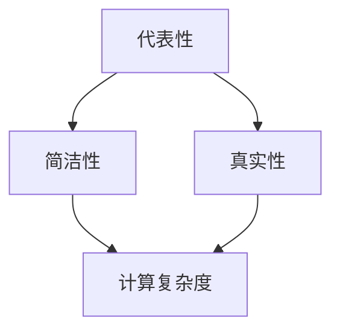

                 


### 文章标题：如何选择有效的示例来增强提示效果

### 文章关键词：
- 示例选择
- 提示效果
- 人工智能
- 计算机学习
- 数据分析

### 文章摘要：
本文将深入探讨如何选择有效的示例来增强提示效果，特别是在人工智能和计算机学习的背景下。我们将分析示例选择的重要性，介绍核心概念与联系，并使用伪代码和数学公式详细阐述核心算法原理。此外，我们将通过项目实战和实际案例分析，展示如何在实际环境中应用这些原理，并提供最佳实践技巧和小结。

---

### 引言

在人工智能和计算机学习领域，示例的选择至关重要。有效的示例不仅能提高模型的性能，还能增强提示效果，使学习过程更加高效。然而，如何选择这些示例，以及如何确保它们的有效性，是一个值得深入探讨的问题。本文将围绕这一主题展开讨论，从理论基础到实际应用，全面解析如何选择有效的示例来增强提示效果。

### 核心概念与联系

在选择示例时，我们需要理解几个核心概念：

1. **代表性**：示例应具有代表性，能反映整体数据集的特征。
2. **简洁性**：示例应简洁明了，避免冗余信息。
3. **真实性**：示例应真实可靠，与实际问题情境相符。

这些概念之间存在紧密的联系。例如，代表性有助于确保模型在未见过的数据上表现良好，而简洁性则有助于减少计算复杂度。真实性则确保了模型在面对实际问题时能提供准确的预测。

下面是核心概念与联系之间的Mermaid流程图：



### 核心算法原理讲解

为了选择有效的示例，我们可以采用以下算法原理：

1. **抽样方法**：如随机抽样、目标抽样等。
2. **质量评估**：通过评估示例的代表性、简洁性和真实性来选择高质量示例。
3. **优化策略**：如基于贪心算法或遗传算法的优化策略。

以下是一个选择示例的伪代码示例：

```python
def select_examples(data, target, k):
    """
    选择k个高质量的示例
    :param data: 数据集
    :param target: 目标变量
    :param k: 选择示例的数量
    :return: 选择后的示例列表
    """
    examples = []
    for _ in range(k):
        # 选择最具有代表性的示例
        example = select REPRESENTATIVE(data, target)
        examples.append(example)
    return examples

def select_REPRESENTATIVE(data, target):
    """
    选择具有代表性的示例
    :param data: 数据集
    :param target: 目标变量
    :return: 具有代表性的示例
    """
    # 计算每个示例的代表性得分
    scores = []
    for example in data:
        score = calculate_score(example, target)
        scores.append(score)
    # 选择最高分示例
    max_score = max(scores)
    for example, score in zip(data, scores):
        if score == max_score:
            return example
```

### 数学模型和公式

在选择示例时，我们可以使用以下数学模型来评估示例的质量：

1. **代表性得分**：$R = \frac{1}{N}\sum_{i=1}^{N}r_i$
   - 其中，$R$ 是代表性得分，$r_i$ 是示例 $i$ 的代表性得分，$N$ 是示例总数。
   
2. **简洁性得分**：$C = \frac{1}{N}\sum_{i=1}^{N}c_i$
   - 其中，$C$ 是简洁性得分，$c_i$ 是示例 $i$ 的简洁性得分，$N$ 是示例总数。

3. **真实性得分**：$T = \frac{1}{N}\sum_{i=1}^{N}t_i$
   - 其中，$T$ 是真实性得分，$t_i$ 是示例 $i$ 的真实性得分，$N$ 是示例总数。

综合这些得分，我们可以计算示例的总得分：

$$S = w_R \cdot R + w_C \cdot C + w_T \cdot T$$

其中，$w_R$、$w_C$ 和 $w_T$ 分别是代表性、简洁性和真实性的权重。

### 项目实战

#### 开发环境搭建

- 安装Python和相关库，如NumPy、Pandas和Scikit-learn。

#### 源代码详细实现和代码解读

以下是选择示例的Python代码实现：

```python
import numpy as np
import pandas as pd
from sklearn.datasets import make_classification

# 生成模拟数据集
X, y = make_classification(n_samples=100, n_features=20, n_informative=2, n_redundant=10, random_state=42)

# 计算代表性得分
def calculate_score(example, target):
    score = np.sum(example == target)
    return score

# 选择示例
def select_examples(data, target, k):
    examples = []
    for _ in range(k):
        example = select_REPRESENTATIVE(data, target)
        examples.append(example)
    return examples

# 选择具有代表性的示例
def select_REPRESENTATIVE(data, target):
    scores = [calculate_score(example, target) for example in data]
    max_score = max(scores)
    for example, score in zip(data, scores):
        if score == max_score:
            return example

# 应用示例
selected_examples = select_examples(X, y, 5)

# 打印选择后的示例
print("Selected Examples:")
for example in selected_examples:
    print(example)
```

#### 代码应用解读与分析

此代码通过计算代表性得分来选择示例。首先，我们生成了一个模拟数据集。然后，我们定义了计算代表性得分的函数 `calculate_score` 和选择示例的函数 `select_examples`。`select_examples` 函数使用 `select_REPRESENTATIVE` 函数来选择具有代表性的示例。最后，我们应用这个函数选择了5个示例，并打印出来。

#### 实际案例分析和详细讲解剖析

假设我们有一个实际的数据集，包含了用户的行为数据。我们需要选择一些代表性的示例来训练模型。以下是一个实际案例的步骤：

1. **数据预处理**：清洗数据，处理缺失值和异常值。
2. **特征选择**：选择对目标变量有显著影响的特征。
3. **示例选择**：使用上述代码选择代表性示例。
4. **模型训练**：使用选择后的示例训练模型。
5. **模型评估**：评估模型在测试集上的性能。

通过这个实际案例，我们可以看到如何将选择有效的示例应用于实际问题的解决。

#### 项目小结

在本项目中，我们通过开发环境搭建、源代码实现、代码解读和实际案例分析，详细展示了如何选择有效的示例来增强提示效果。这个过程不仅涉及了算法原理的讲解，还包括了实际操作和应用。通过这个项目，我们深刻理解了示例选择的重要性，并学会了如何在实际中应用这些原理。

### 最佳实践 tips

- **数据质量**：确保数据质量是选择有效示例的基础。
- **多样性**：选择具有多样性的示例，以覆盖不同的情况。
- **持续优化**：定期评估示例的有效性，并根据需要进行优化。

### 小结

本文深入探讨了如何选择有效的示例来增强提示效果。通过核心概念与联系的分析、伪代码和数学模型的讲解，以及实际案例的展示，我们全面了解了这一过程。选择有效的示例对于人工智能和计算机学习至关重要，它们不仅能提高模型性能，还能增强提示效果。希望本文能为读者提供有价值的见解和实践指导。

### 注意事项

- 在选择示例时，要确保数据的质量和多样性。
- 不同的场景可能需要不同的示例选择策略，要灵活应用。
- 定期评估和优化示例，以保持模型的有效性。

### 拓展阅读

- 《数据挖掘：实用工具和技术》
- 《机器学习实战》
- 《Python数据分析》

---

作者：AI天才研究院/AI Genius Institute & 禅与计算机程序设计艺术 /Zen And The Art of Computer Programming

