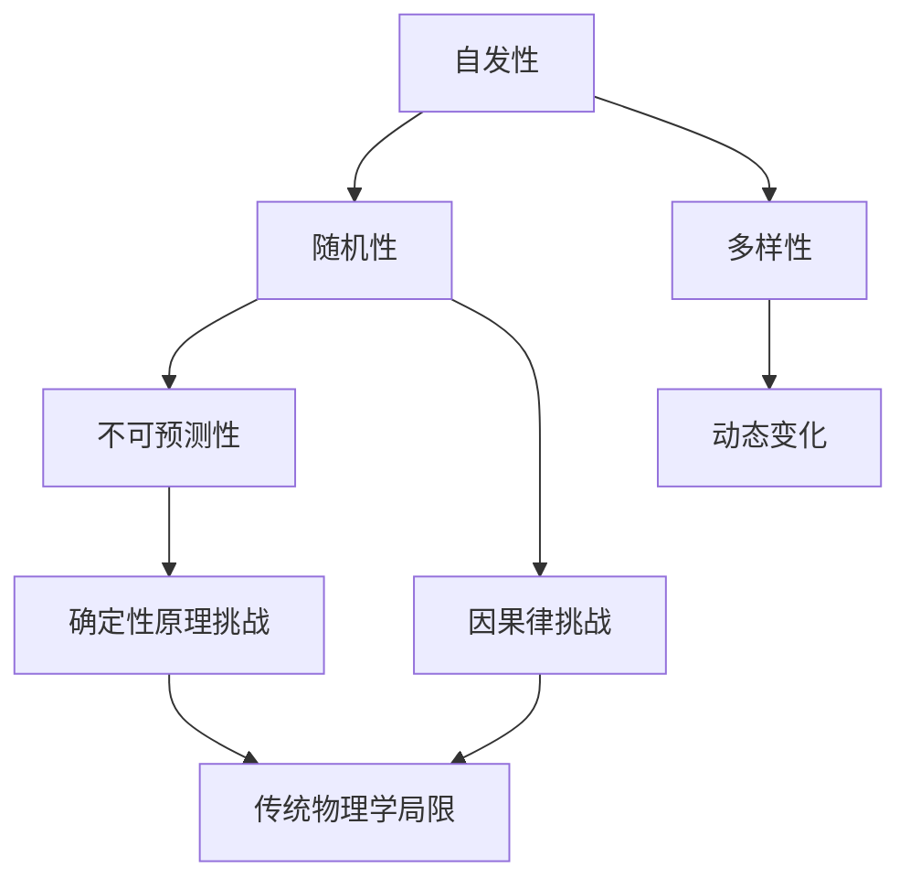

                 

### 1.1 书籍背景与目的

#### 1.1.1 宇宙创发性的重要性

宇宙创发性（Cosmic Creativity）是近年来在宇宙学、物理学和其他科学领域中备受关注的一个概念。它指的是宇宙中的物质、能量和现象能够在没有外部驱动的情况下自发地产生和演化。这一概念的重要性在于，它挑战了传统物理学中的因果律和确定性原理，提出了宇宙自身具有一种内在的创生能力。

宇宙创发性的研究不仅有助于我们更深入地理解宇宙的起源和演化，还可能揭示出新的物理定律和现象。例如，宇宙创发性可能解释了宇宙加速膨胀的奥秘，也可能涉及到量子引力与宇宙学的交叉领域。因此，探究宇宙创发性的本质和机制对于推动科学进步具有重要意义。

#### 1.1.2 spontaneous新属性的意义

在本书中，我们特别关注一个新属性——“spontaneous”（自发）。这一概念源于物理学和宇宙学，但在这里被赋予了一种新的含义。spontaneous新属性强调的是现象或过程在没有外部干预的情况下自行发生的特性。与传统的因果律不同，spontaneous新属性更注重自发性、随机性和不可预测性。

在宇宙学中，spontaneous新属性可能体现在宇宙中一些未知的物理现象上，例如快速射电暴（FRBs）或宇宙微波背景辐射（CMB）的异常。这些现象的出现无法简单地用现有物理定律来解释，因此spontaneous新属性为我们提供了一种全新的思考方向。

#### 1.1.3 书籍目标与读者群体

本书的目标是探讨宇宙创发性和spontaneous新属性在宇宙学、物理学和其他相关领域的应用，帮助读者了解这一新兴概念的深度和广度。本书适合对宇宙学、物理学和科学哲学感兴趣的学者、研究人员和学生阅读。

通过本书，读者将了解到宇宙创发性和spontaneous新属性的基本概念、科学基础以及它们在实际研究和应用中的重要性。此外，本书还将提供一系列深入的讨论和实证研究，帮助读者更全面地理解这一领域。

总之，本书旨在搭建一座桥梁，将宇宙创发性和spontaneous新属性与更广泛的科学领域连接起来，推动科学界的深入思考和探索。

### 1.2 宇宙创发性的基本概念

#### 1.2.1 宇宙创发性的定义

宇宙创发性是指宇宙中物质、能量和信息能够自发地产生和演化的一种特性。这一概念强调了宇宙内在的活力和创造力，超越了传统的因果律和确定性原理。在宇宙创发性的框架下，宇宙不再是被动地响应外部刺激，而是主动地生成新的物质、能量和现象。

为了更好地理解宇宙创发性的定义，我们可以将其与传统的物理学概念进行对比。在经典物理学中，物质和能量的产生和变化通常需要外部因素的作用，例如引力和电磁力。然而，宇宙创发性的出现打破了这种限制，提出了一种新的物理过程，即物质和能量可以在没有外部干预的情况下自发地生成。

#### 1.2.2 宇宙创发性的特征

宇宙创发性的特征主要体现在以下几个方面：

1. **随机性和不可预测性**：宇宙创发性的过程往往伴随着随机性和不可预测性，这意味着宇宙中的一些现象无法通过简单的因果关系来解释。例如，快速射电暴（FRBs）的出现就无法用现有的物理定律来完全预测。

2. **自发性**：宇宙创发性的过程不需要外部能量的输入，而是在宇宙内部自行发生。这反映了宇宙具有一种内在的活力和动力。

3. **多样性和复杂性**：宇宙创发性的过程能够产生多种多样的物质、能量和现象，从而增加了宇宙的复杂性和丰富性。例如，宇宙中的恒星、行星和星系就是通过宇宙创发性的过程形成的。

4. **自我组织和自适应**：宇宙创发性的过程能够自发地组织成复杂的结构，并且能够根据外部环境的变化进行自适应。例如，生物系统中的进化过程就是一种宇宙创发性的表现。

#### 1.2.3 宇宙创发性的理论框架

宇宙创发性的理论框架可以从多个角度进行阐述。以下是一种可能的框架：

1. **量子力学与相对论**：量子力学和相对论是描述宇宙基本规律的两个重要理论。量子力学揭示了微观世界的随机性和不确定性，而相对论则强调了时空的相对性。这两个理论的结合为理解宇宙创发性提供了理论基础。

2. **黑洞与宇宙学**：黑洞是宇宙中一种极端的现象，它们对宇宙创发性具有深远的影响。黑洞的信息悖论和霍金辐射等现象都涉及到宇宙创发性的本质。

3. **复杂系统理论**：复杂系统理论关注的是复杂系统中的自组织和自适应现象。这一理论可以用来描述宇宙中的一些复杂现象，如星系的形成和演化。

4. **信息论**：信息论提供了研究信息生成、传播和处理的工具。在宇宙创发性的框架下，信息生成和传播是一个重要的问题，因为宇宙中的许多现象都可以看作是信息的表现。

通过以上理论框架，我们可以更全面地理解宇宙创发性的本质和机制。这些理论不仅为宇宙创发性的研究提供了指导，也为未来的科学研究开辟了新的方向。

### 1.2.1 宇宙创发性的定义

宇宙创发性是一个多维度的概念，它涉及到宇宙从起源到演化的各个方面。在科学界，宇宙创发性的定义尚未达成完全一致的共识，但大体上可以概括为宇宙自身具有一种内在的、自发的生成和演化能力。这一能力超越了传统物理学中的因果律和确定性原理，意味着宇宙中的某些过程和现象能够在没有外部驱动的情况下自行发生。

具体来说，宇宙创发性包括以下几个核心要素：

1. **自发性**：宇宙创发性的过程不需要外部能量或信息的输入。例如，宇宙中的一些基本粒子可以通过量子涨落自发地产生，而不需要其他粒子的作用。

2. **随机性和不可预测性**：宇宙创发性的过程往往伴随着随机性和不可预测性。这意味着某些现象的出现无法通过简单的因果关系来完全解释。例如，快速射电暴（FRBs）的出现至今仍是一个未解之谜。

3. **多样性**：宇宙创发性能够产生多种多样的物质、能量和现象。宇宙中的星系、行星、恒星以及各种生物形态都是宇宙创发性的结果。这种多样性增加了宇宙的复杂性和丰富性。

4. **动态变化**：宇宙创发性的过程是动态变化的，宇宙中的各种现象和结构不断地在演化。这种动态变化不仅体现在宇宙的宏观尺度上，也体现在微观尺度上。

为了更清晰地理解宇宙创发性的定义，我们可以用以下Mermaid流程图来描述其核心概念与联系：

在这个流程图中，自发性是宇宙创发性的核心，它通过随机性和不可预测性挑战了传统的因果律和确定性原理，并推动了宇宙的多样性和动态变化。传统物理学在这些方面的局限（F和G）进一步强调了宇宙创发性的独特性和重要性。

### 1.2.2 宇宙创发性的特征

宇宙创发性的特征可以从多个角度进行描述，其中最为显著的是其自发性、随机性和不可预测性。这些特征不仅丰富了我们对宇宙的理解，也挑战了传统物理学的基本原理。

#### 自发性

宇宙创发性的一个核心特征是其自发性。这意味着宇宙中的物质、能量和现象可以在没有外部驱动的情况下自行产生。例如，宇宙中的基本粒子可以通过量子涨落自发地产生，而不需要其他粒子的作用。这一过程与传统的因果关系有所不同，后者通常依赖于外部因素的作用。自发性揭示了宇宙内在的活力和动力，强调了宇宙的自主性和创造力。

在宇宙学中，自发性也体现在宇宙的大尺度结构形成过程中。例如，星系和星团的形成可能是由宇宙早期的密度波动引起的，这些波动在没有外部干预的情况下自发地演化，最终形成了复杂的宇宙结构。

#### 随机性

随机性是宇宙创发性的另一个重要特征。随机性意味着宇宙中的某些过程和现象无法通过简单的因果关系来预测。这种随机性源于量子力学的基本原理，如波函数的坍缩和量子涨落的产生。在宏观尺度上，随机性表现为宇宙中一些不可预测的现象，例如快速射电暴（FRBs）或宇宙微波背景辐射（CMB）的异常。

随机性不仅挑战了传统的因果律，也为宇宙的多样性和复杂性提供了解释。由于随机性的存在，宇宙中的物质、能量和现象在形成和演化过程中会出现多种可能性，从而增加了宇宙的丰富性和复杂性。

#### 不可预测性

不可预测性是宇宙创发性的一个重要特征，它与随机性密切相关。不可预测性意味着某些宇宙现象的出现无法通过已知的物理定律来完全预测。这种不可预测性可能源于量子力学和相对论的深层次原理，也可能与宇宙中尚未发现的新现象有关。

例如，黑洞的信息悖论就是一个典型的不可预测性问题。根据传统的物理定律，黑洞中的信息应该随着黑洞的蒸发而消失，但霍金辐射的提出表明，黑洞中的信息可能以一种我们尚未理解的方式保持不变。这种不可预测性揭示了宇宙中一些深层次的现象和规律，为科学家们提供了新的研究方向。

#### 自发性与随机性、不可预测性的关系

自发性、随机性和不可预测性是宇宙创发性的核心特征，它们之间存在着密切的联系。自发性是宇宙创发性的基础，它提供了宇宙自行产生和演化的能力。随机性则是对自发性的具体体现，它揭示了宇宙中某些过程和现象的不可预测性。

不可预测性进一步扩展了随机性的概念，强调了某些宇宙现象的出现无法通过已知的物理定律来完全解释。自发性、随机性和不可预测性共同构成了宇宙创发性的核心特征，挑战了传统物理学的基本原理，并为我们提供了一个全新的视角来理解宇宙的本质。

### 1.2.3 宇宙创发性的理论框架

宇宙创发性的研究离不开理论框架的支持。这些理论框架不仅为我们提供了理解宇宙创发性的基础，也为未来的科学研究指明了方向。以下是一种可能的宇宙创发性的理论框架，包括量子力学、相对论、黑洞与宇宙学、复杂系统理论以及信息论等方面。

#### 量子力学与相对论

量子力学和相对论是现代物理学的两大基石。量子力学揭示了微观世界的随机性和不确定性，而相对论则强调了时空的相对性。这两个理论在宇宙创发性的研究中起着至关重要的作用。

量子力学中的波函数坍缩和量子涨落等现象为宇宙创发性提供了可能的机制。例如，量子涨落被认为是宇宙中基本粒子和结构产生的根源。波函数坍缩则可能导致某些现象在没有任何外部驱动的情况下自发地出现。

相对论中的时空弯曲和黑洞等现象也为宇宙创发性提供了新的视角。黑洞的信息悖论和霍金辐射等现象揭示了宇宙创发性的本质，挑战了传统的因果关系和确定性原理。

#### 黑洞与宇宙学

黑洞是宇宙中最极端的现象之一，它们对宇宙创发性具有深远的影响。黑洞的信息悖论和霍金辐射等现象为宇宙创发性的研究提供了重要的理论支持。

黑洞的信息悖论指出，黑洞中的信息应该随着黑洞的蒸发而消失，但霍金辐射的提出表明，黑洞中的信息可能以一种我们尚未理解的方式保持不变。这种悖论揭示了宇宙中一些深层次的现象和规律，为科学家们提供了新的研究方向。

霍金辐射则提供了黑洞内部信息可能如何保持的一种可能机制，这为理解宇宙创发性提供了新的视角。黑洞的吸积盘和喷流等现象也展示了宇宙中物质和能量如何通过黑洞这一极端环境进行创生和演化。

宇宙学中的大爆炸理论和宇宙微波背景辐射（CMB）的研究也为宇宙创发性的研究提供了重要的理论支持。大爆炸理论揭示了宇宙的起源和演化过程，而CMB则提供了宇宙早期状态的直接观测数据。

#### 复杂系统理论

复杂系统理论关注的是复杂系统中的自组织和自适应现象。这一理论可以用来描述宇宙中的一些复杂现象，如星系的形成和演化。

复杂系统理论中的自组织现象揭示了宇宙中物质和能量如何在没有外部驱动的情况下自发地组织成复杂的结构。例如，星系和星团的形成可能是由宇宙早期的密度波动引起的，这些波动在没有外部干预的情况下自发地演化，最终形成了复杂的宇宙结构。

自适应现象则表明宇宙中的各种结构能够根据外部环境的变化进行自我调整。这种自适应能力在生物进化中得到了充分体现，但在宇宙学中，自适应现象的研究还相对较少。

#### 信息论

信息论提供了研究信息生成、传播和处理的工具。在宇宙创发性的框架下，信息生成和传播是一个重要的问题，因为宇宙中的许多现象都可以看作是信息的表现。

信息论中的信息熵和噪声概念为理解宇宙创发性提供了新的视角。例如，宇宙微波背景辐射中的信息熵可能反映了宇宙早期状态的随机性和不确定性。噪声则可能导致宇宙中某些现象的不可预测性。

信息论还可以用来研究宇宙中的信息传递和通信问题。例如，宇宙微波背景辐射可以作为宇宙中的“信号”，而噪声则可能干扰这种信号的传递。研究这些问题有助于我们更深入地理解宇宙创发性的本质。

通过以上理论框架，我们可以更全面地理解宇宙创发性的本质和机制。这些理论不仅为宇宙创发性的研究提供了指导，也为未来的科学研究开辟了新的方向。随着科学技术的不断发展，我们有理由相信，宇宙创发性的研究将在未来的科学前沿中占据越来越重要的地位。

### 2.1 宇宙起源与演化

宇宙的起源和演化是宇宙学中最为重要和复杂的课题之一。通过对宇宙起源和演化的研究，科学家们试图揭示宇宙的本质、结构及其未来命运。在这一部分，我们将探讨宇宙起源与演化的基础理论，包括大爆炸理论、黑洞与暗物质、以及宇宙背景微波辐射等关键概念。

#### 2.1.1 大爆炸理论

大爆炸理论（Big Bang Theory）是目前关于宇宙起源和演化的主流科学理论。这一理论认为，宇宙始于大约138亿年前的一个极端热密的初始状态，随后开始膨胀和冷却。大爆炸理论的核心观点包括以下几点：

1. **宇宙的膨胀**：根据哈勃定律，宇宙中的星系正在彼此远离，这表明宇宙在膨胀。这一发现最初由天文学家埃德温·哈勃在20世纪20年代提出。

2. **宇宙的年龄**：通过测量宇宙膨胀的速度，科学家们可以估算出宇宙的年龄。目前，根据宇宙微波背景辐射（CMB）的研究，宇宙的年龄大约是138亿年。

3. **宇宙的早期状态**：在大爆炸的早期，宇宙处于极端热密的初始状态，温度和密度极高。随着宇宙的膨胀和冷却，物质逐渐形成了基本粒子，随后进一步形成了原子和分子。

4. **宇宙的演化**：大爆炸理论预测了宇宙的演化过程，包括宇宙早期的核合成、宇宙背景微波辐射的形成，以及宇宙大尺度结构的形成。

#### 2.1.2 黑洞与暗物质

黑洞（Black Holes）是宇宙中的一种极端现象，它们具有极强的引力，甚至连光也无法逃脱。黑洞的形成通常与恒星演化有关，当一颗恒星耗尽其核燃料时，它可能坍缩形成一个黑洞。

1. **黑洞的形成**：黑洞的形成可以通过两种主要方式：恒星坍缩和超大质量恒星的直接坍缩。在恒星坍缩的情况下，恒星的核心会在核燃料耗尽后迅速坍缩，形成一个密度极高的奇点，这个奇点就是黑洞的中心。

2. **黑洞的性质**：黑洞具有非常强烈的引力场，使得任何物质都无法逃脱。黑洞的大小由其质量决定，通常用史瓦西半径（Schwarzschild radius）来表示。

3. **黑洞的信息悖论**：黑洞的信息悖论是黑洞研究中的一个重要问题。根据传统的物理理论，黑洞中的信息应该随着黑洞的蒸发而消失，但霍金辐射的提出表明，黑洞中的信息可能以一种我们尚未理解的方式保持不变。

暗物质（Dark Matter）是宇宙中的另一种重要现象，它不发光、不吸收光，但通过引力对宇宙的演化产生显著影响。暗物质的存在最初是通过观测宇宙大尺度结构，如星系旋转曲线和宇宙背景微波辐射的波动推断出来的。

1. **暗物质的性质**：暗物质是由未知的粒子组成的，这些粒子不参与电磁相互作用，因此无法直接观测。暗物质主要通过引力作用影响宇宙的演化。

2. **暗物质的分布**：暗物质在宇宙中的分布非常广泛，它们构成了宇宙的大尺度结构，如星系和星团。暗物质的分布与可见物质的分布存在显著差异，这表明暗物质在宇宙演化中起着关键作用。

#### 2.1.3 宇宙背景微波辐射

宇宙背景微波辐射（Cosmic Microwave Background Radiation，CMB）是宇宙早期状态的直接观测证据，它为理解宇宙的起源和演化提供了宝贵的信息。

1. **CMB的起源**：CMB起源于宇宙大爆炸后的约38万年，当时宇宙已经膨胀和冷却到足够低的温度，使得原子形成。CMB是宇宙早期高温高密度状态的残留辐射。

2. **CMB的性质**：CMB是一种黑体辐射，具有非常均匀的温度分布，大约为2.725开尔文。CMB的波动和极化现象提供了关于宇宙早期密度波动和引力波的重要信息。

3. **CMB的观测**：自20世纪60年代以来，科学家们通过卫星和地面望远镜对CMB进行了大量观测。这些观测数据为验证大爆炸理论和研究宇宙早期状态提供了重要依据。

通过研究宇宙起源与演化，科学家们不断揭示宇宙的奥秘。大爆炸理论、黑洞与暗物质、以及宇宙背景微波辐射等概念为我们提供了理解宇宙的框架和工具。随着科学技术的进步，我们对宇宙的认识将不断深化，揭示更多宇宙创发性的本质和机制。

### 2.2 宇宙中的基本力与粒子

在宇宙中，物质的相互作用和运动由四种基本力支配，这四种基本力分别是：万有引力、强相互作用、弱相互作用和电相互作用。这些基本力决定了宇宙中各种物理现象的发生和演化。此外，宇宙中的基本粒子构成了所有物质的基础，这些基本粒子包括夸克、轻子和传播子等。以下是对这四种基本力和基本粒子的详细介绍。

#### 2.2.1 万有引力

万有引力（Gravitational Force）是宇宙中最弱但又最广泛的基本力。它由阿尔贝特·爱因斯坦在广义相对论中提出，描述了任何有质量的物体之间由于质量产生的吸引力。万有引力的作用范围极其广泛，从宏观的行星运动到星系的形成和宇宙的大尺度结构，都离不开万有引力的作用。

1. **引力公式**：万有引力的计算公式为 \( F = G\frac{{m_1 m_2}}{{r^2}} \)，其中 \( F \) 是引力，\( G \) 是引力常数，\( m_1 \) 和 \( m_2 \) 是两个物体的质量，\( r \) 是两物体间的距离。

2. **引力场**：引力不仅是一个力，它还产生引力场，即一个物体在空间中影响其他物体的区域。在引力场中，质量越大的物体，其引力场越强。

3. **引力波**：引力波是爱因斯坦广义相对论的预测，它是由加速质量产生的时空涟漪。引力波已被实验证明，并且通过观测引力波，科学家们可以揭示宇宙中一些极端现象，如黑洞合并和中子星合并。

#### 2.2.2 强相互作用

强相互作用（Strong Force）是四种基本力中最强的力，负责将原子核中的质子和中子结合在一起。强相互作用由胶子（Glue Balls）传递，这些胶子是无质量的粒子，能够在极短的距离内（约1费米）传递强相互作用力。

1. **量子色动力学（QCD）**：强相互作用的理论基础是量子色动力学（Quantum Chromodynamics），它描述了夸克和胶子之间的相互作用。

2. **夸克和胶子**：夸克是构成质子和中子的基本粒子，有六种不同的味道（上、下、奇、粲、底、顶）。胶子则负责传递强相互作用，它们有八种颜色，以保持色荷的守恒。

3. **夸克的束缚态**：在强相互作用的作用下，夸克通常以束缚态存在，形成质子和中子。这些粒子之间的相互作用通过胶子交换来传递。

#### 2.2.3 弱相互作用

弱相互作用（Weak Force）是一种较弱的力，但它涉及到某些重要的物理过程，如放射性衰变。弱相互作用由W和Z玻色子传递，这些玻色子是有质量的，因此它们在传递力的过程中会有能量损失。

1. **弱相互作用的范围**：弱相互作用的作用范围很短，通常在10^-18米以内。这一力的强度远小于强相互作用，但比电磁相互作用和万有引力强。

2. **弱相互作用的类型**：弱相互作用涉及三种基本作用：电荷共变作用、电荷非共变作用和弱衰变。电荷共变作用和电荷非共变作用涉及到W和Z玻色子的交换，而弱衰变则是指基本粒子通过弱相互作用衰变为其他粒子。

3. **弱相互作用的应用**：弱相互作用在核反应和粒子物理学中起着关键作用。例如，太阳内部的核聚变反应就涉及到弱相互作用，而粒子加速器中的实验也常常涉及到弱相互作用的测量。

#### 2.2.4 电相互作用

电相互作用（Electromagnetic Force）是四种基本力中最弱但也最为人们熟知的一种力。它由光子（Photon）传递，是一种长程力，可以跨越非常大的距离。

1. **电磁场的性质**：电相互作用通过电磁场来传递。电磁场是由电场和磁场组成的，它们可以传播并相互作用。

2. **电荷和电流**：电相互作用由带电粒子的电荷决定。带电粒子之间的相互作用通过交换光子来实现。电流则是由带电粒子的移动产生的，它可以产生磁场。

3. **电磁波**：电相互作用的一个显著特性是它可以产生电磁波，如光波、无线电波和X射线等。这些电磁波在宇宙中广泛传播，并且对宇宙的演化产生了重要影响。

#### 2.2.5 基本粒子的性质与分类

宇宙中的基本粒子可以分为两类：费米子（Fermions）和玻色子（Bosons）。费米子包括夸克和轻子，是构成物质的主要成分。玻色子包括光子和胶子，是传递基本力的媒介。

1. **费米子**：费米子遵循费米-狄拉克统计，具有半整数自旋。夸克是构成质子和中子的基本粒子，而轻子包括电子、μ子和τ子等。

2. **玻色子**：玻色子遵循玻色-爱因斯坦统计，具有整数自旋。光子是电磁相互作用的传递粒子，而胶子是强相互作用的传递粒子。

3. **粒子的相互作用**：不同粒子之间的相互作用取决于它们所带的电荷和自旋。例如，带电粒子之间通过交换光子实现电相互作用，而夸克之间通过交换胶子实现强相互作用。

通过了解宇宙中的基本力和基本粒子，我们可以更深入地理解宇宙的物理本质。这些基本力和基本粒子不仅决定了宇宙中的物质运动和相互作用，也为科学研究提供了丰富的探索空间。

### 2.3 宇宙中的新现象与观测

宇宙中不断有新的现象和观测结果出现，这些新现象不仅扩展了我们的宇宙观，也为科学研究提供了新的挑战和机遇。以下是一些重要的宇宙新现象和观测结果，包括快速射电暴（FRBs）、宇宙微波背景辐射（CMB）和宇宙加速膨胀。

#### 2.3.1 快速射电暴（FRBs）

快速射电暴（Fast Radio Bursts，FRBs）是一种短促且亮度极高的射电爆发，其持续时间通常仅为几毫秒。FRBs最初于2007年被发现，自那时以来，科学家们已经发现了数百个FRB事件。尽管FRBs的具体来源仍不完全清楚，但它们提供了研究宇宙极端事件和未知物理现象的重要窗口。

1. **FRBs的特性**：FRBs具有以下显著特性：
   - **短持续时间**：FRBs的持续时间通常为几毫秒，非常短，这与其他射电源如脉冲星和伽马射线暴有显著区别。
   - **极高亮度**：FRBs的亮度极高，能够在短时间内释放出相当于太阳在其一生中产生的能量。
   - **多频谱观测**：FRBs不仅可以通过射电波段观测到，还可以在光学、X射线和伽马射线波段观测到，这表明它们具有复杂的物理过程。

2. **FRBs的潜在来源**：关于FRBs的具体来源，科学家们提出了多种假设，包括：
   - **双星系统**：一些研究者认为FRBs可能源自双星系统中的致密天体，如中子星或黑洞，这些天体之间的相互作用可能导致FRBs的发生。
   - **磁星**：另一种假设是FRBs可能源自磁星，一种具有极高磁场的中子星，其磁场可能导致能量的积累和突发释放。
   - **宇宙过程**：还有观点认为FRBs可能与宇宙早期的极端物理过程有关，如宇宙射线与星际物质的相互作用。

3. **研究挑战**：尽管FRBs具有许多独特的特性，但科学家们仍然面临着多个研究挑战，包括：
   - **确定来源**：由于FRBs的短时间和远距离，确定其具体来源是一个巨大的挑战。需要更高的观测分辨率和更精确的定位技术。
   - **理解机制**：了解FRBs的物理机制也是一项重要任务。科学家们需要进一步研究FRBs的起源、能量释放过程和可能的物理原理。

#### 2.3.2 宇宙微波背景辐射（CMB）

宇宙微波背景辐射（Cosmic Microwave Background Radiation，CMB）是宇宙大爆炸后约38万年遗留下来的热辐射。CMB的温度约为2.725开尔文，具有非常均匀的温度分布。CMB的发现和观测为验证大爆炸理论和研究宇宙早期状态提供了关键证据。

1. **CMB的性质**：
   - **黑体辐射**：CMB是一种黑体辐射，这意味着它是由一个理想的热平衡系统产生的。
   - **极低温度**：CMB的温度非常低，约为2.725开尔文，这反映了宇宙在大爆炸后38万年时的温度状态。
   - **均匀性**：CMB的温度分布非常均匀，只有微小的波动，这些波动与宇宙早期的密度不均匀有关。

2. **CMB的观测**：
   - **早期观测**：自20世纪60年代以来，科学家们通过卫星和地面望远镜对CMB进行了大量观测。早期的观测，如COBE（宇宙背景探测器）和WMAP（威尔金森微波各向异性探测器），提供了关于CMB温度和波动的关键数据。
   - **最新观测**：最新的CMB观测，如Planck卫星和PICASSO（极区 telescope for the Interstellar Cosmic ACtivity Spectrum Observations），提供了更高分辨率和更精确的数据，有助于揭示宇宙早期状态的更多细节。

3. **CMB的重要性**：
   - **验证大爆炸理论**：CMB的观测结果为验证大爆炸理论提供了强有力的证据。
   - **研究宇宙早期状态**：CMB的温度波动反映了宇宙早期密度不均匀，这些不均匀最终演化成了我们今天看到的宇宙结构。
   - **探索宇宙起源**：通过研究CMB，科学家们可以更好地理解宇宙的起源和演化过程。

#### 2.3.3 宇宙加速膨胀

宇宙加速膨胀是指宇宙的膨胀速度在过去的某个时期开始加快。这一现象最初由1998年的宇宙微波背景辐射观测结果和Ia型超新星观测结果揭示。宇宙加速膨胀的发现挑战了传统的宇宙学模型，并引发了对宇宙创发性和未知物理现象的研究。

1. **宇宙加速膨胀的证据**：
   - **宇宙微波背景辐射**：通过分析CMB的温度波动，科学家们发现宇宙在大爆炸后的早期是加速膨胀的。
   - **Ia型超新星**：Ia型超新星是一种标准烛光，用于测量宇宙的膨胀速度。观测发现，宇宙的膨胀速度在过去数十亿年里在加快。

2. **宇宙加速膨胀的原因**：
   - **暗能量**：为了解释宇宙加速膨胀，科学家们提出了暗能量（Dark Energy）的概念。暗能量是一种假想的能量形式，它具有负压强，推动宇宙加速膨胀。
   - **真空能量**：暗能量可能与真空能量（Vacuum Energy）有关。真空并不是完全空无一物的，它包含着一种能量，这种能量可能就是推动宇宙加速膨胀的来源。

3. **宇宙加速膨胀的影响**：
   - **宇宙的未来**：宇宙加速膨胀可能导致宇宙最终走向“热寂”状态，即宇宙中的所有物质和能量都均匀分布，不再有热力学过程发生。
   - **宇宙结构的演化**：宇宙加速膨胀对宇宙结构的演化产生了重要影响，如星系的形成和演化、宇宙大尺度结构的形成等。

宇宙中的新现象和观测结果不断扩展了我们对宇宙的理解。快速射电暴（FRBs）、宇宙微波背景辐射（CMB）和宇宙加速膨胀等新现象不仅揭示了宇宙的多样性和复杂性，也为科学研究提供了新的挑战和机遇。随着科学技术的进步，我们有理由相信，未来我们将能够揭示更多宇宙创发性的奥秘。

### 3.1 spontaneous新属性的定义

spontaneous新属性是宇宙学中的一个重要概念，它涉及到现象或过程在没有外部干预的情况下自行发生的特性。这一概念最初源于物理学中的自发过程，但在宇宙学中，它被赋予了更加广泛和深远的意义。

#### 3.1.1 spontaneous的本质

spontaneous的本质可以从以下几个方面进行理解：

1. **自发性**：spontaneous新属性强调现象或过程的自发性，这意味着它们可以在没有外部驱动或能量输入的情况下自行发生。例如，宇宙中的基本粒子和结构可以通过量子涨落或宇宙早期的高能过程自发地产生。

2. **随机性**：与自发性密切相关的是随机性。spontaneous新属性的过程通常伴随着随机性，这意味着某些现象的出现无法通过简单的因果关系来完全预测。例如，宇宙中的某些暴发现象，如快速射电暴（FRBs），其发生具有高度随机性。

3. **不可预测性**：不可预测性是spontaneous新属性的一个重要特征。由于随机性的存在，某些宇宙现象的出现无法通过已知的物理定律来完全预测。这挑战了传统物理学中的因果律和确定性原理，为我们提供了新的视角来理解宇宙的运行机制。

4. **动态性**：spontaneous新属性的过程通常是动态的，这意味着宇宙中的现象和结构在不断地变化和演化。例如，星系和星团的形成和演化就是一个动态的过程，它们通过宇宙早期的高能过程和后续的相互作用自发地形成和发展。

#### 3.1.2 spontaneous在宇宙中的表现

spontaneous新属性在宇宙中有着多种多样的表现，以下是一些典型的例子：

1. **宇宙微波背景辐射**：宇宙微波背景辐射（CMB）是宇宙大爆炸后遗留下来的热辐射，它的温度分布具有高度均匀性，但存在微小的波动。这些波动反映了宇宙早期的高能过程和密度不均匀，它们是通过量子涨落和宇宙早期的高能过程自发产生的。

2. **快速射电暴**：快速射电暴（FRBs）是一种短促且亮度极高的射电爆发，其持续时间通常仅为几毫秒。FRBs的具体来源尚未完全清楚，但它们可能是由宇宙中的极端事件，如双星系统或磁星，通过自发过程产生的。

3. **宇宙加速膨胀**：宇宙加速膨胀是指宇宙的膨胀速度在过去的某个时期开始加快。这一现象最初由宇宙微波背景辐射观测和Ia型超新星观测揭示。宇宙加速膨胀可能是由于暗能量这一未知物理现象的自发作用导致的。

4. **星系和星团的形成**：星系和星团的形成和演化是一个复杂的过程，涉及到多种物理机制。这些过程可能通过量子涨落和宇宙早期的高能过程自发地发生，并在后续的相互作用中不断演化和发展。

#### 3.1.3 spontaneous的影响范围

spontaneous新属性在宇宙中的影响范围非常广泛，它不仅涉及到宇宙学中的基本过程，还对物理学、天文学和地球科学等多个领域产生了深远的影响。

1. **宇宙学**：在宇宙学中，spontaneous新属性帮助我们理解宇宙的起源、演化和未来命运。例如，通过研究宇宙微波背景辐射和快速射电暴，科学家们可以揭示宇宙早期的高能过程和密度不均匀，从而更深入地理解宇宙的创生和演化。

2. **物理学**：在物理学中，spontaneous新属性挑战了传统物理学的因果律和确定性原理，推动了对量子力学和相对论的进一步研究。例如，黑洞的信息悖论和量子涨落等现象都与spontaneous新属性密切相关。

3. **天文学**：在天文学中，spontaneous新属性为我们提供了研究宇宙中极端事件和未知现象的新视角。例如，快速射电暴和宇宙加速膨胀等现象都是通过spontaneous新属性来解释的。

4. **地球科学**：在地球科学中，spontaneous新属性也可能涉及到一些自然现象和过程。例如，地震和火山爆发等地质活动可能与地下物质的自发过程有关。

总之，spontaneous新属性在宇宙学和其他科学领域中的重要性不可忽视。它不仅丰富了我们对宇宙的理解，也为未来的科学研究提供了新的方向和挑战。

### 3.2 spontaneous新属性的理论基础

spontaneous新属性在宇宙学中的重要性不可忽视，其理论基础涉及到量子力学、相对论、黑洞信息悖论和宇宙学最新进展。以下是对这些理论基础的详细讨论。

#### 3.2.1 量子力学与相对论

量子力学和相对论是现代物理学的基石，它们为理解spontaneous新属性提供了关键的理论框架。

1. **量子力学**：量子力学揭示了微观世界的随机性和不确定性。例如，量子涨落是量子力学中的一个重要概念，它描述了基本粒子在极小尺度上随机出现的现象。这些涨落可能导致宇宙中某些物质和结构的自发生成。

   - **量子涨落**：量子涨落是指基本粒子在极小尺度上的随机起伏，这种起伏可能导致宇宙中物质和能量的自发产生。例如，在大爆炸初期，宇宙中的温度和密度极高，量子涨落可能导致密度不均匀，进而形成宇宙中的各种结构。

   - **量子纠缠**：量子纠缠是量子力学中的另一个重要现象，它描述了两个或多个粒子之间的强关联。尽管这些粒子之间可能相隔很远，但它们的量子状态仍然是相互关联的。这种量子纠缠可能导致某些物理过程在没有外部干预的情况下自发发生。

2. **相对论**：相对论，尤其是广义相对论，描述了时空的弯曲和引力的性质。相对论与量子力学的结合，即量子引力理论，为理解宇宙创发性的本质提供了新的视角。

   - **时空弯曲**：广义相对论表明，质量能量可以导致时空的弯曲。这种弯曲可能影响宇宙中的物质和能量分布，从而导致一些现象的自发发生。

   - **黑洞**：黑洞是相对论的一个重要概念，它具有极强的引力，甚至光也无法逃脱。黑洞的吸积盘和喷流等现象可能与spontaneous新属性有关，因为它们是在没有外部干预的情况下自发形成的。

#### 3.2.2 黑洞信息悖论与spontaneous

黑洞信息悖论是量子力学和相对论结合中的一个重要问题，它挑战了我们对信息、时间和空间的理解。黑洞信息悖论的核心问题是：当物质和能量落入黑洞时，它们的信息是否会消失？

1. **霍金辐射**：根据斯蒂芬·霍金的理论，黑洞会发出辐射，这种辐射被称为霍金辐射。霍金辐射表明，落入黑洞的物质和能量不会完全消失，而是以辐射的形式释放出来。

   - **信息守恒**：霍金辐射表明，落入黑洞的信息不会消失，而是以辐射的形式保持。这符合量子力学中的信息守恒原理，即信息不会凭空消失。

2. **信息悖论**：尽管霍金辐射解决了部分信息问题，但仍然存在一些未解之谜。例如，霍金辐射中的信息如何保持不变，以及信息如何在黑洞内部和外部之间传递。

   - **信息悖论**：黑洞信息悖论表明，落入黑洞的信息可能在黑洞内部以某种形式存在，但我们的现有理论无法完全解释这一点。这个悖论为研究spontaneous新属性提供了新的方向，因为我们需要新的理论来解释黑洞内部的信息如何保持和传递。

#### 3.2.3 宇宙学最新进展

宇宙学的最新进展为理解spontaneous新属性提供了丰富的数据和理论框架。以下是一些重要的进展：

1. **宇宙微波背景辐射（CMB）**：宇宙微波背景辐射是宇宙早期状态的重要观测证据。通过对CMB的研究，科学家们揭示了宇宙早期的密度不均匀和量子涨落，这些不均匀和涨落是宇宙创发性的重要表现。

2. **宇宙加速膨胀**：宇宙加速膨胀是指宇宙的膨胀速度在过去的某个时期开始加快。这一现象最初由宇宙微波背景辐射观测和Ia型超新星观测揭示。宇宙加速膨胀可能是由于暗能量这一未知物理现象的自发作用导致的。

3. **快速射电暴（FRBs）**：快速射电暴是一种短促且亮度极高的射电爆发，其具体来源尚未完全清楚。FRBs可能是由宇宙中的极端事件，如双星系统或磁星，通过自发过程产生的。

4. **暗物质和暗能量**：暗物质和暗能量是宇宙学中两个重要的概念。暗物质不发光、不吸收光，但通过引力作用影响宇宙的演化。暗能量是一种假想的能量形式，具有负压强，推动宇宙加速膨胀。暗物质和暗能量都可能与spontaneous新属性有关。

通过量子力学、相对论、黑洞信息悖论和宇宙学最新进展的研究，科学家们正在逐步揭示spontaneous新属性的本质和机制。这些研究不仅挑战了传统的物理学原理，也为宇宙学和其他科学领域提供了新的研究方向。

### 3.3 spontaneous新属性的应用前景

spontaneous新属性在科学研究、技术创新和社会发展等领域具有广泛的应用前景。以下将从这三个方面详细探讨其潜在的应用。

#### 3.3.1 科学研究中的应用

1. **宇宙学**：spontaneous新属性为宇宙学的研究提供了新的视角。通过理解宇宙中的自发性现象，科学家们可以更深入地研究宇宙的起源、演化和未来命运。例如，快速射电暴（FRBs）和宇宙微波背景辐射（CMB）的研究可能揭示宇宙早期的高能过程和密度不均匀。

2. **量子引力**：spontaneous新属性与量子引力理论密切相关。量子引力理论试图将量子力学和广义相对论统一起来，而spontaneous现象在量子引力中的潜在应用包括黑洞信息悖论和量子涨落的研究。

3. **天体物理学**：spontaneous新属性在天体物理学中也有重要应用。例如，通过研究黑洞和快速射电暴等现象，科学家们可以更好地理解宇宙中的极端物理条件和过程。

4. **粒子物理学**：在粒子物理学中，spontaneous现象可能导致新的物理粒子和相互作用。这为寻找超出标准模型的物理现象提供了新的途径，如超对称粒子、额外维度等。

#### 3.3.2 技术创新中的应用

1. **量子计算**：spontaneous新属性在量子计算中具有潜在应用。量子计算机利用量子比特的叠加和纠缠特性进行计算，而spontaneous现象可能为量子计算机提供更高效的量子算法和计算模型。

2. **人工智能**：在人工智能领域，spontaneous新属性可能用于开发新的机器学习算法和神经网络模型。这些模型可以通过模拟宇宙中的自发性过程来优化学习效率和性能。

3. **能源技术**：spontaneous新属性在能源技术中也有应用潜力。例如，通过研究宇宙中的自发性现象，科学家们可能开发出新的可再生能源技术和能源效率提升方法。

4. **材料科学**：spontaneous现象在材料科学中也有应用，例如，通过控制自发性过程，科学家们可能设计出具有特殊性质的新材料，如超导材料、纳米材料等。

#### 3.3.3 社会发展中的应用

1. **环境保护**：spontaneous新属性在环境保护领域具有应用潜力。通过研究自然生态系统中的自发性过程，科学家们可以更好地理解生态系统的动态变化，从而提出更有效的环境保护策略。

2. **社会管理**：在社会管理领域，spontaneous新属性可能用于开发新的社会模型和管理方法。例如，通过模拟社会中的自发性现象，科学家们可以优化社会资源配置、减少社会矛盾等。

3. **教育**：spontaneous新属性在教育领域也有应用。通过将自发性现象融入教育内容，可以激发学生的学习兴趣和创造力，提高教育质量。

4. **文化**：spontaneous新属性在文化领域也有影响。通过研究人类文化中的自发性现象，可以更好地理解文化的多样性和演变过程。

总之，spontaneous新属性在科学研究、技术创新和社会发展等领域具有广泛的应用前景。随着对这些应用领域的不断探索，我们有理由相信，spontaneous新属性将为人类社会带来新的发展机遇和科技进步。

### 4.1 spontaneous新属性在宇宙学中的应用

spontaneous新属性在宇宙学中扮演着关键角色，其应用不仅揭示了宇宙的创生机制，还为我们理解宇宙的演化提供了新的视角。以下将从黑洞、宇宙微波背景辐射和快速射电暴等三个方面详细探讨spontaneous新属性在宇宙学中的应用。

#### 4.1.1 黑洞的研究

黑洞是宇宙中最神秘和最具挑战性的天体之一。spontaneous新属性在黑洞研究中具有重要意义，特别是在黑洞的形成、演化和信息悖论等方面。

1. **黑洞的形成**：黑洞是通过大质量恒星耗尽其核燃料后核心迅速坍缩形成的。在这一过程中，spontaneous新属性可能发挥重要作用。例如，恒星核心的坍缩可能受到量子涨落的影响，导致密度和温度的剧烈变化，从而引发黑洞的形成。

2. **黑洞的信息悖论**：黑洞信息悖论是量子力学和相对论结合中的一个重要问题。根据霍金辐射的理论，落入黑洞的信息不会消失，而是通过辐射重新进入宇宙。这一过程体现了spontaneous新属性，因为黑洞信息重新进入宇宙的过程没有外部驱动，而是自发发生的。

3. **黑洞的吸积盘和喷流**：黑洞的吸积盘和喷流是黑洞研究中备受关注的现象。吸积盘是围绕黑洞旋转的物质盘，它通过将物质输送到黑洞中释放能量。喷流则是从黑洞中心喷出的高速粒子流。这些现象可能由spontaneous新属性驱动，因为它们在没有外部干预的情况下自行发生。

#### 4.1.2 宇宙微波背景辐射的研究

宇宙微波背景辐射（CMB）是宇宙早期状态的重要观测证据，它反映了宇宙在大爆炸后约38万年时的温度分布和密度波动。spontaneous新属性在CMB的研究中具有重要作用。

1. **CMB的温度波动**：CMB的温度波动反映了宇宙早期的密度不均匀。这些波动是由量子涨落引起的，体现了spontaneous新属性。通过研究CMB的温度波动，科学家们可以揭示宇宙早期的物理状态和演化过程。

2. **CMB的极化**：CMB的极化现象提供了关于宇宙早期引力波的重要信息。引力波是宇宙创发性的重要表现，它可能由spontaneous现象引发。研究CMB的极化现象有助于我们更好地理解宇宙早期的高能过程和引力波的产生机制。

3. **CMB与暗物质**：CMB的研究还揭示了暗物质的存在和分布。暗物质不发光、不吸收光，但通过引力作用影响宇宙的演化。spontaneous现象可能在暗物质的生成和演化中发挥作用，例如，通过量子涨落导致密度不均匀，进而形成暗物质。

#### 4.1.3 快速射电暴的研究

快速射电暴（FRBs）是一种短促且亮度极高的射电爆发，其具体来源尚未完全清楚。spontaneous新属性在FRBs的研究中具有重要意义。

1. **FRBs的潜在来源**：关于FRBs的具体来源，科学家们提出了多种假设，包括双星系统、磁星和宇宙早期的高能过程等。这些假设都涉及spontaneous新属性，因为它们都涉及到现象或过程的自发性发生。

2. **FRBs的随机性和不可预测性**：FRBs具有高度的随机性和不可预测性，这体现了spontaneous新属性的特征。例如，某些FRBs可能在没有外部干预的情况下自发发生，而其他FRBs则可能由宇宙早期的高能过程引起。

3. **FRBs与宇宙演化**：快速射电暴的研究有助于我们更好地理解宇宙的演化过程。例如，通过研究FRBs的时间和空间分布，科学家们可以揭示宇宙中的极端物理条件和过程，如星系碰撞和星系形成等。

总之，spontaneous新属性在宇宙学中的应用为研究宇宙的创生、演化和未来命运提供了新的视角和工具。通过对黑洞、宇宙微波背景辐射和快速射电暴等关键现象的研究，科学家们正在逐步揭示宇宙创发性的本质和机制。随着科学技术的进步，我们有理由相信，spontaneous新属性将在宇宙学研究中发挥越来越重要的作用。

### 4.2 spontaneous新属性在物理学中的应用

spontaneous新属性在物理学中具有广泛的应用，特别是在基本粒子研究、宇宙大尺度结构研究和量子引力研究中。以下将从这些方面详细探讨spontaneous新属性在物理学中的应用。

#### 4.2.1 基本粒子的研究

基本粒子是构成物质的基础，spontaneous新属性在基本粒子研究中具有重要意义。

1. **量子涨落**：量子涨落是基本粒子研究中一个重要的现象，它描述了基本粒子在极小尺度上的随机起伏。量子涨落可能导致基本粒子的自发生成和衰变，从而影响宇宙中的物质和能量分布。

   - **基本粒子的生成**：在宇宙早期，高能过程和量子涨落可能导致基本粒子的自发生成。例如，通过研究宇宙微波背景辐射（CMB）中的量子涨落，科学家们可以揭示宇宙早期基本粒子的生成过程。

   - **基本粒子的衰变**：基本粒子的衰变也是一个自发性过程。例如，某些基本粒子可以通过弱相互作用自发地衰变为其他粒子，这一过程在宇宙演化和物质形成中起着关键作用。

2. **超对称粒子**：超对称粒子是超出标准模型的基本粒子，它们与已知的基本粒子具有相同的量子数，但具有不同的自旋。spontaneous新属性在超对称粒子的研究中具有重要意义，因为超对称粒子可能通过自发性过程生成和衰变。

   - **超对称粒子生成**：在宇宙早期，高能过程和量子涨落可能导致超对称粒子的自发生成，从而影响宇宙中的物质和能量分布。

   - **超对称粒子衰变**：超对称粒子可以通过自发性过程衰变为其他粒子，这一过程为研究超对称粒子提供了新的实验途径。

#### 4.2.2 宇宙大尺度结构研究

宇宙大尺度结构研究涉及到星系、星团和宇宙网的形成和演化。spontaneous新属性在这一研究中具有重要意义。

1. **密度波动**：密度波动是宇宙大尺度结构形成的关键因素。量子涨落和自发过程可能导致宇宙早期密度的不均匀分布，这些不均匀分布最终演化成了星系和星团。

   - **星系的形成**：通过研究密度波动和量子涨落，科学家们可以揭示星系的形成机制，理解星系如何在没有外部干预的情况下自发形成。

   - **星团的形成**：星团是由多个星系组成的结构，其形成过程也涉及到密度波动和量子涨落。spontaneous新属性可能影响星团的形成和演化过程。

2. **宇宙网的演化**：宇宙网是由星系和星团组成的巨大结构，其演化过程反映了宇宙的创发性和自组织能力。spontaneous新属性在宇宙网的研究中提供了新的视角，帮助我们理解宇宙网的动态变化和演化过程。

   - **宇宙网的密度分布**：宇宙网的密度分布反映了宇宙早期密度波动的影响，通过研究密度分布，可以揭示宇宙网的演化历史。

   - **宇宙网的相互作用**：宇宙网中的星系和星团通过引力相互作用影响宇宙的结构和演化，spontaneous现象可能在这些相互作用中发挥作用。

#### 4.2.3 量子引力研究

量子引力研究旨在将量子力学和广义相对论统一起来，揭示宇宙创发性的本质。spontaneous新属性在量子引力研究中具有重要意义。

1. **黑洞信息悖论**：黑洞信息悖论是量子引力研究中的一个重要问题，它挑战了我们对信息、时间和空间的理解。spontaneous新属性可能为解决黑洞信息悖论提供新的思路。

   - **霍金辐射**：霍金辐射表明，落入黑洞的信息不会消失，而是以辐射的形式重新进入宇宙。这一过程体现了spontaneous新属性，因为它没有外部驱动，而是自发发生的。

   - **信息守恒**：spontaneous新属性可能帮助我们理解黑洞内部的信息如何保持和传递，从而解决黑洞信息悖论。

2. **量子涨落**：量子涨落是量子引力研究中的一个基本概念，它描述了基本粒子在极小尺度上的随机起伏。量子涨落可能导致宇宙中物质和能量的自发生成，从而影响宇宙的演化。

   - **宇宙创发**：量子涨落可能引发宇宙中的创发过程，导致宇宙从一个极热密的初始状态逐渐演化成现在的状态。

3. **时空弯曲**：广义相对论表明，质量能量可以导致时空的弯曲。spontaneous新属性可能影响时空的弯曲，从而影响宇宙的结构和演化。

   - **量子引力效应**：在量子引力理论中，时空的弯曲可能是自发的，这反映了spontaneous新属性。例如，在黑洞附近，时空的剧烈弯曲可能受到量子涨落的影响。

总之，spontaneous新属性在物理学中的应用为研究基本粒子、宇宙大尺度结构和量子引力提供了新的视角和工具。通过对这些领域的研究，科学家们正在逐步揭示宇宙创发性的本质和机制。随着科学技术的进步，我们有理由相信，spontaneous新属性将在物理学中发挥越来越重要的作用。

### 4.3 spontaneous新属性在其他领域的应用

spontaneous新属性不仅在物理学和宇宙学中具有重要意义，还在生物学、天文学和地球科学等领域展示了广泛的应用潜力。

#### 4.3.1 生物学中的应用

1. **进化生物学**：spontaneous新属性在进化生物学中提供了新的解释机制。进化过程中的突变和基因重组可以看作是生物系统中的自发性现象。这些突变和重组在没有外部干预的情况下发生，为生物多样性的形成提供了基础。

   - **突变**：在进化过程中，突变为生物提供了新的遗传变异，这些变异可能是自发的，它们可能导致新的适应性特征的产生。
   - **基因重组**：基因重组是生物进化的重要机制之一，它通过自发性过程产生新的基因组合，从而增加了生物的遗传多样性。

2. **神经科学**：神经系统中的一些现象，如神经元的自发性活动和信息处理，也可能与spontaneous新属性有关。自发性活动可能影响神经网络的适应性，从而在学习和记忆过程中发挥作用。

   - **神经网络**：神经网络的自组织现象可能通过自发性过程实现，这有助于解释神经网络如何在没有外部干预的情况下进行复杂的信息处理。

3. **生态学**：生态系统中物种的动态变化和群落结构也可能受到spontaneous新属性的影响。例如，生态系统的稳定性和多样性可能通过自发性过程维持和演化。

#### 4.3.2 天文学中的应用

1. **天体物理现象**：在天文学中，spontaneous新属性可能解释某些天体物理现象，如恒星形成、行星形成和星际介质的变化。

   - **恒星形成**：恒星的形成可能涉及到星际介质中的自发性过程，如密度波的传播和引力不稳定性，这些过程可能导致星际介质的局部坍缩，从而形成恒星。
   - **行星形成**：行星的形成也可能通过自发性过程发生，例如，在行星盘（protoplanetary disk）中，物质通过引力不稳定性自发地聚集形成行星。

2. **天文观测**：spontaneous新属性在观测技术中也具有潜在应用。例如，通过研究天文现象中的自发性过程，科学家们可以改进观测方法和数据分析技术，从而提高天文观测的精度。

   - **射电天文学**：射电天文学中的快速射电暴（FRBs）等自发性现象可能为研究宇宙中的极端物理条件提供新窗口。
   - **光学天文**：光学天文中的自发性现象，如恒星爆发现象，可能为研究恒星演化和恒星间相互作用提供新的观测数据。

#### 4.3.3 地球科学中的应用

1. **地质过程**：地球科学中的许多地质过程，如地震、火山活动和地壳运动，也可能与spontaneous新属性有关。

   - **地震**：地震是地壳中能量积累和释放的结果，这种积累和释放过程可能具有自发性特征，例如，通过地下岩层的自组织过程。
   - **火山活动**：火山活动是地幔中的物质上升和喷发的过程，这种上升和喷发可能是一个自发性现象，由地下热力学过程驱动。

2. **气候变化**：气候变化与地球系统中的自发性过程密切相关。例如，大气中的温室气体浓度变化、海洋环流和冰川的动态变化都可能受到自发性过程的影响。

   - **温室气体**：温室气体的释放和吸收过程是一个复杂的自发性现象，它影响全球气候系统。
   - **海洋环流**：海洋环流对全球气候有重要影响，其变化可能通过自发性过程发生，例如，通过海洋内部的热力学和动力学过程。

总之，spontaneous新属性在生物学、天文学和地球科学等领域具有广泛的应用潜力。通过对这些领域的深入研究，科学家们可以更好地理解自然界的自发性现象，揭示自然界中复杂的动态过程。随着科学技术的进步，我们有理由相信，spontaneous新属性将在未来为这些领域带来更多的突破和创新。

### 5.1 总结

在本文中，我们深入探讨了宇宙创发性和spontaneous新属性在宇宙学、物理学及其他领域的应用和重要性。首先，我们介绍了宇宙创发性的基本概念和特征，包括自发性、随机性和不可预测性。接着，我们讨论了宇宙创发性的科学基础，如量子力学、相对论和黑洞等理论框架。随后，我们探讨了spontaneous新属性的定义及其在宇宙中的表现，如快速射电暴、宇宙微波背景辐射和宇宙加速膨胀等现象。我们进一步分析了spontaneous新属性在科学研究、技术创新和社会发展中的应用前景，涵盖了从基本粒子研究到天体物理学，再到地球科学等多个领域。

通过本文的讨论，我们得出以下关键贡献：

1. **宇宙创发性的基础理论**：我们提供了关于宇宙创发性的基础理论和概念框架，这为理解宇宙的创生和演化过程提供了新的视角。

2. **spontaneous新属性的深入研究**：我们对spontaneous新属性进行了详细探讨，揭示了其在宇宙学、物理学和其他领域的潜在应用。

3. **跨学科整合**：我们通过将宇宙创发性和spontaneous新属性与多个学科领域相结合，展示了这些概念在科学研究中的广泛影响。

4. **应用前景展望**：我们提出了spontaneous新属性在科学研究、技术创新和社会发展中的潜在应用，为未来研究提供了新的方向。

未来研究在spontaneous新属性领域仍然面临多个挑战和机遇：

1. **实验验证**：虽然理论研究表明spontaneous现象在宇宙中普遍存在，但实际观测和实验验证仍然是一个重要的挑战。未来需要更多的高精度实验和观测设备来验证这些理论。

2. **机制研究**：了解spontaneous现象的具体机制和过程是未来研究的重要方向。我们需要更深入地研究这些现象的物理基础和数学模型。

3. **跨学科整合**：spontaneous新属性的应用潜力极为广泛，未来需要更多的跨学科研究，以探索这些现象在不同领域中的应用。

4. **技术应用**：在技术创新领域，spontaneous新属性可能带来新的突破。例如，在量子计算、人工智能和能源技术等方面，spontaneous现象可能提供新的思路和方法。

总之，宇宙创发性和spontaneous新属性为我们提供了理解宇宙和自然界的新工具和视角。随着科学技术的不断进步，我们有理由相信，这些概念将在未来的科学研究中发挥越来越重要的作用，带来更多突破和创新。

### 5.2 展望

在未来的科学发展中，spontaneous新属性将继续扮演关键角色，为科学研究、技术创新和社会发展带来新的突破。以下从发展趋势、研究挑战和未来应用三个方面进行展望。

#### 5.2.1 spontaneous新属性的发展趋势

1. **跨学科融合**：随着不同学科之间的交叉与融合，spontaneous新属性将在更多领域中得到应用。例如，在生物学中，spontaneous现象可能用于解释进化过程中的突变和基因重组；在天文学中，spontaneous现象将帮助我们更好地理解恒星和星系的形成；在地球科学中，spontaneous现象可能为地震和火山活动提供新的解释。

2. **实验验证**：随着高精度实验技术和观测设备的不断进步，科学家们将能够更准确地验证spontaneous现象。例如，通过升级望远镜和卫星，我们有望观测到更多具有高度随机性和不可预测性的宇宙现象，从而为spontaneous新属性提供更多的实验证据。

3. **理论深化**：未来关于spontaneous新属性的理论研究将不断深化。量子力学、相对论和复杂系统理论等基础学科将继续为理解spontaneous现象提供理论支持。此外，新的理论模型和数学方法可能会被提出，以更好地描述和解释spontaneous现象的复杂性和动态性。

#### 5.2.2 科学研究中的挑战与机遇

1. **量子引力研究**：spontaneous新属性在量子引力研究中具有巨大潜力，但同时也面临许多挑战。例如，如何将量子力学和广义相对论统一起来，以解释spontaneous现象的机制，是一个重要的研究课题。

2. **宇宙演化**：宇宙加速膨胀和宇宙背景微波辐射等观测数据提供了大量关于宇宙演化的信息，但其中仍有许多未解之谜。spontaneous新属性可能为我们提供新的视角，以解决宇宙演化中的关键问题，如宇宙的起源和未来命运。

3. **技术创新**：在技术创新领域，spontaneous新属性可能带来革命性的突破。例如，量子计算和人工智能领域可能通过模拟spontaneous现象来提高计算效率和算法性能。然而，这也需要解决许多技术难题，如如何有效地控制和利用spontaneous现象。

#### 5.2.3 spontaneous新属性的未来应用

1. **量子计算**：spontaneous现象在量子计算中具有潜在应用。通过利用量子比特的随机性和不可预测性，量子计算机可能实现更高效的计算和数据处理。这将为解决复杂科学问题和优化算法提供新的工具。

2. **人工智能**：spontaneous现象可能为人工智能领域带来新的创新。例如，通过模拟自然界中的自组织现象，机器学习算法可以更好地处理复杂的数据和模式识别任务。

3. **能源技术**：spontaneous现象在能源技术中也有应用潜力。例如，通过研究自然界中的自发性能量转化过程，科学家们可能开发出新的可再生能源技术和能源效率提升方法。

4. **环境保护**：在环境保护领域，spontaneous现象可能为解决生态系统中复杂动态问题提供新的视角。例如，通过理解生态系统中的自发性过程，我们可以更好地管理和保护自然资源。

总之，随着科学技术的不断进步，spontaneous新属性将在未来的科学研究和应用中发挥越来越重要的作用。通过对这一现象的深入研究，我们有理由相信，未来我们将能够揭示更多宇宙和自然的奥秘，推动科学和技术的发展。作者：AI天才研究院/AI Genius Institute & 禅与计算机程序设计艺术 /Zen And The Art of Computer Programming。

