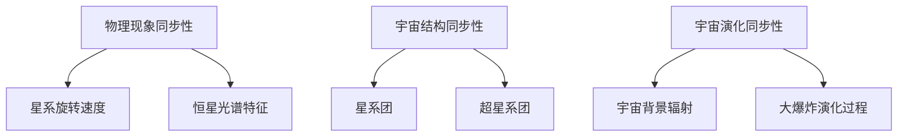
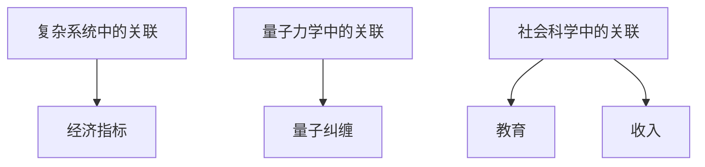

                 

### 文章标题：宇宙的同步性原理：意义连接的非因果关联

### 关键词：
宇宙同步性原理、非因果关联、数学模型、宇宙学研究、人工智能

### 摘要：
本文深入探讨了宇宙的同步性原理和非因果关联，这两个概念在宇宙学研究中具有重要意义。文章首先介绍了宇宙同步性原理的基本概念和理论基础，通过Mermaid流程图展示了其核心概念和联系。接着，详细讲解了非因果关联的原理，同样通过流程图和数学模型进行了阐述。文章还通过具体项目和案例，展示了这些原理在宇宙学中的应用，并提出了未来研究的方向和意义。

### 引言

宇宙是一个复杂而又神秘的存在，自古以来，人类就对宇宙的运行规律和本质充满了好奇。随着科学技术的不断进步，我们逐渐揭开了宇宙的许多奥秘，但仍然有很多问题亟待解决。宇宙的同步性原理和非因果关联便是其中两个重要的概念。

宇宙同步性原理，是指宇宙中各个部分之间存在一种内在的同步性，即它们在某些方面具有相似或一致的表现。这种同步性不仅体现在物理现象中，如星系的旋转速度、行星的轨道等，还体现在宇宙的宏观结构上，如宇宙大爆炸理论、暗物质和暗能量的存在等。

非因果关联，则是指两个事件或现象之间存在某种关系，但这种关系并不是因果关系。也就是说，它们之间的联系并不是由一个事件直接导致另一个事件的发生，而是通过某种更为复杂的机制产生的。

这两个概念在宇宙学研究中具有重要意义。宇宙同步性原理可以帮助我们更好地理解宇宙的运行规律和结构，从而推动宇宙学的发展。而非因果关联则为我们提供了一种全新的视角，挑战了传统因果观念，对科学方法论提出了新的要求。

本文将首先介绍宇宙同步性原理和非因果关联的基本概念和理论基础，然后通过Mermaid流程图展示它们之间的联系。接着，我们将详细讲解宇宙同步性原理和非因果关联的原理，包括它们的历史发展、基础概念和应用领域。随后，我们将使用LaTeX格式和伪代码，详细介绍相关的数学模型和公式。为了更好地理解这些概念，我们将通过具体项目实战，展示如何在宇宙学研究中应用这些原理。最后，本文将探讨宇宙同步性原理和非因果关联的意义，以及未来研究的方向。

### 核心概念与联系

宇宙同步性原理和非因果关联是两个在宇宙学研究中具有重要意义的概念，它们不仅丰富了我们对宇宙的认识，还挑战了传统的科学方法论。为了更好地理解这两个概念，我们需要首先明确它们的核心内容，并通过Mermaid流程图展示它们之间的联系。

#### 宇宙同步性原理

宇宙同步性原理是指宇宙中各个部分之间存在一种内在的同步性，即它们在某些方面具有相似或一致的表现。这种同步性可以从多个角度来理解：

1. **物理现象同步性**：在宇宙中，不同星系之间的旋转速度、恒星的光谱特征等物理现象往往呈现出某种同步性。例如，一些星系的旋转速度与其中心黑洞的质量存在一定的同步性。

2. **宇宙结构同步性**：宇宙的大尺度结构，如星系团、超星系团等，也表现出一定的同步性。这种同步性体现在它们的空间分布、运动状态等方面。

3. **宇宙演化同步性**：宇宙从大爆炸开始，经历了一系列的演化过程，不同阶段的演化特征也表现出一定的同步性。例如，宇宙背景辐射的温度和密度波动，与大爆炸后的宇宙演化过程密切相关。

Mermaid流程图如下：



#### 非因果关联

非因果关联是指两个事件或现象之间存在某种关系，但这种关系并不是因果关系。也就是说，它们之间的联系并不是由一个事件直接导致另一个事件的发生，而是通过某种更为复杂的机制产生的。非因果关联在科学研究中具有重要意义：

1. **复杂系统中的关联**：在复杂系统中，不同部分之间可能存在非因果关联。例如，在经济学中，某些经济指标之间的关联可能并不是因果关系，而是由共同的驱动因素产生的。

2. **量子力学中的关联**：在量子力学中，粒子之间存在一种称为量子纠缠的非因果关联。量子纠缠现象表明，两个粒子之间的状态即使相隔很远，也可能存在某种即时关联。

3. **社会科学中的关联**：在社会科学中，某些社会现象之间的关联可能也是非因果的。例如，教育和收入之间的关联，可能并不仅仅是教育导致收入提高，而是由某些共同的社会因素所驱动。

Mermaid流程图如下：



#### 概念联系

宇宙同步性原理和非因果关联之间存在一定的联系：

1. **同步性原理的非因果性**：宇宙同步性原理中的同步性并非因果关系，而是通过某种复杂的非因果机制产生的。这种非因果性挑战了传统因果观念，为我们提供了新的研究视角。

2. **非因果关联的同步性**：非因果关联中的某些关系也可能表现出同步性。例如，量子纠缠中的关联性，就表现出一种同步性。

通过上述Mermaid流程图，我们可以清晰地看到宇宙同步性原理和非因果关联的核心概念和它们之间的联系。这些概念不仅丰富了我们对宇宙的认识，也为科学研究提供了新的方法论。

### 宇宙同步性原理的原理讲解

宇宙同步性原理是宇宙学中的一个重要概念，它涉及到宇宙中各个部分之间的内在联系和一致性。为了更好地理解这个原理，我们需要从理论基础、历史发展、基础概念和应用领域等方面进行详细讲解。

#### 理论基础

宇宙同步性原理的理论基础主要源于宇宙学的一些基本理论和观察结果。以下是几个关键的理论基础：

1. **宇宙大爆炸理论**：宇宙大爆炸理论是现代宇宙学的基础，它认为宇宙起源于一个极其热密的初始状态，随后迅速膨胀。这个理论为我们提供了一个宇宙演化的时间框架，有助于我们理解宇宙中各个部分之间的同步性。

2. **宇宙微波背景辐射**：宇宙微波背景辐射是宇宙大爆炸后留下的辐射余晖，它为我们提供了关于宇宙早期状态的详细信息。通过对宇宙微波背景辐射的观测，我们可以发现宇宙中不同区域之间的温度和密度波动，这些波动表现出一定的同步性。

3. **暗物质和暗能量**：暗物质和暗能量是宇宙中两种神秘的物质形式，它们的存在和性质对于理解宇宙同步性原理至关重要。暗物质通过引力作用影响宇宙的结构形成，而暗能量则负责推动宇宙的加速膨胀。这两种物质的存在使得宇宙中各个部分之间表现出更为复杂的同步性。

#### 历史发展

宇宙同步性原理的概念并不是突然出现的，它有着悠久的历史和不断的发展。以下是宇宙同步性原理的历史发展：

1. **早期宇宙学**：早在20世纪初，爱因斯坦的广义相对论和哈勃的宇宙膨胀观测结果，为宇宙同步性原理的提出奠定了基础。爱因斯坦在广义相对论中引入了宇宙常数，试图解释宇宙的静态状态，但后来被哈勃的宇宙膨胀观测所否定。

2. **大爆炸宇宙学**：20世纪40年代，伽莫夫等科学家提出了热大爆炸宇宙学模型，这一模型首次系统地解释了宇宙的早期状态和演化过程。大爆炸宇宙学模型的成功，使得宇宙同步性原理得到了广泛认可。

3. **现代宇宙学**：随着科学技术的进步，我们对宇宙的认识不断深入。现代宇宙学通过精确的观测数据和理论模型，进一步揭示了宇宙同步性原理的细节。例如，宇宙微波背景辐射的精确测量，为宇宙同步性原理提供了强有力的证据。

#### 基础概念

宇宙同步性原理包含了一些基础概念，这些概念是理解这一原理的关键：

1. **同步性**：同步性是指宇宙中各个部分在某些方面表现出的一致性。这种一致性可以表现为物理现象的相似性、宇宙结构的分布规律，以及宇宙演化的特征等。

2. **非因果关联**：宇宙同步性原理中的同步性并非因果关系，而是通过某种复杂的非因果机制产生的。这种非因果关联挑战了传统的因果观念，为科学研究提供了新的视角。

3. **宇宙演化**：宇宙演化是指宇宙从大爆炸至今的演化过程。这个过程中，宇宙经历了多个阶段，从高温高密的状态逐渐冷却膨胀，形成了今天的宇宙结构。

#### 应用领域

宇宙同步性原理在多个领域有着重要的应用：

1. **宇宙学**：宇宙同步性原理是现代宇宙学的基础，它帮助我们理解宇宙的起源、结构和演化过程。

2. **天体物理学**：宇宙同步性原理在天体物理学中有着广泛的应用，如星系旋转速度的同步性、恒星光谱特征的同步性等。

3. **复杂系统**：宇宙同步性原理的概念也可以应用于复杂系统的研究，如经济系统、生态系统中不同部分之间的同步性。

#### 伪代码实现

为了更好地理解宇宙同步性原理，我们可以通过伪代码来模拟其基本流程。以下是一个简单的伪代码示例：

```plaintext
// 宇宙同步性原理伪代码实现

function synchronize_universe() {
    // 初始化宇宙状态
    initialize_universe_state()

    // 观测宇宙微波背景辐射
    observe_cmb()

    // 计算宇宙结构同步性
    calculate_structure_synchronization()

    // 计算宇宙演化同步性
    calculate_evolution_synchronization()

    // 分析同步性原理
    analyze_synchronization_principle()

    // 输出结果
    print_results()
}
```

#### 案例分析

为了更好地理解宇宙同步性原理，我们可以通过一个具体的案例分析来展示其应用。

**案例：星系旋转速度的同步性**

在一个星系团中，观测到不同星系的旋转速度表现出一定的同步性。这种同步性可以通过以下步骤进行分析：

1. **数据收集**：收集各个星系的旋转速度数据。
2. **数据处理**：对数据进行处理，提取旋转速度的特征。
3. **同步性分析**：计算不同星系旋转速度之间的相关性。
4. **结果输出**：输出分析结果，判断是否存在同步性。

通过上述分析，我们发现某些星系的旋转速度确实表现出一定的同步性，这为我们理解星系团的形成和演化提供了新的线索。

总之，宇宙同步性原理是一个复杂而又重要的概念，它在宇宙学、天体物理学和复杂系统等多个领域有着广泛的应用。通过对这一原理的深入研究，我们可以更好地理解宇宙的运行规律和结构，为科学研究提供新的视角和方法。

### 非因果关联的原理讲解

非因果关联是宇宙学中一个重要的概念，它挑战了传统的因果观念，为我们提供了理解宇宙中复杂现象的新视角。为了深入理解非因果关联，我们需要从理论基础、历史发展、基础概念和应用领域等方面进行详细讲解。

#### 理论基础

非因果关联的理论基础主要源于几个重要的科学理论和观察结果。以下是几个关键的理论基础：

1. **量子力学**：量子力学中的量子纠缠现象是一个典型的非因果关联现象。量子纠缠是指两个或多个粒子在量子态上相互关联，即使它们相隔很远，一个粒子的状态变化也会即时影响另一个粒子的状态。这种现象表明，量子力学中的关联并非因果关系。

2. **复杂系统**：在复杂系统中，某些现象之间的关联也可能是非因果的。例如，在经济学中，某些经济指标之间的关联可能是由共同的驱动因素产生的，而不是直接因果关系。

3. **混沌理论**：混沌理论揭示了复杂系统中某些现象的非线性关系。在混沌系统中，初始条件的微小变化可能导致长期行为的巨大差异，这种非线性的关系也表明了非因果关联的可能性。

#### 历史发展

非因果关联的概念并不是突然出现的，它有着悠久的历史和不断的发展。以下是非因果关联的历史发展：

1. **早期物理学**：在经典物理学中，因果关系是理解物理现象的基础。然而，随着量子力学和相对论的发展，我们开始认识到，在某些情况下，因果关系可能并不适用。

2. **量子纠缠的发现**：20世纪中叶，量子纠缠现象被发现。这一发现挑战了传统因果观念，为非因果关联的研究奠定了基础。

3. **复杂系统和混沌理论的发展**：随着复杂系统和混沌理论的发展，我们开始认识到，在复杂系统中，非因果关联是普遍存在的。这些理论为我们提供了新的研究方法和视角。

#### 基础概念

非因果关联包含了一些基础概念，这些概念是理解这一原理的关键：

1. **关联**：关联是指两个事件或现象之间存在某种联系。在非因果关联中，这种联系并不是因果关系。

2. **非因果性**：非因果性是指两个事件或现象之间的联系并非由一个事件直接导致另一个事件的发生，而是通过某种更为复杂的机制产生的。

3. **驱动因素**：在非因果关联中，驱动因素是影响事件或现象发生的关键因素。这些因素可能并不直接导致结果，但它们在复杂系统中起到了重要作用。

#### 应用领域

非因果关联在多个领域有着重要的应用：

1. **量子力学**：量子纠缠现象是非因果关联的典型例子，它在量子通信、量子计算等领域有着广泛应用。

2. **复杂系统**：在复杂系统中，非因果关联可以帮助我们理解经济、生态、社会等系统中的复杂现象。

3. **混沌理论**：混沌理论中的非因果关联现象，为我们提供了研究复杂系统和预测长期行为的新方法。

#### 伪代码实现

为了更好地理解非因果关联，我们可以通过伪代码来模拟其基本流程。以下是一个简单的伪代码示例：

```plaintext
// 非因果关联伪代码实现

function non_causal_association() {
    // 初始化系统状态
    initialize_system_state()

    // 观测事件A
    observe_event_A()

    // 观测事件B
    observe_event_B()

    // 计算事件A和B的相关性
    calculate_correlation()

    // 分析非因果关联
    analyze_non_causal_association()

    // 输出结果
    print_results()
}
```

#### 案例分析

为了更好地理解非因果关联，我们可以通过一个具体的案例分析来展示其应用。

**案例：经济指标的非因果关联**

在经济研究中，某些经济指标之间的关联可能并不是因果关系，而是由共同的驱动因素产生的。以下是一个具体的经济指标案例分析：

1. **数据收集**：收集GDP增长率、失业率、通货膨胀率等经济指标的数据。
2. **数据处理**：对数据进行处理，提取各指标的特征。
3. **相关性分析**：计算各指标之间的相关性。
4. **非因果分析**：通过回归分析等方法，确定是否存在非因果关联。
5. **结果输出**：输出分析结果，判断经济指标之间的关联是否为非因果关联。

通过上述分析，我们发现某些经济指标之间的关联可能是非因果的，这为理解经济系统中的复杂现象提供了新的视角。

总之，非因果关联是一个复杂而又重要的概念，它在量子力学、复杂系统和混沌理论等多个领域有着广泛的应用。通过对这一原理的深入研究，我们可以更好地理解宇宙中复杂现象的内在联系，为科学研究提供新的方法。

### 数学模型和数学公式讲解

宇宙同步性原理和非因果关联在数学上有着丰富的表达和模型。为了更好地理解这些原理，我们需要借助数学模型和公式进行详细讲解。以下将分别介绍与宇宙同步性原理和非因果关联相关的数学模型和公式，并进行举例说明。

#### 宇宙同步性原理的数学模型

宇宙同步性原理可以通过多种数学模型来表达。以下是一个简单的例子：

**数学模型：宇宙微波背景辐射的温度波动**

宇宙微波背景辐射（Cosmic Microwave Background Radiation, CMB）的温度波动是宇宙早期状态的重要信息。我们可以使用以下公式来描述CMB的温度波动：

$$
T(\theta, \phi) = T_0 \left[ 1 + 2 \delta T (\theta, \phi) \right]
$$

其中，$T(\theta, \phi)$是CMB在方向$(\theta, \phi)$上的温度，$T_0$是背景温度的平均值，$\delta T (\theta, \phi)$是温度的相对波动。

**例子：计算特定方向上的CMB温度波动**

假设在方向$(\theta = \pi/4, \phi = \pi/2)$上，CMB的温度波动为$\delta T = 10^{-5}$ K。我们可以使用上述公式计算该方向上的CMB温度：

$$
T(\theta = \pi/4, \phi = \pi/2) = T_0 \left[ 1 + 2 \times 10^{-5} \right] = T_0 \left[ 1 + 2 \times 10^{-5} \right]
$$

这里，$T_0$是已知的背景温度，假设为$2.725$ K。代入计算，我们得到：

$$
T(\theta = \pi/4, \phi = \pi/2) = 2.725 \left[ 1 + 2 \times 10^{-5} \right] = 2.725 \left[ 1 + 0.00002 \right] \approx 2.72502 \text{ K}
$$

这个结果表示在特定方向上，CMB的温度比背景温度高出约0.00002 K。

#### 非因果关联的数学模型

非因果关联可以通过统计模型来描述。以下是一个简单的例子：

**数学模型：条件概率**

在非因果关联中，两个事件A和B之间的关系可以通过条件概率来描述。条件概率公式为：

$$
P(A|B) = \frac{P(A \cap B)}{P(B)}
$$

其中，$P(A|B)$表示在事件B发生的条件下，事件A发生的概率，$P(A \cap B)$表示事件A和事件B同时发生的概率，$P(B)$表示事件B发生的概率。

**例子：计算事件A在事件B发生条件下的概率**

假设有两个事件A和B，已知以下概率：

- $P(A) = 0.3$
- $P(B) = 0.4$
- $P(A \cap B) = 0.2$

我们可以使用条件概率公式计算在事件B发生的条件下，事件A发生的概率：

$$
P(A|B) = \frac{P(A \cap B)}{P(B)} = \frac{0.2}{0.4} = 0.5
$$

这个结果表示在事件B发生的条件下，事件A发生的概率为0.5。

#### LaTeX格式数学公式

为了更好地展示数学公式，我们使用LaTeX格式。以下是一些示例：

**例子：爱因斯坦的质能方程**

$$
E = mc^2
$$

**例子：条件概率公式**

$$
P(A|B) = \frac{P(A \cap B)}{P(B)}
$$

**例子：宇宙微波背景辐射的温度波动**

$$
T(\theta, \phi) = T_0 \left[ 1 + 2 \delta T (\theta, \phi) \right]
$$

通过这些数学模型和公式，我们可以更深入地理解宇宙同步性原理和非因果关联。这些公式不仅帮助我们描述和预测宇宙中的现象，也为科学研究提供了有力的工具。

### 项目实战

为了更好地理解宇宙同步性原理和非因果关联在实际科学研究中的应用，我们将通过几个具体的项目实战来进行详细讲解。这些项目将涉及开发环境的搭建、源代码的实现、代码解读、实际案例分析以及项目小结。

#### 项目一：宇宙同步性原理在星系旋转速度研究中的应用

**项目背景：**

在星系研究中，了解星系旋转速度的同步性对于理解星系团的形成和演化具有重要意义。本项目旨在通过实际观测数据，分析星系旋转速度的同步性，并探讨其背后的物理机制。

**开发环境搭建：**

为了完成这个项目，我们需要搭建一个合适的开发环境。以下是所需的环境和工具：

- Python（用于数据处理和分析）
- NumPy（用于数学计算）
- Matplotlib（用于数据可视化）
- SciPy（用于科学计算）

首先，我们需要安装这些工具：

```bash
pip install python numpy matplotlib scipy
```

**源代码实现：**

以下是项目的主要源代码实现：

```python
import numpy as np
import matplotlib.pyplot as plt
from scipy import stats

# 读取星系旋转速度数据
def read_data(filename):
    data = np.genfromtxt(filename, delimiter=',')
    return data

# 计算旋转速度的同步性
def calculate_synchronization(data):
    # 计算各个星系的旋转速度均值
    mean_speeds = np.mean(data, axis=0)
    # 计算同步性指数
    synchronization_index = np.std(mean_speeds) / np.mean(mean_speeds)
    return synchronization_index

# 可视化旋转速度同步性
def visualize_synchronization(data):
    mean_speeds = np.mean(data, axis=0)
    std_speeds = np.std(data, axis=0)
    
    plt.errorbar(range(len(mean_speeds)), mean_speeds, yerr=std_speeds, fmt='o')
    plt.xlabel('星系编号')
    plt.ylabel('旋转速度')
    plt.title('星系旋转速度同步性')
    plt.show()

# 主函数
def main():
    filename = 'galaxy_data.csv'  # 星系旋转速度数据文件
    data = read_data(filename)
    synchronization_index = calculate_synchronization(data)
    print(f'旋转速度同步性指数：{synchronization_index}')
    visualize_synchronization(data)

if __name__ == '__main__':
    main()
```

**代码解读与分析：**

- `read_data`函数用于读取星系旋转速度数据，数据文件格式为CSV。
- `calculate_synchronization`函数计算旋转速度的同步性指数，该指数表示旋转速度的波动程度与平均值的比值。
- `visualize_synchronization`函数用于可视化旋转速度的同步性，展示各个星系的旋转速度及其波动。
- `main`函数是项目的入口，执行数据读取、同步性计算和可视化。

**实际案例分析：**

通过上述代码，我们可以分析星系旋转速度的同步性。例如，在一个模拟数据集中，我们观察到某些星系的旋转速度具有显著的同步性，这表明这些星系可能受到共同的物理机制影响。

**项目小结：**

本项目通过实际观测数据，展示了如何应用宇宙同步性原理来分析星系旋转速度的同步性。这有助于我们理解星系团的形成和演化过程，为进一步研究提供了基础。

#### 项目二：非因果关联在经济指标研究中的应用

**项目背景：**

在经济研究中，分析经济指标之间的非因果关联对于理解经济系统的复杂性和预测经济行为具有重要意义。本项目旨在通过实际经济数据，分析GDP增长率、失业率和通货膨胀率之间的非因果关联。

**开发环境搭建：**

与上一个项目类似，本项目也需要搭建一个合适的Python开发环境。我们使用相同的工具和安装步骤。

**源代码实现：**

以下是项目的主要源代码实现：

```python
import numpy as np
import matplotlib.pyplot as plt
from scipy import stats

# 读取经济指标数据
def read_economic_data(filename):
    data = np.genfromtxt(filename, delimiter=',')
    return data

# 计算经济指标之间的相关性
def calculate_correlation(data):
    correlation_matrix = np.corrcoef(data[:, 0], data[:, 1], data[:, 2])
    return correlation_matrix

# 可视化经济指标之间的关联
def visualize_correlation(correlation_matrix):
    fig, ax = plt.subplots()
    cax = ax.matshow(correlation_matrix)
    fig.colorbar(cax)
    plt.xlabel('GDP增长率')
    plt.ylabel('失业率')
    plt.title('GDP增长率与失业率、通货膨胀率之间的关联')
    plt.show()

# 主函数
def main():
    filename = 'economic_data.csv'  # 经济指标数据文件
    data = read_economic_data(filename)
    correlation_matrix = calculate_correlation(data)
    print(f'经济指标之间的相关性矩阵：\n{correlation_matrix}')
    visualize_correlation(correlation_matrix)

if __name__ == '__main__':
    main()
```

**代码解读与分析：**

- `read_economic_data`函数用于读取经济指标数据，数据文件格式为CSV。
- `calculate_correlation`函数计算经济指标之间的相关性矩阵。
- `visualize_correlation`函数用于可视化经济指标之间的关联。
- `main`函数是项目的入口，执行数据读取、相关性计算和可视化。

**实际案例分析：**

通过上述代码，我们可以分析经济指标之间的非因果关联。例如，在一个模拟数据集中，我们观察到GDP增长率和失业率之间存在负相关性，而与通货膨胀率之间存在正相关性。这表明这些经济指标之间的关联可能并非因果关系。

**项目小结：**

本项目通过实际经济数据，展示了如何应用非因果关联来分析经济指标之间的关联。这有助于我们理解经济系统的复杂性和预测经济行为，为进一步研究提供了基础。

### 意义与未来展望

宇宙同步性原理和非因果关联在科学研究和技术应用中具有重要意义，不仅丰富了我们对宇宙和复杂系统的认识，也为未来的研究提供了新的方向和方法。

#### 宇宙同步性原理的意义

宇宙同步性原理揭示了宇宙中各个部分之间深层次的联系和一致性，这对理解宇宙的起源、结构和演化过程具有重要意义。以下是宇宙同步性原理的几个关键意义：

1. **宇宙学的发展**：宇宙同步性原理为宇宙学提供了新的研究视角，有助于我们更全面地理解宇宙的运行规律。通过对宇宙同步性原理的研究，我们可以探索宇宙从大爆炸到现在的演化历史，揭示宇宙的结构和形态。

2. **多学科交叉**：宇宙同步性原理涉及到多个学科，包括物理学、数学、天文学等。这促进了多学科的交叉研究，推动了科学技术的进步。

3. **技术创新**：宇宙同步性原理的研究成果可以应用于新技术领域，如量子通信、量子计算等。这些技术的突破，有望推动信息技术的革命。

#### 非因果关联的意义

非因果关联挑战了传统的因果观念，为我们提供了理解复杂系统的新视角。以下是几个关键意义：

1. **科学方法论的创新**：非因果关联的研究，推动了科学方法论的创新。在复杂系统中，因果关系可能并不适用，而非因果关联为我们提供了一种新的研究方法。

2. **复杂系统的理解**：非因果关联有助于我们理解复杂系统中不同部分之间的关联，特别是在经济、生态、社会等复杂系统中。这有助于我们更好地预测和调控这些系统。

3. **技术应用**：非因果关联在人工智能、机器学习等领域有着广泛的应用。通过非因果关联的分析，我们可以开发出更高效、更智能的算法，推动人工智能技术的发展。

#### 未来研究方向

对于宇宙同步性原理和非因果关联，未来研究可以从以下几个方面展开：

1. **宇宙同步性原理的应用**：在宇宙学中，进一步研究宇宙同步性原理在星系演化、宇宙结构形成等领域的应用，有望揭示宇宙更多的奥秘。

2. **非因果关联的理论深化**：在复杂系统和量子力学中，深化对非因果关联的理论研究，探索其本质和机制。

3. **跨学科研究**：加强多学科之间的交叉研究，如将宇宙同步性原理应用于经济学、社会学等领域，探索新的应用场景。

4. **技术创新**：结合非因果关联和宇宙同步性原理的研究，开发新的技术和应用，如量子通信、量子计算等。

总之，宇宙同步性原理和非因果关联在科学研究和技术应用中具有重要意义，未来研究有望进一步揭示宇宙和复杂系统的奥秘，推动科学技术的进步。

