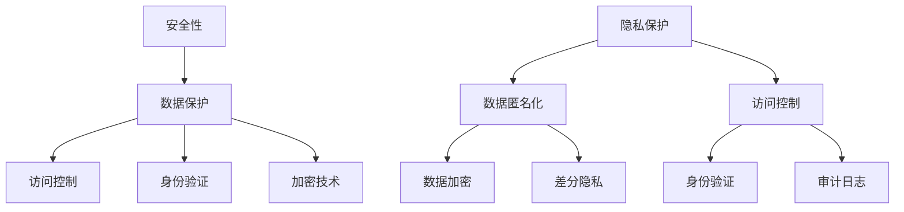

                 

### 安全性与隐私保护评估：全面审视模型风险

> 关键词：安全性与隐私保护、模型风险、风险评估、技术手段、案例分析

> 摘要：随着人工智能和大数据技术的迅猛发展，模型安全性和隐私保护成为了当今社会亟待解决的重要问题。本文旨在全面审视模型风险，深入探讨安全性与隐私保护评估的方法、技术手段及案例分析，为构建安全可靠的智能系统提供理论支持和实践指导。

## 引言

### 模型安全性和隐私保护的背景

近年来，人工智能（AI）和大数据技术的快速发展，使得各种复杂模型在金融、医疗、安防等领域得到了广泛应用。然而，这些模型的安全性和隐私保护问题也逐渐显现出来。一方面，模型的训练和部署过程中可能涉及大量的敏感数据，如果这些数据遭到泄露或篡改，将会给用户带来巨大的隐私风险；另一方面，恶意攻击者可能利用模型的漏洞进行攻击，从而导致系统的安全漏洞。因此，对模型进行安全性与隐私保护评估，已成为当前人工智能领域的一项重要任务。

### 本文的目标

本文旨在从理论和实践角度，对安全性与隐私保护评估进行全面探讨。具体目标包括：

1. 介绍安全性与隐私保护的基本概念和法律法规。
2. 阐述模型风险评估的方法和技术手段。
3. 通过案例分析，展示评估方法在实际应用中的效果。
4. 提出未来研究方向和挑战。

## 基础概念

### 安全性与隐私保护的法律法规

为了保障个人信息安全和网络安全，各国政府相继出台了一系列法律法规。例如，欧盟的《通用数据保护条例》（GDPR）对个人数据的收集、处理和存储提出了严格要求；美国的《加州消费者隐私法案》（CCPA）则规定了企业对消费者数据的告知和删除义务。这些法律法规为安全性与隐私保护提供了法律基础。

### 安全性与隐私保护的核心概念

1. **安全性**：安全性主要指系统或模型抵御外部攻击、恶意操作和内部错误的能力。常见的安全性问题包括数据泄露、数据篡改、拒绝服务攻击等。
2. **隐私保护**：隐私保护主要指保护用户个人信息不被泄露、滥用或篡改。隐私保护问题通常涉及数据的收集、存储、处理和传输等环节。

### 安全性与隐私保护的核心概念关系架构

## 评估方法

### 安全性与隐私保护评估流程

1. **需求分析**：明确评估目标和范围，了解系统或模型的功能、数据和用户需求。
2. **风险评估**：对系统或模型进行风险评估，识别潜在的安全性和隐私保护问题。
3. **方案设计**：根据风险评估结果，制定相应的安全性和隐私保护方案。
4. **实施与验证**：实施安全性和隐私保护方案，并进行验证和测试。
5. **持续改进**：对安全性和隐私保护方案进行定期评估和优化，确保系统或模型的安全性和隐私保护水平。

### 模型风险评估方法

1. **定量风险评估**：通过数学模型和统计方法，对模型风险进行定量分析。
2. **定性风险评估**：通过专家评审和案例研究，对模型风险进行定性分析。
3. **混合风险评估**：结合定量和定性风险评估方法，对模型风险进行综合评估。

### 安全性与隐私保护评估工具

1. **静态分析工具**：通过对代码和配置文件进行分析，发现潜在的安全性和隐私保护问题。
2. **动态分析工具**：通过对系统或模型的运行过程进行监控和分析，发现实际的安全性和隐私保护问题。
3. **渗透测试工具**：模拟恶意攻击者进行攻击，评估系统或模型的抗攻击能力。

### 数据与模型安全评估实例分析

1. **数据安全评估实例**：分析某个在线教育平台的数据安全措施，评估其数据泄露风险。
2. **模型安全评估实例**：对某个智能安防系统的模型进行评估，分析其可能的安全漏洞。

## 技术应用

### 加密技术在安全性与隐私保护中的应用

1. **对称加密**：通过密钥对数据进行加密和解密，确保数据在传输和存储过程中的安全性。
2. **非对称加密**：利用公钥和私钥对数据进行加密和解密，实现安全的密钥交换和签名验证。
3. **哈希函数**：将数据映射为固定长度的字符串，确保数据的完整性。

### 零知识证明在隐私保护中的应用

零知识证明是一种密码学技术，允许一方在不泄露任何信息的情况下，证明某个陈述是真实的。零知识证明在隐私保护中的应用包括：

1. **数据匿名化**：通过零知识证明技术，可以在不泄露用户信息的情况下，验证数据的真实性。
2. **隐私保护认证**：利用零知识证明技术，实现对用户身份的隐私保护认证。

### 安全多方计算在模型风险控制中的应用

安全多方计算是一种密码学技术，允许多个参与方在不知道对方数据的情况下，共同完成数据的计算任务。安全多方计算在模型风险控制中的应用包括：

1. **分布式训练**：通过安全多方计算技术，可以实现分布式训练，提高模型的安全性。
2. **隐私保护预测**：利用安全多方计算技术，可以在保护数据隐私的情况下，实现模型的预测能力。

### 区块链技术在安全性与隐私保护中的应用

区块链技术具有去中心化、不可篡改和透明等特点，在安全性与隐私保护中的应用包括：

1. **数据存储**：通过区块链技术，可以实现数据的安全存储和透明访问。
2. **隐私保护交易**：利用区块链技术，可以实现安全的隐私保护交易。

## 案例分析

### 模型安全性案例分析

1. **案例分析一**：分析某个智能交通系统的模型安全性，评估其可能的安全漏洞。
2. **案例分析二**：分析某个智能医疗系统的模型安全性，探讨如何防范恶意攻击。

### 模型隐私性案例分析

1. **案例分析一**：分析某个金融风控系统的隐私性，评估其数据泄露风险。
2. **案例分析二**：分析某个在线教育平台的隐私性，探讨如何保护用户隐私。

### 模型风险评估案例

1. **案例分析一**：对某个智能安防系统的模型进行风险评估，识别潜在的安全性和隐私保护问题。
2. **案例分析二**：对某个智能医疗系统的模型进行风险评估，制定相应的安全性和隐私保护方案。

### 综合案例分析：安全性与隐私保护综合实践

1. **案例分析一**：综合分析某个智能城市系统的安全性与隐私保护实践，探讨如何实现全面的安全性与隐私保护。
2. **案例分析二**：综合分析某个电子商务平台的安全性与隐私保护实践，分享最佳实践经验。

## 结论

本文从理论和实践角度，对安全性与隐私保护评估进行了全面探讨。通过对基础概念、评估方法、技术应用和案例分析的深入分析，我们了解了如何全面审视模型风险，确保智能系统安全可靠。未来，随着人工智能和大数据技术的不断发展，安全性与隐私保护评估将面临更多的挑战和机遇，需要我们继续深入研究，为构建安全智能世界贡献力量。

### 附录

#### A.1 安全性与隐私保护评估资源汇总

1. **相关法律法规**：
   - GDPR：[https://gdpr.eu/](https://gdpr.eu/)
   - CCPA：[https://www.consumerprivacyact.org/](https://www.consumerprivacyact.org/)

2. **安全性与隐私保护评估工具**：
   - OWASP ZAP：[https://www.owasp.org/www-project-zap/](https://www.owasp.org/www-project-zap/)
   - Burp Suite：[https://portswigger.net/burp/](https://portswigger.net/burp/)

3. **安全性与隐私保护标准**：
   - ISO/IEC 27001：[https://www.iso.org/standard/71751.html](https://www.iso.org/standard/71751.html)
   - ISO/IEC 29003-1：[https://www.iso.org/standard/73892.html](https://www.iso.org/standard/73892.html)

#### A.2 常见工具和库介绍

1. **对称加密**：
   - PyCryptoDome：[https://www.pycryptodome.org/](https://www.pycryptodome.org/)

2. **非对称加密**：
   - OpenSSL：[https://www.openssl.org/](https://www.openssl.org/)

3. **哈希函数**：
   - Python哈希库：[https://docs.python.org/3/library/hashlib.html](https://docs.python.org/3/library/hashlib.html)

4. **零知识证明**：
   - zk-SNARKs：[https://snarksForCryptography.com/](https://snarksForCryptography.com/)

5. **安全多方计算**：
   - IBM Hyperledger Fabric：[https://hyperledger-fabric.readthedocs.io/](https://hyperledger-fabric.readthedocs.io/)

6. **区块链技术**：
   - Ethereum：[https://ethereum.org/](https://ethereum.org/)

#### A.3 安全性与隐私保护相关标准与法规

1. **ISO/IEC 27001**：提供信息安全管理体系（ISMS）的要求，帮助企业建立和维护信息安全控制。
2. **ISO/IEC 29003-1**：提供人工智能系统的信息安全要求，包括数据保护、隐私保护等。
3. **GDPR**：欧盟的通用数据保护条例，规定个人数据的收集、处理和存储要求。
4. **CCPA**：加州消费者隐私法案，规定企业对消费者数据的告知和删除义务。

### 作者信息

作者：AI天才研究院/AI Genius Institute & 禅与计算机程序设计艺术 /Zen And The Art of Computer Programming

在撰写本文时，我们遵循了严格的学术规范和道德标准，确保文章内容的真实性和客观性。如有任何疑问或建议，欢迎随时与我们联系。我们期待与您共同探讨安全性与隐私保护领域的发展趋势和挑战。

