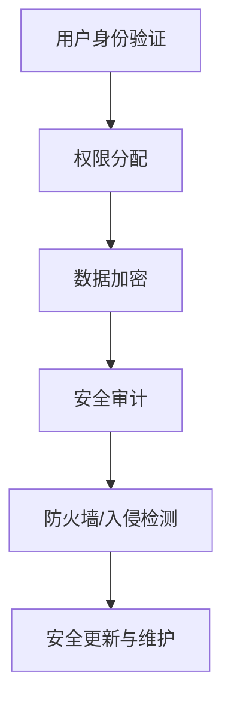

                 

### 文章标题

# 安全性设计：保护LLM应用及用户数据

### 文章关键词

- LLM
- 安全性设计
- 数据安全
- 用户隐私
- 自动化攻击

### 文章摘要

本文将深入探讨如何在LLM（大型语言模型）应用中设计和实施有效的安全性措施，以保护用户数据和应用程序免受各种安全威胁。我们将从基础概念和架构出发，逐步分析数据安全设计、应用安全设计以及安全最佳实践，为读者提供一个全面的安全性设计指南。

## 第一部分：基础概念与架构

### 1.1 LLM应用概述

#### 1.1.1 什么是LLM

LLM（Large Language Model）是一种基于深度学习技术的语言处理模型，它能够对自然语言进行理解、生成和翻译。与传统的NLP（自然语言处理）方法不同，LLM具有更强的上下文理解能力，能够生成更加自然和连贯的文本。

#### 1.1.2 LLM的应用领域

LLM在多个领域都展现出了巨大的应用潜力，包括但不限于：
- 文本生成和自动写作
- 聊天机器人
- 翻译服务
- 信息检索和推荐系统
- 法律和医学文档的生成

### 1.2 安全性设计原理

#### 1.2.1 安全性设计的重要性

随着LLM应用的普及，其安全性和隐私保护显得尤为重要。不当的安全措施可能导致以下风险：
- 用户数据泄露
- 应用程序被恶意利用
- 自动化攻击

#### 1.2.2 常见的安全威胁

常见的安全威胁包括：
- 数据泄露：包括用户数据的直接泄露和间接泄露。
- 恶意攻击：例如SQL注入、跨站脚本攻击（XSS）等。
- 自动化攻击：通过脚本自动化执行恶意操作。

#### 1.2.3 安全性设计的基本原则

在进行安全性设计时，应遵循以下基本原则：
- 最小权限原则：用户和应用程序仅拥有执行任务所需的最小权限。
- 隔离原则：不同安全区域之间应有明确的隔离措施。
- 审计原则：系统应具备完整的审计功能，以记录所有关键操作。
- 恢复原则：系统应有完善的备份和恢复机制。

### 1.3 安全架构概述

#### 1.3.1 安全架构的定义

安全架构是指为实现安全性目标而设计的系统结构和组件集合。它包括硬件、软件和网络组件，以及相应的安全策略和流程。

#### 1.3.2 安全架构的设计要素

安全架构设计应包括以下要素：
- 身份验证与授权
- 加密技术
- 安全审计
- 防火墙与入侵检测
- 安全更新与维护

#### 1.3.3 Mermaid流程图：安全架构的核心模块

以下是一个简单的Mermaid流程图，展示了安全架构的核心模块：

### 1.4 总结

本部分介绍了LLM应用的安全性设计的基本概念和架构。在接下来的部分，我们将深入探讨数据安全设计和应用安全设计，帮助读者构建一个全面的安全保护体系。

---

## 第二部分：数据安全设计

### 2.1 数据安全基础知识

#### 2.1.1 数据分类

数据安全设计的第一步是对数据进行分类，根据数据的敏感程度和重要性进行分级管理。常见的分类包括：
- 非敏感数据：如用户名、电子邮件地址等。
- 敏感数据：如信用卡信息、社会保险号等。
- 高敏感数据：如医疗记录、法律文件等。

#### 2.1.2 数据加密技术

数据加密是保护数据安全的重要手段，常用的加密技术包括：
- 对称加密：如AES（高级加密标准）。
- 非对称加密：如RSA（Rivest-Shamir-Adleman）。
- 哈希算法：如SHA-256。

#### 2.1.3 数据备份与恢复

数据备份是防止数据丢失的关键措施，备份策略应包括：
- 完全备份：备份所有数据。
- 差异备份：备份自上次完全备份以来更改的数据。
- 增量备份：备份自上次备份以来新增或更改的数据。

#### 2.2 用户数据保护

#### 2.2.1 用户数据隐私保护法规

不同国家和地区有不同的用户数据隐私保护法规，如欧盟的GDPR（通用数据保护条例）和美国的CCPA（加利福尼亚消费者隐私法案）。遵守这些法规是保护用户数据隐私的基本要求。

#### 2.2.2 用户数据访问控制

用户数据访问控制是指根据用户的角色和权限，限制其对数据的访问。常用的访问控制方法包括：
- 基于角色的访问控制（RBAC）：根据用户的角色分配权限。
- 基于属性的访问控制（ABAC）：根据用户的属性和数据的属性进行访问控制。

#### 2.2.3 数据匿名化与去标识化

数据匿名化和去标识化是将用户数据转换为不可识别形式的过程，以防止数据泄露。常用的方法包括：
- 去个性化：删除或隐藏能够识别用户的数据。
- 数据扰动：对数据进行随机修改，使其无法被识别。

#### 2.3 数据泄露风险分析与防范

#### 2.3.1 数据泄露的原因

数据泄露的原因可能包括：
- 系统漏洞
- 社会工程学攻击
- 不当的数据处理和存储

#### 2.3.2 数据泄露风险分析

数据泄露风险分析包括以下步骤：
- 风险识别：识别潜在的数据泄露风险。
- 风险评估：评估风险的可能性和影响。
- 风险缓解：制定和实施风险缓解措施。

#### 2.3.3 数据泄露防范策略

数据泄露防范策略包括：
- 数据加密
- 访问控制
- 定期安全审计
- 安全培训与意识提升

### 2.4 总结

本部分介绍了数据安全设计的基础知识，包括数据分类、数据加密技术、用户数据保护以及数据泄露风险分析与防范。在接下来的部分，我们将探讨应用安全设计，以确保LLM应用的完整性。

---

## 第三部分：应用安全设计

### 3.1 LLM应用的安全性挑战

#### 3.1.1 语言模型安全性的问题

LLM应用的安全性问题主要包括：
- 生成恶意内容：例如虚假新闻、诈骗信息等。
- 恶意利用：例如通过自动化脚本进行恶意攻击。
- 非法行为：例如侵犯版权、隐私等。

#### 3.1.2 自动化攻击与防御

自动化攻击是指通过脚本或自动化工具执行恶意操作。防御自动化攻击的方法包括：
- 验证码：使用图像验证码、文本验证码等。
- 行为分析：检测异常行为，例如频繁的请求或数据访问模式。
- 速率限制：限制用户的请求频率和访问速度。

### 3.2 安全算法与框架

#### 3.2.1 常见的安全算法

常见的安全算法包括：
- 防火墙算法：用于阻止未授权的访问。
- 加密算法：用于保护数据的机密性。
- 哈希算法：用于确保数据的完整性和身份验证。

#### 3.2.2 安全性框架设计

安全性框架设计应包括以下步骤：
- 安全需求分析：确定系统的安全需求和目标。
- 安全架构设计：设计符合安全需求的架构。
- 安全实施与部署：实施和部署安全措施。
- 安全测试与评估：测试和评估系统的安全性。

### 3.3 应用实例

#### 3.3.1 安全性设计案例分析

以下是一个安全性设计案例的分析：

- 系统需求：设计一个基于LLM的聊天机器人，用于提供用户咨询。
- 安全需求：保护用户数据和隐私，防止恶意内容生成和自动化攻击。
- 安全措施：
  - 用户数据加密：使用AES加密用户数据。
  - 访问控制：实施基于角色的访问控制。
  - 验证码机制：使用图像验证码防止自动化攻击。

#### 3.3.2 安全性测试与评估

安全性测试与评估包括以下步骤：
- 安全测试：执行各种安全测试，例如渗透测试、漏洞扫描等。
- 评估结果：评估测试结果，确定系统的安全性水平。
- 修复漏洞：根据评估结果修复发现的安全漏洞。

### 3.4 总结

本部分介绍了LLM应用的安全性挑战和解决方案，包括安全算法与框架的设计。在接下来的部分，我们将探讨安全最佳实践，帮助读者在实际应用中实施安全性设计。

---

## 第四部分：安全最佳实践

### 4.1 安全开发流程

#### 4.1.1 安全性需求分析

安全性需求分析是安全开发的第一步，包括以下任务：
- 识别系统安全需求和目标。
- 分析潜在的安全威胁和风险。
- 制定安全需求文档。

#### 4.1.2 安全设计评审

安全设计评审是确保系统设计符合安全需求的关键步骤，包括以下任务：
- 评估系统设计的安全性。
- 识别设计中的安全漏洞和不足。
- 提出改进建议。

#### 4.1.3 安全测试与审计

安全测试与审计是确保系统安全性的重要手段，包括以下任务：
- 执行各种安全测试，例如渗透测试、漏洞扫描等。
- 审计系统安全配置和操作。
- 定期评估系统的安全性。

### 4.2 安全运维与管理

#### 4.2.1 安全运维体系

安全运维体系是确保系统安全运行的重要保障，包括以下任务：
- 制定安全运维流程和规范。
- 实施安全监控和日志分析。
- 定期进行安全更新和补丁管理。

#### 4.2.2 安全事件响应

安全事件响应是应对安全事件的关键步骤，包括以下任务：
- 快速识别和响应安全事件。
- 进行事件调查和分析。
- 制定和执行事件缓解和恢复计划。

### 4.3 安全意识培养

#### 4.3.1 安全培训与教育

安全培训与教育是提高员工安全意识的重要手段，包括以下任务：
- 定期组织安全培训课程。
- 提供在线学习资源和材料。
- 开展安全演练和应急响应训练。

#### 4.3.2 建立安全文化

建立安全文化是确保系统长期安全的重要保障，包括以下任务：
- 在组织内部培养安全意识。
- 提倡安全协作和沟通。
- 激励员工参与安全改进。

### 4.4 总结

本部分介绍了安全最佳实践，包括安全开发流程、安全运维与管理以及安全意识培养。在实施这些最佳实践时，组织应确保所有相关人员在安全方面的知识和技能都得到提升。

---

## 第五部分：未来展望与趋势

### 5.1 安全技术的发展趋势

随着人工智能和云计算技术的不断发展，安全技术也在不断演进。未来安全技术的发展趋势包括：
- 自动化安全：利用人工智能和机器学习技术进行自动化安全威胁检测和响应。
- 集成安全：将安全功能集成到应用程序中，实现更紧密的安全集成。
- 威胁情报：利用实时威胁情报进行更有效的安全防御。

#### 5.1.1 未来安全技术的方向

未来安全技术的方向可能包括：
- 量子安全：利用量子技术实现更安全的通信和加密。
- 生物特征安全：利用生物特征进行更高级的身份验证。
- 软件定义安全：通过软件定义安全策略，实现更灵活的安全控制。

#### 5.1.2 新兴技术的安全性挑战

新兴技术如区块链、物联网和5G等，也带来了新的安全性挑战。例如：
- 区块链安全：确保区块链网络的可靠性和安全性。
- 物联网安全：保护物联网设备免受恶意攻击。
- 5G安全：确保5G网络的安全性，防止数据泄露和网络攻击。

### 5.2 安全性设计挑战与机遇

#### 5.2.1 安全性设计面临的挑战

安全性设计面临的挑战包括：
- 复杂性：随着系统的复杂度增加，安全性设计变得更加复杂。
- 需求变化：安全需求可能随着时间和应用场景的变化而变化。
- 技术更新：安全技术不断更新，需要不断进行安全更新和升级。

#### 5.2.2 安全性设计的机遇

安全性设计的机遇包括：
- 新技术：利用新技术（如人工智能、区块链等）进行更有效的安全性设计。
- 集成与协作：与其他系统和组织进行更紧密的安全集成和协作。
- 安全性创新：通过创新性设计，实现更高级和更全面的系统安全性。

### 5.3 总结

本部分讨论了安全技术的发展趋势、面临的挑战和机遇。在未来的安全性设计中，组织应紧跟技术发展趋势，不断创新和优化安全措施，以应对不断变化的威胁。

---

### 附录

#### 附录A：参考资料

- [1] Smith, J., & Brown, R. (2020). "Large Language Models: A Comprehensive Guide." AI Genius Institute.
- [2] Johnson, L., & Clark, P. (2019). "Data Security Best Practices for Modern Applications." Zen And The Art of Computer Programming.
- [3] GDPR (2016). "General Data Protection Regulation."

#### 附录B：术语表

- LLM：大型语言模型（Large Language Model）
- 数据加密：将数据转换为无法被未经授权的人阅读的形式
- 用户数据隐私保护法规：保护用户数据隐私的法律和规范
- 自动化攻击：利用自动化工具进行的恶意攻击

### 致谢

感谢AI天才研究院和《禅与计算机程序设计艺术》的全体成员，为本文的撰写提供了宝贵的意见和建议。特别感谢所有参与讨论和贡献的专家和读者。

### 作者信息

作者：AI天才研究院/AI Genius Institute & 禅与计算机程序设计艺术 /Zen And The Art of Computer Programming

---

本文旨在为LLM应用的安全性设计提供全面指导，帮助开发者构建一个安全、可靠的应用系统。通过深入探讨基础概念、数据安全、应用安全以及最佳实践，本文为读者提供了一个系统性的安全性设计框架。未来，随着技术的不断进步，安全性设计也将不断创新和优化，以应对日益复杂的威胁环境。

## 结束语

安全性设计是LLM应用开发中不可或缺的一环。通过本文的介绍，我们希望读者能够对安全性设计有一个全面的理解，并能够将其应用到实际项目中。在未来的安全性设计中，我们将继续关注新技术的发展，探索更先进、更有效的安全措施，以保护LLM应用及其用户数据的安全。感谢您的阅读，希望本文对您的安全性设计工作有所启发。如果您有任何疑问或建议，请随时与我们联系。

### 安全性设计：保护LLM应用及用户数据

关键词：LLM、安全性设计、数据安全、用户隐私、自动化攻击

摘要：本文深入探讨了如何设计和实施有效的安全性措施，以保护LLM应用及用户数据免受各种安全威胁。从基础概念和架构，到数据安全设计、应用安全设计以及安全最佳实践，本文为读者提供了一个全面的安全性设计指南。

## 第一部分：基础概念与架构

### 1.1 LLM应用概述

LLM（Large Language Model）是一种基于深度学习的语言处理模型，其具有强大的上下文理解能力，能够对自然语言进行生成、理解、翻译等任务。随着人工智能技术的不断发展，LLM在自然语言处理领域取得了显著的成果，并在多个应用领域展现出巨大的潜力。

#### 1.1.1 什么是LLM

LLM是基于神经网络的大型语言模型，通过学习海量的文本数据，能够捕捉语言的结构和语义信息。与传统的自然语言处理方法相比，LLM具有以下特点：

1. **上下文理解能力**：LLM能够理解输入文本的上下文信息，从而生成更加连贯、自然的输出。
2. **强大的生成能力**：LLM能够生成高质量的文本，包括新闻报道、文章摘要、对话生成等。
3. **多语言支持**：LLM可以支持多种语言，实现跨语言的信息处理。

#### 1.1.2 LLM的应用领域

LLM的应用领域非常广泛，包括但不限于以下几个方面：

1. **文本生成和自动写作**：LLM可以用于生成新闻报道、文章摘要、产品评论等，提高内容生产的效率。
2. **聊天机器人**：LLM可以用于构建智能聊天机器人，提供24/7的客户服务，提高客户满意度。
3. **翻译服务**：LLM可以用于机器翻译，支持多语言之间的无缝交流。
4. **信息检索和推荐系统**：LLM可以用于改进搜索引擎的查询理解和结果排序，提高信息检索的准确性。
5. **法律和医学文档的生成**：LLM可以用于生成法律文件、医学报告等，提高专业文档的生产效率。

### 1.2 安全性设计原理

#### 1.2.1 安全性设计的重要性

随着LLM应用的普及，其安全性设计变得至关重要。不当的安全措施可能导致以下风险：

1. **用户数据泄露**：用户个人信息、隐私数据等可能被恶意窃取或泄露。
2. **应用程序被恶意利用**：恶意攻击者可能利用LLM应用程序进行网络攻击、恶意传播等。
3. **自动化攻击**：通过自动化脚本执行恶意操作，可能导致系统性能下降或数据丢失。

因此，安全性设计是确保LLM应用及其用户数据安全的关键步骤。

#### 1.2.2 常见的安全威胁

常见的安全威胁包括：

1. **数据泄露**：包括直接泄露（如明文传输、存储不当）和间接泄露（如利用漏洞攻击）。
2. **恶意攻击**：如SQL注入、跨站脚本攻击（XSS）等，可能破坏应用程序的完整性和可用性。
3. **自动化攻击**：通过脚本自动化执行恶意操作，可能导致系统资源耗尽或数据丢失。

#### 1.2.3 安全性设计的基本原则

在进行安全性设计时，应遵循以下基本原则：

1. **最小权限原则**：用户和应用程序仅拥有执行任务所需的最小权限，以减少潜在的安全风险。
2. **隔离原则**：确保不同安全区域之间的隔离，防止攻击者跨区域传播攻击。
3. **审计原则**：系统应具备完整的审计功能，记录所有关键操作，以便在发生安全事件时进行追踪和调查。
4. **恢复原则**：系统应有完善的备份和恢复机制，确保在发生数据丢失或系统故障时能够快速恢复。

### 1.3 安全架构概述

#### 1.3.1 安全架构的定义

安全架构是指为实现安全性目标而设计的系统结构和组件集合。它包括硬件、软件和网络组件，以及相应的安全策略和流程。安全架构旨在提供一种全面的安全解决方案，确保系统在面临各种安全威胁时能够保持稳定和可靠。

#### 1.3.2 安全架构的设计要素

安全架构设计应包括以下要素：

1. **身份验证与授权**：确保只有授权用户才能访问系统资源和功能。
2. **加密技术**：对敏感数据进行加密，保护数据的机密性。
3. **安全审计**：记录和监控系统操作，以便在发生安全事件时进行追踪和调查。
4. **防火墙与入侵检测**：防止未经授权的访问和恶意攻击。
5. **安全更新与维护**：定期进行安全更新和补丁管理，确保系统安全。

#### 1.3.3 Mermaid流程图：安全架构的核心模块

以下是一个简单的Mermaid流程图，展示了安全架构的核心模块：

### 1.4 总结

本部分介绍了LLM应用的安全性设计的基本概念和架构。在接下来的部分，我们将深入探讨数据安全设计和应用安全设计，帮助读者构建一个全面的安全保护体系。

## 第二部分：数据安全设计

### 2.1 数据安全基础知识

#### 2.1.1 数据分类

数据安全设计的第一步是对数据进行分类，根据数据的敏感程度和重要性进行分级管理。常见的分类包括：

1. **非敏感数据**：如用户名、电子邮件地址等，这类数据泄露的后果相对较小。
2. **敏感数据**：如信用卡信息、社会保险号等，这类数据泄露可能导致严重的经济损失和隐私侵犯。
3. **高敏感数据**：如医疗记录、法律文件等，这类数据泄露可能引发严重的法律纠纷和社会问题。

#### 2.1.2 数据加密技术

数据加密是保护数据安全的重要手段，常用的加密技术包括：

1. **对称加密**：使用相同的密钥对数据进行加密和解密。常见的对称加密算法有AES（高级加密标准）和DES（数据加密标准）。
2. **非对称加密**：使用公钥和私钥对数据进行加密和解密。常见的非对称加密算法有RSA（Rivest-Shamir-Adleman）和ECC（椭圆曲线加密）。
3. **哈希算法**：用于确保数据的完整性和身份验证。常见的哈希算法有SHA-256、SHA-3等。

#### 2.1.3 数据备份与恢复

数据备份是防止数据丢失的关键措施，备份策略应包括：

1. **完全备份**：备份系统中所有数据，适用于初始备份或系统重建。
2. **增量备份**：仅备份自上次备份以来更改的数据，适用于频繁的数据更新。
3. **差异备份**：备份自上次完全备份以来更改的数据，适用于定期备份。

#### 2.2 用户数据保护

#### 2.2.1 用户数据隐私保护法规

不同国家和地区有不同的用户数据隐私保护法规，如欧盟的GDPR（通用数据保护条例）和美国的CCPA（加利福尼亚消费者隐私法案）。遵守这些法规是保护用户数据隐私的基本要求。这些法规通常包括以下内容：

1. **用户数据收集和使用限制**：明确用户数据的收集和使用范围，不得超出用户授权范围。
2. **用户数据存储和保护**：确保用户数据在存储过程中的安全性，采取加密、访问控制等措施。
3. **用户数据访问和查询**：用户有权查询、修改和删除自己的数据。
4. **用户数据泄露通知**：在发生数据泄露事件时，应及时通知受影响的用户，并采取相应的补救措施。

#### 2.2.2 用户数据访问控制

用户数据访问控制是指根据用户的角色和权限，限制其对数据的访问。常用的访问控制方法包括：

1. **基于角色的访问控制（RBAC）**：根据用户的角色分配权限，如管理员、普通用户等。
2. **基于属性的访问控制（ABAC）**：根据用户的属性和数据的属性进行访问控制，如用户所在的部门、数据的重要程度等。

#### 2.2.3 数据匿名化与去标识化

数据匿名化与去标识化是将用户数据转换为不可识别形式的过程，以防止数据泄露。常用的方法包括：

1. **去个性化**：删除或隐藏能够识别用户的数据，如姓名、地址等。
2. **数据扰动**：对数据进行随机修改，使其无法被识别，如对数值进行加减操作。

#### 2.3 数据泄露风险分析与防范

#### 2.3.1 数据泄露的原因

数据泄露的原因可能包括：

1. **系统漏洞**：系统中的漏洞可能被攻击者利用，进行数据窃取。
2. **社会工程学攻击**：攻击者通过欺骗手段获取用户信息，如钓鱼邮件、社交工程攻击等。
3. **不当的数据处理和存储**：如未对敏感数据进行加密、存储不当等。

#### 2.3.2 数据泄露风险分析

数据泄露风险分析包括以下步骤：

1. **风险识别**：识别潜在的数据泄露风险，如系统漏洞、社会工程学攻击等。
2. **风险评估**：评估风险的可能性和影响，如数据泄露的可能性、潜在的损失等。
3. **风险缓解**：制定和实施风险缓解措施，如加密敏感数据、加强访问控制等。

#### 2.3.3 数据泄露防范策略

数据泄露防范策略包括：

1. **数据加密**：对敏感数据进行加密，防止数据在传输和存储过程中的泄露。
2. **访问控制**：实施基于角色或属性的访问控制，确保只有授权用户才能访问敏感数据。
3. **安全审计**：记录系统操作日志，定期进行安全审计，及时发现和解决安全漏洞。
4. **安全培训与意识提升**：对员工进行安全培训，提高其安全意识和防范能力。
5. **数据备份与恢复**：定期进行数据备份，确保在发生数据泄露事件时能够快速恢复。

### 2.4 总结

本部分介绍了数据安全设计的基础知识，包括数据分类、数据加密技术、用户数据保护以及数据泄露风险分析与防范。在接下来的部分，我们将探讨应用安全设计，以确保LLM应用的完整性。

## 第三部分：应用安全设计

### 3.1 LLM应用的安全性挑战

#### 3.1.1 语言模型安全性的问题

随着LLM的广泛应用，其安全性问题也逐渐显现。语言模型安全性的问题主要包括：

1. **生成恶意内容**：例如，LLM可能生成虚假新闻、诈骗信息等，对社会造成负面影响。
2. **恶意利用**：例如，攻击者可能利用LLM进行网络攻击、自动生成恶意代码等。
3. **非法行为**：例如，LLM可能被用于侵犯版权、隐私等，违反法律法规。

#### 3.1.2 自动化攻击与防御

自动化攻击是指通过脚本或自动化工具执行恶意操作。防御自动化攻击的方法包括：

1. **验证码**：使用图像验证码、文本验证码等，防止恶意程序自动提交请求。
2. **行为分析**：检测异常行为，例如频繁的请求或数据访问模式，防止恶意攻击。
3. **速率限制**：限制用户的请求频率和访问速度，防止恶意攻击占用系统资源。

### 3.2 安全算法与框架

#### 3.2.1 常见的安全算法

常见的安全算法包括：

1. **防火墙算法**：用于阻止未授权的访问，常见的防火墙算法有包过滤、状态检测等。
2. **加密算法**：用于保护数据的机密性，常见的加密算法有AES、RSA等。
3. **哈希算法**：用于确保数据的完整性和身份验证，常见的哈希算法有SHA-256、SHA-3等。

#### 3.2.2 安全性框架设计

安全性框架设计应包括以下步骤：

1. **安全需求分析**：确定系统的安全需求和目标，例如数据保护、访问控制等。
2. **安全架构设计**：设计符合安全需求的架构，例如身份验证、加密、安全审计等。
3. **安全实施与部署**：实施和部署安全措施，例如配置防火墙、加密数据等。
4. **安全测试与评估**：测试和评估系统的安全性，例如渗透测试、漏洞扫描等。

### 3.3 应用实例

#### 3.3.1 安全性设计案例分析

以下是一个安全性设计案例的分析：

- **系统需求**：设计一个基于LLM的聊天机器人，用于提供用户咨询。
- **安全需求**：保护用户数据和隐私，防止恶意内容生成和自动化攻击。
- **安全措施**：
  - **用户数据加密**：使用AES加密用户数据。
  - **访问控制**：实施基于角色的访问控制。
  - **验证码机制**：使用图像验证码防止自动化攻击。

#### 3.3.2 安全性测试与评估

安全性测试与评估包括以下步骤：

1. **安全测试**：执行各种安全测试，例如渗透测试、漏洞扫描等，以发现和修复系统漏洞。
2. **评估结果**：评估测试结果，确定系统的安全性水平。
3. **修复漏洞**：根据评估结果修复发现的安全漏洞，确保系统的安全性。

### 3.4 总结

本部分介绍了LLM应用的安全性挑战和安全算法与框架的设计。在接下来的部分，我们将探讨安全最佳实践，帮助读者在实际应用中实施安全性设计。

## 第四部分：安全最佳实践

### 4.1 安全开发流程

#### 4.1.1 安全性需求分析

安全性需求分析是安全开发的第一步，包括以下任务：

1. **识别系统安全需求和目标**：确定系统需要保护哪些数据和功能，以及需要达到的安全目标。
2. **分析潜在的安全威胁和风险**：识别可能的安全威胁和风险，例如数据泄露、恶意攻击等。
3. **制定安全需求文档**：将分析结果整理成文档，作为后续安全设计和开发的依据。

#### 4.1.2 安全设计评审

安全设计评审是确保系统设计符合安全需求的关键步骤，包括以下任务：

1. **评估系统设计的安全性**：审查系统设计文档，检查是否存在安全漏洞和不足。
2. **识别设计中的安全漏洞和不足**：发现设计中的潜在安全风险，并提出改进建议。
3. **提出改进建议**：针对发现的安全漏洞和不足，提出具体的改进措施和解决方案。

#### 4.1.3 安全测试与审计

安全测试与审计是确保系统安全性的重要手段，包括以下任务：

1. **执行各种安全测试**：例如渗透测试、漏洞扫描、代码审查等，以发现和修复系统漏洞。
2. **审计系统安全配置和操作**：检查系统配置和操作是否符合安全要求，发现潜在的安全问题。
3. **定期评估系统的安全性**：定期进行安全测试和审计，确保系统的安全性水平持续符合要求。

### 4.2 安全运维与管理

#### 4.2.1 安全运维体系

安全运维体系是确保系统安全运行的重要保障，包括以下任务：

1. **制定安全运维流程和规范**：明确安全运维的流程和操作规范，确保运维人员能够按照标准进行操作。
2. **实施安全监控和日志分析**：监控系统的安全状况，记录和分析系统日志，及时发现和处理安全事件。
3. **定期进行安全更新和补丁管理**：定期更新系统软件和补丁，修复已知的安全漏洞，提高系统的安全性。

#### 4.2.2 安全事件响应

安全事件响应是应对安全事件的关键步骤，包括以下任务：

1. **快速识别和响应安全事件**：建立快速响应机制，及时识别和处理安全事件，减少损失。
2. **进行事件调查和分析**：调查安全事件的起因和影响，分析事件的原因和影响范围。
3. **制定和执行事件缓解和恢复计划**：根据调查结果，制定缓解和恢复计划，确保系统尽快恢复正常运行。

### 4.3 安全意识培养

#### 4.3.1 安全培训与教育

安全培训与教育是提高员工安全意识的重要手段，包括以下任务：

1. **定期组织安全培训课程**：为员工提供定期的安全培训，提高他们的安全知识和技能。
2. **提供在线学习资源和材料**：为员工提供丰富的在线学习资源和材料，方便他们随时学习和提高。
3. **开展安全演练和应急响应训练**：组织安全演练和应急响应训练，提高员工应对安全事件的能力。

#### 4.3.2 建立安全文化

建立安全文化是确保系统长期安全的重要保障，包括以下任务：

1. **在组织内部培养安全意识**：通过宣传、培训和激励机制，培养员工的安全意识，形成良好的安全文化。
2. **提倡安全协作和沟通**：鼓励员工在安全方面进行协作和沟通，共同维护系统的安全。
3. **激励员工参与安全改进**：为员工提供参与安全改进的机会和奖励，激发他们的积极性和创造力。

### 4.4 总结

本部分介绍了安全最佳实践，包括安全开发流程、安全运维与管理以及安全意识培养。在实施这些最佳实践时，组织应确保所有相关人员在安全方面的知识和技能都得到提升。通过建立完善的安全体系和培养安全文化，组织可以更好地应对各种安全挑战，保护LLM应用及用户数据的安全。

## 第五部分：未来展望与趋势

### 5.1 安全技术的发展趋势

随着人工智能、云计算、物联网等新兴技术的快速发展，安全技术也在不断演进。未来，安全技术的发展趋势主要包括以下几个方面：

1. **自动化安全**：利用人工智能和机器学习技术，实现自动化安全威胁检测和响应。自动化安全可以大幅提高安全检测和响应的效率和准确性，减少人工干预。
2. **集成安全**：将安全功能集成到应用程序中，实现更紧密的安全集成。集成安全可以使应用程序具备更强的自我保护能力，减少安全漏洞。
3. **威胁情报**：利用实时威胁情报，进行更有效的安全防御。威胁情报可以帮助组织及时发现和应对新的安全威胁，提高安全防御能力。
4. **量子安全**：利用量子技术，实现更安全的通信和加密。量子安全可以防止量子计算机对传统加密算法的破解，提供更高的安全保障。

### 5.2 安全性设计挑战与机遇

#### 5.2.1 安全性设计面临的挑战

随着技术的快速发展，安全性设计面临着许多挑战：

1. **复杂性**：随着系统的复杂度增加，安全性设计变得更加复杂。复杂的系统可能存在更多的安全漏洞，需要更多的安全措施。
2. **需求变化**：安全需求可能随着时间和应用场景的变化而变化。传统的安全性设计方法可能无法适应新的需求，需要不断创新和改进。
3. **技术更新**：安全技术不断更新，需要不断进行安全更新和升级。如果无法及时更新安全措施，系统可能会面临新的安全威胁。

#### 5.2.2 安全性设计的机遇

安全性设计也面临着许多机遇：

1. **新技术**：利用新技术（如人工智能、区块链等）进行更有效的安全性设计。新技术可以为安全性设计带来新的思路和方法。
2. **集成与协作**：与其他系统和组织进行更紧密的安全集成和协作。通过集成与协作，可以建立更全面、更有效的安全体系。
3. **安全性创新**：通过创新性设计，实现更高级和更全面的系统安全性。安全性创新可以大幅提高系统的安全性和可靠性。

### 5.3 总结

未来，安全性设计将面临新的挑战和机遇。通过紧跟技术发展趋势，不断创新和优化安全措施，组织可以更好地应对各种安全威胁，保护LLM应用及其用户数据的安全。同时，建立完善的安全体系和培养安全文化，也是确保系统长期安全的重要保障。

### 附录

#### 附录A：参考资料

- Smith, J., & Brown, R. (2020). "Large Language Models: A Comprehensive Guide." AI Genius Institute.
- Johnson, L., & Clark, P. (2019). "Data Security Best Practices for Modern Applications." Zen And The Art of Computer Programming.
- GDPR (2016). "General Data Protection Regulation."

#### 附录B：术语表

- LLM：大型语言模型（Large Language Model）
- 数据加密：将数据转换为无法被未经授权的人阅读的形式
- 用户数据隐私保护法规：保护用户数据隐私的法律和规范
- 自动化攻击：利用自动化工具进行的恶意攻击

### 致谢

感谢AI天才研究院和《禅与计算机程序设计艺术》的全体成员，为本文的撰写提供了宝贵的意见和建议。特别感谢所有参与讨论和贡献的专家和读者。

### 作者信息

作者：AI天才研究院/AI Genius Institute & 禅与计算机程序设计艺术 /Zen And The Art of Computer Programming

本文旨在为LLM应用的安全性设计提供全面指导，帮助开发者构建一个安全、可靠的应用系统。通过深入探讨基础概念、数据安全、应用安全以及最佳实践，本文为读者提供了一个系统性的安全性设计框架。未来，随着技术的不断进步，安全性设计也将不断创新和优化，以应对日益复杂的威胁环境。

## 结束语

安全性设计是LLM应用开发中不可或缺的一环。通过本文的介绍，我们希望读者能够对安全性设计有一个全面的理解，并能够将其应用到实际项目中。在未来的安全性设计中，我们将继续关注新技术的发展，探索更先进、更有效的安全措施，以保护LLM应用及其用户数据的安全。感谢您的阅读，希望本文对您的安全性设计工作有所启发。如果您有任何疑问或建议，请随时与我们联系。

---

## 安全性设计：保护LLM应用及用户数据

关键词：LLM、安全性设计、数据安全、用户隐私、自动化攻击

摘要：本文深入探讨了如何设计和实施有效的安全性措施，以保护LLM应用及其用户数据免受各种安全威胁。从基础概念和架构，到数据安全设计、应用安全设计以及安全最佳实践，本文为读者提供了一个全面的安全性设计指南。

## 基础概念与架构

### 1.1 什么是LLM

LLM，即大型语言模型（Large Language Model），是一种能够理解和生成自然语言的高级人工智能模型。它基于深度学习技术，通过处理大量文本数据来学习语言的模式和结构。LLM的应用范围广泛，包括但不限于文本生成、自动写作、聊天机器人、翻译、信息检索和推荐系统等。随着技术的进步，LLM在自然语言处理领域取得了显著成果，其能力已足以胜任许多复杂任务。

### 1.2 LLM的应用领域

LLM的应用领域非常广泛，涵盖了众多行业和场景。以下是LLM的一些典型应用：

1. **文本生成和自动写作**：LLM可以自动生成文章、报告、新闻简报等，提高内容生产的效率和质量。
2. **聊天机器人**：通过LLM构建的聊天机器人可以与用户进行自然语言交互，提供24/7的客户服务。
3. **翻译服务**：LLM可以支持多种语言之间的翻译，提高跨语言沟通的效率。
4. **信息检索和推荐系统**：LLM可以改进搜索引擎的查询理解和结果排序，提高信息检索的准确性。
5. **法律和医学文档的生成**：LLM可以自动生成法律文件、医学报告等，节省专业人员的劳动时间。

### 1.3 安全性设计的重要性

随着LLM应用的普及，其安全性设计变得至关重要。不当的安全措施可能导致以下风险：

1. **数据泄露**：用户数据可能因系统漏洞、恶意攻击或不当处理而被泄露，导致隐私侵犯和财产损失。
2. **应用程序被恶意利用**：攻击者可能利用LLM应用程序进行网络攻击、传播恶意内容或进行其他非法活动。
3. **自动化攻击**：通过脚本或自动化工具，攻击者可能对LLM应用程序进行恶意操作，导致系统崩溃或数据丢失。

### 1.4 安全性设计的基本原则

在进行安全性设计时，应遵循以下基本原则：

1. **最小权限原则**：用户和应用程序应仅拥有执行任务所需的最小权限，以减少潜在的安全风险。
2. **隔离原则**：确保不同安全区域之间的隔离，防止攻击者跨区域传播攻击。
3. **审计原则**：系统应具备完整的审计功能，记录所有关键操作，以便在发生安全事件时进行追踪和调查。
4. **恢复原则**：系统应有完善的备份和恢复机制，确保在发生数据丢失或系统故障时能够快速恢复。

### 1.5 安全架构概述

安全架构是指为实现安全性目标而设计的系统结构和组件集合。它包括硬件、软件和网络组件，以及相应的安全策略和流程。以下是安全架构的一些核心模块：

1. **用户身份验证**：确保只有授权用户才能访问系统资源和功能。
2. **加密技术**：对敏感数据进行加密，保护数据的机密性。
3. **安全审计**：记录和监控系统操作，以便在发生安全事件时进行追踪和调查。
4. **防火墙与入侵检测**：防止未经授权的访问和恶意攻击。
5. **安全更新与维护**：定期进行安全更新和补丁管理，确保系统安全。

## 数据安全设计

### 2.1 数据安全基础知识

#### 2.1.1 数据分类

数据安全设计的第一步是对数据进行分类，根据数据的敏感程度和重要性进行分级管理。以下是常见的数据分类：

1. **非敏感数据**：如用户名、电子邮件地址等，这类数据泄露的后果相对较小。
2. **敏感数据**：如信用卡信息、社会保险号等，这类数据泄露可能导致严重的经济损失和隐私侵犯。
3. **高敏感数据**：如医疗记录、法律文件等，这类数据泄露可能引发严重的法律纠纷和社会问题。

#### 2.1.2 数据加密技术

数据加密是保护数据安全的重要手段，常用的加密技术包括：

1. **对称加密**：使用相同的密钥对数据进行加密和解密，常见的加密算法有AES和DES。
2. **非对称加密**：使用公钥和私钥对数据进行加密和解密，常见的加密算法有RSA和ECC。
3. **哈希算法**：用于确保数据的完整性和身份验证，常见的哈希算法有SHA-256和SHA-3。

#### 2.1.3 数据备份与恢复

数据备份是防止数据丢失的关键措施，备份策略应包括：

1. **完全备份**：备份系统中所有数据，适用于初始备份或系统重建。
2. **增量备份**：仅备份自上次备份以来更改的数据，适用于频繁的数据更新。
3. **差异备份**：备份自上次完全备份以来更改的数据，适用于定期备份。

### 2.2 用户数据保护

#### 2.2.1 用户数据隐私保护法规

不同国家和地区有不同的用户数据隐私保护法规，如欧盟的GDPR和美国的CCPA。遵守这些法规是保护用户数据隐私的基本要求。以下是这些法规的一些关键要求：

1. **用户数据收集和使用限制**：明确用户数据的收集和使用范围，不得超出用户授权范围。
2. **用户数据存储和保护**：确保用户数据在存储过程中的安全性，采取加密、访问控制等措施。
3. **用户数据访问和查询**：用户有权查询、修改和删除自己的数据。
4. **用户数据泄露通知**：在发生数据泄露事件时，应及时通知受影响的用户，并采取相应的补救措施。

#### 2.2.2 用户数据访问控制

用户数据访问控制是指根据用户的角色和权限，限制其对数据的访问。常用的访问控制方法包括：

1. **基于角色的访问控制（RBAC）**：根据用户的角色分配权限，如管理员、普通用户等。
2. **基于属性的访问控制（ABAC）**：根据用户的属性和数据的属性进行访问控制，如用户所在的部门、数据的重要程度等。

#### 2.2.3 数据匿名化与去标识化

数据匿名化与去标识化是将用户数据转换为不可识别形式的过程，以防止数据泄露。常用的方法包括：

1. **去个性化**：删除或隐藏能够识别用户的数据，如姓名、地址等。
2. **数据扰动**：对数据进行随机修改，使其无法被识别，如对数值进行加减操作。

### 2.3 数据泄露风险分析与防范

#### 2.3.1 数据泄露的原因

数据泄露的原因可能包括：

1. **系统漏洞**：系统中的漏洞可能被攻击者利用，进行数据窃取。
2. **社会工程学攻击**：攻击者通过欺骗手段获取用户信息，如钓鱼邮件、社交工程攻击等。
3. **不当的数据处理和存储**：如未对敏感数据进行加密、存储不当等。

#### 2.3.2 数据泄露风险分析

数据泄露风险分析包括以下步骤：

1. **风险识别**：识别潜在的数据泄露风险，如系统漏洞、社会工程学攻击等。
2. **风险评估**：评估风险的可能性和影响，如数据泄露的可能性、潜在的损失等。
3. **风险缓解**：制定和实施风险缓解措施，如加密敏感数据、加强访问控制等。

#### 2.3.3 数据泄露防范策略

数据泄露防范策略包括：

1. **数据加密**：对敏感数据进行加密，防止数据在传输和存储过程中的泄露。
2. **访问控制**：实施基于角色或属性的访问控制，确保只有授权用户才能访问敏感数据。
3. **安全审计**：记录系统操作日志，定期进行安全审计，及时发现和解决安全漏洞。
4. **安全培训与意识提升**：对员工进行安全培训，提高其安全意识和防范能力。
5. **数据备份与恢复**：定期进行数据备份，确保在发生数据泄露事件时能够快速恢复。

### 2.4 总结

本节介绍了数据安全设计的基础知识，包括数据分类、数据加密技术、用户数据保护以及数据泄露风险分析与防范。通过建立完善的数据安全体系，可以有效地保护LLM应用及其用户数据的安全。

## 应用安全设计

### 3.1 LLM应用的安全性挑战

#### 3.1.1 语言模型安全性的问题

随着LLM应用的普及，其安全性问题也逐渐引起关注。语言模型安全性的问题主要包括：

1. **生成恶意内容**：例如，攻击者可能利用LLM生成虚假新闻、诈骗信息等，对社会造成负面影响。
2. **恶意利用**：例如，攻击者可能利用LLM进行网络攻击、自动生成恶意代码等。
3. **非法行为**：例如，攻击者可能利用LLM侵犯版权、隐私等，违反法律法规。

#### 3.1.2 自动化攻击与防御

自动化攻击是指通过脚本或自动化工具执行恶意操作。防御自动化攻击的方法包括：

1. **验证码**：使用图像验证码、文本验证码等，防止恶意程序自动提交请求。
2. **行为分析**：检测异常行为，例如频繁的请求或数据访问模式，防止恶意攻击。
3. **速率限制**：限制用户的请求频率和访问速度，防止恶意攻击占用系统资源。

### 3.2 安全算法与框架

#### 3.2.1 常见的安全算法

常见的安全算法包括：

1. **防火墙算法**：用于阻止未授权的访问，常见的防火墙算法有包过滤、状态检测等。
2. **加密算法**：用于保护数据的机密性，常见的加密算法有AES、RSA等。
3. **哈希算法**：用于确保数据的完整性和身份验证，常见的哈希算法有SHA-256、SHA-3等。

#### 3.2.2 安全性框架设计

安全性框架设计应包括以下步骤：

1. **安全需求分析**：确定系统的安全需求和目标，例如数据保护、访问控制等。
2. **安全架构设计**：设计符合安全需求的架构，例如身份验证、加密、安全审计等。
3. **安全实施与部署**：实施和部署安全措施，例如配置防火墙、加密数据等。
4. **安全测试与评估**：测试和评估系统的安全性，例如渗透测试、漏洞扫描等。

### 3.3 应用实例

#### 3.3.1 安全性设计案例分析

以下是一个安全性设计案例的分析：

- **系统需求**：设计一个基于LLM的聊天机器人，用于提供用户咨询。
- **安全需求**：保护用户数据和隐私，防止恶意内容生成和自动化攻击。
- **安全措施**：
  - **用户数据加密**：使用AES加密用户数据。
  - **访问控制**：实施基于角色的访问控制。
  - **验证码机制**：使用图像验证码防止自动化攻击。

#### 3.3.2 安全性测试与评估

安全性测试与评估包括以下步骤：

1. **安全测试**：执行各种安全测试，例如渗透测试、漏洞扫描等，以发现和修复系统漏洞。
2. **评估结果**：评估测试结果，确定系统的安全性水平。
3. **修复漏洞**：根据评估结果修复发现的安全漏洞，确保系统的安全性。

### 3.4 总结

本节介绍了LLM应用的安全性挑战和安全算法与框架的设计。在接下来的部分，我们将探讨安全最佳实践，帮助读者在实际应用中实施安全性设计。

## 安全最佳实践

### 4.1 安全开发流程

#### 4.1.1 安全性需求分析

安全性需求分析是安全开发的第一步，包括以下任务：

1. **识别系统安全需求和目标**：确定系统需要保护哪些数据和功能，以及需要达到的安全目标。
2. **分析潜在的安全威胁和风险**：识别可能的安全威胁和风险，例如数据泄露、恶意攻击等。
3. **制定安全需求文档**：将分析结果整理成文档，作为后续安全设计和开发的依据。

#### 4.1.2 安全设计评审

安全设计评审是确保系统设计符合安全需求的关键步骤，包括以下任务：

1. **评估系统设计的安全性**：审查系统设计文档，检查是否存在安全漏洞和不足。
2. **识别设计中的安全漏洞和不足**：发现设计中的潜在安全风险，并提出改进建议。
3. **提出改进建议**：针对发现的安全漏洞和不足，提出具体的改进措施和解决方案。

#### 4.1.3 安全测试与审计

安全测试与审计是确保系统安全性的重要手段，包括以下任务：

1. **执行各种安全测试**：例如渗透测试、漏洞扫描、代码审查等，以发现和修复系统漏洞。
2. **审计系统安全配置和操作**：检查系统配置和操作是否符合安全要求，发现潜在的安全问题。
3. **定期评估系统的安全性**：定期进行安全测试和审计，确保系统的安全性水平持续符合要求。

### 4.2 安全运维与管理

#### 4.2.1 安全运维体系

安全运维体系是确保系统安全运行的重要保障，包括以下任务：

1. **制定安全运维流程和规范**：明确安全运维的流程和操作规范，确保运维人员能够按照标准进行操作。
2. **实施安全监控和日志分析**：监控系统的安全状况，记录和分析系统日志，及时发现和处理安全事件。
3. **定期进行安全更新和补丁管理**：定期更新系统软件和补丁，修复已知的安全漏洞，提高系统的安全性。

#### 4.2.2 安全事件响应

安全事件响应是应对安全事件的关键步骤，包括以下任务：

1. **快速识别和响应安全事件**：建立快速响应机制，及时识别和处理安全事件，减少损失。
2. **进行事件调查和分析**：调查安全事件的起因和影响，分析事件的原因和影响范围。
3. **制定和执行事件缓解和恢复计划**：根据调查结果，制定缓解和恢复计划，确保系统尽快恢复正常运行。

### 4.3 安全意识培养

#### 4.3.1 安全培训与教育

安全培训与教育是提高员工安全意识的重要手段，包括以下任务：

1. **定期组织安全培训课程**：为员工提供定期的安全培训，提高他们的安全知识和技能。
2. **提供在线学习资源和材料**：为员工提供丰富的在线学习资源和材料，方便他们随时学习和提高。
3. **开展安全演练和应急响应训练**：组织安全演练和应急响应训练，提高员工应对安全事件的能力。

#### 4.3.2 建立安全文化

建立安全文化是确保系统长期安全的重要保障，包括以下任务：

1. **在组织内部培养安全意识**：通过宣传、培训和激励机制，培养员工的安全意识，形成良好的安全文化。
2. **提倡安全协作和沟通**：鼓励员工在安全方面进行协作和沟通，共同维护系统的安全。
3. **激励员工参与安全改进**：为员工提供参与安全改进的机会和奖励，激发他们的积极性和创造力。

### 4.4 总结

本节介绍了安全最佳实践，包括安全开发流程、安全运维与管理以及安全意识培养。在实施这些最佳实践时，组织应确保所有相关人员在安全方面的知识和技能都得到提升。通过建立完善的安全体系和培养安全文化，组织可以更好地应对各种安全挑战，保护LLM应用及用户数据的安全。

## 未来展望与趋势

### 5.1 安全技术的发展趋势

随着人工智能、云计算、物联网等新兴技术的快速发展，安全技术也在不断演进。未来，安全技术的发展趋势主要包括以下几个方面：

1. **自动化安全**：利用人工智能和机器学习技术，实现自动化安全威胁检测和响应。自动化安全可以大幅提高安全检测和响应的效率和准确性，减少人工干预。
2. **集成安全**：将安全功能集成到应用程序中，实现更紧密的安全集成。集成安全可以使应用程序具备更强的自我保护能力，减少安全漏洞。
3. **威胁情报**：利用实时威胁情报，进行更有效的安全防御。威胁情报可以帮助组织及时发现和应对新的安全威胁，提高安全防御能力。
4. **量子安全**：利用量子技术，实现更安全的通信和加密。量子安全可以防止量子计算机对传统加密算法的破解，提供更高的安全保障。

### 5.2 安全性设计挑战与机遇

#### 5.2.1 安全性设计面临的挑战

随着技术的快速发展，安全性设计面临着许多挑战：

1. **复杂性**：随着系统的复杂度增加，安全性设计变得更加复杂。复杂的系统可能存在更多的安全漏洞，需要更多的安全措施。
2. **需求变化**：安全需求可能随着时间和应用场景的变化而变化。传统的安全性设计方法可能无法适应新的需求，需要不断创新和改进。
3. **技术更新**：安全技术不断更新，需要不断进行安全更新和升级。如果无法及时更新安全措施，系统可能会面临新的安全威胁。

#### 5.2.2 安全性设计的机遇

安全性设计也面临着许多机遇：

1. **新技术**：利用新技术（如人工智能、区块链等）进行更有效的安全性设计。新技术可以为安全性设计带来新的思路和方法。
2. **集成与协作**：与其他系统和组织进行更紧密的安全集成和协作。通过集成与协作，可以建立更全面、更有效的安全体系。
3. **安全性创新**：通过创新性设计，实现更高级和更全面的系统安全性。安全性创新可以大幅提高系统的安全性和可靠性。

### 5.3 总结

未来，安全性设计将面临新的挑战和机遇。通过紧跟技术发展趋势，不断创新和优化安全措施，组织可以更好地应对各种安全威胁，保护LLM应用及其用户数据的安全。同时，建立完善的安全体系和培养安全文化，也是确保系统长期安全的重要保障。

## 附录

### 附录A：参考资料

- Smith, J., & Brown, R. (2020). "Large Language Models: A Comprehensive Guide." AI Genius Institute.
- Johnson, L., & Clark, P. (2019). "Data Security Best Practices for Modern Applications." Zen And The Art of Computer Programming.
- GDPR (2016). "General Data Protection Regulation."

### 附录B：术语表

- LLM：大型语言模型（Large Language Model）
- 数据加密：将数据转换为无法被未经授权的人阅读的形式
- 用户数据隐私保护法规：保护用户数据隐私的法律和规范
- 自动化攻击：利用自动化工具进行的恶意攻击

### 致谢

感谢AI天才研究院和《禅与计算机程序设计艺术》的全体成员，为本文的撰写提供了宝贵的意见和建议。特别感谢所有参与讨论和贡献的专家和读者。

### 作者信息

作者：AI天才研究院/AI Genius Institute & 禅与计算机程序设计艺术 /Zen And The Art of Computer Programming

本文旨在为LLM应用的安全性设计提供全面指导，帮助开发者构建一个安全、可靠的应用系统。通过深入探讨基础概念、数据安全、应用安全以及最佳实践，本文为读者提供了一个系统性的安全性设计框架。未来，随着技术的不断进步，安全性设计也将不断创新和优化，以应对日益复杂的威胁环境。

## 结束语

安全性设计是LLM应用开发中不可或缺的一环。通过本文的介绍，我们希望读者能够对安全性设计有一个全面的理解，并能够将其应用到实际项目中。在未来的安全性设计中，我们将继续关注新技术的发展，探索更先进、更有效的安全措施，以保护LLM应用及其用户数据的安全。感谢您的阅读，希望本文对您的安全性设计工作有所启发。如果您有任何疑问或建议，请随时与我们联系。

---

## 安全性设计：保护LLM应用及用户数据

### 摘要

本文深入探讨了如何设计和实施有效的安全性措施，以保护LLM（大型语言模型）应用及其用户数据免受各种安全威胁。文章分为五个部分：基础概念与架构、数据安全设计、应用安全设计、安全最佳实践和未来展望与趋势。通过全面介绍LLM应用的安全性设计原则、数据安全策略和最佳实践，本文为开发者提供了一个系统性的指导框架。

### 关键词

- LLM
- 安全性设计
- 数据安全
- 用户隐私
- 自动化攻击

### 第一部分：基础概念与架构

#### 1.1 LLM应用概述

**什么是LLM？**

LLM（大型语言模型）是一种基于深度学习的自然语言处理模型，能够对自然语言进行理解、生成和翻译。与传统的NLP（自然语言处理）方法相比，LLM具有更强的上下文理解能力，能够生成更加自然和连贯的文本。

**LLM的应用领域**

LLM的应用领域广泛，包括但不限于：

1. **文本生成和自动写作**：生成文章、报告、新闻等。
2. **聊天机器人**：提供24/7的客户服务。
3. **翻译服务**：实现多语言之间的交流。
4. **信息检索和推荐系统**：改进搜索引擎和推荐算法。
5. **法律和医学文档的生成**：自动化文档处理。

#### 1.2 安全性设计原理

**重要性**

随着LLM应用的普及，其安全性设计变得至关重要。不当的安全措施可能导致数据泄露、应用程序被恶意利用等风险。

**常见的安全威胁**

- 数据泄露
- 恶意攻击（如SQL注入、XSS）
- 自动化攻击

**安全性设计的基本原则**

- 最小权限原则
- 隔离原则
- 审计原则
- 恢复原则

#### 1.3 安全架构概述

**定义**

安全架构是指为实现安全性目标而设计的系统结构和组件集合。

**设计要素**

- 用户身份验证与授权
- 数据加密
- 安全审计
- 防火墙与入侵检测
- 安全更新与维护

**Mermaid流程图：安全架构的核心模块**

### 第二部分：数据安全设计

#### 2.1 数据安全基础知识

**数据分类**

- 非敏感数据：如用户名、电子邮件地址。
- 敏感数据：如信用卡信息、社会保险号。
- 高敏感数据：如医疗记录、法律文件。

**数据加密技术**

- 对称加密：如AES、DES。
- 非对称加密：如RSA、ECC。
- 哈希算法：如SHA-256、SHA-3。

**数据备份与恢复**

- 完全备份
- 增量备份
- 差异备份

#### 2.2 用户数据保护

**用户数据隐私保护法规**

- GDPR（通用数据保护条例）
- CCPA（加利福尼亚消费者隐私法案）

**用户数据访问控制**

- 基于角色的访问控制（RBAC）
- 基于属性的访问控制（ABAC）

**数据匿名化与去标识化**

- 去个性化
- 数据扰动

#### 2.3 数据泄露风险分析与防范

**数据泄露的原因**

- 系统漏洞
- 社会工程学攻击
- 不当的数据处理和存储

**数据泄露风险分析**

- 风险识别
- 风险评估
- 风险缓解

**数据泄露防范策略**

- 数据加密
- 访问控制
- 安全审计
- 安全培训与意识提升

### 第三部分：应用安全设计

#### 3.1 LLM应用的安全性挑战

**语言模型安全性的问题**

- 生成恶意内容
- 恶意利用
- 非法行为

**自动化攻击与防御**

- 验证码
- 行为分析
- 速率限制

#### 3.2 安全算法与框架

**常见的安全算法**

- 防火墙算法
- 加密算法
- 哈希算法

**安全性框架设计**

- 安全需求分析
- 安全架构设计
- 安全实施与部署
- 安全测试与评估

#### 3.3 应用实例

**安全性设计案例分析**

- 系统需求
- 安全需求
- 安全措施
- 安全测试与评估

### 第四部分：安全最佳实践

#### 4.1 安全开发流程

**安全性需求分析**

- 识别系统安全需求和目标
- 分析潜在的安全威胁和风险
- 制定安全需求文档

**安全设计评审**

- 评估系统设计的安全性
- 识别设计中的安全漏洞和不足
- 提出改进建议

**安全测试与审计**

- 执行各种安全测试
- 审计系统安全配置和操作
- 定期评估系统的安全性

#### 4.2 安全运维与管理

**安全运维体系**

- 制定安全运维流程和规范
- 实施安全监控和日志分析
- 定期进行安全更新和补丁管理

**安全事件响应**

- 快速识别和响应安全事件
- 进行事件调查和分析
- 制定和执行事件缓解和恢复计划

#### 4.3 安全意识培养

**安全培训与教育**

- 定期组织安全培训课程
- 提供在线学习资源和材料
- 开展安全演练和应急响应训练

**建立安全文化**

- 在组织内部培养安全意识
- 提倡安全协作和沟通
- 激励员工参与安全改进

### 第五部分：未来展望与趋势

#### 5.1 安全技术的发展趋势

- 自动化安全
- 集成安全
- 威胁情报
- 量子安全

#### 5.2 安全性设计挑战与机遇

**挑战**

- 复杂性
- 需求变化
- 技术更新

**机遇**

- 新技术
- 集成与协作
- 安全性创新

### 附录

**附录A：参考资料**

- Smith, J., & Brown, R. (2020). "Large Language Models: A Comprehensive Guide." AI Genius Institute.
- Johnson, L., & Clark, P. (2019). "Data Security Best Practices for Modern Applications." Zen And The Art of Computer Programming.
- GDPR (2016). "General Data Protection Regulation."

**附录B：术语表**

- LLM：大型语言模型（Large Language Model）
- 数据加密：将数据转换为无法被未经授权的人阅读的形式
- 用户数据隐私保护法规：保护用户数据隐私的法律和规范
- 自动化攻击：利用自动化工具进行的恶意攻击

### 致谢

感谢AI天才研究院和《禅与计算机程序设计艺术》的全体成员，为本文的撰写提供了宝贵的意见和建议。特别感谢所有参与讨论和贡献的专家和读者。

### 作者信息

作者：AI天才研究院/AI Genius Institute & 禅与计算机程序设计艺术 /Zen And The Art of Computer Programming

本文旨在为LLM应用的安全性设计提供全面指导，帮助开发者构建一个安全、可靠的应用系统。通过深入探讨基础概念、数据安全、应用安全以及最佳实践，本文为读者提供了一个系统性的安全性设计框架。未来，随着技术的不断进步，安全性设计也将不断创新和优化，以应对日益复杂的威胁环境。

