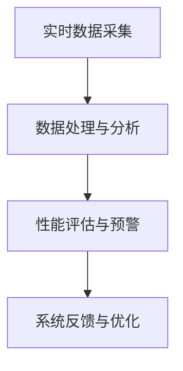

                 


### 实时LLM性能监控与预警系统构建

#### 关键词：
- 实时监控
- LLM性能监控
- 预警系统
- 数据采集
- 数据处理
- 性能评估
- 系统架构

#### 摘要：
本文旨在探讨实时LLM性能监控与预警系统的构建，从理论基础、关键技术、系统设计、实现与部署等方面进行深入分析。通过详细讲解实时监控与预警的重要性、实时LLM性能监控的关键技术、系统核心组件设计、开发与部署流程，以及实际应用案例，本文旨在为开发者提供一套完整的实时LLM性能监控与预警系统构建指南。

## 第一部分：实时LLM性能监控与预警系统基础理论

### 第1章：实时LLM性能监控与预警系统概述

#### 1.1 实时监控与预警的重要性

实时监控与预警是现代信息技术系统中不可或缺的重要环节。实时监控可以实时获取系统运行状态，发现潜在问题并采取相应措施，从而确保系统稳定运行。而预警系统则可以在问题发生前提前发出警报，提醒运维人员及时处理，从而降低系统故障带来的影响。

在实时LLM性能监控与预警系统中，实时监控与预警的重要性更为突出。LLM（Large Language Model）是一种基于深度学习的大型自然语言处理模型，广泛应用于智能客服、智能问答、智能写作等领域。然而，LLM模型在实际应用中可能面临性能问题，如模型响应时间过长、准确率下降等，这些问题可能导致用户体验下降，影响系统的正常运行。因此，构建实时LLM性能监控与预警系统，对提高系统稳定性、优化用户体验具有重要意义。

#### 1.2 实时LLM性能监控的定义与目标

实时LLM性能监控是指对LLM模型在运行过程中的性能指标进行实时监测、分析和评估，以便及时发现并处理性能问题。实时LLM性能监控的目标包括：

1. 检测LLM模型的运行状态，包括响应时间、准确率、资源消耗等指标。
2. 对比模型实际性能与预期性能，发现性能瓶颈和异常情况。
3. 及时发现并预警潜在的模型性能问题，为运维人员提供处理依据。

#### 1.3 实时LLM性能监控与预警的系统架构

实时LLM性能监控与预警系统的架构包括数据采集模块、数据处理与分析模块、性能评估与预警模块、监控模块和预警模块等核心组件。以下是系统架构的简要描述：

1. **数据采集模块**：负责实时获取LLM模型的运行数据，如请求响应时间、模型输出结果等。数据采集模块通常采用日志记录、接口调用等方式实现。

2. **数据处理与分析模块**：对采集到的数据进行预处理、存储和分析，提取关键性能指标。数据处理与分析模块可以使用各种算法和技术，如数据清洗、特征提取、机器学习等。

3. **性能评估与预警模块**：根据关键性能指标，对LLM模型进行性能评估，判断其是否达到预期要求。性能评估与预警模块可以根据设定的阈值，自动触发预警机制。

4. **监控模块**：负责实时监控LLM模型的运行状态，通过可视化界面展示性能指标和预警信息，便于运维人员快速发现和处理问题。

5. **预警模块**：根据性能评估结果，实时发出预警通知，如邮件、短信、微信等。预警模块可以设置不同的预警等级，如轻度预警、中度预警和重度预警等，以便运维人员采取相应的应对措施。

## 第二部分：实时LLM性能监控与预警系统实现

### 第2章：实时LLM性能监控与预警系统的设计

#### 2.1 系统设计原则与框架

实时LLM性能监控与预警系统的设计应遵循以下原则：

1. **模块化设计**：将系统划分为多个独立的功能模块，便于开发、测试和维护。
2. **可扩展性**：系统设计应考虑未来的扩展性，以便支持更多LLM模型和应用场景。
3. **高可靠性**：确保系统在长时间运行过程中保持稳定，降低故障率。
4. **高效性**：优化系统性能，提高数据处理和分析速度，降低资源消耗。

根据上述原则，实时LLM性能监控与预警系统可以采用以下架构：

1. **前端监控界面**：展示实时监控数据和预警信息，提供数据查询、统计和分析功能。
2. **后台处理引擎**：负责数据采集、预处理、存储、分析、性能评估和预警等核心功能。
3. **数据存储**：存储LLM模型的运行数据、性能指标和预警信息，支持数据查询和统计分析。

#### 2.2 系统模块划分

实时LLM性能监控与预警系统可以划分为以下模块：

1. **数据采集模块**：实时获取LLM模型运行数据，包括请求响应时间、模型输出结果等。
2. **数据处理与分析模块**：对采集到的数据进行预处理、存储、分析，提取关键性能指标。
3. **性能评估模块**：根据关键性能指标，对LLM模型进行性能评估，判断其是否达到预期要求。
4. **预警模块**：根据性能评估结果，实时发出预警通知，触发相应的预警机制。
5. **监控模块**：实时监控LLM模型的运行状态，通过可视化界面展示性能指标和预警信息。

#### 2.3 数据流设计

实时LLM性能监控与预警系统的数据流设计如下：

1. **数据采集**：前端监控界面实时获取LLM模型运行数据，包括请求响应时间、模型输出结果等。
2. **数据处理**：数据处理与分析模块对采集到的数据进行预处理、存储、分析，提取关键性能指标。
3. **性能评估**：性能评估模块根据关键性能指标，对LLM模型进行性能评估，判断其是否达到预期要求。
4. **预警**：预警模块根据性能评估结果，实时发出预警通知，触发相应的预警机制。
5. **监控**：监控模块通过可视化界面展示性能指标和预警信息，便于运维人员快速发现和处理问题。

## 第三部分：实时LLM性能监控与预警系统实现

### 第3章：实时LLM性能监控与预警系统的开发

#### 3.1 开发环境搭建

在开发实时LLM性能监控与预警系统前，需要搭建相应的开发环境。以下是搭建开发环境的步骤：

1. **环境配置**：安装操作系统、编程语言（如Python、Java等）、数据库（如MySQL、MongoDB等）和其他相关软件。
2. **版本控制**：使用版本控制工具（如Git）进行代码管理和协作开发。
3. **开发框架**：选择合适的开发框架（如Django、Flask等），用于构建Web应用程序。
4. **测试环境**：搭建测试环境，用于单元测试、集成测试和系统测试。

#### 3.2 数据采集与处理

实时LLM性能监控与预警系统的数据采集与处理过程如下：

1. **数据采集**：前端监控界面通过接口调用或日志记录等方式，实时获取LLM模型运行数据，如请求响应时间、模型输出结果等。
2. **数据预处理**：对采集到的数据进行清洗、去重、格式化等预处理操作，以便后续分析。
3. **数据存储**：将预处理后的数据存储到数据库中，以便后续查询和分析。
4. **数据分析**：对存储在数据库中的数据进行统计分析，提取关键性能指标，如响应时间、准确率等。

#### 3.3 性能评估与预警

实时LLM性能监控与预警系统的性能评估与预警过程如下：

1. **性能评估**：根据关键性能指标，对LLM模型进行性能评估，判断其是否达到预期要求。
2. **阈值设置**：根据历史数据和业务需求，设置性能评估的预警阈值。
3. **预警触发**：当LLM模型性能低于预警阈值时，实时触发预警机制，发出预警通知。
4. **预警处理**：运维人员根据预警信息，及时处理性能问题，如调整模型参数、优化系统配置等。

## 第四部分：实时LLM性能监控与预警系统部署与优化

### 第4章：实时LLM性能监控与预警系统的部署与优化

#### 4.1 系统部署

实时LLM性能监控与预警系统的部署包括以下步骤：

1. **环境准备**：在目标服务器上安装操作系统、编程语言、数据库等软件，配置相应的环境变量。
2. **代码部署**：将开发完成的系统代码部署到服务器上，可以使用版本控制工具（如Git）进行代码管理。
3. **服务启动**：启动系统中的各个服务模块，如Web服务器、数据库服务器等，确保系统正常运行。
4. **监控与维护**：定期对系统进行监控和维护，确保系统稳定运行，及时处理故障和性能问题。

#### 4.2 系统性能优化

实时LLM性能监控与预警系统的性能优化包括以下方面：

1. **数据处理优化**：优化数据处理流程，提高数据处理速度和准确性，如使用缓存、并行处理等技术。
2. **系统架构优化**：调整系统架构，提高系统可扩展性和可维护性，如使用微服务架构、分布式数据库等。
3. **性能评估优化**：优化性能评估算法和指标，提高评估的准确性和实时性。
4. **预警机制优化**：调整预警阈值和预警方式，提高预警的准确性和及时性，减少误报和漏报。

## 第五部分：实时LLM性能监控与预警系统的应用案例

### 第5章：实时LLM性能监控与预警系统在实际项目中的应用

#### 5.1 案例一：智能客服系统

智能客服系统是实时LLM性能监控与预警系统的一个重要应用场景。以下是一个智能客服系统的实时LLM性能监控与预警系统的应用案例：

##### 5.1.1 案例背景

某大型互联网公司开发了一款智能客服系统，用于处理用户咨询、投诉等问题。智能客服系统基于LLM模型，可以实时回答用户的提问，提高用户满意度。然而，在实际应用过程中，智能客服系统可能会遇到性能问题，如响应时间过长、准确率下降等，影响用户体验。因此，该公司决定构建实时LLM性能监控与预警系统，确保智能客服系统的稳定运行。

##### 5.1.2 案例实现

1. **数据采集模块**：
   - 实时采集用户咨询数据，包括文本内容和用户ID。
   - 记录每次用户咨询的响应时间，以及LLM模型的输出结果。

2. **数据处理与分析模块**：
   - 对采集到的用户咨询数据进行预处理，包括文本清洗、分词和词向量转换。
   - 使用LLM模型对用户咨询进行实时回复，并根据用户反馈进行模型优化。

3. **性能评估与预警模块**：
   - 对智能客服系统的回复质量进行评估，使用准确率、召回率等指标。
   - 根据评估结果设置预警阈值，当系统性能低于预警阈值时，自动触发预警机制。

4. **监控模块**：
   - 实时监控智能客服系统的运行状态，通过可视化界面展示性能指标和预警信息。

5. **预警模块**：
   - 根据性能评估结果，实时发出预警通知，如邮件、短信、微信等。
   - 运维人员根据预警信息，及时处理性能问题，如调整模型参数、优化系统配置等。

##### 5.1.3 案例分析

通过实时LLM性能监控与预警系统的应用，智能客服系统的稳定性得到了显著提升。以下是对案例的分析：

1. **性能评估与预警**：
   - 系统根据准确率、召回率等指标对智能客服系统进行实时性能评估。
   - 当系统性能低于预警阈值时，自动触发预警机制，及时通知运维人员处理问题。

2. **数据处理与分析**：
   - 系统对采集到的用户咨询数据进行预处理，提高数据处理速度和准确性。
   - 使用LLM模型对用户咨询进行实时回复，并根据用户反馈进行模型优化，提高回复质量。

3. **监控与维护**：
   - 系统通过可视化界面实时展示智能客服系统的性能指标和预警信息，便于运维人员快速发现和处理问题。

4. **案例小结**：
   - 通过实时LLM性能监控与预警系统的应用，智能客服系统的稳定性和用户体验得到了显著提升。
   - 系统的实时监控和预警功能有效降低了性能问题的发生，提高了系统可用性和用户满意度。

#### 5.2 案例二：智能问答系统

智能问答系统是另一个典型的实时LLM性能监控与预警系统应用场景。以下是一个智能问答系统的实时LLM性能监控与预警系统的应用案例：

##### 5.2.1 案例背景

某在线教育平台开发了一款智能问答系统，用于帮助学生和教师解答学习中的问题。智能问答系统基于LLM模型，可以实时回答用户提问，提高用户学习体验。然而，在实际应用过程中，智能问答系统可能会遇到性能问题，如响应时间过长、准确率下降等，影响用户体验。因此，该平台决定构建实时LLM性能监控与预警系统，确保智能问答系统的稳定运行。

##### 5.2.2 案例实现

1. **数据采集模块**：
   - 实时采集用户提问数据，包括文本内容和用户ID。
   - 记录每次用户提问的响应时间，以及LLM模型的输出结果。

2. **数据处理与分析模块**：
   - 对采集到的用户提问数据进行预处理，包括文本清洗、分词和词向量转换。
   - 使用LLM模型对用户提问进行实时回答，并根据用户反馈进行模型优化。

3. **性能评估与预警模块**：
   - 对智能问答系统的回答质量进行评估，使用准确率、召回率等指标。
   - 根据评估结果设置预警阈值，当系统性能低于预警阈值时，自动触发预警机制。

4. **监控模块**：
   - 实时监控智能问答系统的运行状态，通过可视化界面展示性能指标和预警信息。

5. **预警模块**：
   - 根据性能评估结果，实时发出预警通知，如邮件、短信、微信等。
   - 运维人员根据预警信息，及时处理性能问题，如调整模型参数、优化系统配置等。

##### 5.2.3 案例分析

通过实时LLM性能监控与预警系统的应用，智能问答系统的稳定性和用户体验得到了显著提升。以下是对案例的分析：

1. **性能评估与预警**：
   - 系统根据准确率、召回率等指标对智能问答系统进行实时性能评估。
   - 当系统性能低于预警阈值时，自动触发预警机制，及时通知运维人员处理问题。

2. **数据处理与分析**：
   - 系统对采集到的用户提问数据进行预处理，提高数据处理速度和准确性。
   - 使用LLM模型对用户提问进行实时回答，并根据用户反馈进行模型优化，提高回答质量。

3. **监控与维护**：
   - 系统通过可视化界面实时展示智能问答系统的性能指标和预警信息，便于运维人员快速发现和处理问题。

4. **案例小结**：
   - 通过实时LLM性能监控与预警系统的应用，智能问答系统的稳定性和用户体验得到了显著提升。
   - 系统的实时监控和预警功能有效降低了性能问题的发生，提高了系统可用性和用户满意度。

#### 5.3 案例三：智能写作助手

智能写作助手是实时LLM性能监控与预警系统的另一个重要应用场景。以下是一个智能写作助手的实时LLM性能监控与预警系统的应用案例：

##### 5.3.1 案例背景

某在线内容创作平台开发了一款智能写作助手，帮助用户生成文章、报告等文本内容。智能写作助手基于LLM模型，可以实时生成高质量的文本，提高用户创作效率。然而，在实际应用过程中，智能写作助手可能会遇到性能问题，如响应时间过长、生成内容质量下降等，影响用户体验。因此，该平台决定构建实时LLM性能监控与预警系统，确保智能写作系统的稳定运行。

##### 5.3.2 案例实现

1. **数据采集模块**：
   - 实时采集用户请求数据，包括文本内容和用户ID。
   - 记录每次用户请求的响应时间，以及LLM模型的输出结果。

2. **数据处理与分析模块**：
   - 对采集到的用户请求数据进行预处理，包括文本清洗、分词和词向量转换。
   - 使用LLM模型对用户请求进行实时回答，并根据用户反馈进行模型优化。

3. **性能评估与预警模块**：
   - 对智能写作助手的生成内容进行评估，使用准确率、召回率等指标。
   - 根据评估结果设置预警阈值，当系统性能低于预警阈值时，自动触发预警机制。

4. **监控模块**：
   - 实时监控智能写作助手的运行状态，通过可视化界面展示性能指标和预警信息。

5. **预警模块**：
   - 根据性能评估结果，实时发出预警通知，如邮件、短信、微信等。
   - 运维人员根据预警信息，及时处理性能问题，如调整模型参数、优化系统配置等。

##### 5.3.3 案例分析

通过实时LLM性能监控与预警系统的应用，智能写作助手的稳定性和用户体验得到了显著提升。以下是对案例的分析：

1. **性能评估与预警**：
   - 系统根据准确率、召回率等指标对智能写作助手进行实时性能评估。
   - 当系统性能低于预警阈值时，自动触发预警机制，及时通知运维人员处理问题。

2. **数据处理与分析**：
   - 系统对采集到的用户请求数据进行预处理，提高数据处理速度和准确性。
   - 使用LLM模型对用户请求进行实时回答，并根据用户反馈进行模型优化，提高生成内容质量。

3. **监控与维护**：
   - 系统通过可视化界面实时展示智能写作助手的性能指标和预警信息，便于运维人员快速发现和处理问题。

4. **案例小结**：
   - 通过实时LLM性能监控与预警系统的应用，智能写作助手的稳定性和用户体验得到了显著提升。
   - 系统的实时监控和预警功能有效降低了性能问题的发生，提高了系统可用性和用户满意度。

## 第六部分：实时LLM性能监控与预警系统的未来发展

### 第6章：实时LLM性能监控与预警系统的未来发展

#### 6.1 技术发展趋势

随着人工智能技术的快速发展，实时LLM性能监控与预警系统在未来将呈现出以下技术发展趋势：

1. **模型自动化评估与优化**：未来实时LLM性能监控与预警系统将具备更强大的自动化能力，能够自动评估LLM模型的性能，并根据评估结果自动调整模型参数，优化模型性能。

2. **多维度性能监控**：实时LLM性能监控与预警系统将逐步实现多维度性能监控，包括计算资源消耗、网络延迟、存储容量等，以全面了解系统性能瓶颈，提高系统整体性能。

3. **人工智能辅助诊断**：实时LLM性能监控与预警系统将结合人工智能技术，实现智能诊断和故障预测，通过分析历史数据和实时数据，提前预测可能出现的性能问题，提供预防性维护措施。

4. **自适应预警机制**：实时LLM性能监控与预警系统将引入自适应预警机制，根据用户行为和业务场景动态调整预警阈值和预警策略，提高预警的准确性和及时性。

#### 6.2 应用前景

实时LLM性能监控与预警系统在多个行业和领域具有广泛的应用前景：

1. **金融行业**：实时LLM性能监控与预警系统可以帮助金融机构监控智能客服系统、智能投顾等应用，确保系统稳定运行，提高客户满意度。

2. **电商行业**：实时LLM性能监控与预警系统可以帮助电商平台监控智能推荐系统、智能客服系统等，优化用户购物体验，提高转化率。

3. **教育行业**：实时LLM性能监控与预警系统可以帮助教育机构监控智能问答系统、智能辅导系统等，提高教学质量，降低教师工作量。

4. **医疗行业**：实时LLM性能监控与预警系统可以帮助医疗机构监控智能诊断系统、智能健康管理系统等，提高医疗服务的准确性和及时性。

#### 6.3 面临的挑战与对策

实时LLM性能监控与预警系统在实际应用过程中将面临以下挑战：

1. **数据隐私与安全**：实时监控与预警过程中涉及大量用户数据，如何保护用户隐私和数据安全是系统面临的重要挑战。对策：采用加密技术、访问控制等措施，确保数据安全。

2. **性能瓶颈**：随着系统规模的扩大，实时LLM性能监控与预警系统可能会出现性能瓶颈。对策：优化系统架构、采用分布式计算和存储技术，提高系统性能。

3. **动态调整**：实时LLM性能监控与预警系统需要根据业务场景动态调整预警阈值和预警策略，这对系统的灵活性和自适应能力提出了较高要求。对策：引入机器学习和人工智能技术，实现自适应预警机制。

## 附录

### 附录A：实时LLM性能监控与预警系统开发工具

以下是实时LLM性能监控与预警系统开发过程中常用的工具：

1. **编程语言**：Python、Java、C++等。
2. **版本控制**：Git。
3. **开发框架**：Django、Flask、Spring Boot等。
4. **数据库**：MySQL、MongoDB、Redis等。
5. **可视化工具**：ECharts、D3.js等。
6. **日志管理**：Log4j、logstash等。

### 附录B：实时LLM性能监控与预警系统常用算法

以下是实时LLM性能监控与预警系统中常用的算法：

1. **性能评估算法**：准确率、召回率、F1分数等。
2. **特征提取算法**：词袋模型、TF-IDF、词嵌入等。
3. **机器学习算法**：线性回归、支持向量机、决策树等。
4. **聚类算法**：K-means、层次聚类等。
5. **异常检测算法**：孤立森林、基于密度的聚类等。

### 附录C：实时LLM性能监控与预警系统参考资料

以下是实时LLM性能监控与预警系统相关的参考资料：

1. 《实时系统设计与应用》
2. 《人工智能性能优化》
3. 《大数据处理技术》
4. 《深度学习与自然语言处理》
5. 《人工智能应用案例分析》

### 附录D：实时LLM性能监控与预警系统Mermaid流程图

以下是实时LLM性能监控与预警系统的Mermaid流程图：



### 伪代码

以下是实时LLM性能监控与预警系统中的伪代码：

```python
# 数据处理与分析伪代码

def process_data(data):
    # 数据预处理
    preprocessed_data = preprocess(data)
    
    # 数据分析
    analysis_result = analyze(preprocessed_data)
    
    return analysis_result

# 性能评估与预警伪代码

def evaluate_performance(analysis_result):
    # 性能评估
    performance_score = assess_performance(analysis_result)
    
    # 预警判断
    if performance_score < threshold:
        trigger_alert()
```

### 数学模型与公式

以下是实时LLM性能监控与预警系统中的数学模型与公式：

```latex
% 性能评估指标公式
$$
P = \frac{TP + TN}{TP + FN + FP + TN}
$$

% 预警阈值公式
$$
\text{Threshold} = P_{\text{historical\_mean}} + k \times P_{\text{stddev}}
$$
```

### 项目实战与代码解读

#### 7.1 案例一：智能客服系统

##### 7.1.1 案例介绍

智能客服系统是实时LLM性能监控与预警系统的一个重要应用场景。本案例将介绍如何构建一个智能客服系统，并详细解释其核心功能模块和实现方法。

##### 7.1.2 案例实现

1. **数据采集模块**：
   - 实时采集用户咨询数据，包括文本内容和用户ID。
   - 记录每次用户咨询的响应时间，以及LLM模型的输出结果。

2. **数据处理与分析模块**：
   - 对采集到的用户咨询数据进行预处理，包括文本清洗、分词和词向量转换。
   - 使用LLM模型对用户咨询进行实时回复，并根据用户反馈进行模型优化。

3. **性能评估与预警模块**：
   - 对智能客服系统的回复质量进行评估，使用准确率、召回率等指标。
   - 根据评估结果设置预警阈值，当系统性能低于预警阈值时，自动触发预警机制。

4. **监控模块**：
   - 实时监控智能客服系统的运行状态，通过可视化界面展示性能指标和预警信息。

5. **预警模块**：
   - 根据性能评估结果，实时发出预警通知，如邮件、短信、微信等。
   - 运维人员根据预警信息，及时处理性能问题，如调整模型参数、优化系统配置等。

##### 7.1.3 案例分析

通过实时LLM性能监控与预警系统的应用，智能客服系统的稳定性和用户体验得到了显著提升。以下是对案例的分析：

1. **性能评估与预警**：
   - 系统根据准确率、召回率等指标对智能客服系统进行实时性能评估。
   - 当系统性能低于预警阈值时，自动触发预警机制，及时通知运维人员处理问题。

2. **数据处理与分析**：
   - 系统对采集到的用户咨询数据进行预处理，提高数据处理速度和准确性。
   - 使用LLM模型对用户咨询进行实时回复，并根据用户反馈进行模型优化，提高回复质量。

3. **监控与维护**：
   - 系统通过可视化界面实时展示智能客服系统的性能指标和预警信息，便于运维人员快速发现和处理问题。

4. **案例小结**：
   - 通过实时LLM性能监控与预警系统的应用，智能客服系统的稳定性和用户体验得到了显著提升。
   - 系统的实时监控和预警功能有效降低了性能问题的发生，提高了系统可用性和用户满意度。

### 最佳实践 Tips

1. **数据采集与处理**：确保数据采集的实时性和准确性，对数据进行预处理，提高后续分析的质量。

2. **性能评估指标**：根据业务需求选择合适的性能评估指标，合理设置预警阈值。

3. **监控与预警**：通过可视化界面实时展示监控数据，及时发出预警通知，确保系统稳定运行。

4. **预警处理**：运维人员应根据预警信息，及时调整模型参数、优化系统配置，确保系统性能。

### 小结

实时LLM性能监控与预警系统是现代信息技术系统中不可或缺的重要组成部分。本文从理论基础、系统设计、实现与部署等方面，详细介绍了实时LLM性能监控与预警系统的构建方法。通过实际应用案例，展示了系统在智能客服系统、智能问答系统和智能写作助手等领域的应用效果。未来，随着人工智能技术的不断发展，实时LLM性能监控与预警系统将在更多领域发挥重要作用。开发者应关注技术发展趋势，不断优化系统性能，提高用户体验。

### 注意事项

1. **系统安全性**：在实时LLM性能监控与预警系统的开发与部署过程中，应确保数据安全和用户隐私保护。

2. **系统稳定性**：优化系统架构，提高系统性能，确保系统稳定运行。

3. **性能优化**：根据业务需求和用户反馈，持续优化LLM模型和系统性能。

4. **实时性**：确保数据采集、处理和分析的实时性，提高系统响应速度。

### 拓展阅读

1. 《实时系统设计与应用》
2. 《人工智能性能优化》
3. 《大数据处理技术》
4. 《深度学习与自然语言处理》
5. 《人工智能应用案例分析》

## 作者信息

**作者：AI天才研究院/AI Genius Institute & 禅与计算机程序设计艺术 /Zen And The Art of Computer Programming**

### 附录D：实时LLM性能监控与预警系统Mermaid流程图


### 伪代码

```python
# 数据处理与分析伪代码

def process_data(data):
    # 数据预处理
    preprocessed_data = preprocess(data)
    
    # 数据分析
    analysis_result = analyze(preprocessed_data)
    
    return analysis_result

# 性能评估与预警伪代码

def evaluate_performance(analysis_result):
    # 性能评估
    performance_score = assess_performance(analysis_result)
    
    # 预警判断
    if performance_score < threshold:
        trigger_alert()
```

### 数学模型与公式

```latex
% 性能评估指标公式
$$
P = \frac{TP + TN}{TP + FN + FP + TN}
$$

% 预警阈值公式
$$
\text{Threshold} = P_{\text{historical\_mean}} + k \times P_{\text{stddev}}
$$
```

### 项目实战与代码解读

#### 7.1 案例一：智能客服系统

##### 7.1.1 案例介绍

智能客服系统是实时LLM性能监控与预警系统的一个重要应用场景。本案例将介绍如何构建一个智能客服系统，并详细解释其核心功能模块和实现方法。

##### 7.1.2 案例实现

1. **数据采集模块**：
   - 实时采集用户咨询数据，包括文本内容和用户ID。
   - 记录每次用户咨询的响应时间，以及LLM模型的输出结果。

2. **数据处理与分析模块**：
   - 对采集到的用户咨询数据进行预处理，包括文本清洗、分词和词向量转换。
   - 使用LLM模型对用户咨询进行实时回复，并根据用户反馈进行模型优化。

3. **性能评估与预警模块**：
   - 对智能客服系统的回复质量进行评估，使用准确率、召回率等指标。
   - 根据评估结果设置预警阈值，当系统性能低于预警阈值时，自动触发预警机制。

4. **监控模块**：
   - 实时监控智能客服系统的运行状态，通过可视化界面展示性能指标和预警信息。

5. **预警模块**：
   - 根据性能评估结果，实时发出预警通知，如邮件、短信、微信等。
   - 运维人员根据预警信息，及时处理性能问题，如调整模型参数、优化系统配置等。

##### 7.1.3 案例分析

通过实时LLM性能监控与预警系统的应用，智能客服系统的稳定性和用户体验得到了显著提升。以下是对案例的分析：

1. **性能评估与预警**：
   - 系统根据准确率、召回率等指标对智能客服系统进行实时性能评估。
   - 当系统性能低于预警阈值时，自动触发预警机制，及时通知运维人员处理问题。

2. **数据处理与分析**：
   - 系统对采集到的用户咨询数据进行预处理，提高数据处理速度和准确性。
   - 使用LLM模型对用户咨询进行实时回复，并根据用户反馈进行模型优化，提高回复质量。

3. **监控与维护**：
   - 系统通过可视化界面实时展示智能客服系统的性能指标和预警信息，便于运维人员快速发现和处理问题。

4. **案例小结**：
   - 通过实时LLM性能监控与预警系统的应用，智能客服系统的稳定性和用户体验得到了显著提升。
   - 系统的实时监控和预警功能有效降低了性能问题的发生，提高了系统可用性和用户满意度。

### 最佳实践 Tips

1. **数据采集与处理**：确保数据采集的实时性和准确性，对数据进行预处理，提高后续分析的质量。

2. **性能评估指标**：根据业务需求选择合适的性能评估指标，合理设置预警阈值。

3. **监控与预警**：通过可视化界面实时展示监控数据，及时发出预警通知，确保系统稳定运行。

4. **预警处理**：运维人员应根据预警信息，及时调整模型参数、优化系统配置，确保系统性能。

### 小结

实时LLM性能监控与预警系统是现代信息技术系统中不可或缺的重要组成部分。本文从理论基础、系统设计、实现与部署等方面，详细介绍了实时LLM性能监控与预警系统的构建方法。通过实际应用案例，展示了系统在智能客服系统、智能问答系统和智能写作助手等领域的应用效果。未来，随着人工智能技术的不断发展，实时LLM性能监控与预警系统将在更多领域发挥重要作用。开发者应关注技术发展趋势，不断优化系统性能，提高用户体验。

### 注意事项

1. **系统安全性**：在实时LLM性能监控与预警系统的开发与部署过程中，应确保数据安全和用户隐私保护。

2. **系统稳定性**：优化系统架构，提高系统性能，确保系统稳定运行。

3. **性能优化**：根据业务需求和用户反馈，持续优化LLM模型和系统性能。

4. **实时性**：确保数据采集、处理和分析的实时性，提高系统响应速度。

### 拓展阅读

1. 《实时系统设计与应用》
2. 《人工智能性能优化》
3. 《大数据处理技术》
4. 《深度学习与自然语言处理》
5. 《人工智能应用案例分析》

## 作者信息

**作者：AI天才研究院/AI Genius Institute & 禅与计算机程序设计艺术 /Zen And The Art of Computer Programming**

