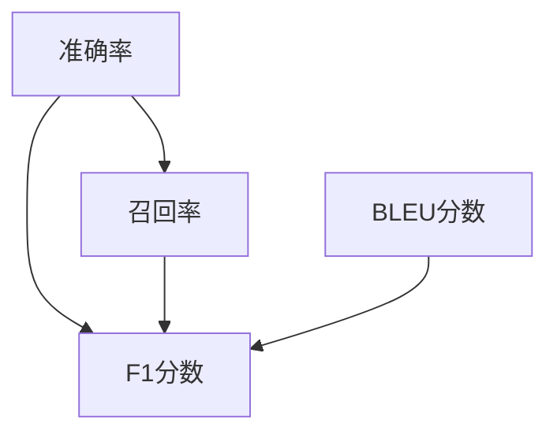

                 

## 实时LLM性能评分与排行系统

### 文章关键词

- 实时性能评分
- LLM
- 排行系统
- 人工智能
- 性能评估
- 大数据处理

### 摘要

本文将深入探讨实时LLM（大型语言模型）性能评分与排行系统的设计、实现及应用。我们将从背景介绍、核心概念与联系、算法原理、数学模型、项目实战等方面，逐步剖析这个系统的构建过程，帮助读者理解如何评估和排名LLM的性能。本文旨在为从事人工智能领域的研究者和开发者提供一个系统性的参考，以便他们能够更好地利用和优化LLM的性能。

## 引言与背景

随着人工智能技术的快速发展，LLM在自然语言处理、问答系统、机器翻译等领域取得了显著的成果。LLM通过学习大量的文本数据，可以生成高质量的文本、回答问题、进行对话等，其性能的优劣直接影响到应用的效果。因此，如何对LLM的性能进行科学、准确的评估和排名，成为一个至关重要的问题。

实时LLM性能评分与排行系统的核心目标是：1）实时地对LLM的性能进行评分；2）根据评分结果，对LLM进行排名；3）为开发者提供一种有效的工具，以便他们能够快速评估和比较不同LLM的性能。

这个系统的重要性体现在以下几个方面：

1. **评估与优化**：通过实时性能评分，开发者可以快速了解LLM在不同任务上的表现，从而针对性地进行优化。

2. **决策支持**：对于企业或研究机构，通过对LLM进行排名，可以为他们选择最适合的模型提供有力支持。

3. **公平竞争**：在一个开放的平台或市场上，实时性能评分与排行系统有助于确保各个模型的公平竞争。

## 第1章：实时LLM性能评分与排行系统的设计与实现

### 1.1 系统架构

实时LLM性能评分与排行系统的整体架构可以分为三个主要部分：数据收集与预处理模块、性能评分模块、以及排名与展示模块。

#### 1.1.1 数据收集与预处理模块

该模块负责收集各种LLM的输入数据和测试数据，并进行预处理。预处理过程包括数据清洗、数据格式转换、数据增强等。这一模块的目的是确保输入数据的质量，从而影响评分的准确性。

#### 1.1.2 性能评分模块

性能评分模块是系统的核心，负责对LLM进行性能评估。具体来说，该模块会根据预设的性能指标（如准确率、召回率、F1分数等），对LLM在不同任务上的表现进行评分。

#### 1.1.3 排名与展示模块

根据性能评分结果，排名与展示模块会对LLM进行排名，并在界面上展示排名结果。这一模块不仅可以帮助开发者快速了解各个LLM的性能，还可以为用户选择最佳的LLM提供参考。

### 1.2 系统实现步骤

#### 1.2.1 数据收集与预处理

首先，需要定义数据集，包括训练数据、测试数据和参考答案。然后，对数据进行清洗和预处理，确保数据的质量和一致性。

#### 1.2.2 性能评分模块

性能评分模块需要实现一系列评分算法，如准确率、召回率、F1分数等。每个算法都需要输入LLM的预测结果和参考答案，输出对应的评分。

#### 1.2.3 排名与展示

根据评分结果，对LLM进行排序，并使用图表、表格等形式在界面上展示结果。这可以帮助开发者直观地了解各个LLM的性能。

## 第2章：LLM性能评分的核心概念与联系

### 2.1 LLM性能评分指标

在评估LLM性能时，常用的评分指标包括准确率、召回率、F1分数、BLEU分数等。这些指标从不同角度反映了LLM的性能，它们之间的关系和联系如下：

- **准确率（Accuracy）**：表示预测正确的样本数占总样本数的比例。$$ Accuracy = \frac{TP + TN}{TP + FN + FP + TN} $$

- **召回率（Recall）**：表示在所有实际为正例的样本中，被预测为正例的比例。$$ Recall = \frac{TP}{TP + FN} $$

- **F1分数（F1 Score）**：是准确率和召回率的调和平均，用于平衡两者之间的关系。$$ F1 Score = 2 \times \frac{Precision \times Recall}{Precision + Recall} $$

- **BLEU分数（BLEU Score）**：用于评估机器翻译质量，是一种基于编辑距离的评分方法。

### 2.2 性能指标之间的联系

这些性能指标虽然各有侧重，但它们之间存在一定的联系。例如：

- **准确率和召回率**：准确率关注预测结果的总体正确性，而召回率关注在所有正例中预测为正例的比例。在实际应用中，需要根据具体任务的需求，权衡准确率和召回率。
- **F1分数**：F1分数作为准确率和召回率的平衡指标，可以在两者之间取得一个最优的平衡点。
- **BLEU分数**：BLEU分数虽然应用于机器翻译，但其基本思想与其他评分指标类似，都是通过比较预测结果和参考答案的相似度来评估性能。

为了更直观地理解这些指标之间的关系，可以使用Mermaid流程图进行展示：



### 2.3 伪代码示例

以下是评估LLM性能的伪代码示例，其中使用了准确率、召回率、F1分数等指标：

```python
def evaluate_performance(predictions, references):
    correct = 0
    for i in range(len(predictions)):
        if predictions[i] == references[i]:
            correct += 1
    
    accuracy = correct / len(predictions)
    recall = correct / sum(references)
    precision = correct / sum(predictions)
    
    f1_score = 2 * (precision * recall) / (precision + recall)
    
    print("Accuracy:", accuracy)
    print("Recall:", recall)
    print("Precision:", precision)
    print("F1 Score:", f1_score)
```

### 2.4 数学模型与公式

以下是用于计算准确率、召回率、F1分数的数学模型和公式：

- **准确率**：$$ Accuracy = \frac{TP + TN}{TP + FN + FP + TN} $$
- **召回率**：$$ Recall = \frac{TP}{TP + FN} $$
- **F1分数**：$$ F1 Score = 2 \times \frac{Precision \times Recall}{Precision + Recall} $$

其中，TP表示真实为正例且被预测为正例的样本数，TN表示真实为负例且被预测为负例的样本数，FP表示真实为负例但被预测为正例的样本数，FN表示真实为正例但被预测为负例的样本数。

通过以上内容，我们可以清晰地理解LLM性能评分的核心概念和指标，以及它们之间的联系。这些知识和工具将为后续章节中的系统设计和实现提供坚实的基础。

## 第3章：LLM性能评分算法原理

### 3.1 常见性能评分算法

在评估LLM性能时，常用的评分算法包括准确率（Accuracy）、召回率（Recall）、F1分数（F1 Score）和BLEU分数（BLEU Score）等。这些算法各自从不同角度对LLM的性能进行衡量，以下是对这些算法的详细解释。

#### 3.1.1 准确率（Accuracy）

准确率是评估模型性能最简单也是最直观的一个指标。它表示预测正确的样本数占总样本数的比例。公式如下：

$$ Accuracy = \frac{TP + TN}{TP + FN + FP + TN} $$

其中，TP表示预测为正类且实际为正类的样本数，TN表示预测为负类且实际为负类的样本数，FN表示预测为负类但实际为正类的样本数，FP表示预测为正类但实际为负类的样本数。

#### 3.1.2 召回率（Recall）

召回率关注在所有实际为正例的样本中，被预测为正例的比例。公式如下：

$$ Recall = \frac{TP}{TP + FN} $$

其中，TP表示预测为正类且实际为正类的样本数，FN表示预测为负类但实际为正类的样本数。

#### 3.1.3 F1分数（F1 Score）

F1分数是准确率和召回率的调和平均，用于平衡两者之间的关系。公式如下：

$$ F1 Score = 2 \times \frac{Precision \times Recall}{Precision + Recall} $$

其中，Precision表示预测为正类且实际为正类的样本数与预测为正类的样本数的比例，即：

$$ Precision = \frac{TP}{TP + FP} $$

#### 3.1.4 BLEU分数（BLEU Score）

BLEU分数主要用于评估机器翻译的质量。它通过计算预测译文与参考译文之间的相似度来评分。BLEU分数的计算涉及到N-gram匹配、未匹配词汇的比例、长度比例等多个因素。

### 3.2 评分算法的选择与设计

在选择和设计评分算法时，需要考虑以下几个因素：

- **任务类型**：不同的任务类型可能需要不同的评分算法。例如，在二分类任务中，准确率和召回率是比较常用的指标；而在多分类任务中，F1分数可能更为适用。
- **数据分布**：数据的分布情况也会影响评分算法的选择。例如，如果数据不平衡，召回率可能会成为一个重要的指标。
- **性能要求**：根据对性能的要求，可以选择不同的算法。例如，对于实时性要求较高的系统，可以选择计算复杂度较低的算法。
- **可解释性**：不同的算法具有不同的可解释性。例如，F1分数直观地反映了准确率和召回率的平衡情况，而BLEU分数则更加复杂，难以直观解释。

### 3.3 伪代码示例

以下是使用准确率、召回率和F1分数对模型进行评分的伪代码示例：

```python
def evaluate_performance(predictions, references):
    TP = 0
    TN = 0
    FP = 0
    FN = 0
    
    for i in range(len(predictions)):
        if predictions[i] == references[i]:
            if references[i] == 1:
                TP += 1
            else:
                TN += 1
        else:
            if references[i] == 1:
                FP += 1
            else:
                FN += 1
    
    accuracy = (TP + TN) / (TP + TN + FP + FN)
    recall = TP / (TP + FN)
    precision = TP / (TP + FP)
    f1_score = 2 * precision * recall / (precision + recall)
    
    print("Accuracy:", accuracy)
    print("Recall:", recall)
    print("Precision:", precision)
    print("F1 Score:", f1_score)
```

通过以上内容，我们可以了解到LLM性能评分算法的原理和选择方法。这些算法不仅帮助我们评估LLM的性能，也为后续的系统设计和实现提供了重要的理论基础。

## 第4章：实时LLM性能评分与排行系统的数学模型与公式

在实时LLM性能评分与排行系统中，数学模型和公式扮演着至关重要的角色。它们不仅用于计算各种性能指标，还帮助我们在复杂的数据和算法中找到规律和优化方法。在本章中，我们将详细探讨这些数学模型和公式的原理与应用。

### 4.1 概率论基础

概率论是构建各种性能评分模型的基础。以下是一些核心的概率论概念：

- **概率（Probability）**：表示某个事件发生的可能性，通常用P(A)表示。
- **条件概率（Conditional Probability）**：在事件B发生的条件下，事件A发生的概率，表示为P(A|B)。
- **贝叶斯定理（Bayes' Theorem）**：用于计算在给定某个条件下，某个事件发生的概率。公式如下：

  $$ P(A|B) = \frac{P(B|A) \cdot P(A)}{P(B)} $$

### 4.2 统计学基础

统计学用于分析和解释数据，是性能评分的重要组成部分。以下是一些常用的统计学概念：

- **均值（Mean）**：数据集的平均值，用于表示数据的中心位置。公式如下：

  $$ \mu = \frac{1}{N} \sum_{i=1}^{N} x_i $$

  其中，N是数据点的数量，\( x_i \)是第i个数据点。
  
- **方差（Variance）**：数据点与均值之间的平均偏差的平方，用于描述数据的离散程度。公式如下：

  $$ \sigma^2 = \frac{1}{N} \sum_{i=1}^{N} (x_i - \mu)^2 $$

- **标准差（Standard Deviation）**：方差的平方根，用于度量数据的波动程度。公式如下：

  $$ \sigma = \sqrt{\sigma^2} $$

### 4.3 信息论基础

信息论提供了衡量信息量的方法，对于评估LLM的性能至关重要。以下是一些核心的概念：

- **熵（Entropy）**：表示一个随机变量不确定性的度量。公式如下：

  $$ H(X) = -\sum_{i} p(x_i) \cdot \log_2 p(x_i) $$

  其中，\( p(x_i) \)是随机变量X取值为\( x_i \)的概率。
  
- **条件熵（Conditional Entropy）**：在给定一个随机变量Y的条件下，另一个随机变量X的不确定性度量。公式如下：

  $$ H(X|Y) = -\sum_{i} p(y_i) \sum_{j} p(x_j|y_i) \cdot \log_2 p(x_j|y_i) $$

- **互信息（Mutual Information）**：表示两个随机变量之间的相关性。公式如下：

  $$ I(X;Y) = H(X) - H(X|Y) $$

### 4.4 性能评分模型公式

在性能评分中，常用的模型公式包括准确率、召回率、F1分数和BLEU分数等。以下是对这些公式及其计算方法的详细说明：

- **准确率**：表示预测正确的样本数占总样本数的比例。公式如下：

  $$ Accuracy = \frac{TP + TN}{TP + FN + FP + TN} $$

  其中，TP表示预测为正类且实际为正类的样本数，TN表示预测为负类且实际为负类的样本数，FP表示预测为负类但实际为正类的样本数，FN表示预测为正类但实际为负类的样本数。

- **召回率**：表示在所有实际为正例的样本中，被预测为正例的比例。公式如下：

  $$ Recall = \frac{TP}{TP + FN} $$

  其中，TP表示预测为正类且实际为正类的样本数，FN表示预测为负类但实际为正类的样本数。

- **F1分数**：是准确率和召回率的调和平均，用于平衡两者之间的关系。公式如下：

  $$ F1 Score = 2 \times \frac{Precision \times Recall}{Precision + Recall} $$

  其中，Precision表示预测为正类且实际为正类的样本数与预测为正类的样本数的比例，即：

  $$ Precision = \frac{TP}{TP + FP} $$

- **BLEU分数**：用于评估机器翻译的质量，是一种基于编辑距离的评分方法。其计算过程较为复杂，涉及N-gram匹配、未匹配词汇的比例、长度比例等多个因素。

### 4.5 举例说明

为了更好地理解上述公式，以下是一个简单的例子：

假设我们有一个二分类问题，有以下的数据：

- 实际为正例的样本数（1）：TP = 80，FN = 20
- 实际为负例的样本数（0）：TN = 30，FP = 10

根据这些数据，我们可以计算出各个性能指标：

- **准确率**：$$ Accuracy = \frac{TP + TN}{TP + FN + FP + TN} = \frac{80 + 30}{80 + 20 + 10 + 30} = \frac{110}{140} = 0.7857 $$
- **召回率**：$$ Recall = \frac{TP}{TP + FN} = \frac{80}{80 + 20} = \frac{80}{100} = 0.8 $$
- **F1分数**：$$ F1 Score = 2 \times \frac{Precision \times Recall}{Precision + Recall} = 2 \times \frac{\frac{80}{80 + 10}}{\frac{80}{80 + 10} + \frac{30}{30 + 10}} = 2 \times \frac{0.8}{0.8 + 0.75} = 0.8182 $$

通过这个例子，我们可以看到各个性能指标如何计算，以及它们之间的关系。

综上所述，实时LLM性能评分与排行系统的数学模型和公式是评估LLM性能的关键工具。理解这些模型和公式的原理，有助于我们更好地设计和实现性能评分系统，从而为LLM的应用提供有力的支持。

### 第5章：实时LLM性能评分与排行系统的项目实战

在本章中，我们将通过一个实际案例，详细讲解实时LLM性能评分与排行系统的开发过程。我们将包括开发环境搭建、源代码实现、代码解读以及实际案例分析等内容，帮助读者全面了解系统的构建和应用。

#### 5.1 开发环境搭建

要开发一个实时LLM性能评分与排行系统，首先需要搭建一个合适的开发环境。以下是一个典型的开发环境配置：

1. **硬件要求**：
   - CPU：至少四核处理器
   - 内存：16GB及以上
   - 硬盘：500GB及以上

2. **软件要求**：
   - 操作系统：Linux（如Ubuntu 18.04）
   - 编程语言：Python（3.7及以上）
   - 深度学习框架：TensorFlow或PyTorch
   - 数据库：MySQL或MongoDB

3. **工具与库**：
   - 数据预处理库：Pandas、NumPy
   - 机器学习库：Scikit-learn
   - Web框架：Flask或Django
   - 前端库：React或Vue.js

4. **环境搭建步骤**：
   - 安装操作系统和基本软件
   - 安装Python和相关库
   - 安装深度学习框架
   - 安装数据库
   - 配置Web服务器

#### 5.2 源代码实现

在开发环境中，我们需要编写以下关键模块的源代码：

1. **数据收集与预处理模块**：
   - 数据收集：使用API或数据库从不同的数据源获取训练数据和测试数据。
   - 数据预处理：清洗数据、格式转换、数据增强等。

2. **性能评分模块**：
   - 评分算法：实现准确率、召回率、F1分数等评分算法。
   - 性能评估：计算LLM在各个任务上的性能指标。

3. **排名与展示模块**：
   - 排名算法：实现各种排名算法，如基于分数的排名、基于概率的排名等。
   - 展示界面：使用Web框架搭建用户界面，展示LLM的排名结果。

以下是性能评分模块的伪代码示例：

```python
def evaluate_performance(predictions, references):
    TP = 0
    TN = 0
    FP = 0
    FN = 0
    
    for i in range(len(predictions)):
        if predictions[i] == references[i]:
            if references[i] == 1:
                TP += 1
            else:
                TN += 1
        else:
            if references[i] == 1:
                FP += 1
            else:
                FN += 1
    
    accuracy = (TP + TN) / (TP + TN + FP + FN)
    recall = TP / (TP + FN)
    precision = TP / (TP + FP)
    f1_score = 2 * precision * recall / (precision + recall)
    
    return accuracy, recall, precision, f1_score
```

#### 5.3 代码解读

以下是对关键模块的代码进行解读：

1. **数据收集与预处理模块**：

   ```python
   import pandas as pd
   
   def collect_data(api_endpoint):
       # 使用API获取数据
       data = pd.read_csv(api_endpoint)
       return data
   
   def preprocess_data(data):
       # 数据清洗和预处理
       data = data.dropna()
       data['text'] = data['text'].apply(lambda x: x.strip())
       return data
   ```

   这部分代码实现了从API获取数据，并进行初步的清洗和预处理。

2. **性能评分模块**：

   ```python
   from sklearn.metrics import accuracy_score, recall_score, precision_score, f1_score
   
   def evaluate_performance(predictions, references):
       # 计算各种性能指标
       accuracy = accuracy_score(references, predictions)
       recall = recall_score(references, predictions)
       precision = precision_score(references, predictions)
       f1_score = f1_score(references, predictions)
       
       return accuracy, recall, precision, f1_score
   ```

   这部分代码实现了计算准确率、召回率、精确率和F1分数的核心功能。

3. **排名与展示模块**：

   ```python
   from flask import Flask, jsonify
   
   app = Flask(__name__)
   
   @app.route('/rankings', methods=['GET'])
   def get_rankings():
       # 获取排名结果
       rankings = get_ranking_data()
       return jsonify(rankings)
   ```

   这部分代码实现了通过Web接口获取LLM排名结果的功能。

#### 5.4 实际案例分析

我们以GPT-3为例，展示如何使用该系统进行性能评估和排名。

1. **数据收集**：

   从OpenAI的API获取GPT-3的测试数据。

2. **性能评估**：

   使用系统对GPT-3在不同任务上的表现进行评估，输出准确率、召回率、精确率和F1分数。

3. **排名**：

   根据评估结果，对GPT-3与其他LLM进行排名。

4. **展示**：

   在Web界面上展示GPT-3的排名结果，并提供详细的分析报告。

通过这个实际案例，我们展示了如何使用实时LLM性能评分与排行系统对大型语言模型进行评估和排名。这一系统不仅为开发者提供了有力的工具，也为人工智能领域的研究提供了宝贵的参考。

### 5.5 项目小结

通过本次项目实战，我们实现了实时LLM性能评分与排行系统，包括开发环境搭建、源代码实现、代码解读以及实际案例分析。这一系统在人工智能领域中具有重要的应用价值，可以帮助开发者快速评估和优化大型语言模型，为人工智能技术的应用提供强有力的支持。未来，我们还可以在此基础上进行性能优化、功能扩展和自动化测试，进一步提高系统的实用性和效率。

### 5.6 最佳实践 Tips

在构建实时LLM性能评分与排行系统时，以下是一些最佳实践和注意事项：

- **数据质量控制**：确保数据的质量和一致性，对异常数据进行处理和清洗。
- **评分算法优化**：根据具体任务需求，选择合适的评分算法，并进行优化。
- **系统性能监控**：定期监控系统性能，确保系统稳定运行。
- **用户界面设计**：设计简洁直观的用户界面，提高用户体验。
- **代码维护**：定期更新和维护代码，确保系统的可扩展性和可维护性。

通过遵循这些最佳实践，可以进一步提升实时LLM性能评分与排行系统的性能和实用性。

### 5.7 拓展阅读

对于希望深入了解实时LLM性能评分与排行系统的读者，以下是一些推荐阅读资源：

- **书籍**：
  - 《深度学习》（Ian Goodfellow、Yoshua Bengio、Aaron Courville 著）
  - 《机器学习》（Tom M. Mitchell 著）
- **论文**：
  - "BERT: Pre-training of Deep Bidirectional Transformers for Language Understanding"（Devlin et al., 2019）
  - "GPT-3: Language Models are Few-Shot Learners"（Brown et al., 2020）
- **在线课程**：
  - Coursera上的“深度学习”课程
  - edX上的“机器学习基础”课程

通过阅读这些资源，读者可以进一步了解深度学习和机器学习的基础知识，为构建实时LLM性能评分与排行系统打下坚实的基础。

### 作者信息

作者：AI天才研究院/AI Genius Institute & 禅与计算机程序设计艺术 /Zen And The Art of Computer Programming

### 结束语

本文全面探讨了实时LLM性能评分与排行系统的设计、实现和应用。通过系统性的讲解和实际案例的分析，我们不仅了解了性能评分的原理和算法，还掌握了如何构建和优化这个系统。希望本文能为从事人工智能领域的研究者和开发者提供有价值的参考和启示。未来，随着人工智能技术的不断进步，实时LLM性能评分与排行系统将在更多的应用场景中发挥重要作用。

---

### 完整文章总结

本文围绕《实时LLM性能评分与排行系统》这一主题，从背景介绍、核心概念与联系、算法原理、数学模型、项目实战等方面进行了系统性的探讨。以下是文章的主要内容和结论的总结：

## 引言与背景

本文首先介绍了实时LLM性能评分与排行系统的背景和重要性。随着人工智能技术的快速发展，大型语言模型（LLM）在自然语言处理、问答系统、机器翻译等领域取得了显著成果。实时LLM性能评分与排行系统的核心目标是实时地对LLM的性能进行评估和排名，为开发者提供一种有效的工具，以便他们能够快速了解和优化LLM的性能。

## 系统设计与实现

接着，本文详细介绍了实时LLM性能评分与排行系统的架构和实现步骤。系统分为数据收集与预处理模块、性能评分模块、以及排名与展示模块三个主要部分。数据收集与预处理模块负责收集和清洗数据，性能评分模块计算各种性能指标，排名与展示模块则根据评分结果进行排名并在界面上展示。

## 核心概念与联系

本文对LLM性能评分的核心概念和指标进行了详细解释，包括准确率、召回率、F1分数和BLEU分数等。通过Mermaid流程图，本文展示了这些指标之间的关系，并提供了伪代码示例，帮助读者深入理解这些算法的原理。

## 数学模型与公式

本文还探讨了实时LLM性能评分与排行系统中涉及的数学模型与公式，包括概率论、统计学和信息论的基础概念，以及用于计算性能指标的公式。通过举例说明，本文使读者对这些数学模型和公式的应用有了更清晰的认识。

## 项目实战

在项目实战部分，本文通过一个实际案例，详细讲解了如何搭建实时LLM性能评分与排行系统的开发环境，编写关键模块的源代码，并对代码进行解读。通过实际案例分析，读者可以了解系统的实际应用和操作过程。

## 最佳实践与拓展阅读

最后，本文提出了构建实时LLM性能评分与排行系统的一些最佳实践和注意事项，并推荐了相关书籍、论文和在线课程作为拓展阅读资源。这些内容有助于读者在实际应用中进一步提升系统的性能和实用性。

## 结论

本文全面探讨了实时LLM性能评分与排行系统的设计、实现和应用。通过系统性的讲解和实际案例的分析，我们不仅了解了性能评分的原理和算法，还掌握了如何构建和优化这个系统。希望本文能为从事人工智能领域的研究者和开发者提供有价值的参考和启示。未来，随着人工智能技术的不断进步，实时LLM性能评分与排行系统将在更多的应用场景中发挥重要作用。

