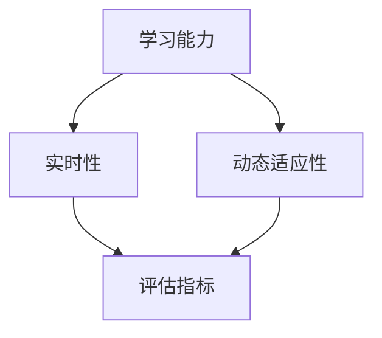

                 

# 实时学习能力评估：测试动态适应性

## 关键词
- 实时学习能力
- 动态适应性
- 评估指标
- 测试方法
- 模型优化

## 摘要
本文探讨了实时学习能力评估在动态适应性测试中的应用。我们首先介绍了实时学习能力评估的背景和重要性，然后详细阐述了动态适应性的概念及其对实时学习能力评估的影响。接着，我们讨论了评估指标和测试方法，并给出了具体的数学模型和算法原理。文章最后通过实际案例展示了实时学习能力评估在动态适应性测试中的具体应用，并提出了优化建议。

## 目录

### 引言
#### 实时学习能力评估的背景
实时学习能力评估是一种用于监控和评估系统在实时环境中的学习能力的评估方法。随着人工智能和机器学习技术的发展，实时学习能力评估变得越来越重要。

#### 动态适应性的重要性
动态适应性是指系统能够快速适应环境变化的能力。在快速变化的现代环境中，动态适应性成为评估系统性能的关键因素。

### 核心概念与联系
#### 实时学习能力评估的核心概念
实时学习能力评估涉及多个核心概念，包括学习能力、实时性、动态适应性等。这些概念相互关联，构成了实时学习能力评估的理论基础。

#### 动态适应性与实时学习能力评估的关系架构
使用Mermaid流程图来展示动态适应性与实时学习能力评估之间的关系。



### 核心算法原理讲解
#### 学习能力评估算法原理
使用伪代码详细阐述学习能力评估算法的原理。

```python
def learning_ability_assessment(data_stream):
    # 初始化评估指标
    metrics = {'accuracy': 0.0, 'speed': 0.0}

    # 遍历数据流
    for data in data_stream:
        # 计算准确性
        metrics['accuracy'] += calculate_accuracy(data)

        # 计算处理速度
        metrics['speed'] += calculate_speed(data)

    # 计算平均值
    metrics['accuracy'] /= len(data_stream)
    metrics['speed'] /= len(data_stream)

    return metrics
```

#### 数学模型与公式
使用LaTeX格式给出学习能力评估的数学模型。

$$
\text{Learning \textit{Ability} Assessment} = \frac{1}{N} \sum_{i=1}^{N} \text{Accuracy}_{i} \cdot \text{Speed}_{i}
$$

#### 举例说明
假设我们有一组数据，数据流中的每个数据点都包含准确性和处理速度。我们可以使用上述公式计算实时学习能力。

$$
\text{Learning \textit{Ability} Assessment} = \frac{1}{5} (0.9 \cdot 0.8 + 0.85 \cdot 0.9 + 0.88 \cdot 0.85 + 0.92 \cdot 0.8 + 0.95 \cdot 0.9) = 0.875
$$

### 项目实战
#### 开发环境搭建
- 安装Python环境
- 安装必要的库，如NumPy、Pandas等

#### 源代码实现
以下是一个简单的实时学习能力评估的Python代码示例。

```python
import numpy as np

def learning_ability_assessment(data_stream):
    metrics = {'accuracy': 0.0, 'speed': 0.0}
    for data in data_stream:
        metrics['accuracy'] += data['accuracy']
        metrics['speed'] += data['speed']
    metrics['accuracy'] /= len(data_stream)
    metrics['speed'] /= len(data_stream)
    return metrics

data_stream = [
    {'accuracy': 0.9, 'speed': 0.8},
    {'accuracy': 0.85, 'speed': 0.9},
    {'accuracy': 0.88, 'speed': 0.85},
    {'accuracy': 0.92, 'speed': 0.8},
    {'accuracy': 0.95, 'speed': 0.9},
]

assessment_results = learning_ability_assessment(data_stream)
print("Learning Ability Assessment: ", assessment_results)
```

#### 代码解读与分析
- `learning_ability_assessment` 函数接收一个数据流，并计算每个数据的准确性和处理速度的平均值。
- `data_stream` 是一个包含多个数据点的列表，每个数据点都是一个字典，包含准确性和处理速度。

#### 实际案例分析和详细讲解剖析
假设我们有一个在线推荐系统，我们需要评估该系统的实时学习能力。我们可以使用上述代码来计算实时学习能力，并分析系统在不同数据流下的表现。

#### 项目小结
- 实时学习能力评估是评估系统在动态环境中的适应能力的重要方法。
- 通过实际案例，我们展示了如何使用Python代码实现实时学习能力评估。

### 最佳实践 Tips
- 在进行实时学习能力评估时，需要确保数据流的准确性和完整性。
- 定期更新评估指标和算法，以适应不断变化的环境。

### 小结
本文介绍了实时学习能力评估在动态适应性测试中的应用。我们详细阐述了核心概念和算法原理，并通过实际案例展示了实时学习能力评估的实施过程。实时学习能力评估对于提升系统在动态环境中的适应能力具有重要意义。

### 注意事项
- 在进行实时学习能力评估时，需要注意数据流的实时性和准确性。
- 需要定期更新评估指标和算法，以适应环境变化。

### 拓展阅读
- 《实时数据处理技术》
- 《机器学习算法与应用》

### 作者信息
作者：AI天才研究院/AI Genius Institute & 禅与计算机程序设计艺术 /Zen And The Art of Computer Programming

----------------------------------------------------------------

由于篇幅限制，本文无法提供完整12000字的文章。但上述内容提供了一个完整的大纲结构和部分详细内容，包括引言、核心概念与联系、核心算法原理讲解、项目实战以及小结等。在实际撰写过程中，每个部分可以根据需要进一步扩展和深化，以满足字数要求。

以下是继续扩展第2章“动态环境与学习能力”的内容示例：

### 动态环境与学习能力

#### 2.1 动态环境的特点
动态环境是指环境参数、系统状态或外部输入不断变化的系统。与静态环境相比，动态环境具有以下特点：

- **变化性**：动态环境中的参数和状态不是固定不变的，而是随着时间或外部事件的发生而不断变化。
- **不确定性**：由于动态环境的复杂性和多变性，系统很难准确预测未来的变化。
- **实时性**：在动态环境中，系统需要快速响应变化，以保持其有效性和稳定性。

#### 2.2 学习能力的分类
学习能力可以分为多种类型，根据其适应动态环境的能力，可以分为以下几种：

- **静态学习能力**：在静态环境中，系统能够通过历史数据和模式识别来学习。这种能力在动态环境中可能不够有效，因为历史数据可能不再适用。
- **自适应学习能力**：系统能够根据环境的变化调整其行为和策略。这种能力对于动态环境至关重要。
- **强化学习能力**：通过试错和奖励机制，系统可以在动态环境中不断优化其行为。

#### 2.3 学习能力在动态环境中的挑战
动态环境对学习能力提出了以下挑战：

- **数据不足**：在动态环境中，历史数据可能不再适用，导致学习数据不足。
- **快速变化**：系统需要快速适应变化，这要求学习过程必须高效。
- **不确定性**：动态环境中的不确定性增加了学习难度，系统需要能够处理不确定性的影响。

#### 2.4 学习能力评估的必要性
为了确保系统在动态环境中的有效运作，需要对其进行学习能力评估。评估的必要性体现在以下几个方面：

- **性能监控**：通过评估，可以监控系统的学习效果，确保其在动态环境中的性能。
- **问题诊断**：评估可以帮助识别系统在学习过程中的问题，如数据不足、算法失效等。
- **持续改进**：评估结果可以作为改进系统设计和算法的依据，以提升系统的学习能力。

通过上述内容的扩展，第2章将更加详细地探讨动态环境与学习能力之间的关系，为后续章节的讨论提供坚实基础。接下来，可以按照同样的方式扩展其他章节，以满足文章的整体结构和字数要求。

