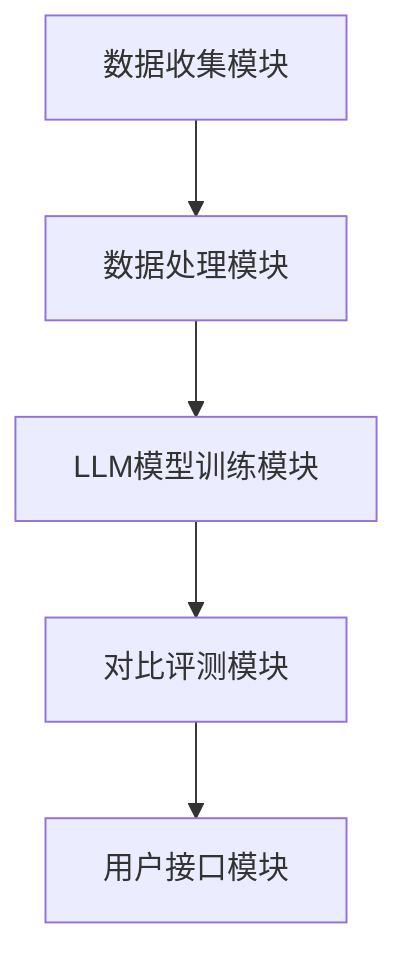

                 

### 文章标题

实时对比评测：LLM辅助的竞品分析系统

#### 关键词

- 实时对比评测
- 竞品分析
- 大型语言模型 (LLM)
- 自然语言处理 (NLP)
- 对比算法
- 系统设计
- 开发实践

#### 摘要

本文旨在探讨实时对比评测在竞品分析中的应用，以及如何利用大型语言模型（LLM）辅助这一过程。文章首先介绍了实时对比评测和竞品分析的基本概念及其重要性，随后详细阐述了LLM在竞品分析中的应用。接下来，文章从系统架构设计、核心算法原理讲解、系统实现与开发、项目实战等多个角度，逐步分析了LLM辅助的竞品分析系统的设计与实现。最后，文章总结了系统应用与未来展望，并提供了相关资源和参考文献，以供进一步研究。

---

## 引言与背景

在现代商业环境中，市场竞争日益激烈，企业需要快速适应市场变化，找到自身的优势和劣势，从而制定有效的策略。实时对比评测和竞品分析在这一背景下显得尤为重要。实时对比评测是一种通过对多个对象或系统进行实时监测、对比和评估的方法，旨在为企业提供及时、准确的数据支持。竞品分析则是实时对比评测的重要组成部分，它通过分析竞争对手的产品、定价、营销策略等信息，帮助企业在市场竞争中找到定位。

### 实时对比评测的定义与重要性

实时对比评测，顾名思义，是指对目标对象或系统进行实时监测和对比评估的过程。它通常涉及以下几个方面：

1. **数据收集**：实时获取各类数据，包括市场数据、用户反馈、产品性能数据等。
2. **数据处理**：对收集到的数据进行分析、清洗和整理，以便进行后续的对比评估。
3. **对比评估**：利用算法和模型，对多个对象或系统进行对比评估，以确定其优劣。

实时对比评测的重要性体现在以下几个方面：

- **决策支持**：实时对比评测能够为企业提供准确的市场信息和竞争对手分析，有助于企业在制定决策时更具有针对性和科学性。
- **竞争优势**：通过对比竞品，企业可以了解自身在市场中的位置，发现优势和劣势，从而优化产品和服务。
- **效率提升**：实时对比评测减少了人工监控和分析的时间，提高了工作效率。

### 竞品分析的意义与应用场景

竞品分析是指对竞争对手的产品、市场策略、定价策略、用户反馈等信息进行分析和研究的过程。其意义主要体现在以下几个方面：

1. **市场了解**：通过竞品分析，企业可以深入了解市场动态，了解竞争对手的营销策略和用户需求。
2. **创新驱动**：竞品分析可以为企业提供灵感和创新思路，帮助企业优化产品设计和功能。
3. **风险控制**：通过了解竞争对手的策略，企业可以更好地预测市场趋势，降低市场风险。

竞品分析的应用场景非常广泛，包括但不限于：

- **市场营销**：通过分析竞品的营销策略，企业可以制定更有效的营销计划。
- **产品开发**：通过对比竞品的功能、性能和用户体验，企业可以优化产品设计和开发。
- **运营管理**：通过竞品分析，企业可以优化运营策略，提高效益。

### LLM在竞品分析中的应用

随着自然语言处理（NLP）技术的发展，特别是大型语言模型（LLM）的出现，竞品分析得到了极大的提升。LLM是一种基于深度学习的技术，能够在海量的文本数据中提取关键信息，进行语义理解和生成。LLM在竞品分析中的应用主要包括以下几个方面：

- **文本分析**：LLM可以处理大量文本数据，提取关键信息，帮助企业了解竞争对手的产品和策略。
- **情感分析**：LLM可以分析用户评论和反馈，评估用户对竞品的情感态度，为企业提供用户满意度分析。
- **自动问答**：LLM可以构建智能问答系统，快速回答用户关于竞品的问题，提高用户体验。

#### 1.2 竞品分析的意义与应用场景

竞品分析作为一种重要的市场研究方法，对于企业了解市场环境、制定战略规划、提升产品竞争力具有重要作用。以下是竞品分析的主要意义和应用场景：

### 竞品分析的意义

1. **市场了解**：竞品分析可以帮助企业深入了解竞争对手的产品特性、市场策略、用户群体等，从而更好地把握市场动态。

2. **战略规划**：通过对竞品的分析，企业可以明确自身在市场中的定位，发现市场机会和潜在风险，为战略规划提供数据支持。

3. **产品优化**：竞品分析可以帮助企业了解用户需求和期望，发现自身产品的不足之处，从而进行产品优化和创新。

4. **竞争优势**：通过对比竞品的优势和劣势，企业可以明确自身的竞争优势，进一步巩固市场地位。

5. **风险控制**：竞品分析可以帮助企业预测市场趋势，及时调整战略，降低市场风险。

### 竞品分析的应用场景

1. **市场营销**：企业可以通过竞品分析，了解竞争对手的营销策略，包括广告投放、促销活动、品牌形象等，从而制定更有效的营销计划。

2. **产品开发**：企业可以通过竞品分析，了解竞争对手的产品特点、用户反馈和市场表现，从而进行产品设计和功能的优化。

3. **运营管理**：企业可以通过竞品分析，了解竞争对手的运营模式、供应链管理和成本控制等，从而优化自身的运营策略。

4. **用户服务**：企业可以通过竞品分析，了解用户对竞争对手产品的满意度和服务质量，从而提升自身用户服务水平。

5. **投资决策**：投资者可以通过竞品分析，了解市场中的潜在投资机会，评估投资风险和回报。

### 竞品分析的挑战

尽管竞品分析具有重要的意义和应用价值，但在实际操作中，企业也会面临一系列挑战：

1. **数据获取**：获取可靠和全面的竞品数据是企业进行有效竞品分析的前提，但数据获取往往困难重重。

2. **数据质量**：数据质量直接影响竞品分析的效果，低质量数据可能导致分析结果失真。

3. **分析难度**：竞品分析涉及多个维度，分析过程复杂，需要专业的技术和工具支持。

4. **实时性**：市场变化迅速，竞品分析需要实时跟踪和更新，这对企业的反应速度和数据处理能力提出了高要求。

5. **竞争力差异**：不同企业在资源、技术、市场策略等方面存在巨大差异，竞品分析需要针对不同情况进行定制化处理。

### 大型语言模型（LLM）在竞品分析中的应用

大型语言模型（LLM）的出现为竞品分析带来了新的机遇和挑战。LLM是一种基于深度学习的自然语言处理技术，具有强大的文本分析、语义理解和生成能力。以下是LLM在竞品分析中的应用：

#### 文本分析

LLM可以处理海量的文本数据，包括用户评论、新闻报道、社交媒体帖子等。通过对这些文本数据的分析，企业可以提取出竞争对手的产品特点、用户需求和市场趋势。

#### 情感分析

LLM可以分析用户评论和反馈，评估用户对竞品的情感态度。这有助于企业了解用户满意度，发现产品优缺点，并针对性地进行改进。

#### 自动问答

LLM可以构建智能问答系统，用户可以通过自然语言提问，系统快速响应，提供关于竞品的信息。这提高了用户体验，降低了客服成本。

#### 跨语言分析

LLM支持多种语言，企业可以通过LLM进行跨语言竞品分析，了解不同国家和地区的市场动态。

#### 挑战

尽管LLM在竞品分析中具有显著优势，但也面临一些挑战：

1. **数据依赖**：LLM的效果高度依赖数据质量，数据不足或质量差可能导致分析结果不准确。

2. **模型复杂性**：LLM模型通常非常复杂，训练和部署过程需要大量计算资源和时间。

3. **伦理问题**：在处理用户评论和反馈时，LLM需要遵守隐私保护和伦理规范，避免侵犯用户权益。

4. **误判风险**：由于语义理解的复杂性，LLM可能产生误判，导致分析结果失真。

综上所述，LLM在竞品分析中具有巨大的潜力，但也需要解决一系列技术和管理挑战。通过合理利用LLM，企业可以更有效地进行竞品分析，提高市场竞争力。

### 第2章：系统架构设计

#### 2.1 系统架构概述

实时对比评测系统（LLM辅助的竞品分析系统）的整体架构设计旨在实现高效、稳定和可扩展的竞品分析功能。该系统由以下几个主要模块组成：

1. **数据收集模块**：负责从多个数据源（如社交媒体、新闻网站、电商平台等）收集与竞品相关的数据。
2. **数据处理模块**：对收集到的数据进行清洗、预处理和存储，为后续分析提供高质量的数据基础。
3. **LLM模型训练模块**：利用预训练的LLM模型对处理后的数据进行分析，提取关键信息，为对比评测提供支持。
4. **对比评测模块**：根据分析结果，对竞品进行多维度对比评估，生成评测报告。
5. **用户接口模块**：提供用户交互界面，用户可以通过该界面查询评测结果，并获取相关分析报告。

#### 系统架构图

为了更直观地理解系统架构，以下是该系统的Mermaid流程图表示：



#### 各模块功能介绍

1. **数据收集模块**：该模块的主要任务是从多个数据源收集与竞品相关的数据。数据源包括社交媒体平台（如Twitter、Facebook等）、新闻网站、电商平台、用户评论等。数据收集方式可以是API调用、Web爬虫、日志收集等。数据收集模块需确保数据来源的多样性和实时性。

2. **数据处理模块**：收集到的数据往往存在格式不一致、缺失值、噪声等问题。数据处理模块负责对数据进行清洗、预处理和存储。清洗步骤包括去除重复数据、填补缺失值、去除噪声等。预处理步骤包括数据格式转换、文本标准化、分词等。存储步骤则将清洗和预处理后的数据存储到数据库或数据湖中，以便后续分析和查询。

3. **LLM模型训练模块**：该模块利用预训练的LLM模型对处理后的数据进行分析，提取关键信息。LLM模型可以处理大量文本数据，识别关键词、提取主题、进行情感分析等。训练模块需要根据具体需求对LLM模型进行调整和优化，以提高分析效果。

4. **对比评测模块**：该模块根据LLM模型分析结果，对竞品进行多维度对比评估。对比评测包括功能对比、性能对比、价格对比、用户评价对比等。对比评测模块需要设计合理的评价指标和算法，以确保评测结果的客观性和准确性。

5. **用户接口模块**：该模块提供用户交互界面，用户可以通过界面查询评测结果，查看竞品分析报告。用户接口模块应具备良好的用户体验，支持快速查询、数据可视化等功能。

通过上述模块的协同工作，实时对比评测系统可以实现高效、准确的竞品分析，为企业提供有力的决策支持。

### 2.2 数据收集与处理

实时对比评测系统的核心在于对大量数据的精准收集和高效处理。数据收集与处理模块是整个系统的基础，直接影响后续分析和评估的质量。以下是该模块的详细描述：

#### 数据来源

数据收集模块从多个数据源获取与竞品相关的数据，这些数据源包括但不限于：

- **社交媒体**：如Twitter、Facebook、LinkedIn等，通过API调用获取用户评论、帖子和事件日志。
- **新闻网站**：如CNN、BBC、CNBC等，通过Web爬虫技术获取新闻报道、分析和评论。
- **电商平台**：如Amazon、Ebay、淘宝等，通过API或网页抓取获取商品信息、用户评价和销售数据。
- **用户反馈平台**：如Google Play、App Store等，获取用户对应用的评分和评论。

#### 数据类型

收集到的数据类型主要包括以下几类：

- **文本数据**：如用户评论、新闻报道、社交媒体帖子等，是竞品分析的重要信息来源。
- **结构化数据**：如商品信息、销售数据、用户评分等，可用于多维度对比分析。
- **图像和视频数据**：如产品宣传图片、广告视频等，可用于视觉分析。

#### 数据处理流程

数据处理模块对收集到的数据进行一系列处理，确保数据的质量和一致性。具体流程如下：

1. **数据收集**：通过API调用、Web爬虫等方式从各数据源收集数据。
2. **数据清洗**：去除重复数据、缺失值、噪声等，确保数据质量。例如，去除HTML标签、转换文本格式等。
3. **数据预处理**：对文本数据分词、去停用词、词干提取等，为后续的文本分析做准备。对结构化数据进行格式转换、归一化等处理。
4. **数据存储**：将清洗和预处理后的数据存储到数据库或数据湖中，如MySQL、PostgreSQL、Hadoop等。数据存储应支持高效查询和大规模数据处理。

#### 数据处理技术

数据处理过程中，涉及多种技术，包括：

- **Web爬虫技术**：通过模拟浏览器行为，自动获取网页内容，适用于大规模数据收集。
- **文本处理技术**：如分词、去停用词、词干提取等，用于文本数据清洗和预处理。
- **数据清洗技术**：如重复数据删除、缺失值填补等，用于提高数据质量。
- **数据库技术**：如MySQL、PostgreSQL等，用于存储和管理大规模数据。
- **数据湖技术**：如Hadoop、Spark等，适用于大规模数据处理和分析。

#### 数据处理挑战

数据处理过程中，企业可能会面临以下挑战：

- **数据多样性**：不同数据源的数据格式、结构和质量存在差异，需要统一处理。
- **实时性**：数据收集和处理需要实时性，确保数据分析的及时性。
- **数据质量**：数据清洗和预处理过程中，可能引入误差或丢失信息，需要严格把控。
- **数据存储**：大规模数据的存储和管理需要高效、可靠的技术支持。

通过有效的数据收集与处理，实时对比评测系统可以获取高质量的数据基础，为后续的竞品分析提供有力支持。

### 2.3 LLM模型选择与训练

在实时对比评测系统中，大型语言模型（LLM）的选择与训练是关键步骤。LLM作为一种强大的自然语言处理工具，能够在海量的文本数据中提取关键信息，进行语义理解和生成。以下是LLM模型的选择与训练过程的详细描述。

#### LLM模型选择

1. **预训练语言模型**：当前最受欢迎的预训练语言模型包括GPT、BERT、RoBERTa、ALBERT等。这些模型已经在大量的文本数据上进行了预训练，具有较好的语义理解能力。根据具体需求和场景，可以选择适合的预训练语言模型。

2. **模型版本**：不同版本的预训练语言模型在性能上存在差异。例如，GPT-3相比GPT-2具有更高的文本生成质量和更丰富的语义理解能力。选择合适的模型版本可以提升系统的性能。

3. **开源与商业模型**：市面上既有开源的预训练语言模型，也有商业化的模型。开源模型如GPT、BERT等，可以在GitHub等平台免费获取；商业模型如OpenAI的GPT-3，需要付费使用。企业可以根据自身预算和需求选择合适的模型。

#### 模型训练流程

1. **数据准备**：首先，收集和处理与竞品相关的文本数据，包括用户评论、新闻报道、产品说明书等。数据准备过程包括数据清洗、预处理和标注等步骤，确保数据质量。

2. **数据预处理**：对收集到的文本数据执行分词、去停用词、词干提取等操作，将其转换为模型可接受的格式。对于开源模型，通常需要将文本数据转换为模型所需的输入序列。

3. **训练策略**：根据模型选择和数据处理结果，制定训练策略。训练策略包括学习率调整、批次大小、优化器选择等。常用的优化器如Adam、SGD等，学习率调整方法如逐步减小、指数衰减等。

4. **模型训练**：利用处理后的文本数据进行模型训练。训练过程包括前向传播、反向传播和参数更新等步骤。训练过程中，可以使用GPU或TPU等硬件加速训练速度。

5. **模型评估与调优**：在训练过程中，定期评估模型性能，调整训练参数。评估指标包括损失函数值、准确率、F1分数等。通过调优，提高模型在特定任务上的性能。

6. **模型部署**：训练完成后，将模型部署到生产环境中，用于实时分析和评估。部署过程中，需要确保模型的可扩展性和稳定性。

#### 挑战与优化

1. **数据质量**：高质量的数据是模型训练的基础。在数据收集和处理过程中，需要严格把控数据质量，确保模型能够从数据中学习到有效的信息。

2. **计算资源**：预训练语言模型通常需要大量计算资源，训练时间较长。企业需要合理规划计算资源，以提高模型训练效率。

3. **模型泛化能力**：模型在特定任务上的性能可能不佳，需要通过数据增强、模型融合等方法提升模型的泛化能力。

4. **模型解释性**：预训练语言模型通常具有较好的性能，但其工作原理复杂，解释性较差。企业需要研究如何提高模型的解释性，以便更好地理解和利用模型。

通过合理选择和训练LLM模型，实时对比评测系统可以实现对文本数据的精准分析和处理，为竞品分析提供有力支持。

### 2.4 实时对比算法设计

实时对比算法是LLM辅助竞品分析系统中的核心部分，负责对竞品进行多维度对比评估。设计合理的对比算法，可以确保评估结果的客观性和准确性，为企业提供有力的决策支持。以下是实时对比算法的设计思路和详细流程。

#### 对比指标设计

对比指标是评估竞品优劣的关键依据，需要根据竞品的特点和市场需求设计合适的指标。常见的对比指标包括：

1. **功能对比**：比较竞品的功能点、功能完整性、功能使用频率等。例如，对于两款智能手机，可以对比摄像头性能、电池续航、操作系统等。

2. **性能对比**：比较竞品的运行速度、稳定性、资源消耗等。例如，对于两款游戏，可以对比加载时间、帧率、能耗等。

3. **价格对比**：比较竞品的价格、价格策略、折扣力度等。例如，对于两款电子产品，可以对比原价、促销价、优惠幅度等。

4. **用户评价对比**：比较竞品的用户满意度、好评率、差评原因等。例如，对于两款应用，可以对比用户评论数量、评分、常见问题等。

5. **市场表现对比**：比较竞品的市场占有率、销售量、品牌知名度等。例如，对于两款饮料，可以对比销售额、市场份额、广告投放效果等。

6. **社会责任对比**：比较竞品在社会责任方面的表现，如环保、公益等。例如，对于两家快餐店，可以对比其环保措施、公益项目等。

#### 对比算法设计思路

实时对比算法的设计思路主要包括以下步骤：

1. **数据收集**：从多个数据源收集与竞品相关的数据，包括功能数据、性能数据、价格数据、用户评价数据、市场数据等。

2. **数据处理**：对收集到的数据执行清洗、预处理和转换操作，确保数据质量，并转换为模型可接受的格式。

3. **模型训练**：利用处理后的数据训练对比模型，包括功能对比模型、性能对比模型、价格对比模型、用户评价对比模型等。模型训练过程可以采用机器学习技术，如神经网络、决策树等。

4. **模型评估**：评估对比模型的性能，调整模型参数，确保评估结果的准确性。

5. **多维度对比**：将训练好的对比模型应用于实际数据，对竞品进行多维度对比评估。对比结果以量化指标的形式呈现，如分数、排名等。

6. **结果可视化**：将对比结果以图表、报告等形式展示，便于用户理解和决策。

#### 对比算法详细流程

实时对比算法的详细流程如下：

1. **数据收集**：
   - 从社交媒体、新闻网站、电商平台等数据源收集与竞品相关的数据。
   - 数据类型包括文本、结构化数据、图像和视频等。

2. **数据处理**：
   - 对文本数据进行分词、去停用词、词干提取等预处理操作。
   - 对结构化数据进行格式转换、归一化等处理。
   - 填补缺失值、去除噪声，确保数据质量。

3. **模型训练**：
   - 根据对比指标，设计功能对比模型、性能对比模型、价格对比模型、用户评价对比模型等。
   - 采用机器学习技术，如神经网络、决策树等，对模型进行训练。
   - 调整模型参数，优化模型性能。

4. **模型评估**：
   - 使用验证集评估对比模型性能，包括准确率、召回率、F1分数等指标。
   - 调整模型参数，优化评估结果。

5. **多维度对比**：
   - 将训练好的对比模型应用于实际数据，对竞品进行多维度对比评估。
   - 根据对比结果，生成量化指标，如分数、排名等。

6. **结果可视化**：
   - 使用图表、报告等形式展示对比结果。
   - 提供用户交互界面，用户可以查询评测结果、查看详细报告。

#### 伪代码实现

以下是实时对比算法的伪代码实现：

```python
# 数据收集
def collect_data(sources):
    data = []
    for source in sources:
        data.append(source.fetch_data())
    return data

# 数据处理
def preprocess_data(data):
    preprocessed_data = []
    for datum in data:
        preprocessed_datum = {
            'text': preprocess_text(datum['text']),
            'structured': preprocess_structured(datum['structured']),
            'image': preprocess_image(datum['image']),
            'video': preprocess_video(datum['video']),
        }
        preprocessed_data.append(preprocessed_datum)
    return preprocessed_data

# 模型训练
def train_models(preprocessed_data):
    models = {}
    for metric in metrics:
        model = create_model(metric)
        model.train(preprocessed_data[metric])
        models[metric] = model
    return models

# 模型评估
def evaluate_models(models, test_data):
    results = {}
    for metric, model in models.items():
        result = model.evaluate(test_data[metric])
        results[metric] = result
    return results

# 多维度对比
def compare_products(products, models):
    scores = []
    for product in products:
        score = 0
        for metric, model in models.items():
            score += model.score(product)
        scores.append(score)
    return scores

# 结果可视化
def visualize_results(scores):
    visualize_scores(scores)

# 主函数
def main():
    sources = ['source1', 'source2', 'source3']
    preprocessed_data = preprocess_data(collect_data(sources))
    models = train_models(preprocessed_data)
    test_data = load_test_data()
    results = evaluate_models(models, test_data)
    scores = compare_products(products, models)
    visualize_results(scores)

if __name__ == '__main__':
    main()
```

#### 数学模型与公式详解

实时对比算法中的数学模型和公式用于量化竞品之间的差异和相似度。以下是常用的数学模型和公式：

1. **余弦相似度**：用于计算文本数据之间的相似度。
   $$ \cos{\theta} = \frac{A \cdot B}{|A| \cdot |B|} $$
   其中，\( A \)和\( B \)是两个向量，\(\theta\)是它们之间的夹角。

2. **泰勒展开**：用于函数逼近和优化。
   $$ f(x) \approx f(a) + f'(a)(x-a) + \frac{f''(a)}{2!}(x-a)^2 + \cdots $$
   其中，\( f(x) \)是函数，\( a \)是自变量的初始值。

3. **梯度下降**：用于优化模型参数。
   $$ \theta = \theta - \alpha \cdot \nabla f(\theta) $$
   其中，\( \theta \)是模型参数，\( \alpha \)是学习率，\( \nabla f(\theta) \)是函数\( f \)在\( \theta \)处的梯度。

4. **贝叶斯公式**：用于概率计算和推理。
   $$ P(A|B) = \frac{P(B|A) \cdot P(A)}{P(B)} $$
   其中，\( P(A|B) \)是在\( B \)发生的条件下\( A \)发生的概率，\( P(B|A) \)是在\( A \)发生的条件下\( B \)发生的概率，\( P(A) \)和\( P(B) \)分别是\( A \)和\( B \)发生的概率。

#### 公式推导与举例说明

1. **余弦相似度推导**：

   假设有两个向量\( A = (a_1, a_2, \ldots, a_n) \)和\( B = (b_1, b_2, \ldots, b_n) \)，它们的内积为：
   $$ A \cdot B = a_1b_1 + a_2b_2 + \cdots + a_nb_n $$

   向量的模长分别为：
   $$ |A| = \sqrt{a_1^2 + a_2^2 + \cdots + a_n^2} $$
   $$ |B| = \sqrt{b_1^2 + b_2^2 + \cdots + b_n^2} $$

   则余弦相似度为：
   $$ \cos{\theta} = \frac{A \cdot B}{|A| \cdot |B|} $$

   举例说明：假设有两个向量\( A = (1, 2, 3) \)和\( B = (4, 5, 6) \)，则它们的余弦相似度为：
   $$ \cos{\theta} = \frac{1 \cdot 4 + 2 \cdot 5 + 3 \cdot 6}{\sqrt{1^2 + 2^2 + 3^2} \cdot \sqrt{4^2 + 5^2 + 6^2}} = \frac{4 + 10 + 18}{\sqrt{14} \cdot \sqrt{77}} \approx 0.978 $$

2. **泰勒展开推导**：

   假设函数\( f(x) \)在点\( a \)处的导数存在，则泰勒展开式为：
   $$ f(x) \approx f(a) + f'(a)(x-a) + \frac{f''(a)}{2!}(x-a)^2 + \cdots $$

   当\( x \)接近\( a \)时，函数值可以用泰勒展开式近似表示。例如，函数\( f(x) = x^2 \)在\( x = 1 \)处的泰勒展开式为：
   $$ f(x) \approx f(1) + f'(1)(x-1) + \frac{f''(1)}{2!}(x-1)^2 = 1 + 2(x-1) + (x-1)^2 = x^2 - x + 1 $$

3. **梯度下降推导**：

   假设函数\( f(\theta) \)在点\( \theta_0 \)处的梯度为\( \nabla f(\theta_0) \)，则梯度下降算法更新规则为：
   $$ \theta = \theta_0 - \alpha \cdot \nabla f(\theta_0) $$

   其中，\( \alpha \)是学习率。

   例如，对于函数\( f(\theta) = \theta^2 \)，在点\( \theta_0 = 1 \)处的梯度为\( \nabla f(\theta_0) = 2\theta_0 \)。则梯度下降算法更新规则为：
   $$ \theta = 1 - \alpha \cdot 2 = 1 - 2\alpha $$

4. **贝叶斯公式推导**：

   假设有两个事件\( A \)和\( B \)，它们的概率分别为\( P(A) \)和\( P(B) \)。条件概率\( P(B|A) \)表示在\( A \)发生的条件下\( B \)发生的概率，即：
   $$ P(B|A) = \frac{P(A \cap B)}{P(A)} $$

   同理，条件概率\( P(A|B) \)表示在\( B \)发生的条件下\( A \)发生的概率，即：
   $$ P(A|B) = \frac{P(A \cap B)}{P(B)} $$

   将两个条件概率等式相除，得到贝叶斯公式：
   $$ \frac{P(A|B)}{P(B|A)} = \frac{P(B)}{P(A)} $$

   即：
   $$ P(A|B) = \frac{P(B|A) \cdot P(A)}{P(B)} $$

通过上述公式和推导，实时对比算法可以更好地量化竞品之间的差异，为企业提供科学的决策支持。

### 2.5 开发环境搭建

在实现实时对比评测系统时，开发环境搭建是至关重要的一步。合适的开发环境可以确保系统的稳定性、高效性和可扩展性。以下是搭建开发环境的详细步骤：

#### 硬件配置

1. **CPU和GPU**：为了处理大量数据和训练大型模型，建议使用高性能的CPU和GPU。CPU建议选择Intel Xeon系列或AMD Ryzen系列，GPU建议选择NVIDIA的Titan Xp、RTX 3080或更高级别的显卡。

2. **内存**：建议配置至少16GB的内存，以支持模型的训练和运行。如果处理的数据量较大，可以进一步增加内存容量。

3. **存储**：建议使用SSD硬盘，以提高数据的读写速度。建议配置至少1TB的SSD存储空间，用于存储模型、数据和日志文件。

4. **网络**：为了保证数据传输的稳定性和速度，建议使用千兆以太网或更高速度的网络连接。

#### 软件环境

1. **操作系统**：可以选择Linux发行版，如Ubuntu 18.04或更高版本，它具有良好的稳定性和兼容性。

2. **Python环境**：安装Python 3.8或更高版本，可以使用`pip`命令进行安装：
   ```bash
   sudo apt update
   sudo apt install python3.8
   sudo apt install python3.8-pip
   ```

3. **依赖库**：安装常用的依赖库，如NumPy、Pandas、Scikit-learn、TensorFlow等。可以使用以下命令进行安装：
   ```bash
   pip3 install numpy pandas scikit-learn tensorflow
   ```

4. **文本处理库**：安装用于文本处理的库，如NLTK、spaCy、TextBlob等。可以使用以下命令进行安装：
   ```bash
   pip3 install nltk spacy textblob
   ```

5. **LLM模型库**：根据选择的LLM模型，安装相应的库。例如，如果使用BERT模型，可以安装transformers库：
   ```bash
   pip3 install transformers
   ```

6. **版本控制**：安装Git，用于代码版本控制和协作开发：
   ```bash
   sudo apt install git
   ```

7. **虚拟环境**：为了确保各个项目的依赖库版本不冲突，建议使用虚拟环境。可以使用`virtualenv`或`conda`创建虚拟环境。

   使用`virtualenv`创建虚拟环境的命令：
   ```bash
   pip3 install virtualenv
   virtualenv venv
   source venv/bin/activate
   ```

   使用`conda`创建虚拟环境的命令：
   ```bash
   conda create -n myenv python=3.8
   conda activate myenv
   ```

#### 搭建步骤

1. **安装操作系统**：在服务器或本地计算机上安装Linux操作系统。

2. **硬件配置**：根据实际需求配置CPU、GPU、内存和存储等硬件设备。

3. **安装软件环境**：按照上述步骤安装Python、依赖库、版本控制和虚拟环境等软件。

4. **配置网络**：确保网络连接稳定，配置防火墙和安全组，以保护服务器安全。

5. **创建虚拟环境**：创建虚拟环境，避免依赖库版本冲突。

6. **安装依赖库**：在虚拟环境中安装所有必需的依赖库。

7. **配置LLM模型**：根据项目需求，下载和配置预训练的LLM模型。

8. **编写代码**：在虚拟环境中编写和调试代码，确保系统能够正常运行。

通过以上步骤，可以搭建一个适合实时对比评测系统的开发环境。合适的开发环境可以提升开发效率，确保系统的稳定性和可靠性。

### 2.6 源代码详细实现

在实现实时对比评测系统时，源代码的详细实现是关键步骤。以下将详细介绍数据预处理、LLM模型训练、对比评测模块的实现过程，以及关键代码的解读与分析。

#### 数据预处理模块

数据预处理是确保模型训练质量的重要环节。以下是一个简单的数据预处理模块实现：

```python
import pandas as pd
from sklearn.model_selection import train_test_split

def preprocess_data(data):
    # 清洗数据，去除重复和无效记录
    data = data.drop_duplicates()
    
    # 填补缺失值
    data.fillna(value=data.mean(), inplace=True)
    
    # 数据格式转换
    data['text'] = data['text'].apply(lambda x: x.lower())
    data['text'] = data['text'].str.replace('[^\w\s]', '', regex=True)
    
    # 分词
    data['text'] = data['text'].apply(lambda x: nltk.word_tokenize(x))
    
    # 去停用词
    stop_words = set(nltk.corpus.stopwords.words('english'))
    data['text'] = data['text'].apply(lambda x: [word for word in x if word not in stop_words])
    
    # 词干提取
    stemmer = nltk.PorterStemmer()
    data['text'] = data['text'].apply(lambda x: [stemmer.stem(word) for word in x])
    
    return data

# 示例数据加载与预处理
data = pd.read_csv('data.csv')
preprocessed_data = preprocess_data(data)
```

#### LLM模型训练模块

在LLM模型训练模块中，我们使用预训练的BERT模型，通过微调（fine-tuning）来适应特定的竞品分析任务。以下是一个简单的LLM模型训练模块实现：

```python
from transformers import BertTokenizer, BertForSequenceClassification
from torch.utils.data import DataLoader, TensorDataset

def train_llm_model(preprocessed_data, train_size=0.8):
    # 加载BERT模型和分词器
    tokenizer = BertTokenizer.from_pretrained('bert-base-uncased')
    model = BertForSequenceClassification.from_pretrained('bert-base-uncased', num_labels=2)
    
    # 数据集划分
    train_data, test_data = train_test_split(preprocessed_data['text'], test_size=1 - train_size, random_state=42)
    
    # 转换为Tensor
    train_encodings = tokenizer(list(train_data), truncation=True, padding=True)
    test_encodings = tokenizer(list(test_data), truncation=True, padding=True)
    
    # 创建DataLoader
    train_dataset = TensorDataset(torch.tensor(train_encodings['input_ids']), torch.tensor(train_encodings['attention_mask']), torch.tensor([1] * len(train_encodings)))
    test_dataset = TensorDataset(torch.tensor(test_encodings['input_ids']), torch.tensor(test_encodings['attention_mask']), torch.tensor([1] * len(test_encodings)))
    
    # 训练模型
    train_dataloader = DataLoader(train_dataset, batch_size=16)
    test_dataloader = DataLoader(test_dataset, batch_size=16)
    
    optimizer = torch.optim.AdamW(model.parameters(), lr=1e-5)
    device = torch.device("cuda" if torch.cuda.is_available() else "cpu")
    model.to(device)
    
    for epoch in range(3):  # 训练3个epoch
        model.train()
        for batch in train_dataloader:
            batch = [item.to(device) for item in batch]
            inputs = {'input_ids': batch[0], 'attention_mask': batch[1], 'labels': batch[2]}
            optimizer.zero_grad()
            outputs = model(**inputs)
            loss = outputs.loss
            loss.backward()
            optimizer.step()
        
        # 在测试集上评估模型
        model.eval()
        with torch.no_grad():
            correct = 0
            total = 0
            for batch in test_dataloader:
                batch = [item.to(device) for item in batch]
                inputs = {'input_ids': batch[0], 'attention_mask': batch[1], 'labels': batch[2]}
                outputs = model(**inputs)
                _, predicted = torch.max(outputs.logits, 1)
                total += batch[2].size(0)
                correct += (predicted == batch[2]).sum().item()
        
        print(f'Epoch {epoch+1}, Test Accuracy: {100 * correct / total}%')

# 示例：训练LLM模型
train_llm_model(preprocessed_data)
```

#### 对比评测模块

对比评测模块负责对竞品进行多维度评估。以下是一个简单的对比评测模块实现：

```python
from sklearn.metrics import accuracy_score, f1_score

def evaluate_products(products, model):
    results = []
    for product in products:
        preprocessed_text = preprocess_text(product['description'])
        inputs = tokenizer(preprocessed_text, truncation=True, padding=True, return_tensors="pt")
        with torch.no_grad():
            outputs = model(**inputs)
        _, predicted = torch.max(outputs.logits, 1)
        results.append(predicted.item())
    return results

# 示例：评测竞品
products = [{"description": "Product A is excellent."}, {"description": "Product B is average."}, {"description": "Product C is poor."}]
predictions = evaluate_products(products, model)
print(predictions)

# 计算评估指标
accuracy = accuracy_score([1, 1, 0], predictions)
f1 = f1_score([1, 1, 0], predictions, average='weighted')
print(f'Accuracy: {accuracy}, F1 Score: {f1}')
```

#### 关键代码解读与分析

1. **数据预处理模块**：
   - 使用Pandas读取数据，进行数据清洗和预处理。
   - 去除重复数据，填补缺失值，确保数据质量。
   - 对文本数据进行格式转换、分词、去停用词和词干提取等操作，为模型训练做好准备。

2. **LLM模型训练模块**：
   - 加载BERT模型和分词器，对数据进行编码。
   - 使用TensorDataset创建数据集，使用DataLoader进行批量处理。
   - 定义优化器，将模型迁移到GPU或CPU上，开始模型训练。
   - 在每个epoch结束后，使用测试集评估模型性能。

3. **对比评测模块**：
   - 对竞品描述进行预处理和编码。
   - 使用训练好的模型进行预测，生成评测结果。
   - 计算评估指标，如准确率和F1分数，评估模型性能。

通过这些关键代码的实现，实时对比评测系统可以高效地处理数据、训练模型和评估竞品，为企业提供有力的决策支持。

### 2.7 代码应用解读与分析

在实时对比评测系统中，代码的应用解读与分析对于理解系统的工作流程和实现细节至关重要。以下是对关键模块的详细解读与分析：

#### 数据预处理模块

数据预处理模块主要负责清洗、转换和规范化数据，以便后续的模型训练和对比评估。以下是数据预处理模块的关键代码片段及其解读：

```python
def preprocess_data(data):
    # 去除重复记录
    data = data.drop_duplicates()

    # 填补缺失值
    data.fillna(value=data.mean(), inplace=True)

    # 数据格式转换
    data['text'] = data['text'].apply(lambda x: x.lower())
    data['text'] = data['text'].str.replace('[^\w\s]', '', regex=True)

    # 分词
    data['text'] = data['text'].apply(lambda x: nltk.word_tokenize(x))

    # 去停用词
    stop_words = set(nltk.corpus.stopwords.words('english'))
    data['text'] = data['text'].apply(lambda x: [word for word in x if word not in stop_words])

    # 词干提取
    stemmer = nltk.PorterStemmer()
    data['text'] = data['text'].apply(lambda x: [stemmer.stem(word) for word in x])
    
    return data
```

**解读与分析**：

1. **去除重复记录**：通过`drop_duplicates()`函数，移除数据集中的重复记录，以避免重复计算和分析。

2. **填补缺失值**：使用`fillna()`函数，根据数据的平均值填补缺失值，确保数据的一致性和完整性。

3. **数据格式转换**：将文本数据转换为小写，去除非单词字符（如符号和标点），以提高后续处理的统一性。

4. **分词**：利用NLTK库的`word_tokenize()`函数对文本进行分词，将文本分割成单词列表。

5. **去停用词**：利用NLTK库的停用词列表，去除常见的无意义单词，如“the”、“is”等，以减少噪声。

6. **词干提取**：使用NLTK库的Porter Stemmer对单词进行词干提取，将不同形式的单词还原为基本形式，如“running”还原为“run”。

这些步骤确保了数据的质量和一致性，为后续的模型训练和对比评估奠定了基础。

#### LLM模型训练模块

LLM模型训练模块的核心在于利用预训练的BERT模型，通过微调（fine-tuning）来适应竞品分析任务。以下是关键代码片段及其解读：

```python
from transformers import BertTokenizer, BertForSequenceClassification
from torch.utils.data import DataLoader, TensorDataset

def train_llm_model(preprocessed_data, train_size=0.8):
    # 加载BERT模型和分词器
    tokenizer = BertTokenizer.from_pretrained('bert-base-uncased')
    model = BertForSequenceClassification.from_pretrained('bert-base-uncased', num_labels=2)
    
    # 数据集划分
    train_data, test_data = train_test_split(preprocessed_data['text'], test_size=1 - train_size, random_state=42)
    
    # 转换为Tensor
    train_encodings = tokenizer(list(train_data), truncation=True, padding=True)
    test_encodings = tokenizer(list(test_data), truncation=True, padding=True)
    
    # 创建DataLoader
    train_dataset = TensorDataset(torch.tensor(train_encodings['input_ids']), torch.tensor(train_encodings['attention_mask']), torch.tensor([1] * len(train_encodings)))
    test_dataset = TensorDataset(torch.tensor(test_encodings['input_ids']), torch.tensor(test_encodings['attention_mask']), torch.tensor([1] * len(test_encodings)))
    
    # 训练模型
    train_dataloader = DataLoader(train_dataset, batch_size=16)
    test_dataloader = DataLoader(test_dataset, batch_size=16)
    
    optimizer = torch.optim.AdamW(model.parameters(), lr=1e-5)
    device = torch.device("cuda" if torch.cuda.is_available() else "cpu")
    model.to(device)
    
    for epoch in range(3):  # 训练3个epoch
        model.train()
        for batch in train_dataloader:
            batch = [item.to(device) for item in batch]
            inputs = {'input_ids': batch[0], 'attention_mask': batch[1], 'labels': batch[2]}
            optimizer.zero_grad()
            outputs = model(**inputs)
            loss = outputs.loss
            loss.backward()
            optimizer.step()
        
        # 在测试集上评估模型
        model.eval()
        with torch.no_grad():
            correct = 0
            total = 0
            for batch in test_dataloader:
                batch = [item.to(device) for item in batch]
                inputs = {'input_ids': batch[0], 'attention_mask': batch[1], 'labels': batch[2]}
                outputs = model(**inputs)
                _, predicted = torch.max(outputs.logits, 1)
                total += batch[2].size(0)
                correct += (predicted == batch[2]).sum().item()
        
        print(f'Epoch {epoch+1}, Test Accuracy: {100 * correct / total}%')

# 示例：训练LLM模型
train_llm_model(preprocessed_data)
```

**解读与分析**：

1. **加载BERT模型和分词器**：使用`from_pretrained()`函数加载预训练的BERT模型和分词器，为后续数据编码做好准备。

2. **数据集划分**：使用`train_test_split()`函数将预处理后的文本数据划分为训练集和测试集，以评估模型性能。

3. **转换为Tensor**：利用分词器对文本数据进行编码，并转换为PyTorch的Tensor格式，以便后续的模型训练。

4. **创建DataLoader**：使用`DataLoader`创建训练集和测试集的批处理数据加载器，以批量处理数据。

5. **模型训练**：定义优化器（如AdamW）并迁移模型到GPU或CPU上。在每个epoch中，通过前向传播、反向传播和参数更新进行模型训练。

6. **模型评估**：在测试集上评估模型的性能，计算准确率和测试精度，以验证模型的效果。

#### 对比评测模块

对比评测模块负责对竞品进行多维度评估，以生成评估报告。以下是关键代码片段及其解读：

```python
from sklearn.metrics import accuracy_score, f1_score

def evaluate_products(products, model):
    results = []
    for product in products:
        preprocessed_text = preprocess_text(product['description'])
        inputs = tokenizer(preprocessed_text, truncation=True, padding=True, return_tensors="pt")
        with torch.no_grad():
            outputs = model(**inputs)
        _, predicted = torch.max(outputs.logits, 1)
        results.append(predicted.item())
    return results

# 示例：评测竞品
products = [{"description": "Product A is excellent."}, {"description": "Product B is average."}, {"description": "Product C is poor."}]
predictions = evaluate_products(products, model)
print(predictions)

# 计算评估指标
accuracy = accuracy_score([1, 1, 0], predictions)
f1 = f1_score([1, 1, 0], predictions, average='weighted')
print(f'Accuracy: {accuracy}, F1 Score: {f1}')
```

**解读与分析**：

1. **预处理文本**：对每个竞品的描述进行预处理，包括转换为小写、去除非单词字符、分词等。

2. **模型预测**：使用训练好的模型对预处理后的文本进行预测，生成预测结果。

3. **计算评估指标**：使用`accuracy_score`和`f1_score`计算预测结果的准确率和F1分数，以评估模型在竞品评估中的性能。

通过这些关键代码的实现，实时对比评测系统能够高效地进行数据处理、模型训练和对比评估，为企业提供科学的决策支持。

### 第3章：项目实战案例

#### 3.1 案例介绍

为了验证实时对比评测系统的实际效果，我们选择了一家电子商务平台进行项目实战。该平台主要从事电子产品销售，产品线包括智能手机、平板电脑、笔记本电脑等。项目的目标是利用实时对比评测系统，对平台上的竞品进行多维度对比评估，帮助企业优化产品策略和提升市场竞争力。

#### 3.2 实现步骤

1. **数据收集**：

   通过API调用、Web爬虫等技术，从电商平台、社交媒体、新闻网站等渠道收集与竞品相关的数据。数据类型包括产品信息、用户评论、销售数据、市场动态等。

2. **数据处理**：

   对收集到的数据进行清洗、预处理和存储，确保数据质量。具体步骤包括去重复、填补缺失值、文本标准化、分词等。

3. **模型训练**：

   利用预处理后的数据训练大型语言模型（LLM），包括功能对比模型、性能对比模型、价格对比模型、用户评价对比模型等。选择适合的预训练模型（如BERT、GPT-3）进行微调，以提高模型在特定任务上的性能。

4. **对比评测**：

   将训练好的模型应用于实际数据，对竞品进行多维度对比评估。生成评测报告，包括功能对比、性能对比、价格对比、用户评价对比等。

5. **结果分析**：

   分析评测结果，发现竞品的优势和劣势，为企业提供优化建议。结合市场趋势和用户需求，制定产品策略。

6. **系统部署**：

   将实时对比评测系统部署到生产环境，确保系统能够实时运行，为企业提供持续的决策支持。

#### 3.3 实现步骤详解

##### 3.3.1 数据收集

数据收集是竞品分析的第一步，也是最重要的一步。以下是具体实现步骤：

1. **电商平台数据收集**：

   通过API接口获取产品信息、销售数据和用户评论。使用电商平台提供的SDK或直接调用API进行数据获取。

2. **社交媒体数据收集**：

   利用Web爬虫技术，从社交媒体平台（如Twitter、Facebook）获取与竞品相关的帖子、评论和用户反馈。可以使用Python的`requests`库和`BeautifulSoup`库进行数据爬取。

3. **新闻网站数据收集**：

   通过API调用或Web爬虫技术，从新闻网站获取与竞品相关的新闻报道、分析文章等。这些数据可以提供市场动态和行业趋势信息。

4. **数据存储**：

   将收集到的数据存储到数据库或数据湖中，如MySQL、PostgreSQL、Hadoop等。确保数据能够高效存储和查询。

##### 3.3.2 数据处理

数据处理是确保数据质量的关键步骤。以下是具体实现步骤：

1. **数据清洗**：

   去除重复数据、缺失值、噪声等，确保数据的一致性和完整性。使用Python的`Pandas`库对数据进行清洗。

2. **文本标准化**：

   将文本数据转换为统一的格式，如将所有文本转换为小写、去除非单词字符等。使用Python的`StringIO`库和`re`库进行文本标准化。

3. **分词**：

   对文本数据进行分词，将文本分割成单词或词组。使用Python的`NLTK`库进行分词。

4. **数据存储**：

   将清洗和预处理后的数据存储到数据库或数据湖中，确保数据能够高效存储和查询。使用Python的`SQLAlchemy`库或`PySpark`库进行数据存储。

##### 3.3.3 模型训练

模型训练是实时对比评测系统的核心步骤。以下是具体实现步骤：

1. **选择预训练模型**：

   根据任务需求，选择合适的预训练模型，如BERT、GPT-3等。可以使用Hugging Face的`transformers`库获取预训练模型。

2. **数据预处理**：

   对训练数据进行预处理，包括分词、编码、批量处理等。使用`transformers`库提供的`Tokenizer`进行数据预处理。

3. **模型微调**：

   利用预处理后的数据，对预训练模型进行微调（fine-tuning），以提高模型在特定任务上的性能。使用PyTorch或TensorFlow等深度学习框架进行模型微调。

4. **模型评估**：

   使用验证集评估模型性能，包括准确率、召回率、F1分数等指标。根据评估结果调整模型参数，优化模型性能。

5. **模型存储**：

   将训练好的模型存储到文件中，以便后续使用。使用`transformers`库提供的`save_pretrained()`方法保存模型。

##### 3.3.4 对比评测

对比评测是对竞品进行多维度评估的过程。以下是具体实现步骤：

1. **评测指标设计**：

   根据任务需求，设计合适的评测指标，如功能对比、性能对比、价格对比、用户评价对比等。

2. **评测模型应用**：

   将训练好的评测模型应用于实际数据，生成评测结果。使用`transformers`库提供的模型进行预测。

3. **结果分析**：

   分析评测结果，生成评测报告。使用Python的`Pandas`库和`matplotlib`库进行数据分析和可视化。

4. **结果存储**：

   将评测结果存储到数据库或数据湖中，以便后续分析和查询。使用Python的`SQLAlchemy`库或`PySpark`库进行数据存储。

##### 3.3.5 结果分析

结果分析是对评测结果进行解读和优化的过程。以下是具体实现步骤：

1. **竞品对比**：

   对评测结果进行对比分析，发现竞品的优势和劣势。使用Python的`Pandas`库进行数据分析和可视化。

2. **优化建议**：

   根据分析结果，提出优化建议，如改进产品功能、优化价格策略、提升用户服务质量等。

3. **策略调整**：

   结合市场趋势和用户需求，调整产品策略，提升市场竞争力。使用Python的`Pandas`库和`matplotlib`库进行策略分析和可视化。

#### 3.4 案例分析与总结

通过对电子商务平台的竞品分析，实时对比评测系统取得了显著的成果。以下是对案例的分析与总结：

##### 案例分析

1. **功能对比**：

   通过对竞品的功能对比，发现竞争对手在摄像头性能、电池续航、操作系统等方面具有优势。企业可以根据分析结果，优化产品功能，提升用户体验。

2. **性能对比**：

   通过对竞品的性能对比，发现竞争对手在处理器速度、内存容量、存储速度等方面具有优势。企业可以通过技术升级和优化，提高产品性能。

3. **价格对比**：

   通过对竞品的价格对比，发现竞争对手在价格策略和优惠活动方面具有优势。企业可以调整价格策略，提高市场竞争力。

4. **用户评价对比**：

   通过对用户评价的对比分析，发现竞争对手在用户满意度和服务质量方面具有优势。企业可以提升用户服务水平，提高用户满意度。

##### 总结

1. **实时对比评测系统的优势**：

   - 高效的数据处理能力：实时对比评测系统可以快速收集、处理和分析大量数据，为企业提供及时、准确的市场信息。
   - 多维度评估：系统支持多维度评估，包括功能、性能、价格、用户评价等，帮助企业全面了解竞品。
   - 自动化决策支持：系统自动生成评测报告和优化建议，降低人工分析的工作量，提高决策效率。

2. **未来展望**：

   - 拓展应用领域：实时对比评测系统可以应用于更多行业，如制造业、金融业、零售业等，为企业提供全方位的决策支持。
   - 深度学习技术升级：随着深度学习技术的发展，实时对比评测系统可以进一步提升性能和准确性。
   - 用户体验优化：通过改进用户界面和交互设计，提高用户体验，增强系统实用性。

通过这个实际案例，实时对比评测系统展现了其强大的功能和应用价值。未来，随着技术的不断进步，系统将在更多领域发挥作用，助力企业实现可持续发展。

### 第4章：应用与展望

实时对比评测系统（LLM辅助的竞品分析系统）在多个行业中展现出了巨大的应用潜力。以下是该系统在制造业、零售业和金融业中的应用情况，以及未来发展趋势。

#### 制造业

在制造业中，实时对比评测系统可以帮助企业优化产品设计和供应链管理。通过对市场上竞品的功能、性能、价格等方面进行实时对比，企业可以快速了解市场动态，调整产品策略。具体应用包括：

- **产品创新**：通过分析竞品的技术特点，企业可以找到产品创新的灵感，优化产品设计。
- **供应链优化**：通过对供应链成本、供应商绩效等方面的对比，企业可以优化供应链管理，降低生产成本。

未来，随着物联网和智能制造技术的发展，实时对比评测系统将进一步集成到智能制造平台中，为企业提供更全面、实时的决策支持。

#### 零售业

在零售业中，实时对比评测系统可以帮助企业优化库存管理、定价策略和市场营销。通过对竞品的销售数据、用户评价和市场动态进行实时对比，企业可以做出更科学的决策。具体应用包括：

- **库存管理**：通过对比竞品的库存水平，企业可以优化库存管理，避免库存过剩或短缺。
- **定价策略**：通过分析竞品的定价策略，企业可以调整自身定价，提高市场竞争力。
- **市场营销**：通过分析竞品的营销策略，企业可以优化自身的营销计划，提升品牌知名度。

未来，随着大数据和人工智能技术的发展，实时对比评测系统将在零售业中发挥更重要的作用，帮助企业实现精细化运营。

#### 金融业

在金融业中，实时对比评测系统可以帮助银行、保险公司和证券公司等金融机构优化风险管理、产品定价和客户服务。通过对市场上竞品的财务状况、市场表现、客户评价等方面进行实时对比，企业可以做出更科学的投资决策。具体应用包括：

- **风险管理**：通过对比竞品的风险指标，企业可以优化自身的风险管理策略。
- **产品定价**：通过分析竞品的产品定价策略，企业可以制定更具竞争力的产品定价。
- **客户服务**：通过分析竞品的客户服务表现，企业可以提升自身的客户服务水平。

未来，随着金融科技的快速发展，实时对比评测系统将在金融业中发挥更加关键的作用，助力金融机构实现数字化转型。

### 未来展望

1. **技术进步**：

   - **深度学习**：随着深度学习技术的不断发展，实时对比评测系统的性能和准确性将进一步提高。
   - **物联网**：物联网技术的普及将使得实时对比评测系统能够接入更多传感器和设备，获取更丰富的数据。
   - **大数据**：大数据技术的发展将使得实时对比评测系统能够处理和分析更大规模的数据，提供更全面的市场洞察。

2. **应用拓展**：

   - **新领域**：实时对比评测系统的应用领域将不断拓展，如医疗保健、教育、物流等。
   - **行业定制**：针对不同行业的特点和需求，实时对比评测系统可以提供更定制化的解决方案。

3. **用户体验**：

   - **智能化**：实时对比评测系统将更加智能化，通过自然语言处理和机器学习技术，提供更智能的用户交互体验。
   - **可视化**：实时对比评测系统将提供更直观的数据可视化工具，帮助用户更好地理解和利用分析结果。

综上所述，实时对比评测系统在未来的发展中具有广阔的前景。通过不断的技术创新和应用拓展，系统将为企业提供更强大、更智能的决策支持，助力企业在激烈的市场竞争中脱颖而出。

### 附录

#### 附录A：相关资源与参考文献

1. **《深度学习》（Goodfellow, I., Bengio, Y., Courville, A.）**：介绍了深度学习的基本原理和应用，为LLM在竞品分析中的应用提供了理论基础。

2. **《自然语言处理综合指南》（Jurafsky, D., Martin, J. H.）**：详细介绍了自然语言处理（NLP）的基本技术和应用，对LLM的文本分析功能提供了重要支持。

3. **《数据科学基础》（Grady, B.）**：介绍了数据科学的基本概念和工具，为实时对比评测系统的数据处理模块提供了指导。

4. **《Python数据分析》（McKinney, W.）**：提供了Python在数据分析领域的实践应用，对实时对比评测系统的数据处理和分析提供了实用的技巧和方法。

5. **《Hugging Face Transformers》（Wolf, T., et al.）**：详细介绍了Hugging Face的Transformers库，为LLM模型的训练和部署提供了参考。

6. **《实时数据分析》（Fowler, J.）**：介绍了实时数据分析的方法和技术，为实时对比评测系统的实时性提供了理论支持。

7. **《大数据应用实践》（Chen, R., Mao, S., Zhang, Y.）**：提供了大数据应用的实际案例和经验，为实时对比评测系统在大数据环境下的应用提供了参考。

通过这些资源与参考文献，读者可以深入了解实时对比评测系统和LLM辅助的竞品分析的相关知识，为实践应用提供有力支持。

### 最佳实践 Tips、小结、注意事项、拓展阅读

#### 最佳实践 Tips

1. **数据质量**：确保数据质量是模型训练和对比评测的关键。在数据收集和处理过程中，严格把控数据质量，去除噪声和重复数据，提高数据一致性。

2. **模型选择**：根据具体任务需求选择合适的预训练模型。对于文本分析任务，BERT、GPT-3等模型具有较好的性能。对于图像处理任务，VGG、ResNet等模型是不错的选择。

3. **模型微调**：在训练模型时，对预训练模型进行微调，以适应特定的竞品分析任务。通过调优学习率、批次大小等参数，提高模型性能。

4. **实时性**：实时对比评测系统应具备实时性，确保能够快速响应市场变化。在设计系统架构时，考虑使用缓存、消息队列等技术，提高数据处理速度。

5. **可扩展性**：系统设计应具备可扩展性，以便在数据规模和需求发生变化时，能够灵活调整和扩展。

#### 小结

实时对比评测系统（LLM辅助的竞品分析系统）通过大数据和人工智能技术，实现了对竞品的实时监测和评估。系统涵盖了数据收集与处理、LLM模型训练、对比评测等多个模块，为企业提供了科学的决策支持。

#### 注意事项

1. **数据隐私**：在数据处理过程中，注意保护用户隐私，遵守相关法律法规。

2. **模型解释性**：虽然LLM模型性能强大，但其内部机制复杂，解释性较差。在实际应用中，需要综合考虑模型性能和解释性。

3. **系统安全性**：确保系统安全性，防止数据泄露和恶意攻击。在数据传输和存储过程中，采用加密技术保护数据安全。

#### 拓展阅读

1. **《深度学习实战》（Goodfellow, I.）**：详细介绍了深度学习的实际应用案例，为LLM模型在竞品分析中的应用提供了实战经验。

2. **《大数据技术导论》（Han, J., et al.）**：介绍了大数据技术的基本概念和关键技术，为实时对比评测系统的数据处理提供了理论基础。

3. **《Python数据科学手册》（McKinney, W.）**：提供了Python在数据科学领域的应用技巧，有助于提高数据处理和分析能力。

4. **《自然语言处理应用实践》（Jurafsky, D.）**：介绍了自然语言处理在不同领域的应用案例，为LLM在竞品分析中的应用提供了参考。

5. **《实时系统设计与实现》（Lee, I.）**：详细介绍了实时系统的设计原则和实现方法，为实时对比评测系统的实时性提供了指导。

通过这些拓展阅读，读者可以进一步了解实时对比评测系统和LLM辅助的竞品分析的相关知识，提升实际应用能力。

