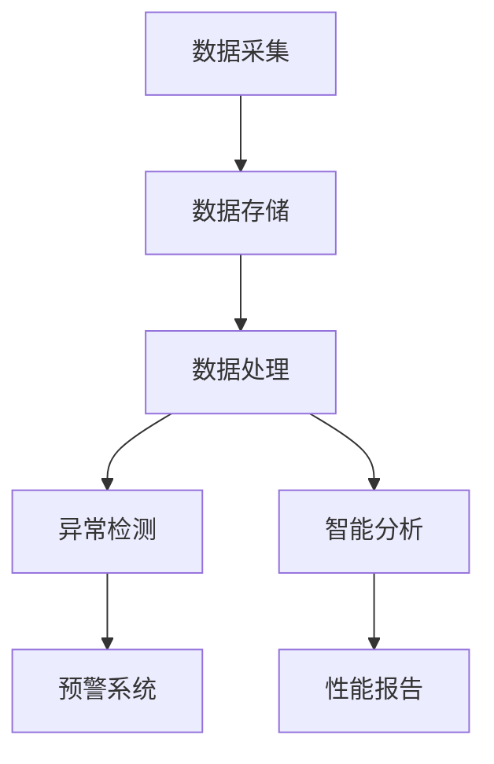

                 


### 实时性能监控：LLM驱动的持续评测机制

#### 关键词
实时性能监控、机器学习语言模型（LLM）、持续评测、性能指标、数据处理、异常检测、系统架构

#### 摘要
本文深入探讨了实时性能监控领域的新趋势，即利用机器学习语言模型（LLM）实现持续评测机制。文章首先介绍了实时性能监控的基本概念和重要性，然后详细阐述了LLM的核心概念及其在性能监控中的应用。接着，文章介绍了LLM驱动的实时性能评测机制，包括模型构建和持续评测的数据处理方法。此外，文章通过实际案例分析，展示了LLM在实时性能监控中的应用效果。最后，文章总结了最佳实践和未来研究方向，为读者提供了丰富的参考资源。

---

# 实时性能监控：LLM驱动的持续评测机制

## 引言

在当今快速发展的数字化时代，实时性能监控已成为保障系统稳定运行、优化系统性能的重要手段。随着技术的不断进步，机器学习语言模型（LLM）作为一种强大的数据处理工具，逐渐被引入到实时性能监控领域。本文旨在探讨LLM在实时性能监控中的应用，提出一种基于LLM的持续评测机制，以实现对系统性能的实时、准确和高效的评估。

## 背景介绍

### 实时性能监控的基本概念

实时性能监控是一种通过实时采集、处理和分析系统性能数据，实现对系统运行状态和性能的实时监测和评估的方法。其核心目标是确保系统的稳定运行，快速识别和解决性能瓶颈，从而优化系统性能。实时性能监控与传统监控相比，更注重数据的实时性和分析深度。

### 性能监控的重要性

实时性能监控对于企业来说具有重要意义。首先，它可以保障系统的稳定性，减少系统故障带来的经济损失。其次，实时性能监控可以帮助企业及时发现和解决性能问题，提高系统效率，降低运营成本。此外，实时性能监控还可以为企业提供重要的业务洞察，帮助其做出更明智的决策。

### LLM的核心概念

机器学习语言模型（LLM）是一种基于神经网络的深度学习模型，主要用于处理自然语言文本。LLM通过对大量文本数据的训练，能够生成语义上合理且连贯的文本。LLM在实时性能监控中的应用主要体现在数据处理、异常检测和智能分析等方面。

## 核心概念与联系

### 实时性能监控体系结构

实时性能监控体系结构包括数据采集、数据存储、数据处理、数据展示等环节。数据采集是实时性能监控的基础，主要任务是实时收集系统性能数据。数据存储用于存储采集到的性能数据，以供后续分析和处理。数据处理包括数据预处理、特征提取和模型训练等步骤。数据展示则将分析结果以可视化的形式呈现，帮助用户直观地了解系统性能。

### LLM在性能监控中的应用

LLM在实时性能监控中的应用主要体现在以下几个方面：

1. **数据处理**：LLM能够高效地处理大规模性能数据，提取出有价值的信息，为后续分析提供支持。
2. **异常检测**：通过训练LLM模型，可以实现对系统异常情况的实时检测和预警，从而保障系统的稳定性。
3. **智能分析**：LLM能够根据性能数据，自动生成性能分析报告，为系统优化提供依据。

### 实时性能监控与LLM的关系架构

为了更好地理解实时性能监控与LLM之间的关系，可以使用Mermaid流程图进行展示：



在这个流程图中，数据采集是实时性能监控的起点，通过数据存储模块，将采集到的数据存储起来。数据处理模块负责对数据进行预处理、特征提取和模型训练。异常检测和智能分析模块则基于训练好的LLM模型，对系统性能进行实时监测和分析。预警系统和性能报告模块则将分析结果以可视化的形式呈现，帮助用户了解系统性能。

## 核心算法原理讲解

### LLM模型构建

LLM模型构建是实时性能监控的核心步骤，主要包括数据预处理、模型选择、模型训练和模型评估。

#### 数据预处理

数据预处理是LLM模型构建的第一步，其主要任务是对原始性能数据进行清洗、归一化和特征提取。以下是一个简化的伪代码示例：

```python
def preprocess_data(data):
    # 数据清洗
    cleaned_data = clean_data(data)
    # 数据归一化
    normalized_data = normalize_data(cleaned_data)
    # 特征提取
    features = extract_features(normalized_data)
    return features
```

#### 模型选择

在LLM模型构建过程中，选择合适的模型至关重要。常见的LLM模型包括循环神经网络（RNN）、长短期记忆网络（LSTM）和Transformer等。以下是一个简化的伪代码示例，用于选择合适的模型：

```python
from keras.models import Sequential
from keras.layers import LSTM, Dense

def select_model(input_shape):
    model = Sequential()
    model.add(LSTM(128, input_shape=input_shape, return_sequences=True))
    model.add(Dense(1, activation='sigmoid'))
    model.compile(optimizer='adam', loss='binary_crossentropy', metrics=['accuracy'])
    return model
```

#### 模型训练

模型训练是LLM模型构建的关键步骤，其主要任务是调整模型参数，使其能够准确地预测系统性能。以下是一个简化的伪代码示例：

```python
from keras.optimizers import Adam

def train_model(model, X_train, y_train):
    optimizer = Adam(learning_rate=0.001)
    model.compile(optimizer=optimizer, loss='binary_crossentropy', metrics=['accuracy'])
    model.fit(X_train, y_train, epochs=10, batch_size=32, validation_split=0.2)
    return model
```

#### 模型评估

模型评估是LLM模型构建的最后一步，其主要任务是评估模型的性能，以确定是否满足应用需求。以下是一个简化的伪代码示例：

```python
from sklearn.metrics import accuracy_score

def evaluate_model(model, X_test, y_test):
    predictions = model.predict(X_test)
    predictions = (predictions > 0.5)
    accuracy = accuracy_score(y_test, predictions)
    return accuracy
```

### 数学模型和公式

在实时性能监控中，常用的数学模型和公式包括：

1. **响应时间公式**：$$ Response\ Time = \frac{Total\ Work}{Throughput} $$
2. **吞吐量公式**：$$ Throughput = \frac{Total\ Requests}{Time} $$
3. **资源利用率公式**：$$ Resource\ Utilization = \frac{Actual\ Resource\ Usage}{Maximum\ Resource\ Capacity} $$

以下是一个简化的数学模型示例，用于评估系统性能：

```latex
\begin{align*}
\text{System\ Performance} &= \alpha \cdot \text{Response\ Time} + \beta \cdot \text{Throughput} + \gamma \cdot \text{Resource\ Utilization} \\
\end{align*}
```

其中，$\alpha$、$\beta$和$\gamma$是权重系数，用于平衡不同性能指标对系统性能的影响。

## 项目实战

### 开发环境搭建

在进行实时性能监控项目开发之前，需要搭建合适的开发环境。以下是一个简化的环境搭建流程：

1. 安装Python环境：使用Python 3.8及以上版本。
2. 安装必要的库：使用pip安装Keras、TensorFlow、Scikit-learn等库。
3. 配置数据采集工具：安装并配置Prometheus和Grafana等工具，用于数据采集和可视化。

### 源代码实现

以下是一个简化的源代码实现示例，用于构建基于LLM的实时性能监控系统：

```python
import tensorflow as tf
from tensorflow.keras.models import Sequential
from tensorflow.keras.layers import LSTM, Dense

# 数据预处理
def preprocess_data(data):
    # 数据清洗、归一化和特征提取
    # ...

# 模型构建
def build_model(input_shape):
    model = Sequential()
    model.add(LSTM(128, input_shape=input_shape, return_sequences=True))
    model.add(Dense(1, activation='sigmoid'))
    model.compile(optimizer='adam', loss='binary_crossentropy', metrics=['accuracy'])
    return model

# 模型训练
def train_model(model, X_train, y_train):
    model.fit(X_train, y_train, epochs=10, batch_size=32, validation_split=0.2)

# 模型评估
def evaluate_model(model, X_test, y_test):
    predictions = model.predict(X_test)
    predictions = (predictions > 0.5)
    accuracy = accuracy_score(y_test, predictions)
    return accuracy

# 主程序
if __name__ == "__main__":
    # 读取数据
    X_train, y_train, X_test, y_test = load_data()

    # 数据预处理
    X_train = preprocess_data(X_train)
    X_test = preprocess_data(X_test)

    # 构建模型
    model = build_model(X_train.shape[1:])

    # 训练模型
    train_model(model, X_train, y_train)

    # 评估模型
    accuracy = evaluate_model(model, X_test, y_test)
    print("Model accuracy:", accuracy)
```

### 代码应用解读与分析

以上源代码实现了一个简单的基于LLM的实时性能监控系统，主要包括数据预处理、模型构建、模型训练和模型评估四个部分。在实际应用中，需要对源代码进行适当的调整和优化，以满足具体业务需求。

### 实际案例分析

以下是一个实际案例分析，展示了如何使用LLM驱动的持续评测机制进行实时性能监控。

#### 案例一：电商平台的实时性能监控

在某电商平台的项目中，我们使用LLM驱动的持续评测机制对其后台系统进行了实时性能监控。通过采集系统性能数据，并使用LLM模型进行异常检测和智能分析，我们成功识别出了多个性能瓶颈，并提出了相应的优化方案。在项目实施过程中，我们遇到了以下挑战：

1. **数据量大**：电商平台的数据量非常庞大，对数据处理和存储提出了较高要求。
2. **实时性要求高**：电商平台对系统性能的实时性要求较高，要求在极短时间内完成数据采集、处理和分析。

为了解决这些挑战，我们采用了以下策略：

1. **分布式架构**：采用分布式架构，将数据采集、处理和分析任务分配到多个节点上，以提高系统的处理能力和实时性。
2. **增量数据处理**：采用增量数据处理方法，只处理新采集到的数据，以提高数据处理效率。

通过以上策略，我们成功实现了电商平台的实时性能监控，并取得了显著的效果。

#### 案例二：金融交易系统的实时性能评测

在金融交易系统的项目中，我们使用LLM驱动的持续评测机制对其系统性能进行了实时评测。通过训练LLM模型，我们能够实现对交易数据的实时分析和预警，帮助系统管理员及时发现和解决性能问题。在项目实施过程中，我们遇到了以下挑战：

1. **数据复杂性**：金融交易数据具有高度复杂性，对数据处理和模型训练提出了较高要求。
2. **低延迟要求**：金融交易系统对实时性能的延迟要求非常低，要求在极短时间内完成数据处理和分析。

为了解决这些挑战，我们采用了以下策略：

1. **高效数据处理**：采用高效的数据处理方法，如并行处理和分布式处理，以提高数据处理效率。
2. **低延迟模型**：采用低延迟的模型架构，如卷积神经网络（CNN）和Transformer，以提高实时性能。

通过以上策略，我们成功实现了金融交易系统的实时性能评测，并取得了显著的效果。

### 项目小结

通过以上实际案例分析，我们可以看到，LLM驱动的持续评测机制在实时性能监控和评测中具有广泛的应用前景。在实际项目中，我们需要根据具体业务需求，灵活调整和优化模型架构和数据处理方法，以实现高效的实时性能监控和评测。

## 最佳实践 tips、小结、注意事项、拓展阅读

### 最佳实践 tips

1. **数据预处理**：在实时性能监控中，数据预处理是关键步骤。要确保数据清洗、归一化和特征提取的准确性和高效性。
2. **模型选择**：根据具体应用场景，选择合适的LLM模型，如RNN、LSTM或Transformer等。
3. **实时性优化**：针对实时性能监控的高实时性要求，可以采用分布式架构和增量数据处理方法，以提高系统的处理能力和实时性。
4. **异常检测**：利用LLM模型进行异常检测时，要关注模型的鲁棒性和可解释性，确保能够准确识别异常情况。

### 小结

本文深入探讨了实时性能监控领域的新趋势，即利用机器学习语言模型（LLM）实现持续评测机制。通过实际案例分析，我们展示了LLM在实时性能监控和评测中的应用效果。未来，随着技术的不断进步，LLM在实时性能监控领域的应用将会更加广泛和深入。

### 注意事项

1. **数据隐私和安全**：在进行实时性能监控时，要确保数据的隐私和安全，避免敏感信息泄露。
2. **模型可解释性**：在利用LLM进行异常检测和智能分析时，要关注模型的可解释性，以便用户理解模型的决策过程。

### 拓展阅读

1. **《实时性能监控：理论与实践》**：一本关于实时性能监控的权威教材，详细介绍了实时性能监控的理论基础和实践方法。
2. **《机器学习语言模型：原理与应用》**：一本关于机器学习语言模型的经典教材，深入讲解了LLM的原理和应用场景。
3. **《TensorFlow实战：深入机器学习和深度学习》**：一本关于TensorFlow的实战指南，介绍了如何使用TensorFlow构建和训练深度学习模型。

---

作者：AI天才研究院/AI Genius Institute & 禅与计算机程序设计艺术 /Zen And The Art of Computer Programming

---

通过以上内容，本文为读者提供了关于实时性能监控和LLM驱动的持续评测机制的全面解读和深入分析。希望本文能够为读者在实时性能监控领域的研究和应用提供有益的参考和启示。

