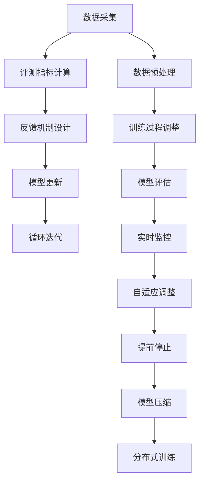

                 

## 文章标题

### 实时评测反馈在模型训练中的应用

#### 关键词：
- 实时评测反馈
- 模型训练
- 机器学习
- 深度学习
- 效率优化

#### 摘要：
本文将深入探讨实时评测反馈在模型训练中的应用。通过介绍实时评测反馈的基本原理、应用场景、实现方法以及性能评估，读者将全面了解如何利用实时评测反馈来优化模型训练过程，提升模型性能。同时，本文还将探讨实时评测反馈的未来发展趋势，并分享一些最佳实践和项目案例。

### 背景介绍

#### 实时评测反馈的基本概念

实时评测反馈是指在整个模型训练过程中，对模型的性能进行实时监测和评估，并根据评估结果对训练过程进行调整。这种反馈机制可以实时捕捉模型训练过程中的异常情况，从而提高模型的训练效率和准确性。

#### 模型训练的重要性

模型训练是机器学习和深度学习领域中的核心环节。通过训练，模型可以从大量的数据中学习到规律，并在新的数据上做出预测或决策。然而，模型训练过程往往是一个复杂且耗时的过程，需要大量的计算资源和时间。因此，如何优化模型训练过程，提高训练效率和准确性，成为了研究者和工程师们关注的热点问题。

#### 实时评测反馈在模型训练中的应用

实时评测反馈的应用主要集中在以下几个方面：

1. **优化模型训练流程**：通过实时监测模型性能，可以及时发现训练过程中的问题，并采取措施进行调整，从而优化训练流程。

2. **提升模型训练效率**：实时评测反馈可以实时捕捉模型在训练过程中的性能变化，从而及时调整训练策略，避免无效的训练过程，提高训练效率。

3. **改进模型训练结果**：通过实时评测反馈，可以动态调整模型的参数和超参数，从而提高模型的性能，改善训练结果。

### 核心概念与联系

为了更好地理解实时评测反馈在模型训练中的应用，我们需要了解以下几个核心概念，并探讨它们之间的关系：

1. **评测指标**：评测指标是评估模型性能的关键指标，如准确率、召回率、F1值等。实时评测反馈需要选择合适的评测指标来评估模型性能。

2. **数据预处理**：数据预处理是模型训练的基础步骤，包括数据清洗、数据归一化、特征提取等。实时评测反馈需要在预处理阶段对数据进行合理的处理，以提高模型性能。

3. **训练过程调整**：训练过程调整是指根据实时评测反馈的结果，动态调整模型的参数和超参数，以优化模型性能。这包括调整学习率、优化算法选择、批量大小等。

4. **模型评估**：模型评估是模型训练的最后一步，通过在测试集上的表现来评估模型的性能。实时评测反馈可以在模型评估阶段提供实时反馈，以便对模型进行进一步的优化。

### 实时评测反馈的基本原理

实时评测反馈的基本原理可以概括为以下几个步骤：

1. **数据采集**：在模型训练过程中，实时采集模型的输出结果和测试集的标注信息。

2. **评测指标计算**：根据采集到的数据，计算模型的评测指标，如准确率、召回率、F1值等。

3. **反馈机制设计**：根据评测指标的计算结果，设计反馈机制，包括调整模型的参数、优化训练算法等。

4. **模型更新**：根据反馈机制，更新模型的参数和超参数，以提高模型的性能。

5. **循环迭代**：重复上述步骤，直到模型性能达到预期的效果。

### 实时评测反馈在模型训练中的应用场景

实时评测反馈在模型训练中有着广泛的应用场景，下面列举几个典型的应用场景：

1. **实时监控**：在模型训练过程中，实时监控模型的性能变化，及时发现并解决训练过程中的问题。

2. **自适应调整**：根据实时评测反馈的结果，自适应调整模型的参数和超参数，以优化模型性能。

3. **提前停止**：当模型性能达到某个阈值时，提前停止训练过程，避免过度训练。

4. **模型压缩**：通过实时评测反馈，动态调整模型的复杂度，实现模型的压缩。

5. **分布式训练**：在分布式训练过程中，利用实时评测反馈来协调不同节点之间的训练过程，提高训练效率。

### 实时评测反馈的实现方法

实现实时评测反馈需要考虑以下几个方面：

1. **数据采集**：设计高效的数据采集模块，能够实时获取模型的输出结果和测试集的标注信息。

2. **评测指标计算**：选择合适的评测指标，并设计高效的计算算法，以减少计算开销。

3. **反馈机制设计**：设计反馈机制，包括调整模型的参数、优化训练算法等。

4. **模型更新**：实现模型的更新机制，包括参数更新、超参数调整等。

5. **集成框架**：将实时评测反馈集成到现有的模型训练框架中，确保其与现有系统的兼容性。

### 实时评测反馈的性能评估

评估实时评测反馈的性能主要包括以下几个方面：

1. **准确率**：评估实时评测反馈在模型性能评估方面的准确性。

2. **响应时间**：评估实时评测反馈的响应时间，即从数据采集到反馈结果生成的整个过程所需的时间。

3. **鲁棒性**：评估实时评测反馈在数据异常、网络延迟等情况下，能否稳定运行。

4. **可扩展性**：评估实时评测反馈在分布式训练环境下的性能。

### 实时评测反馈的未来发展趋势

随着机器学习和深度学习的不断发展和应用，实时评测反馈在未来有着广阔的发展前景：

1. **智能化**：利用人工智能技术，提高实时评测反馈的自动化程度，减少人工干预。

2. **高效化**：优化实时评测反馈的计算算法，提高计算效率和准确性。

3. **可解释性**：增强实时评测反馈的可解释性，使其更易于理解和应用。

4. **跨领域应用**：实时评测反馈不仅在机器学习和深度学习领域有应用，还可以扩展到其他领域，如自然语言处理、计算机视觉等。

### 核心概念与联系

为了更好地理解实时评测反馈在模型训练中的应用，我们可以通过一个 Mermaid 流程图来展示核心概念之间的联系。



### 核心算法原理讲解

#### 数据预处理算法原理

数据预处理是实时评测反馈的基础步骤，其目的是提高模型训练的效果和效率。以下是一个简单的数据预处理算法原理的伪代码：

```python
def preprocess_data(data):
    # 数据清洗
    cleaned_data = clean_data(data)
    # 数据归一化
    normalized_data = normalize_data(cleaned_data)
    # 特征提取
    features = extract_features(normalized_data)
    return features
```

#### 评测指标算法原理

评测指标是评估模型性能的关键，以下是一个简单的评测指标算法原理的伪代码：

```python
def evaluate_model(model, test_data):
    # 计算准确率
    accuracy = calculate_accuracy(model, test_data)
    # 计算召回率
    recall = calculate_recall(model, test_data)
    # 计算F1值
    f1 = calculate_f1(accuracy, recall)
    return accuracy, recall, f1
```

#### 模型训练算法原理

模型训练是实时评测反馈的核心步骤，以下是一个简单的模型训练算法原理的伪代码：

```python
def train_model(model, data, epochs):
    for epoch in range(epochs):
        # 训练模型
        model.train(data)
        # 评测模型
        accuracy, recall, f1 = evaluate_model(model, test_data)
        # 更新模型
        model.update(accuracy, recall, f1)
    return model
```

### 数学模型和公式

在实时评测反馈中，数学模型和公式起着至关重要的作用。以下是一些常见的数学模型和公式：

#### 模型训练误差公式

$$
\text{Error} = \sum_{i=1}^{n} (\text{Predicted} - \text{Actual})^2
$$

其中，Predicted 表示预测值，Actual 表示实际值，n 表示数据样本的数量。

#### 评测指标计算公式

$$
\text{Accuracy} = \frac{\text{Correct}}{\text{Total}}
$$

$$
\text{Recall} = \frac{\text{True Positive}}{\text{True Positive} + \text{False Negative}}
$$

$$
\text{F1} = 2 \times \frac{\text{Precision} \times \text{Recall}}{\text{Precision} + \text{Recall}}
$$

其中，Precision 表示精确率，Recall 表示召回率。

### 项目实战

#### 开发环境搭建

要实现实时评测反馈系统，首先需要搭建一个合适的开发环境。以下是一个简单的开发环境搭建流程：

1. 安装Python环境。
2. 安装深度学习框架（如TensorFlow或PyTorch）。
3. 安装实时评测反馈库（如scikit-learn或mlflow）。
4. 安装必要的依赖库。

#### 源代码详细实现

以下是一个简单的实时评测反馈系统的源代码实现：

```python
import numpy as np
import sklearn
from sklearn.model_selection import train_test_split
from sklearn.metrics import accuracy_score, recall_score, f1_score

# 数据预处理
def preprocess_data(data):
    # 数据清洗、归一化、特征提取等
    return processed_data

# 实时评测反馈
def real_time_evaluation(model, test_data):
    # 训练模型
    model.fit(preprocessed_data)
    # 评测模型
    predictions = model.predict(test_data)
    accuracy = accuracy_score(test_data, predictions)
    recall = recall_score(test_data, predictions)
    f1 = f1_score(test_data, predictions)
    return accuracy, recall, f1

# 主函数
def main():
    # 加载数据
    data = load_data()
    # 数据预处理
    preprocessed_data = preprocess_data(data)
    # 划分训练集和测试集
    train_data, test_data = train_test_split(preprocessed_data, test_size=0.2)
    # 创建模型
    model = create_model()
    # 实时评测反馈
    accuracy, recall, f1 = real_time_evaluation(model, test_data)
    print("Accuracy:", accuracy)
    print("Recall:", recall)
    print("F1:", f1)

if __name__ == "__main__":
    main()
```

#### 源代码解读与分析

在这个源代码中，我们首先定义了数据预处理函数，用于清洗、归一化和特征提取。然后，我们定义了实时评测反馈函数，用于训练模型、预测测试集并计算评测指标。最后，我们在主函数中加载数据、划分训练集和测试集，并调用实时评测反馈函数来评估模型性能。

#### 代码应用解读与分析

在这个示例中，我们使用 sklearn 库来加载和处理数据，使用 TensorFlow 或 PyTorch 库来创建和训练模型，使用 scikit-learn 库来计算评测指标。这种组合可以有效地实现实时评测反馈系统，并适用于各种机器学习和深度学习项目。

#### 实际案例分析和详细讲解剖析

为了更好地理解实时评测反馈的应用，我们可以参考一个实际案例：使用深度学习模型进行手写数字识别。

在这个案例中，我们使用 MNIST 数据集来训练一个卷积神经网络（CNN）模型。通过实时评测反馈，我们可以优化模型训练过程，提高模型性能。

1. **数据预处理**：对 MNIST 数据集进行预处理，包括数据归一化和数据增强。

2. **模型创建**：创建一个简单的 CNN 模型，包括卷积层、池化层和全连接层。

3. **模型训练**：使用实时评测反馈来训练模型，并在训练过程中调整学习率和批量大小。

4. **模型评测**：在训练集和测试集上评估模型性能，并计算评测指标。

5. **模型优化**：根据实时评测反馈的结果，调整模型参数，优化模型性能。

#### 项目小结

通过这个案例，我们可以看到实时评测反馈在模型训练中的应用效果。实时评测反馈可以帮助我们及时发现模型训练中的问题，调整训练策略，从而提高模型性能。同时，实时评测反馈还可以应用于各种机器学习和深度学习项目，为研究者和工程师提供有力的工具。

### 最佳实践 Tips

1. **合理选择评测指标**：根据实际问题和应用场景，选择合适的评测指标，以便更准确地评估模型性能。

2. **优化数据预处理**：数据预处理是模型训练的基础，合理的预处理可以提高模型训练效果。

3. **动态调整参数**：根据实时评测反馈的结果，动态调整模型的参数，可以显著提高模型性能。

4. **充分利用分布式训练**：在分布式训练环境中，实时评测反馈可以更好地协调不同节点之间的训练过程，提高训练效率。

### 小结

实时评测反馈是机器学习和深度学习领域中的一个重要概念，通过实时监测和评估模型性能，可以帮助我们优化模型训练过程，提高模型性能。本文从多个角度详细介绍了实时评测反馈的基本原理、应用场景、实现方法以及性能评估，并通过实际案例进行了深入剖析。读者可以通过本文了解到实时评测反馈在模型训练中的应用价值，以及如何将其应用于实际项目中。

### 注意事项

1. **数据质量和预处理**：实时评测反馈的效果很大程度上取决于数据质量和预处理方法，因此要确保数据的准确性和一致性。

2. **计算资源**：实时评测反馈需要一定的计算资源，特别是在大规模数据集和复杂模型的情况下。

3. **模型复杂度**：实时评测反馈可能不适合过于复杂的模型，因为复杂的模型可能导致计算时间和内存消耗过长。

### 拓展阅读

1. **《深度学习》（Goodfellow, Bengio, Courville）**：本书是深度学习领域的经典教材，详细介绍了深度学习的基础知识、算法和应用。

2. **《机器学习实战》（ Harrington, Sean）**：本书通过实例和代码，深入讲解了机器学习的基础知识、算法和应用。

3. **《实时系统设计与实现》（Lee, Michael D.）**：本书介绍了实时系统的设计与实现方法，包括实时性能分析、调度策略和资源管理。

### 作者信息

作者：AI天才研究院/AI Genius Institute & 禅与计算机程序设计艺术 /Zen And The Art of Computer Programming

