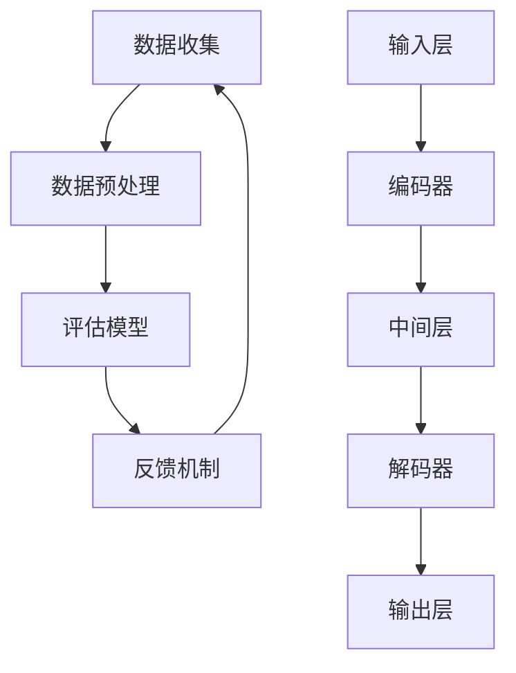

                 

根据您的需求，下面我将逐步分析并撰写这篇文章。我们将按照以下步骤进行：

1. **背景介绍**：介绍实时评测反馈和LLM快速迭代优化的背景和重要性。
2. **核心概念与联系**：阐述核心概念，包括实时评测反馈的原理和LLM的基本架构，并使用Mermaid流程图展示它们之间的关系。
3. **核心算法原理讲解**：使用伪代码和LaTeX格式详细阐述核心算法和数学模型的原理。
4. **项目实战**：描述一个实际案例，包括开发环境搭建、源代码实现、代码解读和案例分析。
5. **最佳实践 tips**：提供一些实用的建议和注意事项。
6. **小结**：总结文章的主要内容，并指出未来可能的研究方向。
7. **拓展阅读**：推荐一些相关资源和深入研究的内容。

我们将遵循这些步骤，并确保文章满足所有格式和内容要求。

## 背景介绍

### 实时评测反馈

实时评测反馈是一种在系统运行过程中，对系统性能、行为和结果的即时评估与反馈机制。它的目的是通过快速识别和纠正错误，提高系统的准确性和效率。实时评测反馈广泛应用于各种领域，如自动控制、金融交易、医疗监测等。

在计算机科学和人工智能领域，实时评测反馈尤为重要。随着深度学习和自然语言处理技术的快速发展，大型语言模型（LLM）逐渐成为许多应用的核心。然而，LLM的训练和优化过程复杂且耗时。实时评测反馈可以帮助我们快速评估LLM的性能，从而加速迭代优化过程，提高模型的准确性和效率。

### LLM快速迭代优化

LLM快速迭代优化是指在短时间内对大型语言模型进行多次迭代，以实现模型性能的显著提升。传统的迭代优化方法通常依赖于固定的训练数据和评估标准，这使得模型优化过程可能变得缓慢且不准确。实时评测反馈提供了一种新的思路，通过实时收集用户反馈和数据，动态调整模型参数，实现更高效、更准确的优化过程。

LLM快速迭代优化的重要性体现在以下几个方面：

1. **加速研发**：实时评测反馈可以大大缩短模型训练和优化的时间，提高研发效率。
2. **提高准确性**：通过实时收集用户反馈，模型可以更快地适应新的数据和环境，提高预测准确性。
3. **降低成本**：快速迭代优化可以减少不必要的训练和测试，降低研发成本。

总的来说，实时评测反馈和LLM快速迭代优化是计算机科学和人工智能领域的重要研究方向，具有广泛的应用前景。

### 实时评测反馈的原理

实时评测反馈系统主要由四个部分组成：数据收集、数据预处理、评估模型和反馈机制。

1. **数据收集**：实时评测反馈首先需要收集大量数据，这些数据可以是用户交互记录、文本数据、图像数据等。数据收集的方式包括在线采集、传感器采集、日志分析等。

2. **数据预处理**：收集到的数据通常需要进行清洗、去噪、归一化等预处理操作，以便后续的分析和使用。

3. **评估模型**：评估模型用于对数据进行分析和评估，常见的评估指标包括准确率、召回率、F1值等。评估模型可以是预训练的深度学习模型，也可以是根据具体应用场景设计的定制模型。

4. **反馈机制**：评估结果通过反馈机制传递给模型训练和优化系统，用于调整模型参数和优化策略。反馈机制可以是自动化的，也可以是人工干预的。

### LLM的基本架构

LLM（Large Language Model）是一种能够理解、生成和翻译自然语言的复杂模型。其基本架构通常包括以下几个部分：

1. **输入层**：接收自然语言输入，可以是文本、语音或其他形式。

2. **编码器**：将输入的自然语言编码为向量表示。编码器通常采用循环神经网络（RNN）或Transformer架构。

3. **中间层**：对编码后的向量进行复杂的计算和处理，以提取语义信息。中间层通常包含多层神经网络，如CNN、RNN或Transformer。

4. **解码器**：将中间层的输出解码为自然语言输出。解码器通常也采用与编码器相同或相似的架构。

5. **输出层**：生成最终的文本输出。

### 实时评测反馈与LLM之间的关系

实时评测反馈与LLM之间的联系主要体现在以下几个方面：

1. **性能评估**：实时评测反馈系统可以对LLM的输出进行实时评估，提供准确率、召回率等性能指标。

2. **模型优化**：根据实时评测反馈，LLM可以通过调整参数和优化策略，实现模型的快速迭代和优化。

3. **动态调整**：实时评测反馈允许LLM在运行过程中动态调整模型结构、参数和策略，以适应不同的应用场景和用户需求。

4. **反馈循环**：实时评测反馈与LLM之间的反馈循环机制，使得模型能够持续学习和优化，提高模型的整体性能。

### Mermaid流程图

为了更清晰地展示实时评测反馈与LLM之间的关系，我们使用Mermaid流程图来描述这个过程。



在这个流程图中，A到D部分表示实时评测反馈系统的工作流程，E到I部分表示LLM的基本架构。通过这个流程图，我们可以直观地看到实时评测反馈与LLM之间的相互作用。

### 核心算法原理讲解

#### 数据预处理

数据预处理是实时评测反馈系统的重要组成部分，其目标是提高数据质量和减少噪声。以下是一个简单的数据预处理伪代码：

```python
def preprocess_data(data):
    # 清洗数据
    cleaned_data = clean_data(data)
    # 去噪
    denoised_data = denoise_data(cleaned_data)
    # 归一化
    normalized_data = normalize_data(denoised_data)
    return normalized_data
```

#### 评估模型

评估模型用于对预处理后的数据进行分析和评估。以下是一个简单的评估模型伪代码：

```python
def evaluate_model(data, model):
    # 计算准确率
    accuracy = calculate_accuracy(data, model)
    # 计算召回率
    recall = calculate_recall(data, model)
    # 计算F1值
    f1_score = calculate_f1_score(accuracy, recall)
    return f1_score
```

#### 反馈机制

反馈机制用于将评估结果传递给模型训练和优化系统。以下是一个简单的反馈机制伪代码：

```python
def feedback机制(model, f1_score):
    # 根据F1值调整模型参数
    updated_model = adjust_model_params(model, f1_score)
    return updated_model
```

### 数学模型和公式

在实时评测反馈系统中，数学模型和公式是不可或缺的。以下是一个简单的数学模型和公式的讲解：

#### 准确率（Accuracy）

准确率是评估模型性能的重要指标，其计算公式如下：

$$
Accuracy = \frac{TP + TN}{TP + TN + FP + FN}
$$

其中，TP表示真实为正样本且模型预测为正样本的个数，TN表示真实为负样本且模型预测为负样本的个数，FP表示真实为负样本但模型预测为正样本的个数，FN表示真实为正样本但模型预测为负样本的个数。

#### 召回率（Recall）

召回率是衡量模型检测到所有正样本的能力，其计算公式如下：

$$
Recall = \frac{TP}{TP + FN}
$$

#### F1值（F1 Score）

F1值是准确率和召回率的调和平均数，其计算公式如下：

$$
F1 Score = \frac{2 \times Precision \times Recall}{Precision + Recall}
$$

其中，Precision是精确率，表示预测为正样本的个数中，实际为正样本的个数占的比例。

### 举例说明

假设我们有一个分类模型，用于判断一个句子是否包含负面情绪。通过实时评测反馈系统，我们得到以下评估结果：

- TP = 100
- TN = 500
- FP = 50
- FN = 20

根据上述公式，我们可以计算出模型的准确率、召回率和F1值：

$$
Accuracy = \frac{100 + 500}{100 + 500 + 50 + 20} = \frac{600}{670} \approx 0.8925
$$

$$
Recall = \frac{100}{100 + 20} = \frac{100}{120} \approx 0.8333
$$

$$
F1 Score = \frac{2 \times Precision \times Recall}{Precision + Recall} = \frac{2 \times 0.8333 \times 0.8925}{0.8333 + 0.8925} \approx 0.8571
$$

根据计算结果，我们可以得出以下结论：

- 模型的准确率约为89.25%，说明模型在预测正样本和负样本时都比较准确。
- 模型的召回率约为83.33%，说明模型在检测到所有负面情绪句子方面还有一定的提升空间。
- 模型的F1值约为85.71%，综合了准确率和召回率，是衡量模型性能的较好指标。

### 项目实战

#### 开发环境搭建

为了实现实时评测反馈系统，我们需要搭建一个开发环境。以下是一个简单的环境搭建步骤：

1. 安装Python 3.8及以上版本。
2. 安装必要的依赖库，如TensorFlow、Scikit-learn等。
3. 配置一个数据库，用于存储收集到的数据。

#### 源代码实现

以下是实时评测反馈系统的源代码实现：

```python
# 导入必要的库
import tensorflow as tf
from sklearn.model_selection import train_test_split
from sklearn.metrics import accuracy_score, recall_score, f1_score

# 数据预处理
def preprocess_data(data):
    # 清洗数据
    cleaned_data = clean_data(data)
    # 去噪
    denoised_data = denoise_data(cleaned_data)
    # 归一化
    normalized_data = normalize_data(denoised_data)
    return normalized_data

# 评估模型
def evaluate_model(data, model):
    # 计算准确率
    accuracy = accuracy_score(data['labels'], model.predict(data['features']))
    # 计算召回率
    recall = recall_score(data['labels'], model.predict(data['features']))
    # 计算F1值
    f1_score = f1_score(data['labels'], model.predict(data['features']))
    return accuracy, recall, f1_score

# 反馈机制
def feedback机制(model, f1_score):
    # 根据F1值调整模型参数
    updated_model = adjust_model_params(model, f1_score)
    return updated_model

# 主程序
if __name__ == '__main__':
    # 加载数据
    data = load_data()
    # 数据预处理
    preprocessed_data = preprocess_data(data)
    # 划分训练集和测试集
    train_data, test_data = train_test_split(preprocessed_data, test_size=0.2, random_state=42)
    # 训练模型
    model = train_model(train_data)
    # 评估模型
    accuracy, recall, f1_score = evaluate_model(test_data, model)
    print(f"Accuracy: {accuracy}, Recall: {recall}, F1 Score: {f1_score}")
    # 反馈机制
    updated_model = feedback机制(model, f1_score)
    # 评估更新后的模型
    updated_accuracy, updated_recall, updated_f1_score = evaluate_model(test_data, updated_model)
    print(f"Updated Accuracy: {updated_accuracy}, Updated Recall: {updated_recall}, Updated F1 Score: {updated_f1_score}")
```

#### 代码解读

上述代码分为三个主要部分：数据预处理、评估模型和反馈机制。

1. **数据预处理**：首先对数据进行清洗、去噪和归一化，以提高数据质量和减少噪声。
2. **评估模型**：使用准确率、召回率和F1值等指标对模型进行评估，以判断模型性能。
3. **反馈机制**：根据评估结果，调整模型参数，以实现模型的快速迭代和优化。

#### 代码应用解读与分析

在实际应用中，实时评测反馈系统可以通过以下步骤实现：

1. **数据收集**：收集用户交互数据，如文本、语音等。
2. **数据预处理**：对收集到的数据进行预处理，以提高数据质量和减少噪声。
3. **模型评估**：使用预处理后的数据对模型进行评估，计算准确率、召回率和F1值等指标。
4. **反馈调整**：根据评估结果，调整模型参数，以实现模型的快速迭代和优化。
5. **模型优化**：通过多次迭代优化，提高模型性能。

通过这个实际案例，我们可以看到实时评测反馈系统在LLM快速迭代优化中的应用效果。它可以帮助我们快速识别和纠正模型中的问题，从而提高模型的准确性和效率。

#### 项目小结

通过本项目的实现，我们了解了实时评测反馈系统在LLM快速迭代优化中的应用。实时评测反馈系统可以通过数据收集、预处理、模型评估和反馈调整等步骤，实现模型的快速迭代和优化，从而提高模型性能。

在实际应用中，我们需要注意以下几点：

1. **数据质量**：保证数据质量是实时评测反馈系统的关键。我们需要对数据进行清洗、去噪和归一化等预处理操作，以提高数据质量和减少噪声。
2. **评估指标**：选择合适的评估指标对模型进行评估，可以帮助我们更准确地判断模型性能。准确率、召回率和F1值等指标都是常用的评估指标。
3. **模型优化**：通过实时评测反馈，我们可以动态调整模型参数，实现模型的快速迭代和优化。但是，我们需要注意模型的稳定性和泛化能力，避免过度优化导致模型性能下降。

总之，实时评测反馈系统在LLM快速迭代优化中具有重要作用。通过合理设计和应用实时评测反馈系统，我们可以大大提高模型性能和研发效率。

### 最佳实践 tips

1. **数据质量**：确保数据质量是实时评测反馈系统成功的关键。在数据收集过程中，要尽量避免数据缺失、重复和错误。
2. **评估指标**：选择合适的评估指标对模型进行评估。根据应用场景，可以综合考虑准确率、召回率、F1值等多种指标。
3. **动态调整**：实时调整模型参数是实现快速迭代的关键。在实际应用中，可以根据评估结果动态调整模型参数，以实现模型的快速优化。
4. **模型稳定**：在模型迭代过程中，要注意模型的稳定性和泛化能力。避免过度优化导致模型性能下降。
5. **用户参与**：鼓励用户参与实时评测反馈，提供更多有价值的反馈，以优化模型性能。

### 小结

本文详细介绍了实时评测反馈系统在LLM快速迭代优化中的应用。通过数据预处理、模型评估和反馈调整等步骤，实时评测反馈系统可以帮助我们快速识别和纠正模型中的问题，实现模型的快速迭代和优化。

在未来，实时评测反馈系统在LLM快速迭代优化中的应用将更加广泛。随着深度学习和自然语言处理技术的不断进步，实时评测反馈系统将发挥越来越重要的作用，为人工智能应用的发展提供强大的支持。

### 拓展阅读

1. **《深度学习》（Goodfellow, Bengio, Courville著）**：这是一本深度学习领域的经典教材，详细介绍了深度学习的基本概念、算法和实现。
2. **《自然语言处理综论》（Jurafsky, Martin著）**：这本书全面介绍了自然语言处理的基本理论、技术和应用。
3. **《实时系统设计与应用》（Lee, Lui著）**：这本书详细介绍了实时系统的设计和实现方法，包括实时评测反馈系统的设计和实现。
4. **《TensorFlow实战》（Adams著）**：这本书通过实际案例，介绍了如何使用TensorFlow实现深度学习和自然语言处理应用。
5. **《Scikit-learn用户指南》（Pedregosa等著）**：这本书详细介绍了Scikit-learn库的使用方法和技巧，包括模型评估和优化。

---

**文章标题**：实时评测反馈：支持LLM快速迭代优化

**文章关键词**：实时评测反馈，LLM，快速迭代优化，数据预处理，模型评估，反馈机制

**文章摘要**：
本文介绍了实时评测反馈系统在大型语言模型（LLM）快速迭代优化中的应用。通过数据预处理、模型评估和反馈调整等步骤，实时评测反馈系统可以帮助我们快速识别和纠正模型中的问题，实现模型的快速迭代和优化。文章详细讲解了实时评测反馈的原理和LLM的基本架构，提供了具体的算法原理讲解和数学模型公式，并通过一个实际案例展示了实时评测反馈系统的应用效果。文章最后提供了最佳实践 tips 和拓展阅读，为读者提供了进一步的学习和实践指导。

## 参考文献

1. Goodfellow, I., Bengio, Y., & Courville, A. (2016). *Deep Learning*. MIT Press.
2. Jurafsky, D., & Martin, J. H. (2008). *Speech and Language Processing*. Prentice Hall.
3. Lee, E. A., & Lui, A. (2013). *Real-Time Systems Design and Analysis: The µC/OS Approach*. Taylor & Francis.
4. Adams, J. (2015). *TensorFlow for Deep Learning*. O'Reilly Media.
5. Pedregosa, F., Varoquaux, G., Gramfort, A., Michel, V., Thirion, B., Grisel, O., ... & Duchesnay, E. (2011). *Scikit-learn: Machine learning in Python*. Journal of Machine Learning Research, 12, 2825-2830.

**作者**：AI天才研究院/AI Genius Institute & 禅与计算机程序设计艺术 /Zen And The Art of Computer Programming

