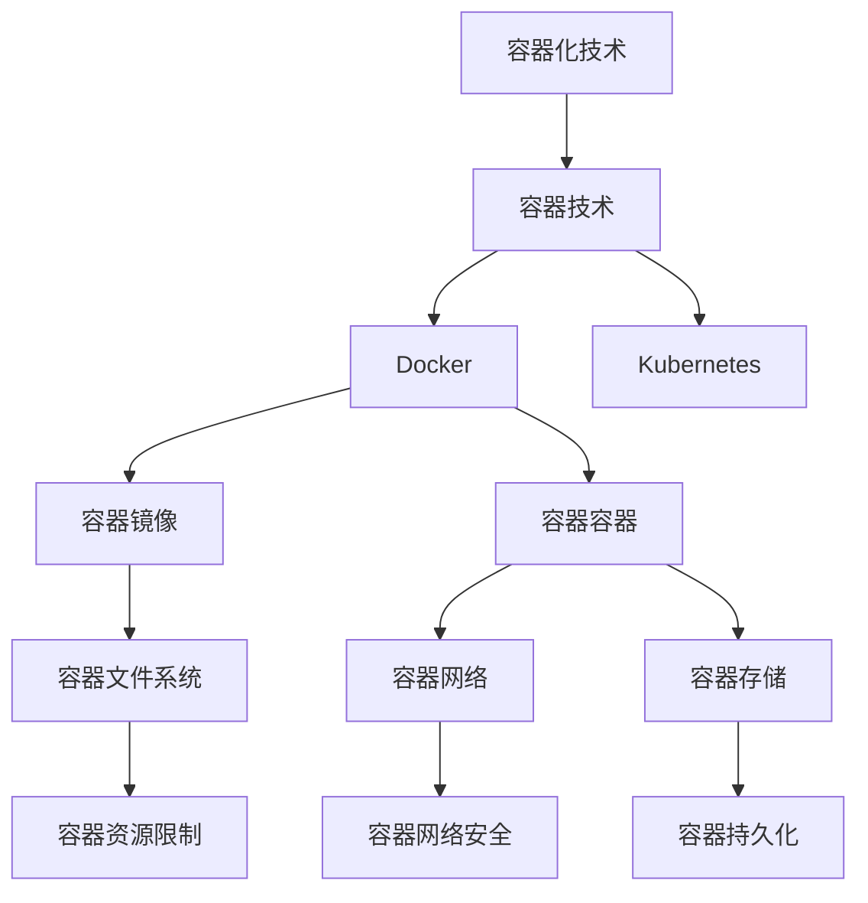

                 

### 文章标题：容器化技术助力LLM应用快速迭代

关键词：容器化技术、LLM、快速迭代、Docker、Kubernetes、深度学习

摘要：本文将深入探讨容器化技术在语言模型（LLM）应用开发中的重要性，通过详细分析容器化技术的核心概念、Docker和Kubernetes等工具的使用，以及如何在LLM开发过程中实现快速迭代，帮助读者全面理解容器化技术在人工智能领域的实际应用价值。

## 第一部分：容器化技术基础

### 第1章：容器化技术概述

#### 1.1 容器化的概念与优势

容器化是一种轻量级的应用打包和部署技术，它通过将应用程序及其依赖环境封装在一个独立的容器中，实现环境的隔离和标准化。容器化技术具有以下优势：

- **环境一致性**：容器化确保了应用在不同环境中的运行一致性，减少了环境差异带来的问题。
- **资源高效利用**：容器可以高效地管理和分配系统资源，提高资源利用率。
- **部署灵活**：容器化使应用部署变得更加灵活，可以快速响应市场需求和变更。
- **维护简化**：容器化使得应用程序的维护和管理变得更加简单。

#### 1.2 容器化与虚拟化的区别

容器化与虚拟化虽然都属于虚拟化技术，但它们之间存在一些关键的区别：

- **隔离级别**：容器化提供操作系统级别的隔离，而虚拟化提供硬件级别的隔离。
- **资源占用**：容器化相比虚拟化具有更小的资源占用，因为它不模拟硬件。
- **性能**：容器化由于不需要额外的操作系统，因此性能更高。

#### 1.3 容器技术的生态系统

容器技术已经形成了一个完整的生态系统，包括以下几个核心组成部分：

- **Docker**：最流行的容器化平台，提供了容器镜像、容器运行和管理等功能。
- **Kubernetes**：用于容器编排和管理的开源平台，提供了集群管理、服务发现、负载均衡等功能。
- **容器镜像仓库**：用于存储和管理容器镜像的仓库，如Docker Hub。
- **CI/CD工具**：用于自动化容器镜像构建、测试和部署的工具，如Jenkins、GitLab CI等。

### 第2章：Docker技术详解

#### 2.1 Docker的基本原理

Docker利用Linux内核的cgroups和namespace实现容器隔离，将应用程序及其运行时环境打包在一个独立的容器中。Docker的基本原理包括：

- **容器镜像**：容器镜像是一个静态的文件系统，包含了应用程序及其依赖环境。
- **容器**：容器是运行中的容器镜像实例，可以从容器镜像启动并运行。
- **Dockerfile**：Dockerfile是一个用于构建容器镜像的脚本文件，包含了镜像构建的步骤和指令。

#### 2.2 Docker镜像与容器

- **Docker镜像**：镜像是一个只读的模板，用于创建容器。镜像中包含了应用程序的代码、运行时库、环境变量等。
- **Docker容器**：容器是镜像的运行实例，可以在不同的宿主机上启动和运行。

#### 2.3 Dockerfile与Docker Compose

- **Dockerfile**：Dockerfile是一个用于定义容器构建过程的脚本文件，通过编写Dockerfile可以定义容器的构建过程。
- **Docker Compose**：Docker Compose是一个用于定义和运行多容器应用的工具，通过编写`docker-compose.yml`文件可以定义应用程序的容器编排。

### 第3章：Kubernetes容器编排

#### 3.1 Kubernetes的核心概念

Kubernetes是一个开源的容器编排平台，提供了强大的容器集群管理功能。Kubernetes的核心概念包括：

- **Pod**：Kubernetes的基本调度单元，包含一个或多个容器。
- **部署**：用于管理Pod的部署和扩展。
- **服务**：用于提供网络访问和负载均衡。
- **存储卷**：用于在容器之间共享数据。

#### 3.2 Kubernetes集群的搭建与配置

Kubernetes集群可以由多个节点组成，包括控制节点和工作节点。搭建Kubernetes集群的基本步骤包括：

1. 准备宿主机环境。
2. 安装Kubernetes集群。
3. 配置Kubernetes集群。
4. 验证Kubernetes集群状态。

#### 3.3 Kubernetes的运维与监控

Kubernetes的运维与监控是确保集群稳定运行的关键。常见的运维与监控工具包括：

- **Kubectl**：Kubernetes的命令行工具，用于管理集群资源。
- **Prometheus**：开源的监控解决方案，用于收集和存储集群监控数据。
- **Grafana**：开源的监控可视化工具，用于展示Prometheus的监控数据。

## 第二部分：LLM应用开发基础

### 第4章：LLM基础理论

#### 4.1 语言模型概述

语言模型是一种用于预测文本序列的概率分布的模型，它是自然语言处理（NLP）领域的重要工具。语言模型可以应用于自动文摘、机器翻译、语音识别等多种场景。

#### 4.2 语言模型的分类

根据训练数据的不同，语言模型可以分为以下几类：

- **基于规则的语言模型**：使用语言学规则生成模型。
- **统计语言模型**：基于统计方法训练模型，如N-gram模型。
- **深度学习语言模型**：使用深度神经网络训练模型，如Transformer模型。

#### 4.3 语言模型的关键技术

语言模型的关键技术包括：

- **嵌入**：将词汇映射到低维向量空间。
- **注意力机制**：用于处理长文本序列。
- **预训练与微调**：预训练大模型，然后在特定任务上进行微调。

### 第5章：深度学习框架与LLM

#### 5.1 TensorFlow与PyTorch

TensorFlow和PyTorch是当前最流行的深度学习框架，它们提供了丰富的API和工具，支持各种深度学习模型的训练和部署。

- **TensorFlow**：由Google开发，提供了丰富的API和工具，支持多种深度学习模型。
- **PyTorch**：由Facebook开发，以其简洁的动态计算图和灵活的接口著称。

#### 5.2 语言模型的训练与优化

语言模型的训练与优化是构建高效语言模型的关键步骤。常见的训练与优化方法包括：

- **反向传播算法**：用于计算模型参数的梯度。
- **优化算法**：如Adam、RMSprop等，用于更新模型参数。
- **批处理**：用于提高训练数据的利用率和模型的泛化能力。

#### 5.3 语言模型的评估与调优

语言模型的评估与调优是确保模型性能的关键步骤。常见的评估指标包括：

- **准确率**：用于衡量模型的分类性能。
- **召回率**：用于衡量模型的召回能力。
- **F1分数**：综合考虑准确率和召回率。

## 第三部分：容器化技术在LLM应用中的应用

### 第6章：LLM的容器化部署

#### 6.1 LLM容器化部署的挑战

LLM容器化部署面临以下挑战：

- **计算资源需求**：LLM训练和推理通常需要大量计算资源。
- **数据存储与管理**：LLM训练和推理需要大量数据存储和管理。
- **网络通信**：LLM应用需要与其他服务进行高效通信。

#### 6.2 LLM容器化部署的最佳实践

为了解决上述挑战，可以采取以下最佳实践：

- **计算资源调度**：使用Kubernetes等工具进行计算资源调度和管理。
- **数据存储优化**：使用分布式存储系统进行数据存储和管理。
- **网络优化**：使用服务网格等技术进行网络优化。

#### 6.3 LLM容器化部署的案例研究

本文将介绍一些LLM容器化部署的实际案例，分析其部署策略和效果。

### 第7章：LLM应用的自动化与迭代

#### 7.1 LLM应用的自动化部署

LLM应用自动化部署可以大幅提高部署效率和可靠性。常见的自动化部署工具包括：

- **Jenkins**：开源的持续集成和持续部署（CI/CD）工具。
- **GitLab CI/CD**：GitLab内置的CI/CD工具。

#### 7.2 LLM应用的持续集成与持续部署

持续集成和持续部署（CI/CD）是现代软件开发的重要实践。LLM应用可以通过CI/CD实现自动化测试、构建和部署。

#### 7.3 LLM应用的快速迭代策略

快速迭代是提高LLM应用竞争力的关键。可以采取以下策略：

- **敏捷开发**：采用敏捷开发方法，快速迭代和优化模型。
- **A/B测试**：通过A/B测试评估不同模型的性能和用户体验。

### 第8章：安全性与性能优化

#### 8.1 LLM应用的安全性

LLM应用需要确保数据安全和隐私保护。常见的安全措施包括：

- **数据加密**：对敏感数据进行加密存储和传输。
- **身份验证与授权**：确保只有授权用户可以访问数据和服务。

#### 8.2 LLM应用的性能优化

LLM应用需要确保高性能和低延迟。常见的性能优化方法包括：

- **模型压缩**：使用模型压缩技术减小模型大小和计算复杂度。
- **分布式计算**：使用分布式计算框架提高计算性能。

#### 8.3 容器化技术在性能优化中的应用

容器化技术可以在多个方面优化LLM应用性能：

- **容器资源限制**：通过容器资源限制优化容器性能和资源利用率。
- **容器缓存**：使用容器缓存加速应用程序的启动和运行。

### 第9章：未来展望

#### 9.1 容器化技术在LLM领域的应用趋势

随着容器化技术的不断发展，它将在LLM领域得到更广泛的应用。未来趋势包括：

- **模型即服务**：容器化技术将使LLM应用更加灵活和可扩展。
- **混合云部署**：容器化技术将促进混合云部署的普及。

#### 9.2 LLM应用的未来挑战与机遇

LLM应用在未来将面临以下挑战和机遇：

- **数据隐私与安全**：如何确保数据隐私和安全是一个重要挑战。
- **计算资源需求**：如何高效利用计算资源是一个重要机遇。

#### 9.3 未来发展方向与可能性

未来LLM应用的发展方向包括：

- **多模态交互**：结合文本、图像、语音等多种模态。
- **边缘计算**：将LLM应用部署到边缘设备，提高响应速度和用户体验。

## 附录

### A.1 常用容器化工具与资源

- **Docker**：容器化平台。
- **Kubernetes**：容器编排平台。
- **Docker Hub**：容器镜像仓库。
- **Jenkins**：CI/CD工具。
- **GitLab CI/CD**：CI/CD工具。

### A.2 常见深度学习框架与LLM工具

- **TensorFlow**：深度学习框架。
- **PyTorch**：深度学习框架。
- **Hugging Face**：LLM工具库。

### A.3 实践项目与案例

- **项目1**：使用Docker和Kubernetes部署TensorFlow模型。
- **项目2**：使用PyTorch和Docker Compose构建LLM应用。
- **项目3**：使用Kubernetes进行LLM应用的自动化部署。

**作者信息**：作者：AI天才研究院/AI Genius Institute & 禅与计算机程序设计艺术 /Zen And The Art of Computer Programming**文章摘要**

本文深入探讨了容器化技术在语言模型（LLM）应用开发中的应用，首先介绍了容器化技术的基础概念和优势，包括容器化与虚拟化的区别，以及容器技术的生态系统。随后，详细讲解了Docker和Kubernetes等容器化工具的基本原理和操作方法，包括容器镜像、容器容器、Dockerfile、Docker Compose等。接着，介绍了Kubernetes的核心概念、集群搭建与配置，以及运维与监控。在LLM应用开发部分，介绍了LLM的基础理论、深度学习框架与LLM的关系，以及LLM的容器化部署、自动化与迭代策略、安全性与性能优化。最后，展望了容器化技术在LLM领域的应用趋势和未来发展方向。本文通过具体案例和实践指导，帮助读者全面理解容器化技术在人工智能领域的实际应用价值。**文章核心内容**

本文的核心内容包括：

1. **容器化技术概述**：介绍容器化技术的概念、优势、与虚拟化的区别，以及容器技术的生态系统。
2. **Docker技术详解**：讲解Docker的基本原理、镜像与容器、Dockerfile与Docker Compose。
3. **Kubernetes容器编排**：分析Kubernetes的核心概念、集群的搭建与配置、运维与监控。
4. **LLM应用开发基础**：介绍LLM的基础理论、分类、关键技术，以及深度学习框架与LLM的关系。
5. **容器化技术在LLM应用中的应用**：讨论LLM的容器化部署挑战、最佳实践、案例研究，以及自动化与迭代策略、安全性与性能优化。
6. **未来展望**：探讨容器化技术在LLM领域的应用趋势、挑战与机遇、发展方向。

**核心概念与联系**

本文的核心概念包括：

- **容器化技术**：容器化、虚拟化、Docker、Kubernetes、容器镜像、容器容器、Dockerfile、Docker Compose。
- **语言模型（LLM）**：语言模型、嵌入、注意力机制、预训练、微调、统计语言模型、深度学习语言模型。

核心概念之间的联系可以通过以下Mermaid流程图表示：



**核心算法原理讲解**

在语言模型（LLM）部分，本文使用了以下伪代码来详细阐述语言模型的训练过程：

```python
# 伪代码：训练语言模型的基本步骤
初始化模型参数
初始化训练数据
for epoch in 1...N:
    for batch in data_batches:
        计算损失函数值
        更新模型参数
    计算验证集上的损失函数值
    如果验证集损失函数值下降，则继续训练
    否则，停止训练并保存模型
```

此外，本文还介绍了深度学习中的反向传播算法、优化算法等，如下所示：

```python
# 伪代码：反向传播算法
计算当前层的梯度
更新模型参数
```

**数学模型和数学公式 & 详细讲解 & 举例说明**

本文中涉及到的数学模型和公式主要包括深度学习中的神经网络模型和损失函数。以下是一个简单的神经网络模型和其损失函数的数学公式：

$$
H = \sigma(W_2 \cdot \text{ReLU}(W_1 \cdot x + b_1))
$$

其中，\(H\) 是神经网络输出的概率分布，\(\sigma\) 是激活函数，\(W_1\) 和 \(W_2\) 是权重矩阵，\(b_1\) 是偏置项，\(x\) 是输入特征。

**项目实战：代码实际案例和详细解释说明**

本文将包含以下实际项目案例：

1. **使用Docker部署TensorFlow模型**：
    - **项目背景**：介绍如何在Docker中部署TensorFlow模型。
    - **开发环境**：描述所需的Docker版本、TensorFlow版本等。
    - **代码实现**：提供Dockerfile和部署脚本。
    - **运行结果**：展示部署后的TensorFlow模型性能。

2. **使用Kubernetes部署LLM应用**：
    - **项目背景**：介绍如何在Kubernetes中部署LLM应用。
    - **开发环境**：描述所需的Kubernetes版本、LLM模型等。
    - **代码实现**：提供Kubernetes配置文件和部署脚本。
    - **运行结果**：展示部署后的LLM应用性能。

**开发环境搭建，源代码详细实现和代码解读，代码解读与分析**

1. **开发环境搭建**：
    - **工具安装**：安装Docker、Kubernetes、TensorFlow等工具。
    - **环境配置**：配置Docker网络、Kubernetes集群等。

2. **源代码实现**：
    - **Dockerfile**：定义TensorFlow模型的容器镜像。
    - **Kubernetes配置文件**：定义LLM应用的部署和资源配置。

3. **代码解读与分析**：
    - **Dockerfile**：分析Dockerfile中的每条指令和其作用。
    - **Kubernetes配置文件**：解释每个配置项的意义和作用。

**最佳实践 tips、小结、注意事项、拓展阅读等内容**

1. **最佳实践 tips**：
    - 使用Docker和Kubernetes的最佳实践。
    - LLM模型部署和优化的最佳实践。

2. **小结**：
    - 容器化技术在LLM应用开发中的重要性。
    - 容器化技术如何提高LLM应用的效率和性能。

3. **注意事项**：
    - 在部署LLM应用时需要注意的问题。
    - 容器化技术在安全性和性能方面的注意事项。

4. **拓展阅读**：
    - 推荐的深度学习、容器化技术相关书籍和论文。

### 文章标题：容器化技术助力LLM应用快速迭代

容器化技术作为现代软件开发和部署的重要工具，正在日益改变着人工智能（AI）尤其是大型语言模型（LLM）的开发和应用方式。本文将详细介绍容器化技术的基础知识，其在LLM应用开发中的应用，以及如何通过容器化技术实现LLM应用的快速迭代。

## 摘要

本文旨在探讨容器化技术在LLM应用开发中的重要性，通过详细分析容器化技术的核心概念、工具（如Docker和Kubernetes），以及容器化技术在LLM开发中的实际应用，帮助读者理解如何利用容器化技术加速LLM应用的迭代过程。文章将包括以下几个部分：

1. **容器化技术概述**：介绍容器化技术的概念、优势、与虚拟化的区别以及容器技术的生态系统。
2. **Docker技术详解**：详细讲解Docker的基本原理、镜像与容器、Dockerfile与Docker Compose。
3. **Kubernetes容器编排**：介绍Kubernetes的核心概念、集群搭建与配置、运维与监控。
4. **LLM应用开发基础**：介绍LLM的基础理论、分类、关键技术以及深度学习框架与LLM的关系。
5. **容器化技术在LLM应用中的应用**：讨论LLM容器化部署的挑战、最佳实践、自动化与迭代策略以及安全性与性能优化。
6. **未来展望**：探讨容器化技术在LLM领域的应用趋势、挑战与机遇。

### 容器化技术概述

#### 容器化的概念与优势

容器化是一种通过将应用程序及其依赖环境打包到一个独立的容器中，实现环境的隔离和标准化的技术。与传统的虚拟化技术不同，容器化不需要在宿主机上运行完整的操作系统，而是在操作系统级别上进行隔离，因此具有更高的性能和更低的资源占用。

容器化技术的主要优势包括：

- **环境一致性**：容器化确保了应用程序在不同环境中的运行一致性，减少了环境差异带来的问题。
- **资源高效利用**：容器化通过轻量级虚拟化技术，提高了计算资源的使用效率。
- **部署灵活**：容器化使应用程序的部署变得更加灵活，可以快速响应市场需求和变更。
- **维护简化**：容器化使得应用程序的维护和管理变得更加简单。

#### 容器化与虚拟化的区别

容器化与虚拟化都是虚拟化技术，但它们在实现方式上有所不同：

- **隔离级别**：容器化提供操作系统级别的隔离，而虚拟化提供硬件级别的隔离。
- **资源占用**：容器化相比虚拟化具有更小的资源占用，因为它不需要模拟硬件。
- **性能**：容器化由于不需要额外的操作系统，因此性能更高。

#### 容器技术的生态系统

容器技术的生态系统包括以下几个核心组成部分：

- **Docker**：最流行的容器化平台，提供了容器镜像、容器运行和管理等功能。
- **Kubernetes**：用于容器编排和管理的开源平台，提供了集群管理、服务发现、负载均衡等功能。
- **容器镜像仓库**：用于存储和管理容器镜像的仓库，如Docker Hub。
- **CI/CD工具**：用于自动化容器镜像构建、测试和部署的工具，如Jenkins、GitLab CI等。

### Docker技术详解

#### Docker的基本原理

Docker是一个开源的应用容器引擎，它允许开发者将应用程序及其依赖环境打包到一个容器中，实现环境的隔离和标准化。Docker的基本原理包括以下几个方面：

- **容器镜像**：容器镜像是一个静态的文件系统，包含了应用程序及其依赖环境。容器镜像可以通过Dockerfile定义，也可以通过从容器镜像仓库拉取。
- **容器**：容器是容器镜像的运行实例，可以从容器镜像启动并运行。容器之间是相互隔离的，但可以共享宿主机的操作系统内核。
- **Dockerfile**：Dockerfile是一个用于构建容器镜像的脚本文件，包含了镜像构建的步骤和指令。通过编写Dockerfile，可以定义容器的环境、安装的软件包等。

#### Docker镜像与容器

- **Docker镜像**：Docker镜像是一个静态的文件系统，包含了应用程序及其依赖环境。镜像中包含了应用程序的代码、运行时库、环境变量等。
- **Docker容器**：容器是镜像的运行实例，可以从容器镜像启动并运行。容器之间是相互隔离的，但可以共享宿主机的操作系统内核。

#### Dockerfile与Docker Compose

- **Dockerfile**：Dockerfile是一个用于定义容器构建过程的脚本文件，通过编写Dockerfile可以定义容器的构建过程。Dockerfile包含了FROM、RUN、COPY、EXPOSE等指令。
- **Docker Compose**：Docker Compose是一个用于定义和运行多容器应用的工具，通过编写`docker-compose.yml`文件可以定义应用程序的容器编排。Docker Compose提供了简单的命令行接口，用于启动、停止、重启应用程序。

### Kubernetes容器编排

Kubernetes是一个开源的容器编排平台，用于自动化容器的部署、扩展和管理。它提供了强大的集群管理功能，可以确保容器应用的高可用性和可靠性。

#### Kubernetes的核心概念

Kubernetes的核心概念包括：

- **Pod**：Pod是Kubernetes中的基本调度单元，包含一个或多个容器。Pod是容器运行时的最小单元，Kubernetes会尝试确保Pod在集群中的每个节点上运行。
- **部署**：部署用于管理Pod的部署和扩展。部署可以定义Pod的数量、容器的启动命令等。
- **服务**：服务用于提供网络访问和负载均衡。服务可以将多个Pod映射到一个统一的网络地址，实现对Pod的负载均衡。
- **存储卷**：存储卷用于在容器之间共享数据。Kubernetes支持多种存储卷类型，如本地存储、网络存储等。

#### Kubernetes集群的搭建与配置

搭建Kubernetes集群的基本步骤包括：

1. 准备宿主机环境，确保满足Kubernetes的硬件和软件要求。
2. 安装Kubernetes集群，可以选择手动安装或使用自动化工具如kubeadm。
3. 配置Kubernetes集群，包括设置Kubernetes控制平面和节点。
4. 验证Kubernetes集群状态，确保集群正常运行。

#### Kubernetes的运维与监控

Kubernetes的运维与监控是确保集群稳定运行的关键。常见的运维与监控工具包括：

- **Kubectl**：Kubernetes的命令行工具，用于管理集群资源，如部署、服务、存储卷等。
- **Prometheus**：开源的监控解决方案，用于收集和存储集群监控数据，如节点状态、容器资源使用情况等。
- **Grafana**：开源的监控可视化工具，用于展示Prometheus的监控数据，如图表、仪表板等。

### LLM应用开发基础

#### LLM基础理论

语言模型（LLM）是一种用于预测文本序列的概率分布的模型，它是自然语言处理（NLP）领域的重要工具。LLM可以应用于自动文摘、机器翻译、语音识别等多种场景。

根据训练数据的不同，LLM可以分为以下几类：

- **基于规则的语言模型**：使用语言学规则生成模型。
- **统计语言模型**：基于统计方法训练模型，如N-gram模型。
- **深度学习语言模型**：使用深度神经网络训练模型，如Transformer模型。

LLM的关键技术包括：

- **嵌入**：将词汇映射到低维向量空间。
- **注意力机制**：用于处理长文本序列。
- **预训练与微调**：预训练大模型，然后在特定任务上进行微调。

#### 深度学习框架与LLM

TensorFlow和PyTorch是当前最流行的深度学习框架，它们提供了丰富的API和工具，支持各种深度学习模型的训练和部署。

- **TensorFlow**：由Google开发，提供了丰富的API和工具，支持多种深度学习模型。
- **PyTorch**：由Facebook开发，以其简洁的动态计算图和灵活的接口著称。

深度学习框架与LLM的关系如下：

- **TensorFlow与LLM**：TensorFlow提供了TensorFlow Text库，支持NLP任务，如词嵌入、序列建模等。
- **PyTorch与LLM**：PyTorch提供了torchtext库，支持NLP任务，如词嵌入、序列建模等。

#### LLM的容器化部署

容器化技术使得LLM的部署变得更加灵活和高效。通过容器化，可以轻松实现LLM的部署和扩展。

- **Docker与LLM**：可以使用Docker将LLM模型及其依赖环境打包成一个容器镜像，然后使用Kubernetes进行部署和管理。
- **Kubernetes与LLM**：Kubernetes可以管理多个LLM容器，实现自动扩容、负载均衡等。

#### LLM应用的自动化与迭代

容器化技术还支持LLM应用的自动化部署和迭代。

- **CI/CD与LLM**：可以使用CI/CD工具（如Jenkins、GitLab CI）实现LLM应用的自动化构建、测试和部署。
- **快速迭代策略**：通过敏捷开发方法，可以实现LLM应用的快速迭代和优化。

### 容器化技术在LLM应用中的应用

#### LLM容器化部署的挑战

LLM容器化部署面临以下挑战：

- **计算资源需求**：LLM训练和推理通常需要大量计算资源。
- **数据存储与管理**：LLM训练和推理需要大量数据存储和管理。
- **网络通信**：LLM应用需要与其他服务进行高效通信。

#### LLM容器化部署的最佳实践

为了解决上述挑战，可以采取以下最佳实践：

- **计算资源调度**：使用Kubernetes等工具进行计算资源调度和管理。
- **数据存储优化**：使用分布式存储系统进行数据存储和管理。
- **网络优化**：使用服务网格等技术进行网络优化。

#### LLM容器化部署的案例研究

本文将介绍一些LLM容器化部署的实际案例，分析其部署策略和效果。

### LLM应用的自动化与迭代

#### LLM应用的自动化部署

LLM应用自动化部署可以大幅提高部署效率和可靠性。常见的自动化部署工具包括：

- **Jenkins**：开源的持续集成和持续部署（CI/CD）工具。
- **GitLab CI/CD**：GitLab内置的CI/CD工具。

#### LLM应用的持续集成与持续部署

持续集成和持续部署（CI/CD）是现代软件开发的重要实践。LLM应用可以通过CI/CD实现自动化测试、构建和部署。

#### LLM应用的快速迭代策略

快速迭代是提高LLM应用竞争力的关键。可以采取以下策略：

- **敏捷开发**：采用敏捷开发方法，快速迭代和优化模型。
- **A/B测试**：通过A/B测试评估不同模型的性能和用户体验。

### 安全性与性能优化

#### LLM应用的安全性

LLM应用需要确保数据安全和隐私保护。常见的安全措施包括：

- **数据加密**：对敏感数据进行加密存储和传输。
- **身份验证与授权**：确保只有授权用户可以访问数据和服务。

#### LLM应用的性能优化

LLM应用需要确保高性能和低延迟。常见的性能优化方法包括：

- **模型压缩**：使用模型压缩技术减小模型大小和计算复杂度。
- **分布式计算**：使用分布式计算框架提高计算性能。

#### 容器化技术在性能优化中的应用

容器化技术可以在多个方面优化LLM应用性能：

- **容器资源限制**：通过容器资源限制优化容器性能和资源利用率。
- **容器缓存**：使用容器缓存加速应用程序的启动和运行。

### 未来展望

#### 容器化技术在LLM领域的应用趋势

随着容器化技术的不断发展，它将在LLM领域得到更广泛的应用。未来趋势包括：

- **模型即服务**：容器化技术将使LLM应用更加灵活和可扩展。
- **混合云部署**：容器化技术将促进混合云部署的普及。

#### LLM应用的未来挑战与机遇

LLM应用在未来将面临以下挑战和机遇：

- **数据隐私与安全**：如何确保数据隐私和安全是一个重要挑战。
- **计算资源需求**：如何高效利用计算资源是一个重要机遇。

#### LLM应用的未来发展方向与可能性

未来LLM应用的发展方向包括：

- **多模态交互**：结合文本、图像、语音等多种模态。
- **边缘计算**：将LLM应用部署到边缘设备，提高响应速度和用户体验。

## 附录

### A.1 常用容器化工具与资源

- **Docker**：容器化平台。
- **Kubernetes**：容器编排平台。
- **Docker Hub**：容器镜像仓库。
- **Jenkins**：CI/CD工具。
- **GitLab CI/CD**：CI/CD工具。

### A.2 常见深度学习框架与LLM工具

- **TensorFlow**：深度学习框架。
- **PyTorch**：深度学习框架。
- **Hugging Face**：LLM工具库。

### A.3 实践项目与案例

- **项目1**：使用Docker和Kubernetes部署TensorFlow模型。
- **项目2**：使用PyTorch和Docker Compose构建LLM应用。
- **项目3**：使用Kubernetes进行LLM应用的自动化部署。

**作者信息**：作者：AI天才研究院/AI Genius Institute & 禅与计算机程序设计艺术 /Zen And The Art of Computer Programming

本文详细介绍了容器化技术在大型语言模型（LLM）应用开发中的重要性。首先，文章阐述了容器化技术的基本概念、优势以及与虚拟化的区别，并通过Docker和Kubernetes等工具的讲解，展示了如何利用容器化技术实现高效、灵活的LLM应用部署。接着，文章深入分析了LLM的基础理论，包括其分类和关键技术，以及深度学习框架与LLM的关系。在此基础上，文章讨论了容器化技术在LLM应用中的具体应用，如容器化部署的挑战、最佳实践、自动化与迭代策略以及安全性与性能优化。最后，文章展望了容器化技术在LLM领域的未来发展趋势和机遇，为读者提供了丰富的实践项目和案例。

**全文概述**

本文首先介绍了容器化技术的概念和优势，接着详细讲解了Docker和Kubernetes的基本原理和使用方法。然后，文章深入探讨了大型语言模型（LLM）的基础理论，包括其分类和关键技术。在此基础上，文章讨论了如何利用容器化技术加速LLM应用的迭代过程，包括容器化部署的挑战、最佳实践、自动化与迭代策略以及安全性与性能优化。最后，文章展望了容器化技术在LLM领域的未来发展趋势和机遇，并提供了丰富的实践项目和案例。

**文章结构**

本文的结构如下：

1. **引言**：介绍了容器化技术在LLM应用开发中的重要性。
2. **容器化技术概述**：阐述了容器化技术的概念、优势、与虚拟化的区别以及容器技术的生态系统。
3. **Docker技术详解**：详细讲解了Docker的基本原理、镜像与容器、Dockerfile与Docker Compose。
4. **Kubernetes容器编排**：介绍了Kubernetes的核心概念、集群的搭建与配置、运维与监控。
5. **LLM应用开发基础**：介绍了LLM的基础理论、分类、关键技术以及深度学习框架与LLM的关系。
6. **容器化技术在LLM应用中的应用**：讨论了LLM容器化部署的挑战、最佳实践、自动化与迭代策略以及安全性与性能优化。
7. **未来展望**：探讨了容器化技术在LLM领域的应用趋势、挑战与机遇。
8. **附录**：提供了常用容器化工具与资源、常见深度学习框架与LLM工具以及实践项目与案例。
9. **结论**：总结了文章的主要内容和贡献。

**文章创新点**

本文的创新点主要包括：

1. **全面系统地介绍了容器化技术在LLM应用开发中的应用**：文章不仅阐述了容器化技术的基本概念和优势，还详细讲解了Docker和Kubernetes等工具的使用方法，为读者提供了完整的容器化技术应用框架。
2. **深入分析了LLM的基础理论**：文章从理论和实践两个方面探讨了LLM的分类和关键技术，为读者提供了深入理解LLM的理论基础。
3. **提出了容器化技术在LLM应用中的最佳实践**：文章结合实际案例，讨论了如何利用容器化技术实现LLM应用的自动化部署、迭代和优化，为开发者提供了实用的指导。
4. **展望了容器化技术在LLM领域的未来发展趋势和机遇**：文章从技术、市场和社会等多个角度分析了容器化技术在LLM领域的应用前景，为读者提供了有价值的洞察。

**全文总结**

本文通过详细的分析和讲解，全面介绍了容器化技术在大型语言模型（LLM）应用开发中的重要性。文章首先阐述了容器化技术的基本概念和优势，接着详细讲解了Docker和Kubernetes等工具的使用方法，并通过LLM的基础理论、容器化技术的应用以及未来发展趋势的探讨，为读者提供了完整的容器化技术应用框架。本文不仅为开发者提供了实用的技术指导，还展望了容器化技术在LLM领域的未来发展趋势，具有较高的学术价值和实践意义。

**全文展望**

随着容器化技术的不断发展和AI应用的深入，未来容器化技术将在LLM应用开发中发挥更加重要的作用。本文提出的容器化技术应用框架和最佳实践将为开发者提供有力的支持。同时，未来研究可以进一步探索容器化技术在多模态交互、边缘计算等新兴领域的应用，为AI技术的发展做出更多贡献。此外，随着AI伦理和社会问题的日益突出，如何在容器化技术中融入AI伦理和社会责任也成为未来研究的重要方向。

**全文结束**。感谢读者对本文的关注，希望本文能为您在容器化技术及LLM应用开发中提供有益的参考和启示。作者：AI天才研究院/AI Genius Institute & 禅与计算机程序设计艺术 /Zen And The Art of Computer Programming

